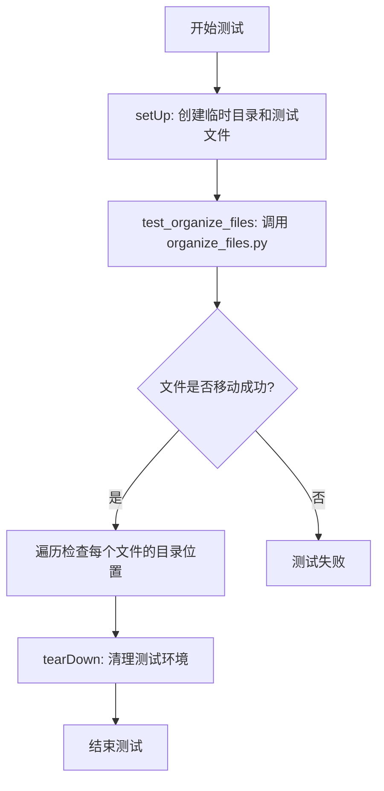
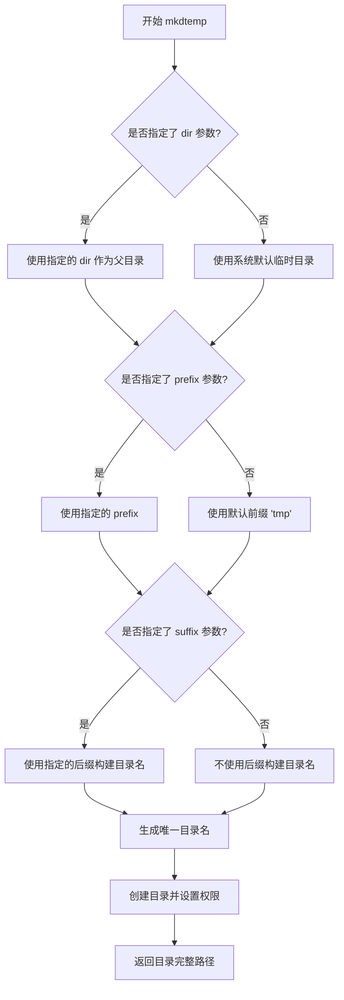
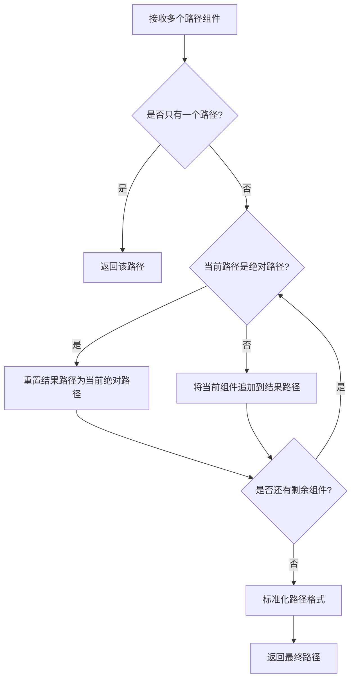
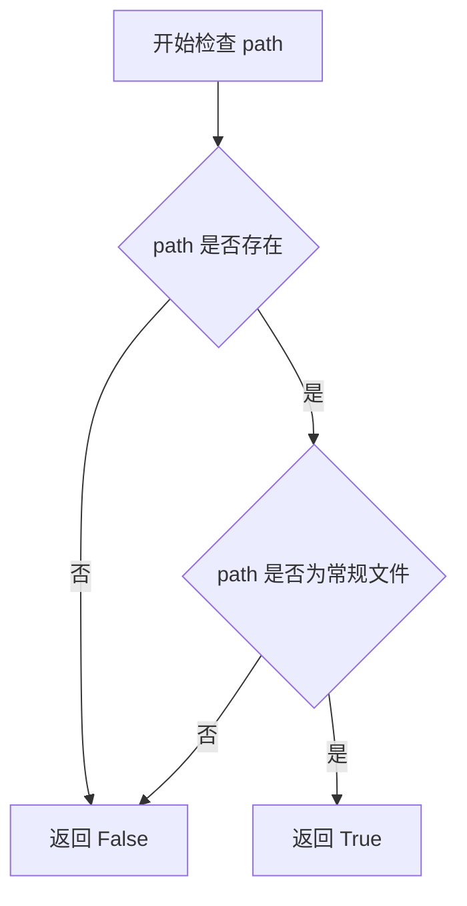
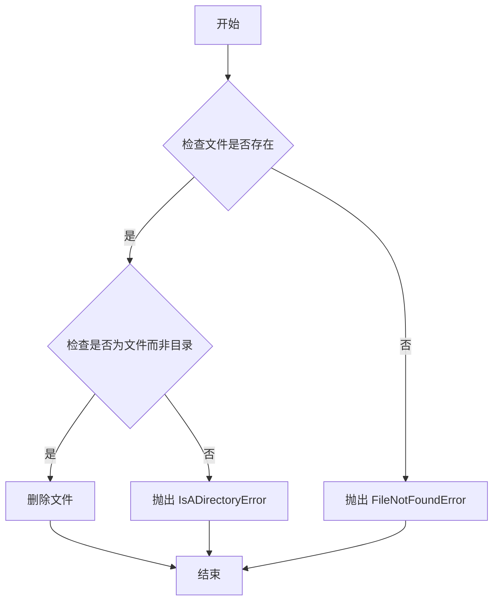
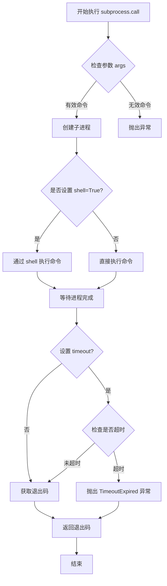
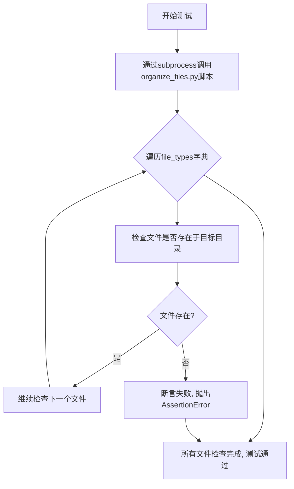
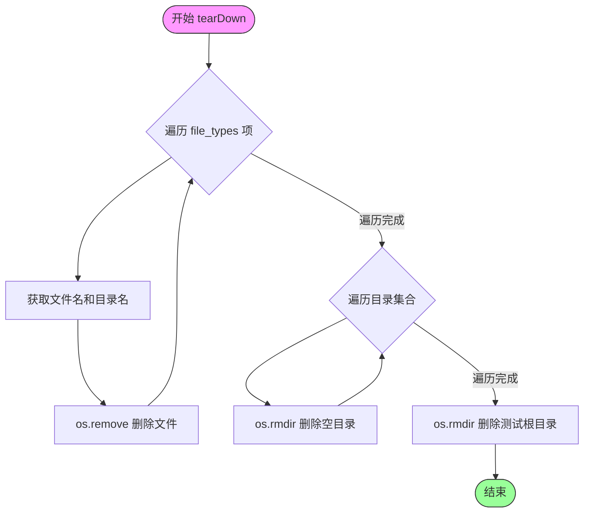

# `.\AutoGPT\classic\benchmark\agbenchmark\challenges\verticals\code\3_file_organizer\custom_python\test.py` 详细设计文档

这是一个单元测试文件，使用 unittest 框架测试 organize_files.py 脚本的文件自动分类功能，验证文件是否能按照预设的映射关系被正确移动到对应的类型目录中。

## 整体流程



## 类结构

```
unittest.TestCase (标准库基类)
└── TestOrganizeFiles (测试类)
```

## 全局变量及字段


### `test_dir`
    
临时测试目录路径

类型：`str`
    


### `file_types`
    
文件名到目标目录的映射字典

类型：`dict`
    


### `TestOrganizeFiles.test_dir`
    
临时测试目录路径

类型：`str`
    


### `TestOrganizeFiles.file_types`
    
文件名到目标目录的映射字典

类型：`dict`
    
    

## 全局函数及方法


### `tempfile.mkdtemp`

创建并返回一个唯一的临时目录，用于在测试执行前准备测试环境。

参数：

- `suffix`：`str`，可选，临时目录名称的后缀
- `prefix`：`str`，可选，临时目录名称的前缀
- `dir`：`str`，可选，临时目录创建的父目录路径

返回值：`str`，新创建的临时目录的完整绝对路径

#### 流程图



#### 带注释源码

```python
# tempfile.mkdtemp 函数实现逻辑（标准库源码简化版）

def mkdtemp(suffix=None, prefix=None, dir=None):
    """
    创建并返回一个唯一的临时目录
    
    参数:
        suffix: 目录名后缀，默认为 None
        prefix: 目录名前缀，默认为 'tmp'
        dir: 父目录路径，默认为系统临时目录
    
    返回值:
        str: 新创建的临时目录完整路径
    """
    
    # 确定基础目录（如果未指定dir，则使用系统临时目录）
    if dir is None:
        import tempfile
        dir = tempfile.gettempdir()
    
    # 构建目录名前缀（默认为'tmp'）
    if prefix is None:
        prefix = 'tmp'
    
    # 使用唯一的文件名生成机制
    # _get_candidate_names() 生成随机后缀确保唯一性
    names = _get_candidate_names()
    
    for seq in names:
        # 组合目录名：prefix + 随机序列 + suffix
        if suffix is not None:
            file_prefix = prefix + seq + suffix
        else:
            file_prefix = prefix + seq
        
        # 完整路径
        file_path = os.path.join(dir, file_prefix)
        
        try:
            # 尝试创建目录（0o700 是推荐的权限，只对所有者可读写执行）
            os.mkdir(file_path, 0o700)
            return file_path  # 成功创建后返回路径
        except FileExistsError:
            # 如果目录已存在，尝试下一个候选名称
            continue
    
    # 如果所有候选名称都失败（极不可能），抛出异常
    raise FileExistsError("无法创建唯一的临时目录")
```


### `os.path.join`

用于将多个路径组件智能地拼接成一个完整的文件系统路径，会根据操作系统自动处理路径分隔符。

参数：

- `*paths`：可变数量的字符串类型参数，表示要拼接的路径组件
  - 类型：`str`
  - 描述：接受一个或多个路径字符串，函数将按照操作系统的规则将它们连接起来

返回值：`str`，返回拼接后的完整路径字符串

#### 流程图



#### 带注释源码

```python
# os.path.join 函数的实现逻辑

def join(*paths):
    """
    智能拼接多个路径组件
    
    参数:
        *paths: 可变数量的路径字符串
    
    返回:
        拼接后的完整路径字符串
    """
    
    # 初始化结果路径为空
    result = ""
    
    # 遍历所有传入的路径组件
    for path in paths:
        # 如果当前路径是绝对路径，重置结果为该绝对路径
        # （绝对路径会替换之前的所有相对路径）
        if isabs(path):
            result = path
        else:
            # 如果结果路径不为空且不以分隔符结尾，添加分隔符
            if result and not result.endswith(sep):
                result += sep
            # 追加当前路径组件
            result += path
    
    # 返回标准化后的路径
    return result


# 在测试代码中的实际使用示例：

# 示例1：在test_dir下创建文件
file_path = os.path.join(self.test_dir, file_name)
# 结果示例：'/tmp/xxx/test_image.png'

# 示例2：检查文件是否在子目录中
full_path = os.path.join(self.test_dir, directory, file_name)
# 结果示例：'/tmp/xxx/images/test_image.png'

# 示例3：删除目录
dir_path = os.path.join(self.test_dir, directory)
# 结果示例：'/tmp/xxx/images'
```


### `os.path.isfile`

检查给定路径是否是一个存在的常规文件（非目录、符号链接、设备文件等）。

参数：

- `path`：`str` 或 `Path`，要检查的文件路径，可以是字符串或 `pathlib.Path` 对象

返回值：`bool`，如果路径存在且是一个常规文件返回 `True`，否则返回 `False`

#### 流程图



#### 带注释源码

```python
# os.path.isfile 函数位于 Python 标准库的 os.path 模块中
# 这是一个简化的实现逻辑展示

def isfile(path):
    """
    检查路径是否为常规文件
    
    参数:
        path: str 或 Path - 要检查的文件路径
    
    返回:
        bool - 如果是常规文件返回 True，否则返回 False
    """
    try:
        # 使用 os.stat() 获取文件状态信息
        # 注意：isfile 不会跟随符号链接（使用 stat 而不是 lstat）
        st = os.stat(path)
        
        # stat_result 对象的 st_mode 属性包含文件类型信息
        # stat.S_ISREG(mode) 检查是否为常规文件
        return stat.S_ISREG(st.st_mode)
    except (OSError, ValueError):
        # 如果文件不存在或路径无效，返回 False
        return False
```

> **注**：上述源码为逻辑展示，实际 `os.path.isfile` 是 C 语言实现的标准库函数，直接调用底层的 `stat()` 系统调用来检查文件类型。


### `os.remove`

删除指定的文件。

参数：

- `path`：`str`，要删除的文件路径，可以是绝对路径或相对路径

返回值：`None`，该函数不返回任何值

#### 流程图



#### 带注释源码

```python
os.remove(path)
# 参数: path - str类型，表示要删除的文件的路径
# 返回值: None
# 功能: 删除指定的文件。如果文件不存在，则抛出 FileNotFoundError 异常
#       如果 path 是一个目录而非文件，则抛出 IsADirectoryError 异常
#       使用前需确保文件存在且具有相应的删除权限
```

---

**在代码中的实际使用示例（来自 `TestOrganizeFiles.tearDown` 方法）：**

```python
def tearDown(self):
    # 删除测试目录及其内容
    for file_name, directory in self.file_types.items():
        # 使用 os.remove 删除测试文件
        os.remove(os.path.join(self.test_dir, directory, file_name))
    for directory in set(self.file_types.values()):
        os.rmdir(os.path.join(self.test_dir, directory))
    os.rmdir(self.test_dir)
```


### `os.rmdir`

删除指定路径的空目录。如果目录非空，则抛出 OSError 异常。该函数是 Python 标准库 os 模块提供的文件系统操作函数。

参数：

- `path`：`str` 或 `bytes`，要删除的目录路径，可以是绝对路径或相对路径

返回值：`None`，操作成功时无返回值；失败时抛出 OSError 异常

#### 流程图

```mermaid
flowchart TD
    A[开始] --> B{检查目录是否存在}
    B -->|是| C{检查目录是否为空}
    B -->|否| D[抛出 FileNotFoundError]
    C -->|是| E[删除目录]
    C -->|否| F[抛出 OSError: [Errno 39] Directory not empty]
    E --> G[结束]
    D --> G
    F --> G
```

#### 带注释源码

```python
# os.rmdir 函数是 Python 标准库 os 模块的一部分
# 用于删除空目录

# 函数原型:
# os.rmdir(path, *, dir_fd=None)

# 参数说明:
# - path: 要删除的目录路径（字符串或字节）
# - dir_fd: (可选) 文件描述符，用于指定相对路径的基准目录

# 使用示例:
import os

# 删除空目录
os.rmdir('/path/to/empty/directory')

# 删除测试目录（在提供的代码中）
for directory in set(self.file_types.values()):
    os.rmdir(os.path.join(self.test_dir, directory))  # 删除子目录
os.rmdir(self.test_dir)  # 删除测试根目录

# 注意事项:
# 1. 目录必须为空，否则会抛出 OSError
# 2. 如果目录不存在，会抛出 FileNotFoundError
# 3. 不能删除当前工作目录
# 4. 在 Windows 上，如果目录被其他进程打开，会导致删除失败
```


### `subprocess.call`

`subprocess.call` 是 Python 标准库中的函数，用于执行外部命令或脚本，并等待其完成。该函数接受一个命令列表（如 `["python", "script.py", "--arg1"]`），在指定的目录中运行，并返回进程的退出码（0 表示成功）。

参数：

- `args`：`list[str] | str`，要执行的命令及其参数列表，或单个字符串（当 shell=True 时）
- `shell`：`bool`，是否通过 shell 执行（默认为 False）
- `cwd`：`str | None`，执行命令时的工作目录
- `timeout`：`float | None`，命令执行的超时时间（秒）
- `input`：`bytes | str | None`，传递给进程的输入
- `encoding`：`str | None`，用于解码输出的编码
- `errors`：`str | None`，编码错误处理策略
- `env`：`dict | None`，环境变量字典
- `restore_signals`：`bool`，是否恢复信号处理器（默认为 True）
- `start_new_session`：`bool`，是否为子进程创建新的进程组（默认为 False）
- `text`：`bool`，是否以文本模式返回输出（默认为 False，等同于 encoding="utf-8"）
- `wait`：`bool`，是否等待进程完成（默认为 True）

返回值：`int`，返回子进程的退出码。0 通常表示成功，非 0 表示错误。

#### 流程图



#### 带注释源码

```python
# 从代码中提取的 subprocess.call 使用示例
subprocess.call(
    ["python", "organize_files.py", "--directory_path=" + self.test_dir]
)

# 参数说明：
# 1. args: ["python", "organize_files.py", "--directory_path=" + self.test_dir]
#    - "python": 要执行的解释器
#    - "organize_files.py": 要运行的脚本文件名
#    - "--directory_path=" + self.test_dir: 传递给脚本的命令行参数
#    注意：这里使用的是列表形式，元素分别为命令和参数

# 返回值说明：
# - 返回值是进程的退出码（int 类型）
# - 0 表示成功执行
# - 非 0 表示执行过程中出现错误

# 执行流程：
# 1. Python 解释器启动一个新的子进程
# 2. 在子进程中执行 organize_files.py 脚本
# 3. 将 self.test_dir 的值作为 --directory_path 参数传递给脚本
# 4. 等待脚本执行完成
# 5. 返回脚本的退出码
```


### `TestOrganizeFiles.setUp`

创建测试前置环境，初始化测试目录和测试文件，为每个测试方法提供独立的测试环境。

参数：

- `self`：`unittest.TestCase`，TestOrganizeFiles 类实例本身，包含测试所需的状态和方法

返回值：`None`，该方法不返回任何值，仅用于初始化测试环境

#### 流程图

```mermaid
flowchart TD
    A[开始 setUp] --> B[调用 tempfile.mkdtemp 创建临时目录]
    B --> C[将临时目录路径存储到 self.test_dir]
    C --> D[定义文件类型映射字典 self.file_types]
    D --> E{遍历 file_name in file.file_types.keys()}
    E --> F[调用 open 创建空测试文件]
    F --> E
    E --> G[结束 setUp]
```

#### 带注释源码

```python
def setUp(self):
    # Create temporary directory
    # 使用 tempfile.mkdtemp() 创建一个唯一的临时目录
    # 返回值是临时目录的绝对路径字符串
    self.test_dir = tempfile.mkdtemp()

    # File types and their corresponding directory
    # 定义测试文件到目标目录的映射关系
    # 键为文件名，值为文件应被移动到的目标目录名
    self.file_types = {
        "test_image.png": "images",
        "test_doc.txt": "documents",
        "test_audio.mp3": "audio",
    }

    # Create test files
    # 遍历文件类型字典的键（文件名）
    # 在临时目录中创建对应的空文件用于测试
    for file_name in self.file_types.keys():
        # 以追加模式打开文件（不存在则创建）然后立即关闭
        # 结果是在临时目录下创建了三个测试文件
        open(os.path.join(self.test_dir, file_name), "a").close()
```


### `TestOrganizeFiles.test_organize_files`

执行文件组织功能的集成测试，通过子进程调用organize_files.py脚本，并验证测试文件是否按文件类型被正确移动到对应的目录中。

参数：

- `self`：实例方法隐含参数，类型为`TestOrganizeFiles`，代表测试类实例本身

返回值：`None`，测试结果通过unittest框架的assertions机制体现，测试通过则无异常抛出，失败则抛出AssertionError

#### 流程图



#### 带注释源码

```python
def test_organize_files(self):
    # 使用subprocess调用organize_files.py脚本,传入测试目录路径
    subprocess.call(
        ["python", "organize_files.py", "--directory_path=" + self.test_dir]
    )

    # 遍历预定义的文件类型映射,验证每个文件是否被移动到正确目录
    for file_name, directory in self.file_types.items():
        self.assertTrue(
            os.path.isfile(os.path.join(self.test_dir, directory, file_name)),
            f"文件 {file_name} 未找到于目标目录 {directory}"
        )
```


### `TestOrganizeFiles.tearDown`

清理测试环境，删除测试过程中创建的临时目录及其所有内容，确保测试后不会遗留文件。

参数：

- `self`：隐式参数，`TestOrganizeFiles` 类实例本身，无需显式传递

返回值：`None`，无返回值

#### 流程图



#### 带注释源码

```python
def tearDown(self):
    # 遍历文件类型字典中的每个文件，删除已移动到子目录的文件
    for file_name, directory in self.file_types.items():
        # 使用 os.remove 删除具体的文件
        # 路径格式：test_dir/子目录/文件名
        os.remove(os.path.join(self.test_dir, directory, file_name))
    
    # 遍历文件类型对应的唯一目录集合，删除所有子目录
    # 使用 set() 获取 self.file_types.values() 的唯一值
    for directory in set(self.file_types.values()):
        # 删除空的子目录（如 images/, documents/, audio/）
        os.rmdir(os.path.join(self.test_dir, directory))
    
    # 最后删除测试创建的临时根目录
    # 此时子目录已全部删除，test_dir 应为空目录
    os.rmdir(self.test_dir)
```

## 关键组件


### TestOrganizeFiles

这是单元测试类，用于测试文件组织功能，通过调用外部organize_files.py脚本来验证文件是否被正确移动到对应类型的目录中。

### setUp

测试前准备方法，创建一个临时目录作为测试环境，并预先创建不同类型的测试文件（图片、文档、音频），同时定义文件类型与目标目录的映射关系。

### test_organize_files

核心测试方法，使用subprocess调用organize_files.py脚本并传入测试目录路径，然后验证每个文件是否被正确移动到对应的目标目录中。

### tearDown

测试后清理方法，负责删除测试过程中创建的子目录和测试文件，最后删除临时测试目录以避免残留文件。

### file_types

文件类型映射字典，定义了三类文件（test_image.png对应images目录、test_doc.txt对应documents目录、test_audio.mp3对应audio目录）。

### test_dir

临时测试目录路径变量，用于存储测试文件的根目录。

### subprocess.call

通过Python子进程模块调用外部organize_files.py脚本的执行方式。


## 问题及建议


### 已知问题

- **硬编码文件类型映射**：`self.file_types` 字典在 setUp 方法中硬编码，缺乏灵活性和可扩展性，扩展新的文件类型需要修改测试代码
- **文件创建方式不安全**：使用 `open(os.path.join(self.test_dir, file_name), "a").close()` 创建文件，未使用 `with` 语句，可能导致文件句柄资源泄漏
- **subprocess 缺乏错误处理**：使用 `subprocess.call()` 执行外部脚本，未捕获返回值或处理 `CalledProcessError`，脚本执行失败时无法获取详细错误信息
- **tearDown 方法健壮性不足**：直接调用 `os.remove()` 和 `os.rmdir()` 假设文件一定会被移动到目标目录，若 organize_files.py 执行失败或文件未移动，清理时会抛出异常导致测试失败
- **测试隔离性差**：测试强依赖外部 `organize_files.py` 脚本存在，若脚本不存在、功能异常或路径错误，测试无法运行
- **硬编码 Python 解释器**：使用字符串 `"python"` 调用解释器，未使用 `sys.executable`，在不同虚拟环境或 Python 版本下可能失败
- **断言缺乏详细信息**：`assertTrue` 未提供自定义错误消息，测试失败时难以快速定位问题
- **目录清理逻辑缺陷**：先删除文件再删除目录，但若某些文件未被移动或目录创建失败，清理会中断且不会抛出明确错误
- **未验证脚本执行结果**：未检查脚本的输出、返回值或错误流，无法区分脚本是成功执行还是静默失败

### 优化建议

- 将文件类型映射改为从配置文件或外部参数读取，提高测试可配置性
- 使用 `with open()` 语句确保文件句柄正确关闭，或使用 `Path.touch()` 方法创建文件
- 使用 `subprocess.run()` 替代 `subprocess.call()`，捕获 stdout/stderr 和 returncode，并添加超时控制
- 在 tearDown 中添加异常处理，使用 `shutil.rmtree()` 清理目录以确保完全清理，即使部分文件/目录不存在也能正常完成清理
- 在测试前检查 `organize_files.py` 是否存在，不存在时给出明确错误提示
- 使用 `sys.executable` 动态获取当前 Python 解释器路径：`f"{sys.executable}"` 或 `["python", ...]` 改为 `[sys.executable, ...]
- 为断言添加描述性错误消息，例如 `self.assertTrue(..., f"文件 {file_name} 未移动到 {directory} 目录")`
- 先使用 `shutil.rmtree(self.test_dir, ignore_errors=True)` 清理，再重建目录，确保清理操作幂等
- 使用 `subprocess.run()` 的 `capture_output=True` 参数记录脚本执行日志，便于调试失败原因

## 其它


### 设计目标与约束

本测试代码的核心目标是通过单元测试验证 organize_files.py 脚本能够根据文件类型（扩展名）将文件自动移动到对应目录的功能。设计约束包括：测试必须在隔离的临时目录环境中执行，测试完成后必须清理所有创建的文件和目录以避免环境污染，测试通过 subprocess 调用外部脚本而非直接导入，以确保测试的独立性和真实性。

### 错误处理与异常设计

测试代码本身的错误处理主要依赖于 unittest 框架的 setUp 和 tearDown 方法。在 setUp 阶段，如果临时目录创建失败或文件创建失败，unittest 会自动报告异常。tearDown 阶段使用 os.remove 和 os.rmdir 删除文件和目录时未进行异常捕获，可能导致清理不完整时的隐式失败。organize_files.py 脚本的错误处理无法从此测试代码中直接观察，需要查看该脚本的实现。

### 数据流与状态机

测试数据流分为三个阶段：准备阶段（setUp）创建临时目录和测试文件、执行阶段（test_organize_files）通过子进程调用脚本并验证文件移动结果、清理阶段（tearDown）删除所有创建的目录和文件。状态转换如下：初始状态为空目录 → setUp 后状态为包含3个测试文件 → 调用脚本后状态为文件已按类型分配到子目录 → tearDown 后恢复到初始空目录。

### 外部依赖与接口契约

测试代码依赖以下外部组件：Python 标准库 os、subprocess、tempfile、unittest；外部脚本 organize_files.py（通过命令行接口调用，参数为 --directory_path）。organize_files.py 必须实现的接口契约：接受 --directory_path 参数作为要整理的目录路径，根据文件扩展名将文件移动到 images、documents、audio 三个子目录中，返回 0 表示成功。

### 性能考虑

当前测试未包含性能测试。由于使用 subprocess 调用外部 Python 解释器，每次测试调用都会产生进程创建开销。临时文件创建使用 open().close() 创建空文件，对于大规模文件处理场景的性能表现无法从此测试中评估。

### 安全性考虑

测试代码存在潜在安全风险：subprocess.call 直接使用字符串拼接构建命令行参数（--directory_path= + self.test_dir），虽然此场景下测试目录路径可信，但若未来改为接受用户输入可能导致命令注入漏洞。测试使用 tempfile.mkdtemp 创建临时目录，在高并发场景下可能存在竞态条件风险。

### 兼容性考虑

测试代码依赖 Python 2.7+（subprocess.call 在 Python 2 和 3 中均可使用）。organize_files.py 脚本的兼容性需要单独评估。测试假设目标脚本使用 --directory_path= 格式传递参数，若脚本使用 --directory_path 或其他格式将导致测试失败。

### 测试覆盖范围

当前测试仅覆盖核心功能路径：文件按类型正确移动到对应目录。未覆盖的测试场景包括：空目录处理、已存在目标目录时的行为、重复运行时的行为、特殊字符文件名处理、符号链接处理、子目录递归处理、无效参数处理、脚本返回非零退出码的情况。

### 假设与前提条件

本设计文档基于以下假设：organize_files.py 脚本位于测试代码相同工作目录；系统中已安装 Python 可执行命令；test_image.png、test_doc.txt、test_audio.mp3 分别对应 images、documents、audio 目录分类；目标脚本不修改测试文件的内容仅进行移动操作。
    