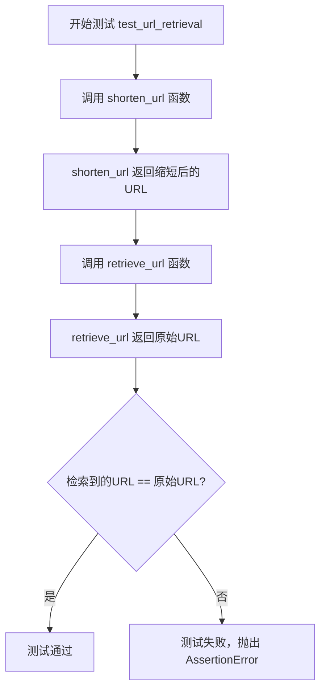
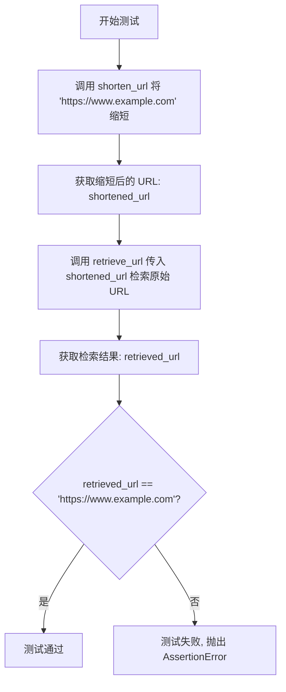

# `.\AutoGPT\classic\benchmark\agbenchmark\challenges\verticals\code\4_url_shortener\artifacts_out\test.py` 详细设计文档

这是一个使用Python unittest框架编写的单元测试文件，用于验证URL缩短服务的核心功能：确保通过shorten_url函数缩短的URL能够通过retrieve_url函数正确检索回原始URL。

## 整体流程



## 类结构

```
unittest.TestCase (Python标准库)
└── TestURLShortener (测试类)
```

## 全局变量及字段


    

## 全局函数及方法


### `TestURLShortener.test_url_retrieval`

该方法是一个单元测试用例，用于验证URL缩短服务的检索功能是否正常工作。它首先将原始URL缩短，然后通过缩短后的URL检索原始URL，并断言检索结果与原始URL一致。

参数： 无

返回值：`None`，该方法为测试用例，无返回值，通过 `self.assertEqual` 断言验证逻辑

#### 流程图



#### 带注释源码

```python
def test_url_retrieval(self):
    """
    测试 URL 检索功能
    验证通过缩短后的 URL 能够正确检索到原始 URL
    """
    
    # Step 1: 使用 shorten_url 函数将原始 URL 缩短
    # 调用项目中的 shorten_url 方法，传入原始 URL
    shortened_url = shorten_url("https://www.example.com")

    # Step 2: 使用 retrieve_url 函数通过缩短后的 URL 检索原始 URL
    # 将上一步得到的 shortened_url 传入 retrieve_url 方法
    retrieved_url = retrieve_url(shortened_url)

    # Step 3: 断言验证检索结果与原始 URL 是否一致
    # 使用 unittest 的 assertEqual 方法进行断言
    # 参数: 实际值, 期望值, 失败时的提示信息
    self.assertEqual(
        retrieved_url,                          # 实际检索到的 URL
        "https://www.example.com",              # 期望的原始 URL
        "Retrieved URL does not match the original!",  # 断言失败提示信息
    )
```

## 关键组件


### URL缩短模块 (url_shortener)

提供URL缩短和检索功能的模块，包含shorten_url和retrieve_url两个核心函数，用于将长URL转换为短URL并根据短URL检索原始URL。

### shorten_url 函数

将长URL转换为短URL的函数，接受原始URL字符串作为输入，返回缩短后的URL字符串。

### retrieve_url 函数

根据缩短后的URL检索原始URL的函数，接受短URL字符串作为输入，返回原始的长URL字符串。

### TestURLShortener 测试类

unittest.TestCase的子类，用于测试URL缩短服务的正确性，验证retrieve_url能够正确根据短URL还原原始URL。

### test_url_retrieval 测试方法

具体的测试用例，通过调用shorten_url创建短URL，然后使用retrieve_url检索原始URL，并断言两者相等。


## 问题及建议


### 已知问题

- **缺少测试隔离机制**：测试直接使用生产环境的 URL 缩短服务，没有使用 mock 或隔离的测试环境，可能导致测试之间相互影响
- **无清理机制**：测试创建的短 URL 没有对应的清理逻辑（teardown），可能导致测试数据残留
- **测试覆盖不足**：仅覆盖基本功能路径，缺少边界条件、异常情况和错误处理的测试用例（如无效 URL、不存在的短码、网络错误等）
- **硬编码测试数据**：使用硬编码的 URL "https://www.example.com"，缺乏参数化测试
- **缺少异步测试支持**：若底层服务支持异步操作，当前同步测试无法覆盖异步场景

### 优化建议

- 引入 `setUp` 和 `tearDown` 方法确保测试环境清理，或使用 mock 隔离外部依赖
- 增加边界条件测试：空字符串、非法 URL 格式、超长 URL、特殊字符等
- 增加异常场景测试：检索不存在的短码、网络异常、数据库连接失败等
- 使用 `@parameterized.expand` 或 pytest 参数化实现多 URL 测试用例
- 若 `url_shortener` 模块支持异步，引入 `unittest.IsolatedAsyncioTestCase` 或 pytest-asyncio 进行异步测试
- 考虑添加性能基准测试，确保缩短和检索操作在合理时间内完成
- 封装测试数据为常量或 fixture，提高测试可维护性

## 其它


### 设计目标与约束

本测试文件的设计目标为验证URL缩短服务的核心功能正确性，确保shorten_url和retrieve_url两个核心函数能够正确地进行URL的缩短和恢复操作。测试采用端到端的方式，从缩短URL到检索原始URL形成完整的功能验证链路。测试约束包括仅覆盖基本的正向流程，未包含异常输入、并发场景、性能基准等测试维度。

### 错误处理与异常设计

当前测试代码未涉及显式的异常处理测试场景。测试假设shorten_url和retrieve_url函数在正常输入下总能返回预期结果。缺失的测试场景包括：空字符串输入、None值输入、非法URL格式、超长URL、重复调用同一URL的行为一致性、网络超时或存储异常情况下的错误返回机制。建议补充测试用例验证两个函数在异常输入时的行为是否符合预期的错误处理设计。

### 数据流与状态机

测试数据流从原始URL "https://www.example.com" 开始，流经shorten_url函数生成短链接标识符，再通过retrieve_url函数将短链接标识符转换回原始URL。数据流中的关键状态转换包括：原始URL状态 → 缩短请求 → 短链接标识状态 → 检索请求 → 原始URL状态。测试隐含假设该状态转换为确定性的可逆过程，未验证中间状态的持久化、过期机制或多版本URL映射关系。

### 外部依赖与接口契约

本测试文件依赖url_shortener模块中的两个导出函数：shorten_url(url: str) -> str 和 retrieve_url(shortened_url: str) -> str。接口契约隐含要求：shorten_url接收标准URL字符串并返回可作为URL访问的短链接字符串；retrieve_url接收短链接字符串并返回原始完整URL。两个函数的实现细节未在测试中体现，可能依赖外部存储服务、哈希算法或第三方短链接服务。测试未验证依赖服务的可用性、版本兼容性或接口变更影响。

### 测试覆盖率分析

当前测试仅覆盖最基本的功能路径，属于正向流程的Happy Path测试。测试覆盖率在逻辑分支、边界条件、错误处理等方面存在明显空白。未覆盖的测试场景包括：URL格式验证、特殊字符处理、重复缩短同一URL的行为、短链接有效性验证、URL过期场景、超时处理、并发访问冲突等。建议建立完整的测试矩阵以提升测试覆盖率和代码质量保障。

### 安全性考虑

测试代码本身不涉及敏感数据处理，但测试场景未包含安全性相关的验证维度。建议补充的测试内容包括：URL注入攻击防护、恶意输入过滤、存储注入风险、短链接冲突检测机制、敏感信息泄露检查等。测试数据使用硬编码的示例域名，建议改为使用测试专用域名或mock服务以避免对外部真实服务的影响。

### 性能基准与约束

测试未包含任何性能基准测试或性能约束验证。建议补充的测试维度包括：shorten_url和retrieve_url函数的响应时间基准、批量操作性能、内存占用情况、存储效率等。当前测试无法发现性能退化或资源泄漏问题。

### 并发与线程安全

测试采用串行执行方式，未验证在多线程或并发调用场景下的行为正确性。如果url_shortener模块内部使用共享状态或外部存储，需补充并发测试以验证线程安全性和数据一致性。缺失的测试场景包括：多个线程同时调用shorten_url处理同一URL、并发调用retrieve_url、同时进行缩短和检索操作等。

### 配置管理与环境依赖

测试代码未包含任何配置管理机制，所有测试数据直接硬编码。建议将测试URL、环境参数、超时设置等提取为配置项，便于在不同测试环境间切换。测试依赖同目录下的url_shortener模块，采用相对导入方式，要求模块存在于正确的包结构中。

### 日志与监控

测试执行过程中未产生任何日志输出，无法追踪测试执行细节或定位失败原因。建议在测试关键节点添加日志记录，包括测试开始时间、URL缩短请求、检索请求、测试结果等。失败测试应输出足够的上下文信息便于问题诊断。

### 代码组织与模块化

当前测试类仅包含一个测试方法test_url_retrieval，遵循一个测试函数对应一个测试方法的单元测试最佳实践。但测试逻辑将缩短和检索两个独立操作合并在单个测试中，建议拆分为独立的测试方法分别验证各函数功能，提高测试粒度和故障定位能力。
</think>
    