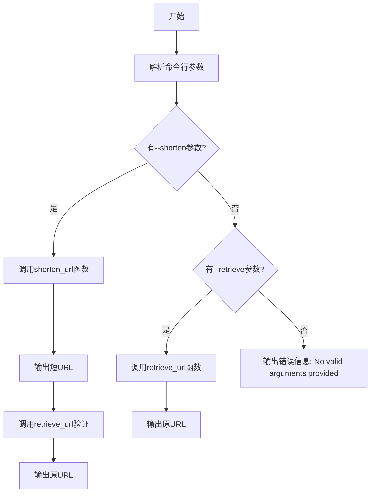
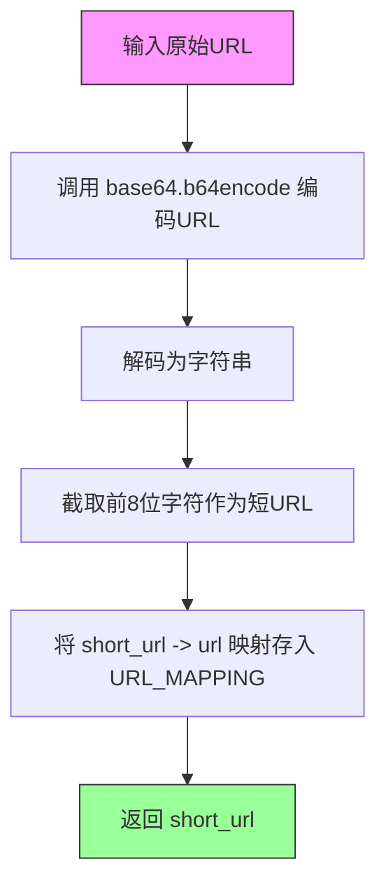
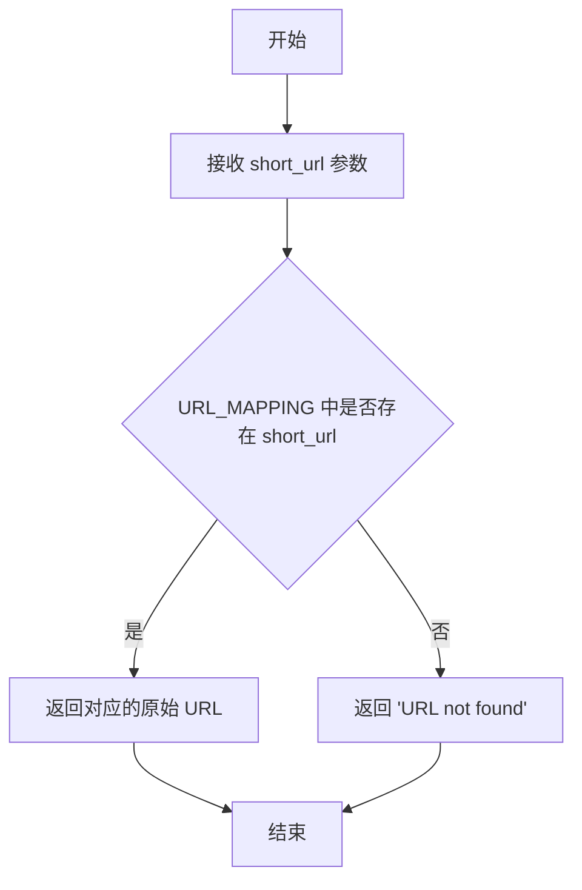
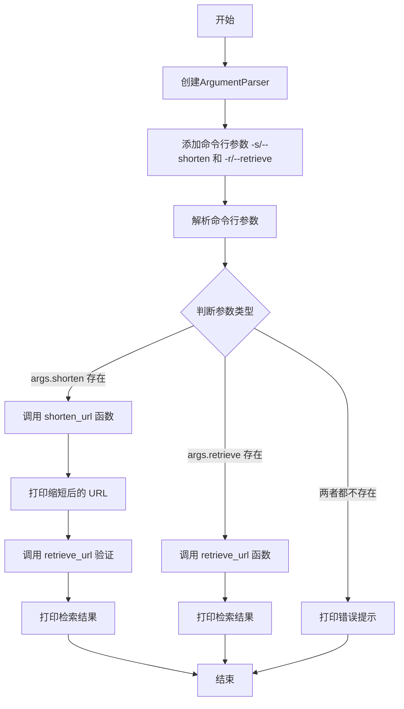

# `.\AutoGPT\classic\benchmark\agbenchmark\challenges\verticals\code\4_url_shortener\artifacts_out\url_shortener.py` 详细设计文档

一个简单的URL缩短服务，通过base64编码将长URL转换为短URL，并提供命令行接口进行URL的缩短和检索操作。

## 整体流程



## 类结构

```
模块级
├── 全局变量
│   └── URL_MAPPING
├── 全局函数
│   ├── shorten_url
│   └── retrieve_url
└── 主函数
    └── main
```

## 全局变量及字段


### `URL_MAPPING`
    
全局字典变量，用于存储短URL与原始URL之间的映射关系，键为短URL，值为原始URL

类型：`dict`
    


    

## 全局函数及方法


### `shorten_url`

该函数接收一个原始 URL 字符串，通过 base64 编码后取前 8 位作为短 URL，并将映射关系存储到全局字典 `URL_MAPPING` 中，最后返回生成的短 URL。

参数：

- `url`：`str`，需要缩短的原始 URL 字符串

返回值：`str`，缩短后的 URL（base64 编码后的前 8 位字符）

#### 流程图



#### 带注释源码

```python
def shorten_url(url):
    # 将原始URL转换为base64编码的字节串，再解码为字符串
    encoded_url = base64.b64encode(url.encode()).decode()
    # 取编码后字符串的前8个字符作为短URL标识
    short_url = encoded_url[:8]
    # 在全局字典中建立短URL到原始URL的映射关系
    URL_MAPPING[short_url] = url
    # 返回生成的短URL
    return short_url
```


### `retrieve_url`

根据给定的短 URL 从全局映射字典中检索对应的原始 URL，如果未找到则返回提示信息。

参数：

- `short_url`：`str`，需要检索的短 URL 字符串

返回值：`str`，如果存在则返回原始 URL，否则返回 "URL not found"

#### 流程图



#### 带注释源码

```python
def retrieve_url(short_url):
    """
    根据短URL检索原始URL
    
    参数:
        short_url: str, 需要检索的短URL字符串
        
    返回:
        str: 原始URL字符串，如果未找到则返回 'URL not found'
    """
    # 从全局字典 URL_MAPPING 中查找短URL对应的原始URL
    # 使用字典的 get 方法，如果键不存在则返回默认值 "URL not found"
    return URL_MAPPING.get(short_url, "URL not found")
```


### `main`

这是程序的入口函数，负责解析命令行参数并根据用户提供的选项（缩短 URL 或检索 URL）调用相应的处理函数。

参数：该函数没有参数。

返回值：`None`，无返回值。

#### 流程图



#### 带注释源码

```python
def main():
    """
    程序入口函数，负责解析命令行参数并执行 URL 缩短或检索操作。
    """
    # 创建命令行参数解析器，添加程序描述
    parser = argparse.ArgumentParser(description="URL Shortener")
    
    # 添加 -s/--shorten 参数，用于指定需要缩短的 URL
    parser.add_argument("-s", "--shorten", type=str, help="URL to be shortened")
    
    # 添加 -r/--retrieve 参数，用于指定需要检索的短 URL
    parser.add_argument("-r", "--retrieve", type=str, help="Short URL to be retrieved")
    
    # 解析命令行传入的参数
    args = parser.parse_args()
    
    # 根据参数执行相应操作
    if args.shorten:
        # 用户提供了需要缩短的 URL
        shortened_url = shorten_url(args.shorten)  # 调用 shorten_url 生成短链接
        print(shortened_url)  # 输出短链接
        # 立即使用刚生成的短链接进行验证检索
        print(retrieve_url(shortened_url))  # 调用 retrieve_url 验证并输出原 URL
    elif args.retrieve:
        # 用户提供了需要检索的短 URL
        print(retrieve_url(args.retrieve))  # 调用 retrieve_url 获取原始 URL
    else:
        # 用户未提供有效参数
        print("No valid arguments provided.")
```

## 关键组件


### URL 映射存储 (URL_MAPPING)

全局字典，用于存储短URL与原始URL之间的映射关系，作为应用的状态持久化机制。

### 短URL生成函数 (shorten_url)

接收原始URL，通过Base64编码后取前8位生成短URL，并将映射关系存入全局字典。返回生成的短URL。

### URL检索函数 (retrieve_url)

根据短URL在全局映射中查找对应的原始URL，若未找到则返回提示信息。

### 命令行入口函数 (main)

解析命令行参数，支持-s/--shorten参数进行URL缩短，以及-r/--retrieve参数进行URL还原。根据参数调用相应功能并输出结果。


## 问题及建议


### 已知问题

-   **数据持久化缺失**：`URL_MAPPING` 仅存储在内存中，程序退出后所有数据丢失，无法实现长期存储
-   **URL碰撞风险**：仅取 base64 编码的前 8 位作为短 URL，不同长 URL 可能产生相同的短 URL，导致原始 URL 被覆盖
-   **编码字符问题**：base64 编码结果包含 `+`、`/`、`=` 特殊字符，在 URL 传输和存储中可能引起兼容性问题
-   **缺乏输入验证**：未对输入的 URL 格式进行有效性校验，可能接受无效的 URL
- **命令行参数冲突**：支持同时传递 `-s` 和 `-r` 参数，但代码逻辑只处理其中一个，缺少互斥约束
- **线程安全问题**：`URL_MAPPING` 字典在多线程环境下访问存在竞态条件风险
- **缺乏错误处理**：base64 编码及字典操作均无异常捕获机制
- **输出冗余**：在 shorten 模式下会额外打印 retrieve 结果，不符合单一职责原则

### 优化建议

-   引入持久化存储方案（如 SQLite、JSON 文件或数据库）以保存 URL 映射关系
-   采用更可靠的短 URL 生成策略（如 UUID、自增 ID 或哈希 + 冲突检测机制）避免碰撞
-   使用 URL 安全的 base64 编码（替换 `+` 为 `-`，`/` 为 `_`，去除 `=`）或改用哈希算法
-   添加 URL 格式正则校验，确保输入符合 URL 规范
-   使用 argparse 的 `mutually_exclusive_group` 约束 `-s` 和 `-r` 参数互斥
-   如需支持多线程访问，使用线程安全的数据结构（如 `threading.Lock` 保护字典）或改用线程安全的存储
-   添加 try-except 块捕获可能的异常，提升程序健壮性
-   移除 shorten 后自动 retrieve 的逻辑，或将其作为独立功能选项，提供清晰的输出结果
-   考虑添加日志记录功能，便于问题追踪和系统监控

## 其它


### 设计目标与约束

本代码旨在实现一个简单的命令行URL缩短服务，采用base64编码方式生成短链接。设计约束包括：无持久化存储（仅内存存储）、无并发控制、无用户认证机制、仅支持基本的缩短和检索功能。

### 错误处理与异常设计

代码错误处理较为简单，主要通过条件判断处理参数缺失和URL映射不存在的情况。shorten_url函数使用base64.b64encode可能抛出UnicodeEncodeError（当URL包含无法编码的字符）；retrieve_url在找不到短链接时返回"URL not found"字符串而非抛出异常；main函数通过argparse的type参数验证输入类型，但缺乏对URL格式的有效性校验。

### 数据流与状态机

数据流为：用户输入URL → shorten_url函数 → base64编码 → 截取前8字符 → 存储到URL_MAPPING字典 → 返回短链接。检索流程为：用户输入短链接 → retrieve_url函数 → 字典查找 → 返回原URL或错误信息。状态机包含两个主要状态：待缩短状态和待检索状态，通过命令行参数区分。

### 外部依赖与接口契约

外部依赖包括Python标准库：argparse（命令行参数解析）、base64（URL编码）、encode()方法（字符串转字节）。接口契约方面：shorten_url接收str类型URL返回str类型短链接；retrieve_url接收str类型短链接返回str类型原URL或错误信息；命令行接口通过-s/-shorten参数执行缩短，通过-r/--retrieve参数执行检索。

### 安全性考虑

代码存在以下安全隐患：URL_MAPPING为全局可变对象，无访问控制；base64编码为可逆编码，非真正加密，原URL可轻易还原；无输入验证，恶意构造的URL可能导致问题；内存存储易丢失，重启后数据清空；无速率限制，可能被滥用。

### 性能考虑

性能特征包括：base64编码时间复杂度O(n)，n为URL长度；字典查找时间复杂度O(1)；短链接长度固定为8字符。无缓存机制、无连接池、无并发处理，高并发场景下URL_MAPPING字典操作存在竞态条件。

### 扩展性设计

当前设计扩展性受限：无法添加新的编码算法（硬编码base64）；无法添加持久化存储层；无法实现分布式部署（内存存储）；无法扩展更多URL缩短策略；无插件机制。改进方向应考虑引入抽象层、策略模式、持久化接口等。

### 使用示例与运行要求

运行要求：Python 3.6+环境，无需额外安装依赖。使用示例：缩短URL命令"python script.py -s https://example.com/very/long/url"；检索URL命令"python script.py -r MzExNDMy"；无参数运行显示帮助信息。

    