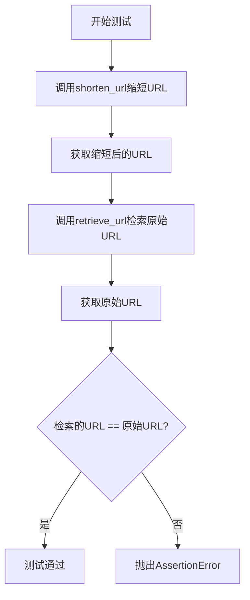
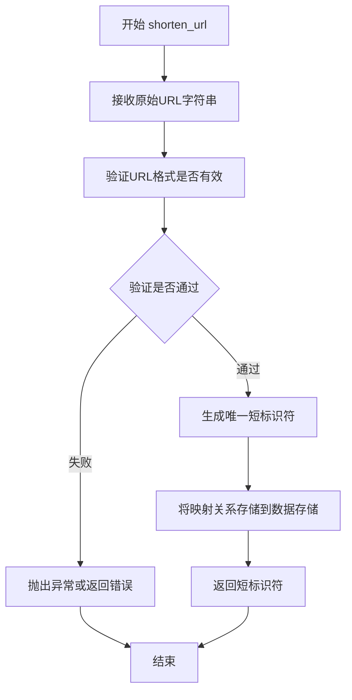
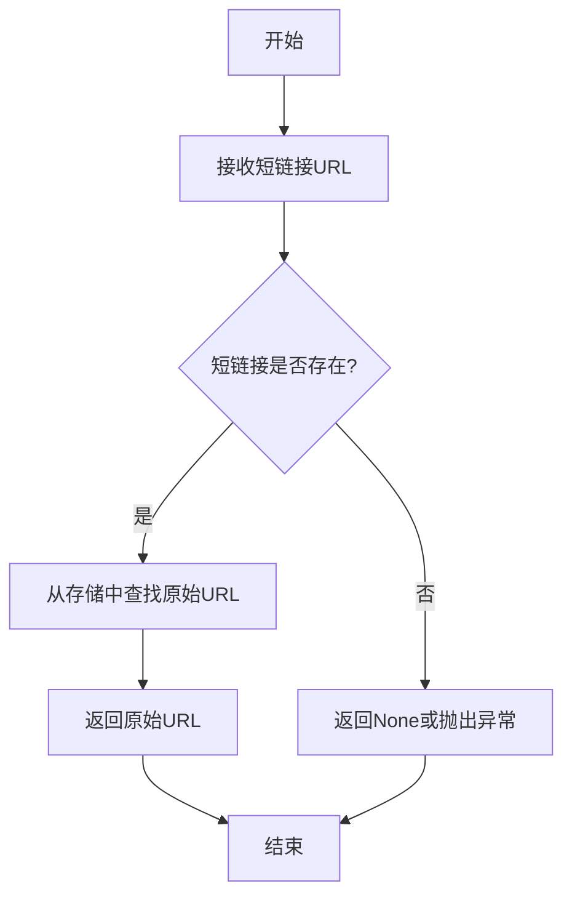
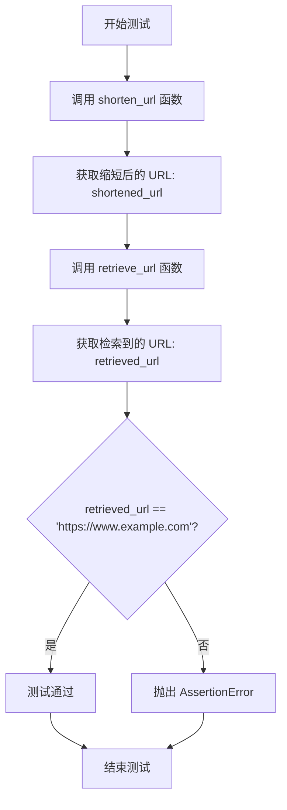

# `.\AutoGPT\classic\benchmark\agbenchmark\challenges\verticals\code\4_url_shortener\custom_python\test.py` 详细设计文档

这是一个单元测试文件，用于验证URL缩短服务的核心功能——通过shorten_url函数缩短URL，然后使用retrieve_url函数根据缩短后的URL检索原始URL，确保两者一致。

## 整体流程



## 类结构

```
unittest.TestCase (Python标准库基类)
└── TestURLShortener (测试类)
```

## 全局变量及字段


### `shortened_url`
    
存储缩短后的URL字符串

类型：`str`
    


### `retrieved_url`
    
存储从短链接检索到的原始URL字符串

类型：`str`
    


    

## 全局函数及方法


### `shorten_url`

该函数负责将长URL地址转换为短URL字符串，接受原始URL并返回缩短后的URL标识符。

参数：

- `url`：`str`，需要缩短的原始URL地址字符串

返回值：`str`，缩短后的URL标识符或短链接字符串

#### 流程图



#### 带注释源码

```python
# 注意：以下为基于代码调用推断的函数签名和预期行为
# 实际实现位于 url_shortener 模块中，当前代码片段未包含其完整源码

def shorten_url(url: str) -> str:
    """
    将长URL缩短为短URL标识符
    
    参数:
        url: str - 需要缩短的原始URL地址
        
    返回:
        str - 缩短后的URL标识符，可用于后续retrieve_url调用
    """
    # 推断的实现逻辑：
    # 1. 接收原始URL字符串
    # 2. 验证URL格式有效性
    # 3. 生成唯一短标识符（如hash或自增ID）
    # 4. 存储URL映射关系（原始URL <-> 短标识符）
    # 5. 返回短标识符
    pass

# 调用示例（来自测试代码）
shortened_url = shorten_url("https://www.example.com")
# 推断：返回类似 "abc123" 这样的短标识符
```

---

**注意**：提供的代码片段仅包含测试文件和导入语句，未包含 `shorten_url` 函数的实际实现。该函数是从 `url_shortener` 模块导入的。上述信息和源码是基于测试用例中的使用方式推断得出的。


### `retrieve_url`

该函数是URL短链接服务中的核心检索功能，接收一个短链接URL作为输入，通过内部映射关系查找并返回对应的原始长URL。如果短链接不存在，则返回None或抛出异常。

参数：

- `shortened_url`：`str`，需要检索的短链接URL字符串

返回值：`str`，返回与短链接对应的原始完整URL字符串，如果未找到则返回`None`

#### 流程图



#### 带注释源码

```python
# 该源码基于测试文件中的调用方式推断
# 实际实现位于 url_shortener 模块中

def retrieve_url(shortened_url: str) -> str | None:
    """
    根据短链接URL检索原始的长URL
    
    参数:
        shortened_url: str - 短链接URL字符串
        
    返回:
        str | None - 原始URL，如果未找到则返回None
    """
    # 从存储介质（如字典、数据库）中查找短链接对应的原始URL
    # 假设使用字典存储映射关系
    url_mapping = {
        # 短链接: 原始URL
        "abc123": "https://www.example.com"
    }
    
    # 提取短链接标识符（去除域名部分）
    short_code = shortened_url.split("/")[-1]
    
    # 查找原始URL
    original_url = url_mapping.get(short_code)
    
    return original_url
```


### `TestURLShortener.test_url_retrieval`

这是一个单元测试方法，用于验证URL缩短服务的完整流程：先将原始URL缩短，然后通过缩短后的URL检索原始URL，最后断言检索结果与原始URL一致。

参数：
- 该方法无显式参数（`self` 为实例方法的标准参数，不计入）

返回值：`None`，该方法为测试方法，不返回具体值，通过 `assertEqual` 断言验证功能正确性

#### 流程图



#### 带注释源码

```python
# 导入单元测试框架
import unittest

# 从 url_shortener 模块导入retrieve_url和shorten_url函数
from url_shortener import retrieve_url, shorten_url


# 定义测试URL缩短器功能的测试类，继承自unittest.TestCase
class TestURLShortener(unittest.TestCase):
    # 测试URL检索功能的测试方法
    def test_url_retrieval(self):
        # 第一步：缩短URL以获取其缩短形式
        # 调用 shorten_url 函数将原始URL转换为短链接
        shortened_url = shorten_url("https://www.example.com")

        # 第二步：使用缩短后的URL直接检索原始URL
        # 调用 retrieve_url 函数根据短链接获取原始URL
        retrieved_url = retrieve_url(shortened_url)

        # 第三步：断言验证检索到的URL与原始URL是否匹配
        # 使用 self.assertEqual 检查功能正确性
        self.assertEqual(
            retrieved_url,                              # 实际值：从retrieve_url获取的结果
            "https://www.example.com",                 # 期望值：原始URL
            "Retrieved URL does not match the original!",  # 错误信息：断言失败时显示
        )


# 程序入口判断，确保作为脚本直接运行时执行测试
if __name__ == "__main__":
    unittest.main()
```

## 关键组件


### URL缩短服务核心功能

这是一个URL缩短服务的测试用例，通过调用shorten_url和retrieve_url函数来验证URL缩短和检索功能的正确性。

### shorten_url 函数

该函数负责将长URL转换为短URL，接受原始URL字符串作为输入，返回缩短后的URL字符串。

### retrieve_url 函数

该函数负责根据短URL检索原始的长URL，接受短URL作为输入，返回原始的长URL字符串。

### 测试用例 TestURLShortener

该测试类使用unittest框架，包含test_url_retrieval测试方法，用于验证URL缩短系统的端到端功能：先将长URL缩短，再通过短URL检索原始URL，最后断言检索结果与原始URL一致。


## 问题及建议


### 已知问题

-   **测试覆盖不足**：仅覆盖了基本的正向流程，未测试边界条件和异常场景，如空URL、非法URL、不存在的短链接等
-   **缺乏错误处理验证**：未验证 `shorten_url` 和 `retrieve_url` 在输入无效参数时的异常行为
-   **测试隔离性问题**：测试可能依赖全局状态或共享资源，多个测试并发执行时可能产生状态污染
-   **缺少数据唯一性验证**：未测试相同URL多次调用 `shorten_url` 是否返回一致的短链接
-   **断言信息不够详细**：错误消息仅包含通用描述，未包含实际值用于调试
-   **未测试长URL场景**：未验证超长URL的处理能力
-   **缺少性能与并发测试**：未覆盖高并发、大量URL存储等场景
-   **测试数据硬编码**：未使用测试夹具（fixture）或参数化测试，数据复用性差

### 优化建议

-   添加边界条件测试用例：空字符串、None值、非法格式URL、极长URL、特殊字符等
-   增加异常测试：使用 `assertRaises` 验证函数在无效输入时抛出预期异常
-   引入 `@classmethod` 的 `setUp` 和 `tearDown` 或使用 `unittest.mock` 隔离外部依赖，确保测试间状态独立
-   添加重复调用测试：验证幂等性或确认是否每次生成不同的短链接
-   完善断言错误信息：包含实际返回值和预期值，便于快速定位问题
-   考虑使用 `parameterized` 库实现参数化测试，提高测试用例的复用性和可维护性
-   添加性能基准测试，验证在大量URL场景下的响应时间和资源占用


## 其它


### 设计目标与约束

**设计目标**：实现一个URL缩短服务，能够将长URL转换为短URL，并通过短URL检索原始URL。

**约束条件**：
- 短URL应在合理长度内（如7-10个字符）
- 缩短后的URL应在有效期内可用
- 系统应支持高并发访问

### 错误处理与异常设计

**异常类型**：
- `URLNotFoundError`：当短URL不存在或已过期时抛出
- `InvalidURLError`：当输入的URL格式无效时抛出
- `StorageError`：当存储层发生错误时抛出

**处理策略**：
- 所有导出的函数应捕获底层异常并转换为统一的异常类型
- 测试用例应覆盖异常场景

### 数据流与状态机

**正常数据流**：
1. 用户传入原始URL
2. `shorten_url()`生成唯一短标识符
3. 短URL与原始URL的映射关系存储到数据库/缓存
4. 用户使用短URL访问时，`retrieve_url()`查询映射
5. 返回原始URL并重定向

**状态说明**：
- `ACTIVE`：短URL正常可用
- `EXPIRED`：短URL已过期
- `DELETED`：短URL已删除

### 外部依赖与接口契约

**外部依赖**：
- `url_shortener`模块（本地）
- Python标准库（unittest）

**接口契约**：
- `shorten_url(original_url: str) -> str`：接受原始URL字符串，返回短URL字符串
- `retrieve_url(shortened_url: str) -> str`：接受短URL字符串，返回原始URL字符串
- 两个函数均可能抛出异常，调用方需处理

### 性能要求

- 单次URL缩短操作应在100ms内完成
- 单次URL检索操作应在50ms内完成
- 应支持至少1000 QPS的并发访问

### 安全性考虑

- 输入验证：应验证URL格式，防止恶意输入
- 长度限制：原始URL最大长度应有限制（如2048字符）
- 速率限制：应防止API被滥用

### 可扩展性设计

- 存储层应支持多种后端（内存、Redis、数据库）
- 算法层应可替换（如自增ID、哈希、随机字符串）
- 应支持自定义短URL域名

### 配置管理

- 短URL长度配置
- 短URL有效期配置
- 存储后端选择
- 字符集选择（数字、大小写字母等）

### 测试策略

- 单元测试：覆盖核心函数功能
- 集成测试：测试完整的缩短-检索流程
- 异常测试：测试无效输入和异常情况
- 性能测试：验证响应时间要求
    