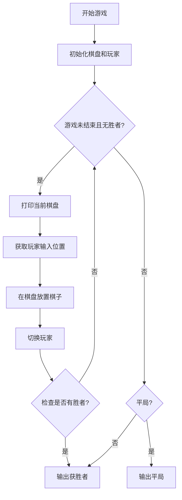
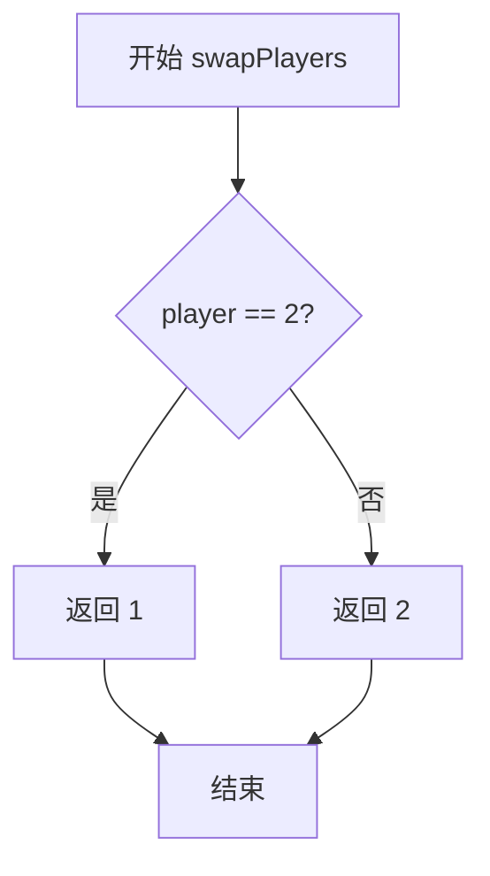
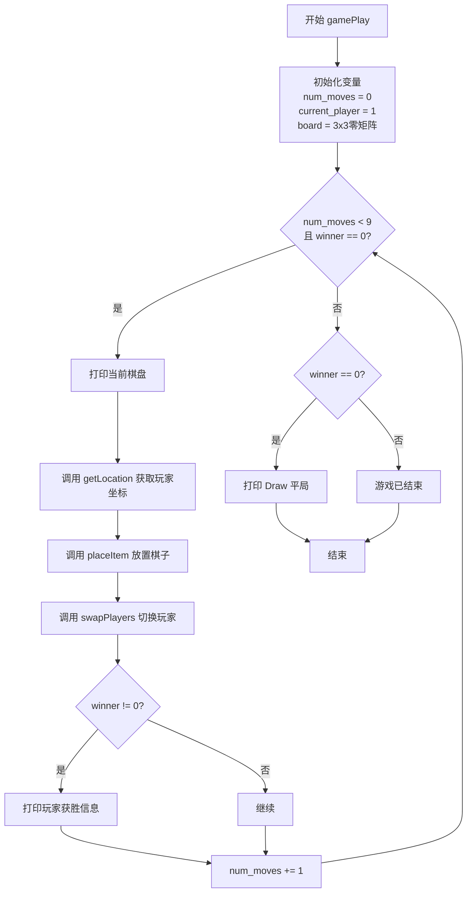

# `.\AutoGPT\classic\benchmark\agbenchmark\challenges\verticals\code\5_tic_tac_toe\artifacts_out\tic_tac_toe.py` 详细设计文档

这是一个井字棋（Tic-Tac-Toe）游戏实现，包含完整的游戏逻辑、玩家交互、胜负判定和棋盘状态管理功能。

## 整体流程



## 类结构

```
无类结构（纯函数式编程）
└── 全局函数模块
    ├── 工具函数 (column, check, checkDiagLeft, checkDiagRight)
    ├── 游戏逻辑函数 (placeItem, swapPlayers, winner)
    ├── 交互函数 (getLocation)
    └── 主函数 (gamePlay)
```

## 全局变量及字段


### `board`
    
游戏棋盘，二维列表

类型：`list[list[int]]`
    


### `current_player`
    
当前玩家，1或2

类型：`int`
    


### `num_moves`
    
已落子次数

类型：`int`
    


### `pp`
    
PrettyPrinter对象，用于打印棋盘

类型：`pprint.PrettyPrinter`
    


    

## 全局函数及方法


### `column`

该函数接收一个二维矩阵和一个列索引，返回该索引对应的列元素组成的列表，实现从矩阵中提取指定列的功能。

参数：

- `matrix`：`list`，二维列表，表示要从中提取列的矩阵
- `i`：`int`，整数，表示要提取的列索引（从0开始）

返回值：`list`，返回包含矩阵第i列所有元素的列表

#### 流程图

```mermaid
flowchart TD
    A[开始] --> B[初始化空列表result]
    C[遍历matrix中的每一行row]
    C --> D{遍历完成?}
    D -->|否| E[获取row[i]元素]
    E --> F[将row[i]添加到result列表]
    F --> C
    D -->|是| G[返回result列表]
    G --> H[结束]
```

#### 带注释源码

```
def column(matrix, i):
    """
    获取矩阵第i列的函数
    
    参数:
        matrix: 二维列表，代表矩阵
        i: 整数，代表列索引
    
    返回:
        列表，包含第i列的所有元素
    """
    # 使用列表推导式遍历矩阵的每一行，提取第i个元素
    # row[i] 表示获取当前行的第i列元素
    # for row in matrix 遍历矩阵的每一行
    return [row[i] for row in matrix]
```


### `check`

检查列表中的所有元素是否相同且非零，如果是则返回该元素值，否则返回 None。此函数主要用于检查井字棋游戏中的行、列或对角线是否存在获胜情况。

参数：

- `list`：`list`，要检查的列表，通常为棋盘的一行、一列或对角线

返回值：`int` 或 `None`，如果列表所有元素相同且非零则返回该元素值，否则返回 None

#### 流程图

```mermaid
flowchart TD
    A[开始 check] --> B{len(set(list)) <= 1?}
    B -->|否| C[返回 None]
    B -->|是| D{list[0] != 0?}
    D -->|否| C
    D -->|是| E[返回 list[0]]
    E --> F[结束]
    C --> F
```

#### 带注释源码

```python
def check(list):
    # 使用 set() 去除重复元素，获取列表中唯一元素的个数
    # 如果所有元素都相同，set 长度将为 1
    if len(set(list)) <= 1:
        # 检查唯一元素是否非零（0 表示空位，非零表示玩家标识）
        if list[0] != 0:
            # 返回该非零元素值，即获胜玩家的标识
            return list[0]
    # 条件不满足时返回 None，表示该行/列/对角线无获胜者
    return None
```


### `checkDiagLeft`

该函数用于检查井字棋（Tic-Tac-Toe）棋盘的左对角线（从左上角到右下角）是否有三个相同的非零标记，如果有则返回获胜玩家的编号，否则返回None。

参数：

- `board`：`list[list[int]]`，表示3x3的井字棋游戏棋盘，其中0表示空位，非0值（1或2）表示玩家标记

返回值：`int | None`，如果左对角线三个格子有相同的非零标记（即某玩家获胜），返回该玩家的编号（1或2）；否则返回None

#### 流程图

```mermaid
flowchart TD
    A[开始 checkDiagLeft] --> B{board[0][0] == board[1][1] 且 board[1][1] == board[2][2]?}
    B -->|否| D[返回 None]
    B -->|是| C{board[0][0] != 0?}
    C -->|否| D
    C -->|是| E[返回 board[0][0]]
    E --> F[结束]
    D --> F
```

#### 带注释源码

```python
def checkDiagLeft(board):
    """
    检查左对角线是否有获胜者
    
    参数:
        board: 3x3的二维列表，表示棋盘状态
               0表示空位，1和2分别表示两个玩家的标记
    
    返回值:
        如果左对角线三个位置有相同的非零值，返回该值（玩家编号）
        否则返回None
    """
    # 检查左对角线三个位置是否相等
    if board[0][0] == board[1][1] and board[1][1] == board[2][2]:
        # 确保不是空位（0表示空位）
        if board[0][0] != 0:
            # 返回获胜玩家的标记（1或2）
            return board[0][0]
    # 条件不满足，返回None表示无获胜者
    return None
```


### `checkDiagRight`

检查井字游戏棋盘的右对角线（从右上角到左下角，即 board[0][2]、board[1][1]、board[2][0]）是否有三个相同的非空标记，如果有则返回获胜玩家编号，否则返回 None。

参数：

- `board`：`list[list[int]]`，3x3 的二维列表，表示井字游戏棋盘，其中 0 表示空位，1 和 2 分别表示玩家一和玩家二

返回值：`int | None`，如果右对角线上三个元素相同且非零，返回该玩家编号（1 或 2）；否则返回 None

#### 流程图

```mermaid
flowchart TD
    A[开始检查右对角线] --> B{board[2][0] == board[1][1] 且 board[1][1] == board[0][2]?}
    B -->|否| D[返回 None]
    B -->|是| C{board[2][0] != 0?}
    C -->|否| D
    C -->|是| E[返回 board[2][0]]
    D --> F[结束]
    E --> F
```

#### 带注释源码

```python
def checkDiagRight(board):
    """
    检查右对角线是否有获胜者
    
    右对角线: board[0][2], board[1][1], board[2][0]
    """
    # 检查右对角线三个元素是否相等
    if board[2][0] == board[1][1] and board[1][1] == board[0][2]:
        # 检查是否为有效玩家（非零）
        if board[2][0] != 0:
            # 返回获胜玩家编号
            return board[2][0]
    # 无获胜者返回 None
    return None
```


### `placeItem`

在棋盘指定位置放置当前玩家的棋子。如果该位置已被占用，则返回 `None`；否则将棋盘对应位置更新为当前玩家的标识。

参数：

- `row`：`int`，行索引，范围 0-2。
- `column`：`int`，列索引，范围 0-2。
- `board`：`list[list[int]]`，表示井字棋盘面的三维列表，其中 0 表示空位，1 和 2 表示不同玩家。
- `current_player`：`int`，当前执行落子动作的玩家标识（通常为 1 或 2）。

返回值：`None`，表示落子操作的结果。若位置为空则修改棋盘（隐式返回 None），若位置已有棋子则显式返回 None。

#### 流程图

```mermaid
graph TD
    A([开始 placeItem]) --> B{检查 board[row][column] != 0?}
    B -- 是 (已占用) --> C[返回 None]
    B -- 否 (空闲) --> D[更新 board[row][column] = current_player]
    D --> E([结束])
```

#### 带注释源码

```python
def placeItem(row, column, board, current_player):
    """
    在棋盘指定位置尝试放置棋子。
    
    参数:
        row (int): 行索引。
        column (int): 列索引。
        board (list[list[int]]): 棋盘数据结构。
        current_player (int): 当前玩家的标识。
    """
    # 检查指定坐标是否已有棋子（值不为0）
    if board[row][column] != 0:
        # 如果位置已被占用，则不做任何操作并返回 None
        return None
    else:
        # 如果位置为空，则将当前玩家的标识写入棋盘
        board[row][column] = current_player
```


### `swapPlayers`

切换当前玩家编号（1 变 2，2 变 1），用于在井字棋游戏中交替玩家回合。

参数：

- `player`：`int`，当前玩家编号（1 或 2）

返回值：`int`，切换后的玩家编号（如果当前是 1 则返回 2，如果当前是 2 则返回 1）

#### 流程图



#### 带注释源码

```python
def swapPlayers(player):
    """
    切换当前玩家编号
    
    参数:
        player: int - 当前玩家编号，值为1或2
    
    返回:
        int - 切换后的玩家编号
    """
    # 如果当前玩家是2，则切换为1
    if player == 2:
        return 1
    # 否则（当前玩家是1），切换为2
    else:
        return 2
```


### `winner`

该函数用于检查井字棋游戏（3x3棋盘）是否有获胜者，通过遍历所有行、列和两条对角线，检测是否存在连续的相同非零玩家标识，返回获胜玩家的编号（1或2），若无人获胜则返回0表示平局或游戏继续。

参数：

- `board`：`List[List[int]]`，3x3的二维列表，表示游戏棋盘，其中0表示空位，1和2分别表示两个玩家

返回值：`int`，返回获胜玩家的编号（1或2），若无人获胜返回0

#### 流程图

```mermaid
flowchart TD
    A[开始 winner] --> B[遍历每一行]
    B --> C{check(row) 是否返回非空值?}
    C -->|是| D[返回 check(row) 的值]
    C -->|否| E[遍历每一列]
    E --> F{check(column) 是否返回非空值?}
    F -->|是| G[返回 check(column) 的值]
    F -->|否| H{checkDiagLeft(board) 是否返回非空值?}
    H -->|是| I[返回左对角线获胜者]
    H -->|否| J{checkDiagRight(board) 是否返回非空值?}
    J -->|是| K[返回右对角线获胜者]
    J -->|否| L[返回 0 - 无获胜者]
    D --> M[结束]
    G --> M
    I --> M
    K --> M
    L --> M
```

#### 带注释源码

```python
def winner(board):
    """
    检查井字棋游戏是否有获胜者
    
    检查顺序：行 -> 列 -> 左对角线 -> 右对角线
    返回值：1或2表示获胜玩家，0表示无获胜者
    """
    
    # 1. 遍历每一行检查是否有获胜者
    # rowIndex 为每一行的元素列表
    for rowIndex in board:
        # 使用check函数检查该行是否全部相同且非0
        if check(rowIndex) is not None:
            # 如果有获胜者，直接返回获胜玩家的编号
            return check(rowIndex)
    
    # 2. 遍历每一列检查是否有获胜者
    # len(board[0]) 获取列数（3列）
    for columnIndex in range(len(board[0])):
        # 使用column函数提取当前列的所有元素
        # column(board, columnIndex) 返回包含该列所有元素的列表
        if check(column(board, columnIndex)) is not None:
            # 如果有获胜者，返回获胜玩家的编号
            return check(column(board, columnIndex))
    
    # 3. 检查左对角线 (board[0][0], board[1][1], board[2][2])
    if checkDiagLeft(board) is not None:
        return checkDiagLeft(board)
    
    # 4. 检查右对角线 (board[2][0], board[1][1], board[0][2])
    if checkDiagRight(board) is not None:
        return checkDiagRight(board)
    
    # 5. 所有检查都未发现获胜者，返回0表示平局或游戏继续
    return 0
```


### `getLocation`

该函数用于获取玩家输入的坐标位置，验证坐标格式是否正确（两个0-2范围内的整数），如果输入无效则循环提示重新输入，直到获得有效坐标为止。

**参数：** 无

**返回值：** `list[int]`，返回玩家输入的有效坐标列表，例如 `[1, 2]`

#### 流程图

```mermaid
flowchart TD
    A[开始 getLocation] --> B[提示用户输入坐标]
    B --> C[获取用户输入的字符串]
    C --> D[打印用户输入]
    D --> E[将输入字符串按逗号分割并转换为整数列表]
    E --> F{验证坐标有效性}
    F -->|无效| G[打印错误信息]
    G --> B
    F -->|有效| H[返回坐标列表]
    H --> I[结束]
    
    F{验证坐标有效性} --> 
    if len == 2 and 0 <= x <= 2
```

#### 带注释源码

```python
def getLocation():
    """
    获取玩家输入的坐标位置
    
    该函数提示用户输入两个用逗号分隔的数字（0-2范围内）作为棋盘坐标，
    并进行输入验证。如果输入无效（格式错误或超出范围），会循环提示用户重新输入。
    直到获得有效坐标才返回。
    
    参数：
        无
        
    返回值：
        list[int]: 有效的坐标列表 [row, col]，例如 [1, 2]
    """
    # 提示用户输入坐标位置
    location = input(
        "Choose where to play. Enter two numbers separated by a comma [example: 1,1]: "
    )
    # 打印用户输入的坐标
    print(f"\nYou picked {location}")
    # 将输入的字符串按逗号分割并转换为整数列表
    coordinates = [int(x) for x in location.split(",")]
    
    # 验证坐标是否有效：
    # 1. 必须正好有两个数字
    # 2. 第一个数字必须在0-2范围内（行）
    # 3. 第二个数字必须在0-2范围内（列）
    while (
        len(coordinates) != 2
        or coordinates[0] < 0
        or coordinates[0] > 2
        or coordinates[1] < 0
        or coordinates[1] > 2
    ):
        # 输入无效，打印错误提示信息
        print("You inputted a location in an invalid format")
        # 重新提示用户输入
        location = input(
            "Choose where to play. Enter two numbers separated by a comma "
            "[example: 1,1]: "
        )
        # 重新解析输入
        coordinates = [int(x) for x in location.split(",")]
    
    # 返回有效的坐标列表
    return coordinates
```


### `gamePlay`

`gamePlay` 是井字棋（Tic-Tac-Toe）游戏的主循环函数，负责管理游戏的整体流程，包括初始化棋盘、接收玩家输入、交替玩家、检测胜负以及判断平局。

参数：
- 该函数无参数

返回值：`None`，该函数不返回任何值，仅通过打印输出游戏结果

#### 流程图



#### 带注释源码

```python
def gamePlay():
    """
    井字棋游戏主循环函数
    负责管理游戏的整体流程：初始化、输入获取、棋子放置、胜负判定
    """
    # 记录已进行的步数，最大为9步（3x3棋盘）
    num_moves = 0
    
    # 创建PrettyPrinter对象用于美化打印棋盘
    pp = pprint.PrettyPrinter(width=20)
    
    # 当前玩家，1代表玩家1，2代表玩家2
    current_player = 1
    
    # 初始化3x3棋盘，所有位置初始值为0（表示空位）
    # board[i][j] = 0 表示空位，1表示玩家1的棋子，2表示玩家2的棋子
    board = [[0 for x in range(3)] for x in range(3)]

    # 主游戏循环
    # 条件：步数小于9（棋盘未满）且无玩家获胜（winner返回0）
    while num_moves < 9 and winner(board) == 0:
        # 提示并展示当前棋盘状态
        print("This is the current board: ")
        # 使用PrettyPrinter格式化打印棋盘
        pp.pprint(board)
        
        # 获取当前玩家选择的位置坐标
        coordinates = getLocation()
        
        # 在指定位置放置当前玩家的棋子
        # 若位置已被占用，placeItem返回None但不会阻止游戏继续
        placeItem(coordinates[0], coordinates[1], board, current_player)
        
        # 切换到下一位玩家
        current_player = swapPlayers(current_player)
        
        # 检查是否有玩家获胜
        # winner()返回0表示无获胜者，返回1或2表示对应玩家获胜
        if winner(board) != 0:
            # 打印获胜玩家编号
            print(f"Player {winner(board)} won!")
        
        # 步数加1
        num_moves += 1

    # 游戏结束后检查结果
    # 如果winner返回0，表示平局（棋盘满且无获胜者）
    if winner(board) == 0:
        print("Draw")
```


## 关键组件


### column

用于提取3x3矩阵中指定列的所有元素，返回一个列表。

### check

检查列表中的所有元素是否相同且非零，如果是则返回该元素值，否则返回None。

### checkDiagLeft

检查井字棋 board 的左对角线（从左上到右下）是否有三个相同的非零棋子，返回获胜玩家编号或None。

### checkDiagRight

检查井字棋 board 的右对角线（从右上到左下）是否有三个相同的非零棋子，返回获胜玩家编号或None。

### placeItem

在井字棋棋盘的指定位置放置当前玩家的棋子，如果位置已被占用则返回None。

### swapPlayers

在井字棋游戏切换当前玩家，1号玩家和2号玩家互相切换。

### winner

检查整个井字棋棋盘是否有获胜者，依次检查行、列、左对角线、右对角线，返回获胜玩家编号（1或2），无获胜者返回0。

### getLocation

获取玩家输入的棋盘位置坐标，验证输入格式和范围是否合法（0-2），返回坐标列表。

### gamePlay

井字棋游戏的主控制流程，初始化棋盘和玩家，循环执行游戏直到分出胜负或平局。

### board

3x3的二维列表，表示井字棋棋盘，0表示空位，1和2分别表示两个玩家的棋子。

### current_player

整数类型的全局变量，记录当前应该落子的玩家编号（1或2）。

### num_moves

整数类型的局部变量，记录已执行的步数，用于判断是否平局（9步为满）。


## 问题及建议


### 已知问题
- **标识符命名不当**：使用`list`作为变量名，与Python内置类型冲突；`check`函数名虽非关键字但易引起混淆。
- **缺乏异常处理**：`getLocation`中`int(x)`转换时若输入非数字会抛出`ValueError`，导致程序崩溃。
- **代码重复**：`checkDiagLeft`和`checkDiagRight`逻辑高度相似，可合并为一个函数。
- **效率低下**：`winner`函数在每次玩家移动后都被调用（游戏循环中调用两次：一次判断是否结束，一次在循环外再次调用），导致重复遍历 board（3x3 矩阵），增加不必要的计算。
- **函数返回值不明确**：`placeItem`函数没有返回值，调用者无法直接判断放置是否成功（如位置已被占用），需额外检查 board 状态。
- **输入处理不健壮**：未处理输入中的空格或多余逗号，且坐标验证逻辑与输入获取耦合。
- **硬编码问题**：board 大小（3）和最大步数（9）硬编码在代码中，缺乏常量定义，降低可维护性。
- **无面向对象封装**：所有函数均为全局函数，状态（board、current_player）通过参数传递，缺乏统一管理，扩展性差。
- **用户体验不足**：输入无效时仅提示格式错误，未提供具体错误原因（如数字超出范围），且成功放置后无明确反馈。
- **逻辑冗余**：游戏循环结束后再次调用`winner(board)`检查平局，但循环条件已包含该判断，可简化。

### 优化建议
- **重命名标识符**：将`list`改为`row_list`或`items`，`check`改为`check_line`或`verify_line`。
- **添加异常处理**：在`getLocation`中使用`try-except`捕获`ValueError`，并给予友好提示。
- **重构对角线检查**：创建通用函数`check_diagonal(board, start_row, start_col, delta_row, delta_col)`，或合并左右对角线检查逻辑。
- **优化 winner 函数**：引入缓存机制（如记录已检查的行/列/对角线）或在游戏循环中仅在必要时调用（例如在放置棋子后调用一次判断胜负）。
- **改进 placeItem 返回值**：使函数返回布尔值（True 表示成功，False 表示失败），或在失败时抛出异常。
- **分离输入验证**：将坐标验证逻辑提取为独立函数`validate_coordinates(coordinates, board_size)`，提高可读性。
- **定义常量**：使用常量如`BOARD_SIZE = 3`、`MAX_MOVES = 9`，并替换硬编码数字。
- **引入面向对象设计**：创建`TicTacToe`类，将 board、玩家、状态封装为类属性，方法如`play(row, col)`、`check_winner()`等，提升可维护性和扩展性。
- **增强用户体验**：在输入无效时明确指出错误类型（如“坐标超出范围”），放置成功后打印确认信息。
- **简化逻辑**：移除循环后多余的`winner`调用，直接基于`num_moves`判断平局。


## 其它


### 设计目标与约束

本代码实现了一个经典的3x3井字棋（Tic-Tac-Toe）双人对战游戏，主要设计目标包括：提供一个可运行的、控制台交互式的井字棋游戏，支持两名玩家轮流落子，自动判定获胜方或平局。约束条件包括：棋盘固定为3x3，玩家固定为2人（分别用数字1和2表示），游戏在9步内必须结束。

### 错误处理与异常设计

代码主要通过while循环和条件判断来处理输入错误。对于getLocation函数的输入验证包括：检查输入是否为两个数字、检查坐标是否在0-2范围内。当输入格式错误时，程序会提示用户重新输入，直到获得有效坐标。placeItem函数在位置已被占用时返回None表示落子失败，但调用方并未处理该返回值，可能导致游戏状态不一致。代码缺少对非数字输入（如字母、符号）的异常处理，当用户输入无法转换为整数时会抛出ValueError异常。

### 数据流与状态机

游戏状态主要包含三个核心数据：board（3x3二维数组，0表示空位，1和2表示玩家）、current_player（当前玩家，1或2）、num_moves（已落子次数）。游戏流程状态机包含：等待玩家输入状态（getLocation）、落子状态（placeItem）、胜负判定状态（winner）、切换玩家状态（swapPlayers）。游戏在winner返回非0值或num_moves达到9时结束。

### 外部依赖与接口契约

代码仅依赖Python标准库：pprint模块用于美化打印棋盘，input函数用于获取用户输入。外部接口契约方面：getLocation函数返回长度为2的列表[x, y]，其中x和y为0-2的整数；winner函数返回0表示无获胜者，返回1或2表示相应玩家获胜，返回0且num_moves=9时表示平局；placeItem函数在成功落子时修改board数组并返回None，失败时返回None。

### 配置与常量定义

代码中缺少集中定义的常量，存在魔法数字。主要常量包括：BOARD_SIZE = 3（棋盘维度）、MAX_MOVES = 9（最大步数）、PLAYER_1 = 1和PLAYER_2 = 2（玩家标识）、EMPTY_CELL = 0（空位标识）。这些常量散落在代码各处，不利于后期修改和维护。

### 用户交互流程

游戏启动时进入gamePlay函数，流程如下：1）显示当前棋盘状态；2）提示当前玩家输入位置；3）获取并验证坐标；4）执行落子；5）检查是否有获胜者；6）切换玩家；7）重复直到游戏结束。游戏结束后显示获胜玩家编号或平局信息。用户输入采用"x,y"格式，坐标范围为0-2（共9个可选位置）。

### 游戏规则说明

井字棋规则：棋盘为3x3网格两名玩家轮流在空位放置自己的标记（1或2）最先在行、列或对角线上连成三子获胜若9步内无连成三子则为平局。本代码实现中，玩家1先手，双方交替进行。

### 边界条件处理

代码处理的边界条件包括：输入坐标必须在0-2范围内、每个位置只能落子一次、游戏最多进行9步。但存在未处理的边界条件：坐标必须为整数（输入字母会崩溃）、输入格式必须严格为"x,y"（多余空格可能引起问题）、placeItem返回值未被检查可能导致状态不一致。

### 可扩展性分析

代码可扩展性较差，主要问题包括：无类封装，所有函数和变量都是全局的，难以维护和测试；硬编码的3x3棋盘尺寸，修改需要改动多处代码；winner函数逻辑可以优化为更通用的算法；缺少游戏重新开始功能；无日志记录功能。建议重构为面向对象设计，引入配置类、棋盘类、玩家类和游戏引擎类。

    