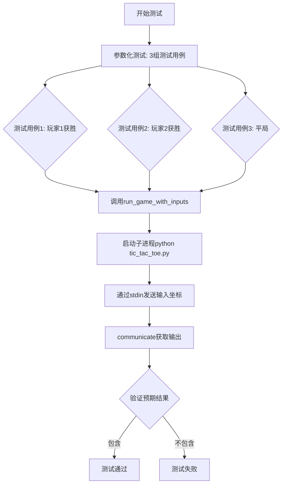
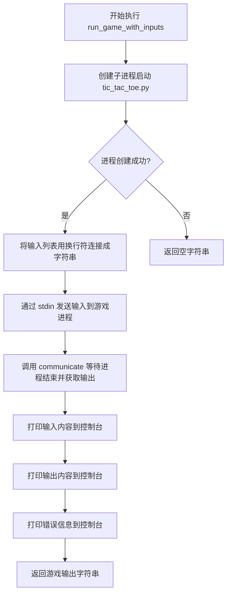
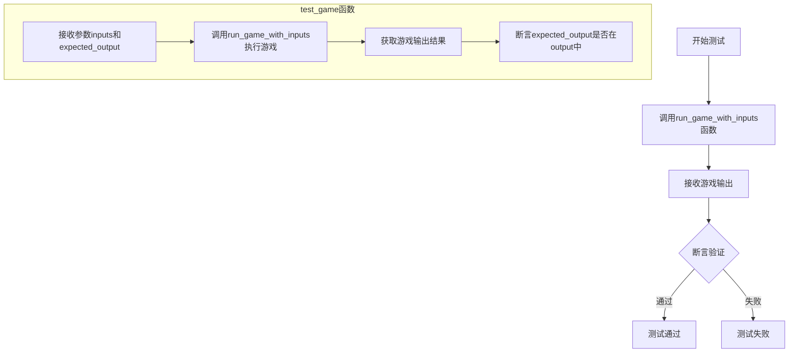

# `.\AutoGPT\classic\benchmark\agbenchmark\challenges\verticals\code\5_tic_tac_toe\custom_python\test.py` 详细设计文档

这是一个pytest参数化测试文件，用于自动化测试tic_tac_toe.py井字游戏的核心逻辑，验证玩家获胜和平局的各种场景

## 整体流程



## 类结构

```
无类层次结构（扁平脚本）
```

## 全局变量及字段


    

## 全局函数及方法


### `run_game_with_inputs`

该函数通过子进程启动井字棋游戏程序，接收一系列游戏输入（坐标移动），将输入发送给游戏进程并捕获其输出，用于自动化测试游戏逻辑是否正确。

参数：

- `inputs`：`List[str]`，游戏输入列表，每个元素为形如"x,y"的字符串，表示玩家在棋盘上的落子位置

返回值：`str`，游戏的文本输出，包含游戏过程和结果信息

#### 流程图



#### 带注释源码

```python
import subprocess  # 导入子进程模块，用于启动外部程序

import pytest  # 导入 pytest 测试框架（虽然此函数本身不是测试，但被测试用例调用）


def run_game_with_inputs(inputs):
    """
    运行井字棋游戏并返回输出结果
    
    参数:
        inputs: 游戏输入列表，每个元素为坐标字符串，如 "0,0", "1,1" 等
    
    返回:
        游戏的文本输出
    """
    # 启动游戏进程
    # 使用 subprocess.Popen 创建子进程，运行 tic_tac_toe.py 脚本
    # stdin=subprocess.PIPE: 通过管道向进程发送输入
    # stdout=subprocess.PIPE: 通过管道捕获进程输出
    # stderr=subprocess.PIPE: 通过管道捕获进程错误输出
    # text=True: 以文本模式处理输入输出（而非字节模式）
    process = subprocess.Popen(
        ["python", "tic_tac_toe.py"],
        stdin=subprocess.PIPE,
        stdout=subprocess.PIPE,
        stderr=subprocess.PIPE,
        text=True,
    )

    # 将输入列表转换为换行符分隔的字符串
    # 例如: ["0,0", "1,0"] -> "0,0\n1,0"
    # 通过 communicate 的输入参数模拟用户逐行输入
    output, errors = process.communicate("\n".join(inputs))

    # 打印输入的移动序列（用于调试和日志记录）
    print("Inputs:\n", "\n".join(inputs))
    # 打印游戏的输出结果
    print("Output:\n", output)
    # 打印任何错误信息（用于调试）
    print("Errors:\n", errors)

    # 返回游戏的输出字符串，供测试断言使用
    return output
```


### `test_game`

该函数是一个pytest参数化测试用例，用于测试井字棋游戏（Tic Tac Toe）的核心逻辑。通过向游戏进程发送不同的输入序列，验证游戏在玩家获胜或平局时能否输出正确的游戏结果。

参数：

- `inputs`：`List[str]`，一系列游戏落子坐标，格式为"行,列"（如"0,0"表示第一行第一列）
- `expected_output`：`str`，期望的游戏输出结果（如"Player 1 won!"、"Player 2 won!"或"Draw"）

返回值：`None`，该函数通过pytest断言验证结果，不返回具体值

#### 流程图



#### 带注释源码

```python
@pytest.mark.parametrize(
    "inputs, expected_output",
    [
        # 测试用例1：玩家1获胜的情况
        # 玩家1依次占据(0,0), (0,1), (0,2)形成第一行连珠
        (["0,0", "1,0", "0,1", "1,1", "0,2"], "Player 1 won!"),
        
        # 测试用例2：玩家2获胜的情况
        # 玩家2依次占据(1,0), (1,1), (2,0)并形成特定获胜模式
        (["1,0", "0,0", "1,1", "0,1", "2,0", "0,2"], "Player 2 won!"),
        
        # 测试用例3：平局情况
        # 所有9个格子都被填满但无玩家获胜
        (["0,0", "0,1", "0,2", "1,1", "1,0", "1,2", "2,1", "2,0", "2,2"], "Draw"),
    ],
)
def test_game(inputs, expected_output):
    """
    参数化测试函数：测试井字棋游戏的不同胜负场景
    
    参数:
        inputs: 玩家依次输入的落子坐标列表
        expected_output: 期望的游戏结束消息
    
    返回:
        None（通过pytest断言验证）
    """
    # 调用辅助函数运行游戏并获取输出
    output = run_game_with_inputs(inputs)
    
    # 断言验证期望的输出消息是否出现在游戏输出中
    assert expected_output in output
```

## 关键组件


### 进程通信组件

使用 subprocess.Popen 和 communicate 实现与 tic_tac_toe.py 游戏进程的交互，支持stdin输入和stdout输出捕获

### 参数化测试框架

使用 pytest.mark.parametrize 装饰器定义多组测试输入和预期输出，实现测试用例的批量执行和验证

### 游戏逻辑测试组件

包含三个关键测试场景：玩家1获胜、玩家2获胜和平局，验证井字棋游戏的核心游戏规则


## 问题及建议


### 已知问题

- **subprocess 交互问题**：使用 `communicate()` 一次性发送所有输入，对于需要交替输入的井字棋游戏，可能无法正确模拟玩家交互流程，导致测试不稳定
- **错误处理缺失**：未检查 `process.returncode`，未处理 `FileNotFoundError`（游戏文件不存在）、`TimeoutExpired` 等异常情况
- **硬编码路径依赖**：假设 `tic_tac_toe.py` 存在于当前目录，缺乏动态路径获取或配置
- **输入格式不明确**：使用 `\n` 连接输入，但未验证是否符合游戏的实际输入格式（如是否需要行尾换行符）
- **无清理机制**：测试运行后无资源清理（如残留进程），可能导致测试间相互影响
- **缺乏类型注解**：函数参数和返回值无类型提示，影响代码可维护性
- **打印语句滥用**：使用 `print` 而非日志框架，测试环境输出不可控

### 优化建议

- **改进子进程交互**：使用 `stdout.readline()` 逐行读取输出并同步发送输入，或使用 `pexpect` 等库处理交互式输入
- **添加错误处理**：捕获 `subprocess` 异常，检查返回码，设置超时机制
- **动态路径获取**：使用 `Path(__file__).parent` 或配置文件管理游戏文件路径
- **添加资源清理**：使用 `try/finally` 或 `pytest fixture` 确保进程正确终止
- **添加类型注解**：为函数参数和返回值添加类型提示
- **日志替换打印**：使用 `logging` 模块替代 `print`
- **扩展测试用例**：增加无效输入、边界情况、超时场景的测试覆盖

## 其它


### 设计目标与约束

本测试文件的设计目标是自动化验证tic_tac_toe.py游戏的核心功能，确保游戏在玩家获胜、平局等关键场景下能正确输出结果。设计约束包括：使用subprocess模块与游戏进程进行交互，通过stdin/stdout管道传输数据；使用pytest框架的参数化测试实现多场景覆盖；输入格式为"x,y"坐标字符串，输出为包含游戏结果的文本。

### 错误处理与异常设计

当前代码缺少显式的错误处理机制。当游戏进程异常退出（process.returncode非零）或通信超时时，communicate()方法会抛出异常。建议增加异常捕获逻辑：处理subprocess.TimeoutExpired超时异常、处理游戏进程崩溃导致的异常、以及验证process.returncode确保游戏正常结束。当前实现中errors变量已捕获stderr输出，但未对errors内容进行断言验证。

### 外部依赖与接口契约

本测试文件依赖以下外部组件：subprocess模块（标准库）用于进程管理；pytest框架用于测试执行；tic_tac_toe.py游戏程序作为被测系统。接口契约方面：输入接口接受字符串数组，每个元素为"x,y"格式的坐标；输出接口为标准输出文本，需包含"Player 1 won!"、"Player 2 won!"或"Draw"等关键字；游戏程序应位于当前目录或系统PATH中，入口命令为"python tic_tac_toe.py"。

### 测试覆盖范围

当前参数化测试覆盖三种场景：玩家1获胜场景、玩家2获胜场景和平局场景。测试覆盖的边界条件包括：五步获胜（玩家1）、六步获胜（玩家2）、九步平局。建议补充的测试覆盖范围包括：无效输入格式（如"abc"、"5,5"超出范围坐标）、游戏未正常结束时输出、多个连续测试用例间的进程隔离性验证。

### 性能特性

测试性能特征如下：每次测试启动新的Python子进程，存在进程创建开销；communicate()方法会等待进程完全结束，单次测试耗时约在100-500毫秒量级；参数化测试共享测试函数但独立运行。建议优化方向包括：若游戏支持持久化模式，可复用进程减少启动开销；对于大规模测试可考虑异步并发执行。

### 安全性考虑

当前实现存在以下安全考量：subprocess.Popen直接调用"python"命令，需确保tic_tac_toe.py来源可信；stdin输入未做转义处理，若游戏存在命令注入漏洞可能导致安全风险；未限制communicate的超时时间，恶意或无限循环的游戏可能导致测试挂起。建议增加超时参数（subprocess的timeout参数）、对输入进行验证、以及考虑使用shell=False明确禁止shell解释。

    