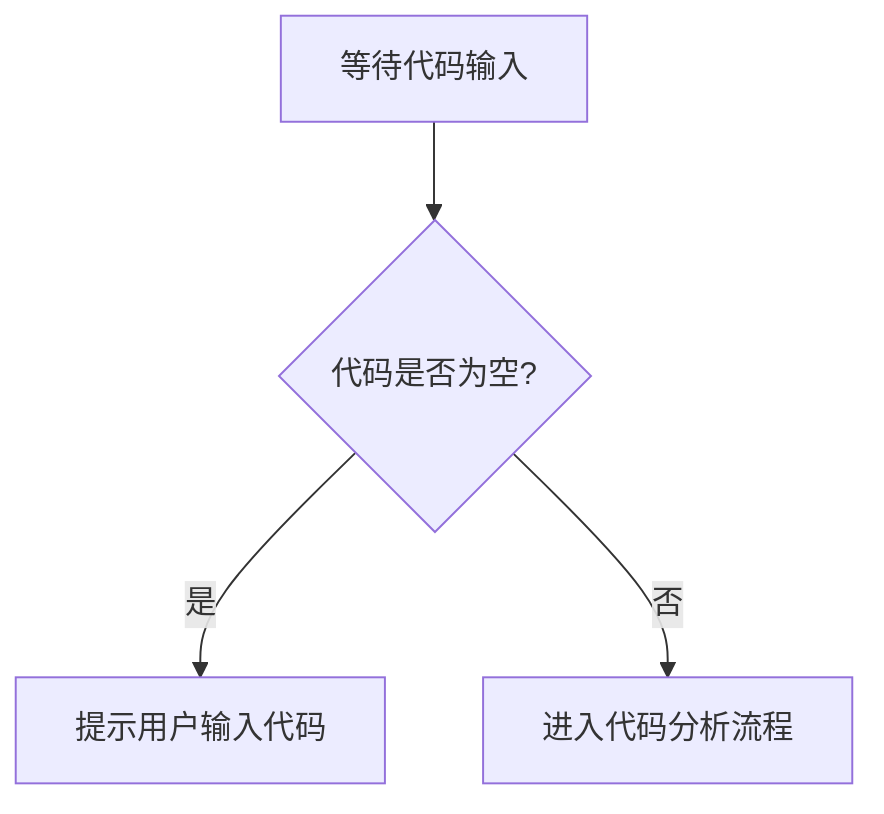

# `.\AutoGPT\classic\benchmark\agbenchmark\challenges\verticals\code\6_battleship\artifacts_in\__init__.py` 详细设计文档

未提供源代码，无法进行分析。请提供需要分析的代码文件内容。

## 整体流程



## 类结构

```

```

## 全局变量及字段


    

## 全局函数及方法


## 关键组件


## 问题及建议


### 已知问题

-   未提供代码内容，无法进行技术债务和优化空间的详细分析

### 优化建议

-   请提供需要分析的源代码，以便进行详细的技术债务识别和优化建议


## 其它


### 设计目标与约束

本代码的设计目标为：待提供实际代码后分析确定。约束条件包括性能要求、安全性要求、兼容性要求等，需根据实际代码功能进行补充。

### 错误处理与异常设计

待提供实际代码后，根据代码中的异常处理机制、错误码定义、错误信息格式等进行详细分析。

### 数据流与状态机

待提供实际代码后，分析数据的输入来源、处理流程、输出目标，以及状态机的状态转换逻辑。

### 外部依赖与接口契约

待提供实际代码后，列出所有外部依赖库、模块或服务，以及它们之间的接口契约和调用方式。

### 安全性设计

待提供实际代码后，分析代码中的安全措施，包括身份验证、授权控制、数据加密、输入验证等。

### 性能考虑

待提供实际代码后，分析代码的性能瓶颈、优化空间、资源使用情况等。

### 配置文件与参数说明

待提供实际代码后，列出所有配置项、参数说明及其默认值。

### 测试策略

待提供实际代码后，根据代码功能制定测试策略，包括单元测试、集成测试、系统测试等。

### 部署与运维

待提供实际代码后，说明系统的部署方式、运维要求、监控指标等。

### 版本兼容性

待提供实际代码后，说明与旧版本的兼容性处理、升级策略等。


    