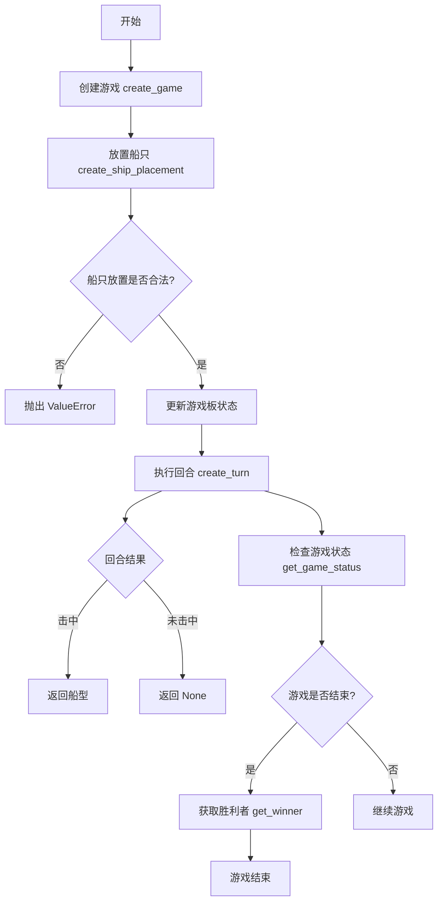
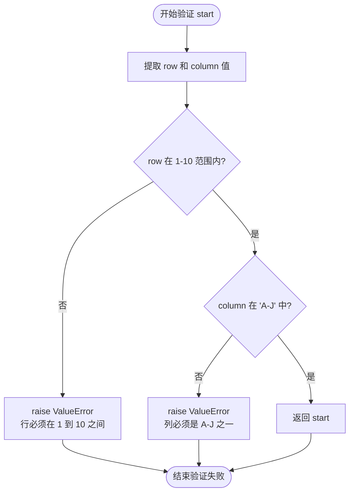
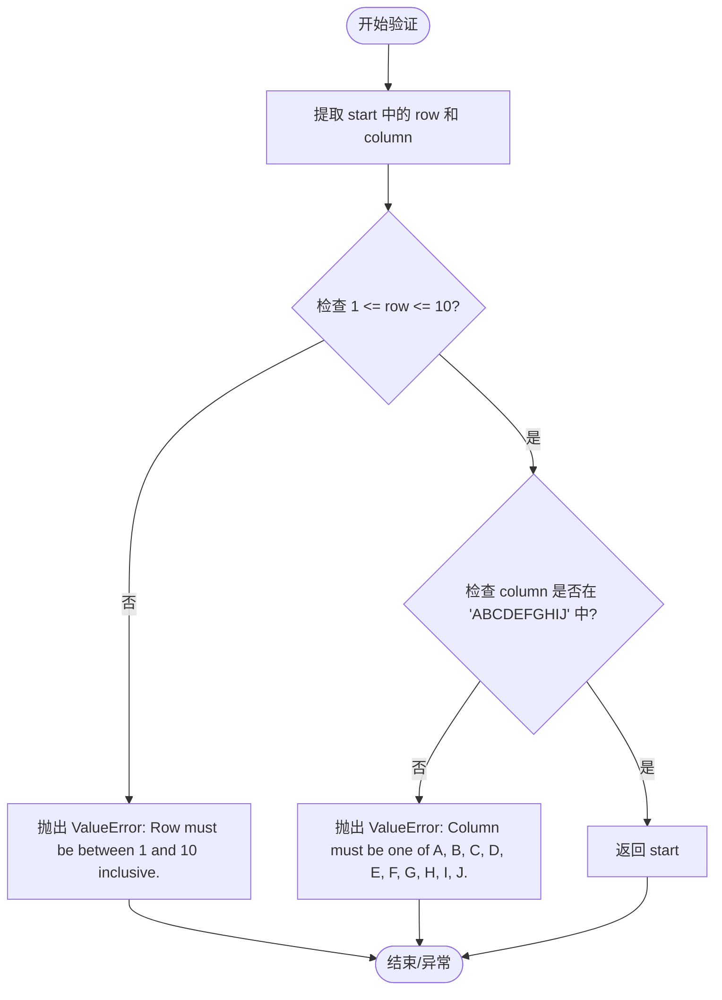
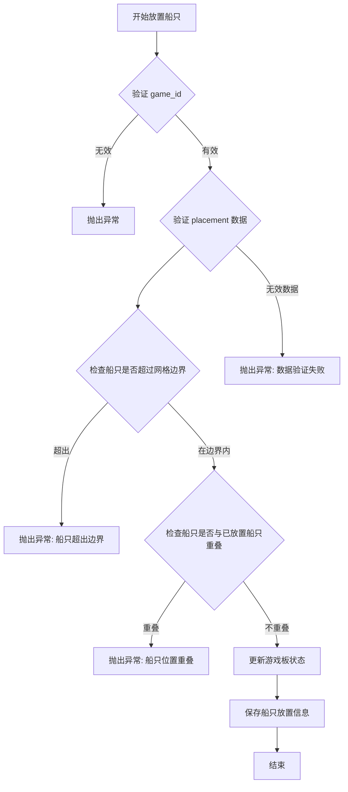
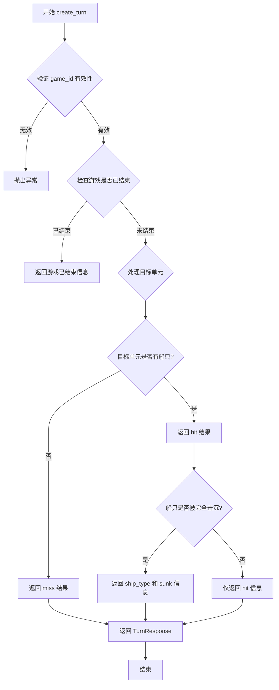
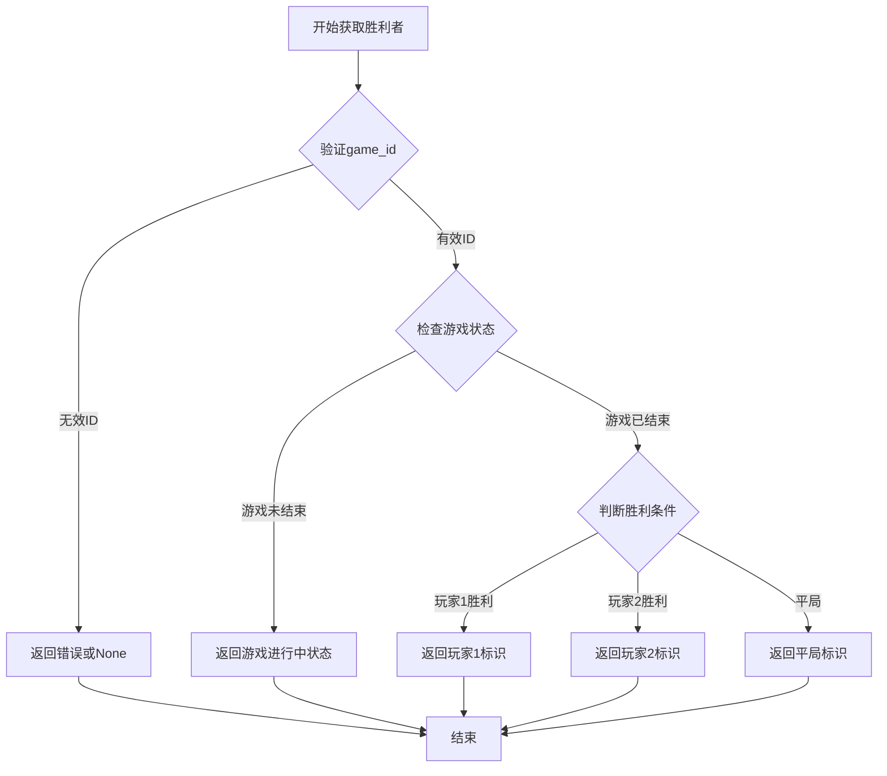
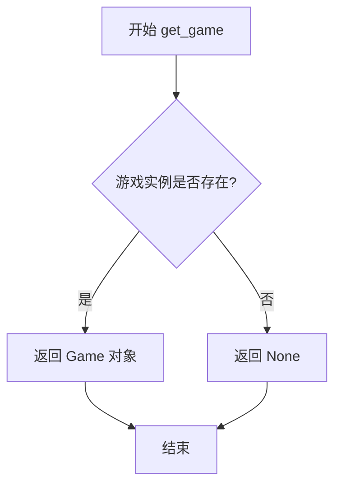
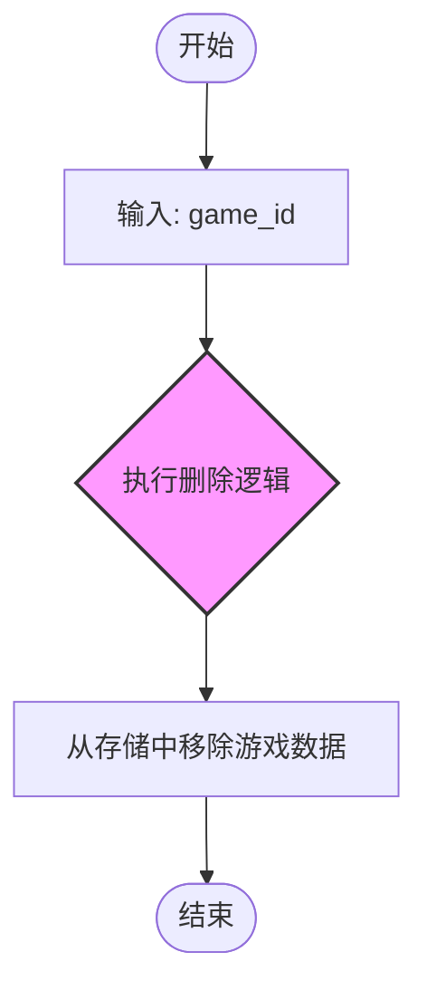
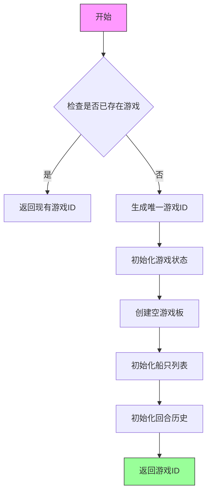

# `.\AutoGPT\classic\benchmark\agbenchmark\challenges\verticals\code\6_battleship\artifacts_in\abstract_class.py` 详细设计文档

这是一个海战棋（Battleship）游戏的数据模型和抽象基类定义模块，提供了船只放置、回合金、Game状态等Pydantic模型，以及定义游戏核心操作（如创建游戏、放置船只、执行回合、获取游戏状态等）的抽象基类AbstractBattleship。

## 整体流程



## 类结构

```
BaseModel (Pydantic 隐式基类)
├── ShipPlacement (船只放置模型)
├── Turn (回合模型)
├── TurnResponse (回合响应模型)
├── GameStatus (游戏状态模型)
└── Game (游戏模型)

ABC (抽象基类)
└── AbstractBattleship (抽象海战棋基类)
```

## 全局变量及字段


### `SHIP_LENGTHS`
    
船只长度映射字典 {'carrier':5,'battleship':4,'cruiser':3,'submarine':3,'destroyer':2}

类型：`dict`
    


### `ShipPlacement.ship_type`
    
船只类型

类型：`str`
    


### `ShipPlacement.start`
    
起始位置 {'row': int, 'column': str}

类型：`dict`
    


### `ShipPlacement.direction`
    
放置方向

类型：`str`
    


### `Turn.target`
    
目标位置 {'row': int, 'column': str}

类型：`dict`
    


### `TurnResponse.result`
    
回合结果

类型：`str`
    


### `TurnResponse.ship_type`
    
被击中的船型，未击中则为None

类型：`Optional[str]`
    


### `GameStatus.is_game_over`
    
游戏是否结束

类型：`bool`
    


### `GameStatus.winner`
    
胜利者用户名，无则为None

类型：`Optional[str]`
    


### `Game.game_id`
    
游戏唯一标识

类型：`str`
    


### `Game.players`
    
玩家列表

类型：`list[str]`
    


### `Game.board`
    
游戏板状态

类型：`dict`
    


### `Game.ships`
    
船只放置列表

类型：`list[ShipPlacement]`
    


### `Game.turns`
    
已执行回合列表

类型：`list[Turn]`
    
    

## 全局函数及方法


### `ShipPlacement.validate_start`

该方法是 `ShipPlacement` 模型的字段验证器，用于验证 `start` 字段中的坐标信息，确保行号在 1-10 范围内，列号在 A-J 之间。

参数：

-  `cls`：类型，当前类的引用（Pydantic 验证器标准参数）
-  `start`：类型，字典 `{"row": int, "column": str}`，需要验证的起始位置坐标

返回值：`dict`，验证通过后返回原始的 `start` 字典

#### 流程图



#### 带注释源码

```python
@field_validator("start")
def validate_start(cls, start):
    """
    验证船只放置的起始坐标是否有效。
    
    验证规则：
    - 行号 (row) 必须在 1-10 范围内
    - 列号 (column) 必须是 A-J 中的一个大写字母
    """
    # 从 start 字典中提取 row 和 column 值
    row, column = start.get("row"), start.get("column")

    # 验证行号是否在有效范围 1-10 内
    if not (1 <= row <= 10):
        raise ValueError("Row must be between 1 and 10 inclusive.")

    # 验证列号是否为有效的大写字母 A-J
    if column not in list("ABCDEFGHIJ"):
        raise ValueError("Column must be one of A, B, C, D, E, F, G, H, I, J.")

    # 验证通过，返回原始的 start 字典
    return start
```


### `ShipPlacement.validate_start`

验证起始位置（start）是否在规定的网格范围内。具体来说，它检查 `row`（行）是否为 1 到 10 之间的整数，以及 `column`（列）是否为字母 A 到 J 之一。

参数：

-  `cls`：当前类（`ShipPlacement`）的引用，Pydantic 装饰器自动传入。
-  `start`：`dict`，包含 `row`（整数）和 `column`（字符串）的字典，格式为 `{"row": int, "column": str}`。

返回值：`dict`，如果验证通过，返回原始的 `start` 字典；否则抛出 `ValueError`。

#### 流程图



#### 带注释源码

```python
@field_validator("start")
def validate_start(cls, start):
    """
    验证起始位置的行列是否在游戏板范围内。
    行必须是 1-10，列必须是 A-J。
    """
    # 从字典中解包行和列的值
    row, column = start.get("row"), start.get("column")

    # 验证行数是否在 1 到 10 之间
    if not (1 <= row <= 10):
        raise ValueError("Row must be between 1 and 10 inclusive.")

    # 验证列数是否为有效的字母 A-J
    # list("ABCDEFGHIJ") 生成 ['A', 'B', ..., 'J']
    if column not in list("ABCDEFGHIJ"):
        raise ValueError("Column must be one of A, B, C, D, E, F, G, H, I, J.")

    # 如果验证通过，返回原始的 start 字典供 Pydantic 使用
    return start
```


### `AbstractBattleship.create_ship_placement`

将指定的船只放置到游戏网格的指定位置。

参数：

- `self`：`AbstractBattleship`，类的实例本身
- `game_id`：`str`，游戏唯一标识符，用于指定要放置船只的游戏
- `placement`：`ShipPlacement`，包含船只类型（ship_type）、起始位置（start，包含 row 和 column）和方向（direction）的放置信息

返回值：`None`，无返回值（该方法为抽象方法，具体实现由子类完成）

#### 流程图



#### 带注释源码

```python
@abstractmethod
def create_ship_placement(self, game_id: str, placement: ShipPlacement) -> None:
    """
    Place a ship on the grid.
    
    此为抽象方法，子类需实现以下逻辑：
    1. 验证 game_id 对应的游戏是否存在
    2. 验证 placement 中的船只类型是否在 SHIP_LENGTHS 中定义
    3. 根据 direction 计算船只占据的所有格子
    4. 检查船只是否在 10x10 网格范围内
    5. 检查是否与已放置的船只发生重叠
    6. 如果验证通过，更新游戏板状态并保存船只放置信息
    
    参数:
        game_id: 游戏唯一标识符
        placement: ShipPlacement 对象，包含:
            - ship_type: 船只类型 (carrier/battleship/cruiser/submarine/destroyer)
            - start: 起始位置 {"row": int, "column": str}
            - direction: 方向 ("horizontal" 或 "vertical")
    
    返回:
        None: 无返回值，通过副作用更新游戏状态
    """
    pass
```


### `AbstractBattleship.create_turn`

玩家执行回合 targeting 网格单元，根据目标位置判断是否命中船只并返回结果。

参数：

- `game_id`：`str`，游戏唯一标识符，用于定位游戏实例
- `turn`：`Turn`，包含目标网格单元信息（行和列）

返回值：`TurnResponse`，包含攻击结果（hit/miss/sunk）和命中船只类型（若命中则返回船只类型，否则为 None）

#### 流程图



#### 带注释源码

```python
@abstractmethod
def create_turn(self, game_id: str, turn: Turn) -> TurnResponse:
    """
    Players take turns to target a grid cell.
    
    处理玩家对游戏棋盘上特定网格单元的攻击行动。
    需要验证游戏状态、检查目标位置是否已攻击过、
    判断是否命中船只以及船只是否被击沉。
    
    参数:
        game_id: 游戏唯一标识符，用于定位具体游戏实例
        turn: Turn 对象，包含要攻击的网格单元位置 {"row": int, "column": str}
    
    返回:
        TurnResponse: 包含攻击结果的响应对象
            - result: 攻击结果字符串 ("hit", "miss", "sunk", "already_attacked", "game_over")
            - ship_type: 如果命中船只，返回船只类型；否则返回 None
    """
    pass
```


### `AbstractBattleship.get_game_status`

检查指定游戏是否已结束，并根据游戏结果返回包含胜利者信息的状态对象。

参数：

- `game_id`：`str`，游戏ID，用于唯一标识需要查询状态的游戏。

返回值：`GameStatus`，返回一个包含游戏是否结束（`is_game_over`）以及胜利者名称（`winner`，若无则为 `None`）的状态对象。

#### 流程图

```mermaid
flowchart TD
    A[开始] --> B[输入: game_id]
    B --> C{根据 game_id 获取游戏实例}
    C --> D{游戏是否满足结束条件<br>(例如: 所有船只已被击毁)}
    D -- 是 --> E[获取当前玩家/胜利者]
    D -- 否 --> F[设置 is_game_over = False]
    E --> G[设置 is_game_over = True]
    F --> H[构建 GameStatus 对象]
    G --> H
    H --> I[返回 GameStatus]
```

#### 带注释源码

```python
@abstractmethod
def get_game_status(self, game_id: str) -> GameStatus:
    """
    Check if the game is over and get the winner if there's one.
    
    参数:
        game_id: 游戏的唯一标识符。
        
    返回值:
        GameStatus: 包含游戏是否结束以及胜利者的对象。
    """
    pass
```


### `AbstractBattleship.get_winner`

获取游戏胜利者，返回获胜玩家的标识符。

参数：

- `game_id`：`str`，游戏唯一标识符，用于指定需要查询的游戏

返回值：`str`，返回获胜玩家的标识符，如果游戏尚未结束或平局则返回相应的状态信息

#### 流程图



#### 带注释源码

```python
@abstractmethod
def get_winner(self, game_id: str) -> str:
    """
    Get the winner of the game.
    
    参数:
        game_id: 游戏唯一标识符
        
    返回值:
        str: 获胜玩家的标识符，如果游戏未结束或平局则返回相应的状态标识
    """
    pass
```


### `AbstractBattleship.get_game`

获取当前游戏的状态信息。

参数：
- 该方法无显式参数（`self` 为隐式实例引用）

返回值：`Game | None`，返回当前游戏实例的完整状态对象，若游戏不存在则返回 `None`

#### 流程图



#### 带注释源码

```python
@abstractmethod
def get_game(self) -> Game | None:
    """
    Retrieve the state of the game.
    
    该方法为抽象方法，具体实现由子类提供。
    用于获取当前游戏实例的完整状态，包括：
    - 游戏 ID
    - 玩家列表
    - 棋盘状态
    - 船只部署信息
    - 历史回合记录
    
    Returns:
        Game | None: 返回 Game 对象包含完整游戏状态，
                    若游戏不存在或已删除则返回 None
    """
    pass
```


### AbstractBattleship.delete_game

该方法是一个抽象方法，定义了删除指定 ID 游戏的接口。具体的数据移除逻辑（如从内存或数据库中删除）由实现该抽象类的具体子类完成。

参数：

- `game_id`：`str`，游戏ID，用于指定要删除的游戏实例的唯一标识符。

返回值：`None`，无返回值。

#### 流程图



#### 带注释源码

```python
@abstractmethod
def delete_game(self, game_id: str) -> None:
    """
    Delete a game given its ID.
    
    Args:
        game_id: The unique identifier of the game to be deleted.
    
    Returns:
        None.
    """
    pass
```


### `AbstractBattleship.create_game`

创建一个新的海战游戏实例，初始化游戏状态并返回游戏ID。

参数：
- 无参数（仅包含 `self` 隐式参数）

返回值：`None`，但文档字符串声明应返回 `str` 类型——此处存在类型注解与文档不一致的技术债务。

#### 流程图



#### 带注释源码

```python
@abstractmethod
def create_game(self) -> None:
    """
    Create a new game.

    Returns:
        str: The ID of the created game.
    """
    pass
```

**注释说明**：
- `create_game` 是一个抽象方法，由子类实现具体逻辑
- 使用 `@abstractmethod` 装饰器标记，表示子类必须实现此方法
- 当前类型注解为 `None`，但文档声明返回 `str` 类型的游戏ID，存在类型不一致问题
- `pass` 表示该方法为抽象方法，无具体实现
- 具体实现应包含：生成唯一游戏ID、初始化游戏状态（玩家列表、游戏板、船只放置列表、回合历史）等逻辑

## 关键组件


### ShipPlacement

船只放置数据模型，用于验证船只放置请求的有效性，包含船型、起始位置和方向信息。

### Turn

回合数据模型，定义玩家每次攻击的目标坐标。

### TurnResponse

回合响应模型，包含攻击结果（命中、未命中、沉船）和被击毁的船型（如有）。

### GameStatus

游戏状态模型，用于查询游戏是否结束及获胜者信息。

### Game

游戏完整状态模型，存储游戏ID、玩家列表、棋盘状态、船只布置和回合历史。

### AbstractBattleship

抽象基类，定义Battleship游戏的核心接口契约，包括创建游戏、放置船只、执行回合、查询游戏状态和删除游戏等抽象方法。


## 问题及建议


### 已知问题

-   **返回值声明不一致**：`create_game` 方法在抽象类中声明返回 `None`，但文档注释说应该返回 `str` 类型的 game_id，这会导致实现者困惑。
-   **方法签名不一致**：`get_game` 方法缺少 `game_id` 参数，与类中其他方法（如 `get_game_status`、`get_winner` 等）的签名风格不一致。
-   **验证逻辑不完整**：`ShipPlacement` 只验证了行列的基础范围，但没有验证船只能否实际放置（如是否超出边界、是否与其他船只重叠）。
-   **缺少 Turn 验证**：`Turn` 类没有对 target 字段进行验证，与 ShipPlacement 的验证方式不对称。
-   **类型约束不足**：`TurnResponse.result` 和 `GameStatus.winner` 使用字符串类型而没有使用枚举或字面量类型约束，容易产生无效值。
-   **Game.board 设计模糊**：board 字段类型为 dict，注释说"you might need to flesh this out further"，这是一个明显的待完成项。
-   **缺少游戏规则实现**：抽象类没有定义船只数量限制、每个玩家的回合逻辑、游戏初始化流程等核心规则。

### 优化建议

-   **修复返回值声明**：将 `create_game` 的返回类型改为 `str`，与注释保持一致。
-   **统一方法签名**：为 `get_game` 方法添加 `game_id: str` 参数。
-   **增强验证逻辑**：在 `ShipPlacement` 中添加船只位置有效性验证（边界检查、重叠检查）；为 `Turn` 添加类似的验证器。
-   **使用强类型约束**：使用 `Literal` 或 `Enum` 定义 `result` 的可能值（如 "hit"、"miss"、"sunk"）；使用 `Literal` 约束 `winner`。
-   **完善 Game.board 模型**：定义明确的 Board 模型类，包含网格数据结构（建议使用二维数组或嵌套字典）。
-   **添加游戏规则抽象方法**：如 `validate_ship_placement`、`check_sunk`、`initialize_player_board` 等方法。

## 其它


### 设计目标与约束

**设计目标**：
- 提供一个可扩展的Battleship游戏抽象框架，支持多人对战
- 通过抽象基类(AbstractBattleship)定义清晰的接口契约，便于实现不同存储后端
- 使用Pydantic进行数据验证，确保请求和响应数据的合法性
- 支持游戏创建、船只部署、回合执行、游戏状态查询等核心功能

**设计约束**：
- 依赖Python 3.10+的类型联合语法（`Game | None`）
- 必须继承AbstractBattleship实现具体逻辑，遵循里氏替换原则
- 船只需要遵循标准长度：carrier(5), battleship(4), cruiser(3), submarine(3), destroyer(2)
- 棋盘限制为10x10网格，行号为1-10，列号为A-J

### 错误处理与异常设计

**异常分类**：
- **验证异常**：Pydantic的ValueError用于数据校验（如行列范围、列字母有效性）
- **业务异常**：游戏不存在(game_id无效)、船只位置冲突、超出棋盘范围等
- **系统异常**：数据库连接失败、文件IO错误等底层异常

**异常传播机制**：
- 验证异常通过Pydantic的@field_validator自动抛出
- 业务逻辑异常由具体实现类抛出，在抽象方法文档中应标注可能抛出的异常类型
- 异常应包含有意义的错误消息，便于调试和用户理解

### 数据流与状态机

**游戏生命周期状态流**：
1. **创建状态**(Created) → create_game() → 初始化空棋盘
2. **部署状态**(Deployment) → create_ship_placement() → 玩家依次部署船只
3. **进行状态**(InProgress) → 双方各有船只部署完毕，开始回合
4. **进行状态**(InProgress) → create_turn() → 执行攻击，更新棋盘状态
5. **结束状态**(GameOver) → get_game_status()检测到某方船只全毁 → 产生获胜者

**数据流向**：
- 请求数据(ShipPlacement/Turn) → Pydantic验证 → 抽象方法参数 → 具体实现类处理 → 返回响应(TurnResponse/GameStatus)
- 游戏状态(Game)作为单一数据源，通过get_game()获取完整快照

### 外部依赖与接口契约

**直接依赖**：
- `abc.ABC`：Python内置抽象基类
- `abc.abstractmethod`：抽象方法装饰器
- `typing.Optional`：类型提示
- `pydantic.BaseModel`：数据验证基类
- `pydantic.field_validator`：字段验证器

**接口契约**：
- create_ship_placement：部署船只时需验证位置不重叠、不超出边界
- create_turn：执行攻击时需返回命中/未命中/沉船结果，若沉船需返回船型
- get_game_status：返回游戏是否结束及获胜者
- get_winner：仅在游戏结束时调用，需确保游戏已结束

### 安全性与权限设计

**数据安全考量**：
- game_id应使用UUID或足够长的随机字符串防止猜测攻击
- 敏感操作（如删除游戏）需验证调用者是否为游戏参与者

**输入安全**：
- Pydantic验证器确保所有用户输入符合预期格式
- 对dictionary类型的start/target字段进行白名单验证

### 性能考量

**优化建议**：
- 棋盘状态建议使用二维数组或稀疏矩阵存储，便于O(1)位置查询
- 回合记录(turns)需考虑分页，避免大量数据返回
- 船只碰撞检测在部署时需遍历已部署船只列表，优化空间：使用位图表示占用格

**资源限制**：
- 建议单游戏最大船只数：10艘（标准配置）
- 建议单游戏最大回合数：100回合（防止无限拖延）

### 可扩展性设计

**扩展点**：
- **存储后端扩展**：通过实现AbstractBattleship可接入Redis、数据库、文件系统等不同存储
- **游戏模式扩展**：可继承AbstractBattleship实现 variants（如双人对战、AI对战）
- **船只类型扩展**：SHIP_LENGTHS字典可配置化，支持自定义船只
- **验证规则扩展**：field_validator可扩展支持更多验证逻辑

### 配置与常量

**游戏配置常量**：
- BOARD_SIZE = 10（棋盘维度）
- VALID_COLUMNS = ["A","B","C","D","E","F","G","H","I","J"]
- VALID_ROW_RANGE = (1, 10)
- SHIP_TYPES = ["carrier","battleship","cruiser","submarine","destroyer"]

### 测试策略

**单元测试**：
- 测试ShipPlacement的field_validator边界条件
- 测试各个抽象方法签名符合预期

**集成测试**：
- 测试具体实现类与AbstractBattleship的契约遵守
- 测试游戏状态转换逻辑

**测试用例覆盖**：
- 合法/非法船只放置
- 合法/非法攻击坐标
- 游戏结束判定逻辑
- 多回合连续执行

### 日志与监控

**日志设计**：
- 建议记录：游戏创建、船只部署、攻击结果、游戏结束等关键事件
- 建议记录：异常和错误信息，便于问题排查
- 日志级别：DEBUG（详细流程）、INFO（关键事件）、ERROR（异常）

**监控指标**：
- 游戏创建频率
- 平均游戏时长
- 攻击命中率统计

### 并发与线程安全

**并发考量**：
- 多玩家同时操作同一游戏实例时需加锁（如部署阶段两玩家同时部署）
- 建议使用悲观锁或乐观锁机制保护游戏状态修改
- get_game()建议返回不可变快照，防止并发修改

### 数据持久化

**持久化需求**：
- 游戏状态(Game)需持久化保存
- 建议存储结构：game_id -> {players, board, ships, turns}
- 需支持游戏中断恢复

**持久化策略**：
- 短期：内存缓存+定期持久化
- 长期：数据库持久化
- 建议使用事务保证ships和turns的原子性更新

### 游戏规则实现细节

**部署规则**：
- 船只必须完整在棋盘内
- 船只之间不能重叠
- 部署方向仅支持水平/垂直（direction字段）

**攻击规则**：
- 同一坐标不能重复攻击
- 攻击结果：Miss（未命中）、Hit（命中但未沉）、Sunk（沉船）
- 游戏胜利条件：对方所有船只沉没

**回合流程**：
- 玩家交替进行攻击
- 攻击后需返回TurnResponse包含result和可选的ship_type
</content]
    