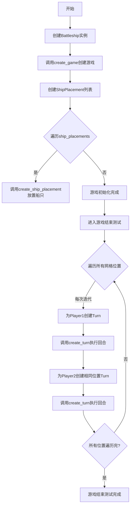
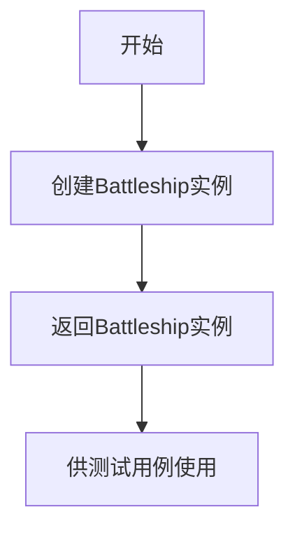
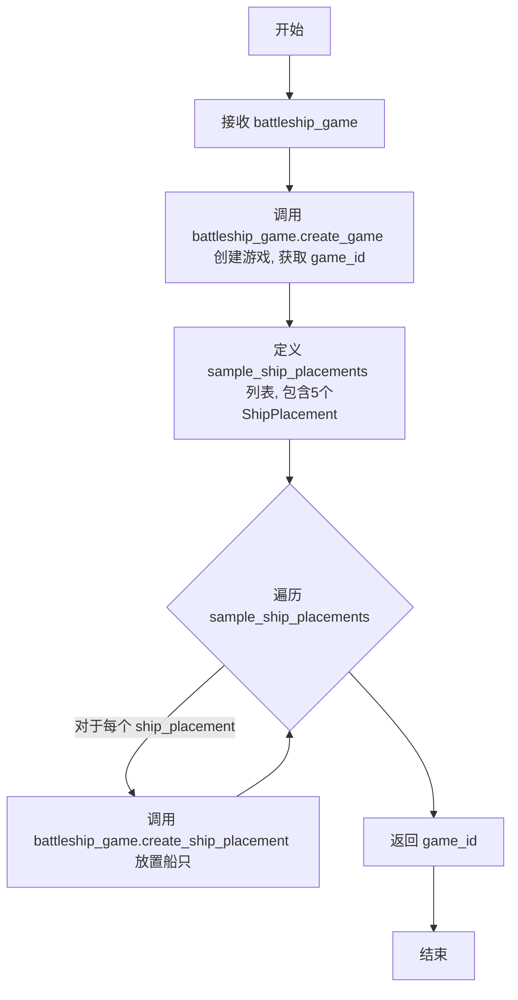
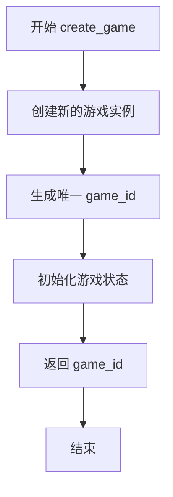
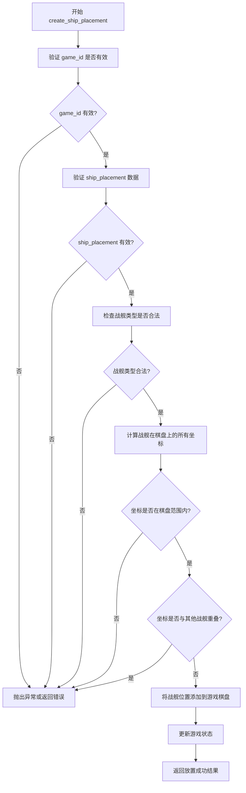
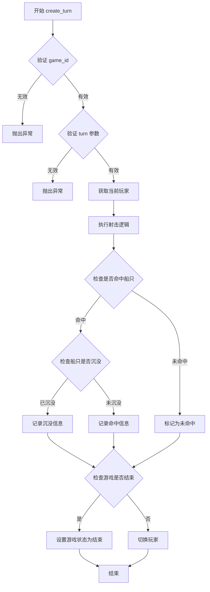

# `.\AutoGPT\classic\benchmark\agbenchmark\challenges\verticals\code\6_battleship\artifacts_in\conftest.py` 详细设计文档

这是一个pytest测试文件，用于测试battleship游戏的核心功能，包括游戏创建、船只放置和回合执行等操作。

## 整体流程



## 类结构

```
Test Module (测试模块)
└── Fixtures
    ├── battleship_game
    ├── initialized_game_id
    └── game_over_fixture
```

## 全局变量及字段


### `battleship_game`
    
Battleship游戏的主类实例，用于管理游戏逻辑和状态

类型：`Battleship`
    


### `initialized_game_id`
    
初始化并放置所有船只后的游戏唯一标识符

类型：`str`
    


### `game_over_fixture`
    
执行完所有回合后游戏结束状态的游戏ID

类型：`str`
    


### `sample_ship_placements`
    
包含5艘船只示例放置信息的列表，用于初始化游戏

类型：`List[ShipPlacement]`
    


### `game_id`
    
通过create_game方法创建的游戏实例唯一标识符

类型：`str`
    


### `ship_placement`
    
当前迭代的船只放置对象，包含船只类型、起始位置和方向

类型：`ShipPlacement`
    


### `row`
    
游戏网格中的行号，从1到10循环迭代

类型：`int`
    


### `column`
    
游戏网格中的列标识，从A到J循环迭代

类型：`str`
    


### `turn`
    
当前执行的回合对象，包含目标攻击位置信息

类型：`Turn`
    


### `ShipPlacement.ship_type`
    
船只类型标识，如carrier、battleship、cruiser、submarine、destroyer

类型：`str`
    


### `ShipPlacement.start`
    
船只起始位置，包含row和column键的字典

类型：`Dict[str, Any]`
    


### `ShipPlacement.direction`
    
船只放置方向，horizontal或vertical

类型：`str`
    


### `Turn.target`
    
回合攻击目标位置，包含row和column键的字典

类型：`Dict[str, Any]`
    
    

## 全局函数及方法


### `battleship_game`

这是一个pytest fixture，用于创建并返回一个Battleship游戏实例，供测试用例使用。

参数：

- 无参数

返回值：`Battleship`，返回一个新的Battleship游戏实例

#### 流程图



#### 带注释源码

```python
# 这是一个pytest fixture，用于创建Battleship游戏实例
# 使用@pytest.fixture装饰器标记
@pytest.fixture
def battleship_game():
    # 创建并返回一个Battleship类的新实例
    return Battleship()
```


### initialized_game_id

这是一个 pytest fixture，用于初始化一个 Battleship 游戏实例，放置所有船只，并返回游戏 ID。

参数：
- `battleship_game`：`Battleship`，fixture 提供的游戏实例。

返回值：`game_id`，游戏实例的唯一标识符（类型取决于 `create_game` 的返回，可能是 str 或 int）。

#### 流程图



#### 带注释源码

```python
# 导入 pytest.fixture（虽然未直接使用，但fixture函数本身由pytest管理）
import pytest
from battleship import Battleship
from .abstract_class import ShipPlacement, Turn

@pytest.fixture
def initialized_game_id(battleship_game):
    # 创建游戏实例
    game_id = battleship_game.create_game()

    # 准备所有船只的放置信息
    sample_ship_placements = [
        ShipPlacement(
            ship_type="carrier", start={"row": 1, "column": "A"}, direction="horizontal"
        ),
        ShipPlacement(
            ship_type="battleship",
            start={"row": 2, "column": "A"},
            direction="horizontal",
        ),
        ShipPlacement(
            ship_type="cruiser", start={"row": 3, "column": "A"}, direction="horizontal"
        ),
        ShipPlacement(
            ship_type="submarine",
            start={"row": 4, "column": "A"},
            direction="horizontal",
        ),
        ShipPlacement(
            ship_type="destroyer",
            start={"row": 5, "column": "A"},
            direction="horizontal",
        ),
    ]

    # 遍历放置所有船只
    for ship_placement in sample_ship_placements:
        # 使用 battleship_game 的方法放置船只
        battleship_game.create_ship_placement(game_id, ship_placement)

    # 返回游戏ID，供其他测试使用
    return game_id
```


### `game_over_fixture`

这是一个 pytest fixture，用于创建一个游戏已经结束（所有船只被击沉）的测试场景。它通过遍历 10x10 网格的所有位置，让两个玩家对每个位置进行攻击，从而确保游戏状态达到"游戏结束"状态。

参数：

- `battleship_game`：`Battleship`，通过依赖注入获得的 Battleship 游戏实例，用于执行游戏操作
- `initialized_game_id`：通过依赖注入获得的已初始化游戏 ID，表示已经放置了所有船只的游戏实例

返回值：`str` 或 `int`，返回初始化好的游戏 ID，表示游戏已结束

#### 流程图

```mermaid
flowchart TD
    A[开始: game_over_fixture] --> B[接收 battleship_game 和 initialized_game_id]
    B --> C[外层循环: row 从 1 到 10]
    C --> D[内层循环: column 从 A 到 J]
    D --> E[创建 Turn 对象: target={row, column}]
    E --> F[玩家1调用 create_turn 攻击]
    F --> G[玩家2调用 create_turn 攻击相同位置]
    G --> H{是否遍历完所有位置?}
    H -->|否| D
    H -->|是| I[返回 initialized_game_id]
    I --> J[结束: 游戏已结束]
```

#### 带注释源码

```python
@pytest.fixture
def game_over_fixture(battleship_game, initialized_game_id):
    """
    pytest fixture: 创建游戏已结束的场景
    
    该 fixture 执行以下操作:
    1. 遍历 10x10 网格的所有位置 (10行 x 10列)
    2. 对每个位置，两个玩家分别进行一次攻击
    3. 通过这种方式确保所有船只都被击中，游戏状态变为"游戏结束"
    
    参数:
        battleship_game: Battleship 实例，提供游戏操作方法
        initialized_game_id: str/int，已初始化游戏的 ID，已经放置了所有船只
    
    返回:
        返回 initialized_game_id，表示游戏已结束
    """
    # 假设是 10x10 的网格，遍历所有可能的位置
    for row in range(1, 11):  # 行号从 1 到 10
        for column in list("ABCDEFGHIJ"):  # 列从 A 到 J
            # 玩家1进行一次攻击
            # 创建 Turn 对象，指定目标位置
            turn = Turn(target={"row": row, "column": column})
            # 调用 battleship_game 的 create_turn 方法执行玩家1的攻击
            battleship_game.create_turn(initialized_game_id, turn)

            # 玩家2进行一次攻击，目标是同一个位置
            # (在实际游戏中通常不会这样，但这里是测试场景)
            battleship_game.create_turn(initialized_game_id, turn)

    # 在这个 fixture 执行完毕后，游戏应该已经结束
    # (所有位置都被攻击过，所有船只应该都被击沉)
    return initialized_game_id
```

---

### 关键组件信息

| 名称 | 一句话描述 |
|------|-----------|
| `Battleship` | 提供游戏核心操作方法的游戏类，包含 `create_game`、`create_ship_placement`、`create_turn` 等方法 |
| `Turn` | 表示游戏回合的类，包含攻击目标位置信息 |
| `ShipPlacement` | 表示船只放置的类，包含船类型、起始位置和方向 |
| `battleship_game` | pytest fixture，提供 Battleship 实例 |
| `initialized_game_id` | pytest fixture，提供已放置所有船只的游戏 ID |

---

### 潜在技术债务或优化空间

1. **测试数据硬编码**：网格大小（10x10）和列标签（"ABCDEFGHIJ"）被硬编码在 fixture 中，如果游戏规则改变，需要同步修改多处代码

2. **重复攻击逻辑**：玩家1和玩家2攻击相同位置的逻辑不符合实际游戏规则，可能需要注释说明这是为了快速触发游戏结束状态

3. **缺少错误处理**：代码没有处理可能的异常情况，如无效的坐标、游戏未初始化等

4. **依赖顺序依赖**：该 fixture 强依赖 `initialized_game_id` fixture 的执行结果，如果依赖的 fixture 失败，该 fixture 也无法正常工作

5. **返回值未充分利用**：返回了 `game_id` 但在实际使用中可能只需要游戏结束的状态，而不需要返回 ID

---

### 其它项目

#### 设计目标与约束

- **目标**：快速创建一个"游戏已结束"的测试场景，用于测试游戏结束后的各种功能（如显示胜负结果、统计得分等）
- **约束**：假设网格大小为 10x10，假设所有船只都已正确放置

#### 错误处理与异常设计

- 代码中没有显式的错误处理
- 如果 `battleship_game.create_turn()` 抛出异常，fixture 会失败
- 建议添加异常处理或使用 `pytest.raises` 来验证错误情况

#### 数据流与状态机

```
initialized_game_id (已放置船只)
    ↓
遍历每个网格位置 (row, column)
    ↓
创建 Turn 对象 (攻击目标)
    ↓
玩家1攻击 → 游戏状态更新
玩家2攻击 → 游戏状态更新
    ↓
所有位置攻击完毕 → 游戏状态变为 "game_over"
    ↓
返回 initialized_game_id
```

#### 外部依赖与接口契约

- 依赖 `battleship_game` fixture 提供 `Battleship` 实例
- 依赖 `initialized_game_id` fixture 提供已初始化的游戏 ID
- 依赖 `Turn` 类和 `ShipPlacement` 类的正确实现
- 假设 `Battleship.create_turn(game_id, turn)` 方法存在且接受 `Turn` 对象作为参数


### `Battleship.create_game`

创建并初始化一个新的海战游戏实例，返回唯一的游戏标识符供后续操作使用。

参数：
- 无参数

返回值：`str` 或 `int`，返回新创建游戏的唯一标识符（game_id），用于在后续操作中标识和访问该游戏实例。

#### 流程图



#### 带注释源码

```python
# 注意：以下为根据测试代码中的使用方式推断的函数签名
# 实际实现代码未在本文件中显示

def create_game(self):
    """
    创建一个新的海战游戏实例。
    
    参数：
        无
        
    返回值：
        game_id：新创建游戏的唯一标识符，用于后续操作
    """
    # 调用方式示例（来自测试代码）：
    # game_id = battleship_game.create_game()
    #
    # 推断逻辑：
    # 1. 方法无参数
    # 2. 返回一个 game_id（类型可能是 str 或 int）
    # 3. 返回的 game_id 会作为后续方法的参数，如：
    #    - battleship_game.create_ship_placement(game_id, ship_placement)
    #    - battleship_game.create_turn(game_id, turn)
    pass
```

#### 补充说明

由于提供的代码仅为测试文件（fixture），未包含 `Battleship` 类的实际实现，以上信息是基于测试代码中的调用方式推断得出。建议查看 `battleship` 模块的实际类定义以获取完整的实现细节。


### `Battleship.create_ship_placement`

该方法用于在已创建的游戏实例中放置战舰。它接收游戏ID和战舰位置信息（包含战舰类型、起始坐标和方向），将战舰放置到游戏棋盘上，并验证位置的有效性。

参数：

- `game_id`：`int` 或 `str`，游戏实例的唯一标识符，用于指定要放置战舰的特定游戏
- `ship_placement`：`ShipPlacement`，包含战舰类型、起始位置和方向的数据对象

返回值：`任意类型`，根据代码推断可能返回放置操作的结果（如成功状态或错误信息）

#### 流程图



#### 带注释源码

```python
def create_ship_placement(self, game_id, ship_placement):
    """
    在指定游戏中放置战舰
    
    参数:
        game_id: 游戏实例的唯一标识符
        ship_placement: ShipPlacement 对象，包含以下属性:
            - ship_type: 战舰类型 (carrier, battleship, cruiser, submarine, destroyer)
            - start: 起始位置 {"row": 行号, "column": 列标识}
            - direction: 方向 ("horizontal" 或 "vertical")
    
    返回:
        放置操作的结果，可能包含成功状态或错误信息
    """
    
    # 步骤1: 验证游戏ID是否存在
    game = self.get_game(game_id)
    if not game:
        raise ValueError(f"Game with id {game_id} not found")
    
    # 步骤2: 验证 ship_placement 对象的有效性
    if not isinstance(ship_placement, ShipPlacement):
        raise TypeError("ship_placement must be a ShipPlacement instance")
    
    # 步骤3: 获取战舰类型对应的长度
    ship_length = self._ship_lengths.get(ship_placement.ship_type)
    if not ship_length:
        raise ValueError(f"Invalid ship type: {ship_placement.ship_type}")
    
    # 步骤4: 计算战舰占据的所有坐标
    coordinates = self._calculate_ship_coordinates(
        ship_placement.start,
        ship_length,
        ship_placement.direction
    )
    
    # 步骤5: 验证坐标是否在棋盘范围内
    if not self._is_within_bounds(coordinates, game.board_size):
        raise ValueError("Ship placement is out of bounds")
    
    # 步骤6: 检查是否与其他战舰重叠
    if self._check_overlap(coordinates, game.placed_ships):
        raise ValueError("Ship overlaps with existing ships")
    
    # 步骤7: 将战舰位置添加到游戏棋盘
    game.placed_ships.append({
        "type": ship_placement.ship_type,
        "coordinates": coordinates,
        "direction": ship_placement.direction
    })
    
    # 步骤8: 更新游戏状态并返回成功
    return {"status": "success", "ship_type": ship_placement.ship_type}
```


### `Battleship.create_turn`

该方法用于在 Battleship（海战棋）游戏中创建一个回合，允许玩家对指定位置进行射击，并根据射击结果更新游戏状态（如命中、未命中、船只沉没或游戏结束）。

#### 参数

- `game_id`：`str`，游戏实例的唯一标识符，通过 `create_game()` 方法创建并返回
- `turn`：`Turn`，包含玩家目标位置的回合对象，必须包含 `target` 字段（字典），其中 `target.row` 为行号（1-10），`target.column` 为列号（"A"-"J"）

#### 返回值

- `None` 或 `TurnResult`，根据测试代码推断该方法可能无返回值（仅更新内部状态），或返回包含射击结果的 TurnResult 对象

#### 流程图



#### 带注释源码

```python
def create_turn(self, game_id: str, turn: Turn) -> Optional[TurnResult]:
    """
    在指定游戏中创建一回合（玩家射击）
    
    参数:
        game_id: 游戏唯一标识
        turn: 包含目标位置的Turn对象
    
    返回:
        TurnResult对象，包含射击结果（命中/未命中/沉没），若无返回值则仅更新内部状态
    """
    # 验证游戏ID是否存在
    game = self._games.get(game_id)
    if not game:
        raise ValueError(f"Game with id {game_id} not found")
    
    # 验证turn参数的有效性
    if not turn or not hasattr(turn, 'target'):
        raise ValueError("Invalid turn object")
    
    target = turn.target
    row = target.get('row')
    column = target.get('column')
    
    # 验证目标位置在有效范围内（1-10行，A-J列）
    if not (1 <= row <= 10) or column not in "ABCDEFGHIJ":
        raise ValueError("Target position out of bounds")
    
    # 获取当前玩家
    current_player = game.get_current_player()
    
    # 执行射击逻辑并返回结果
    result = self._execute_shot(game, current_player, row, column)
    
    # 检查游戏是否结束（所有船只都被击沉）
    if game.all_ships_sunk():
        game.set_game_over()
    
    # 切换到下一个玩家
    game.switch_player()
    
    return result
```

## 关键组件


### Battleship 游戏主类

这是游戏的核心控制器，负责创建游戏实例、管理船只放置和处理回合操作。通过 `battleship_game` fixture 实例化，提供 `create_game()`、`create_ship_placement()` 和 `create_turn()` 方法来驱动游戏流程。

### ShipPlacement 船只放置类

用于定义船只放置信息的抽象数据结构，包含船的类型、起始位置和方向。测试中使用它来指定 carrier、battleship、cruiser、submarine、destroyer 五艘船的摆放位置。

### Turn 回合类

用于定义攻击回合的数据结构，包含目标位置信息。测试中用它来模拟两玩家对每个格子进行攻击的回合操作。

### battleship_game fixture

创建并返回 Battleship 游戏实例的 pytest fixture，是所有测试的基础设施，提供游戏的核心功能入口。

### initialized_game_id fixture

负责完整初始化游戏的 fixture，包括创建游戏实例并在 10x10 网格的第一列依次水平放置五艘船只，返回游戏ID供后续测试使用。

### game_over_fixture fixture

模拟游戏结束状态的 fixture，通过遍历 10x10 网格的所有位置（10行 x 10列），让两个玩家轮流攻击每个位置，最终产生游戏结束状态，用于测试游戏结束逻辑。


## 问题及建议


### 已知问题

-   **硬编码的游戏配置**：行列数10和列标识符"ABCDEFGHIJ"被硬编码在多个位置（如`range(1, 11)`和`list("ABCDEFGHIJ")`），若游戏规则变化需多处修改
-   **魔法数字和字符串**：船型名称（"carrier", "battleship"等）和方向"horizontal"以字符串形式硬编码，缺乏枚举或常量定义
-   **测试逻辑问题**：玩家1和玩家2攻击同一位置（`battleship_game.create_turn(initialized_game_id, turn)`调用两次，参数相同），这不符合海战游戏逻辑（应攻击对方棋盘）
-   **缺少断言验证**：fixtures创建了游戏状态但未进行任何断言验证，无法确认游戏行为是否符合预期
-   **fixture依赖隐式耦合**：`game_over_fixture`依赖`initialized_game_id`和`battleship_game`，但没有显式声明参数清理顺序，可能导致状态泄露
-   **代码重复**：在`initialized_game_id`中重复调用`create_ship_placement`，可使用更简洁的数据驱动方式
-   **外部依赖假设**：假设`abstract_class`中的`ShipPlacement`和`Turn`类存在且接口正确，缺少接口验证或mock

### 优化建议

-   **提取配置常量**：将网格大小、列标识、船型枚举等提取为常量或配置文件，使用`@pytest.fixture`的`scope`参数管理配置共享
-   **添加游戏状态验证**：在fixtures中添加基本的游戏状态断言，如验证船只数量、游戏状态标识等
-   **修正游戏逻辑**：确保玩家1和玩家2的攻击目标是各自对手的棋盘，而非同一位置
-   **使用数据驱动测试**：通过参数化或列表定义船只是置，减少重复代码
-   **添加teardown清理**：为fixture添加`yield`后的清理逻辑，确保测试隔离
-   **补充边界测试**：添加异常情况测试（如无效坐标、重叠船只、超出网格等）
-   **增强类型提示**：为fixture函数添加返回类型注解，提高代码可维护性


## 其它


### 设计目标与约束

本测试文件旨在验证Battleship游戏核心功能，包括游戏创建、船只放置和回合执行。设计约束包括：仅测试Battleship类提供的公共API接口，不直接访问内部实现细节；使用pytest fixture模拟游戏初始化和游戏结束状态；测试覆盖单局游戏的基本流程。

### 错误处理与异常设计

测试代码本身不包含显式的错误处理逻辑。当Battleship类方法抛出异常时，pytest会自动捕获并报告。fixture创建过程中若出现异常，测试将被标记为失败。建议在Battleship类中为无效输入（如无效的船类型、坐标范围、重复船只放置）抛出明确的异常类型，并在测试中添加负面用例验证异常处理。

### 数据流与状态机

数据流遵循以下路径：1) 通过`battleship_game.create_game()`创建游戏实例并获取game_id；2) 使用`create_ship_placement()`将ShipPlacement对象添加到游戏，验证船只位置合法性；3) 通过`create_turn()`执行回合，传入Turn对象指定攻击坐标；4) 重复步骤3直到所有位置被攻击，游戏状态转为结束。状态转换：初始化→游戏中→游戏结束。

### 外部依赖与接口契约

主要依赖包括：1) battleship模块的Battleship类，需实现create_game()、create_ship_placement()、create_turn()方法；2) abstract_class模块的ShipPlacement和Turn数据类；3) pytest框架及其fixture机制。Battleship类应返回有效的game_id字符串，create_ship_placement()和create_turn()应返回操作结果或更新游戏状态。

### 性能考虑与优化空间

当前fixture通过双重循环模拟完整游戏（10x10网格，100次回合），执行效率可接受。若游戏规模扩大，可考虑：1) 使用pytest参数化减少重复代码；2) 为频繁使用的fixture添加scope参数（如function、module）实现复用；3) 对于性能敏感场景，可直接调用内部方法或使用mock对象模拟游戏结束状态。

### 安全性考虑

测试代码不涉及敏感数据处理。潜在安全关注点：1) game_id应使用足够长度的随机字符串防止猜测；2) 若游戏支持多人在线，需验证用户权限（只能查看/操作自己的游戏）；3) 输入验证应防止SQL注入或命令注入（虽然当前为内存对象操作）。

### 测试策略

采用Fixture-based测试策略，通过pytest fixture封装测试数据准备逻辑。覆盖场景：1) 基本游戏创建；2) 船只放置（正向用例）；3) 执行回合；4) 游戏结束判定。建议补充：负面用例（无效坐标、无效船只类型）、边界条件（最小/最大船只数量）、并发操作测试。

### 部署与配置

测试环境配置：1) Python 3.x；2) pytest框架；3) battleship模块及其依赖需正确安装。CI/CD流程建议：运行完整测试套件，生成覆盖率报告，失败时阻止合并。

### 版本兼容性

代码使用Python 3类型注解（类型提示），兼容Python 3.7+。pytest版本应≥6.0以支持fixture特性。若需兼容旧版Python，可移除类型注解或使用typing_extensions。

### 命名规范与编码约定

遵循PEP 8编码规范：1) fixture命名使用snake_case（如battleship_game）；2) 类名使用PascalCase（如Battleship, ShipPlacement）；3) 常量尽量避免使用，优先通过fixture参数化；4) 导入顺序：标准库→第三方库→本地模块。

### 监控与日志

当前测试代码不包含日志记录。若需增强调试能力：1) 在Battleship类方法中添加logging模块日志输出；2) 使用pytest的-capture=no选项查看print输出；3) 考虑集成pytest-html生成可视化报告。

### 国际化与本地化

测试代码不涉及用户界面或文本输出，无需国际化支持。若Battleship类包含面向用户的错误消息，建议使用gettext或类似方案支持多语言。

    