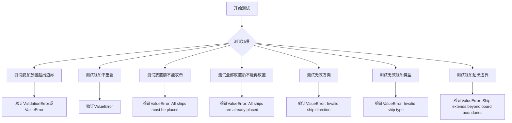
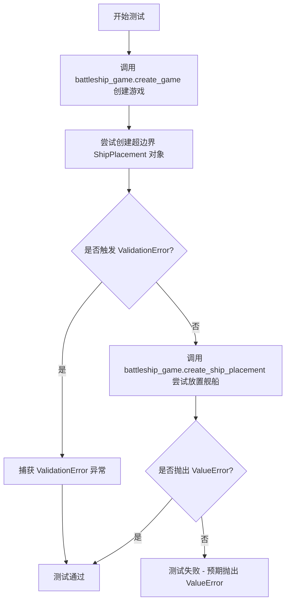
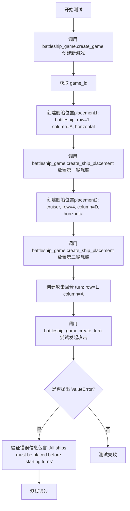
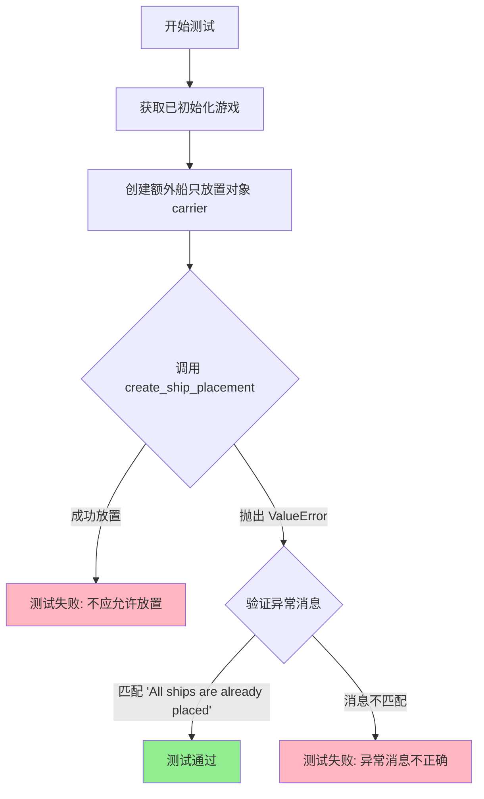
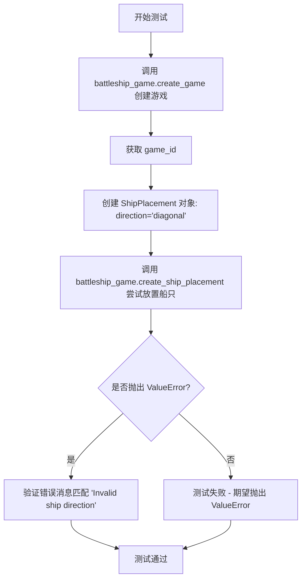
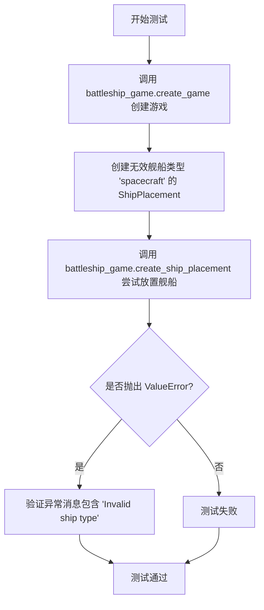
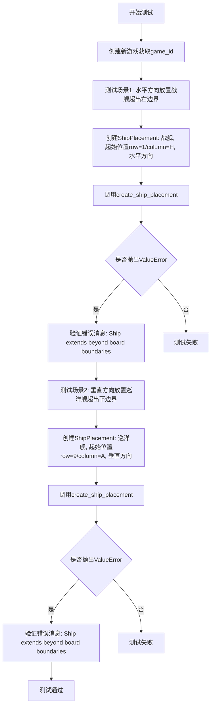

# `.\AutoGPT\classic\benchmark\agbenchmark\challenges\verticals\code\6_battleship\artifacts_in\test_negative.py` 详细设计文档

这是一个海战游戏(battleship)的测试文件，主要用于验证舰船放置的各种边界情况和错误处理，包括超出边界、舰船重叠、无效方向、无效舰船类型等场景的测试。

## 整体流程



## 类结构

```
Abstract Classes (从abstract_class.py导入)
├── ShipPlacement (数据模型类)
│   - ship_type: str
│   - start: dict
│   - direction: str
└── Turn (数据模型类)
    - target: dict
---
Test Functions (本文件)
├── test_ship_placement_out_of_bounds
├── test_no_ship_overlap
├── test_cant_hit_before_ships_placed
├── test_cant_place_ship_after_all_ships_placed
├── test_ship_placement_invalid_direction
├── test_invalid_ship_type
└── test_ship_placement_extends_beyond_boundaries
```

## 全局变量及字段


### `game_id`
    
游戏ID，由create_game()方法返回

类型：`int`
    


### `out_of_bounds_ship`
    
超边界舰船对象，用于测试越位放置（创建时触发ValidationError）

类型：`ShipPlacement`
    


### `placement1`
    
第一个舰船放置对象

类型：`ShipPlacement`
    


### `placement2`
    
第二个舰船放置对象，用于测试舰船重叠

类型：`ShipPlacement`
    


### `turn`
    
回合对象，表示一次攻击操作

类型：`Turn`
    


### `additional_ship`
    
额外舰船对象，用于测试所有舰船放置后不能再放置

类型：`ShipPlacement`
    


### `invalid_direction_ship`
    
无效方向舰船对象，用于测试无效方向

类型：`ShipPlacement`
    


### `invalid_ship`
    
无效类型舰船对象，用于测试无效舰船类型

类型：`ShipPlacement`
    


### `ship_extending_beyond`
    
超边界舰船对象，用于测试超出边界

类型：`ShipPlacement`
    


### `ShipPlacement.ship_type`
    
舰船类型

类型：`str`
    


### `ShipPlacement.start`
    
起始位置，包含row和column

类型：`dict`
    


### `ShipPlacement.direction`
    
放置方向，horizontal或vertical

类型：`str`
    


### `Turn.target`
    
攻击目标位置，包含row和column

类型：`dict`
    
    

## 全局函数及方法


### `test_ship_placement_out_of_bounds`

该测试函数用于验证当尝试放置超出游戏 board 边界的舰船时系统的正确行为，测试两种场景：一种是在创建 ShipPlacement 对象时 Pydantic 验证失败，另一种是调用 create_ship_placement 时抛出 ValueError。

参数：

-  `battleship_game`：`<class 'pytest.fixture'>`，pytest fixture，提供 battleship_game 实例用于测试

返回值：`None`，测试函数无返回值

#### 流程图



#### 带注释源码

```python
def test_ship_placement_out_of_bounds(battleship_game):
    """
    测试舰船放置超出边界的情况
    
    测试场景：
    1. 尝试创建 row=11, column='Z' 的舰船（超出标准棋盘范围）
    2. 验证系统在舰船放置时的边界检查逻辑
    """
    
    # Step 1: 创建新游戏实例
    game_id = battleship_game.create_game()

    try:
        # Step 2: 尝试创建超出边界的舰船放置对象
        # row=11 超出标准行范围（通常为1-10）
        # column='Z' 超出标准列范围（通常为A-J）
        out_of_bounds_ship = ShipPlacement(
            ship_type="battleship",
            start={"row": 11, "column": "Z"},
            direction="horizontal",
        )
    except ValidationError:  
        # 如果 Pydantic 验证在创建 ShipPlacement 时就失败
        # （例如字段类型校验），则捕获异常
        pass
    else:
        # 如果 ShipPlacement 创建成功，则继续尝试放置舰船
        # 期望 create_ship_placement 方法抛出 ValueError
        with pytest.raises(ValueError, match="Placement out of bounds"):
            battleship_game.create_ship_placement(game_id, out_of_bounds_ship)
```


### `test_no_ship_overlap`

该测试函数用于验证在海战游戏中，当尝试将两艘舰船放置在相同位置时，系统能够正确抛出 ValueError 异常，确保舰船之间不会发生重叠。

参数：

- `battleship_game`：`pytest.fixture`，海战游戏实例的 fixture 参数，用于提供测试所需的游戏对象

返回值：`None`，测试函数无返回值，通过 pytest 断言验证异常抛出

#### 流程图

```mermaid
flowchart TD
    A[开始测试] --> B[调用 battleship_game.create_game 创建新游戏]
    B --> C[获取 game_id]
    C --> D[创建第一个 ShipPlacement: battleship, 位置(1,A), 水平方向]
    D --> E[调用 battleship_game.create_ship_placement 创建第一艘船]
    E --> F[创建第二个 ShipPlacement: cruiser, 位置(1,A), 水平方向]
    F --> G[尝试调用 battleship_game.create_ship_placement 创建第二艘船]
    G --> H{是否抛出 ValueError?}
    H -->|是| I[测试通过]
    H -->|否| J[测试失败]
```

#### 带注释源码

```python
def test_no_ship_overlap(battleship_game):
    """
    测试舰船不重叠的功能
    
    验证当尝试在同一位置放置两艘舰船时，系统能够正确
    抛出 ValueError 异常，防止舰船重叠。
    """
    # 第一步：创建一个新游戏，获取游戏ID
    game_id = battleship_game.create_game()
    
    # 第二步：创建第一个舰船放置（战列舰）
    # 位置：第1行，A列，水平方向
    placement1 = ShipPlacement(
        ship_type="battleship",
        start={"row": 1, "column": "A"},
        direction="horizontal"
    )
    
    # 第三步：将第一艘船放置到游戏棋盘上
    battleship_game.create_ship_placement(game_id, placement1)
    
    # 第四步：创建第二个舰船放置（巡洋舰）
    # 尝试在同一位置放置：第1行，A列，水平方向
    placement2 = ShipPlacement(
        ship_type="cruiser",
        start={"row": 1, "column": "A"},
        direction="horizontal"
    )
    
    # 第五步：尝试放置第二艘船，期望抛出 ValueError 异常
    # 因为该位置已经被第一艘船占用
    with pytest.raises(ValueError):
        battleship_game.create_ship_placement(game_id, placement2)
```


### `test_cant_hit_before_ships_placed`

该测试函数验证了在所有舰船放置完成之前，玩家不能发起攻击的业务规则。通过创建游戏、尝试放置部分舰船后立即发起攻击，预期系统抛出 "All ships must be placed before starting turns" 的错误信息。

参数：

- `battleship_game`：`BattleshipGame`（测试夹具），提供 battleship_game 实例，用于调用游戏相关方法

返回值：`None`，测试函数不返回具体值，仅通过 pytest 断言验证行为

#### 流程图



#### 带注释源码

```python
def test_cant_hit_before_ships_placed(battleship_game):
    """
    测试在所有舰船放置完成前不能发起攻击
    
    验证业务规则：玩家必须先放置所有舰船，才能开始进行攻击回合
    """
    # 步骤1: 创建新游戏，获取游戏ID
    game_id = battleship_game.create_game()

    # 步骤2: 创建第一艘舰船的位置信息（ battleship 战舰）
    # 起始位置: 第1行第A列，水平方向放置
    placement1 = ShipPlacement(
        ship_type="battleship", 
        start={"row": 1, "column": "A"}, 
        direction="horizontal"
    )
    
    # 步骤3: 将第一艘舰船放置到游戏棋盘上
    battleship_game.create_ship_placement(game_id, placement1)

    # 步骤4: 创建第二艘舰船的位置信息（ cruiser 巡洋舰）
    # 起始位置: 第4行第D列，水平方向放置
    placement2 = ShipPlacement(
        ship_type="cruiser", 
        start={"row": 4, "column": "D"}, 
        direction="horizontal"
    )
    
    # 步骤5: 将第二艘舰船放置到游戏棋盘上
    battleship_game.create_ship_placement(game_id, placement2)

    # 步骤6: 创建攻击回合信息
    # 目标位置: 第1行第A列（即第一艘战舰的位置）
    turn = Turn(target={"row": 1, "column": "A"})

    # 步骤7: 尝试在未满足条件的情况下发起攻击
    # 预期结果: 抛出 ValueError，错误信息为 "All ships must be placed before starting turns"
    # 实际场景: 游戏中可能要求所有舰船都放置完成后才能开始攻击
    #          这里只放置了2艘舰船，可能还有其他类型舰船未放置
    with pytest.raises(
        ValueError, match="All ships must be placed before starting turns"
    ):
        battleship_game.create_turn(game_id, turn)
```


### `test_cant_place_ship_after_all_ships_placed`

该测试函数验证在游戏所有船只已放置完成后，尝试再次放置额外船只时系统正确抛出 `ValueError` 异常，确保游戏状态转换的合法性。

参数：

- `battleship_game`：`fixture`，提供游戏实例的模拟对象，用于执行游戏操作
- `initialized_game_id`：`fixture`，提供已初始化且所有船只已放置的游戏ID

返回值：无（测试函数无返回值）

#### 流程图



#### 带注释源码

```python
def test_cant_place_ship_after_all_ships_placed(battleship_game, initialized_game_id):
    """
    测试场景：全部船只放置完成后不能再放置船只
    
    测试目的：
    - 验证游戏状态机正确维护船只放置阶段
    - 确保玩家只能在准备阶段放置船只
    - 防止在游戏已开始后非法修改船只配置
    """
    # 第一步：获取已初始化的游戏状态，验证游戏存在且处于待命状态
    battleship_game.get_game(initialized_game_id)
    
    # 第二步：创建一个额外的船只放置对象（carrier类型）
    # 位置：第2行E列，水平方向
    additional_ship = ShipPlacement(
        ship_type="carrier",          # 船只类型：航母
        start={"row": 2, "column": "E"},  # 起始位置：第2行E列
        direction="horizontal"        # 放置方向：水平
    )

    # 第三步：尝试放置额外船只，预期抛出ValueError异常
    # 预期错误消息："All ships are already placed. Cannot place more ships."
    with pytest.raises(
        ValueError, match="All ships are already placed. Cannot place more ships."
    ):
        # 调用游戏对象的船只放置方法，应抛出异常
        battleship_game.create_ship_placement(initialized_game_id, additional_ship)
```


### `test_ship_placement_invalid_direction`

该测试函数用于验证当用户尝试使用无效的船只放置方向（如"diagonal"对角线）时，系统能够正确地抛出 ValueError 异常并返回相应的错误消息。

参数：

- `battleship_game`：`pytest.fixture`，提供 battleship_game 的测试 fixture，用于执行游戏创建和船只放置操作

返回值：`None`，测试函数不返回具体值，仅执行验证逻辑

#### 流程图



#### 带注释源码

```python
def test_ship_placement_invalid_direction(battleship_game):
    """
    测试无效的船只放置方向（对角线）是否被正确拒绝
    
    测试场景：
    - 创建一个新游戏
    - 尝试使用 'diagonal' 方向放置战舰
    - 期望系统抛出 ValueError 并包含 'Invalid ship direction' 错误消息
    """
    # 第一步：使用 fixture 创建一个新游戏，获取游戏ID
    game_id = battleship_game.create_game()

    # 第二步：使用 pytest.raises 上下文管理器捕获预期的异常
    with pytest.raises(ValueError, match="Invalid ship direction"):
        # 第三步：创建具有无效方向的 ShipPlacement 对象
        # direction="diagonal" 是无效的方向，应该被拒绝
        invalid_direction_ship = ShipPlacement(
            ship_type="battleship",      # 船只类型：战舰
            start={"row": 1, "column": "A"},  # 起始位置
            direction="diagonal",        # 无效的方向（应为 horizontal 或 vertical）
        )
        
        # 第四步：尝试调用游戏服务的放置方法
        # 期望在业务逻辑层验证方向有效性并抛出异常
        battleship_game.create_ship_placement(game_id, invalid_direction_ship)
```


### `test_invalid_ship_type`

该测试函数用于验证当尝试放置无效舰船类型（如 "spacecraft"）时，系统能否正确抛出 ValueError 异常，确保游戏只接受预定义的舰船类型。

参数：

- `battleship_game`：`<fixture>`，pytest fixture，提供 battleship_game 实例用于执行游戏操作

返回值：`None`，该函数为测试函数，不返回任何值

#### 流程图



#### 带注释源码

```python
def test_invalid_ship_type(battleship_game):
    # 使用 battleship_game fixture 创建一个新游戏，获取游戏ID
    game_id = battleship_game.create_game()
    
    # 创建一个 ShipPlacement 对象，使用无效的舰船类型 'spacecraft'
    # 有效的类型应该是: carrier, battleship, cruiser, submarine, destroyer
    invalid_ship = ShipPlacement(
        ship_type="spacecraft",  # 无效的舰船类型
        start={"row": 1, "column": "A"},  # 起始位置
        direction="horizontal"  # 水平方向
    )
    
    # 尝试使用无效的舰船类型创建舰船放置，预期会抛出 ValueError
    # 并验证错误消息包含 'Invalid ship type'
    with pytest.raises(ValueError, match="Invalid ship type"):
        battleship_game.create_ship_placement(game_id, invalid_ship)
```


### `test_ship_placement_extends_beyond_boundaries`

该测试函数验证了海战游戏中的边界检查功能，确保舰船放置超出棋盘边界时能够正确抛出 ValueError 异常。测试分别检查了水平方向（战舰从H列开始）和垂直方向（巡洋舰从第9行开始）两种超出边界的情况。

参数：

- `battleship_game`：`pytest.fixture`，BattleshipGame 类的 fixture 实例，提供游戏实例用于测试

返回值：`None`，测试函数无返回值，通过 pytest 框架的断言机制验证行为

#### 流程图



#### 带注释源码

```python
def test_ship_placement_extends_beyond_boundaries(battleship_game):
    """
    测试舰船放置超出棋盘边界的情况
    
    验证当舰船放置位置超出棋盘有效范围时，系统能够正确
    抛出包含特定错误消息的ValueError异常
    """
    # 通过fixture创建新游戏，获取游戏ID
    game_id = battleship_game.create_game()

    # 测试场景1：水平方向放置战舰超出右边界
    # 假设棋盘为10x10，战舰长度为5，从H列（第八列）开始水平放置
    # 将占据H,I,J,K,L列，超出边界
    with pytest.raises(ValueError, match="Ship extends beyond board boundaries"):
        # 创建超出边界的战舰放置对象
        ship_extending_beyond = ShipPlacement(
            ship_type="battleship",      # 战舰类型
            start={"row": 1, "column": "H"},  # 起始位置（第1行，H列）
            direction="horizontal",      # 水平方向
        )
        # 尝试将超出边界的战舰添加到游戏
        battleship_game.create_ship_placement(game_id, ship_extending_beyond)

    # 测试场景2：垂直方向放置巡洋舰超出下边界
    # 假设棋盘为10x10，巡洋舰长度为4，从第9行开始垂直放置
    # 将占据9,10,11行，第11行超出边界
    with pytest.raises(ValueError, match="Ship extends beyond board boundaries"):
        # 创建超出边界的巡洋舰放置对象
        ship_extending_beyond = ShipPlacement(
            ship_type="cruiser",         # 巡洋舰类型
            start={"row": 9, "column": "A"},  # 起始位置（第9行，A列）
            direction="vertical",        # 垂直方向
        )
        # 尝试将超出边界的巡洋舰添加到游戏
        battleship_game.create_ship_placement(game_id, ship_extending_beyond)
```

## 关键组件


### ShipPlacement（Pydantic模型）

用于表示战舰游戏中的船只放置数据模型，包含船只类型、起始位置和方向。验证船只类型、方向的有效性以及位置是否在棋盘范围内。

### Turn（Pydantic模型）

用于表示战舰游戏中的回合数据模型，包含目标攻击位置。确保在所有船只放置后才能执行回合。

### battleship_game（Fixture）

游戏对象实例，提供游戏管理功能。包含创建游戏、放置船只、创建回合等方法，负责业务逻辑验证和状态管理。

### 边界检查逻辑

验证船只放置和攻击位置是否在10x10棋盘（列A-J，行1-10）内。防止超出边界的位置输入。

### 船只重叠检测

确保同一位置上不能放置多个船只。验证新船只不会与已放置的船只发生重叠。

### 游戏状态转换控制

管理游戏的不同状态：初始化 → 船只放置阶段 → 游戏进行阶段。确保按正确顺序执行操作。

### 船只类型验证

支持五种船只类型：carrier、battleship、cruiser、submarine、destroyer。拒绝无效的船只类型输入。

### 方向验证

支持两种方向：horizontal（水平）和 vertical（垂直）。拒绝无效的方向输入。

### ValidationError（异常处理）

Pydantic模型验证失败时抛出的异常。用于在模型层面捕获无效输入。

### ValueError（业务异常）

业务逻辑验证失败时抛出的异常。用于表示游戏规则违反情况。


## 问题及建议


### 已知问题

- **异常处理逻辑不一致**：在`test_ship_placement_out_of_bounds`中先捕获`ValidationError`，然后在`else`分支中又用`pytest.raises(ValueError)`捕获异常；而其他测试直接使用`pytest.raises(ValueError)`。这种不一致的处理方式会导致测试逻辑混乱，且第一个分支的`pass`使得测试在某些情况下可能无法真正验证错误。
- **错误消息字符串硬编码**：错误消息（如"Placement out of bounds"、"All ships must be placed before starting turns"等）在多个测试中重复出现，若需修改错误文案需要同时修改多处，违反DRY原则。
- **测试数据重复定义**：相同或相似的`ShipPlacement`对象在多个测试函数中重复创建（如placement1），未使用pytest fixture进行复用，导致代码冗余。
- **测试验证逻辑冗余**：在`test_ship_placement_extends_beyond_boundaries`中对两个不同的越界场景分别使用了独立的`with pytest.raises`代码块，可以合并为一个参数化测试。
- **变量命名不一致**：部分测试中使用了较长且描述性过强的变量名（如`ship_extending_beyond`），而有些测试中变量名较短（如`out_of_bounds_ship`），影响代码可读性。
- **缺少测试覆盖说明**：测试代码中没有注释说明每个测试用例覆盖的业务场景和边界条件，对于后续维护者理解测试意图造成困难。

### 优化建议

- **统一异常处理方式**：移除`test_ship_placement_out_of_bounds`中的`try-except`分支，直接使用`pytest.raises(ValidationError)`或`pytest.raises(ValueError)`进行统一验证。
- **提取错误消息常量**：将所有错误消息字符串定义为模块级常量或枚举类，统一管理和引用。
- **使用pytest fixtures**：利用`@pytest.fixture`装饰器创建可复用的`ShipPlacement`对象和游戏初始化逻辑，减少重复代码。
- **使用pytest.mark.parametrize**：对`test_ship_placement_extends_beyond_boundaries`等场景使用参数化测试，将多个相似测试用例合并。
- **添加测试文档字符串**：为每个测试函数添加docstring，说明测试目的、输入数据和预期结果。
- **统一变量命名风格**：遵循一致的命名规范，建议使用清晰且简洁的变量名，如`ship_placement`或`placement`。

## 其它


### 设计目标与约束

本测试文件旨在验证海战游戏（ Battleship Game）的核心业务逻辑，包括船只放置的合法性检查、船只碰撞检测、游戏状态转换控制以及边界条件处理。测试覆盖了无效输入（非法船只类型、方向、位置）、状态转换约束（船只未完全放置前不能开始游戏）以及边界情况（船只超出棋盘范围）。测试采用行为驱动开发（BDD）风格，通过明确的错误消息验证系统对各类非法操作的正确响应。

### 错误处理与异常设计

测试代码主要关注以下异常场景：ValidationError 用于捕获 Pydantic 模型验证失败（如坐标格式错误），ValueError 用于捕获业务逻辑验证失败（如船只重叠、方向无效、类型非法、边界超限等）。每个测试用例都使用 pytest.raises() 断言捕获特定异常，并验证错误消息内容匹配预期。测试还验证了系统不会在异常情况下产生静默失败，所有非法操作都会抛出明确的 ValueError 并附带描述性错误消息。

### 数据流与状态机

游戏状态转换遵循严格的状态机规则：初始状态（Game Created）→ 船只放置中（Ship Placement Phase）→ 游戏就绪（All Ships Placed）→ 游戏进行中（Game In Progress）。测试覆盖的状态转换包括：从创建游戏到放置第一艘船、在船只放置阶段允许继续放置船只、船只全部放置完成后禁止再放置船只、船只未完全放置前禁止开始回合。状态转换由 battleship_game fixture 管理的内部状态控制，测试通过验证非法状态转换抛出 ValueError 来确认状态机实现正确。

### 外部依赖与接口契约

测试依赖于以下外部组件：pytest 框架提供测试运行环境和断言机制；pydantic 库提供 ShipPlacement 和 Turn 数据模型验证；abstract_class 模块定义 ShipPlacement 和 Turn 抽象类/数据类；battleship_game fixture 提供游戏实例的创建和控制接口。主要接口契约包括：create_game() 返回 game_id；create_ship_placement(game_id, placement) 验证并放置船只；create_turn(game_id, turn) 验证并执行攻击回合；get_game(game_id) 获取游戏状态。所有接口在验证失败时抛出 ValueError，在参数验证失败时抛出 ValidationError。

### 测试覆盖率分析

当前测试文件覆盖了船只放置验证的多个维度：边界验证（超出棋盘范围检测）、重叠检测（同一位置不能放置多艘船）、状态验证（船只未完全放置禁止开始游戏）、类型验证（只允许合法船只类型）、方向验证（只允许 horizontal/vertical）。但测试未覆盖的场景包括：成功放置船只的正常流程测试、船只被击中后的状态变化、船只被完全击沉的判定、游戏结束的判定、多艘船只连续放置的顺序影响、棋盘大小配置的可变性等。

### 关键业务规则总结

1. 船只放置必须满足：坐标在棋盘范围内、船只不超出边界、不与已放置船只重叠、方向只能为 horizontal 或 vertical
2. 游戏开始条件：所有船只必须放置完成后才能开始回合
3. 船只类型限制：目前已知合法类型包括 carrier、battleship、cruiser（从测试用例推断）
4. 错误消息规范：所有业务逻辑异常都应提供明确的错误消息，便于调试和问题定位

### 潜在的测试扩展方向

可考虑增加的测试场景：测试棋盘大小为非标准尺寸时的边界计算、测试对角线方向（如果游戏支持）、测试同一船只类型多次放置的限制、测试船只放置后的棋盘状态查询接口、测试游戏过程中的状态查询和历史记录功能、测试并发放置船只的线程安全性、测试网络延迟或服务不可用时的降级处理。

### 配置与常量

虽然测试代码未直接展示，但根据测试用例可推断以下常量存在：棋盘大小至少为 10x10（行1-10，列A-J）、船只类型包括 carrier（5格）、battleship（4格）、cruiser（3格，可能还有驱逐舰等）、支持的方向为 horizontal 和 vertical、初始游戏状态为刚创建、每艘船只需依次放置。


    