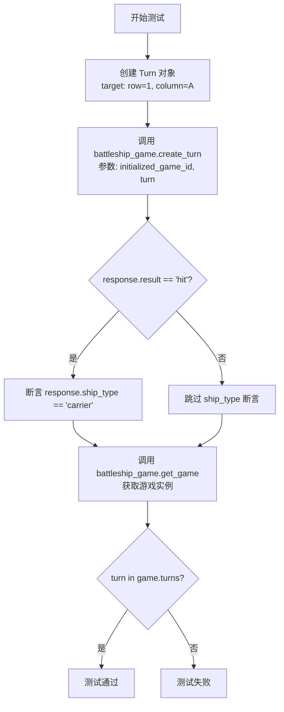
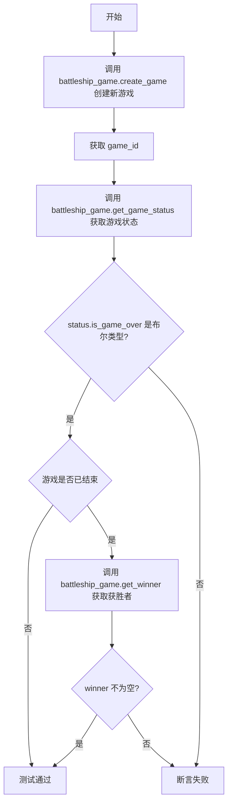
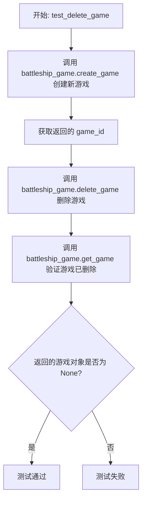
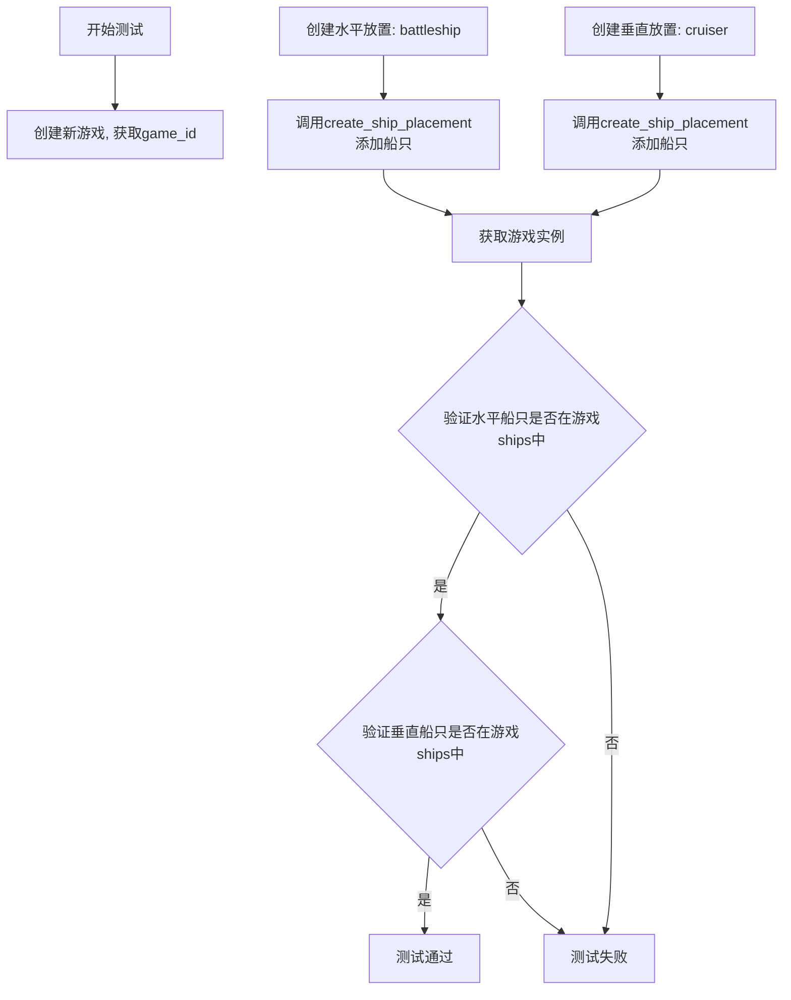
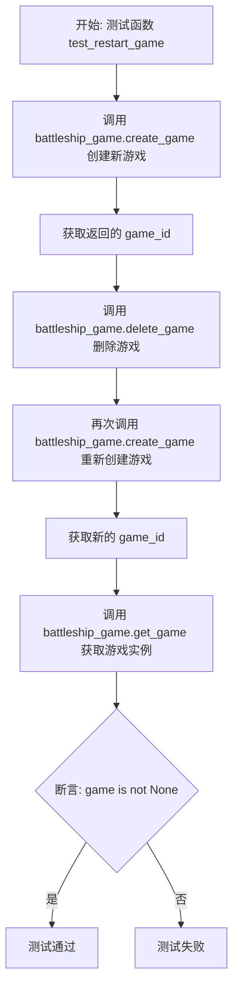
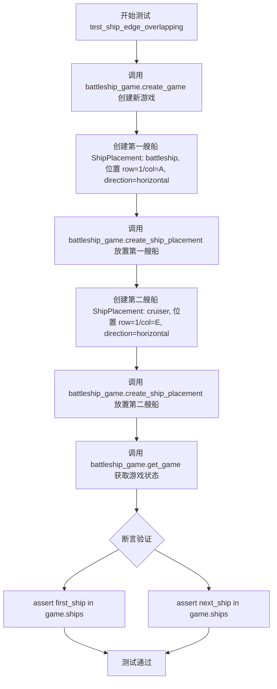
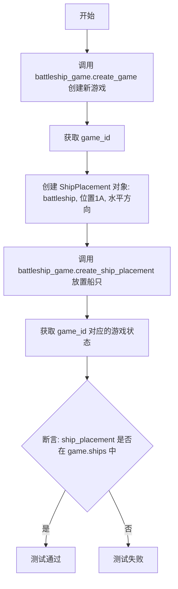
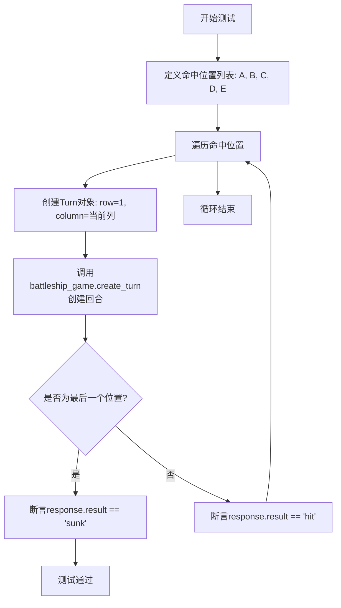

# `.\AutoGPT\classic\benchmark\agbenchmark\challenges\verticals\code\6_battleship\artifacts_in\test_positive.py` 详细设计文档

这是一个针对 Battleship（海战棋）游戏的集成测试文件，通过 pytest 测试框架验证游戏的回合制、船只放置、游戏状态更新、船只击沉判定以及游戏结束条件等核心功能。

## 整体流程

```mermaid
graph TD
    A[开始测试] --> B[创建游戏 battleship_game.create_game()]
B --> C{执行特定测试用例}
C --> D1[test_turns_and_results]
C --> D2[test_game_status_and_winner]
C --> D3[test_delete_game]
C --> D4[test_ship_rotation]
C --> D5[test_game_state_updates]
C --> D6[test_ship_sinking_feedback]
C --> D7[test_restart_game]
C --> D8[test_ship_edge_overlapping]
C --> D9[test_game_state_after_ship_placement]
C --> D10[test_game_state_after_turn]
C --> D11[test_multiple_hits_on_ship]
C --> D12[test_game_over_condition]
D1 --> E1[创建回合 Turn 并调用 create_turn]
D4 --> E4[创建 ShipPlacement 并调用 create_ship_placement]
E1 --> F1[验证 response.result (hit/miss/sunk)]
E4 --> F4[验证船只已放置到 game.ships]
F1 --> G[获取游戏状态 get_game / get_game_status]
G --> H[断言验证]
H --> I[结束测试]
H --> J[游戏结束检测 is_game_over]
J --> K[获取胜利者 get_winner]
```

## 类结构

```
TestBattleshipGame (测试模块)
├── 导入依赖
│   ├── ShipPlacement (抽象类/数据类)
│   └── Turn (抽象类/数据类)
└── 测试函数集
    ├── test_turns_and_results
    ├── test_game_status_and_winner
    ├── test_delete_game
    ├── test_ship_rotation
    ├── test_game_state_updates
    ├── test_ship_sinking_feedback
    ├── test_restart_game
    ├── test_ship_edge_overlapping
    ├── test_game_state_after_ship_placement
    ├── test_game_state_after_turn
    ├── test_multiple_hits_on_ship
    └── test_game_over_condition
```

## 全局变量及字段


### `turn`
    
表示一次游戏回合的攻击目标

类型：`Turn 实例`
    


### `response`
    
包含攻击结果（hit/miss/sunk）和被击中的船舰类型

类型：`API 响应对象`
    


### `game`
    
表示一场 Battleship 游戏的完整状态

类型：`Game 实例`
    


### `game_id`
    
游戏的唯一标识符，用于后续操作

类型：`str/int`
    


### `status`
    
封装游戏当前状态信息，包含是否游戏结束等

类型：`GameStatus 对象`
    


### `placement_horizontal`
    
水平方向放置的船舰配置

类型：`ShipPlacement`
    


### `placement_vertical`
    
垂直方向放置的船舰配置

类型：`ShipPlacement`
    


### `target_key`
    
游戏板上的目标坐标键值（行, 列索引）

类型：`tuple`
    


### `hits`
    
包含船舰位置的字母列表，用于测试船舰沉没

类型：`list`
    


### `static_moves`
    
固定的攻击坐标列表，用于填充游戏板

类型：`list`
    


### `hit_positions`
    
船舰被击中的位置列表，用于测试多次命中

类型：`list`
    


### `Turn.target`
    
攻击目标的坐标信息

类型：`dict (包含 row 和 column)`
    


### `ShipPlacement.ship_type`
    
船舰类型（如 carrier, battleship, cruiser 等）

类型：`str`
    


### `ShipPlacement.start`
    
船舰放置的起始坐标

类型：`dict (包含 row 和 column)`
    


### `ShipPlacement.direction`
    
船舰的放置方向

类型：`str (horizontal/vertical)`
    
    

## 全局函数及方法


### `test_turns_and_results`

该测试函数用于验证 Battleship 游戏中创建回合（Turn）并获取结果的功能，涵盖命中（hit）、未命中（miss）以及命中时的船舰类型验证，同时确认回合记录已被正确保存到游戏状态中。

参数：

- `battleship_game`：`<fixture>`，提供 Battleship 游戏实例的 fixture，用于调用游戏相关方法
- `initialized_game_id`：`<fixture>`，提供已初始化的游戏 ID，确保游戏在测试前已完成初始化（如船只放置）

返回值：无（该函数为测试函数，使用 assert 断言进行验证）

#### 流程图



#### 带注释源码

```python
from .abstract_class import ShipPlacement, Turn


def test_turns_and_results(battleship_game, initialized_game_id):
    """
    测试回合创建与结果返回功能
    
    验证流程:
    1. 创建指定坐标的回合对象
    2. 调用游戏接口创建回合并获取响应
    3. 验证响应结果为命中或未命中
    4. 若命中,验证船舰类型正确
    5. 验证回合已被记录到游戏状态中
    """
    # 创建回合对象,指定攻击坐标为第1行A列
    turn = Turn(target={"row": 1, "column": "A"})
    
    # 调用游戏实例方法创建回合,返回包含结果的对象
    # 响应对象包含: result(hit/miss/sunk), ship_type(被击中的船类型)等字段
    response = battleship_game.create_turn(initialized_game_id, turn)

    # 断言: 响应结果必须是命中或未命中之一
    assert response.result in ["hit", "miss"]
    
    # 如果结果为命中,进一步验证船舰类型
    # 此处假设A1坐标存在carrier类型船只
    if response.result == "hit":
        assert response.ship_type == "carrier"
    
    # 获取当前游戏状态,验证回合记录已保存
    game = battleship_game.get_game(initialized_game_id)
    
    # 断言: 创建的回合对象应存在于游戏的回合记录列表中
    assert turn in game.turns
```


### `test_game_status_and_winner`

该测试函数用于验证游戏状态查询和获胜者判断的功能是否正常工作。首先创建一个新游戏，然后获取游戏状态，验证 `is_game_over` 字段为布尔类型；如果游戏已结束，则进一步验证能够正确获取获胜者信息。

参数：

- `battleship_game`：测试 fixture，负责提供游戏实例的接口对象，用于调用创建游戏、获取游戏状态和获取获胜者等方法

返回值：`None`，该函数为测试函数，无显式返回值，通过 assert 断言验证功能正确性

#### 流程图



#### 带注释源码

```
def test_game_status_and_winner(battleship_game):
    # 使用 battleship_game fixture 创建一个新游戏，并获取返回的游戏 ID
    game_id = battleship_game.create_game()
    
    # 通过游戏 ID 获取游戏的当前状态
    status = battleship_game.get_game_status(game_id)
    
    # 断言验证 status.is_game_over 是布尔类型，确保接口返回类型正确
    assert isinstance(status.is_game_over, bool)
    
    # 如果游戏已经结束，则进一步验证获取获胜者的功能
    if status.is_game_over:
        # 根据游戏 ID 获取获胜者信息
        winner = battleship_game.get_winner(game_id)
        
        # 断言获胜者不为 None，确保游戏结束后能正确返回获胜者
        assert winner is not None
```


### `test_delete_game`

这是一个测试函数，用于验证游戏删除功能。测试创建一个新游戏，然后删除该游戏，最后确认该游戏已被成功删除且无法再通过 `get_game` 获取到。

参数：

- `battleship_game`：fixture 对象，提供游戏服务的实例，用于调用游戏相关的操作方法

返回值：`None`，测试函数不返回任何值

#### 流程图



#### 带注释源码

```python
def test_delete_game(battleship_game):
    """
    测试删除游戏的功能。
    
    验证流程：
    1. 创建一个新游戏并获取 game_id
    2. 使用 game_id 删除该游戏
    3. 验证通过 get_game 获取该游戏时返回 None
    """
    # 创建一个新游戏，返回游戏 ID
    game_id = battleship_game.create_game()
    
    # 使用游戏 ID 删除游戏
    battleship_game.delete_game(game_id)
    
    # 断言：删除后获取游戏应返回 None，验证删除成功
    assert battleship_game.get_game(game_id) is None
```


### `test_ship_rotation`

该测试函数用于验证战舰游戏中船只能够以水平或垂直方向正确放置，通过创建两个不同方向的船只placement对象并验证它们是否成功添加到游戏实例中。

参数：

- `battleship_game`：fixture参数，用于与游戏系统交互的测试夹具

返回值：`None`，该函数为测试函数，通过assert断言验证逻辑，不返回任何值

#### 流程图



#### 带注释源码

```python
def test_ship_rotation(battleship_game):
    """
    测试船只旋转功能：验证船只可以以水平或垂直方向放置
    
    测试步骤：
    1. 创建新游戏实例
    2. 创建水平方向的battleship船只放置
    3. 创建垂直方向的cruiser船只放置
    4. 验证两个船只都成功添加到游戏实例中
    """
    # 第一步：创建新游戏，获取游戏ID
    game_id = battleship_game.create_game()
    
    # 第二步：创建水平方向的战舰放置
    # direction="horizontal" 表示船只水平放置
    placement_horizontal = ShipPlacement(
        ship_type="battleship",          # 船只类型：战列舰
        start={"row": 1, "column": "B"}, # 起始位置：第1行B列
        direction="horizontal"           # 方向：水平
    )
    # 将水平放置的战舰添加到游戏中
    battleship_game.create_ship_placement(game_id, placement_horizontal)
    
    # 第三步：创建垂直方向的巡洋舰放置
    # direction="vertical" 表示船只垂直放置
    placement_vertical = ShipPlacement(
        ship_type="cruiser",             # 船只类型：巡洋舰
        start={"row": 3, "column": "D"}, # 起始位置：第3行D列
        direction="vertical"             # 方向：垂直
    )
    # 将垂直放置的巡洋舰添加到游戏中
    battleship_game.create_ship_placement(game_id, placement_vertical)
    
    # 第四步：获取游戏实例，验证船只是否成功添加
    game = battleship_game.get_game(game_id)
    
    # 断言：验证水平放置的船只存在于游戏ships集合中
    assert placement_horizontal in game.ships
    
    # 断言：验证垂直放置的船只存在于游戏ships集合中
    assert placement_vertical in game.ships
```


### `test_game_state_updates`

该测试函数用于验证游戏状态更新功能。具体来说，它创建一个针对坐标（row=3, column=A）的回合操作，然后获取游戏实例，断言目标位置在游戏板上的状态已被正确更新为"hit"。

参数：

- `battleship_game`：fixture，提供游戏 API 接口（如 create_turn、get_game 等方法）
- `initialized_game_id`：string/integer，已初始化并配置好舰船的游戏 ID

返回值：`None`（测试函数无显式返回值，通过 assert 断言验证正确性）

#### 流程图

```mermaid
flowchart TD
    A[开始测试] --> B[创建 Turn 对象: target={row: 3, column: A}]
    B --> C[调用 battleship_game.create_turn 创建回合]
    C --> D[调用 battleship_game.get_game 获取游戏实例]
    D --> E[计算目标键值: target_key = (3, 0)]
    E --> F{断言 target_key 在 game.board 中且值为 hit}
    F -->|是| G[测试通过]
    F -->|否| H[测试失败]
```

#### 带注释源码

```python
def test_game_state_updates(battleship_game, initialized_game_id):
    """
    测试游戏状态更新功能。
    验证玩家执行回合后，游戏板上对应位置的状态被正确更新为 'hit'。
    """
    # 创建一个 Turn 对象，目标位置为第 3 行第 A 列（索引为 0）
    turn = Turn(target={"row": 3, "column": "A"})
    
    # 调用游戏 API 创建回合，返回结果（包含命中状态、舰船类型等）
    battleship_game.create_turn(initialized_game_id, turn)
    
    # 获取更新后的游戏实例
    game = battleship_game.get_game(initialized_game_id)
    
    # 计算目标位置的键值
    # row=3, column='A' 转换为 (3, ord('A') - ord('A')) = (3, 0)
    target_key = (3, ord("A") - ord("A"))
    
    # 断言：验证目标位置存在于游戏板中，且值被正确更新为 "hit"
    assert target_key in game.board and game.board[target_key] == "hit"
```


### `test_ship_sinking_feedback`

该测试函数验证当船只的所有位置都被击中时，游戏系统能正确返回"sunk"（击沉）状态。测试通过连续攻击船只的四个位置（A、B、C、D列），每次攻击后都验证返回的船只类型为"battleship"，并在最后一次攻击后确认结果为"sunk"。

参数：

- `battleship_game`：fixture，提供游戏实例的接口，用于执行创建回合、获取游戏状态等操作
- `initialized_game_id`：string/integer，已初始化游戏的唯一标识符，确保游戏已经完成船只部署

返回值：`None`，无返回值（测试函数）

#### 流程图

```mermaid
flowchart TD
    A[开始] --> B[定义hits列表: A, B, C, D]
    B --> C[定义static_moves列表: E, F, G, H列]
    C --> D[初始化response为None]
    D --> E{遍历hits列表}
    E -->|index=0, hit=A| F[创建Turn目标: row=2, column=A]
    F --> G[调用battleship_game.create_turn]
    G --> H{验证response.ship_type == 'battleship'}
    H -->|通过| I[创建static_turn目标]
    I --> J[调用battleship_game.create_turn执行静态移动]
    J --> K{index < len(hits)-1?}
    K -->|是| E
    K -->|否| L{验证response.result == 'sunk'}
    L -->|通过| M[测试通过]
    L -->|失败| N[抛出AssertionError]
    H -->|失败| N
```

#### 带注释源码

```python
def test_ship_sinking_feedback(battleship_game, initialized_game_id):
    """
    测试船只击沉反馈功能
    
    验证当船只的所有位置都被击中后，系统返回sunk状态
    """
    # 定义需要击中的船只位置（列）
    hits = ["A", "B", "C", "D"]
    
    # 定义静态移动位置（用于模拟对手的移动，不影响测试船只）
    static_moves = [
        {"row": 1, "column": "E"},
        {"row": 1, "column": "F"},
        {"row": 1, "column": "G"},
        {"row": 1, "column": "H"},
    ]

    # 初始化response变量，用于存储最后一次攻击的响应
    response = None
    
    # 遍历每个需要击中的位置
    for index, hit in enumerate(hits):
        # 创建攻击回合，目标是船只的某个位置
        turn = Turn(target={"row": 2, "column": hit})
        
        # 执行攻击并获取响应
        response = battleship_game.create_turn(initialized_game_id, turn)
        
        # 验证返回的船只类型为battleship
        assert response.ship_type == "battleship"

        # 创建对手的静态移动（不影响测试船只）
        static_turn = Turn(target=static_moves[index])
        battleship_game.create_turn(initialized_game_id, static_turn)

    # 验证最后一次攻击后船只被击沉
    assert response and response.result == "sunk"
```


### `test_restart_game`

该测试函数用于验证游戏系统能够正确处理游戏的删除和重新创建流程，确保在删除一个游戏后可以成功创建新的游戏实例，并能正常访问新游戏的状态。

参数：

- `battleship_game`：`BattleshipGame`（fixture），模拟游戏客户端的测试 fixture，提供创建、删除和获取游戏的方法

返回值：`None`，测试函数无返回值，通过断言验证功能正确性

#### 流程图



#### 带注释源码

```python
def test_restart_game(battleship_game):
    """
    测试游戏重启功能：删除现有游戏后创建新游戏，验证新游戏能够正常创建和访问。
    
    参数:
        battleship_game: 模拟游戏客户端的测试 fixture，用于与游戏系统交互
    """
    # 第一步：创建一个新游戏，获取游戏ID
    game_id = battleship_game.create_game()
    
    # 第二步：删除刚刚创建的游戏
    battleship_game.delete_game(game_id)
    
    # 第三步：重新创建一个新游戏
    # 注意：这里使用了删除游戏后返回的新game_id
    game_id = (
        battleship_game.create_game()
    )  # Use the returned game_id after recreating the game
    
    # 第四步：通过新的game_id获取游戏实例
    game = battleship_game.get_game(game_id)
    
    # 第五步：断言新创建的游戏实例不为None，验证游戏已成功重新创建
    assert game is not None
```


### `test_ship_edge_overlapping`

该测试函数用于验证战舰游戏中的船只边缘重叠（边缘相邻）场景。它创建一个游戏，水平放置一艘 battleship（从 A 列开始，占用 A-D 列），然后在其相邻位置（E 列）水平放置一艘 cruiser，最后验证两艘船都能成功放置且未被判定为重叠。

参数：

- `battleship_game`：`<fixture>`，测试夹具，提供游戏操作接口（如 create_game, create_ship_placement, get_game 等）

返回值：`None`，该函数为测试函数，使用 assert 断言进行验证，无返回值

#### 流程图



#### 带注释源码

```
def test_ship_edge_overlapping(battleship_game):
    """
    测试船只边缘相邻放置场景（不重叠）
    
    场景说明：
    - 第一艘船 battleship 水平放置在 row=1, column=A 位置
      水平放置时占用: (1,A), (1,B), (1,C), (1,D) 共4格
    - 第二艘船 cruiser 水平放置在 row=1, column=E 位置
      水平放置时占用: (1,E), (1,F) 共2格
    - 两艘船在边缘相邻（battleship 结束于 D 列，cruiser 起始于 E 列）
      这种情况下应该允许放置，不应判定为重叠
    """
    # Step 1: 创建新游戏并获取 game_id
    game_id = battleship_game.create_game()

    # Step 2: 定义第一艘船（battleship）的放置信息
    # 水平方向，从 A 列开始，占用 A、B、C、D 四格
    first_ship = ShipPlacement(
        ship_type="battleship",          # 船类型：战列舰（长度为4）
        start={"row": 1, "column": "A"}, # 起始位置：第一行，A列
        direction="horizontal"           # 方向：水平放置
    )
    # 调用 API 放置第一艘船
    battleship_game.create_ship_placement(game_id, first_ship)

    # Step 3: 定义第二艘船（cruiser）的放置信息
    # 水平方向，从 E 列开始（正好是第一艘船后面的相邻位置）
    # 边缘相邻允许放置，不应判定为重叠
    next_ship = ShipPlacement(
        ship_type="cruiser",            # 船类型：巡洋舰（长度为2）
        start={"row": 1, "column": "E"},# 起始位置：第一行，E列（与 battleship 边缘相邻）
        direction="horizontal"           # 方向：水平放置
    )
    # 调用 API 放置第二艘船
    battleship_game.create_ship_placement(game_id, next_ship)

    # Step 4: 获取游戏状态，验证船只是否成功放置
    game = battleship_game.get_game(game_id)
    
    # 断言验证：第一艘船在游戏船只列表中
    assert first_ship in game.ships
    
    # 断言验证：第二艘船在游戏船只列表中
    # 如果系统正确处理边缘相邻情况，两艘船都应该存在
    assert next_ship in game.ships
```


### `test_game_state_after_ship_placement`

这是一个单元测试函数，用于验证在船只放置操作后，游戏状态是否正确反映了船只的部署信息。

参数：

-  `battleship_game`：`fixture`（测试夹具），用于与游戏系统交互的客户端对象，提供创建游戏、放置船只、获取游戏状态等操作

返回值：`None`，该函数为测试函数，使用断言进行验证，不返回具体数值

#### 流程图



#### 带注释源码

```python
def test_game_state_after_ship_placement(battleship_game):
    """
    测试函数：验证船只放置后游戏状态的更新
    
    测试目的：
    1. 验证 create_ship_placement 方法正确保存船只放置信息
    2. 验证游戏状态中的 ships 列表包含已放置的船只
    """
    
    # 步骤1: 创建新游戏并获取游戏ID
    game_id = battleship_game.create_game()

    # 步骤2: 创建船只放置对象
    # 创建一个battleship（战列舰）放置实例
    # 起始位置: row=1, column=A
    # 方向: horizontal（水平放置）
    ship_placement = ShipPlacement(
        ship_type="battleship",              # 船只类型: 战列舰
        start={"row": 1, "column": "A"},    # 起始坐标: 第1行A列
        direction="horizontal"               # 放置方向: 水平
    )

    # 步骤3: 调用游戏客户端方法执行船只放置
    # 将创建的船只放置信息提交到游戏系统中
    battleship_game.create_ship_placement(game_id, ship_placement)

    # 步骤4: 获取游戏当前状态
    # 从游戏系统中检索指定game_id的完整游戏信息
    game = battleship_game.get_game(game_id)

    # 步骤5: 断言验证
    # 验证放置的船只已正确保存到游戏状态的ships列表中
    assert ship_placement in game.ships
```


### `test_game_state_after_turn`

该测试函数用于验证游戏状态在玩家执行一次回合（攻击）后的正确更新。它通过创建回合、获取响应结果，并根据命中("hit")或未命中("miss")两种情况来断言游戏板上对应位置的状态是否被正确记录。

参数：

- `initialized_game_id`：通过 fixture 提供的已初始化游戏的唯一标识符（通常为字符串或整数类型），表示游戏ID
- `battleship_game`：通过 fixture 提供的 Battleship 游戏实例对象，用于调用游戏相关的方法

返回值：无（该函数为测试函数，使用 `assert` 断言进行验证，无显式返回值）

#### 流程图

```mermaid
flowchart TD
    A[开始] --> B[创建Turn对象: target={row: 1, column: A}]
    B --> C[调用battleship_game.create_turn创建回合]
    C --> D[获取游戏状态: battleship_game.get_game]
    D --> E{response.result == 'hit'?}
    E -->|是| F[断言game.board[(1, 0)] == 'hit']
    E -->|否| G[断言game.board[1][0] == 'miss']
    F --> H[结束]
    G --> H
```

#### 带注释源码

```python
def test_game_state_after_turn(initialized_game_id, battleship_game):
    """
    测试游戏状态在执行一次回合后是否正确更新。
    
    参数:
        initialized_game_id: 已初始化游戏的ID，由fixture提供
        battleship_game: Battleship游戏实例，由fixture提供
    """
    
    # 创建一个Turn对象，目标是第1行A列（坐标转换为(1, 0)）
    turn = Turn(target={"row": 1, "column": "A"})
    
    # 调用游戏实例的create_turn方法执行这次攻击
    # 返回的response包含攻击结果(result)和被击中的船只类型(ship_type)等
    response = battleship_game.create_turn(initialized_game_id, turn)

    # 获取更新后的游戏状态
    game = battleship_game.get_game(initialized_game_id)

    # 根据攻击结果进行不同的断言验证
    if response.result == "hit":
        # 如果攻击命中，验证游戏板上对应位置记录为"hit"
        # 注意：这里的board使用(1, 0)元组作为键
        assert game.board[(1, 0)] == "hit"
    else:
        # 如果攻击未命中，验证游戏板上对应位置记录为"miss"
        # 注意：这里的board使用[1][0]二维数组形式访问
        assert game.board[1][0] == "miss"
```


### `test_multiple_hits_on_ship`

该测试函数验证在同一个舰船（carrier/battleship）上进行多次命中后，该舰船会被击沉。它通过循环对同一行（row=1）的连续列（A到E）发起攻击，验证前四次返回"hit"结果，最后一次返回"sunk"结果。

参数：

- `battleship_game`：`<class 'pytest.fixture'>`，pytest fixture，提供游戏实例的API接口，用于调用create_turn等方法
- `initialized_game_id`：`<class 'int'>`，pytest fixture，已初始化好的游戏ID，舰船已部署到棋盘上

返回值：无返回值（`None`），该函数为测试函数，通过assert断言验证行为

#### 流程图



#### 带注释源码

```python
def test_multiple_hits_on_ship(battleship_game, initialized_game_id):
    """
    测试函数：验证同一舰船被多次命中后会被击沉
    
    测试场景：
    - 假设游戏已初始化，舰船部署在row=1, column=A到E的位置
    - 依次对A、B、C、D、E五个位置发起攻击
    - 前四次攻击应返回'hit'结果
    - 第五次攻击应返回'sunk'结果（舰船被击沉）
    
    参数:
        battleship_game: pytest fixture，提供游戏API（create_turn等方法）
        initialized_game_id: pytest fixture，已初始化的游戏ID
    """
    
    # 定义舰船的命中位置列表（A到E共5个位置）
    hit_positions = ["A", "B", "C", "D", "E"]

    # 遍历每个位置，依次发起攻击
    for index, pos in enumerate(hit_positions):
        # 创建Turn对象，指定攻击坐标（row=1, column=当前字母）
        turn = Turn(target={"row": 1, "column": pos})
        
        # 调用游戏API创建回合，获取响应结果
        response = battleship_game.create_turn(initialized_game_id, turn)

        # 判断是否为最后一次攻击（舰船被击沉）
        if index == len(hit_positions) - 1:
            # 断言：最后一次攻击应返回'sunk'结果
            assert response.result == "sunk"
        else:
            # 断言：前几次攻击应返回'hit'结果
            assert response.result == "hit"
```


### `test_game_over_condition`

该测试函数用于验证当所有格子都被射击后，游戏能够正确判断并标记为结束状态。测试通过遍历整个棋盘（10x10网格）的所有位置，模拟双方玩家完成所有可能的回合，然后验证游戏状态是否正确返回 `is_game_over=True`。

参数：

- `battleship_game`：`pytest fixture`，模拟 Battleship 游戏对象，提供创建游戏、创建回合、获取游戏状态等方法
- `initialized_game_id`：`pytest fixture`，模拟已初始化的游戏 ID，用于在测试中代表一个现有的游戏实例

返回值：`None`，该函数为测试函数，无返回值，通过 `assert` 断言验证游戏结束状态

#### 流程图

```mermaid
flowchart TD
    A[开始测试] --> B[外层循环: row from 1 to 10]
    B --> C[内层循环: column from A to J]
    C --> D[创建 Turn 对象: target={row, column}]
    D --> E[调用 battleship_game.create_turn 创建玩家回合]
    E --> F[再次调用 battleship_game.create_turn 模拟对手回合]
    F --> G{列遍历完成?}
    G -->|否| C
    G -->|是| H{行遍历完成?}
    H -->|否| B
    H -->|是| I[获取游戏状态: battleship_game.get_game_status]
    I --> J[断言 status.is_game_over == True]
    J --> K[测试结束]
```

#### 带注释源码

```python
def test_game_over_condition(battleship_game, initialized_game_id):
    """
    测试游戏结束条件：当所有格子都被射击后，游戏应正确标记为结束状态
    
    参数:
        battleship_game: 模拟Battleship游戏对象的fixture
        initialized_game_id: 已有游戏的ID的fixture
    """
    # 外层循环：遍历所有行 (1-10)
    for row in range(1, 11):
        # 内层循环：遍历所有列 (A-J)
        for column in list("ABCDEFGHIJ"):
            # 创建Turn对象，指定目标位置
            turn = Turn(target={"row": row, "column": column})
            
            # 第一次调用：模拟当前玩家射击该位置
            battleship_game.create_turn(initialized_game_id, turn)
            
            # 第二次调用：模拟对手玩家射击同一位置
            # （由于棋盘已满，这会确保所有位置都被访问）
            battleship_game.create_turn(initialized_game_id, turn)
    
    # 获取当前游戏状态
    status = battleship_game.get_game_status(initialized_game_id)
    
    # 断言验证：游戏应该已结束
    assert status.is_game_over
```

## 关键组件


### Turn
表示一次射击操作，包含目标坐标（row和column），用于记录玩家的攻击行为。

### ShipPlacement
表示船只的放置配置，包含船型（ship_type）、起始位置（start）和方向（direction），用于在游戏板上部署船只。

### battleship_game
测试夹具，提供游戏的所有API接口，包括创建游戏、执行回合、获取状态、放置船只、删除游戏等功能。

### Game
游戏状态对象，包含游戏的完整信息，如棋盘（board）、船只列表（ships）、回合历史（turns）、游戏状态（是否结束、获胜者等）。

### Board
游戏棋盘，使用字典结构存储，键为(row, column)坐标元组，值为"hit"、"miss"等状态，记录游戏板上的攻击结果。

### Game Status
游戏状态信息，包含游戏是否结束（is_game_over）和获胜者信息，用于判断游戏进程。


## 问题及建议


### 已知问题

-   **board 访问方式不一致**: `test_game_state_updates` 中使用 `game.board[target_key]` 访问（如 `game.board[(3, 0)]`），而 `test_game_state_after_turn` 中使用 `game.board[1][0]` 访问（字典和二维数组混用），表明 board 的内部数据结构不统一
-   **列转换逻辑硬编码重复**: 多处使用 `ord("A") - ord("A")` 进行列字母到数字的转换，这种逻辑应该封装在统一的位置，而不是在测试代码中重复
-   **test_game_over_condition 重复调用**: 在双层循环中对每个坐标调用了两次 `create_turn`，第二次调用的目的不明确，且未检查第二次调用的返回结果
-   **test_ship_sinking_feedback 的 static_moves 未验证**: `static_turn` 创建后直接调用但未对其结果进行任何断言，无法验证这些静态移动是否按预期工作
-   **test_ship_edge_overlapping 缺少重叠验证**: 只检查两个 ShipPlacement 是否都在 `game.ships` 中，但没有实际验证它们是否真正重叠或符合游戏规则
-   **test_restart_game 使用错误的 game_id**: 删除游戏后重新创建时，没有显式传递原 game_id，可能导致 ID 复用逻辑不清晰
-   **Turn 和 ShipPlacement 对象构造参数不一致**: `Turn` 使用 `"column": "A"`（字符串），而内部转换使用 `ord()`，存在类型假设风险

### 优化建议

-   **统一 board 数据结构**: 明确 board 是字典还是二维数组，在所有测试和实现中保持一致的访问方式
-   **提取辅助函数**: 将列字母到数字的转换逻辑封装为辅助函数（如 `column_to_index(column)`），避免重复代码
-   **补充断言**: 为 `test_ship_sinking_feedback` 中的 `static_turn` 添加结果验证，为 `test_ship_edge_overlapping` 添加重叠检测验证
-   **清理重复调用**: 移除 `test_game_over_condition` 中冗余的第二次 `create_turn` 调用，或明确其业务意义
-   **显式 game_id 管理**: 在重新开始游戏的流程中，明确处理 game_id 的生命周期，避免隐式行为

## 其它


### 设计目标与约束

该 Battleship 游戏系统旨在实现经典海战棋游戏的完整功能，支持船只放置、游戏回合、命中/未命中/沉没判定、游戏结束判断和winner确定。设计约束包括：船只类型限定为 carrier、battleship、cruiser 等；游戏棋盘为 10x10；船只方向仅支持 horizontal 和 vertical；列使用 A-J 表示。

### 错误处理与异常设计

代码中主要通过 assert 断言进行验证，未显式定义异常类。系统应定义以下异常：InvalidPlacementError（船只放置非法）、InvalidTurnError（回合数据非法）、GameNotFoundError（游戏不存在）、ShipNotFoundError（船只不存在）。每个测试函数通过检查返回值和游戏状态来验证操作成功，失败时抛出 AssertionError。

### 数据流与状态机

游戏状态包含：ships（已放置船只列表）、turns（回合历史）、board（棋盘状态，key 为 (row, column) 元组，value 为 "hit"/"miss"/"sunk"）、is_game_over（游戏结束标志）。状态转换：创建游戏 → 放置船只 → 发起回合 → 更新棋盘 → 检查船只沉没 → 检查游戏结束。

### 外部依赖与接口契约

依赖 abstract_class 模块中的 ShipPlacement 和 Turn 抽象类。battleship_game fixture 提供 API：create_game()、get_game(game_id)、delete_game(game_id)、create_ship_placement(game_id, placement)、create_turn(game_id, turn)、get_game_status(game_id)、get_winner(game_id)。

### 性能考虑

当前测试采用顺序执行，未考虑性能优化。建议：棋盘使用二维数组替代字典以提高查询效率；船只碰撞检测使用空间索引；游戏结束检查使用缓存已击沉船只计数。

### 安全性考虑

代码中未体现安全机制。建议：API 接口添加身份验证和授权；游戏 ID 使用 UUID 防止枚举攻击；用户输入进行严格校验防止注入攻击。

### 扩展性设计

当前仅支持单玩家模式。建议扩展：支持双人对战模式；支持多种游戏变体；船只类型和棋盘大小可配置；支持 AI 对手。

### 测试策略

当前为单元测试和集成测试混合。使用 pytest 框架，fixture 依赖 battleship_game 和 initialized_game_id。测试覆盖：船只放置合法性、回合执行、游戏状态更新、船只沉没判定、游戏结束条件。

### API 版本管理

当前代码未涉及 HTTP API，为内部模块调用。如后续暴露 RESTful 接口，建议在 URL 中包含版本号（如 /api/v1/），并在响应头中返回版本信息。

### 事务处理

代码中未明确事务处理。游戏创建、船只放置等操作应保证原子性，避免出现部分成功部分失败的状态。建议使用数据库事务或分布式事务。

    