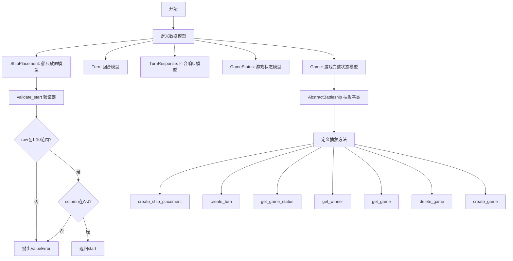
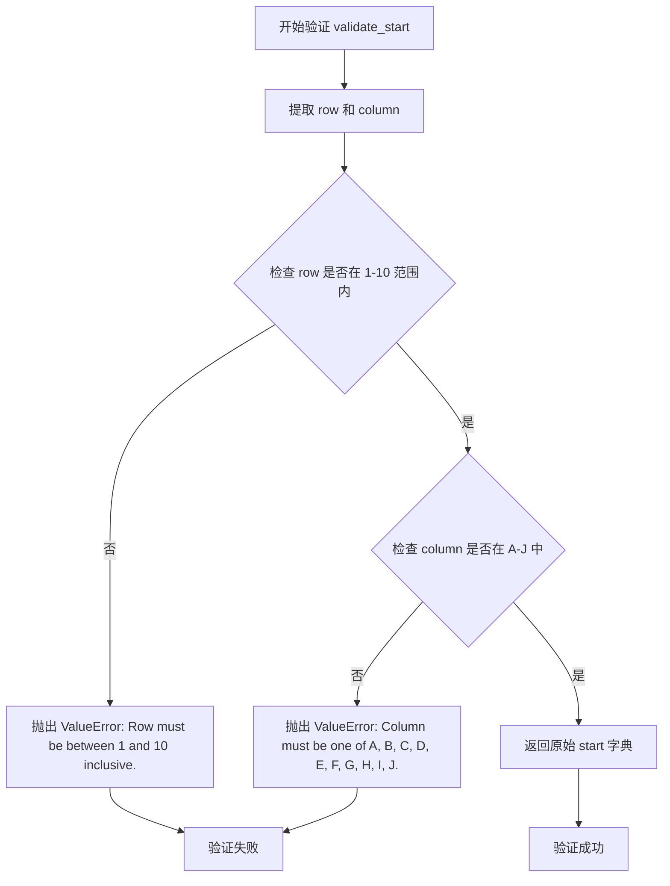
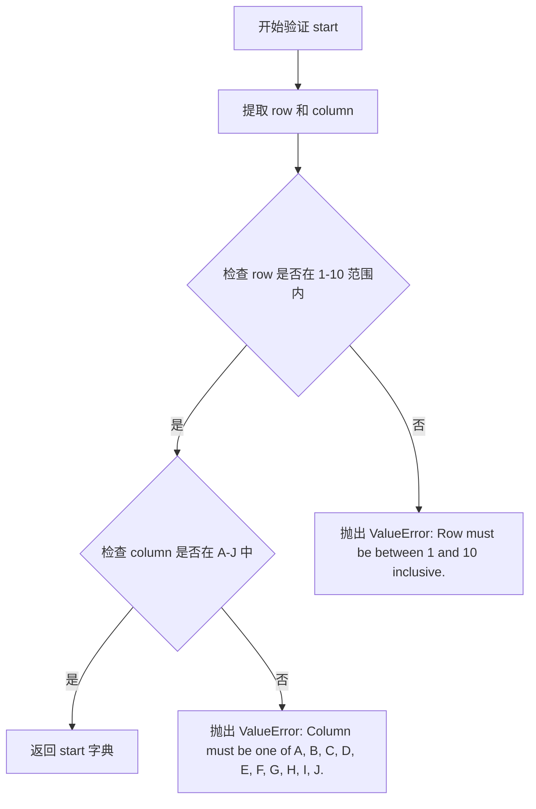
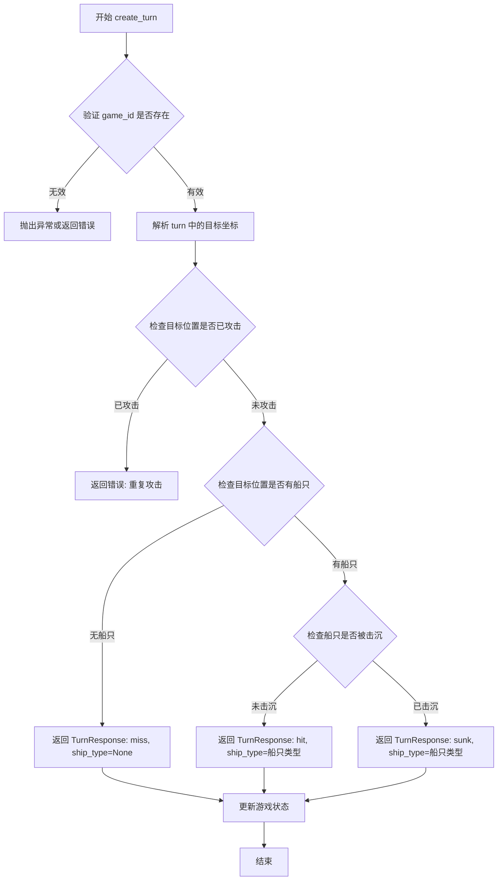
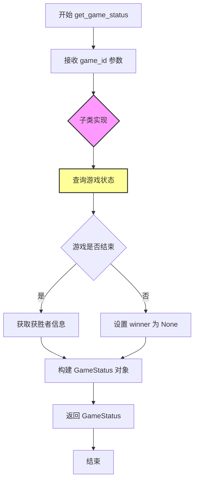
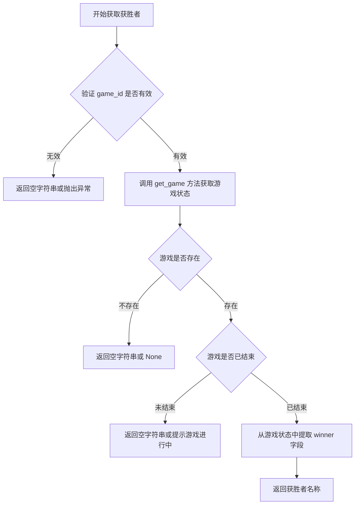
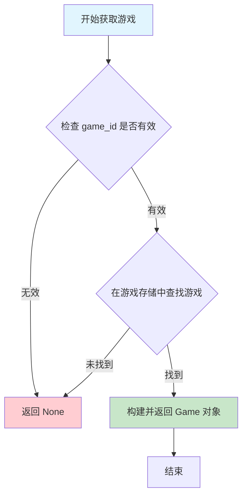
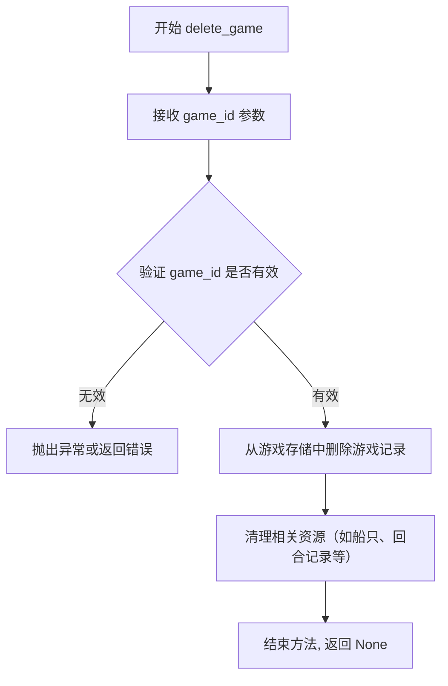
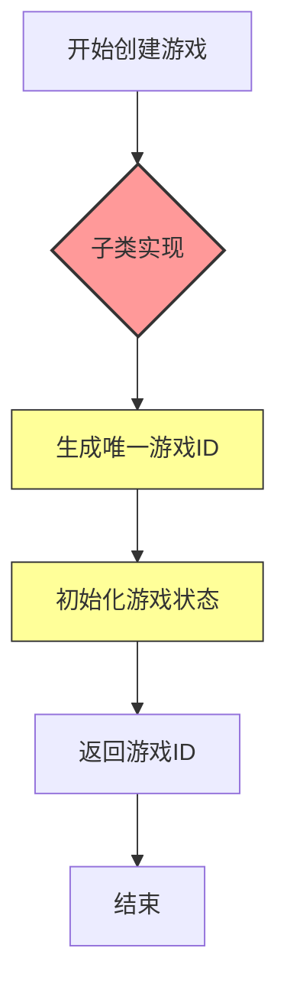

# `.\AutoGPT\classic\benchmark\agbenchmark\challenges\verticals\code\6_battleship\artifacts_out\abstract_class.py` 详细设计文档

这是一个Battleship（海战棋）游戏的后端数据模型和抽象接口定义，使用Pydantic进行请求/响应数据验证，定义了船只放置、游戏回合、游戏状态等核心领域模型，并通过抽象基类AbstractBattleship规范了游戏操作的接口契约。

## 整体流程



## 类结构

```
AbstractBattleship (抽象基类)
├── SHIP_LENGTHS (类属性字典)
├── create_ship_placement (抽象方法)
├── create_turn (抽象方法)
├── get_game_status (抽象方法)
├── get_winner (抽象方法)
├── get_game (抽象方法)
├── delete_game (抽象方法)
└── create_game (抽象方法)

数据模型类 (Pydantic BaseModel)
├── ShipPlacement
├── Turn
├── TurnResponse
├── GameStatus
└── Game
```

## 全局变量及字段


### `SHIP_LENGTHS`
    
类属性字典，定义船只类型到长度的映射关系

类型：`dict[str, int]`
    


### `ShipPlacement.ship_type`
    
船只类型

类型：`str`
    


### `ShipPlacement.start`
    
起始位置，包含row和column字段

类型：`dict`
    


### `ShipPlacement.direction`
    
船只放置方向

类型：`str`
    


### `Turn.target`
    
目标位置，包含row和column字段

类型：`dict`
    


### `TurnResponse.result`
    
回合结果，标识命中、未命中或击沉

类型：`str`
    


### `TurnResponse.ship_type`
    
被击中的船只类型，未命中时为None

类型：`Optional[str]`
    


### `GameStatus.is_game_over`
    
标识游戏是否已结束

类型：`bool`
    


### `GameStatus.winner`
    
获胜者标识，游戏未结束时为None

类型：`Optional[str]`
    


### `Game.game_id`
    
游戏的唯一标识符

类型：`str`
    


### `Game.players`
    
参与游戏的玩家列表

类型：`list[str]`
    


### `Game.board`
    
游戏板当前状态

类型：`dict`
    


### `Game.ships`
    
已放置的船只列表

类型：`list[ShipPlacement]`
    


### `Game.turns`
    
已执行的回合记录列表

类型：`list[Turn]`
    
    

## 全局函数及方法


### `ShipPlacement.validate_start`

这是一个Pydantic模型字段验证器方法，用于验证战舰放置的起始位置是否符合游戏规则，确保行号在1-10范围内且列号为A-J之间的有效字母。

参数：

- `cls`：类本身，Pydantic `field_validator` 装饰器的约定参数，代表当前类 `ShipPlacement`
- `start`：`dict`，需要验证的战舰放置起始位置，包含 `"row"`（行号，整数）和 `"column"`（列号，字符串）两个键

返回值：`dict`，验证通过后返回原始的 `start` 字典对象，供Pydantic继续处理；如果验证失败则抛出 `ValueError` 异常

#### 流程图



#### 带注释源码

```python
@field_validator("start")
def validate_start(cls, start):
    """
    验证战舰放置的起始位置是否符合游戏规则。
    
    该方法作为 Pydantic 的字段验证器，在 'start' 字段被赋值时自动调用。
    确保战舰放置的坐标在有效的游戏板范围内（10x10网格）。
    
    参数:
        cls: 指向 ShipPlacement 类本身，Pydantic field_validator 装饰器的约定参数
        start: dict 类型的字典，必须包含 'row'（行号）和 'column'（列号）两个键
               示例: {"row": 5, "column": "C"}
    
    返回:
        dict: 验证通过后返回原始的 start 字典，供 Pydantic 继续处理
    
    异常:
        ValueError: 当 row 不在 1-10 范围内时抛出
        ValueError: 当 column 不在 A-J 范围内时抛出
    """
    # 从 start 字典中提取 row 和 column 的值
    # 使用 .get() 方法安全获取，即使键不存在也返回 None 而非抛出 KeyError
    row, column = start.get("row"), start.get("column")

    # 验证行号是否在有效范围内（1-10）
    # 游戏板为 10x10 网格，行号从 1 到 10
    if not (1 <= row <= 10):
        raise ValueError("Row must be between 1 and 10 inclusive.")

    # 验证列号是否为有效的列字母（A-J）
    # 游戏板列使用字母 A-J 表示（对应 1-10）
    # 使用 list("ABCDEFGHIJ") 生成候选列表进行比对
    if column not in list("ABCDEFGHIJ"):
        raise ValueError("Column must be one of A, B, C, D, E, F, G, H, I, J.")

    # 验证通过，返回原始的 start 字典
    # Pydantic 会使用这个返回值更新字段值
    return start
```


### `ShipPlacement.validate_start`

Pydantic 字段验证器，用于验证战船放置的起始位置是否在有效范围内。该验证器确保 row（行号）在 1-10 之间，且 column（列号）为 A-J 之间的字母。

参数：

-  `start`：`dict`，待验证的起始位置字典，包含 row（整型）和 column（字符串）键

返回值：`dict`，验证通过后返回原始的 start 字典

#### 流程图



#### 带注释源码

```python
@field_validator("start")
def validate_start(cls, start):
    """
    验证战船放置的起始位置。
    
    参数:
        start: 包含 'row' 和 'column' 的字典
        
    返回:
        验证通过后返回原始的 start 字典
        
    异常:
        ValueError: 当 row 不在 1-10 范围或 column 不在 A-J 时抛出
    """
    # 从 start 字典中提取 row 和 column 值
    row, column = start.get("row"), start.get("column")

    # 验证 row 是否在 1-10 范围内（包含边界）
    if not (1 <= row <= 10):
        raise ValueError("Row must be between 1 and 10 inclusive.")

    # 验证 column 是否为 A-J 之间的有效列字母
    if column not in list("ABCDEFGHIJ"):
        raise ValueError("Column must be one of A, B, C, D, E, F, G, H, I, J.")

    # 验证通过，返回原始 start 字典
    return start
```


### `AbstractBattleship.create_ship_placement`

将指定的船只放置到游戏棋盘上的抽象方法，由子类具体实现。该方法负责验证船只放置的合法性（如位置、方向、船只长度等）并将船只状态更新到游戏棋盘数据中。

参数：

- `game_id`：`str`，游戏唯一标识符，用于定位需要放置船只的游戏实例
- `placement`：`ShipPlacement`，船只放置信息，包含船只类型（ship_type）、起始位置（start，格式为 `{"row": int, "column": str}`）和方向（direction）

返回值：`None`，无返回值（抽象方法声明为 `-> None`）

#### 流程图

```mermaid
flowchart TD
    A[开始放置船只] --> B{验证 game_id 是否有效}
    B -->|无效| C[抛出异常或返回错误]
    B -->|有效| D{验证 placement 数据}
    D -->|数据无效| E[抛出 ValueError 异常]
    D -->|数据有效| F{检查船只类型是否合法}
    F -->|不合法| G[抛出 ValueError 异常]
    F -->|合法| H{验证起始位置是否在棋盘内}
    H -->|超出范围| I[抛出 ValueError 异常]
    H -->|范围内| J{验证方向是否有效}
    J -->|无效| K[抛出 ValueError 异常]
    J -->|有效| L{检查船只长度是否超出边界}
    L -->|超出边界| M[抛出 ValueError 异常]
    L -->|未超出| N{检查是否与已有船只重叠]
    N -->|有重叠| O[抛出异常或返回错误]
    N -->|无重叠| P[更新游戏棋盘数据]
    P --> Q[将放置信息添加到 ships 列表]
    Q --> R[结束]
    
    C --> R
    E --> R
    G --> R
    I --> R
    K --> R
    M --> R
    O --> R
```

#### 带注释源码

```python
@abstractmethod
def create_ship_placement(self, game_id: str, placement: ShipPlacement) -> None:
    """
    Place a ship on the grid.
    
    这是一个抽象方法，由子类实现具体逻辑。
    
    参数:
        game_id: 游戏唯一标识，指向具体游戏实例
        placement: ShipPlacement 对象，包含以下字段:
            - ship_type: 船只类型，应为以下之一:
              "carrier"(5格), "battleship"(4格), "cruiser"(3格),
              "submarine"(3格), "destroyer"(2格)
            - start: 起始位置字典，格式为 {"row": int, "column": str}
              row 范围为 1-10，column 为 A-J
            - direction: 船只方向，通常为 "horizontal" 或 "vertical"
    
    返回值:
        None: 不返回任何值，通过更新游戏状态来保存放置结果
    
    异常:
        ValueError: 当以下情况发生时抛出:
            - 船只类型不在支持列表中
            - 起始位置超出棋盘范围 (row不在1-10, column不在A-J)
            - 方向无效
            - 船只长度超出棋盘边界
            - 与已有船只位置重叠
    
    注意:
        - 具体验证逻辑和棋盘更新逻辑由子类实现
        - 应在方法内部调用 ShipPlacement 的验证器进行基础验证
        - 棋盘数据存储在 Game.board 字段中
        - 船只放置记录应添加到 Game.ships 列表中
    """
    pass
```


### `AbstractBattleship.create_turn`

执行游戏回合，玩家轮流瞄准网格单元格，系统根据攻击位置判断是否命中船只，并返回攻击结果。

参数：

- `game_id`：`str`，游戏唯一标识符，用于定位当前游戏实例
- `turn`：`Turn`，包含目标坐标的回合对象，格式为 `{"row": int, "column": str}`

返回值：`TurnResponse`，攻击结果，包含 result（命中/未命中/沉没）和 ship_type（被击中的船只类型，未命中时为 None）

#### 流程图



#### 带注释源码

```python
@abstractmethod
def create_turn(self, game_id: str, turn: Turn) -> TurnResponse:
    """
    Players take turns to target a grid cell.
    
    执行游戏回合的核心抽象方法，处理玩家的攻击操作。
    该方法为抽象方法，具体实现由子类完成。
    
    参数:
        game_id: str - 游戏唯一标识符，用于定位游戏实例
        turn: Turn - 包含目标坐标的回合对象，格式为 {"row": int, "column": str}
    
    返回:
        TurnResponse - 攻击结果对象，包含:
            - result: str - 攻击结果，可能的值包括 "hit", "miss", "sunk"
            - ship_type: Optional[str] - 被击中的船只类型，未命中时为 None
    
    处理流程:
        1. 验证 game_id 是否有效（对应已存在的游戏）
        2. 解析 turn 中的目标坐标 (row, column)
        3. 检查该位置是否已被攻击过（防止重复攻击）
        4. 检查目标位置是否存在船只
        5. 根据检查结果生成相应的 TurnResponse
        6. 更新游戏状态（记录攻击历史，可能更新船只状态）
        7. 检查游戏是否结束（所有船只是否被击沉）
    """
    pass
```


### `AbstractBattleship.get_game_status`

该方法是一个抽象方法，用于检查游戏是否已结束，并在有获胜者时返回获胜者的信息。它接收游戏ID作为参数，返回包含游戏是否结束和获胜者（如果有）的GameStatus对象。

参数：

- `self`：`AbstractBattleship`，AbstractBattleship类的实例，隐式参数
- `game_id`：`str`，游戏唯一标识符，用于指定要查询状态的游戏

返回值：`GameStatus`，包含游戏是否结束（is_game_over）和获胜者（winner，Optional[str]）的状态对象

#### 流程图



#### 带注释源码

```python
@abstractmethod
def get_game_status(self, game_id: str) -> GameStatus:
    """
    Check if the game is over and get the winner if there's one.
    
    这是一个抽象方法，要求子类实现具体的游戏状态查询逻辑。
    方法接收游戏ID作为参数，查询对应游戏的状态信息。
    
    Args:
        game_id: str - 游戏唯一标识符，用于定位特定游戏实例
        
    Returns:
        GameStatus - 包含游戏是否结束和获胜者的状态对象
                     - is_game_over: bool - 标记游戏是否已结束
                     - winner: Optional[str] - 获胜者名称，如果游戏未结束则为None
                     
    Note:
        该方法是抽象方法，具体实现由子类提供。
        子类需要维护游戏状态存储（如数据库、内存缓存等），
        并根据game_id查询对应的游戏状态。
    """
    pass
```

#### 相关类信息

**GameStatus 模型类**

- `is_game_over`：`bool`，标记游戏是否已结束
- `winner`：`Optional[str]`，获胜者名称，如果游戏未结束则为None

#### 技术债务与优化空间

1. **抽象方法缺乏默认实现**：该方法为抽象方法但缺乏默认实现，调用方必须依赖子类实现，可能导致代码重复
2. **错误处理缺失**：未定义游戏ID不存在时的异常处理机制
3. **类型提示不够精确**：返回的`GameStatus`中`winner`字段为`Optional[str]`，但未明确区分"平局"和"游戏进行中"两种状态

#### 其它设计说明

- **设计目标**：提供统一的游戏状态查询接口，隐藏具体实现细节
- **约束**：子类必须实现该方法以提供具体的游戏状态查询逻辑
- **错误处理**：当前设计未处理游戏ID不存在的情况，建议在实现时添加`GameNotFoundException`
- **接口契约**：调用方传入有效的`game_id`，应返回对应的`GameStatus`对象


### `AbstractBattleship.get_winner`

获取指定游戏的获胜者名称，如果游戏尚未结束或不存在则返回相应的结果。

参数：

- `game_id`：`str`，游戏唯一标识符，用于指定要查询的游戏

返回值：`str`，返回获胜者的玩家名称，如果游戏不存在或尚未结束则返回空字符串或相应标识

#### 流程图



#### 带注释源码

```python
@abstractmethod
def get_winner(self, game_id: str) -> str:
    """
    Get the winner of the game.
    
    这是一个抽象方法，具体实现由子类提供。
    该方法用于查询指定游戏的获胜者信息。
    
    参数:
        game_id: str - 游戏唯一标识符，用于指定要查询的游戏
        
    返回值:
        str - 返回获胜者的玩家名称，如果游戏不存在或尚未结束
              则返回空字符串或相应的提示信息
    """
    pass
```


### `AbstractBattleship.get_game`

检索游戏实例的当前状态，根据给定的游戏ID返回对应的游戏对象。如果游戏不存在则返回None。

参数：

- `game_id`：`str`，要检索的游戏唯一标识符

返回值：`Game | None`，返回完整的游戏状态对象（包括游戏ID、玩家列表、棋盘、船只配置和回合历史），如果游戏不存在则返回 `None`

#### 流程图



#### 带注释源码

```python
@abstractmethod
def get_game(self, game_id: str) -> Game | None:
    """
    Retrieve the state of the game.
    
    该方法是一个抽象方法，具体实现由子类提供。
    用于根据游戏ID获取完整的游戏状态信息。
    
    参数:
        game_id: str - 游戏实例的唯一标识符
        
    返回:
        Game | None - 如果游戏存在则返回包含完整游戏状态的Game对象；
                     如果游戏不存在或已被删除则返回None
    """
    pass
```


### `AbstractBattleship.delete_game`

删除游戏方法，用于根据给定的游戏ID从系统中删除一个游戏实例。

参数：

- `game_id`：`str`，要删除的游戏唯一标识符

返回值：`None`，该方法执行删除操作，不返回任何值

#### 流程图



#### 带注释源码

```python
@abstractmethod
def delete_game(self, game_id: str) -> None:
    """
    Delete a game given its ID.
    
    参数:
        game_id: str, 要删除的游戏唯一标识符
    
    返回:
        None, 该方法执行删除操作,不返回任何值
    """
    pass
```


### AbstractBattleship.create_game

创建新的海战游戏并返回其唯一标识符（Game ID）。

参数： 无（除隐含的 `self` 参数）

返回值：`str`，创建的游戏唯一标识符

#### 流程图



#### 带注释源码

```python
@abstractmethod
def create_game(self) -> str:
    """
    Create a new game.
    # 创建新的海战游戏实例
    
    Returns:
        str: The ID of the created game.
        # 返回值：str类型，返回创建游戏的唯一标识符
    """
    # 注意：这是一个抽象方法，具体实现由子类完成
    # 子类需要实现以下逻辑：
    # 1. 生成唯一的 game_id
    # 2. 初始化游戏状态（空棋盘、玩家列表等）
    # 3. 返回生成的 game_id
    pass
```

#### 设计说明

| 项目 | 说明 |
|------|------|
| **方法类型** | 抽象方法（Abstract Method） |
| **访问修饰符** | 公开（public） |
| **设计意图** | 定义创建游戏的接口规范，由具体实现类完成实际逻辑 |
| **约束** | 子类必须实现此方法 |
| **线程安全** | 取决于具体实现（抽象类未定义） |

## 关键组件


### ShipPlacement

用于表示船只放置的数据模型，包含船只类型、起始位置（行列坐标）和方向。提供字段验证确保行号为1-10，列号为A-J。

### Turn

用于表示玩家回合的数据模型，包含目标位置（行列坐标）。

### TurnResponse

用于表示回合结果响应的数据模型，包含攻击结果（命中/未命中）和被击中的船只类型。

### GameStatus

用于表示游戏整体状态的数据模型，包含游戏是否结束和获胜者信息。

### Game

用于表示完整游戏状态的数据模型，包含游戏ID、玩家列表、棋盘状态、已放置船只列表和历史回合列表。

### AbstractBattleship

抽象基类，定义战列舰游戏的核心接口规范。包含船只长度映射字典和6个抽象方法，分别用于创建船只放置、创建回合、获取游戏状态、获取获胜者、获取游戏和删除游戏。

### SHIP_LENGTHS

类字段，字典类型，映射船只类型到其长度（carrier:5, battleship:4, cruiser:3, submarine:3, destroyer:2）。

### create_ship_placement

抽象方法，用于在棋盘上放置船只，接收游戏ID和船只放置对象，无返回值。

### create_turn

抽象方法，处理玩家攻击操作，接收游戏ID和回合对象，返回回合响应结果。

### get_game_status

抽象方法，检查游戏是否结束，接收游戏ID，返回游戏状态对象。

### get_winner

抽象方法，获取游戏获胜者，接收游戏ID，返回获胜者字符串。

### get_game

抽象方法，检索游戏状态，接收游戏ID，返回游戏对象或None。

### delete_game

抽象方法，根据游戏ID删除游戏，无返回值。

### create_game

抽象方法，创建新游戏，返回新创建的游戏ID字符串。


## 问题及建议


### 已知问题

-   **使用 dict 而非具体模型**: `ShipPlacement.start` 和 `Turn.target` 使用了 `dict` 类型而非具体的 Pydantic 模型，导致类型不安全且难以维护，应创建 `Position` 模型来统一表示坐标。
-   **Game.board 类型不明确**: `Game.board` 字段定义为 `dict`，没有明确其结构和内容，违反了类型安全原则。
-   **字符串硬编码**: `ShipPlacement.validate_start` 中的列字母 "ABCDEFGHIJ" 是硬编码的魔法字符串，应提取为常量或枚举。
-   **result 字段缺少类型约束**: `TurnResponse.result` 使用 `str` 类型，应使用 `Enum` 或字面量类型来限制有效值（如 "hit", "miss", "sunk"）。
-   **抽象类无具体实现**: `AbstractBattleship` 仅定义了抽象方法，缺少任何具体实现或工厂方法，无法直接实例化使用。
-   **SHIP_LENGTHS 缺乏封装**: `SHIP_LENGTHS` 是可变字典且在抽象类中定义，应考虑不可变映射或类属性常量。
-   **字段命名不一致**: `game_id` 使用 snake_case 而某些地方可能混用，应统一风格。
-   **缺少错误处理**: 代码中没有定义自定义异常类，错误处理依赖于通用的 `ValueError`。

### 优化建议

-   创建 `Position` 模型类，包含 `row: int` 和 `column: str` 字段，替代所有 `dict` 类型的坐标使用。
-   定义 `Column` 枚举（A-J）和 `Result` 枚举（hit, miss, sunk）来替代字符串常量。
-   明确定义 `Board` 模型，使用泛型或嵌套结构来表示游戏板状态。
-   使用 `typing.Final` 或 `__slots__` 来定义不可变的类常量。
-   考虑添加 Pydantic 的 `model_config` 配置（如 `frozen=True`）来创建不可变的数据模型。
-   提取验证逻辑到独立的验证器模块或使用 `model_validator` 进行更复杂的跨字段验证。
-   添加类型化的异常类（如 `InvalidPlacementError`, `GameNotFoundError`）来改进错误处理。
-   考虑添加 `__slots__` 到模型类中以减少内存开销（如果需要大量实例化）。


## 其它


### 设计目标与约束

**设计目标：**
1. 提供一个可扩展的Battleship游戏后端框架，支持多种实现方式
2. 实现标准化游戏接口，包括船只放置、回合执行、状态查询等核心功能
3. 通过抽象基类定义清晰的接口契约，便于实现不同的存储策略（如内存、数据库、分布式存储等）

**设计约束：**
1. 游戏网格限制为10x10（行1-10，列A-J）
2. 船只类型限定为5种：carrier(5)、battleship(4)、cruiser(3)、submarine(3)、destroyer(2)
3. 船只必须水平或垂直放置，不能对角线放置
4. 玩家数量至少为2人
5. 抽象类不包含具体实现，由子类实现具体逻辑

### 错误处理与异常设计

**验证错误（Validation Error）：**
- 使用Pydantic的field_validator进行输入验证
- Row验证失败：抛出ValueError("Row must be between 1 and 10 inclusive.")
- Column验证失败：抛出ValueError("Column must be one of A, B, C, D, E, F, G, H, I, J.")

**业务逻辑错误（由子类实现）：**
- 船只位置重叠
- 船只超出网格边界
- 重复照射同一位置
- 游戏ID不存在
- 非玩家回合

**错误传播机制：**
- 抽象方法通过raise NotImplementedError或子类具体实现来处理异常
- TurnResponse返回result字段标识结果（hit/miss/sunk）

### 数据流与状态机

**游戏状态流转：**
```
创建游戏(create_game) 
    ↓
放置船只(create_ship_placement) 
    ↓
玩家回合(create_turn) 
    ↓
检查游戏状态(get_game_status) 
    ↓
游戏结束(get_winner) 
    ↓
删除游戏(delete_game)
```

**游戏状态枚举：**
- `is_game_over: bool` - 游戏是否结束
- `winner: Optional[str]` - 获胜者标识

**关键数据流转：**
1. **船只放置流程：** ShipPlacement → 验证 → 存储到Game.ships
2. **回合执行流程：** Turn → 验证目标坐标 → 检查命中 → 返回TurnResponse
3. **状态查询流程：** game_id → 查找Game对象 → 返回GameStatus

### 外部依赖与接口契约

**Pydantic依赖：**
- BaseModel: 用于所有数据模型的基类
- field_validator: 用于字段验证装饰器

**ABC依赖：**
- ABC: 抽象基类
- abstractmethod: 抽象方法装饰器

**接口契约规范：**
| 方法名 | 输入 | 输出 | 异常情况 |
|--------|------|------|----------|
| create_ship_placement | game_id, placement | None | 游戏不存在、船只放置无效 |
| create_turn | game_id, turn | TurnResponse | 游戏不存在、非玩家回合、重复照射 |
| get_game_status | game_id | GameStatus | 游戏不存在 |
| get_winner | game_id | str | 游戏不存在或游戏未结束 |
| get_game | game_id | Game\|None | 无 |
| delete_game | game_id | None | 游戏不存在 |
| create_game | None | str | 无 |

### 性能考虑

**设计权衡：**
1. board字段使用dict类型，提供了灵活性但可能影响查询性能
2. ships和turns使用list存储，便于顺序遍历但查找效率为O(n)
3. 抽象基类设计允许子类实现缓存优化

**优化建议：**
- 后续实现可考虑使用索引结构（如字典）加速船只和回合查询
- 对于大规模游戏，可引入缓存层减少数据库查询

### 安全性考虑

**输入验证：**
- 行号范围限制（1-10）防止数组越界
- 列字母限制（A-J）防止注入攻击
- ship_type类型应进一步限制为预定义枚举

**数据隔离：**
- game_id作为游戏实例的唯一标识，应使用不可预测的ID生成策略
- 后续实现应考虑多租户隔离

### 可扩展性设计

**扩展点：**
1. **存储层扩展：** 抽象基类允许实现不同的存储后端（内存、Redis、数据库）
2. **游戏规则扩展：** 可通过继承添加自定义规则（如双人对战、多人混战）
3. **验证逻辑扩展：** ShipPlacement可添加更多验证器（如船只不能重叠）
4. **序列化扩展：** Game.board字段可扩展为更复杂的数据结构

**开闭原则：**
- AbstractBatship定义接口，对扩展开放
- 具体游戏逻辑在子类中实现，对修改关闭

### 测试策略建议

**单元测试：**
- 测试ShipPlacement验证器（边界条件）
- 测试各个抽象方法的签名
- 测试SHIP_LENGTHS常量

**集成测试：**
- 测试具体子类实现
- 测试完整游戏流程

**测试覆盖目标：**
- 所有公开接口
- 验证逻辑边界条件
- 异常情况处理

### 配置管理

**静态配置：**
- SHIP_LENGTHS: 船只长度映射（不可变常量）
- GRID_SIZE: 10（隐含约束）
- VALID_COLUMNS: A-J（隐含约束）

**运行时配置（建议）：**
- 最大游戏时长
- 船只数量限制
- 日志级别
- 存储后端选择

### 监控与日志建议

**关键指标：**
- create_game调用频率
- create_turn响应时间
- 游戏平均时长
- 并发游戏数量

**日志记录点：**
- 游戏创建和删除
- 船只放置操作
- 回合执行结果
- 游戏结束和获胜者

### 版本演进兼容性

**当前版本：** v1.0（基础抽象接口）

**潜在变更：**
- Game.board结构定义需进一步完善
- 可引入GamePhase枚举（PLACING, PLAYING, FINISHED）
- 可添加超时机制和自动放弃功能
- 可扩展TurnResponse包含更多战斗信息


    