# `.\AutoGPT\classic\benchmark\agbenchmark\challenges\verticals\code\6_battleship\artifacts_out\battleship.py` 详细设计文档

这是一个海战棋（Battleship）游戏的后端实现类，提供游戏的创建、船只放置、回合攻击、游戏状态查询等核心功能，支持多游戏管理并通过内存字典存储游戏状态。

## 整体流程

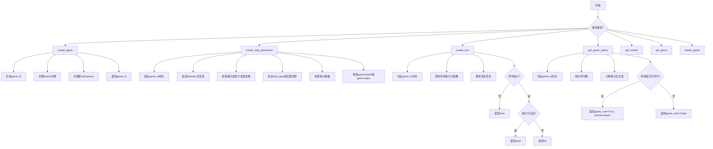

## 类结构

```
AbstractBattleship (抽象基类)
└── Battleship (具体实现类)
```

## 全局变量及字段


### `Battleship.self.games`
    
存储所有游戏的字典，键为game_id，值为Game对象

类型：`Dict[str, Game]`
    
    

## 全局函数及方法


### `Battleship.create_game`

该方法用于创建一个新的海战游戏实例，生成唯一的游戏标识符，初始化游戏状态（玩家、棋盘、船只、回合），并将其存储在内存中，最后返回新创建的游戏ID供后续操作使用。

参数：

- （无参数）

返回值：`str`，新创建的游戏ID，用于后续对游戏进行操作

#### 流程图

```mermaid
flowchart TD
    A[开始 create_game] --> B[生成game_id: str(len(self.games))]
    B --> C[创建新Game对象<br/>players=[], board={}, ships=[], turns=[]]
    C --> D[self.games[game_id] = new_game]
    D --> E[返回 game_id]
    E --> F[结束]
```

#### 带注释源码

```python
def create_game(self) -> str:
    # 生成游戏ID，使用当前游戏字典的长度作为ID（简单自增策略）
    game_id = str(len(self.games))
    
    # 创建新的游戏实例，初始化为空状态
    new_game = Game(
        game_id=game_id,
        players=[],      # 暂无玩家加入
        board={},        # 棋盘为空（坐标到船只类型的映射）
        ships=[],        # 暂无船只放置
        turns=[],        # 暂无回合记录
    )

    # 将新创建的游戏存储到内存字典中
    self.games[game_id] = new_game
    
    # 返回游戏ID，供调用者用于后续游戏操作
    return game_id
```


### `Battleship.create_ship_placement`

该方法用于在指定游戏实例的棋盘上放置船只。它首先验证游戏是否存在、方向是否有效、船只是否已全部放置、船只类型是否有效、放置位置是否在棋盘范围内以及是否与已有船只重叠，然后根据放置方向（水平或垂直）将船只标记到游戏棋盘上，并将放置信息添加到游戏的船只列表中。

参数：

- `game_id`：`str`，游戏实例的唯一标识符
- `placement`：`ShipPlacement`，包含船只类型、放置方向和起始位置的放置对象

返回值：`None`，无返回值

#### 流程图

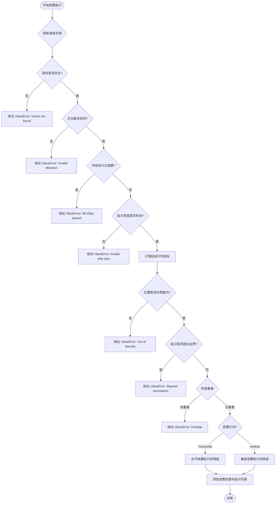

#### 带注释源码

```python
def create_ship_placement(self, game_id: str, placement: ShipPlacement) -> None:
    # 根据 game_id 从游戏字典中获取游戏实例
    game = self.games.get(game_id)

    # 验证游戏是否存在，不存在则抛出异常
    if not game:
        raise ValueError(f"Game with ID {game_id} not found.")
    
    # 验证放置方向是否为水平或垂直
    if placement.direction not in ["horizontal", "vertical"]:
        raise ValueError("Invalid ship direction")
    
    # 检查是否所有船只都已放置，若是则不允许再放置
    if self.all_ships_placed(game):
        raise ValueError("All ships are already placed. Cannot place more ships.")

    # 根据船只类型获取对应的船只长度
    ship_length = self.SHIP_LENGTHS.get(placement.ship_type)
    if not ship_length:
        raise ValueError(f"Invalid ship type {placement.ship_type}")

    # 将列字母转换为数字索引（A=0, B=1, ..., J=9）
    # placement.start["row"] 为行号（1-10）
    # placement.start["column"] 为列字母（A-J）
    start_row, start_col = placement.start["row"], ord(
        placement.start["column"]
    ) - ord("A")

    # 验证起始位置是否在 10x10 棋盘范围内
    # 行范围：1-10，列范围：0-9
    if start_row < 1 or start_row > 10 or start_col < 0 or start_col > 9:
        raise ValueError("Placement out of bounds")

    # 验证船只是否超出棋盘边界
    # 水平放置：起始列 + 船只长度 <= 10
    # 垂直放置：起始行 + 船只长度 <= 10
    if placement.direction == "horizontal" and start_col + ship_length > 10:
        raise ValueError("Ship extends beyond board boundaries")
    elif placement.direction == "vertical" and start_row + ship_length > 10:
        raise ValueError("Ship extends beyond board boundaries")

    # 检查待放置位置是否与已有船只重叠
    for i in range(ship_length):
        if placement.direction == "horizontal":
            # 水平方向：检查从起始位置开始的每一列
            if game.board.get((start_row, start_col + i)):
                raise ValueError("Ship overlaps with another ship!")
        elif placement.direction == "vertical":
            # 垂直方向：检查从起始位置开始的每一行
            if game.board.get((start_row + i, start_col)):
                raise ValueError("Ship overlaps with another ship!")

    # 将船只放置到棋盘上
    # 遍历船只长度的每个位置，将船只类型作为值存入棋盘字典
    for i in range(ship_length):
        if placement.direction == "horizontal":
            game.board[(start_row, start_col + i)] = placement.ship_type
        else:
            game.board[(start_row + i, start_col)] = placement.ship_type

    # 将放置信息添加到游戏的船只列表中
    game.ships.append(placement)
```


### `Battleship.create_turn`

该方法负责执行玩家在特定游戏回合中的攻击操作。它首先验证游戏是否存在且船只已布置完毕，随后解析攻击坐标并查询游戏板。如果击中船只，它会计算该船只的所有位置，判断是否导致船只沉没（sunk），并更新游戏板状态。

参数：
-  `game_id`：`str`，游戏实例的唯一标识符。
-  `turn`：`Turn`，包含攻击目标坐标（row, column）的回合对象。

返回值：`TurnResponse`，包含攻击结果（"miss", "hit", "sunk"）及相关船只类型（如有）。

#### 流程图

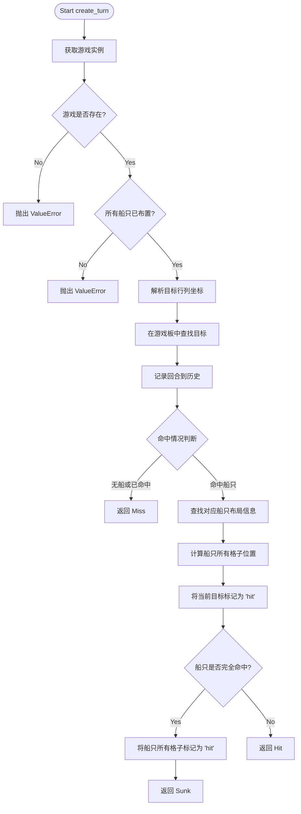

#### 带注释源码

```python
def create_turn(self, game_id: str, turn: Turn) -> TurnResponse:
    # 1. 根据 game_id 获取游戏实例，如果不存在则抛出异常
    game = self.games.get(game_id)

    if not game:
        raise ValueError(f"Game with ID {game_id} not found.")

    # 2. 验证前置条件：所有船只必须已布置才能开始回合
    if not self.all_ships_placed(game):
        raise ValueError("All ships must be placed before starting turns")

    # 3. 解析目标坐标：将字母列转换为数字索引 (A=0, B=1, ...)
    target_row, target_col = turn.target["row"], ord(turn.target["column"]) - ord(
        "A"
    )
    
    # 4. 查询游戏板，判断该坐标是否有船
    hit_ship = game.board.get((target_row, target_col))

    # 5. 将当前回合记录到游戏历史中
    game.turns.append(turn)

    # 6. 判定结果：
    #    - 如果没有船 (None)
    #    - 或者该位置已经被击中过 ("hit")，则视为未命中 (Miss)
    if not hit_ship or hit_ship == "hit":  # if no ship or already hit
        return TurnResponse(result="miss", ship_type=None)

    # 7. 如果击中船只，获取该船只的布局信息以计算其所有位置
    ship_placement = next(sp for sp in game.ships if sp.ship_type == hit_ship)
    start_row, start_col = (
        ship_placement.start["row"],
        ord(ship_placement.start["column"]) - ord("A"),
    )
    
    # 8. 计算该船只占据的所有格子坐标
    ship_positions = [
        (
            start_row + (i if ship_placement.direction == "vertical" else 0),
            start_col + (i if ship_placement.direction == "horizontal" else 0),
        )
        for i in range(self.SHIP_LENGTHS[hit_ship])
    ]

    # 9. 获取至今为止所有被攻击过的格子坐标集合
    targeted_positions = {
        (t.target["row"], ord(t.target["column"]) - ord("A")) for t in game.turns
    }

    # 10. 将当前被击中的格子更新为 'hit' 状态
    game.board[(target_row, target_col)] = "hit"

    # 11. 判断船只是否沉没：如果船只所有位置都被攻击过
    if set(ship_positions).issubset(targeted_positions):
        # 12. 如果沉没，将该船所有格子都标记为 'hit' (视觉上显示为摧毁)
        for pos in ship_positions:
            game.board[pos] = "hit"
        return TurnResponse(result="sunk", ship_type=hit_ship)
    else:
        # 13. 否则只是击中 (Hit)
        return TurnResponse(result="hit", ship_type=hit_ship)
```


### `Battleship.get_game_status`

获取游戏当前状态，判断游戏是否结束以及获胜者。

参数：

- `game_id`：`str`，游戏唯一标识符，用于查找对应的游戏实例

返回值：`GameStatus`，包含游戏是否结束（is_game_over）和获胜者（winner）的状态对象

#### 流程图

```mermaid
flowchart TD
    A[开始 get_game_status] --> B[根据 game_id 获取游戏实例]
    B --> C{游戏是否存在?}
    C -->|否| D[抛出 ValueError: Game with ID {game_id} not found.]
    C -->|是| E[统计 board 中状态为 'hit' 的数量]
    E --> F[计算所有已放置船只的总长度]
    F --> G{hits == total_ships_length?}
    G -->|是| H[返回 GameStatus is_game_over=True winner='player']
    G -->|否| I[返回 GameStatus is_game_over=False winner=None]
    D --> J[结束]
    H --> J
    I --> J
```

#### 带注释源码

```
def get_game_status(self, game_id: str) -> GameStatus:
    """
    获取指定游戏的状态
    
    参数:
        game_id: 游戏唯一标识符
    
    返回:
        GameStatus: 包含游戏是否结束和获胜者的状态对象
    """
    # 根据 game_id 从游戏字典中获取游戏实例
    game = self.games.get(game_id)

    # 如果游戏不存在，抛出 ValueError 异常
    if not game:
        raise ValueError(f"Game with ID {game_id} not found.")

    # 统计棋盘上所有被击中位置的数量
    # 通过遍历 game.board 中的所有项，统计状态为 "hit" 的条目数
    hits = sum(1 for _, status in game.board.items() if status == "hit")

    # 计算所有已放置船只的总长度
    # 遍历游戏中所有已放置的船只，根据船的类型从 SHIP_LENGTHS 获取对应长度并求和
    total_ships_length = sum(
        self.SHIP_LENGTHS[ship.ship_type] for ship in game.ships
    )

    # 比较击中数与船只总长度
    # 如果所有船只都被击中，则游戏结束，玩家获胜
    if hits == total_ships_length:
        return GameStatus(is_game_over=True, winner="player")
    else:
        return GameStatus(is_game_over=False, winner=None)
```


### `Battleship.get_winner`

该方法用于获取指定游戏的获胜者。如果游戏已结束且有获胜者，则返回获胜者的标识；否则抛出异常。

参数：

- `game_id`：`str`，游戏ID，用于指定要查询的游戏。

返回值：`str`，返回获胜者的标识（如 "player"）。

#### 流程图

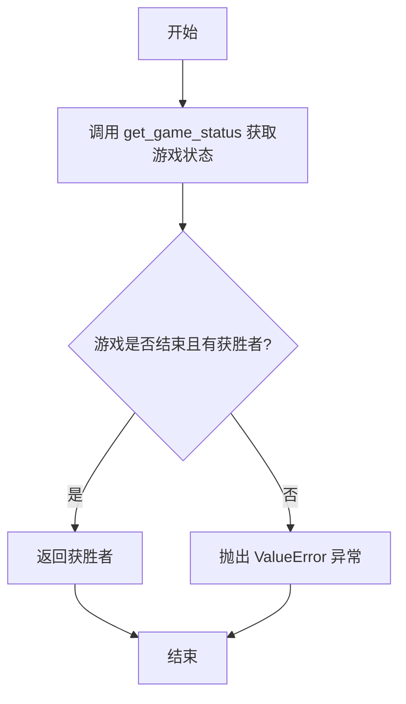

#### 带注释源码

```python
def get_winner(self, game_id: str) -> str:
    """
    获取指定游戏的获胜者。

    参数:
        game_id: 游戏ID，用于指定要查询的游戏。

    返回值:
        返回获胜者的标识（例如 "player"）。

    异常:
        如果游戏未结束，则抛出 ValueError。
    """
    # 获取游戏状态
    game_status = self.get_game_status(game_id)

    # 检查游戏是否结束且是否有获胜者
    if game_status.is_game_over and game_status.winner:
        # 如果游戏结束且有获胜者，返回获胜者
        return game_status.winner
    else:
        # 如果游戏未结束，抛出异常
        raise ValueError(f"Game {game_id} isn't over yet")
```


### `Battleship.get_game`

根据游戏ID从游戏字典中获取对应的游戏对象，如果游戏不存在则返回None。

参数：

- `game_id`：`str`，游戏ID，用于标识特定的游戏实例

返回值：`Game | None`，返回找到的Game对象，如果游戏ID不存在则返回None

#### 流程图

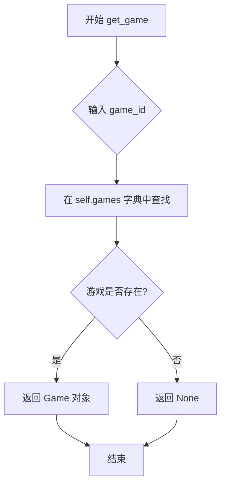

#### 带注释源码

```python
def get_game(self, game_id: str) -> Game | None:
    """
    获取游戏对象
    
    根据给定的game_id从游戏字典中检索对应的游戏对象。
    这是一个简单的字典查找操作，用于访问已创建的游戏实例。
    
    参数:
        game_id: str - 游戏ID，用于唯一标识一个游戏实例
    
    返回:
        Game | None - 如果找到对应的游戏则返回Game对象，
                     如果game_id不存在则返回None
    """
    return self.games.get(game_id)
```


### `Battleship.delete_game`

删除指定 ID 的游戏实例，从游戏字典中移除对应的游戏数据。

参数：

- `game_id`：`str`，要删除的游戏唯一标识符

返回值：`None`，无返回值，执行游戏删除操作

#### 流程图

```mermaid
flowchart TD
    A[开始 delete_game] --> B{检查 game_id 是否在 self.games 中}
    B -->|是| C[执行 del self.games[game_id] 删除游戏]
    B -->|否| D[结束]
    C --> D
```

#### 带注释源码

```python
def delete_game(self, game_id: str) -> None:
    """
    删除指定 ID 的游戏实例。
    
    参数:
        game_id: 要删除的游戏唯一标识符
    
    返回:
        无返回值
    """
    # 检查 game_id 是否存在于游戏字典中
    if game_id in self.games:
        # 从字典中删除该游戏实例
        del self.games[game_id]
```


### `Battleship.all_ships_placed`

该方法用于检查指定游戏是否已完成所有船只的放置。它通过比对当前已放置的船只类型集合与配置的船只类型集合来判断是否所有船只都已放置完毕。

参数：

- `self`：隐式参数，`Battleship` 类型，表示 Battleship 类的实例本身
- `game`：`Game` 类型，需要检查的游戏对象

返回值：`bool`，如果所有船只都已放置则返回 `True`，否则返回 `False`

#### 流程图

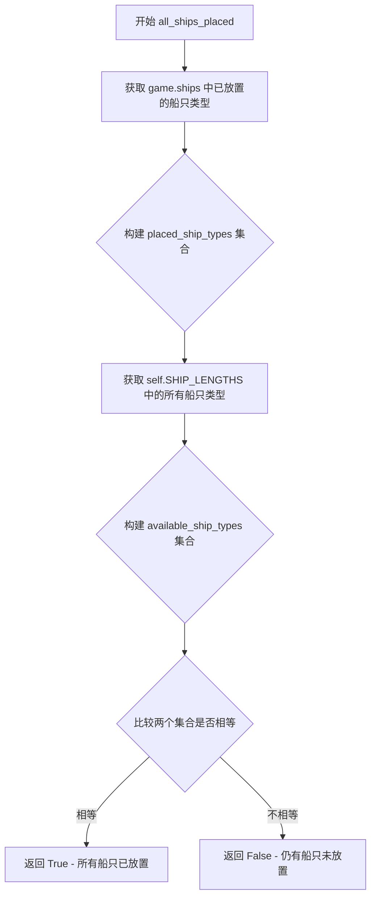

#### 带注释源码

```python
def all_ships_placed(self, game: Game) -> bool:
    """
    检查指定游戏是否已完成所有船只的放置。
    
    参数:
        game: Game 类型，需要检查的游戏对象
        
    返回:
        bool 类型，True 表示所有船只都已放置，False 表示还有船只未放置
    """
    # 从 game.ships 中提取所有已放置的船只类型，构建集合
    # 使用集合可以方便地进行去重和比较操作
    placed_ship_types = set([placement.ship_type for placement in game.ships])
    
    # 从类属性 SHIP_LENGTHS 中获取所有可用的船只类型键，构建集合
    # SHIP_LENGTHS 定义了游戏允许的所有船只类型及其长度
    available_ship_types = set(self.SHIP_LENGTHS.keys())
    
    # 比较已放置的船只类型集合与可用船只类型集合是否完全相等
    # 只有当两个集合完全相同时，才说明所有船只都已放置
    return placed_ship_types == available_ship_types
```


### Battleship.__init__

这是 Battleship 类的构造函数，用于初始化游戏管理器，创建一个空的游戏字典来存储所有的游戏实例。

参数：

- `self`：实例本身，无需显式传递

返回值：无（`None`），构造函数不返回任何值

#### 流程图

```mermaid
flowchart TD
    A[开始 __init__] --> B[创建空字典 self.games]
    B --> C[字典类型: Dict[str, Game]]
    D[结束 __init__]
    C --> D
```

#### 带注释源码

```python
def __init__(self):
    """
    构造函数，初始化 Battleship 游戏管理器。
    创建一个空的字典来存储所有游戏实例。
    """
    self.games: Dict[str, Game] = {}  # 用于存储游戏ID到游戏对象的映射
```


### `Battleship.create_game`

该方法是游戏启动的入口，用于在服务端创建一个新的游戏会话。它负责生成唯一的游戏标识符（Game ID），初始化一个空的 `Game` 对象（包括空棋盘、玩家列表、船只列表和回合列表），将其存入内存字典 `self.games` 中，并最终返回该 ID 以供客户端进行后续连接或操作。

参数：

-  `self`：`Battleship`，指向类实例本身的引用，用于访问类的状态（如 `self.games` 字典）。

返回值：`str`，新创建游戏的唯一标识符（Game ID）。

#### 流程图

```mermaid
flowchart TD
    A([开始 create_game]) --> B[生成 Game ID: str(len(self.games))]
    B --> C[创建新 Game 对象: 初始化空列表和字典]
    C --> D[更新内部状态: 将新游戏存入 self.games]
    D --> E[返回 Game ID]
    E --> F([结束])
```

#### 带注释源码

```python
def create_game(self) -> str:
    """
    创建一个新的 Battleship 游戏实例。
    注意：当前使用字典长度生成 ID，如果删除游戏可能导致 ID 重复或冲突（技术债务）。
    """
    # 1. 生成游戏 ID。由于 self.games 是 Dict，这里简单地将其长度转换为字符串作为 ID。
    # 这种方式在游戏数量增多或删除游戏后可能产生 ID 冲突。
    game_id = str(len(self.games))

    # 2. 初始化游戏数据结构。创建一个 Game 对象，包含游戏ID、空的玩家列表、空的棋盘映射、空的船只列表和空的回合历史。
    new_game = Game(
        game_id=game_id,
        players=[],
        board={},
        ships=[],
        turns=[],
    )

    # 3. 将新创建的游戏对象存储到类的内部状态字典中，以便通过 game_id 索引。
    self.games[game_id] = new_game

    # 4. 返回生成的游戏 ID，供调用者（如 API 层）使用。
    return game_id
```


### `Battleship.create_ship_placement`

在战舰游戏中，该方法负责将玩家的船只放置到游戏棋盘上，验证所有放置条件（游戏存在性、方向有效性、船只类型、边界范围和重叠检测），并在验证通过后将船只位置记录到游戏棋盘的数据结构中。

#### 参数

- `game_id`：`str`，游戏唯一标识符，用于定位目标游戏实例
- `placement`：`ShipPlacement`，船只放置对象，包含船只类型、起始位置、方向等信息

#### 返回值

`None`，该方法仅执行状态修改，不返回任何值

#### 流程图

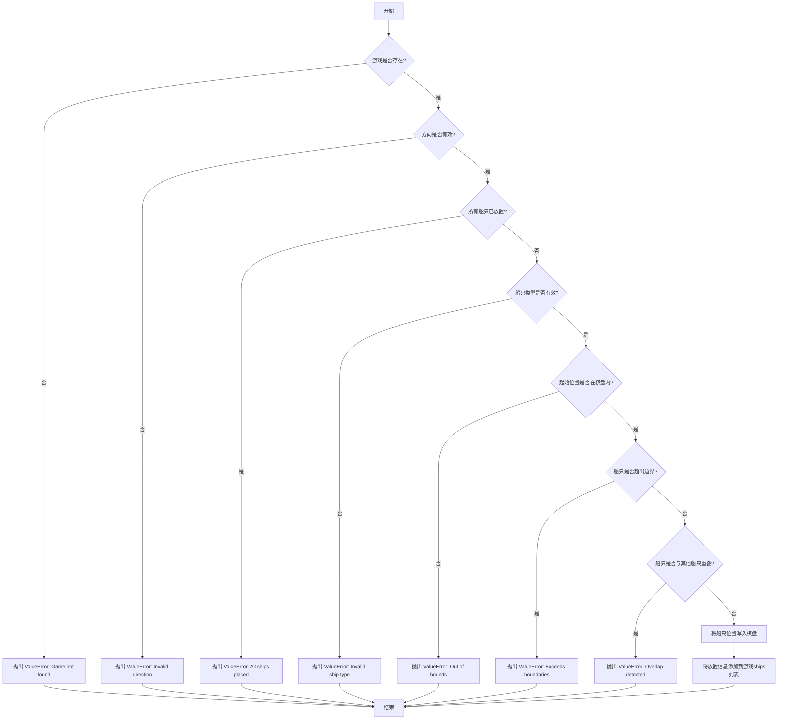

#### 带注释源码

```python
def create_ship_placement(self, game_id: str, placement: ShipPlacement) -> None:
    """
    将玩家的船只放置到游戏棋盘上
    
    执行多层次验证：
    1. 游戏存在性验证
    2. 船只方向合法性验证
    3. 船只数量限制验证
    4. 船只类型有效性验证
    5. 放置位置边界验证
    6. 船只重叠检测
    """
    
    # 第一步：通过game_id从游戏字典中获取游戏实例
    game = self.games.get(game_id)

    # 验证1：检查游戏是否存在
    if not game:
        raise ValueError(f"Game with ID {game_id} not found.")
    
    # 验证2：检查方向是否为有效值（horizontal或vertical）
    if placement.direction not in ["horizontal", "vertical"]:
        raise ValueError("Invalid ship direction")
    
    # 验证3：检查是否所有船只已经放置完成
    if self.all_ships_placed(game):
        raise ValueError("All ships are already placed. Cannot place more ships.")

    # 获取该类型船只的长度，若不存在则抛出异常
    ship_length = self.SHIP_LENGTHS.get(placement.ship_type)
    if not ship_length:
        raise ValueError(f"Invalid ship type {placement.ship_type}")

    # 将列字母转换为数字索引（A=0, B=1, ..., J=9）
    start_row, start_col = placement.start["row"], ord(
        placement.start["column"]
    ) - ord("A")

    # 验证4：检查起始位置是否在10x10棋盘范围内
    # 行范围：1-10，列范围：0-9
    if start_row < 1 or start_row > 10 or start_col < 0 or start_col > 9:
        raise ValueError("Placement out of bounds")

    # 验证5：检查船只是否会超出棋盘边界
    if placement.direction == "horizontal" and start_col + ship_length > 10:
        raise ValueError("Ship extends beyond board boundaries")
    elif placement.direction == "vertical" and start_row + ship_length > 10:
        raise ValueError("Ship extends beyond board boundaries")

    # 验证6：检查船只是否与已放置的船只重叠
    for i in range(ship_length):
        if placement.direction == "horizontal":
            # 水平放置时检查水平方向每个位置
            if game.board.get((start_row, start_col + i)):
                raise ValueError("Ship overlaps with another ship!")
        elif placement.direction == "vertical":
            # 垂直放置时检查垂直方向每个位置
            if game.board.get((start_row + i, start_col)):
                raise ValueError("Ship overlaps with another ship!")

    # 执行放置：将船只的每个位置标记到棋盘字典中
    # 棋盘使用元组(row, col)作为键，ship_type作为值
    for i in range(ship_length):
        if placement.direction == "horizontal":
            game.board[(start_row, start_col + i)] = placement.ship_type
        else:
            game.board[(start_row + i, start_col)] = placement.ship_type

    # 记录放置信息到游戏的ships列表中
    game.ships.append(placement)
```


### `Battleship.create_turn`

该方法处理海战游戏中的回合执行，验证游戏状态和船只部署，计算攻击结果（未击中、击中或击沉），并更新游戏面板状态。

参数：

- `game_id`：`str`，游戏唯一标识符，用于定位游戏实例
- `turn`：`Turn`，包含攻击目标坐标的回合对象

返回值：`TurnResponse`，包含攻击结果（"miss"、"hit"或"sunk"）和被击中的船只类型

#### 流程图

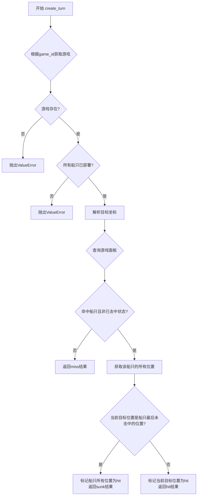

#### 带注释源码

```python
def create_turn(self, game_id: str, turn: Turn) -> TurnResponse:
    """
    处理海战游戏中的回合执行
    
    参数:
        game_id: 游戏唯一标识符
        turn: 包含攻击目标坐标的回合对象
    
    返回:
        TurnResponse: 包含攻击结果和船只类型
    """
    # 根据game_id从游戏字典中获取游戏实例
    game = self.games.get(game_id)

    # 验证游戏是否存在
    if not game:
        raise ValueError(f"Game with ID {game_id} not found.")

    # 验证所有船只是否已部署（游戏开始前提条件）
    if not self.all_ships_placed(game):
        raise ValueError("All ships must be placed before starting turns")

    # 将列字母转换为列索引（A=0, B=1, ..., J=9）
    target_row, target_col = turn.target["row"], ord(turn.target["column"]) - ord(
        "A"
    )
    
    # 查询游戏面板上该位置是否存在船只
    hit_ship = game.board.get((target_row, target_col))

    # 将当前回合记录到游戏历史中
    game.turns.append(turn)

    # 如果没有击中船只或该位置已经被击中过，返回未命中
    if not hit_ship or hit_ship == "hit":  # if no ship or already hit
        return TurnResponse(result="miss", ship_type=None)

    # 获取被击中船只的放置信息
    ship_placement = next(sp for sp in game.ships if sp.ship_type == hit_ship)
    
    # 计算该船只的所有位置坐标
    start_row, start_col = (
        ship_placement.start["row"],
        ord(ship_placement.start["column"]) - ord("A"),
    )
    
    # 生成该船只的完整位置列表
    ship_positions = [
        (
            start_row + (i if ship_placement.direction == "vertical" else 0),
            start_col + (i if ship_placement.direction == "horizontal" else 0),
        )
        for i in range(self.SHIP_LENGTHS[hit_ship])
    ]

    # 获取至今所有已被攻击过的位置集合
    targeted_positions = {
        (t.target["row"], ord(t.target["column"]) - ord("A")) for t in game.turns
    }

    # 将当前目标位置标记为"hit"（击中）
    game.board[(target_row, target_col)] = "hit"

    # 判断船只是否被完全击沉（所有位置都已被攻击）
    if set(ship_positions).issubset(targeted_positions):
        # 将该船只的所有位置标记为"hit"
        for pos in ship_positions:
            game.board[pos] = "hit"
        # 返回击沉结果，包含船只类型
        return TurnResponse(result="sunk", ship_type=hit_ship)
    else:
        # 返回击中结果，包含船只类型
        return TurnResponse(result="hit", ship_type=hit_ship)
```


### `Battleship.get_game_status`

获取指定游戏的状态信息，包括游戏是否结束以及获胜者（如果游戏已结束）。

参数：

- `game_id`：`str`，游戏ID，用于查找对应的游戏实例

返回值：`GameStatus`，包含游戏是否结束（is_game_over）和获胜者（winner）的状态对象

#### 流程图

```mermaid
flowchart TD
    A[开始 get_game_status] --> B[根据 game_id 获取游戏]
    B --> C{游戏是否存在?}
    C -->|否| D[抛出 ValueError: Game with ID {game_id} not found.]
    C -->|是| E[统计 game.board 中状态为 'hit' 的数量]
    E --> F[计算所有已放置船只的总长度]
    F --> G{hits == total_ships_length?}
    G -->|是| H[返回 GameStatus is_game_over=True, winner='player']
    G -->|否| I[返回 GameStatus is_game_over=False, winner=None]
    H --> J[结束]
    I --> J
```

#### 带注释源码

```
def get_game_status(self, game_id: str) -> GameStatus:
    """
    获取指定游戏的状态信息。
    
    参数:
        game_id: 游戏ID，用于查找对应的游戏实例
        
    返回:
        GameStatus: 包含游戏是否结束和获胜者的状态对象
        
    异常:
        ValueError: 当游戏ID不存在时抛出
    """
    # 根据 game_id 从游戏字典中获取游戏实例
    game = self.games.get(game_id)

    # 检查游戏是否存在，不存在则抛出异常
    if not game:
        raise ValueError(f"Game with ID {game_id} not found.")

    # 统计游戏板上已被击中的位置数量
    hits = sum(1 for _, status in game.board.items() if status == "hit")

    # 计算所有已放置船只的总长度
    # 使用类属性 SHIP_LENGTHS 获取每种船的长度并求和
    total_ships_length = sum(
        self.SHIP_LENGTHS[ship.ship_type] for ship in game.ships
    )

    # 判断游戏是否结束：当所有船只位置都被击中时游戏结束
    if hits == total_ships_length:
        # 游戏结束，玩家获胜（单玩家模式）
        return GameStatus(is_game_over=True, winner="player")
    else:
        # 游戏尚未结束
        return GameStatus(is_game_over=False, winner=None)
```


### `Battleship.get_winner`

该方法用于获取指定游戏的获胜者。首先调用 `get_game_status` 方法获取游戏状态，然后检查游戏是否已结束且存在获胜者。如果游戏已结束且有获胜者，则返回获胜者名称；否则抛出 `ValueError` 异常，提示游戏尚未结束。

参数：

- `game_id`：`str`，游戏ID，用于标识特定的游戏实例

返回值：`str`，返回获胜者的名称（如 "player"）

#### 流程图

```mermaid
flowchart TD
    A[开始] --> B[调用 get_game_status(game_id)]
    B --> C{游戏已结束且有获胜者?}
    C -->|是| D[返回 winner]
    C -->|否| E[抛出 ValueError: Game {game_id} isn't over yet]
    D --> F[结束]
    E --> F
```

#### 带注释源码

```python
def get_winner(self, game_id: str) -> str:
    """
    获取指定游戏的获胜者。
    
    参数:
        game_id: 游戏ID，用于标识特定的游戏实例
        
    返回值:
        获胜者的名称字符串（如 'player'）
        
    异常:
        ValueError: 如果游戏尚未结束则抛出
    """
    # 调用 get_game_status 方法获取游戏的当前状态
    game_status = self.get_game_status(game_id)

    # 检查游戏是否已结束且存在获胜者
    if game_status.is_game_over and game_status.winner:
        # 游戏已结束，返回获胜者名称
        return game_status.winner
    else:
        # 游戏尚未结束，抛出 ValueError 异常
        raise ValueError(f"Game {game_id} isn't over yet")
```


### `Battleship.get_game`

根据游戏ID从游戏字典中获取并返回对应的游戏对象。如果游戏不存在，则返回 `None`。

参数：

- `game_id`：`str`，游戏ID，用于唯一标识一个游戏实例

返回值：`Game | None`，返回匹配的游戏对象（如果存在），否则返回 `None`

#### 流程图

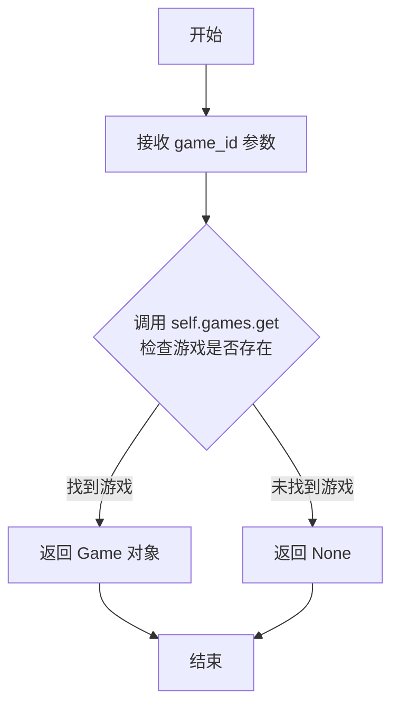

#### 带注释源码

```python
def get_game(self, game_id: str) -> Game | None:
    """
    根据游戏ID获取游戏对象
    
    参数:
        game_id: str - 游戏唯一标识符
        
    返回:
        Game | None - 如果找到对应ID的游戏则返回Game对象，否则返回None
    """
    # 使用字典的get方法安全地获取游戏对象
    # 如果game_id不存在于字典中，get方法会自动返回None而不是抛出异常
    return self.games.get(game_id)
```


### `Battleship.delete_game`

该方法用于从游戏字典中删除指定的游戏实例，通过检查游戏ID是否存在来决定是否执行删除操作。

参数：

- `game_id`：`str`，游戏唯一标识符，用于定位需要删除的游戏

返回值：`None`，该方法不返回任何值，仅执行副作用操作

#### 流程图

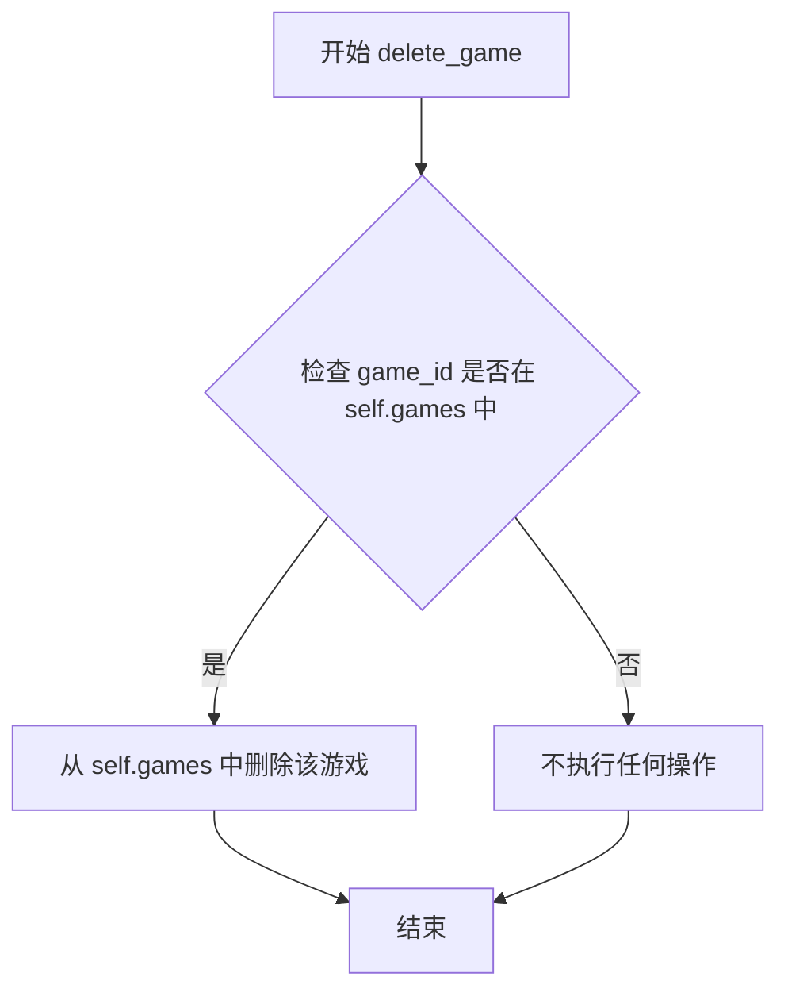

#### 带注释源码

```python
def delete_game(self, game_id: str) -> None:
    """
    删除指定ID的游戏实例。
    
    参数:
        game_id: str, 游戏唯一标识符
    
    返回:
        None
    """
    # 检查游戏ID是否存在于游戏字典中
    if game_id in self.games:
        # 如果存在，则从字典中删除该游戏实例
        del self.games[game_id]
```


### `Battleship.all_ships_placed`

该方法用于检查游戏中是否已放置所有必需的舰船。它通过比较已放置的舰船类型集合与系统定义的所有舰船类型集合来判断是否所有舰船都已放置完成。

参数：

- `game`：`Game`，需要检查舰船放置状态的游戏对象

返回值：`bool`，如果已放置的舰船类型集合等于系统定义的所有舰船类型集合则返回 `True`，否则返回 `False`

#### 流程图

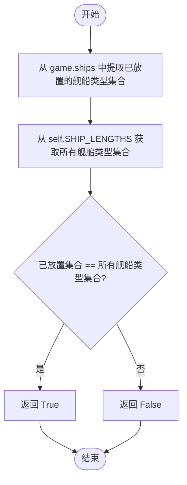

#### 带注释源码

```python
def all_ships_placed(self, game: Game) -> bool:
    """
    检查游戏中是否已放置所有必需的舰船
    
    参数:
        game: Game - 游戏对象，用于检查舰船放置状态
        
    返回:
        bool - 所有舰船类型都已放置返回 True，否则返回 False
    """
    # 从已放置的舰船列表中提取所有舰船类型，并转换为集合
    # 集合用于去除重复项并便于比较
    placed_ship_types = set([placement.ship_type for placement in game.ships])
    
    # 获取系统定义的所有舰船类型集合（从 SHIP_LENGTHS 字典的键）
    # SHIP_LENGTHS 是 AbstractBattleship 类中定义的类属性，包含所有可用舰船类型
    all_ship_types = set(self.SHIP_LENGTHS.keys())
    
    # 比较两个集合是否相等
    # 如果相等，说明所有舰船类型都已被放置
    return placed_ship_types == all_ship_types
```

## 关键组件


### 游戏管理器 (Battleship)

核心类，负责管理多个海战棋游戏实例，提供游戏创建、船只放置、回合并发处理和游戏状态查询等功能。

### 游戏存储 (self.games)

使用字典存储所有游戏实例，键为游戏ID，值为Game对象，用于在内存中持久化游戏状态。

### 游戏创建 (create_game)

创建新的游戏实例，生成唯一游戏ID，初始化空的游戏数据结构（玩家、棋盘、船只、回合），返回游戏ID供后续操作使用。

### 船只放置 (create_ship_placement)

负责验证并放置船只到游戏棋盘，包含方向验证、边界检查、重叠检测、船只类型验证等逻辑，将船只位置写入游戏棋盘。

### 回合处理 (create_turn)

处理玩家的攻击回合，判断命中、未命中或沉没状态，更新棋盘状态，记录回合历史，计算船只是否被完全击沉。

### 游戏状态查询 (get_game_status)

根据当前棋盘命中数和船只总长度计算游戏是否结束，判断胜负状态，返回游戏状态对象。

### 边界验证

验证船只放置坐标是否在10x10棋盘范围内，包括行号(1-10)和列号(A-J)的有效性检查。

### 重叠检测

在放置船只前检查目标位置是否已被其他船只占用，确保船只之间不发生重叠。

### 胜负判断 (get_winner)

查询游戏是否已结束，返回获胜者信息，若游戏未结束则抛出异常。

### 游戏数据模型

包含Game、ShipPlacement、Turn、TurnResponse、GameStatus等数据结构，定义游戏的核心实体和交互接口。

### 游戏删除 (delete_game)

根据游戏ID从游戏字典中删除游戏实例，释放游戏资源。


## 问题及建议


### 已知问题

-   **游戏ID生成存在并发风险**：使用 `str(len(self.games))` 生成游戏ID，在并发环境下可能产生重复ID，且删除游戏后重新创建可能覆盖已有游戏数据
-   **坐标转换逻辑重复**：列字母到数字的转换 (`ord(...) - ord("A")`) 在多处重复出现，违反DRY原则
-   **游戏结束判断不准确**：`get_game_status` 中通过统计 `hit` 状态数量判断游戏结束，但 `hit` 状态既表示"已射击"也表示"船只被击中"，逻辑不够清晰
-   **射击位置验证不完整**：`create_turn` 中仅检查 `hit_ship == "hit"` 来判断重复射击，但漏掉了对 "miss" 状态的检查，可能导致同一位置被多次射击
-   **winner逻辑硬编码**：游戏结束时winner始终返回"player"，未实现多人游戏逻辑，且未检查游戏是否真的有winner
-   **ShipPlacement验证不足**：未验证 `placement.start` 字段是否存在及其包含 `row` 和 `column` 键，可能引发KeyError
-   **Turn.target验证缺失**：未验证 `turn.target` 的 `row` 和 `column` 是否在合理范围内（1-10, A-J）
-   **all_ships_placed逻辑缺陷**：仅检查船类型集合是否匹配，未检查每种类型的船是否只放置了一次，可能允许重复放置同类型船
-   **异常处理分散**：每个方法都重复检查game是否存在，代码冗余且不易维护
-   **数据持久化缺失**：游戏数据完全存储在内存中，服务重启后所有游戏数据丢失

### 优化建议

-   使用UUID或自增整数+时间戳组合生成唯一的游戏ID，避免并发和重复问题
-   提取坐标转换方法为类方法或工具函数，如 `def _col_to_index(col: str) -> int`
-   重构游戏结束判断逻辑，使用独立的状态追踪（如记录total_hits与ships总格数比较）
-   在Turn处理中增加对"miss"状态的检查，防止重复射击同一位置
-   实现真正的多人游戏winner逻辑，或移除winner相关功能
-   在方法入口集中进行参数验证，使用try-except或pydantic等验证库
-   增强ShipPlacement和Turn的数据验证，确保必要字段存在
-   修改all_ships_placed逻辑，检查每种船型是否恰好放置一次
-   引入装饰器或基类方法统一处理game存在性检查
-   考虑添加简单的持久化机制（如文件存储或数据库）以保存游戏状态


## 其它


### 设计目标与约束

本系统旨在实现一个经典的海战游戏核心逻辑，支持创建游戏、放置战舰、进行回合操作以及判定游戏胜负。核心约束包括：1）游戏棋盘为10x10网格；2）战舰类型及长度由SHIP_LENGTHS配置定义；3）游戏数据存储在内存中，不支持持久化；4）仅支持双人游戏模式；5）游戏ID使用自增整数生成。

### 错误处理与异常设计

代码采用ValueError异常进行错误处理，主要错误场景包括：游戏ID不存在时抛出"Game with ID {game_id} not found"；战舰方向无效时抛出"Invalid ship direction"；所有战舰已放置时抛出"All ships are already placed. Cannot place more ships."；战舰类型无效时抛出"Invalid ship type {ship_type}"；放置位置越界时抛出"Placement out of bounds"；战舰重叠时抛出"Ship overlaps with another ship!"；游戏未结束时获取胜者抛出"Game {game_id} isn't over yet"。建议：可考虑定义自定义异常类以区分不同类型的错误，并添加日志记录机制。

### 数据流与状态机

游戏状态流转如下：初始化状态（新建游戏）→ 战舰放置状态（玩家依次放置战舰）→ 游戏进行状态（玩家轮流发起攻击）→ 游戏结束状态（所有战舰被击沉）。数据流：create_game创建游戏实例 → create_ship_placement更新game.board和game.ships → create_turn更新game.board和game.turns并返回攻击结果 → get_game_status根据board状态计算游戏是否结束。

### 外部依赖与接口契约

本模块依赖abstract_class模块中定义的抽象类和数据结构：AbstractBattleship（抽象基类，定义游戏接口）、Game（游戏数据模型）、GameStatus（游戏状态）、ShipPlacement（战舰放置信息）、Turn（回合攻击信息）、TurnResponse（回合响应）。SHIP_LENGTHS配置定义了各类型战舰的长度映射。

### 性能考虑

当前实现使用Dict存储游戏数据，查找效率为O(1)。board使用字典存储坐标到状态的映射，支持快速查找。对于战舰位置计算，每次create_turn都需要重新构建ship_positions，建议缓存战舰位置以提升性能。get_game_status方法每次调用都遍历整个board，可考虑维护hits计数器。

### 安全性考虑

代码已包含基本的输入验证：游戏ID存在性检查、战舰方向合法性检查、坐标范围检查（1-10行，0-9列）、战舰重叠检查。建议增加：1）输入类型检查（确保placement和turn参数类型正确）；2）防止恶意构造的大型数据；3）API层面增加认证和授权机制。

### 并发处理

当前实现为单线程设计，不支持并发访问。self.games字典在多线程环境下可能出现竞态条件。建议：1）如需支持并发，添加线程锁（threading.Lock）；2）考虑使用线程安全的数据结构；3）或者在服务层处理并发请求。

### 数据持久化

当前实现将游戏数据存储在内存中（self.games字典），程序终止后数据丢失。改进建议：1）添加数据库持久化支持（如SQLite）；2）实现游戏状态序列化/反序列化方法；3）考虑分布式场景下的数据一致性。

### 测试策略

建议测试覆盖：1）单元测试：各方法的正常流程和异常流程；2）边界测试：坐标边界值、战舰长度边界；3）集成测试：完整游戏流程；4）性能测试：大批量操作下的响应时间。关键测试场景包括：战舰放置越界检测、重叠检测、游戏结束判定、回合响应结果准确性。

### 配置管理

SHIP_LENGTHS配置定义了战舰类型与长度的映射，当前硬编码在AbstractBattleship基类中。建议：1）提取到独立配置文件；2）支持运行时修改；3）添加配置校验机制；4）考虑支持不同规则变体（如不同棋盘尺寸、不同战舰配置）。

### 扩展性设计

代码设计了一定的扩展性：1）继承AbstractBattleship便于实现不同变体；2）战舰类型由配置定义易于扩展；3）游戏状态通过GameStatus返回便于扩展多玩家模式。潜在扩展点：1）支持AI对手；2）支持观战功能；3）支持游戏回放；4）支持多人联机；5）添加游戏计时功能。

    