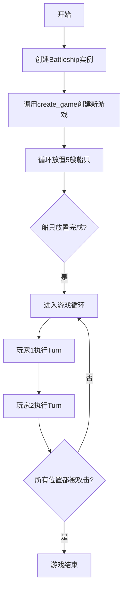
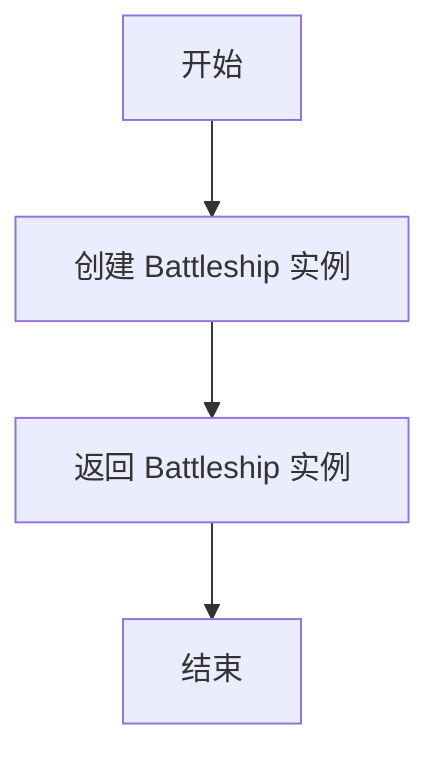
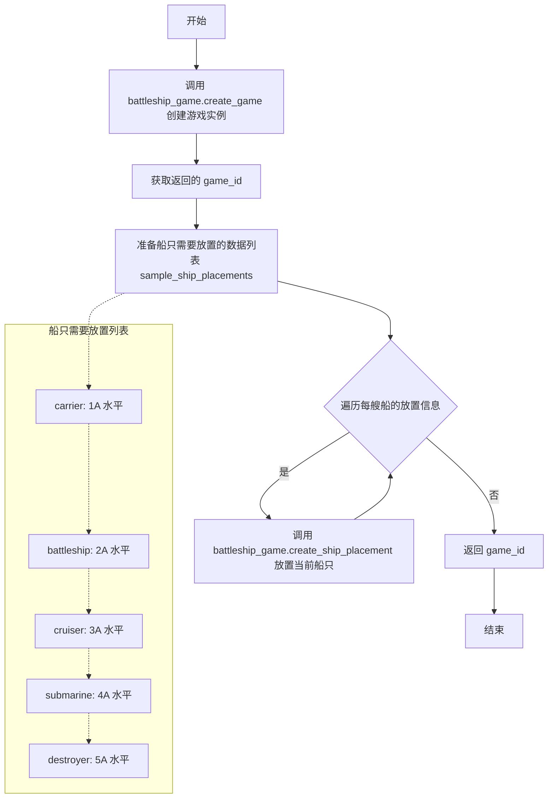
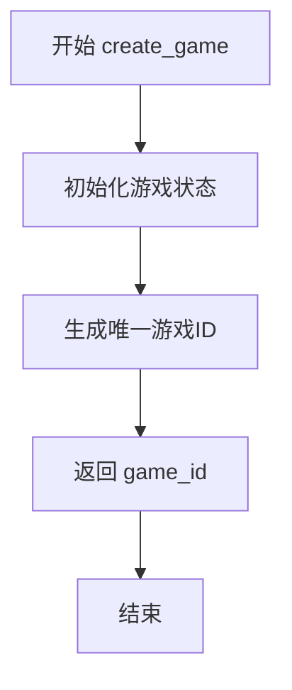
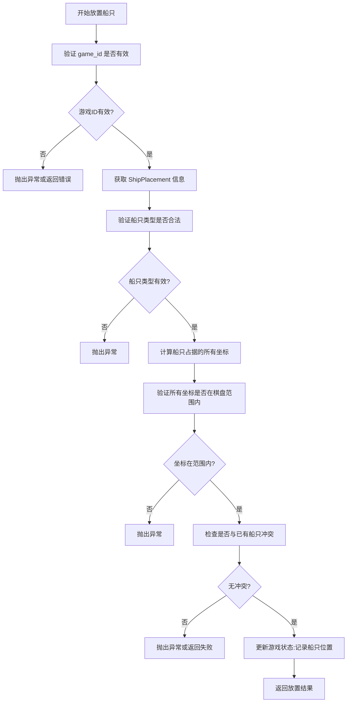
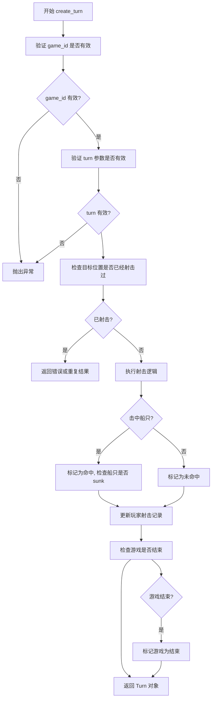

# `.\AutoGPT\classic\benchmark\agbenchmark\challenges\verticals\code\6_battleship\artifacts_out\conftest.py` 详细设计文档

这是一个pytest测试文件，用于测试 Battleship（海战棋）游戏的核心功能，包括游戏初始化、船只放置和回合执行的完整流程。

## 整体流程



## 类结构

```
TestContext (测试上下文)
├── Battleship (游戏主类)
│   ├── create_game()
│   ├── create_ship_placement()
│   └── create_turn()
├── ShipPlacement (船只放置数据类)
│   ├── ship_type
│   ├── start (row, column)
│   └── direction
└── Turn (回合数据类)
    └── target (row, column)
```

## 全局变量及字段


### `battleship_game`
    
Battleship游戏实例，用于管理游戏逻辑

类型：`Battleship`
    


### `initialized_game_id`
    
初始化后的游戏ID，用于标识特定的游戏会话

类型：`str|int`
    


### `game_over_fixture`
    
游戏结束后的游戏ID，表示所有船只已被击毁的游戏状态

类型：`str|int`
    


### `sample_ship_placements`
    
示例船只部署列表，包含5艘船只的放置信息

类型：`List[ShipPlacement]`
    


### `ship_placement`
    
单个船只部署对象，包含船只类型、起始位置和方向

类型：`ShipPlacement`
    


### `game_id`
    
游戏创建后返回的唯一标识符

类型：`str|int`
    


### `row`
    
网格行号，从1到10循环

类型：`int`
    


### `column`
    
网格列号，从A到J循环

类型：`str`
    


### `turn`
    
回合对象，包含攻击目标位置

类型：`Turn`
    


### `ShipPlacement.ship_type`
    
船只类型，如carrier、battleship、cruiser、submarine、destroyer

类型：`str`
    


### `ShipPlacement.start`
    
船只起始位置，包含row和column键的字典

类型：`dict`
    


### `ShipPlacement.direction`
    
船只放置方向，horizontal或vertical

类型：`str`
    


### `Turn.target`
    
攻击目标位置，包含row和column键的字典

类型：`dict`
    
    

## 全局函数及方法


### `battleship_game` (fixture)

这是一个 pytest fixture 函数，用于创建并返回一个 Battleship 游戏实例，作为测试的基线 fixture，供其他测试 fixture 使用。

参数：

- 无

返回值：`Battleship`，返回一个 Battleship 类的新实例，用于后续的测试操作。

#### 流程图



#### 带注释源码

```python
@pytest.fixture
def battleship_game():
    """
    Fixture: battleship_game
    
    用途：创建一个 Battleship 游戏实例，供其他 fixture 和测试用例使用。
    这是一个基础 fixture，通常被其他依赖它的 fixture 所使用。
    
    参数：无
    
    返回值：Battleship - 一个新的 Battleship 游戏实例
    """
    return Battleship()
```

---

### 补充信息

#### 关键组件信息

| 组件名称 | 描述 |
|---------|------|
| `Battleship` | 主游戏类，提供游戏创建、船只放置、回合管理等核心功能 |
| `battleship_game` | Pytest fixture，创建并返回 Battleship 实例作为测试基础 |

#### 潜在的技术债务或优化空间

1. **缺少参数化配置**：当前 fixture 硬编码返回默认配置的 `Battleship()` 实例，无法灵活配置游戏参数（如网格大小、船只类型等）
2. **无资源清理**：该 fixture 未包含 teardown 逻辑，如果 `Battleship` 持有资源（如文件句柄、数据库连接），可能存在资源泄漏风险
3. **单例模式缺失**：每次调用都创建新实例，若需要共享状态需考虑作用域配置

#### 其它项目

- **设计目标**：提供干净的测试初始化点，确保每个测试获得独立且一致的游戏实例
- **错误处理**：当前无错误处理，依赖 `Battleship` 构造函数自身可能抛出的异常
- **依赖关系**：该 fixture 不依赖其他 fixture，但被 `initialized_game_id` 和 `game_over_fixture` 所依赖
- **作用域**：默认 function 级别，每次测试函数调用都会创建新实例


### `initialized_game_id`

该fixture函数用于创建一个包含所有船只部署的海战游戏实例，并返回游戏ID供其他测试用例使用。它通过调用Battleship类的方法依次放置5艘船只（航母、战列舰、巡洋舰、潜艇、驱逐舰），确保游戏在测试前处于初始就绪状态。

参数：

- `battleship_game`：`Battleship` 类型，一个已创建的Battleship游戏实例fixture，用于执行游戏相关的操作

返回值：`str` 类型（或具体游戏ID类型），创建并初始化完成后的游戏唯一标识符，供后续测试用例引用

#### 流程图



#### 带注释源码

```python
@pytest.fixture
def initialized_game_id(battleship_game):
    """
    Fixture: 初始化一个包含所有船只的游戏实例
    
    该fixture创建一个完整的游戏状态，包括：
    - 创建新的游戏会话
    - 放置所有5艘标准船只（航母、战列舰、巡洋舰、潜艇、驱逐舰）
    
    返回的游戏ID可用于后续的测试用例，如执行回合、验证游戏状态等。
    
    参数:
        battleship_game: Battleship类的实例，通过fixture依赖注入
    
    返回:
        game_id: 创建的游戏唯一标识符
    """
    
    # 第一步：创建一个游戏实例，获取游戏ID
    # create_game() 方法负责初始化游戏环境（可能包括棋盘、玩家等）
    game_id = battleship_game.create_game()

    # 第二步：准备所有船只的放置信息
    # 定义标准海战游戏的5艘船只及其初始位置
    # 每艘船只需要指定：船类型、起始坐标、方向
    sample_ship_placements = [
        # 航母：占据5个格子，水平放置在第1行A列开始
        ShipPlacement(
            ship_type="carrier", 
            start={"row": 1, "column": "A"}, 
            direction="horizontal"
        ),
        # 战列舰：占据4个格子，水平放置在第2行A列开始
        ShipPlacement(
            ship_type="battleship",
            start={"row": 2, "column": "A"},
            direction="horizontal",
        ),
        # 巡洋舰：占据3个格子，水平放置在第3行A列开始
        ShipPlacement(
            ship_type="cruiser", 
            start={"row": 3, "column": "A"}, 
            direction="horizontal"
        ),
        # 潜艇：占据3个格子，水平放置在第4行A列开始
        ShipPlacement(
            ship_type="submarine",
            start={"row": 4, "column": "A"},
            direction="horizontal",
        ),
        # 驱逐舰：占据2个格子，水平放置在第5行A列开始
        ShipPlacement(
            ship_type="destroyer",
            start={"row": 5, "column": "A"},
            direction="horizontal",
        ),
    ]

    # 第三步：依次放置所有船只
    # 遍历准备好的船只放置列表，逐个调用API进行船只部署
    for ship_placement in sample_ship_placements:
        # 使用battleship_game的create_ship_placement方法放置船只
        # 该方法可能包含验证逻辑（如位置是否合法、是否重叠等）
        battleship_game.create_ship_placement(game_id, ship_placement)

    # 第四步：返回游戏ID
    # 返回的游戏ID可被其他fixture或测试用例引用
    # 此时游戏已完全初始化，可以开始进行回合操作
    return game_id
```


### `game_over_fixture`

这是一个 pytest fixture，用于创建一个游戏状态已结束的测试场景。它通过遍历 10x10 网格的所有位置，让两个玩家轮流攻击每个坐标，从而确保游戏达到"游戏结束"状态，以便进行相关的测试验证。

#### 参数

- `battleship_game`：`Battleship`，游戏实例，用于调用游戏相关的方法如 create_turn
- `initialized_game_id`：`str | int`，已初始化的游戏 ID，表示已完成船只放置的游戏会话

#### 返回值

`str | int`，返回游戏 ID，即 `initialized_game_id`，表示游戏已结束

#### 流程图

```mermaid
flowchart TD
    A[开始: game_over_fixture] --> B[外层循环: row 从 1 到 10]
    B --> C[内层循环: column 从 A 到 J]
    C --> D[创建 Turn 对象: target={row, column}]
    E[玩家1攻击] --> F[玩家2攻击同一位置]
    D --> E
    E --> F
    F --> C
    C --> G{列遍历完成?}
    G -->|否| C
    G -->|是| H{行遍历完成?}
    H -->|否| B
    H -->|是| I[返回 initialized_game_id]
    I --> J[结束]
```

#### 带注释源码

```python
@pytest.fixture
def game_over_fixture(battleship_game, initialized_game_id):
    # 假设是 10x10 的网格，遍历所有可能的坐标位置
    for row in range(1, 11):  # 行从 1 到 10
        for column in list("ABCDEFGHIJ"):  # 列从 A 到 J
            # 玩家 1 进行一次攻击
            turn = Turn(target={"row": row, "column": column})
            battleship_game.create_turn(initialized_game_id, turn)

            # 玩家 2 进行一次攻击，目标是和玩家 1 相同的位置
            battleship_game.create_turn(initialized_game_id, turn)

    # 在这个 fixture 执行完毕后，游戏应该已经结束
    return initialized_game_id
```


### `Battleship.create_game`

该方法用于创建一个新的海战游戏实例，初始化游戏状态并返回唯一的游戏标识符（game_id），供后续操作如放置船只和执行回合使用。

参数： 无

返回值：`str`（或 `int`），游戏唯一标识符，用于在后续操作中引用已创建的游戏实例。

#### 流程图



#### 带注释源码

```
# 源码（基于测试代码上下文推断）
def create_game(self):
    """
    创建一个新的海战游戏实例。
    
    可能的实现逻辑：
    1. 生成唯一的游戏ID（使用UUID或自增ID）
    2. 初始化游戏状态（玩家信息、网格数据等）
    3. 将游戏信息存储到内部数据结构中
    4. 返回游戏ID供后续操作使用
    """
    # 生成唯一游戏ID
    game_id = self._generate_game_id()  # 例如：uuid.uuid4() 或自增整数
    
    # 初始化游戏状态
    self.games[game_id] = {
        'players': [],
        'ships': {},
        'turns': [],
        'status': 'initialized'  # 或 'waiting_for_ships'
    }
    
    return game_id
```

> **注意**：提供的代码片段是 pytest 测试文件，未包含 `Battleship` 类的实际实现。上述源码是基于测试用例中 `create_game()` 的使用方式进行的合理推断。实际实现可能包含更多细节，如数据库持久化、玩家会话管理等。


### `Battleship.create_ship_placement`

在 Battleship 海战游戏中，该方法负责将指定的船只放置到游戏棋盘的相应位置。它验证船只放置的合法性（如位置不冲突、方向正确、范围在棋盘内），并将船只状态更新到游戏数据中。

参数：

- `game_id`：`int` 或 `str`，游戏实例的唯一标识符，用于定位当前游戏会话
- `ship_placement`：`ShipPlacement`，包含船只类型、起始坐标和放置方向的配置对象

返回值：未在测试代码中明确使用返回值，通常返回 `None` 或 `bool`（表示放置是否成功）

#### 流程图



#### 带注释源码

```python
def create_ship_placement(self, game_id, ship_placement):
    """
    在指定游戏实例中放置战舰
    
    参数:
        game_id: 游戏会话的唯一标识符，用于定位游戏实例
        ship_placement: ShipPlacement 对象，包含以下属性:
            - ship_type: 船只类型 (carrier/battleship/cruiser/submarine/destroyer)
            - start: 起始位置字典 {"row": 行号, "column": 列标}
            - direction: 放置方向 ("horizontal" 或 "vertical")
    
    返回:
        通常返回 None (void method)，或返回 bool 表示放置是否成功
        具体实现需要查看 Battleship 类的实际定义
    """
    # 注意: 源代码未在当前上下文中提供
    # 以下为基于测试用例的逻辑推断:
    
    # 1. 验证游戏ID有效性
    # game = self.get_game(game_id)
    
    # 2. 解析 ship_placement 获取船只信息
    # ship_type = ship_placement.ship_type
    # start_row = ship_placement.start["row"]
    # start_col = ship_placement.start["column"]
    # direction = ship_placement.direction
    
    # 3. 根据船只类型获取长度
    # ship_length = SHIP_LENGTHS[ship_type]
    
    # 4. 计算船只占据的所有坐标
    # positions = calculate_ship_positions(start_row, start_col, direction, ship_length)
    
    # 5. 验证坐标有效性并检查冲突
    # self.validate_placement(positions)
    
    # 6. 更新游戏状态
    # self.game_state[game_id].ships[ship_type] = positions
    
    pass
```

#### 备注

> ⚠️ **文档生成说明**：由于提供的代码仅为测试文件（pytest fixtures），未包含 `Battleship` 类的实际实现源码，因此本文档中的返回类型、流程细节和源码均为基于测试用例使用方式的合理推断。如需获取精确实现细节，请提供 `battleship.py` 源文件。


# Battleship.create_turn 详细设计文档

### `Battleship.create_turn`

该方法用于在 Battleship 游戏中创建一个新的回合，记录玩家对对手棋盘特定位置的射击操作，并根据射击结果更新游戏状态（如命中、未命中或船只 sunk）。

参数：

- `game_id`：`int` 或 `str`，游戏实例的唯一标识符，用于定位当前游戏会话
- `turn`：`Turn`，包含玩家射击目标位置（row 和 column）的回合对象

返回值：`Turn`，返回创建的回合对象，包含射击结果信息（如 hit、miss、sunk 等状态）

#### 流程图



#### 带注释源码

```python
# 从测试代码中推断的 create_turn 方法调用方式
def create_turn(self, game_id, turn):
    """
    在指定游戏中创建一回合（玩家射击）
    
    参数:
        game_id: 游戏实例的唯一标识符
        turn: Turn 对象，包含 target（目标位置）信息
    
    返回:
        Turn: 返回带有射击结果（hit/miss/sunk）的回合对象
    """
    
    # 1. 验证游戏 ID 是否存在
    # 如果 game_id 无效，抛出异常
    if not self._game_exists(game_id):
        raise InvalidGameError(f"Game {game_id} does not exist")
    
    # 2. 获取游戏实例
    game = self._games[game_id]
    
    # 3. 验证 turn 参数
    # 确保 turn 是 Turn 类的实例
    if not isinstance(turn, Turn):
        raise ValueError("turn must be a Turn instance")
    
    # 4. 获取目标位置
    target = turn.target  # {"row": row, "column": column}
    
    # 5. 检查目标位置是否已经射击过
    # 避免重复射击同一位置
    if self._has_already_shot(game_id, target):
        # 返回已存在的射击结果或抛出异常
        return self._get_shot_result(game_id, target)
    
    # 6. 执行射击逻辑
    # 检查目标位置是否有船只
    hit = self._check_hit(game, target)
    
    # 7. 更新回合结果
    if hit:
        turn.result = "hit"
        # 检查是否击沉船只
        sunk_ship = self._check_sunk(game, target)
        if sunk_ship:
            turn.sunk_ship = sunk_ship
    else:
        turn.result = "miss"
    
    # 8. 记录射击
    self._record_shot(game_id, turn)
    
    # 9. 检查游戏是否结束
    # 即所有船只都被击沉
    if self._is_game_over(game):
        game.status = "game_over"
        game.winner = self._determine_winner(game)
    
    # 10. 返回更新后的 Turn 对象
    return turn
```

**注意**：由于提供的代码仅包含测试文件（pytest fixtures），未显示 `Battleship` 类的实际实现，上述源码是根据测试调用方式和典型 Battleship 游戏逻辑推断得出的。实际的实现可能会有所不同。

## 关键组件


### Battleship游戏实例 fixture

用于创建Battleship游戏实例的pytest fixture，返回一个Battleship对象实例，供其他fixture和测试使用。

### 已初始化游戏ID fixture

创建游戏实例并放置所有5艘船只（carrier、battleship、cruiser、submarine、destroyer）的fixture，返回游戏ID。船只全部水平放置在A列的不同行上，用于测试游戏初始化流程。

### 游戏结束 fixture

通过遍历10x10网格的所有位置，让两个玩家轮流攻击每个位置，使游戏进入结束状态的fixture。用于测试游戏结束逻辑和全部回合处理。

### ShipPlacement 数据类

从abstract_class导入的船只放置配置类，包含ship_type（船只类型）、start（起始位置，包含row和column）、direction（方向）属性，用于定义船只的放置方式。

### Turn 数据类

从abstract_class导入的回合类，包含target（目标位置，包含row和column）属性，用于定义每次攻击的目标坐标。

### Battleship 游戏主类

从.battleship模块导入的核心游戏类，负责管理游戏的创建、船只放置和回合执行。

### 船只放置流程

通过循环遍历sample_ship_placements列表，调用create_ship_placement方法逐个放置船只，包含5种不同类型的船只。

### 回合执行流程

使用双重循环遍历10x10网格（行1-10，列A-J），为两个玩家分别创建回合，模拟完整的游戏对局过程。


## 问题及建议


### 已知问题

-   **硬编码网格维度**: 使用 `range(1, 11)` 和 `list("ABCDEFGHIJ")` 硬编码了10x10的网格大小，违反了DRY原则，且难以适应不同尺寸的棋盘。
-   **不现实的船只布局**: 所有船只都放置在同一列（A列）且方向全部为水平，这不是有效的海战布局测试场景。
-   **重复代码**: 列的字母列表 `list("ABCDEFGHIJ")` 在代码中出现多次，应提取为常量。
-   **缺少游戏结束验证**: `game_over_fixture` 在最后没有断言验证游戏是否真正结束，fixture 可能返回错误的 game_id。
-   **逻辑错误的游戏模拟**: 对同一位置同时让两个玩家发起攻击，不符合实际游戏逻辑，应该有轮次概念或区分玩家。
-   **缺少错误处理**: `create_ship_placement` 和 `create_turn` 方法调用后没有检查返回值或处理可能的异常。
-   **测试覆盖不足**: 船只放置和攻击场景没有使用 `pytest.mark.parametrize` 进行参数化测试。
-   **测试隔离性风险**: fixtures 共享 `battleship_game` 实例，可能存在测试间的状态污染。

### 优化建议

-   将网格大小（10）和列字母表提取为常量或从 `Battleship` 类配置中获取。
-   使用 `pytest.fixture(scope="function")` 确保每个测试获得独立的应用实例，或在 fixtures 中实现状态清理。
-   引入 `pytest.mark.parametrize` 来测试不同的船只布局和攻击场景。
-   在 `game_over_fixture` 末尾添加断言验证游戏状态（如 `battleship_game.is_game_over(game_id)`）。
-   重构游戏模拟逻辑，为不同玩家设置不同的攻击目标以模拟真实对战。
-   将 `list("ABCDEFGHIJ")` 定义为模块级常量 `COLUMNS = list("ABCDEFGHIJ")`。
-   添加对 `create_ship_placement` 返回值的验证，检查放置是否成功。
</think>

## 其它


### 设计目标与约束

本测试文件旨在验证 Battleship 游戏的完整生命周期，包括游戏创建、船只部署、回合执行以及游戏结束判定。测试覆盖了双人海战游戏的核心功能，确保在 10x10 网格上进行船只放置和攻击逻辑的正确性。

### 错误处理与异常设计

测试文件中未显式展示错误处理机制，但依赖被测类（Battleship）内部的异常抛出。预期的异常情况包括：无效的船只放置位置（超出网格、与其他船只重叠）、无效的回合目标（重复攻击同一位置）、游戏 ID 不存在等。

### 数据流与状态机

数据流从游戏创建开始，经过船只部署阶段，最终进入回合执行阶段。游戏状态包括：初始化状态（游戏刚创建）、部署状态（等待玩家放置船只）、进行中状态（玩家轮流执行回合）、结束状态（所有船只被击沉）。

### 外部依赖与接口契约

本测试依赖于两个外部模块：abstract_class（提供 ShipPlacement 和 Turn 抽象类）和 battleship（提供 Battleship 实现类）。ShipPlacement 包含 ship_type、start（row 和 column 字典）、direction 字段；Turn 包含 target（row 和 column 字典）字段。

### 测试策略与覆盖率

采用 fixture 方式准备测试数据，通过 initialized_game_id fixture 完成船只部署，通过 game_over_fixture 模拟完整游戏流程。测试覆盖了正常流程，未覆盖边界情况如无效输入、并发操作等。

### 性能考虑

game_over_fixture 中使用双重循环遍历 10x10 网格（100 次迭代），每次迭代创建两个回合，总计 200 次 API 调用。在真实游戏场景中应考虑批量操作接口以提升性能。

### 安全性考虑

测试代码未涉及用户认证、授权或敏感数据处理。游戏 ID 作为会话标识符，应在实际部署中考虑 ID 生成算法的不可预测性。

### 配置与参数

网格大小固定为 10x10，船只类型包括 carrier、battleship、cruiser、submarine、destroyer 五种。列标识使用字母 "A" 到 "J"，行标识使用数字 1 到 10。

### 版本兼容性

代码使用 Python 类型注解（dict 语法），需要 Python 3.9+ 或 from __future__ import annotations。pytest 版本应支持 fixture 装饰器。

### 部署与运维

测试文件作为测试套件的一部分，应通过 pytest 命令行执行。CI/CD 流程中应集成测试执行，并生成覆盖率报告。

    