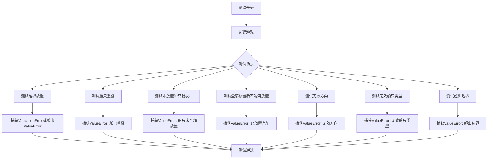
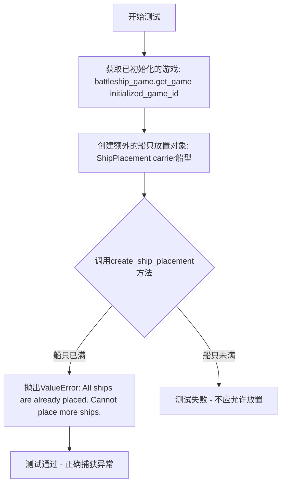
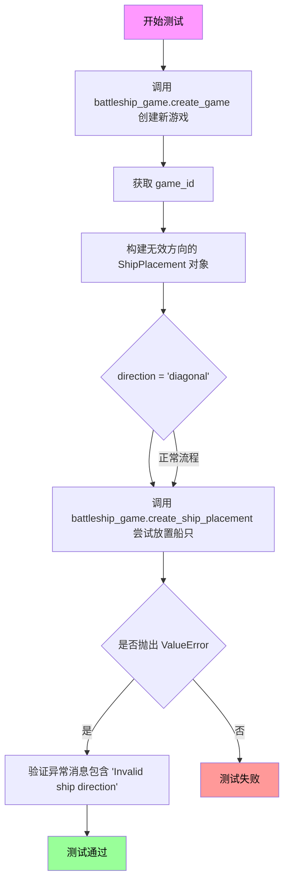
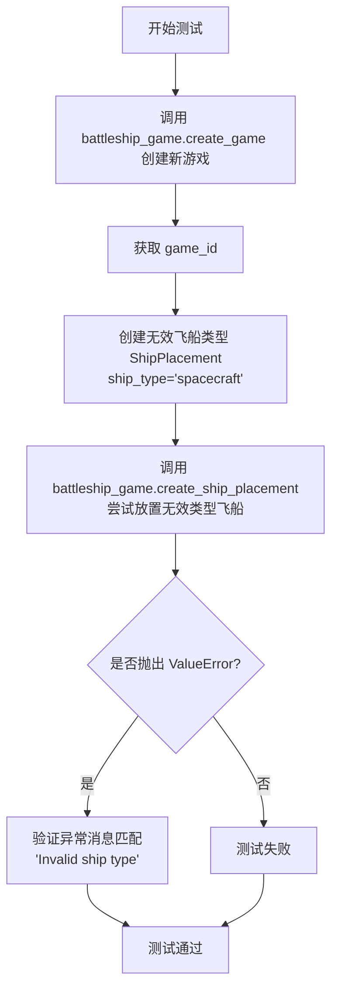
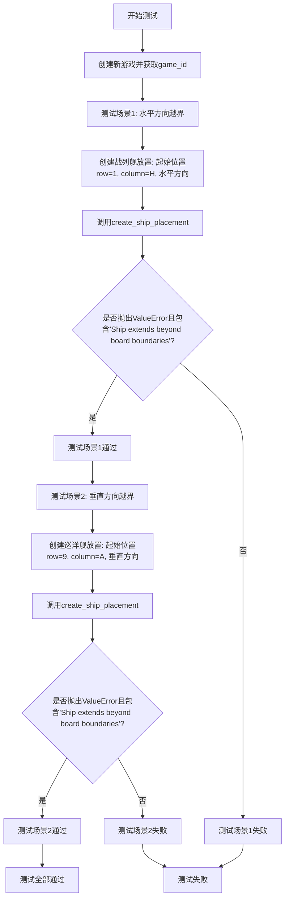

# `.\AutoGPT\classic\benchmark\agbenchmark\challenges\verticals\code\6_battleship\artifacts_out\test_negative.py` 详细设计文档

这是一个pytest测试文件，用于测试Battleship（海战棋）游戏的核心功能，包括船只放置验证（越界、重叠、无效方向、无效类型）、游戏状态转换（船只放置前不能攻击、放完后不能继续添加）以及边界检查。测试通过battleship_game fixture调用游戏API，验证各种业务逻辑约束。

## 整体流程



## 类结构

```
测试模块 (test_battleship_game.py)
└── 测试函数 (7个)
    ├── test_ship_placement_out_of_bounds
    ├── test_no_ship_overlap
    ├── test_cant_hit_before_ships_placed
    ├── test_cant_place_ship_after_all_ships_placed
    ├── test_ship_placement_invalid_direction
    ├── test_invalid_ship_type
    └── test_ship_placement_extends_beyond_boundaries
```

## 全局变量及字段


### `game_id`
    
游戏标识符，用于唯一标识一个游戏实例

类型：`str`
    


### `out_of_bounds_ship`
    
超出棋盘范围的船只放置对象（验证失败时抛出ValidationError）

类型：`ShipPlacement`
    


### `placement1`
    
第一个船只放置对象，包含battleship类型船只的放置信息

类型：`ShipPlacement`
    


### `placement2`
    
第二个船只放置对象，用于测试船只重叠检查

类型：`ShipPlacement`
    


### `turn`
    
回合对象，包含攻击目标的坐标信息

类型：`Turn`
    


### `additional_ship`
    
额外船只放置对象，用于测试在所有船只已放置后不能再添加船只

类型：`ShipPlacement`
    


### `invalid_direction_ship`
    
无效方向的船只放置对象，用于测试方向验证

类型：`ShipPlacement`
    


### `invalid_ship`
    
无效类型的船只放置对象，用于测试船只类型验证

类型：`ShipPlacement`
    


### `ship_extending_beyond`
    
超出边界的船只放置对象，用于测试边界验证

类型：`ShipPlacement`
    


### `ShipPlacement.ship_type`
    
船只类型，如battleship、cruiser、carrier等

类型：`str`
    


### `ShipPlacement.start`
    
船只起始位置，包含row和column键的字典

类型：`dict`
    


### `ShipPlacement.direction`
    
船只放置方向，horizontal或vertical

类型：`str`
    


### `Turn.target`
    
攻击目标坐标，包含row和column键的字典

类型：`dict`
    
    

## 全局函数及方法


### `test_ship_placement_out_of_bounds`

描述：该测试函数用于验证当尝试放置超出游戏板边界的船只时，系统能够正确处理。具体流程为：先创建一个新游戏，然后尝试实例化一个超出边界位置的`ShipPlacement`对象（如 `row=11, column='Z'`），期望该操作会因Pydantic验证失败而抛出`ValidationError`；若未抛出验证错误，则进一步调用`create_ship_placement`方法，期望抛出`ValueError`并匹配错误信息"Placement out of bounds"。

参数：
- `battleship_game`：`object`，提供游戏实例的测试夹具，具`create_game()`和`create_ship_placement()`等方法，用于模拟游戏行为。

返回值：`None`，测试函数不返回任何值。

#### 流程图

```mermaid
graph TD
    A([开始]) --> B[调用 battleship_game.create_game 创建游戏，获取 game_id]
    B --> C[尝试创建 out_of_bounds_ship 对象，参数: ship_type='battleship', start={'row': 11, 'column': 'Z'}, direction='horizontal']
    C --> D{是否捕获到 ValidationError?}
    D -->|是| E([测试通过 - pass])
    D -->|否| F[调用 battleship_game.create_ship_placement(game_id, out_of_bounds_ship)]
    F --> G{是否抛出 ValueError 且匹配 'Placement out of bounds'?}
    G -->|是| H([测试通过])
    G -->|否| I([测试失败])
    E --> I
    H --> I
```

#### 带注释源码

```python
def test_ship_placement_out_of_bounds(battleship_game):
    # 步骤1：使用测试夹具创建一个新游戏，并获取游戏ID
    game_id = battleship_game.create_game()

    try:
        # 步骤2：尝试实例化一个超出边界的 ShipPlacement 对象
        # 说明：row=11 和 column='Z' 超出了标准10x10游戏板的边界
        # 期望：Pydantic 模型验证会失败，抛出 ValidationError
        out_of_bounds_ship = ShipPlacement(
            ship_type="battleship",
            start={"row": 11, "column": "Z"},
            direction="horizontal",
        )
    except ValidationError:  # 直接导入的 Pydantic 验证错误类
        # 如果捕获到验证错误，说明模型验证正常工作，测试通过
        pass
    else:
        # 步骤3：如果没有抛出验证错误（即 ShipPlacement 创建成功）
        # 则尝试通过游戏对象放置船只，期望抛出 ValueError
        with pytest.raises(ValueError, match="Placement out of bounds"):
            battleship_game.create_ship_placement(game_id, out_of_bounds_ship)
```


### `test_no_ship_overlap`

该测试函数用于验证游戏引擎能够正确检测并阻止船只重叠放置的行为，确保在已存在船只的坐标上无法再次放置其他船只。

参数：

- `battleship_game`：测试 fixture（类型：`BattleshipGame` 或类似游戏实例），提供游戏实例的 fixture，用于调用游戏的各种方法

返回值：`void`（无返回值），该测试函数不返回任何值，仅通过 pytest 断言验证行为

#### 流程图

```mermaid
flowchart TD
    A[开始测试] --> B[调用 battleship_game.create_game 创建新游戏]
    B --> C[获取 game_id]
    C --> D[创建第一个 ShipPlacement: battleship, 位置(1,A), 水平方向]
    D --> E[调用 battleship_game.create_ship_placement 放置第一艘船]
    E --> F[创建第二个 ShipPlacement: cruiser, 位置(1,A), 水平方向]
    F --> G[调用 battleship_game.create_ship_placement 尝试放置第二艘船]
    G --> H{是否抛出 ValueError?}
    H -->|是| I[测试通过]
    H -->|否| J[测试失败]
```

#### 带注释源码

```python
def test_no_ship_overlap(battleship_game):
    """
    测试船只放置不能重叠的验证逻辑
    
    该测试验证游戏引擎能够正确检测并阻止船只重叠放置的情况。
    当尝试在已有船只的坐标上放置新船时，系统应抛出 ValueError 异常。
    """
    
    # 步骤1: 创建新游戏并获取游戏ID
    # battleship_game 是测试 fixture，提供游戏实例
    game_id = battleship_game.create_game()
    
    # 步骤2: 创建第一个船只放置配置（战列舰）
    # 参数说明:
    #   - ship_type: 船只类型为 "battleship" (战列舰)
    #   - start: 起始位置为 row=1, column='A'
    #   - direction: 水平方向放置
    placement1 = ShipPlacement(
        ship_type="battleship", 
        start={"row": 1, "column": "A"}, 
        direction="horizontal"
    )
    
    # 步骤3: 调用游戏接口放置第一艘船
    # 这个放置应该是成功的，不会抛出异常
    battleship_game.create_ship_placement(game_id, placement1)
    
    # 步骤4: 创建第二个船只放置配置（巡洋舰）
    # 关键: 这里的起始位置与 placement1 完全相同 (row=1, column='A')
    # 这将触发船只重叠检测
    placement2 = ShipPlacement(
        ship_type="cruiser", 
        start={"row": 1, "column": "A"}, 
        direction="horizontal"
    )
    
    # 步骤5: 尝试放置第二艘船，预期会抛出 ValueError
    # 使用 pytest.raises 上下文管理器捕获异常
    # 如果没有抛出异常，测试将失败
    with pytest.raises(ValueError):
        battleship_game.create_ship_placement(game_id, placement2)
```


### `test_cant_hit_before_ships_placed`

该测试函数用于验证游戏逻辑中的一个关键约束：在所有船只尚未全部放置完成之前，玩家不能开始进行攻击（Turn）。测试通过创建游戏、放置部分船只，然后尝试在船只放置完成前发起攻击，预期会抛出带有特定错误消息的 ValueError，从而确保游戏状态机正确强制执行这一业务规则。

参数：

- `battleship_game`：`<class 'BattleshipGame'>`，pytest fixture，提供游戏实例的模拟对象，用于调用游戏的各种方法

返回值：`None`，测试函数没有返回值，通过 pytest 框架的断言机制来验证行为

#### 流程图

```mermaid
flowchart TD
    A[开始测试] --> B[创建游戏并获取 game_id]
    B --> C[创建 battleship 船只放置: start={row:1, column:A}, direction=horizontal]
    C --> D[调用 create_ship_placement 放置第一艘船]
    D --> E[创建 cruiser 船只放置: start={row:4, column:D}, direction=horizontal]
    E --> F[调用 create_ship_placement 放置第二艘船]
    F --> G[创建攻击目标: target={row:1, column:A}]
    G --> H[尝试调用 create_turn 发起攻击]
    H --> I{是否抛出 ValueError?}
    I -->|是| J[验证错误消息: 'All ships must be placed before starting turns']
    J --> K[测试通过]
    I -->|否| L[测试失败 - 未抛出预期异常]
    K --> M[结束测试]
    L --> M
```

#### 带注释源码

```python
def test_cant_hit_before_ships_placed(battleship_game):
    """
    测试在所有船只放置之前无法进行攻击的业务规则。
    
    测试场景：
    1. 创建新游戏
    2. 放置一艘 battleship
    3. 放置一艘 cruiser
    4. 尝试在船只放置完成前发起攻击
    5. 预期抛出 ValueError，提示需要先放置所有船只
    """
    # 第一步：创建游戏并获取游戏ID
    game_id = battleship_game.create_game()
    
    # 第二步：创建第一艘船（battleship）的放置信息
    # 放置位置：第1行，A列，水平方向
    placement1 = ShipPlacement(
        ship_type="battleship",          # 船类型：战列舰
        start={"row": 1, "column": "A"},  # 起始位置：行1，列A
        direction="horizontal"            # 方向：水平放置
    )
    # 调用游戏接口放置第一艘船
    battleship_game.create_ship_placement(game_id, placement1)
    
    # 第三步：创建第二艘船（cruiser）的放置信息
    # 放置位置：第4行，D列，水平方向
    placement2 = ShipPlacement(
        ship_type="cruiser",              # 船类型：巡洋舰
        start={"row": 4, "column": "D"},  # 起始位置：行4，列D
        direction="horizontal"            # 方向：水平放置
    )
    # 调用游戏接口放置第二艘船
    battleship_game.create_ship_placement(game_id, placement2)
    
    # 第四步：创建攻击目标（Turn）
    # 目标位置：第1行，A列（正好是第一艘船的位置）
    turn = Turn(target={"row": 1, "column": "A"})
    
    # 第五步：尝试在当前状态下发起攻击
    # 预期行为：抛出 ValueError，因为游戏规则要求所有船只必须先放置完成
    # 预期错误消息：'All ships must be placed before starting turns'
    with pytest.raises(
        ValueError, match="All ships must be placed before starting turns"
    ):
        battleship_game.create_turn(game_id, turn)
```

#### 关键点说明

| 要素 | 说明 |
|------|------|
| **测试目标** | 验证游戏状态机的状态转换约束：船只放置阶段 → 战斗阶段 |
| **前置条件** | 需要游戏已创建并处于船只放置阶段 |
| **触发条件** | 在船只放置完成后、战斗开始前尝试发起攻击 |
| **预期结果** | 系统拒绝该操作并抛出明确的业务规则错误消息 |
| **业务规则** | 所有船只必须放置完毕后才允许开始战斗回合 |


### `test_cant_place_ship_after_all_ships_placed`

该测试函数用于验证在所有船只已放置完毕后，系统应拒绝再放置额外的船只，确保游戏状态的一致性。

参数：

- `battleship_game`：`fixture`（测试夹具），提供游戏实例，用于调用游戏的各种方法
- `initialized_game_id`：`str`，表示一个已经放置完所有船只的游戏ID（通过 fixture 初始化）

返回值：`None`，该测试函数无返回值，通过 `pytest.raises` 验证是否抛出预期的 `ValueError` 异常

#### 流程图



#### 带注释源码

```python
def test_cant_place_ship_after_all_ships_placed(battleship_game, initialized_game_id):
    """
    测试当所有船只已放置完毕后，不能再放置额外的船只。
    
    参数:
        battleship_game: 提供游戏实例的fixture，用于调用游戏方法
        initialized_game_id: 已初始化游戏的ID，该游戏已放置所有船只
    
    预期行为:
        当尝试在已满的游戏中再放置船只时，应抛出ValueError异常
    """
    # 获取已初始化的游戏，验证游戏状态
    battleship_game.get_game(initialized_game_id)
    
    # 创建一个额外的船只放置对象（carrier类型）
    additional_ship = ShipPlacement(
        ship_type="carrier",          # 船型：航母
        start={"row": 2, "column": "E"},  # 起始位置：第2行E列
        direction="horizontal"        # 方向：水平放置
    )

    # 使用pytest.raises验证是否抛出预期的ValueError异常
    with pytest.raises(
        ValueError, match="All ships are already placed. Cannot place more ships."
    ):
        # 尝试在已满的游戏中创建船只放置，应抛出异常
        battleship_game.create_ship_placement(initialized_game_id, additional_ship)
```


### `test_ship_placement_invalid_direction`

描述：测试当尝试使用无效的船只方向（如"diagonal"对角线）进行船只放置时，系统是否正确抛出ValueError异常。

参数：

- `battleship_game`：`fixture`，测试框架提供的游戏实例fixture，用于模拟游戏对象的行为

返回值：`None`，该函数为测试函数，不返回任何值

#### 流程图



#### 带注释源码

```python
def test_ship_placement_invalid_direction(battleship_game):
    """
    测试无效的船只方向是否被正确拒绝
    
    该测试验证当用户尝试使用非法的方向值（如 'diagonal'）时，
    系统能够正确识别并抛出带有明确错误消息的异常
    """
    # 步骤1: 创建新游戏并获取游戏ID
    game_id = battleship_game.create_game()

    # 步骤2: 使用 pytest.raises 上下文管理器捕获预期的异常
    # 期望捕获 ValueError，且错误消息包含 "Invalid ship direction"
    with pytest.raises(ValueError, match="Invalid ship direction"):
        # 步骤3: 创建一个方向为 'diagonal' 的无效 ShipPlacement 对象
        # 有效方向应为 'horizontal' 或 'vertical'
        invalid_direction_ship = ShipPlacement(
            ship_type="battleship",
            start={"row": 1, "column": "A"},
            direction="diagonal",  # 无效方向，只能是 horizontal 或 vertical
        )
        
        # 步骤4: 尝试调用游戏对象的创建船只放置方法
        # 这应该触发 ValidationError 或 ValueError
        battleship_game.create_ship_placement(game_id, invalid_direction_ship)
```


### `test_invalid_ship_type`

该测试函数用于验证当尝试使用无效的飞船类型（如"spacecraft"）创建飞船放置时，系统是否正确抛出ValueError异常。

参数：

- `battleship_game`：pytest fixture，用于提供游戏实例，类型为游戏fixture对象

返回值：`None`，该测试函数无返回值，通过pytest框架的断言机制验证异常抛出

#### 流程图



#### 带注释源码

```python
def test_invalid_ship_type(battleship_game):
    """
    测试无效飞船类型的处理
    
    验证当使用不存在的飞船类型（如'spacecraft'）时，
    create_ship_placement方法应抛出ValueError异常
    """
    # 第一步：创建一个新游戏，获取游戏ID
    game_id = battleship_game.create_game()
    
    # 第二步：构建一个包含无效飞船类型的ShipPlacement对象
    # 有效类型应为：carrier, battleship, cruiser, submarine, destroyer
    # 'spacecraft' 是一个无效的飞船类型
    invalid_ship = ShipPlacement(
        ship_type="spacecraft",  # 无效的飞船类型
        start={"row": 1, "column": "A"},  # 起始位置
        direction="horizontal"  # 水平方向
    )
    
    # 第三步：使用pytest.raises验证系统是否正确抛出ValueError
    # 并检查异常消息是否包含"Invalid ship type"
    with pytest.raises(ValueError, match="Invalid ship type"):
        battleship_game.create_ship_placement(game_id, invalid_ship)
```


### `test_ship_placement_extends_beyond_boundaries`

该测试函数用于验证当船只放置超出棋盘边界时，系统是否正确抛出包含 "Ship extends beyond board boundaries" 信息的 ValueError 异常。测试涵盖水平方向和垂直方向两种越界场景。

参数：

- `battleship_game`：`pytest.fixture`，模拟海战游戏实例的 fixture，用于提供游戏对象

返回值：`None`，测试函数无返回值

#### 流程图



#### 带注释源码

```python
def test_ship_placement_extends_beyond_boundaries(battleship_game):
    """
    测试当船只放置超出棋盘边界时是否抛出正确的异常
    
    测试两种越界场景:
    1. 水平方向: 战列舰(长度5)从H列开始, 超出右侧边界
    2. 垂直方向: 巡洋舰(长度3)从第9行开始, 超出底部边界
    """
    
    # 创建新游戏并获取游戏ID
    game_id = battleship_game.create_game()

    # ==================== 测试场景1: 水平方向越界 ====================
    # 战列舰长度为5, 从H列(第8列)开始水平放置
    # H(8) + 5 - 1 = 12, 超出标准棋盘边界(假设最大为10列)
    with pytest.raises(ValueError, match="Ship extends beyond board boundaries"):
        # 构建越界的战列舰放置对象
        ship_extending_beyond = ShipPlacement(
            ship_type="battleship",      # 船只类型: 战列舰
            start={"row": 1, "column": "H"},  # 起始位置: 第1行, H列
            direction="horizontal",       # 方向: 水平
        )
        # 尝试创建船只放置, 预期抛出ValueError
        battleship_game.create_ship_placement(game_id, ship_extending_beyond)

    # ==================== 测试场景2: 垂直方向越界 ====================
    # 巡洋舰长度为3, 从第9行开始垂直放置
    # 9 + 3 - 1 = 11, 超出标准棋盘边界(假设最大为10行)
    with pytest.raises(ValueError, match="Ship extends beyond board boundaries"):
        # 构建越界的巡洋舰放置对象
        ship_extending_beyond = ShipPlacement(
            ship_type="cruiser",           # 船只类型: 巡洋舰
            start={"row": 9, "column": "A"},   # 起始位置: 第9行, A列
            direction="vertical",          # 方向: 垂直
        )
        # 尝试创建船只放置, 预期抛出ValueError
        battleship_game.create_ship_placement(game_id, ship_extending_beyond)
```

## 关键组件


### ShipPlacement

船只放置的数据模型，用于定义船只的类型、起始位置和方向，继承自pydantic模型用于数据验证。

### Turn

回合数据模型，用于定义攻击目标的位置坐标。

### battleship_game

游戏fixture实例，提供游戏创建、船只放置和回合操作等核心功能方法。

### ValidationError

Pydantic框架的验证错误异常类，用于捕获数据模型验证失败的情况。

### 边界验证逻辑

验证船只放置是否超出游戏板边界（10x10网格），包括水平方向和垂直方向的边界检查。

### 船只重叠检测

确保已放置的船只之间不存在重叠区域，同一位置不能放置多艘船只。

### 游戏状态机

管理游戏的生命周期阶段：创建游戏 → 放置船只 → 开始回合，在不同阶段对操作进行合法性校验。

### 船只类型验证

验证船只类型是否为有效的战舰类型（battleship、cruiser、carrier等），拒绝无效类型。

### 船只方向验证

验证船只方向只能是水平（horizontal）或垂直（vertical），拒绝对角线等无效方向。


## 问题及建议


### 已知问题

- **异常处理逻辑不一致**：`test_ship_placement_out_of_bounds` 中先捕获 `ValidationError`，然后在 `else` 分支又用 `pytest.raises(ValueError)` 验证，这种混合的异常处理方式表明对异常类型的定义不清晰，可能导致边界情况下的行为不确定
- **测试前提条件不明确**：测试依赖于 `initialized_game_id` fixture，但代码中未提供该 fixture 的定义，测试用例依赖于外部状态（假设游戏已有5艘船），降低了测试的独立性和可维护性
- **验证逻辑与错误消息耦合**：多处使用 `match` 参数进行正则匹配（如 `"All ships must be placed before starting turns"`），如果后续修改错误消息文本，会导致测试失败，缺乏对错误消息结构的统一约束
- **测试数据硬编码**：行列坐标（如 `{"row": 1, "column": "A"}`）在多个测试中重复出现，没有使用常量或 fixture 统一管理，不利于后续修改（如扩展棋盘大小）
- **缺少正向测试用例**：现有测试多为负向测试（验证错误情况），缺少对成功场景的验证（如成功放置船只、成功执行回合等），难以确认功能正确实现

### 优化建议

- **重构异常处理逻辑**：明确 `ValidationError` 和 `ValueError` 的使用场景，建议在 `ShipPlacement` 创建时统一抛出 `ValidationError`，在业务逻辑层抛出 `ValueError`，避免混用
- **消除测试间依赖**：将 `initialized_game_id` fixture 的创建逻辑内联到测试中，或在测试开始时显式放置所有必需的船只，确保每个测试独立运行
- **抽取测试数据为常量或 fixture**：定义 BOARD_SIZE、VALID_SHIP_TYPES 等常量，将重复的坐标和船只配置提取为 fixture 或工厂函数
- **添加正向测试用例**：补充验证成功场景的测试，如成功创建游戏、成功放置船只、成功执行回合并返回正确结果等
- **统一错误消息格式**：定义错误消息模板或枚举类，确保错误消息格式一致，便于测试匹配和日志分析


## 其它


### 设计目标与约束

该代码旨在验证 Battleship 游戏的船只放置和回合机制的核心业务逻辑。设计目标包括：确保船只放置在游戏板边界内、防止船只重叠、强制所有船只放置后才能开始回合、以及限制船只放置的总数量。约束条件包括：游戏板为 10x10 网格（行 1-10，列 A-J）、支持水平 和垂直方向的船只放置、船只类型包括 battleship、cruiser 和 carrier。

### 错误处理与异常设计

代码使用 Pydantic 的 ValidationError 进行输入验证，使用 pytest.raises 捕获并验证 ValueError 异常。异常设计遵循以下模式：ValidationError 用于 Pydantic 模型验证失败（如无效的列字母、方向枚举值），ValueError 用于业务逻辑验证失败（如超出边界船只重叠、状态转换非法）。每个测试用例都验证了具体的错误消息，确保异常信息清晰且具有诊断价值。

### 数据流与状态机

游戏状态转换遵循以下流程：创建游戏（空状态）→ 放置船只（船只放置阶段）→ 开始回合（游戏进行阶段）。关键状态转换规则包括：未放置所有船只时禁止创建回合、所有船只放置后禁止再放置船只、船只方向只能是 horizontal 或 vertical、行列坐标必须在有效范围内。

### 外部依赖与接口契约

代码依赖以下外部组件：pytest 作为测试框架、pydantic 用于数据模型验证和类型检查、abstract_class 模块定义 ShipPlacement 和 Turn 抽象类、battleship_game fixture 提供游戏实例。接口契约规定：create_game() 返回 game_id、create_ship_placement() 接受 game_id 和 ShipPlacement 对象、create_turn() 接受 game_id 和 Turn 对象，所有方法在验证失败时抛出相应异常。

### 安全性考虑

代码未直接涉及用户输入处理或敏感数据，但在生产环境中应考虑：游戏 ID 的生成机制应防止预测和枚举攻击、船只位置数据应进行输入消毒以防止注入攻击、API 端点应实现认证和授权检查。

### 性能考虑

当前测试未涉及性能测试，但生产环境中应关注：船只位置验证算法的时间复杂度（当前实现应为 O(1) 或 O(n)）、游戏状态查询的响应时间、并发游戏会话的管理。

### 测试覆盖率

当前测试覆盖了核心业务逻辑场景，包括边界验证、船只重叠检测、状态转换验证和错误消息验证。建议补充的测试场景包括：边界情况测试（如船只正好放置在边界上）、连续多次放置和移除船只的压力测试、并发游戏会话的隔离测试。

    