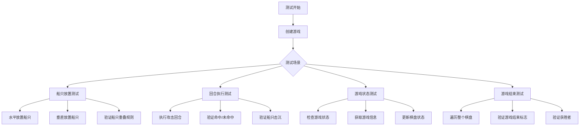
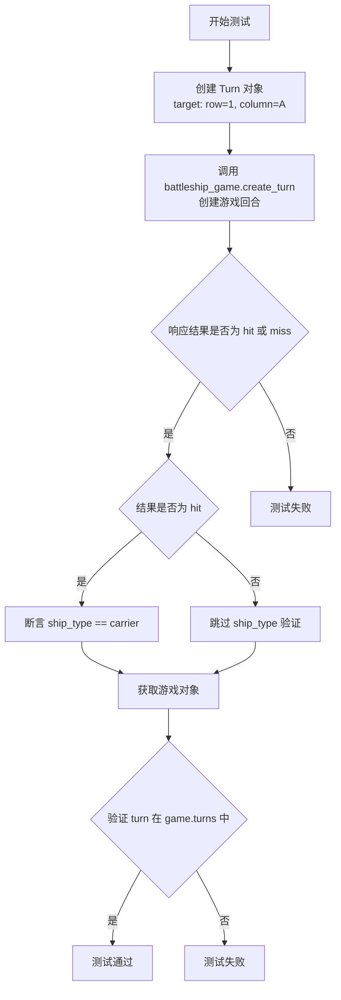
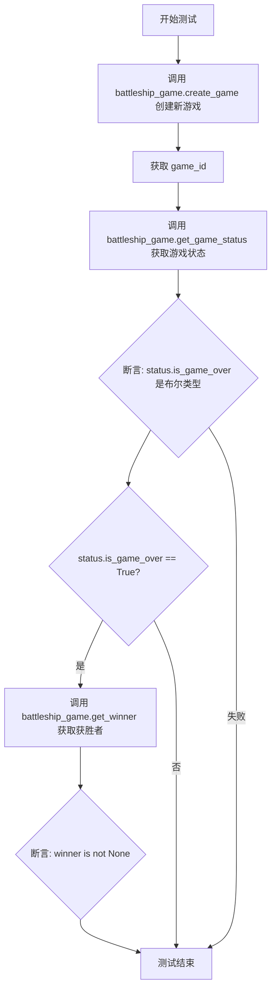
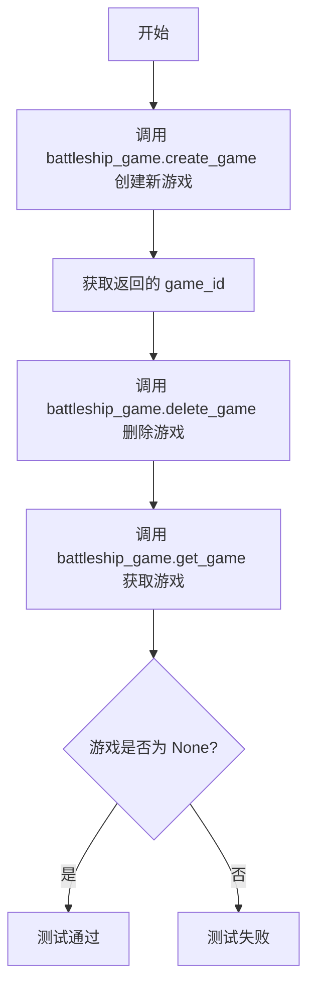
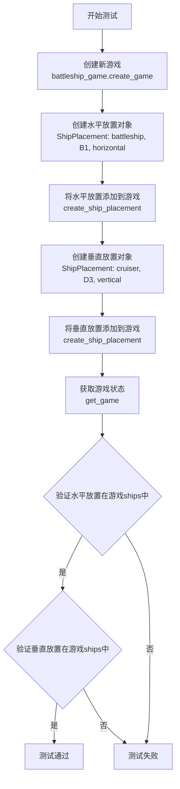
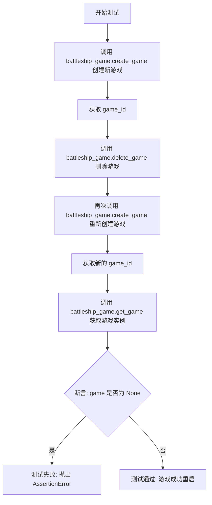
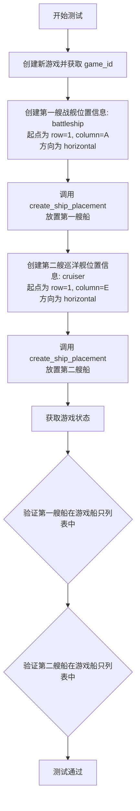

# `.\AutoGPT\classic\benchmark\agbenchmark\challenges\verticals\code\6_battleship\artifacts_out\test_positive.py` 详细设计文档

这是一个 Battleship（海战棋）游戏的集成测试文件，通过 pytest 测试框架验证游戏的回合管理、船只放置、游戏状态更新、船只击沉判定、游戏结束条件等核心功能。

## 整体流程



## 类结构

```
Test Module (测试模块)
├── 导入的外部类
│   ├── ShipPlacement (船只放置配置类)
│   └── Turn (回合攻击类)
└── 测试函数集合
    ├── test_turns_and_results
    ├── test_game_status_and_winner
    ├── test_delete_game
    ├── test_ship_rotation
    ├── test_game_state_updates
    ├── test_ship_sinking_feedback
    ├── test_restart_game
    ├── test_ship_edge_overlapping
    ├── test_game_state_after_ship_placement
    ├── test_game_state_after_turn
    ├── test_multiple_hits_on_ship
    └── test_game_over_condition
```

## 全局变量及字段


### `turn`
    
A turn object representing a player's move in the game with target coordinates

类型：`Turn`
    


### `response`
    
The response object returned after creating a turn, containing result and ship_type information

类型：`TurnResponse`
    


### `game`
    
The game object containing all game state including board, ships, and turns

类型：`Game`
    


### `game_id`
    
Unique identifier string for a game instance

类型：`str`
    


### `status`
    
The game status object containing is_game_over and other state information

类型：`GameStatus`
    


### `winner`
    
The winner of the game, typically a player identifier or None

类型：`str`
    


### `placement_horizontal`
    
Ship placement configuration with horizontal direction

类型：`ShipPlacement`
    


### `placement_vertical`
    
Ship placement configuration with vertical direction

类型：`ShipPlacement`
    


### `ship_placement`
    
General ship placement configuration object

类型：`ShipPlacement`
    


### `first_ship`
    
First ship placement configuration in a placement test

类型：`ShipPlacement`
    


### `next_ship`
    
Next/second ship placement configuration in a placement test

类型：`ShipPlacement`
    


### `target_key`
    
Board coordinate tuple key for targeting a specific cell

类型：`tuple`
    


### `hits`
    
List of column letters representing hit positions on a ship

类型：`list`
    


### `static_moves`
    
List of dictionaries containing predefined row and column positions for moves

类型：`list`
    


### `index`
    
Loop index counter for iteration over collections

类型：`int`
    


### `hit`
    
Column letter string from hits list representing a hit position

类型：`str`
    


### `static_turn`
    
Turn object created from static_moves for predefined attack positions

类型：`Turn`
    


### `hit_positions`
    
List of column letters representing positions to hit on a ship

类型：`list`
    


### `pos`
    
Position string from hit_positions list in iteration

类型：`str`
    


### `row`
    
Row number for grid coordinates, typically 1-10 in battleship

类型：`int`
    


### `column`
    
Column letter for grid coordinates, typically A-J in battleship

类型：`str`
    


### `ShipPlacement.ship_type`
    
Type of ship being placed, e.g., carrier, battleship, cruiser

类型：`str`
    


### `ShipPlacement.start`
    
Starting position dictionary with row and column keys

类型：`dict`
    


### `ShipPlacement.direction`
    
Orientation of ship placement, either horizontal or vertical

类型：`str`
    


### `Turn.target`
    
Target coordinates dictionary with row and column keys for attack

类型：`dict`
    
    

## 全局函数及方法


### `test_turns_and_results`

该测试函数用于验证 Battleship 游戏中回合创建与结果返回的核心功能，通过模拟玩家攻击操作，验证系统能否正确记录回合并返回准确的命中/未命中结果。

参数：

- `battleship_game`：`<class>`，Pytest fixture，提供游戏实例对象，用于调用游戏相关方法（如 create_turn、get_game）
- `initialized_game_id`：`<class>`，Pytest fixture，提供已初始化的游戏 ID，用于指定要操作的游戏

返回值：`None`，该函数为测试函数，无显式返回值，通过 assert 断言验证行为

#### 流程图



#### 带注释源码

```python
from .abstract_class import ShipPlacement, Turn  # 从抽象类模块导入 Turn 类


def test_turns_and_results(battleship_game, initialized_game_id):
    """
    测试回合创建与结果返回功能
    
    参数:
        battleship_game: 游戏实例 fixture
        initialized_game_id: 已初始化游戏的 ID fixture
    
    验证点:
        1. 能够成功创建回合
        2. 响应结果为 hit 或 miss 之一
        3. 若命中,ship_type 应为 carrier
        4. 回合记录在游戏历史中
    """
    # 步骤1: 创建一个回合对象,指定攻击坐标 (1, A)
    turn = Turn(target={"row": 1, "column": "A"})
    
    # 步骤2: 调用游戏实例方法创建回合,传入游戏ID和回合对象
    response = battleship_game.create_turn(initialized_game_id, turn)

    # 步骤3: 断言响应结果为有效值 (hit 或 miss)
    assert response.result in ["hit", "miss"]
    
    # 步骤4: 若结果为命中,进一步验证击中的舰船类型
    if response.result == "hit":
        assert response.ship_type == "carrier"
    
    # 步骤5: 获取游戏当前状态
    game = battleship_game.get_game(initialized_game_id)
    
    # 步骤6: 验证创建的回合已被记录到游戏历史中
    assert turn in game.turns
```


### `test_game_status_and_winner`

该测试函数用于验证游戏状态查询和获胜者判断功能是否正常工作。具体来说，它创建一个新的游戏实例，获取游戏状态，验证`is_game_over`字段为布尔类型，并在游戏结束时验证能够正确获取获胜者信息。

参数：

- `battleship_game`：`object`（pytest fixture），用于与 Battleship 游戏系统交互的测试fixture，提供创建游戏、获取游戏状态等操作

返回值：`None`，测试函数通过断言（assert）验证功能，不返回具体数据

#### 流程图



#### 带注释源码

```python
def test_game_status_and_winner(battleship_game):
    # 使用 battleship_game fixture 创建一个新游戏，并获取返回的游戏ID
    game_id = battleship_game.create_game()
    
    # 根据 game_id 获取当前游戏的状态信息
    status = battleship_game.get_game_status(game_id)
    
    # 断言验证：确保游戏状态的 is_game_over 字段是布尔类型
    assert isinstance(status.is_game_over, bool)
    
    # 判断游戏是否已经结束
    if status.is_game_over:
        # 如果游戏结束，则调用 get_winner 获取获胜者信息
        winner = battleship_game.get_winner(game_id)
        
        # 断言验证：确保获胜者不为空（游戏结束时应该有获胜者）
        assert winner is not None
```


### `test_delete_game`

该测试函数用于验证游戏删除功能，创建一个新游戏，通过游戏客户端删除该游戏，并断言删除后无法再通过游戏ID获取到游戏对象，从而确认删除操作成功。

参数：

- `battleship_game`：`GameClient`（游戏客户端对象），提供创建、删除和获取游戏的方法，用于与游戏系统进行交互

返回值：`None`，测试函数无返回值，仅通过断言验证逻辑正确性

#### 流程图



#### 带注释源码

```python
def test_delete_game(battleship_game):
    """
    测试游戏删除功能
    
    验证流程：
    1. 创建一个新游戏并获取 game_id
    2. 使用 game_id 删除该游戏
    3. 尝试通过 game_id 获取游戏，确认返回 None
    """
    # 步骤1：创建新游戏，获取游戏ID
    game_id = battleship_game.create_game()
    
    # 步骤2：调用删除方法，删除指定ID的游戏
    battleship_game.delete_game(game_id)
    
    # 步骤3：断言删除后无法再获取该游戏
    # 验证 get_game 返回 None，表示游戏已被成功删除
    assert battleship_game.get_game(game_id) is None
```


### `test_ship_rotation`

该测试函数验证战船游戏中的船只放置功能，特别是测试水平方向和垂直方向两种船只旋转方式的正确性，确保不同方向的船只能够正确地被放置到游戏板上。

参数：

- `battleship_game`：`BattleshipGame`，pytest fixture，提供游戏的创建和管理接口，用于执行游戏相关的操作

返回值：`None`，测试函数不返回任何内容，仅通过断言验证船只放置的正确性

#### 流程图



#### 带注释源码

```python
def test_ship_rotation(battleship_game):
    """
    测试船只旋转功能，验证水平和垂直方向都能正确放置船只
    
    参数:
        battleship_game: 提供游戏操作接口的fixture
    """
    # 步骤1: 创建一个新游戏，获取游戏ID
    game_id = battleship_game.create_game()
    
    # 步骤2: 创建水平方向的battleship放置
    # 位置: 第1行，B列，水平方向
    placement_horizontal = ShipPlacement(
        ship_type="battleship",  # 船只类型：战列舰
        start={"row": 1, "column": "B"},  # 起始位置
        direction="horizontal"  # 方向：水平
    )
    
    # 步骤3: 将水平放置添加到游戏中
    battleship_game.create_ship_placement(game_id, placement_horizontal)
    
    # 步骤4: 创建垂直方向的cruiser放置
    # 位置: 第3行，D列，垂直方向
    placement_vertical = ShipPlacement(
        ship_type="cruiser",  # 船只类型：巡洋舰
        start={"row": 3, "column": "D"},  # 起始位置
        direction="vertical"  # 方向：垂直
    )
    
    # 步骤5: 将垂直放置添加到游戏中
    battleship_game.create_ship_placement(game_id, placement_vertical)
    
    # 步骤6: 获取更新后的游戏状态
    game = battleship_game.get_game(game_id)
    
    # 步骤7: 验证水平放置的船只是否在游戏ships列表中
    assert placement_horizontal in game.ships
    
    # 步骤8: 验证垂直放置的船只是否在游戏ships列表中
    assert placement_vertical in game.ships
```


### `test_game_state_updates`

该测试函数用于验证游戏状态更新功能，具体流程为：创建一个针对特定坐标的回合，执行该回合后获取游戏状态，验证游戏板上对应位置是否正确标记为"hit"（命中）。

参数：

-  `battleship_game`：`Fixture / BattleshipGame`，测试fixture对象，提供与游戏系统交互的接口方法（如`create_turn`、`get_game`等）
-  `initialized_game_id`：`int`，已初始化游戏的唯一标识符，用于指定要执行回合操作的游戏实例

返回值：`None`，该函数为测试函数，无显式返回值，通过assert断言验证功能正确性

#### 流程图

```mermaid
flowchart TD
    A[开始: test_game_state_updates] --> B[创建Turn对象<br/>target: {row: 3, column: 'A'}]
    B --> C[调用battleship_game.create_turn<br/>参数: initialized_game_id, turn]
    C --> D[调用battleship_game.get_game<br/>参数: initialized_game_id<br/>获取游戏状态]
    E[计算目标键值<br/>target_key = (3, ord('A') - ord('A'))] --> F{断言验证}
    D --> E
    F --> G{target_key in game.board<br/>且<br/>game.board[target_key] == 'hit'}
    G -->|通过| H[测试通过]
    G -->|失败| I[断言错误<br/>测试失败]
```

#### 带注释源码

```python
def test_game_state_updates(battleship_game, initialized_game_id):
    """
    测试游戏状态更新功能
    
    验证内容：
    1. 创建回合后游戏状态能够正确更新
    2. 命中（hit）结果能够正确记录到游戏板上
    """
    
    # 第一步：创建Turn对象，指定攻击目标坐标
    # row=3 表示第3行，column='A' 表示第A列
    turn = Turn(target={"row": 3, "column": "A"})
    
    # 第二步：调用battleship_game的create_turn方法
    # 在initialized_game_id对应的游戏中执行上述回合
    battleship_game.create_turn(initialized_game_id, turn)
    
    # 第三步：获取更新后的游戏状态
    # 包含最新的游戏板状态、回合历史等信息
    game = battleship_game.get_game(initialized_game_id)
    
    # 第四步：计算目标键值并验证
    # ord("A") - ord("A") = 0，将列字母转换为数字索引
    # target_key = (3, 0) 对应游戏板的坐标(3, 0)
    target_key = (3, ord("A") - ord("A"))
    
    # 断言验证：
    # 1. 目标键值存在于游戏板中
    # 2. 该位置的值必须为"hit"（命中）
    assert target_key in game.board and game.board[target_key] == "hit"
```


### `test_ship_sinking_feedback`

这是一个测试函数，用于验证当战舰的所有部位都被击中时，系统是否正确返回"sunk"（击沉）状态。该测试模拟了对"battleship"（战列舰）的四次连续命中，并在每次命中后执行一次无关的静态移动，最终断言最后响应结果为"sunk"。

参数：

- `battleship_game`：`<class 'fixture'>`，测试夹具，提供游戏实例的API接口，用于执行创建游戏、放置战舰、发起攻击等操作
- `initialized_game_id`：`<class 'str'>`或`<class 'int'>`，已初始化游戏的ID，测试前已创建好游戏并放置了战舰

返回值：无（`None`），该函数为测试函数，不返回任何值，主要通过assert断言验证行为

#### 流程图

```mermaid
flowchart TD
    A[开始测试] --> B[定义hits列表: A, B, C, D]
    B --> C[定义static_moves列表: E, F, G, H列]
    C --> D[初始化response为None]
    D --> E[遍历hits列表, index从0到3]
    E --> F[创建Turn对象: row=2, column=hit]
    F --> G[调用battleship_game.create_turn创建回合]
    G --> H{response.ship_type == 'battleship'}
    H -->|是| I[获取static_moves[index]创建静态回合]
    H -->|否| J[测试失败]
    I --> K[调用battleship_game.create_turn执行静态移动]
    K --> L{index < len(hits) - 1}
    L -->|是| E
    L -->|否| M{response.result == 'sunk'}
    M -->|是| N[测试通过]
    M -->|否| O[测试失败]
    
    style H fill:#ffcccc
    style M fill:#ccffcc
    style J fill:#ff9999
    style O fill:#ff9999
```

#### 带注释源码

```python
def test_ship_sinking_feedback(battleship_game, initialized_game_id):
    """
    测试函数：验证战舰被击沉时的反馈机制
    
    测试场景：
    1. 对已经放置在游戏板上的battleship（战列舰）进行连续命中
    2. 每次攻击后执行一个无关的静态移动
    3. 验证当战舰所有部位都被击中后，系统返回sunk状态
    """
    
    # 定义需要命中的列位置（A, B, C, D对应battleship的4个位置）
    hits = ["A", "B", "C", "D"]
    
    # 定义静态移动的位置（用于填充回合，不影响测试结果）
    static_moves = [
        {"row": 1, "column": "E"},
        {"row": 1, "column": "F"},
        {"row": 1, "column": "G"},
        {"row": 1, "column": "H"},
    ]

    # 初始化response变量，用于存储最后一次攻击的响应
    response = None
    
    # 遍历每个命中位置
    for index, hit in enumerate(hits):
        # 创建攻击回合：在第2行，当前命中的列位置
        turn = Turn(target={"row": 2, "column": hit})
        
        # 执行攻击，获取响应
        response = battleship_game.create_turn(initialized_game_id, turn)
        
        # 断言：确认击中的是battleship类型战舰
        assert response.ship_type == "battleship"

        # 创建静态移动回合（无关攻击，用于填充游戏进程）
        static_turn = Turn(target=static_moves[index])
        battleship_game.create_turn(initialized_game_id, static_turn)

    # 最终断言：验证response的结果为"sunk"（击沉）
    assert response and response.result == "sunk"
```


### `test_restart_game`

该函数用于测试游戏重新开始的功能，验证在删除已有游戏后能够成功创建新的游戏实例，并确认新游戏实例存在且可正常获取。

参数：

- `battleship_game`：`TestClient`（测试夹具），用于与游戏服务进行交互的测试客户端实例

返回值：`None`，该函数为测试函数，不返回任何值，仅通过断言验证游戏重启逻辑的正确性

#### 流程图



#### 带注释源码

```python
def test_restart_game(battleship_game):
    """
    测试游戏重新开始的功能
    
    该测试验证以下场景：
    1. 创建一个新游戏
    2. 删除该游戏
    3. 重新创建一个新游戏
    4. 验证新游戏存在且可以正常获取
    """
    # 第一步：创建一个新游戏，获取游戏ID
    game_id = battleship_game.create_game()
    
    # 第二步：删除刚创建的游戏
    battleship_game.delete_game(game_id)
    
    # 第三步：重新创建一个新游戏
    # 注意：使用返回的 game_id，因为之前的 game_id 已被删除
    game_id = (
        battleship_game.create_game()
    )  # Use the returned game_id after recreating the game
    
    # 第四步：获取游戏实例并验证其存在
    game = battleship_game.get_game(game_id)
    assert game is not None
```


### `test_ship_edge_overlapping`

该测试函数用于验证战舰游戏中船只边缘相邻放置时的正确处理逻辑。具体来说，它测试当一艘战舰（battleship）在水平方向放置后，另一艘巡洋舰（cruiser）紧随其后放置（边缘相邻）时，系统能否正确接受这种合法的船只布局。

参数：

- `battleship_game`：`GameClient`（或类似的游戏客户端 fixture），提供游戏创建、船只放置和游戏状态查询等接口

返回值：`None`，该函数通过 assert 语句进行断言验证，不返回任何值

#### 流程图



#### 带注释源码

```python
def test_ship_edge_overlapping(battleship_game):
    """
    测试船只边缘重叠（相邻）放置的场景
    
    验证当两艘船在水平方向上紧邻放置时（第一艘船的结束位置
    正好是第二艘船的起始位置），系统能否正确处理这种合法的布局。
    """
    # 第一步：创建新游戏，获取游戏ID
    game_id = battleship_game.create_game()

    # 第二步：创建第一艘战舰（battleship）的放置信息
    # 位置：从 (1, A) 开始，水平方向放置
    # 战舰长度通常为5个单元格
    first_ship = ShipPlacement(
        ship_type="battleship",          # 船类型：战舰
        start={"row": 1, "column": "A"}, # 起始位置：第一行第一列
        direction="horizontal"            # 放置方向：水平
    )
    # 调用游戏客户端接口放置第一艘船
    battleship_game.create_ship_placement(game_id, first_ship)

    # 第三步：创建第二艘巡洋舰（cruiser）的放置信息
    # 位置：从 (1, E) 开始，水平方向放置
    # 巡洋舰长度通常为3个单元格
    # 注意：E 是第一艘船（battleship）结束后的下一个位置
    next_ship = ShipPlacement(
        ship_type="cruiser",             # 船类型：巡洋舰
        start={"row": 1, "column": "E"}, # 起始位置：第一行第五列
        direction="horizontal"           # 放置方向：水平
    )
    # 调用游戏客户端接口放置第二艘船
    battleship_game.create_ship_placement(game_id, next_ship)

    # 第四步：获取游戏状态，验证船只已成功放置
    game = battleship_game.get_game(game_id)
    
    # 断言验证：确认第一艘船已存在于游戏的船只列表中
    assert first_ship in game.ships
    
    # 断言验证：确认第二艘船已存在于游戏的船只列表中
    assert next_ship in game.ships
```

---

#### 潜在技术债务与优化空间

1. **测试覆盖不足**：当前测试仅验证了水平方向的边缘相邻情况，缺少垂直方向以及多艘船连续放置的测试场景。建议增加 `test_ship_edge_overlapping_vertical` 和 `test_multiple_ship_edge_placement` 等测试用例。

2. **断言信息不够明确**：使用简单的 `assert` 语句，当测试失败时无法提供有意义的错误信息。建议使用 pytest 的 `assert` 提示机制（如 `assert first_ship in game.ships, "First ship not found in game ships"`）。

3. **缺少边界值测试**：未测试船只正好放置在棋盘边缘（如列"J"）的情况，也未测试跨行放置的场景。

4. **测试数据硬编码**：船的位置信息直接写在测试代码中，建议使用 fixtures 或参数化测试来提高测试的可维护性和可重用性。

5. **缺少负向测试**：当前仅测试合法场景，未验证非法重叠（如 `ship_type="battleship", start={"row": 1, "column": "C"}`）时系统是否正确拒绝。


### `test_game_state_after_ship_placement`

该测试函数用于验证在游戏中成功放置船只后，游戏状态是否正确更新，特别是验证船只是否被正确添加到游戏的船只列表中。

参数：

- `battleship_game`：`battleship_game`（fixture），提供游戏实例的接口，用于执行创建游戏、船只放置和获取游戏状态等操作

返回值：`None`，该函数为测试函数，通过断言验证逻辑，不返回具体数据

#### 流程图

```mermaid
flowchart TD
    A[开始: test_game_state_after_ship_placement] --> B[调用 battleship_game.create_game 创建新游戏]
    B --> C[创建 ShipPlacement 对象]
    C --> D[设置 ship_type=battleship, start={row:1, column:A}, direction=horizontal]
    D --> E[调用 battleship_game.create_ship_placement 放置船只]
    E --> F[调用 battleship_game.get_game 获取游戏状态]
    F --> G{断言验证}
    G -->|通过| H[断言成功: ship_placement in game.ships]
    G -->|失败| I[测试失败]
    H --> J[结束]
    I --> J
```

#### 带注释源码

```python
def test_game_state_after_ship_placement(battleship_game):
    """
    测试函数：验证船只放置后游戏状态的更新
    
    测试步骤：
    1. 创建一个新的游戏实例
    2. 创建一个船只放置对象（战列舰，水平放置在 A1 位置）
    3. 将船只放置到游戏中
    4. 获取游戏状态并验证船只是否存在于游戏船只列表中
    """
    # 步骤1：创建新游戏，获取游戏ID
    game_id = battleship_game.create_game()

    # 步骤2：创建船只放置对象
    # ship_type: 船只类型为战列舰(battleship)
    # start: 起始位置为 row=1, column=A (即棋盘左上角)
    # direction: 方向为水平(horizontal)
    ship_placement = ShipPlacement(
        ship_type="battleship", 
        start={"row": 1, "column": "A"}, 
        direction="horizontal"
    )
    
    # 步骤3：调用游戏接口将船只放置到游戏中
    battleship_game.create_ship_placement(game_id, ship_placement)

    # 步骤4：获取更新后的游戏状态
    game = battleship_game.get_game(game_id)
    
    # 验证：断言船只已成功添加到游戏的船只列表中
    assert ship_placement in game.ships
```


### `test_game_state_after_turn`

该测试函数验证在玩家执行一个回合（攻击）后，游戏状态是否正确更新，包括攻击结果（命中或未命中）在游戏棋盘上的状态反映。

参数：

-  `initialized_game_id`：`int`，已初始化的游戏ID，由 fixture 提供，表示一个已经放置了舰船的游戏实例
-  `battleship_game`：`BattleshipGame`，游戏客户端实例，由 fixture 提供，用于与游戏系统交互

返回值：`None`，该函数为测试函数，无返回值，通过断言验证游戏状态

#### 流程图

```mermaid
flowchart TD
    A[开始测试] --> B[创建Turn对象: 目标位置 row=1, column=A]
    B --> C[调用battleship_game.create_turn创建回合]
    C --> D{response.result == 'hit'?}
    D -->|是| E[断言: game.board[(1, 0)] == 'hit']
    D -->|否| F[断言: game.board[1][0] == 'miss']
    E --> G[测试通过]
    F --> G
```

#### 带注释源码

```python
def test_game_state_after_turn(initialized_game_id, battleship_game):
    # 创建一个回合对象，指定攻击目标为第1行A列
    turn = Turn(target={"row": 1, "column": "A"})
    
    # 调用游戏客户端的create_turn方法执行这个回合，并获取响应
    response = battleship_game.create_turn(initialized_game_id, turn)

    # 获取更新后的游戏状态
    game = battleship_game.get_game(initialized_game_id)

    # 根据攻击结果进行不同的断言验证
    if response.result == "hit":
        # 如果攻击命中，验证棋盘上对应位置的状态为"hit"
        # 使用元组索引 (1, 0) 表示第1行第0列（A列）
        assert game.board[(1, 0)] == "hit"
    else:
        # 如果攻击未命中，验证棋盘上对应位置的状态为"miss"
        # 使用字典或列表索引 [1][0] 表示第1行第0列
        assert game.board[1][0] == "miss"
```


### `test_multiple_hits_on_ship`

该测试函数用于验证游戏机制中同一艘船被多次命中后的状态变化。通过连续对同一艘船的不同位置发起攻击，验证前四次攻击返回"hit"结果，最后一次攻击返回"sunk"结果，从而确认船只被击沉的逻辑正确性。

参数：

- `battleship_game`：`pytest fixture`，游戏实例对象，提供创建游戏、创建回合、获取游戏状态等操作接口
- `initialized_game_id`：`str`，已初始化的游戏ID，确保测试在有效的游戏环境下执行

返回值：`None`，该函数为测试函数，无返回值，通过断言验证逻辑

#### 流程图

```mermaid
flowchart TD
    A[开始测试] --> B[定义命中位置列表: A, B, C, D, E]
    B --> C{遍历位置列表}
    C -->|当前位置| D[创建Turn对象<br/>target: {row: 1, column: 当前pos}]
    D --> E[调用battleship_game.create_turn<br/>提交攻击回合]
    E --> F{是否为最后一个位置<br/>index == len(hit_positions) - 1}
    F -->|是| G[断言response.result == 'sunk']
    F -->|否| H[断言response.result == 'hit']
    G --> I{遍历是否结束}
    H --> I
    I -->|否| C
    I -->|是| J[测试结束]
    C -->|遍历完成| J
```

#### 带注释源码

```python
def test_multiple_hits_on_ship(battleship_game, initialized_game_id):
    """
    测试同一艘船被多次命中后的状态变化
    
    测试目标：验证连续命中同一艘船的不同位置时，
    前几次返回'hit'，最后一次性命完全命中后返回'sunk'
    
    参数:
        battleship_game: pytest fixture，提供游戏操作接口
        initialized_game_id: 已初始化的游戏ID
    """
    
    # 定义需要攻击的列位置，模拟对同一艘船的不同位置进行攻击
    # 假设这些位置对应同一艘船（如carrier五格船）
    hit_positions = ["A", "B", "C", "D", "E"]

    # 遍历所有攻击位置
    for index, pos in enumerate(hit_positions):
        # 创建攻击目标，使用Turn对象封装
        # row=1表示第一行，column为当前遍历到的列
        turn = Turn(target={"row": 1, "column": pos})
        
        # 调用游戏实例的攻击方法，提交攻击回合
        # 返回TurnResponse对象，包含result、ship_type等属性
        response = battleship_game.create_turn(initialized_game_id, turn)

        # 判断当前是否为最后一次攻击（即船只被完全击沉）
        if index == len(hit_positions) - 1:
            # 最后一次攻击应该导致船只被击沉(sunk)
            assert response.result == "sunk"
        else:
            # 之前的攻击应该返回命中(hit)
            assert response.result == "hit"
```


### `test_game_over_condition`

该测试函数用于验证游戏结束条件的正确性。它通过遍历海军棋盘（10x10网格）的所有坐标，对每个位置连续发起两次攻击，然后检查游戏状态是否正确标记为结束（game over）。

参数：

- `battleship_game`：`Game` 类型，测试夹具提供的游戏实例，用于执行游戏操作如创建回合、获取游戏状态等。
- `initialized_game_id`：`int` 类型，已初始化的游戏标识符，用于指定要操作的游戏实例。

返回值：`None`，该函数为测试函数，不返回任何值，通过断言验证游戏结束状态。

#### 流程图

```mermaid
flowchart TD
    A([开始]) --> B[外循环: row = 1 to 10]
    B --> C[内循环: column = A to J]
    C --> D[创建Turn对象 target={row, column}]
    D --> E[调用 battleship_game.create_turn 创建第一次攻击]
    E --> F[再次调用 battleship_game.create_turn 创建第二次攻击]
    F --> G{内循环是否遍历完所有列?}
    G -->|否| C
    G -->|是| H{外循环是否遍历完所有行?}
    H -->|否| B
    H -->|是| I[调用 battleship_game.get_game_status 获取游戏状态]
    I --> J{断言 status.is_game_over 为真}
    J -->|通过| K([测试通过])
    J -->|失败| L([抛出 AssertionError])
```

#### 带注释源码

```python
def test_game_over_condition(battleship_game, initialized_game_id):
    """
    测试游戏结束条件：遍历整个棋盘并对每个位置发起攻击，验证游戏状态正确更新为结束。
    
    参数:
        battleship_game: 游戏实例，提供创建回合、获取状态等方法
        initialized_game_id: 已初始化的游戏ID
    
    返回:
        无返回值，通过断言验证游戏结束状态
    """
    # 遍历棋盘的所有行（1到10）
    for row in range(1, 11):
        # 遍历棋盘的所有列（A到J）
        for column in list("ABCDEFGHIJ"):
            # 创建攻击回合对象，目标为当前行列
            turn = Turn(target={"row": row, "column": column})
            
            # 对目标位置发起第一次攻击
            battleship_game.create_turn(initialized_game_id, turn)
            
            # 对同一位置发起第二次攻击（模拟重复攻击场景）
            battleship_game.create_turn(initialized_game_id, turn)
    
    # 获取当前游戏状态
    status = battleship_game.get_game_status(initialized_game_id)
    
    # 断言游戏已结束
    assert status.is_game_over
```

## 关键组件


### 文件描述

这是一个 Battleship（海战棋）游戏的测试文件，通过 pytest fixture `battleship_game` 验证游戏核心功能，包括游戏创建与删除、船只放置与旋转、回合执行与结果判断、游戏状态更新、船只击沉反馈以及游戏结束条件判定。

### 文件运行流程

测试文件遵循 pytest 约定，通过 `battleship_game` fixture 初始化游戏实例。测试用例按逻辑分组：基础游戏操作（创建/删除/重启）、船只放置验证（位置/旋转/碰撞检测）、回合执行验证（命中/未命中/击沉）、游戏状态管理（状态更新/胜负判定）。每个测试用例独立执行，通过断言验证预期行为。

### 类详细信息

#### Turn 类

- **字段**：
  - `target`：字典类型，包含 `row`（行号）和 `column`（列标识如"A"）
- **方法**：
  - 构造函数接收目标坐标参数，用于表示游戏中的一次射击操作

#### ShipPlacement 类

- **字段**：
  - `ship_type`：字符串类型，表示船只类型（如"carrier"、"battleship"等）
  - `start`：字典类型，包含起始坐标 `row` 和 `column`
  - `direction`：字符串类型，值为"horizontal"或"vertical"
- **方法**：
  - 构造函数初始化船只放置配置

### 关键组件信息

### battleship_game fixture

游戏测试夹具，提供完整的游戏 API：create_game() 创建新游戏并返回 game_id；get_game(game_id) 获取游戏状态和完整信息；create_turn(game_id, turn) 执行射击并返回结果（hit/miss/sunk）；create_ship_placement(game_id, placement) 放置船只；delete_game(game_id) 删除游戏；get_game_status(game_id) 获取游戏是否结束；get_winner(game_id) 获取获胜者。

### 游戏状态管理

通过 game.board 字典存储棋盘状态，键为(row, column)元组，值为"hit"或"miss"字符串。game.turns 列表记录所有回合历史，game.ships 集合存储已放置的船只对象。

### 船只碰撞与重叠检测

验证船只放置时的边界重叠问题，测试用例 test_ship_edge_overlapping 检查船只之间不能有重叠区域。

### 游戏结束判定

通过遍历整个棋盘（10x10）执行双重射击来触发游戏结束状态，验证 is_game_over 标志和 winner 信息的正确性。

### 潜在技术债务与优化空间

### 数据结构不一致

代码中存在两种访问棋盘的方式：`game.board[(1, 0)]` 和 `game.board[1][0]`，这种不一致可能导致运行时错误，应统一为一种访问方式。

### 硬编码测试数据

多个测试用例中重复定义相同的船只和位置，建议提取为共享的 fixture 或常量。

### 缺少错误处理测试

当前测试主要验证正常流程，未覆盖边界情况如无效坐标、重复射击同一位置、非法船只类型等。

### 魔法数字与字符串

行列坐标转换使用 `ord("A") - ord("A")` 这种计算方式，可封装为工具函数或使用枚举提高可读性。

### 其他项目

#### 设计约束

游戏棋盘为 10x10，列标识使用 A-J 字母，船只类型包括 carrier、battleship、cruiser 等。

#### 错误处理

测试未显式验证异常情况，预期由 battleship_game 内部处理无效输入并返回适当的错误响应。

#### 外部依赖

代码依赖 abstract_class 中的 ShipPlacement 和 Turn 类定义，以及 pytest 和 battleship_game fixture。

#### 测试覆盖范围

当前测试覆盖了主要功能流程，但未测试并发操作、多人游戏场景、持久化存储等高级特性。


## 问题及建议


### 已知问题

-   **board 访问方式不一致**：`test_game_state_after_turn` 中同时使用了 `game.board[(1, 0)]` 和 `game.board[1][0]` 两种访问方式，表明 board 的数据结构不明确或实现不一致
-   **硬编码的行列转换逻辑**：多处使用 `ord("A") - ord("A")` 进行列字母到数字的转换，如 `target_key = (3, ord("A") - ord("A"))`，这种逻辑重复且容易出错
-   **测试数据硬编码**：船类型 ("carrier", "battleship", "cruiser")、结果 ("hit", "miss", "sunk")、列名 ("A"-"J") 等大量硬编码，应提取为常量或枚举
-   **重复的测试代码**：多处重复创建 `Turn` 和 `ShipPlacement` 对象以及调用 `get_game()` 方法，可通过 fixture 或辅助函数复用
-   **test_ship_sinking_feedback 逻辑不清晰**：交替执行 hits 和 static_moves，但 static_moves 的用途和预期行为未在测试中验证
-   **test_game_over_condition 重复调用**：对每个位置调用两次 `create_turn`，但未说明为何需要两次调用（双人对战场景应加注释）
-   **缺乏边界测试**：未测试无效输入，如无效的 row/column、无效的 ship_type、无效的 direction 等
-   **test_restart_game 冗余逻辑**：先删除游戏又立即创建新游戏，与 `test_delete_game` 存在功能重叠

### 优化建议

-   统一 board 的数据结构访问方式，使用字典或二维数组其中一种
-   在测试模块顶层定义常量或枚举类，用于船类型、结果类型、列名等，减少硬编码
-   创建辅助函数用于生成 Turn 和 ShipPlacement 对象，减少重复代码
-   为 `test_ship_sinking_feedback` 和 `test_game_over_condition` 添加注释，说明双玩家轮流或交替的逻辑
-   添加边界条件和异常输入的测试用例
-   考虑使用 pytest fixture 共享通用的游戏设置逻辑

## 其它


### 设计目标与约束

验证Battleship游戏的完整功能流程，包括船只部署、游戏回合执行、命中/未命中/沉没判定、游戏状态追踪、胜负判定以及游戏结束条件的正确性。测试约束包括使用pytest框架，通过fixture管理游戏实例生命周期，测试数据使用固定的行列坐标系统。

### 错误处理与异常设计

测试中通过assert语句进行结果验证，关键断言包括：response.result必须为"hit"、"miss"或"sunk"之一；hit时ship_type必须对应具体船只类型；游戏结束时winner必须非空；删除后get_game返回None。异常情况覆盖：船只重叠检测、游戏结束状态转换、多次击中同一船只的累计判定。

### 数据流与状态机

游戏状态转换流程：创建游戏→部署船只→执行回合→更新棋盘→判定结果→检查是否全沉。状态变量包括：game.board（字典形式存储坐标到命中状态）、game.turns（回合列表）、game.ships（已部署船只列表）、status.is_game_over（游戏结束标志）。Turn对象包含target（row和column），ShipPlacement包含ship_type、start、direction。

### 外部依赖与接口契约

依赖项：pytest框架、battleship_game fixture（提供游戏客户端）、initialized_game_id fixture（提供预置船只的游戏实例）。外部接口契约：create_game()返回game_id；create_turn(game_id, turn)返回包含result和ship_type的响应对象；get_game(game_id)返回Game对象；get_game_status(game_id)返回包含is_game_over的状态对象；get_winner(game_id)返回胜利者信息；create_ship_placement(game_id, placement)无返回值；delete_game(game_id)无返回值。

### 测试覆盖范围

覆盖场景：turn创建与结果返回、游戏状态与胜利者查询、船只删除、船只水平/垂直旋转、游戏状态更新、船只沉没反馈、游戏重启、船只边缘重叠检测、船只部署后状态、回合执行后状态、同一船只多次命中、游戏结束条件触发。

### 边界条件与异常情况

边界条件：10x10棋盘边缘（行1-10，列A-J）、船只恰好放置在边界、最后一击导致船只沉没、全棋盘遍历后游戏结束。异常情况：重复删除游戏、重复创建游戏、船只位置重叠、目标坐标超出范围（测试中未覆盖）。

### 关键测试数据

船只类型：carrier、battleship、cruiser。方向：horizontal、vertical。坐标系统：row为1-10整数，column为"A"-"J"字符。命中位置示例：["A","B","C","D","E"]。静态移动位置：row=1，column=E-H。

### 架构分层

表现层：测试函数直接调用battleship_game客户端。服务层：battleship_game封装游戏逻辑。数据层：Game对象管理board、ships、turns状态。测试使用fixture实现依赖注入，支持单元测试和集成测试场景。

    