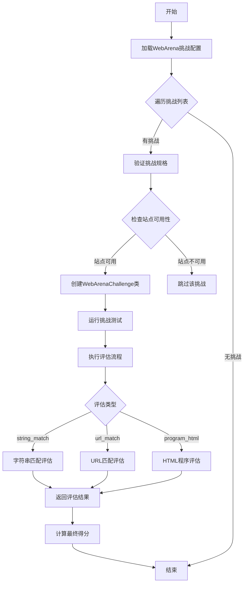
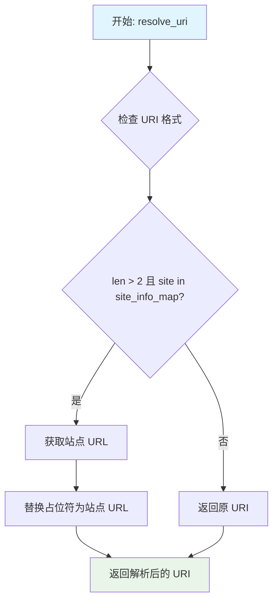
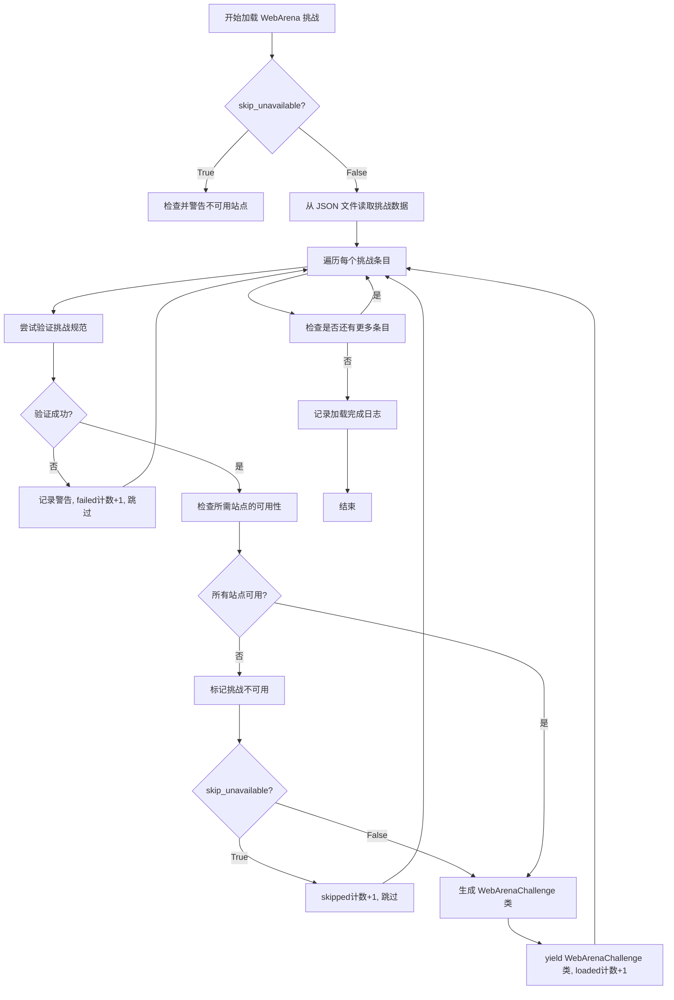
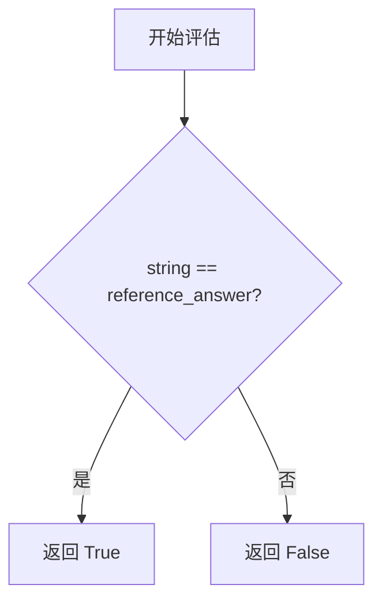
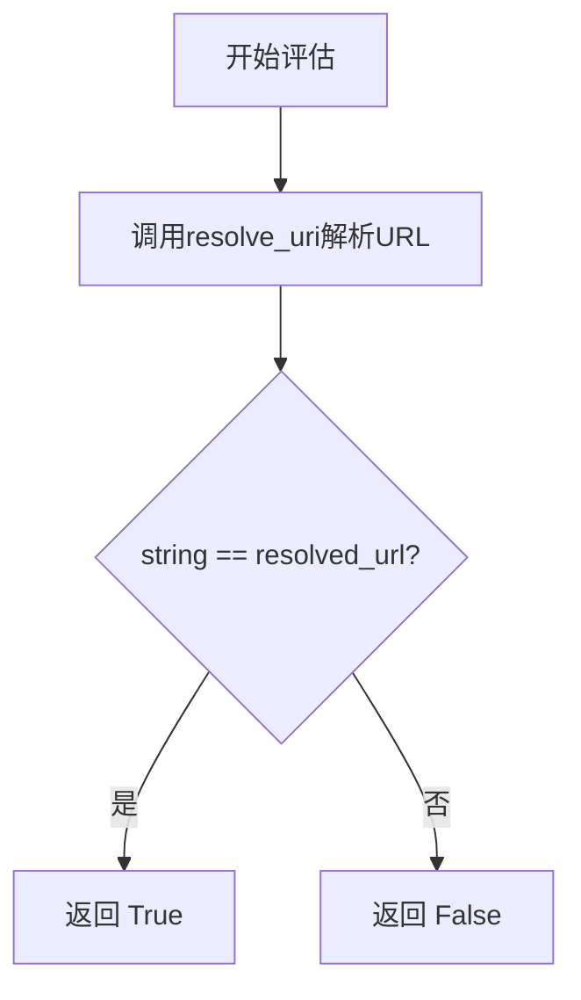
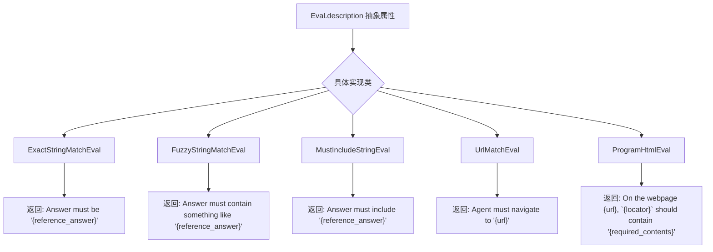
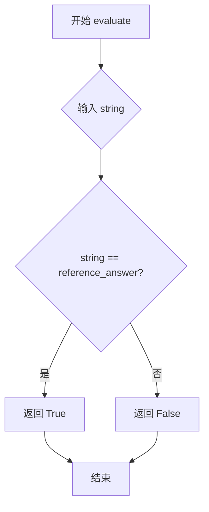
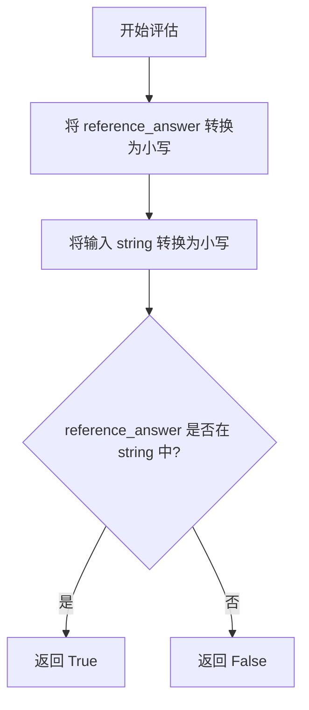
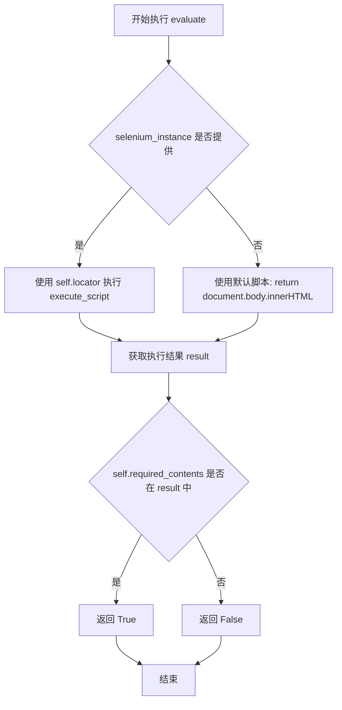

```mermaid
flowchart TD
    A[开始 evaluate] --> B[获取 self.reference_answer]
    B --> C[调用 lower&#40;&#41; 转为小写: reference_answer_lower]
    D[获取输入参数 string] --> E[调用 lower&#40;&#41; 转为小写: string_lower]
    C --> F{reference_answer_lower in string_lower?}
    E --> F
    F -->|True| G[返回 True]
    F -->|False| H[返回 False]
    G --> I[结束]
    H --> I
```

# `.\AutoGPT\classic\benchmark\agbenchmark\challenges\webarena.py` 详细设计文档

该代码实现了一个WebArena挑战框架，用于AI代理的基准测试。它定义了多种评估类型（字符串匹配、URL匹配、程序HTML检查），并提供了从远程API加载任务、运行挑战、评估代理答案的完整流程，支持WebArena的多个模拟网站环境。

## 整体流程



## 类结构

```
BaseModel (Pydantic)
├── WebArenaSiteInfo
├── BaseStringEval
│   ├── ExactStringMatchEval
│   ├── FuzzyStringMatchEval
│   └── MustIncludeStringEval
├── UrlMatchEval
├── ProgramHtmlEval
└── WebArenaChallengeSpec
    └── EvalSet
        └── StringMatchEvalSet
BaseChallenge (自定义基类)
└── WebArenaChallenge
```

## 全局变量及字段


### `logger`
    
日志记录器，用于记录模块运行信息

类型：`logging.Logger`
    


### `EvalType`
    
评估类型字面量类型，定义三种评估方式

类型：`Literal["string_match", "url_match", "program_html"]`
    


### `WebArenaSite`
    
网站站点字面量类型，定义WebArena支持的站点枚举

类型：`Literal["gitlab", "map", "reddit", "shopping", "shopping_admin", "wikipedia"]`
    


### `ReferenceAnswerType`
    
参考答案类型字面量，定义字符串匹配评估的三种模式

类型：`Literal["exact_match", "fuzzy_match", "must_include"]`
    


### `_git_user`
    
Git用户名，从环境变量获取用于登录GitLab

类型：`str`
    


### `_git_password`
    
Git密码，从环境变量获取用于登录GitLab

类型：`str`
    


### `site_info_map`
    
网站信息映射字典，存储各站点的URL和可用性状态

类型：`dict[WebArenaSite, WebArenaSiteInfo]`
    


### `_Eval`
    
联合评估类型，包含字符串、URL和HTML程序三种评估器

类型：`StringEval | UrlMatchEval | ProgramHtmlEval`
    


### `get_site_info`
    
获取指定站点的信息对象

类型：`Callable[[WebArenaSite], WebArenaSiteInfo]`
    


### `get_site_url`
    
获取指定站点的base_url

类型：`Callable[[WebArenaSite], str]`
    


### `resolve_uri`
    
解析URI，将模拟主机替换为实际JungleGym站点URL

类型：`Callable[[str], str]`
    


### `WebArenaSiteInfo.base_url`
    
网站基础URL

类型：`str`
    


### `WebArenaSiteInfo.available`
    
站点是否可用

类型：`bool`
    


### `WebArenaSiteInfo.additional_info`
    
额外登录信息

类型：`str`
    


### `WebArenaSiteInfo.unavailable_reason`
    
不可用原因

类型：`str`
    


### `ExactStringMatchEval.type`
    
评估类型为精确匹配

类型：`Literal["exact_match"]`
    


### `ExactStringMatchEval.reference_answer`
    
精确匹配的参考答案

类型：`str`
    


### `FuzzyStringMatchEval.type`
    
评估类型为模糊匹配

类型：`Literal["fuzzy_match"]`
    


### `FuzzyStringMatchEval.reference_answer`
    
模糊匹配的参考答案

类型：`str`
    


### `MustIncludeStringEval.type`
    
评估类型为必须包含

类型：`Literal["must_include"]`
    


### `MustIncludeStringEval.reference_answer`
    
必须包含的参考答案

类型：`str`
    


### `UrlMatchEval.url`
    
要匹配的URL

类型：`str`
    


### `ProgramHtmlEval.url`
    
网页URL

类型：`str`
    


### `ProgramHtmlEval.locator`
    
JavaScript定位器代码

类型：`str`
    


### `ProgramHtmlEval.required_contents`
    
必需包含的内容

类型：`str`
    


### `WebArenaChallengeSpec.task_id`
    
任务ID

类型：`int`
    


### `WebArenaChallengeSpec.sites`
    
完成任务所需的站点列表

类型：`list[WebArenaSite]`
    


### `WebArenaChallengeSpec.start_url`
    
起始完整URL

类型：`str`
    


### `WebArenaChallengeSpec.start_url_junglegym`
    
JungleGym站点起始URL

类型：`str`
    


### `WebArenaChallengeSpec.require_login`
    
是否需要登录

类型：`bool`
    


### `WebArenaChallengeSpec.require_reset`
    
是否需要重置

类型：`bool`
    


### `WebArenaChallengeSpec.storage_state`
    
存储状态

类型：`str | None`
    


### `WebArenaChallengeSpec.intent`
    
任务意图描述

类型：`str`
    


### `WebArenaChallengeSpec.intent_template`
    
意图模板

类型：`str`
    


### `WebArenaChallengeSpec.intent_template_id`
    
意图模板ID

类型：`int`
    


### `WebArenaChallengeSpec.instantiation_dict`
    
实例化字典

类型：`dict[str, str | list[str]]`
    


### `WebArenaChallengeSpec.available`
    
挑战是否可用

类型：`bool`
    


### `WebArenaChallengeSpec.unavailable_reason`
    
不可用原因

类型：`str`
    


### `WebArenaChallengeSpec.eval`
    
评估配置

类型：`EvalSet`
    


### `WebArenaChallengeSpec.EvalSet.reference_answers`
    
字符串匹配答案集

类型：`StringMatchEvalSet | None`
    


### `WebArenaChallengeSpec.EvalSet.reference_answer_raw_annotation`
    
原始标注答案

类型：`str | None`
    


### `WebArenaChallengeSpec.EvalSet.string_note`
    
字符串备注

类型：`str | None`
    


### `WebArenaChallengeSpec.EvalSet.annotation_note`
    
标注备注

类型：`str | None`
    


### `WebArenaChallengeSpec.EvalSet.reference_url`
    
参考URL

类型：`str | None`
    


### `WebArenaChallengeSpec.EvalSet.url_note`
    
URL备注

类型：`str | None`
    


### `WebArenaChallengeSpec.EvalSet.program_html`
    
HTML程序评估列表

类型：`list[ProgramHtmlEval]`
    


### `WebArenaChallengeSpec.EvalSet.eval_types`
    
评估类型列表

类型：`list[EvalType]`
    


### `WebArenaChallengeSpec.EvalSet.StringMatchEvalSet.exact_match`
    
精确匹配答案

类型：`str | None`
    


### `WebArenaChallengeSpec.EvalSet.StringMatchEvalSet.fuzzy_match`
    
模糊匹配答案列表

类型：`list[str] | None`
    


### `WebArenaChallengeSpec.EvalSet.StringMatchEvalSet.must_include`
    
必须包含答案列表

类型：`list[str] | None`
    


### `WebArenaChallenge._spec`
    
类变量存储挑战规格

类型：`ClassVar[WebArenaChallengeSpec]`
    


### `WebArenaChallenge.SOURCE_URI_PREFIX`
    
源URI前缀

类型：`str`
    


### `WebArenaChallenge.SOURCE_URI_TEMPLATE`
    
源URI模板

类型：`str`
    
    

## 全局函数及方法


### `get_site_info`

该函数用于根据站点标识符获取对应的 WebArena 站点信息，包括基础 URL、可用性状态、附加信息（如登录凭据）和不可用原因。如果站点标识符不在已知站点映射中，则抛出 ValueError 异常。

参数：

- `site`：`WebArenaSite`，要查询的 WebArena 站点标识符（可选值：gitlab, map, reddit, shopping, shopping_admin, wikipedia）

返回值：`WebArenaSiteInfo`，包含站点基础 URL、可用性标志、附加信息和不可用原因的 Pydantic 模型

#### 流程图

```mermaid
flowchart TD
    A[开始 get_site_info] --> B{site 是否在 site_info_map 中}
    B -- 是 --> C[返回 site_info_map[site]]
    B -- 否 --> D[抛出 ValueError 异常]
    D --> E[错误: JungleGym site '{site}' unknown, cannot resolve URL]
    C --> F[结束]
    E --> F
```

#### 带注释源码

```python
def get_site_info(site: WebArenaSite) -> WebArenaSiteInfo:
    """
    根据站点标识符获取对应的 WebArena 站点信息。
    
    参数:
        site: WebArenaSite 类型，站点标识符 (gitlab, map, reddit, shopping, shopping_admin, wikipedia)
    
    返回:
        WebArenaSiteInfo: 包含站点基础 URL、可用性状态、附加信息的对象
    
    异常:
        ValueError: 当站点标识符不在已知站点映射中时抛出
    """
    # 检查站点是否存在于预定义的站点信息映射中
    if site not in site_info_map:
        # 站点未知，抛出详细错误信息
        raise ValueError(f"JungleGym site '{site}' unknown, cannot resolve URL")
    
    # 从站点信息映射中返回对应的站点信息对象
    return site_info_map[site]
```


### `get_site_url`

获取指定WebArena站点的基本URL地址。该函数是WebArena站点配置管理的工具函数之一，通过调用`get_site_info`获取站点信息对象，并直接返回其`base_url`属性，为WebArena挑战任务提供站点URL解析能力。

参数：

- `site`：`WebArenaSite`，WebArena站点标识符，可选值为"gitlab"、"map"、"reddit"、"shopping"、"shopping_admin"或"wikipedia"

返回值：`str`，对应站点的基本URL字符串

#### 流程图

```mermaid
graph TD
    A[开始] --> B[调用 get_site_info(site)]
    B --> C{站点是否存在}
    C -->|是| D[返回 WebArenaSiteInfo 对象]
    C -->|否| E[抛出 ValueError 异常]
    D --> F[获取 base_url 属性]
    F --> G[返回 URL 字符串]
    E --> H[结束]
    
    style C fill:#f9f,stroke:#333
    style E fill:#f99,stroke:#333
```

#### 带注释源码

```python
def get_site_url(site: WebArenaSite) -> str:
    """
    获取指定WebArena站点的基本URL。
    
    参数:
        site: WebArenaSite类型，表示要获取URL的站点标识符
        
    返回:
        str类型，返回站点配置中定义的基本URL
    """
    # 调用get_site_info获取站点信息对象，然后返回其base_url属性
    # 该函数内部会验证站点是否存在于site_info_map中
    # 如果站点不存在，get_site_info会抛出ValueError异常
    return get_site_info(site).base_url
```

#### 相关组件信息

| 组件名称 | 一句话描述 |
|---------|-----------|
| `site_info_map` | 存储所有WebArena站点配置信息的字典，包含base_url、availability等 |
| `WebArenaSiteInfo` | Pydantic模型，定义单个站点的配置结构（base_url、available、additional_info等） |
| `get_site_info` | 底层函数，负责验证站点存在性并返回WebArenaSiteInfo对象 |

#### 技术债务与优化空间

1. **缺少缓存机制**：`get_site_url`每次调用都会访问`site_info_map`字典，虽然字典访问是O(1)操作，但在高并发场景下可以考虑添加缓存
2. **错误信息不够友好**：如果站点不存在，错误信息由`get_site_info`生成，可能不够具体
3. **重复代码**：`get_site_url`本质上是`get_site_info().base_url`的简写形式，可考虑合并或明确两者的使用场景


### `resolve_uri`

解析 URI 中的占位符（如 `__WIKI__`、`__GITLAB__` 等），将其替换为对应的 JungleGym 站点镜像 URL。如果 URI 中不包含有效占位符，则原样返回。

参数：

- `uri`：`str`，输入的 URI 字符串，可能包含站点占位符（如 `__WIKI__/wiki/Octopus`）

返回值：`str`，解析后的 URI，已将占位符替换为实际 URL 或保持原样

#### 流程图



#### 带注释源码

```python
def resolve_uri(uri: str) -> str:
    """
    Resolves URIs with mock hosts, like `__WIKI__/wiki/Octopus`, with the corresponding
    JungleGym site mirror host.
    
    该函数用于将包含模拟主机占位符的 URI 解析为实际的 JungleGym 站点 URL。
    支持的占位符格式为双下划线包裹的站点名称，如 __WIKI__、__GITLAB__ 等。
    
    示例:
        - 输入: "__WIKI__/wiki/Octopus" -> 输出: "http://wiki.junglegym.ai/wiki/Octopus"
        - 输入: "__SHOPPING__/products/1" -> 输出: "http://shop.junglegym.ai/products/1"
        - 输入: "https://example.com/page" -> 输出: "https://example.com/page" (无变化)
    """
    # 使用双下划线分割 URI，获取所有片段
    segments = uri.split("__")
    
    # 检查是否包含有效的站点占位符
    # 条件：至少有3个片段（即存在 __SITE__ 格式），且站点名称在 site_info_map 中
    if len(segments) > 2 and (site := segments[1]).lower() in site_info_map:
        # 替换占位符为对应的站点基础 URL
        # 例如: "__wiki__/wiki/Page" -> "http://wiki.junglegym.ai/wiki/Page"
        return uri.replace(f"__{site}__", get_site_url(site.lower()))  # type: ignore
    
    # 如果没有匹配的占位符，原样返回原始 URI
    return uri
```


### `load_webarena_challenges`

该函数是一个生成器函数，用于从本地 JSON 文件加载 WebArena 挑战数据，验证每个挑战的规范和依赖站点可用性，并按需过滤不可用的挑战，最终逐个产出可用的 `WebArenaChallenge` 类类型。

参数：

- `skip_unavailable`：`bool`，控制是否跳过不可用的站点和挑战，默认为 `True`（跳过）

返回值：`Iterator[type[WebArenaChallenge]]`，返回一个迭代器，每次迭代产出一个经验证可用的 `WebArenaChallenge` 类类型

#### 流程图



#### 带注释源码

```python
def load_webarena_challenges(
    skip_unavailable: bool = True,
) -> Iterator[type[WebArenaChallenge]]:
    """
    加载 WebArena 挑战的生成器函数。
    
    从本地的 JSON 配置文件读取挑战数据，验证每个挑战的规范，
    检查所需站点的可用性，并按需过滤不可用的挑战。
    
    参数:
        skip_unavailable: 是否跳过不可用的站点和挑战，默认为 True
        
    返回:
        迭代器，每次产出经验证可用的 WebArenaChallenge 类类型
    """
    logger.info("Loading WebArena challenges...")

    # 首先遍历站点信息，警告不可用的站点
    for site, info in site_info_map.items():
        if not info.available and skip_unavailable:
            logger.warning(
                f"JungleGym site '{site}' is not available: {info.unavailable_reason} "
                "Skipping all challenges which use this site."
            )

    # 从本地 JSON 文件读取挑战数据
    # 注：完整数据集 API 目前未启用，使用手选数据集作为替代
    import json
    from pathlib import Path

    challenge_dicts = json.loads(
        (Path(__file__).parent / "webarena_selection.json").read_bytes()
    )

    logger.debug(
        "Fetched WebArena dataset. "
        f"Constructing {len(challenge_dicts)} WebArenaChallenges..."
    )
    
    # 初始化计数器
    loaded = 0    # 成功加载的挑战数
    failed = 0    # 验证失败的挑战数
    skipped = 0   # 跳过的挑战数
    
    # 遍历每个挑战条目进行验证和处理
    for entry in challenge_dicts:
        try:
            # 尝试使用 Pydantic 验证挑战规范
            challenge_spec = WebArenaChallengeSpec.model_validate(entry)
        except ValidationError as e:
            # 验证失败时记录错误并跳过
            failed += 1
            logger.warning(f"Error validating WebArena challenge entry: {entry}")
            logger.warning(f"Error details: {e}")
            continue

        # 检查所有所需站点的可用性
        for site in challenge_spec.sites:
            site_info = site_info_map.get(site)
            if site_info is None:
                # 站点未知
                challenge_spec.available = False
                challenge_spec.unavailable_reason = (
                    f"WebArena task {challenge_spec.task_id} requires unknown site "
                    f"'{site}'"
                )
            elif not site_info.available:
                # 站点不可用
                challenge_spec.available = False
                challenge_spec.unavailable_reason = (
                    f"WebArena task {challenge_spec.task_id} requires unavailable "
                    f"site '{site}'"
                )

        # 如果挑战不可用且设置了跳过不可用挑战，则跳过
        if not challenge_spec.available and skip_unavailable:
            logger.debug(f"{challenge_spec.unavailable_reason}; skipping...")
            skipped += 1
            continue

        # 生成 WebArenaChallenge 类并 yield
        yield WebArenaChallenge.from_challenge_spec(challenge_spec)
        loaded += 1

    # 记录加载完成汇总信息
    logger.info(
        "Loading WebArena challenges complete: "
        f"loaded {loaded}, skipped {skipped}."
        + (f" {failed} challenges failed to load." if failed else "")
    )
```


### `ExactStringMatchEval.evaluate`

精确字符串匹配评估方法，用于检查输入字符串是否与参考答案完全一致。

参数：

-  `string`：`str`，待评估的字符串

返回值：`bool`，如果输入字符串与参考答案完全匹配返回 `True`，否则返回 `False`

#### 流程图



#### 带注释源码

```python
def evaluate(self, string: str) -> bool:
    """
    评估输入字符串是否与参考答案完全匹配。
    
    参数:
        string: 待评估的字符串
        
    返回:
        bool: 完全匹配返回True，否则返回False
    """
    return string == self.reference_answer
```

---

### `FuzzyStringMatchEval.evaluate`

模糊字符串匹配评估方法，用于检查输入字符串是否包含参考答案（不区分大小写）。

参数：

-  `string`：`str`，待评估的字符串

返回值：`bool`，如果参考答案（不区分大小写）出现在输入字符串中返回 `True`，否则返回 `False`

#### 流程图

```mermaid
flowchart TD
    A[开始评估] --> B[将string和reference_answer转为小写]
    B --> C{reference_answer.lower() in string.lower()?}
    C -->|是| D[返回 True]
    C -->|否| E[返回 False]
```

#### 带注释源码

```python
def evaluate(self, string: str) -> bool:
    """
    评估输入字符串是否包含参考答案（模糊匹配，忽略大小写）。
    
    参数:
        string: 待评估的字符串
        
    返回:
        bool: 如果参考答案出现在输入中返回True，否则返回False
        
    注意:
        TODO: 未来可能使用LLM进行更灵活/鲁棒的匹配
    """
    # 将两个字符串都转为小写进行不区分大小写的匹配
    return self.reference_answer.lower() in string.lower()
```

---

### `MustIncludeStringEval.evaluate`

必须包含评估方法，用于检查输入字符串是否必须包含参考答案（不区分大小写）。

参数：

-  `string`：`str`，待评估的字符串

返回值：`bool`，如果参考答案（不区分大小写）出现在输入字符串中返回 `True`，否则返回 `False`

#### 流程图

```mermaid
flowchart TD
    A[开始评估] --> B[将string和reference_answer转为小写]
    B --> C{reference_answer.lower() in string.lower()?}
    C -->|是| D[返回 True]
    C -->|否| E[返回 False]
```

#### 带注释源码

```python
def evaluate(self, string: str) -> bool:
    """
    评估输入字符串是否包含参考答案（必须包含，忽略大小写）。
    
    参数:
        string: 待评估的字符串
        
    返回:
        bool: 如果参考答案出现在输入中返回True，否则返回False
    """
    # 将两个字符串都转为小写进行不区分大小写的匹配
    return self.reference_answer.lower() in string.lower()
```

---

### `UrlMatchEval.evaluate`

URL匹配评估方法，用于检查输入字符串是否与解析后的URL完全匹配。

参数：

-  `string`：`str`，待评估的字符串（通常是URL）

返回值：`bool`，如果输入字符串与解析后的URL完全匹配返回 `True`，否则返回 `False`

#### 流程图



#### 带注释源码

```python
def evaluate(self, string: str) -> bool:
    """
    评估输入字符串是否与URL匹配。
    
    参数:
        string: 待评估的字符串（通常是URL）
        
    返回:
        bool: 如果输入与解析后的URL匹配返回True，否则返回False
        
    说明:
        使用resolve_uri将URL中的占位符（如__WIKI__）替换为实际的JungleGym站点URL
    """
    return string == resolve_uri(self.url)
```


### `Eval.description`

描述评估规则的抽象属性，返回一个字符串描述，用于向代理说明评估的具体标准。

参数：

- 无参数（属性）

返回值：`str`，返回描述评估规则的字符串，例如 `"Answer must be '...'"` 或 `"Agent must navigate to '...'"`

#### 流程图



#### 带注释源码

```python
class Eval(ABC):
    """评估抽象基类，定义评估接口"""
    
    @abstractmethod
    def evaluate(self, string: str) -> bool:
        """评估给定字符串是否满足条件"""
        ...

    @property
    @abstractmethod
    def description(self) -> str:
        """返回评估规则的描述字符串，用于向代理说明评估标准"""
        ...


class ExactStringMatchEval(BaseStringEval):
    """精确字符串匹配评估"""
    type: Literal["exact_match"] = "exact_match"
    reference_answer: str  # 标准答案

    @property
    def description(self) -> str:
        # 返回格式化的描述字符串，说明答案必须完全匹配
        return f"Answer must be '{self.reference_answer}'"


class FuzzyStringMatchEval(BaseStringEval):
    """模糊字符串匹配评估"""
    type: Literal["fuzzy_match"] = "fuzzy_match"
    reference_answer: str  # 参考答案

    @property
    def description(self) -> str:
        # 返回描述，说明答案应包含类似的内容（不区分大小写）
        return f"Answer must contain something like '{self.reference_answer}'"


class MustIncludeStringEval(BaseStringEval):
    """必须包含字符串的评估"""
    type: Literal["must_include"] = "must_include"
    reference_answer: str  # 必须包含的内容

    @property
    def description(self) -> str:
        # 返回描述，说明答案必须包含指定内容
        return f"Answer must include '{self.reference_answer}'"


class UrlMatchEval(BaseModel, Eval):
    """URL匹配评估"""
    url: str  # 目标URL，例如 "__WIKI__/wiki/Octopus"

    @property
    def description(self) -> str:
        # 返回描述，说明代理必须导航到指定URL
        return f"Agent must navigate to '{self.url}'"

    def evaluate(self, string: str) -> bool:
        # 解析URI并与给定字符串比较
        return string == resolve_uri(self.url)


class ProgramHtmlEval(BaseModel):
    """HTML程序评估"""
    url: str  # 网页URL
    locator: str  # JavaScript代码，用于获取要检查的值
    required_contents: str  # 必须包含的内容

    @property
    def description(self) -> str:
        # 返回描述，说明在指定网页的特定位置应包含什么内容
        return (
            f"On the webpage {self.url}, "
            f"`{self.locator}` should contain '{self.required_contents}'"
        )

    def evaluate(self, selenium_instance) -> bool:
        # 使用Selenium执行JavaScript获取页面内容
        result = selenium_instance.execute_script(
            self.locator or "return document.body.innerHTML;"
        )
        return self.required_contents in result
```


### `ExactStringMatchEval.description`

这是一个属性方法，返回对答案的精确匹配要求描述。它会根据 `reference_answer` 字段的值，生成描述答案必须完全匹配指定内容的字符串。

参数：无（这是一个属性方法，仅包含隐式的 `self` 参数）

返回值：`str`，返回描述答案必须精确匹配的具体要求，例如 "Answer must be 'xxx'"

#### 流程图

```mermaid
flowchart TD
    A[开始] --> B[获取 self.reference_answer 的值]
    B --> C{构造描述字符串}
    C --> D[返回: "Answer must be '{reference_answer}'"]
    D --> E[结束]
```

#### 带注释源码

```python
@property
def description(self) -> str:
    """
    属性方法：返回精确匹配的描述
    
    返回值类型: str
    返回值描述: 返回描述答案必须完全匹配的具体要求，例如 "Answer must be 'xxx'"
    
    实现逻辑:
    1. 访问实例的 reference_answer 属性（由 Pydantic 模型验证的必填字段）
    2. 使用 f-string 构造描述字符串，将参考答案嵌入到描述模板中
    3. 返回格式如 "Answer must be 'xxx'" 的字符串，供评估结果展示使用
    """
    return f"Answer must be '{self.reference_answer}'"
```


### `ExactStringMatchEval.evaluate`

精确匹配评估方法，用于检查给定的字符串是否与参考答案完全一致。

参数：

- `string`：`str`，需要与参考答案进行精确匹配对比的字符串

返回值：`bool`，如果 `string` 与 `reference_answer` 完全相等则返回 `True`，否则返回 `False`

#### 流程图



#### 带注释源码

```python
class ExactStringMatchEval(BaseStringEval):
    """精确字符串匹配评估器"""
    
    type: Literal["exact_match"] = "exact_match"
    """评估类型标识，固定为 'exact_match'"""
    
    reference_answer: str
    """用于比对的参考答案字符串"""
    
    @property
    def description(self) -> str:
        """返回评估规则的描述信息"""
        return f"Answer must be '{self.reference_answer}'"
    
    def evaluate(self, string: str) -> bool:
        """
        执行精确匹配评估
        
        参数:
            string: 需要与参考答案进行精确匹配检查的字符串
            
        返回:
            bool: 如果输入字符串与参考答案完全一致返回 True，否则返回 False
        """
        return string == self.reference_answer
```


### `FuzzyStringMatchEval.description`

该属性返回模糊匹配的描述字符串，用于向用户说明答案需要包含类似参考内容的模糊匹配规则。

参数：无（该方法为属性，只接收隐式参数 `self`）

- `self`：`FuzzyStringMatchEval` 实例，模糊字符串匹配评估器实例本身，包含 `reference_answer` 等属性

返回值：`str`，返回一个描述性字符串，格式为 `"Answer must contain something like '{reference_answer}'"`，其中 `{reference_answer}` 是评估器配置的参考答案

#### 流程图

```mermaid
flowchart TD
    A[获取 FuzzyStringMatchEval.description 属性] --> B{访问 self.reference_answer}
    B --> C[拼接字符串: 'Answer must contain something like ''{reference_answer}''']
    C --> D[返回描述字符串]
    
    style A fill:#e1f5fe
    style D fill:#e8f5e8
```

#### 带注释源码

```python
class FuzzyStringMatchEval(BaseStringEval):
    """
    模糊字符串匹配评估器
    
    该类继承自 BaseStringEval，用于执行模糊匹配评估。
    模糊匹配采用子字符串包含检查（不区分大小写），
    即只要输入字符串中包含参考答案（忽略大小写），即视为通过。
    """
    
    type: Literal["fuzzy_match"] = "fuzzy_match"
    """评估器类型，固定为 'fuzzy_match'"""
    
    reference_answer: str
    """用于模糊匹配的参考答案字符串"""

    @property
    def description(self) -> str:
        """
        获取模糊匹配规则的描述信息
        
        该属性返回一个描述性字符串，用于向用户说明
        当前评估器要求的匹配规则是模糊匹配（包含即可）。
        
        Returns:
            str: 格式化的描述字符串，例如：
                 "Answer must contain something like 'Octopus'"
        """
        return f"Answer must contain something like '{self.reference_answer}'"

    def evaluate(self, string: str) -> bool:
        """
        执行模糊匹配评估
        
        对输入字符串进行模糊匹配检查，判断其是否包含参考答案
        （不区分大小写）。
        
        Args:
            string: 待评估的输入字符串
            
        Returns:
            bool: 如果输入字符串包含参考答案（忽略大小写），返回 True；
                 否则返回 False
        """
        # TODO: use LLM for matching (or something else that's flexible/robust)
        # 当前实现仅为简单的子字符串包含检查，
        # 未来可能需要使用 LLM 或其他更灵活的匹配方式
        return self.reference_answer.lower() in string.lower()
```


### `FuzzyStringMatchEval.evaluate`

模糊匹配评估方法，检查给定的字符串是否包含参考答案（不区分大小写），适用于评估代理输出是否包含预期关键词或短语。

参数：

- `string`：`str`，需要评估的输入字符串，通常是代理的输出结果

返回值：`bool`，如果参考答案（转换为小写）在输入字符串（转换为小写）中找到则返回 `True`，否则返回 `False`

#### 流程图



#### 带注释源码

```python
def evaluate(self, string: str) -> bool:
    """
    评估输入字符串是否包含参考答案（模糊匹配）
    
    参数:
        string: str, 需要评估的输入字符串
        
    返回:
        bool: 如果参考答案出现在输入字符串中则返回 True，否则返回 False
    """
    # TODO: use LLM for matching (or something else that's flexible/robust)
    # 提示：未来可能需要使用 LLM 来实现更灵活/健壮的匹配方式
    return self.reference_answer.lower() in string.lower()
    # 将参考答案和输入字符串都转换为小写进行不区分大小写的比较
```


### `MustIncludeStringEval.description`

返回必须包含描述，指示答案必须包含参考内容。

参数：无（这是一个 `@property` 装饰器方法）

返回值：`str`，返回描述字符串，格式为 `Answer must include '{reference_answer}'`

#### 流程图

```mermaid
flowchart TD
    A[开始] --> B{获取 description 属性}
    B --> C[读取 self.reference_answer]
    C --> D[格式化字符串: f"Answer must include '{self.reference_answer}'"]
    D --> E[返回描述字符串]
```

#### 带注释源码

```python
class MustIncludeStringEval(BaseStringEval):
    """用于评估答案是否必须包含特定内容的评估类"""
    
    type: Literal["must_include"] = "must_include"
    """评估类型，固定为 'must_include'"""
    
    reference_answer: str
    """必须在答案中包含的参考字符串"""

    @property
    def description(self) -> str:
        """
        获取评估描述。
        
        返回一个描述性字符串，说明答案必须包含参考内容。
        用于向用户展示评估标准的文字说明。
        
        Returns:
            str: 格式化的描述字符串，例如 "Answer must include 'xxx'"
        """
        return f"Answer must include '{self.reference_answer}'"

    def evaluate(self, string: str) -> bool:
        """
        评估给定字符串是否包含参考答案。
        
        使用不区分大小写的子字符串匹配。
        
        Args:
            string: 待评估的字符串
            
        Returns:
            bool: 如果参考答案（不区分大小写）存在于给定字符串中，返回 True；否则返回 False
        """
        return self.reference_answer.lower() in string.lower()
```


### `MustIncludeStringEval.evaluate`

该方法用于评估给定的字符串是否包含参考答案（不区分大小写），常用于 WebArena 挑战中检查代理的输出是否包含预期的关键信息。

参数：

- `string`：`str`，需要进行检查的输入字符串

返回值：`bool`，如果输入字符串（不区分大小写）包含参考答案（不区分大小写），则返回 `True`，否则返回 `False`

#### 流程图



#### 带注释源码

```python
class MustIncludeStringEval(BaseStringEval):
    """字符串包含评估器 - 检查答案是否包含参考内容"""
    
    type: Literal["must_include"] = "must_include"
    """评估类型标识"""
    
    reference_answer: str
    """期望包含在答案中的参考字符串"""

    @property
    def description(self) -> str:
        """返回评估规则的描述信息"""
        return f"Answer must include '{self.reference_answer}'"

    def evaluate(self, string: str) -> bool:
        """
        评估输入字符串是否包含参考答案（不区分大小写）
        
        参数:
            string: 需要检查的输入字符串
            
        返回:
            如果参考答案出现在输入字符串中（忽略大小写），返回 True；否则返回 False
        """
        # 将参考答案和输入字符串都转换为小写进行不区分大小写的比较
        return self.reference_answer.lower() in string.lower()
```


### `UrlMatchEval.description`

返回URL导航描述，用于告知Agent需要导航到的目标URL。

参数：

- `self`：`UrlMatchEval`，类的实例本身，包含url属性

返回值：`str`，返回格式为"Agent must navigate to '{url}'"的描述字符串

#### 流程图

```mermaid
flowchart TD
    A[Start] --> B[获取self.url属性值]
    B --> C[构建描述字符串: Agent must navigate to '{url}']
    C --> D[返回描述字符串]
```

#### 带注释源码

```python
class UrlMatchEval(BaseModel, Eval):
    url: str
    """Example: `"__WIKI__/wiki/Octopus"`"""

    @property
    def description(self) -> str:
        # 返回格式化的字符串，告知Agent需要导航到的目标URL
        return f"Agent must navigate to '{self.url}'"

    def evaluate(self, string: str) -> bool:
        # 使用resolve_uri将URL中的占位符（如__WIKI__）解析为实际的JungleGym站点URL
        return string == resolve_uri(self.url)
```

#### 说明

该属性方法是`UrlMatchEval`类的一部分，`UrlMatchEval`是用于评估Agent是否成功导航到指定URL的评估器类。该类的`description`属性返回一个描述性字符串，用于说明Agent需要导航到的目标URL位置。在WebArena挑战中，这个描述会展示给用户或Agent，明确导航目标。`url`属性支持特殊的URI格式（如`__WIKI__/wiki/Octopus`），这些URI会在评估时通过`resolve_uri`函数解析为实际的JungleGym站点URL。


### `UrlMatchEval.evaluate`

该方法用于评估代理是否成功导航到目标URL。它接收一个字符串参数（通常为代理实际访问的URL），将其与通过`resolve_uri`解析后的预期URL进行比较，返回布尔值表示匹配结果。

参数：

- `string`：`str`，待评估的字符串，通常为代理实际到达的URL

返回值：`bool`，如果输入字符串与解析后的目标URL完全匹配则返回`True`，否则返回`False`

#### 流程图

```mermaid
flowchart TD
    A([开始 evaluate]) --> B[输入 string: str]
    B --> C{调用 resolve_uri}
    C --> D[解析 self.url 中的占位符<br/>如 __WIKI__ 转换为实际URL]
    D --> E[比较 string == resolve_uri(self.url)]
    E --> F{匹配结果}
    F -->|True| G[返回 True]
    F -->|False| H[返回 False]
    G --> I([结束])
    H --> I
```

#### 带注释源码

```python
class UrlMatchEval(BaseModel, Eval):
    """URL匹配评估器，用于验证代理是否导航到正确的URL"""
    
    url: str
    """目标URL，支持JungleGym URI格式，如 "__WIKI__/wiki/Octopus" """

    @property
    def description(self) -> str:
        """返回评估规则的描述信息"""
        return f"Agent must navigate to '{self.url}'"

    def evaluate(self, string: str) -> bool:
        """
        评估输入字符串是否与解析后的目标URL匹配
        
        参数:
            string: 待匹配的字符串，通常为代理实际访问的URL
            
        返回:
            bool: 匹配返回True，否则返回False
        """
        # 调用resolve_uri将self.url中的占位符（如__WIKI__）解析为实际URL
        # 然后与输入的string进行精确比较
        return string == resolve_uri(self.url)
```


### `ProgramHtmlEval.description`

返回HTML检查描述，描述在指定网页上使用特定定位器应包含的内容。

参数： 无（这是一个 `@property` 装饰器修饰的属性访问器，不需要显式参数）

返回值： `str`，返回格式为 `"On the webpage {url}, \`{locator}\` should contain '{required_contents}'"` 的描述字符串，用于说明评估检查的具体内容。

#### 流程图

```mermaid
flowchart TD
    A[访问 ProgramHtmlEval.description 属性] --> B{获取属性值}
    B --> C[格式化字符串: f'On the webpage {self.url}']
    C --> D[追加定位器信息: f', `{self.locator}` should contain']
    D --> E[追加必需内容: f' \'{self.required_contents}\'']
    E --> F[返回完整描述字符串]
```

#### 带注释源码

```python
class ProgramHtmlEval(BaseModel):
    """
    ProgramHtmlEval: 用于通过JavaScript代码检查网页状态的评估类
    
    此类继承自BaseModel，使用Pydantic进行数据验证
    用于WebArena挑战中检查网页的HTML内容是否符合预期
    """
    
    url: str  # 目标网页的URL
    locator: str  # JavaScript代码，用于定位和返回要检查的值
    """JavaScript code that returns the value to check"""
    required_contents: str  # 必须包含的内容字符串

    @property
    def description(self) -> str:
        """
        description属性: 返回HTML检查的描述信息
        
        该属性是一个只读的property，用于生成对评估检查的人类可读描述
        格式: "On the webpage {url}, `{locator}` should contain '{required_contents}'"
        
        返回:
            str: 格式化的描述字符串，说明在哪个URL上使用什么定位器检查什么内容
        """
        return (
            f"On the webpage {self.url}, "  # 目标网页URL
            f"`{self.locator}` should contain '{self.required_contents}'"  # 定位器和必需内容
        )

    def evaluate(self, selenium_instance) -> bool:
        """
        evaluate方法: 执行实际的HTML内容检查
        
        参数:
            selenium_instance: Selenium WebDriver实例，用于执行JavaScript代码
            
        返回:
            bool: 如果required_contents出现在执行结果中返回True，否则返回False
        """
        # 执行JavaScript代码获取页面内容
        # 如果locator为空，则默认返回整个body的innerHTML
        result = selenium_instance.execute_script(
            self.locator or "return document.body.innerHTML;"
        )
        # 检查必需内容是否存在于结果中
        return self.required_contents in result
```


### `ProgramHtmlEval.evaluate`

该方法接收一个 Selenium 实例，执行指定的 JavaScript 代码并检查结果是否包含所需内容，返回布尔值表示验证是否通过。

参数：

- `selenium_instance`：未显式标注类型（推断为 Selenium WebDriver 实例），Selenium 实例，用于执行 JavaScript 代码

返回值：`bool`，返回 True 表示页面内容包含所需内容，False 表示不包含

#### 流程图



#### 带注释源码

```python
def evaluate(self, selenium_instance) -> bool:
    """
    执行 JavaScript 并检查页面内容是否包含所需内容
    
    参数:
        selenium_instance: Selenium WebDriver 实例，用于在网页上执行 JavaScript
        
    返回:
        bool: 如果执行结果包含 required_contents 返回 True，否则返回 False
    """
    # 使用 Selenium 实例执行 JavaScript 代码
    # 如果 self.locator 存在则使用它，否则默认获取整个 body 的 innerHTML
    result = selenium_instance.execute_script(
        self.locator or "return document.body.innerHTML;"
    )
    # 检查执行结果中是否包含所需的內容
    return self.required_contents in result
```


### `WebArenaChallengeSpec.assignment_for_agent`

该属性方法用于生成代理任务分配字符串，包含起始URL、任务意图以及导航约束（如允许访问的站点和登录信息）。

参数：无（该方法为属性方法，无需参数）

返回值：`str`，返回分配给代理的完整任务指令字符串，包含起始URL、任务意图以及导航约束信息

#### 流程图

```mermaid
flowchart TD
    A[开始] --> B[获取站点信息]
    B --> C{检查站点是否有额外信息}
    C -->|是| D[格式化站点的额外信息<br/>如登录凭据]
    C -->|否| E[跳过]
    D --> F[构建导航约束字符串<br/>包含允许访问的URL列表和额外信息]
    E --> F
    F --> G[拼接任务字符串<br/>格式: 'First of all, go to {start_url}. {intent}. {nav_constraint}']
    G --> H[返回任务分配字符串]
```

#### 带注释源码

```python
@property
def assignment_for_agent(self) -> str:
    """
    生成代理任务分配字符串。
    
    该属性方法会根据挑战规范中的站点信息、起始URL和任务意图，
    生成一个完整的任务指令字符串，用于分配给代理执行。
    
    返回的字符串包含三部分：
    1. 起始URL
    2. 任务意图描述
    3. 导航约束（允许访问的站点及登录凭据等）
    
    Returns:
        str: 格式化的任务分配字符串
    """
    # Step 1: 获取所有需要站点的站点信息对象
    sites = [get_site_info(s) for s in self.sites]
    
    # Step 2: 构建导航约束字符串
    # 首先添加允许访问的URL列表
    nav_constraint = (
        "You are ONLY allowed to access URLs in "
        f"{' and '.join(s.base_url for s in sites)}.\n\n"  # 连接所有站点的base_url
        + "\n".join(
            s.additional_info.format(url=s.base_url)  # 格式化每个站点的额外信息（如登录凭据）
            for s in sites
            if s.additional_info  # 只包含有额外信息的站点
        )
    ).strip()  # 去除首尾空白

    # Step 3: 拼接完整的任务分配字符串
    return (
        f"First of all, go to {self.start_url}. "  # 起始URL指令
        f"{self.intent.rstrip('.')}.\n"             # 任务意图（去除末尾句号后加句号）
        f"{nav_constraint}"                         # 导航约束
    )
```


### `WebArenaChallengeSpec.EvalSet.check_eval_parameters`

验证评估参数完整性，确保 `eval_types` 中指定的每种评估类型都有对应的评估数据。

参数：

- `cls`：类型 `type[EvalSet]`，Pydantic 验证器的类对象
- `value`：类型 `list[EvalType]`，待验证的评估类型列表，即 `["string_match", "url_match", "program_html"]` 的子集
- `info`：类型 `ValidationInfo`，Pydantic 验证上下文，包含当前模型的完整数据 `info.data`

返回值：`list[EvalType]`，验证通过后返回原始的评估类型列表

#### 流程图

```mermaid
flowchart TD
    A[开始验证 eval_types] --> B{value 中是否包含 'string_match'?}
    B -->|是| C{info.data['reference_answers'] 存在?}
    B -->|否| D{value 中是否包含 'url_match'?}
    C -->|否| E[抛出 ValueError: 'string_match' eval_type requires reference_answers]
    C -->|是| D
    D -->|是| F{info.data['reference_url'] 存在?}
    D -->|否| G{value 中是否包含 'program_html'?}
    F -->|否| H[抛出 ValueError: 'url_match' eval_type requires reference_url]
    F -->|是| G
    G -->|是| I{info.data['program_html'] 非空?}
    G -->|否| J[返回 value]
    I -->|否| K[抛出 ValueError: 'program_html' eval_type requires at least one program_html eval]
    I -->|是| J
    E --> L[验证失败]
    H --> L
    K --> L
    J --> M[验证通过，返回 value]
```

#### 带注释源码

```python
@field_validator("eval_types")
def check_eval_parameters(cls, value: list[EvalType], info: ValidationInfo):
    """
    验证评估参数完整性的字段验证器。
    
    确保当 eval_types 指定某种评估类型时，相应的评估数据必须存在：
    - string_match 需要 reference_answers
    - url_match 需要 reference_url
    - program_html 需要 program_html 列表非空
    """
    # 检查 string_match 评估类型是否指定了对应的答案数据
    if "string_match" in value and not info.data["reference_answers"]:
        raise ValueError("'string_match' eval_type requires reference_answers")
    
    # 检查 url_match 评估类型是否指定了对应的 URL 数据
    if "url_match" in value and not info.data["reference_url"]:
        raise ValueError("'url_match' eval_type requires reference_url")
    
    # 检查 program_html 评估类型是否指定了对应的 HTML 验证数据
    if "program_html" in value and not info.data["program_html"]:
        raise ValueError(
            "'program_html' eval_type requires at least one program_html eval"
        )
    
    # 验证通过，返回原始的评估类型列表
    return value
```


### `WebArenaChallengeSpec.EvalSet.evaluators`

获取评估器列表，根据评估配置（字符串匹配、URL 匹配、程序 HTML）动态构造相应的评估器对象集合，用于后续对智能体答案进行多维度评判。

参数：

- `self`：`EvalSet`，隐式参数，当前评估器配置实例

返回值：`list[_Eval]`，返回构造完成的评估器列表，其中每个评估器实现了 `Eval` 接口，可对智能体输出进行特定类型的验证

#### 流程图

```mermaid
flowchart TD
    A[开始] --> B{self.reference_answers 是否存在}
    B -->|是| C{是否有 exact_match}
    B -->|否| F{是否有 reference_url}
    C -->|是| D[创建 ExactStringMatchEval]
    C -->|否| E{是否有 fuzzy_match}
    D --> E
    E -->|是| G[为每个 fuzzy_match 创建 FuzzyStringMatchEval]
    E -->|否| H{是否有 must_include}
    G --> H
    H -->|是| I[为每个 must_include 创建 MustIncludeStringEval]
    H -->|否| J{是否有 reference_url}
    I --> J
    J -->|是| K[创建 UrlMatchEval]
    J -->|否| L{是否有 program_html}
    K --> L
    L -->|是| M[添加所有 program_html 评估器]
    L -->|否| N[返回评估器列表]
    M --> N
    F --> L
```

#### 带注释源码

```python
@property
def evaluators(self) -> list[_Eval]:
    """
    根据评估配置动态构造评估器列表
    """
    # 初始化空的评估器列表
    evaluators: list[_Eval] = []
    
    # 如果配置了字符串匹配的参考答案
    if self.reference_answers:
        # 处理精确匹配评估器
        if self.reference_answers.exact_match:
            evaluators.append(
                ExactStringMatchEval(
                    reference_answer=self.reference_answers.exact_match
                )
            )
        # 处理模糊匹配评估器（可能有多个）
        if self.reference_answers.fuzzy_match:
            evaluators.extend(
                FuzzyStringMatchEval(reference_answer=a)
                for a in self.reference_answers.fuzzy_match
            )
        # 处理必须包含的评估器（可能有多个）
        if self.reference_answers.must_include:
            evaluators.extend(
                MustIncludeStringEval(reference_answer=a)
                for a in self.reference_answers.must_include
            )
    
    # 处理 URL 匹配评估器
    if self.reference_url:
        evaluators.append(UrlMatchEval(url=self.reference_url))
    
    # 处理程序 HTML 评估器（可能有多个）
    evaluators.extend(self.program_html)
    
    return evaluators
```


### `WebArenaChallenge.from_source_uri`

该方法是一个类方法，用于从给定的源 URI 创建一个 WebArenaChallenge 类型。方法首先验证 URI 前缀，然后通过 HTTP 请求从 JungleGym API 获取任务数据，最后使用 `from_challenge_spec` 方法将获取到的规范转换为具体的挑战类。

参数：

- `source_uri`：`str`，源 URI，格式为 `__JUNGLEGYM__/webarena/tasks/{task_id}`，例如 `__JUNGLEGYM__/webarena/tasks/123`

返回值：`type["WebArenaChallenge"]`，返回一个动态创建的 WebArenaChallenge 子类类型

#### 流程图

```mermaid
flowchart TD
    A[开始] --> B{检查 source_uri 是否以 SOURCE_URI_PREFIX 开头}
    B -->|是| C[替换 URI 前缀为 API URL]
    B -->|否| D[抛出 ValueError 异常]
    D --> Z[结束]
    C --> E[发起 HTTP GET 请求]
    E --> F{获取 JSON 数据}
    F --> G{results 是否为空}
    G -->|是| H[抛出 ValueError 异常]
    G -->|否| I[使用 model_validate 验证结果]
    H --> Z
    I --> J[调用 from_challenge_spec 创建挑战类]
    J --> K[返回 WebArenaChallenge 类型]
    K --> Z
```

#### 带注释源码

```python
@classmethod
def from_source_uri(cls, source_uri: str) -> type["WebArenaChallenge"]:
    """
    从源 URI 创建 WebArenaChallenge 类型
    
    参数:
        source_uri: 格式为 __JUNGLEGYM__/webarena/tasks/{task_id} 的 URI
    
    返回:
        一个动态创建的 WebArenaChallenge 子类类型
    """
    # 检查 URI 前缀是否有效
    if not source_uri.startswith(cls.SOURCE_URI_PREFIX):
        raise ValueError(f"Invalid source_uri for WebArenaChallenge: {source_uri}")

    # 将源 URI 转换为 JungleGym API URL
    # 例如: __JUNGLEGYM__/webarena/tasks/123
    #   -> https://api.junglegym.ai/get_webarena_by_task_id?task_id=123
    source_url = source_uri.replace(
        cls.SOURCE_URI_PREFIX,
        "https://api.junglegym.ai/get_webarena_by_task_id?task_id=",
    )
    
    # 从 API 获取任务数据
    results = requests.get(source_url).json()["data"]
    
    # 验证是否获取到数据
    if not results:
        raise ValueError(f"Could not fetch challenge {source_uri}")
    
    # 使用 Pydantic 验证并转换数据为 WebArenaChallengeSpec
    # 然后调用 from_challenge_spec 创建具体的挑战类
    return cls.from_challenge_spec(WebArenaChallengeSpec.model_validate(results[0]))
```


### `WebArenaChallenge.from_challenge_spec`

该方法是一个类方法，用于根据提供的 `WebArenaChallengeSpec` 规格对象动态创建并返回一个 `WebArenaChallenge` 子类。该方法将规格中的任务信息转换为挑战类的元数据，并使用 Python 的 `type()` 函数动态创建新的类。

参数：

- `spec`：`WebArenaChallengeSpec`，WebArena 挑战规格对象，包含任务ID、站点、评估标准等完整挑战配置信息

返回值：`type["WebArenaChallenge"]`，返回一个新创建的 WebArenaChallenge 子类类型，该类包含挑战的元数据和评估逻辑

#### 流程图

```mermaid
flowchart TD
    A[开始: from_challenge_spec] --> B[接收 spec: WebArenaChallengeSpec]
    B --> C[构建 ChallengeInfo 对象]
    C --> D[设置 eval_id: junglegym-webarena-{spec.task_id}]
    C --> E[设置 name: WebArenaTask_{spec.task_id}]
    C --> F[设置 task: spec.assignment_for_agent]
    C --> G[设置 category: GENERALIST, WEB]
    C --> H[设置 reference_answer: spec.eval.reference_answer_raw_annotation]
    C --> I[设置 source_uri: __JUNGLEGYM__/webarena.tasks/{task_id}]
    C --> J[设置 available: spec.available]
    C --> K[设置 unavailable_reason: spec.unavailable_reason]
    K --> L[使用 type() 动态创建新类]
    L --> M[类名: TestWebArenaTask_{task_id}]
    L --> N[基类: WebArenaChallenge]
    L --> O[类属性: info=challenge_info, _spec=spec]
    O --> P[返回新创建的类类型]
```

#### 带注释源码

```python
@classmethod
def from_challenge_spec(
    cls, spec: WebArenaChallengeSpec
) -> type["WebArenaChallenge"]:
    """
    从挑战规格创建挑战类
    
    参数:
        spec: WebArenaChallengeSpec 对象，包含完整的挑战配置信息
              包括任务ID、目标站点、启动URL、评估标准等
    
    返回:
        一个新的 WebArenaChallenge 子类类型，可用于实例化挑战对象
    """
    # 创建 ChallengeInfo 对象，包含挑战的元数据信息
    challenge_info = ChallengeInfo(
        eval_id=f"junglegym-webarena-{spec.task_id}",  # 唯一评估ID，格式: junglegym-webarena-{task_id}
        name=f"WebArenaTask_{spec.task_id}",           # 挑战名称，格式: WebArenaTask_{task_id}
        task=spec.assignment_for_agent,                # 给代理的任务描述，包含URL和导航约束
        category=[
            Category.GENERALIST,  # 通用类别
            Category.WEB,         # Web相关类别
        ],  # TODO: make categories more specific
        reference_answer=spec.eval.reference_answer_raw_annotation,  # 参考答案（原始标注）
        source_uri=cls.SOURCE_URI_TEMPLATE.format(task_id=spec.task_id),  # 源URI
        available=spec.available,              # 挑战是否可用
        unavailable_reason=spec.unavailable_reason,  # 不可用原因（如果不可用）
    )
    
    # 使用 Python type() 动态创建新类
    # 参数1: 类名 (字符串)
    # 参数2: 基类元组 (继承自 WebArenaChallenge)
    # 参数3: 类属性字典 (包含 info 和 _spec)
    return type(
        f"Test{challenge_info.name}",    # 生成类名，如: TestWebArenaTask_123
        (WebArenaChallenge,),            # 继承自 WebArenaChallenge
        {
            "info": challenge_info,      # 挑战元数据信息
            "_spec": spec,               # 原始规格对象（类变量）
        },
    )
```


### `WebArenaChallenge.evaluate_answer`

该类方法用于评估代理给出的答案是否满足任务要求。它遍历预定义的评估器（仅处理字符串匹配类型的评估器），对答案进行评分，并返回包含评估器和评估结果的元组列表。

**参数：**

- `answer`：`str`，需要被评估的答案字符串

**返回值：** `list[tuple[_Eval, EvalResult]]`，返回由评估器和对应的评估结果组成的元组列表，其中评估结果包含答案内容、结果来源、评分分数以及是否通过

#### 流程图

```mermaid
flowchart TD
    A[开始评估答案] --> B[初始化空结果列表 results]
    B --> C{遍历评估器 evaluators}
    C -->|获取下一个评估器| D{评估器是否为 StringEval 类型?}
    D -->|是| E[调用 evaluator.evaluate answer 进行评估]
    E --> F[创建 EvalResult 对象]
    F --> G[将评估器和结果添加到 results 列表]
    G --> C
    D -->|否| C
    C -->|评估器遍历完毕| H[返回 results 结果列表]
    H --> I[结束评估]
```

#### 带注释源码

```python
@classmethod
def evaluate_answer(cls, answer: str) -> list[tuple[_Eval, EvalResult]]:
    """
    评估给定的答案是否满足任务要求
    
    参数:
        answer: str - 需要评估的答案字符串
        
    返回:
        list[tuple[_Eval, EvalResult]] - 评估结果列表，包含评估器和对应的评估结果
    """
    # 初始化结果列表，用于存储评估器及其评估结果
    results: list[tuple[_Eval, EvalResult]] = []
    
    # 遍历类属性中定义的所有评估器
    for evaluator in cls._spec.eval.evaluators:
        # 仅处理字符串匹配类型的评估器（string_match）
        if isinstance(evaluator, StringEval):
            # 对答案进行评估，返回布尔值表示是否通过
            evaluation_result = evaluator.evaluate(answer)
            
            # 创建评估结果对象，包含：
            # - result: 原始答案内容
            # - result_source: 结果来源标识（step_output）
            # - score: 评分（这里直接使用布尔值结果，True=1.0, False=0.0）
            # - passed: 是否通过评估
            results.append(
                (
                    evaluator,
                    EvalResult(
                        result=answer,
                        result_source="step_output",
                        score=evaluation_result,
                        passed=evaluation_result,
                    ),
                )
            )
    
    # 返回所有评估结果
    return results
```


### `WebArenaChallenge.evaluate_step_result`

评估智能体在WebArena任务中单个步骤的执行结果，通过多种评估器（字符串匹配、URL匹配等）对步骤输出进行评分。

参数：

- `step`：`Step`，智能体执行的步骤对象，包含步骤输出内容
- `mock`：`bool = False`，是否为模拟模式；模拟模式下将步骤输出替换为参考答案

返回值：`list[tuple[_Eval, EvalResult]]`，评估结果列表，每项包含评估器实例和对应的评估结果

#### 流程图

```mermaid
flowchart TD
    A[开始评估步骤结果] --> B{是否模拟模式?}
    B -->|是| C[将step.output替换为参考答案]
    C --> D
    B -->|否| D[断言step.output存在]
    D --> E[调用evaluate_answer评估字符串匹配]
    E --> F[遍历所有评估器]
    F --> G{当前评估器是UrlMatchEval?}
    G -->|是| H[解析URL并检查是否在输出中]
    H --> I[创建EvalResult并添加到结果列表]
    G -->|否| J{是ProgramHtmlEval?}
    J -->|是| K[跳过 TODO:暂不支持]
    J -->|否| L[继续下一评估器]
    I --> L
    K --> L
    L --> M{还有更多评估器?}
    M -->|是| F
    M -->|否| N[返回所有评估结果]
```

#### 带注释源码

```python
@classmethod
def evaluate_step_result(
    cls, step: Step, *, mock: bool = False
) -> list[tuple[_Eval, EvalResult]]:
    """
    评估单个步骤的结果。
    
    参数:
        step: Step对象，包含智能体执行的步骤信息（输出内容等）
        mock: bool，是否使用模拟模式（测试时使用）
    
    返回:
        评估结果列表，每项为(评估器, 评估结果)的元组
    """
    # 如果是模拟模式，将步骤输出替换为预设的参考答案
    if mock:
        step.output = cls.info.reference_answer
    
    # 确保步骤有输出内容
    assert step.output
    
    # 首先评估字符串匹配类型的评估器
    eval_results = cls.evaluate_answer(step.output)
    
    # 遍历所有评估器，检查URL匹配等特殊类型
    for eval in cls._spec.eval.evaluators:
        # 处理URL匹配评估器
        if isinstance(eval, UrlMatchEval):
            # 解析URL并检查是否出现在步骤输出中
            # 注意：这是URL匹配的临时解决方案（HACK）
            passed = resolve_uri(eval.url) in step.output
            eval_results.append(
                (
                    eval,
                    EvalResult(
                        result=step.output,
                        result_source="step_output",
                        score=1.0 if passed else 0.0,
                        passed=passed,
                    ),
                )
            )
        # TODO: 添加对program_html评估器的支持
    return eval_results
```


### `WebArenaChallenge.evaluate_task_state`

该方法是一个异步类方法，用于评估给定任务的任务状态。它通过获取代理任务的所有步骤，对每个步骤进行评估，然后聚合每个评估维度（Eval）中得分最高的结果，最终返回每个评估维度的最佳评估结果列表。

参数：

- `cls`：类型：`WebArenaChallenge`，类本身（类方法隐式参数）
- `agent`：`AgentApi`，代理API客户端实例，用于获取任务步骤
- `task_id`：`str`，任务ID，指定要评估的任务

返回值：`list[EvalResult]`，评估结果列表，包含每个评估维度（Eval）在所有步骤中的最高得分结果

#### 流程图

```mermaid
flowchart TD
    A[开始 evaluate_task_state] --> B[调用 agent.list_agent_task_steps(task_id) 获取任务步骤]
    B --> C{获取成功?}
    C -->|是| D[遍历所有步骤]
    C -->|否| E[抛出异常]
    D --> F[对每个步骤调用 evaluate_step_result]
    F --> G[得到评估结果矩阵 eval_results_per_step]
    G --> H[使用 zip 将结果转置为按评估维度分组]
    H --> I[对每组评估结果使用 max 函数按 score 排序]
    I --> J[提取每组中得分最高的 EvalResult]
    J --> K[返回最高分评估结果列表]
    
    style A fill:#f9f,stroke:#333
    style K fill:#9f9,stroke:#333
```

#### 带注释源码

```python
@classmethod
async def evaluate_task_state(
    cls, agent: AgentApi, task_id: str
) -> list[EvalResult]:
    """
    评估给定任务的任务状态。
    
    该方法执行以下操作：
    1. 获取任务的所有步骤
    2. 对每个步骤进行评估
    3. 对于每个评估维度（Eval），返回所有步骤中得分最高的结果
    
    参数:
        agent: AgentApi - 代理API客户端实例
        task_id: str - 任务ID
    
    返回:
        list[EvalResult] - 每个评估维度的最佳评估结果列表
    """
    # 调用代理API获取指定任务的所有步骤
    steps: list[Step] = (await agent.list_agent_task_steps(task_id)).steps

    # 对每个步骤调用 evaluate_step_result 方法进行评估
    # 返回结果是一个列表的列表，外层列表对应每个步骤，内层列表对应每个评估器（Eval）
    # 结构: [[(eval1, eval_result1), (eval2, eval_result2), ...], ...]
    eval_results_per_step = [cls.evaluate_step_result(step) for step in steps]
    
    # Get the column aggregate (highest scored EvalResult for each Eval)
    # 从评估结果矩阵中获取每个评估维度（列）的最高分结果
    # zip(*eval_results_per_step) 将矩阵转置，按评估维度分组
    # max(..., key=lambda r: r[1].score) 找到每组中得分最高的结果
    # [1] 提取 EvalResult 部分（r[0] 是 Eval 本身，r[1] 是 EvalResult）
    return [
        max(step_results_for_eval, key=lambda r: r[1].score)[1]
        for step_results_for_eval in zip(*eval_results_per_step)
    ]
```


### `WebArenaChallenge.test_method`

这是一个异步测试方法，用于执行WebArena挑战任务并评估代理的表现。该方法运行挑战流程，收集每个步骤的结果，根据预设的评估器验证答案，并在最后检查所有评估得分是否超过0.9的阈值。

参数：

- `config`：`AgentBenchmarkConfig`，包含代理基准测试的配置信息
- `request`：`pytest.FixtureRequest`，pytest的请求对象，用于获取命令行选项和存储测试结果
- `i_attempt`：`int`，当前测试尝试的编号

返回值：`None`，该方法为测试方法，不返回任何值

#### 流程图

```mermaid
flowchart TD
    A[开始 test_method] --> B{检查挑战是否可用}
    B -->|不可用| C[跳过测试]
    B -->|可用| D[设置超时时间]
    D --> E[初始化变量: n_steps, timed_out, agent_task_cost, steps, eval_results_per_step]
    E --> F[异步迭代运行挑战]
    F --> G{获取下一个step}
    G -->|有step| H{step.output是否存在}
    H -->|是| I[记录步骤数, 保存step]
    H -->|否| J[记录警告并继续]
    I --> K[获取额外输出如成本]
    K --> L[评估当前step结果]
    L --> M[记录评估结果到eval_results_per_step]
    M --> N{是否为最后一步}
    N -->|是| O[保存答案到user_properties]
    N -->|否| G
    G -->|无更多step| P{捕获TimeoutError}
    P -->|是| Q[设置timed_out=True]
    P -->|否| R[保存步骤数、超时状态、成本到user_properties]
    Q --> R
    R --> S[计算每个Eval的最高得分]
    S --> T{是否有评估结果}
    T -->|无| U{是否超时}
    U -->|是| V[抛出TimeoutError]
    U -->|否| W[抛出ValueError]
    T -->|有| X[保存分数到user_properties]
    X --> Y{所有分数是否>0.9}
    Y -->|是| Z[测试通过]
    Y -->|否| AA[断言失败并显示分数]
```

#### 带注释源码

```python
@pytest.mark.asyncio
async def test_method(
    self,
    config: AgentBenchmarkConfig,
    request: pytest.FixtureRequest,
    i_attempt: int,
) -> None:
    # 如果挑战不可用，跳过测试
    if not self._spec.available:
        pytest.skip(self._spec.unavailable_reason)

    # 设置超时时间，默认120秒
    timeout = 120
    # 如果命令行指定了--nc选项，设置为很长的时间（相当于禁用超时）
    if request.config.getoption("--nc"):
        timeout = 100000
    # 如果命令行指定了--cutoff选项，使用自定义超时时间
    elif cutoff := request.config.getoption("--cutoff"):
        timeout = int(cutoff)  # type: ignore

    # 确保request.node是pytest.Item类型
    assert isinstance(request.node, pytest.Item)

    # 初始化跟踪变量
    n_steps = 0  # 记录执行的总步骤数
    timed_out = None  # 标记是否超时
    agent_task_cost = None  # 记录代理任务成本
    steps: list[Step] = []  # 存储所有执行的步骤
    eval_results_per_step: list[list[tuple[_Eval, EvalResult]]] = []  # 每步的评估结果

    try:
        # 异步迭代运行挑战任务
        async for step in self.run_challenge(
            config, timeout, mock=bool(request.config.getoption("--mock"))
        ):
            # 如果步骤没有输出，记录警告并跳过
            if not step.output:
                logger.warning(f"Step has no output: {step}")
                continue

            # 增加步骤计数
            n_steps += 1
            # 保存步骤对象
            steps.append(step)

            # 如果有额外输出，提取任务成本信息
            if step.additional_output:
                agent_task_cost = step.additional_output.get(
                    "task_total_cost",
                    step.additional_output.get("task_cumulative_cost"),
                )

            # 评估当前步骤的结果
            step_eval_results = self.evaluate_step_result(
                step, mock=bool(request.config.getoption("--mock"))
            )
            logger.debug(f"Intermediary results: {step_eval_results}")
            # 保存当前步骤的评估结果
            eval_results_per_step.append(step_eval_results)

            # 如果是最后一步，根据配置保存答案
            if step.is_last:
                request.node.user_properties.append(
                    (
                        "answers",
                        step.output
                        if request.config.getoption("--keep-answers")
                        else None,
                    )
                )
        # 如果循环正常结束，说明未超时
        timed_out = False
    except TimeoutError:
        # 捕获超时异常
        timed_out = True

    # 将执行信息保存到pytest请求的用户属性中
    request.node.user_properties.append(("steps", steps))
    request.node.user_properties.append(("n_steps", n_steps))
    request.node.user_properties.append(("timed_out", timed_out))
    request.node.user_properties.append(("agent_task_cost", agent_task_cost))

    # 计算每个评估器的最高分数（列聚合）
    # 从每步的评估结果矩阵中，为每个评估器选择得分最高的结果
    evals_results = [
        max(step_results_for_eval, key=lambda r: r[1].score)
        for step_results_for_eval in zip(*eval_results_per_step)
    ]

    # 如果没有评估结果，根据是否超时抛出相应异常
    if not evals_results:
        if timed_out:
            raise TimeoutError("Timed out, no results to evaluate")
        else:
            raise ValueError("No results to evaluate")

    # 将分数保存到用户属性
    request.node.user_properties.append(
        ("scores", [r[1].score for r in evals_results])
    )

    # 断言所有评估分数都超过0.9阈值
    # FIXME: 这个阈值是任意的，可能需要根据实际情况调整
    assert all(r[1].score > 0.9 for r in evals_results), (
        "Scores insufficient:\n\n"
        if not timed_out
        else "Timed out; scores insufficient:\n\n"
    ) + "\n".join(f"{repr(r[0])}\n  -> {repr(r[1])}" for r in evals_results)
```

## 关键组件


### site_info_map

全局站点信息字典，映射WebArena站点标识符到站点URL、可用状态和凭据信息，支持GitLab、Map、Reddit、Shopping等站点的配置管理。

### resolve_uri

URI解析函数，将带有虚拟主机前缀的URI（如`__WIKI__/wiki/Octopus`）转换为实际的JungleGym镜像站点URL。

### WebArenaSiteInfo

Pydantic数据模型，存储单个WebArena站点的基URL、可用状态、额外登录信息和不可用原因。

### Eval（抽象基类）

评估策略的抽象接口，定义evaluate方法用于评判代理输出，description属性用于描述评估标准。

### StringEval系列类

字符串匹配评估实现，包含ExactStringMatchEval（精确匹配）、FuzzyStringMatchEval（模糊匹配）和MustIncludeStringEval（必须包含）三种策略，均支持大小写不敏感比较。

### UrlMatchEval

URL导航评估类，验证代理是否访问了预期的最终URL，内部调用resolve_uri处理虚拟URI。

### ProgramHtmlEval

程序化HTML评估类，通过JavaScript定位器在网页上执行脚本，验证页面内容是否符合预期。

### WebArenaChallengeSpec

WebArena挑战规格数据模型，包含任务ID、所需站点、启动URL、评估标准集（EvalSet）等完整挑战配置信息。

### WebArenaChallenge

继承自BaseChallenge的核心挑战类，负责从源URI或挑战规格构建挑战，支持评估答案、评估步骤结果、异步评估任务状态等核心功能。

### load_webarena_challenges

生成器函数，异步加载WebArena挑战集，支持跳过不可用站点和挑战，包含站点可用性检查和挑战规格验证逻辑。


## 问题及建议


### 已知问题

-   **URL匹配评估存在临时方案**：在`evaluate_step_result`方法中有`# HACK: url_match bodge`注释，使用字符串包含进行URL匹配而非精确的URL比较，逻辑不严谨
-   **程序HTML评估未完成**：虽然定义了`ProgramHtmlEval`类并包含相关数据字段，但在`evaluate_step_result`方法中有TODO注释表明尚未支持该类型评估
-   **Fuzzy匹配逻辑简单**：模糊匹配仅使用简单的`in`操作符，存在TODO注释表明应使用LLM进行更灵活的匹配
-   **HTTP请求缺乏错误处理**：`from_source_uri`方法中的`requests.get`调用未处理网络异常或无效JSON响应
-   **环境变量解析可能出错**：`os.getenv("WEBARENA_GIT_CREDENTIALS", ":").split(":")`假设凭证格式正确，若格式不符会导致解包失败
-   **动态类创建复杂**：使用`type()`动态创建测试类增加了代码复杂性和调试难度
-   **硬编码阈值**：评分通过阈值0.9是硬编码的"arbitrary threshold"，缺乏可配置性
-   **超时时间硬编码**：120秒超时在代码中写死，应作为配置项
-   **被注释的代码未清理**：Helicone集成和完整数据集获取的代码被注释但未删除
-   **类型安全不完整**：存在`# type: ignore`注释，表明类型推导存在问题

### 优化建议

-   实现完整的`program_html`评估支持，移除相关TODO
-   为模糊匹配实现更robust的评估策略，可考虑LLM或其他文本相似度算法
-   为HTTP请求添加try-except处理，捕获`requests.exceptions.RequestException`
-   验证环境变量格式，添加参数校验或使用正则表达式解析
-   将超时时间、评分阈值等魔法数字提取为配置常量或配置项
-   清理被注释的代码或使用功能开关控制
-   完善URL匹配逻辑，实现真正的URL比较而非字符串包含
-   考虑使用数据类或更明确的类型定义替代动态类创建方式

## 其它


### 设计目标与约束

本模块旨在为WebArena挑战提供一个标准化的测试框架，支持对AI代理在真实Web环境中的任务完成能力进行评估。设计目标包括：1）支持多种评估类型（字符串匹配、URL匹配、HTML程序评估）；2）动态加载和验证挑战规格；3）支持模拟模式用于调试；4）提供灵活的站点配置和凭证管理。约束条件包括：依赖外部API（api.junglegym.ai）获取挑战数据；需要配置WEBARENA_GIT_CREDENTIALS环境变量才能使用GitLab站点；测试超时默认120秒（可通过命令行参数调整）。

### 错误处理与异常设计

代码采用分层错误处理策略。在数据验证层，使用Pydantic的ValidationError捕获模型验证失败；在网络请求层，requests.get()调用未做异常捕获，直接抛出requests.exceptions.RequestException；配置层使用ValueError处理无效的站点标识符。关键异常处理点包括：1）get_site_info()对未知站点抛出ValueError；2）from_source_uri()对无效URI格式和空结果抛出ValueError；3）load_webarena_challenges()捕获ValidationError并记录警告后继续处理下一个挑战；4）test_method()捕获TimeoutError并标记timed_out状态。设计缺陷：网络请求缺乏重试机制和超时控制；异常信息可能泄露敏感配置。

### 数据流与状态机

挑战加载流程：load_webarena_challenges()从本地JSON文件读取挑战规格 → 验证WebArenaChallengeSpec模型 → 检查站点可用性 → 通过from_challenge_spec()构建挑战类。评估流程：test_method()执行run_challenge()生成步骤迭代器 → 对每个步骤调用evaluate_step_result() → 聚合所有步骤的评估结果取最高分 → 断言分数阈值（0.9）。状态转换包括：available → unavailable（站点不可用时）；scoring流程中的step_output状态评估。数据模型采用Pydantic BaseModel进行序列化，支持model_validate()和model_dump()操作。

### 外部依赖与接口契约

核心依赖包括：1）agent_protocol_client（AgentApi、Step类）用于与代理运行时交互；2）requests用于HTTP请求；3）pytest用于测试框架；4）pydantic用于数据验证。站点配置通过环境变量WEBARENA_GIT_CREDENTIALS注入，格式为USERNAME:PASSWORD。外部API接口：api.junglegym.ai/get_webarena_by_task_id?task_id={id}返回挑战数据数组；本地JSON文件webarena_selection.json作为挑战数据源。类型字面量定义EvalType、WebArenaSite、ReferenceAnswerType用于静态类型检查和运行时验证。

### 性能考虑

当前实现存在以下性能瓶颈：1）每个挑战单独发起HTTP请求获取规格数据（在from_source_uri中）；2）evaluate_task_state()串行等待所有步骤完成；3）eval_results_per_step使用列表推导式完整存储后再聚合，空间复杂度O(n*m)。优化建议：实现挑战数据的批量加载和缓存；使用asyncio.gather()并行获取多个挑战规格；考虑流式处理评估结果以减少内存占用。

### 安全性考虑

敏感信息处理：GitLab凭证从环境变量读取后直接存储在site_info_map字典中，存在内存泄露风险；登录凭据（admin/admin1234）以明文形式存储在additional_info字符串中。URL验证不足：resolve_uri()函数未验证替换后的URL是否在允许的站点列表中，可能遭受绕过攻击。建议：1）使用secrets模块替代明文存储敏感信息；2）实现严格的URL域名白名单验证；3）对环境变量进行格式校验后再分割。

### 配置管理

配置分为三层：1）环境变量层（WEBARENA_GIT_CREDENTIALS）；2）命令行参数层（--nc、--cutoff、--mock、--keep-answers）；3）代码硬编码层（默认超时120秒）。站点配置site_info_map采用全局单例模式，在模块加载时初始化。挑战规格WebArenaChallengeSpec支持动态更新available和unavailable_reason字段。配置验证主要依赖Pydantic的field_validator装饰器。

### 测试策略

当前测试通过pytest.mark.asyncio标记的test_method()异步执行。测试覆盖场景包括：1）站点可用性检查和跳过逻辑；2）字符串精确匹配评估；3）URL解析和匹配；4）超时处理。模拟模式（--mock）将step.output强制替换为reference_answer用于调试。测试结果通过pytest.user_properties在钩子之间传递（steps、n_steps、timed_out、scores等）。缺失的测试覆盖：ProgramHtmlEval的selenium实例评估；并发挑战加载的性能测试；网络异常场景的容错测试。

### 版本兼容性

代码使用Python 3.11+的类型注解语法（dict[Key, Value]）；依赖pydantic的V2版本API（model_validate、model_dump）；pytest.mark.asyncio需要pytest-asyncio插件。兼容性约束：Python 3.10及以下版本需要从typing导入Dict；旧版pydantic需要使用BaseModel.parse_obj()替代model_validate()。

    