# `.\AutoGPT\classic\benchmark\agbenchmark\config.py` 详细设计文档

该模块定义了 AGBenchmark 的配置模型，负责从指定目录加载 JSON 配置文件，并通过命令行参数动态生成测试报告路径，支持自动查找项目中的 agbenchmark_config 文件夹以及验证和设置各类报告文件路径。

## 整体流程

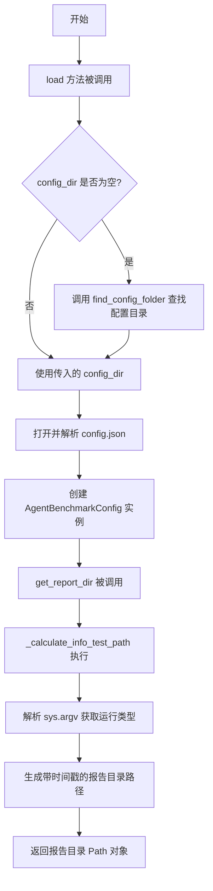

## 类结构

```
AgentBenchmarkConfig (配置模型类)
├── _calculate_info_test_path (模块级工具函数)
├── Field (Pydantic 字段装饰器)
└── BaseSettings (Pydantic 设置基类)
```

## 全局变量及字段


### `_calculate_info_test_path`
    
计算测试报告保存目录的路径，根据基准测试开始时间和命令行参数生成带时间戳的报告目录

类型：`function`
    


### `AgentBenchmarkConfig.agbenchmark_config_dir`
    
配置文件夹路径，指向agbenchmark_config目录

类型：`Path`
    


### `AgentBenchmarkConfig.categories`
    
要测试的分类列表，如果为空则测试所有分类

类型：`list[str] | None`
    


### `AgentBenchmarkConfig.host`
    
目标应用的主机地址，格式为scheme://address:port

类型：`str`
    


### `AgentBenchmarkConfig.reports_folder`
    
报告存储文件夹路径，默认为agbenchmark_config_dir/reports

类型：`Path`
    
    

## 全局函数及方法


### `_calculate_info_test_path`

计算并创建测试报告保存目录的路径，根据基准测试开始时间和命令行参数确定最终的报告目录。

参数：

- `base_path`：`Path`，基础报告目录路径
- `benchmark_start_time`：`datetime`，基准测试的开始时间，用于生成时间戳

返回值：`Path`，生成的报告保存目录的完整路径

#### 流程图

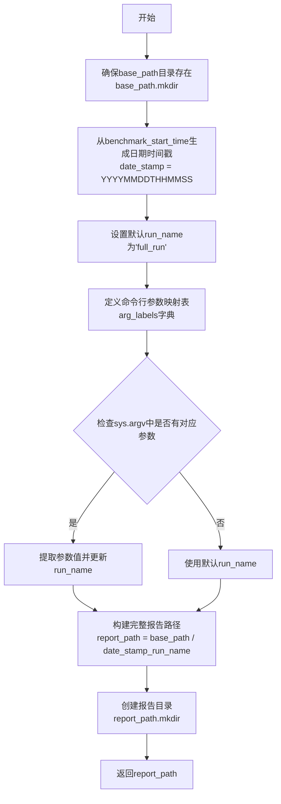

#### 带注释源码

```python
def _calculate_info_test_path(base_path: Path, benchmark_start_time: datetime) -> Path:
    """
    Calculates the path to the directory where the test report will be saved.
    """
    # 1. 确保reports目录存在，如果不存在则创建（包含父目录）
    base_path.mkdir(parents=True, exist_ok=True)

    # 2. 获取当前UTC日期时间戳，格式：YYYYMMDDTHHMMSS
    date_stamp = benchmark_start_time.strftime("%Y%m%dT%H%M%S")

    # 3. 默认运行名称
    run_name = "full_run"

    # 4. 定义命令行参数到标签的映射关系
    #    None值表示该参数后面需要跟一个测试名称作为值
    arg_labels = {
        "--test": None,
        "--category": None,
        "--maintain": "maintain",
        "--improve": "improve",
        "--explore": "explore",
    }

    # 5. 遍历命令行参数，找出第一个匹配的参数
    for arg, label in arg_labels.items():
        if arg in sys.argv:
            # 如果参数标签为None，则获取该参数后的下一个值作为测试参数
            test_arg = sys.argv[sys.argv.index(arg) + 1] if label is None else None
            # 从参数名中提取标签（去掉"--"前缀）
            run_name = arg.strip("--")
            # 如果有测试参数，则组合成完整的run_name
            if test_arg:
                run_name = f"{run_name}_{test_arg}"
            break

    # 6. 构建完整的报告目录路径，格式：base_path/YYYYMMDDTHHMMSS_run_name
    report_path = base_path / f"{date_stamp}_{run_name}"

    # 7. 确保新目录已创建（存在则忽略）
    # FIXME: 这是加载配置的副作用，不理想
    report_path.mkdir(exist_ok=True)

    # 8. 返回最终生成的报告目录路径
    return report_path
```


### `AgentBenchmarkConfig.load`

这是一个类方法，用于加载并返回 AgentBenchmarkConfig 配置实例。它接收一个可选的 `config_dir` 参数，如果未提供则自动查找 `agbenchmark_config` 文件夹，然后读取 `config.json` 文件并结合目录路径实例化配置对象返回。

参数：

- `config_dir`：`Optional[Path]`，可选参数，指定配置目录的路径。如果为 `None`，则自动调用 `find_config_folder()` 方法从当前工作目录向上搜索包含 `agbenchmark_config` 文件夹的路径。

返回值：`AgentBenchmarkConfig`，返回配置实例，包含从 `config.json` 加载的配置项以及配置目录路径。

#### 流程图

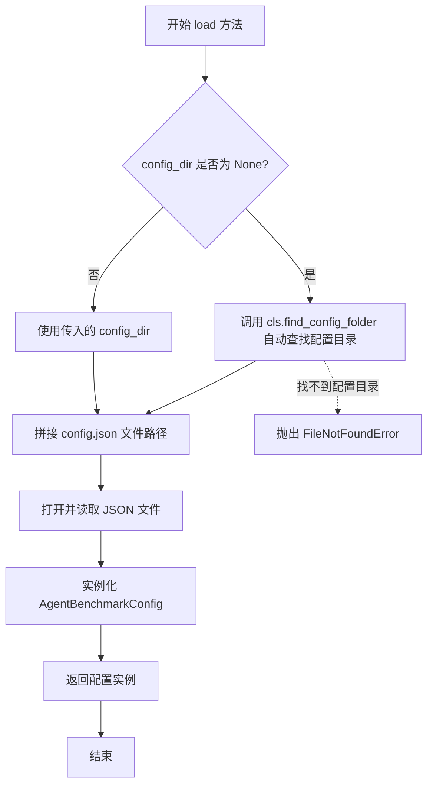

#### 带注释源码

```python
@classmethod
def load(cls, config_dir: Optional[Path] = None) -> "AgentBenchmarkConfig":
    """
    加载并返回 AgentBenchmarkConfig 配置实例的类方法。
    
    Args:
        config_dir: 可选的配置目录路径。如果为 None，则自动查找。
    
    Returns:
        返回配置实例，包含 agbenchmark_config_dir 和 config.json 中的配置项。
    """
    # 如果未提供 config_dir，则自动查找 agbenchmark_config 文件夹
    config_dir = config_dir or cls.find_config_folder()
    
    # 打开配置目录下的 config.json 文件并读取内容
    with (config_dir / "config.json").open("r") as f:
        # 使用 json.load 解析 JSON 内容，并通过关键字参数展开传入类构造函数
        # 同时显式传入 agbenchmark_config_dir 参数
        return cls(
            agbenchmark_config_dir=config_dir,
            **json.load(f),
        )
```


### `AgentBenchmarkConfig.find_config_folder`

该静态方法从指定目录开始向上遍历文件系统层级，查找最近的包含 `agbenchmark_config` 子目录且该子目录中存在 `config.json` 文件的祖先目录，并返回该 `agbenchmark_config` 目录的路径。如果遍历到根目录仍未找到，则抛出 `FileNotFoundError` 异常。

参数：

- `for_dir`：`Path`，搜索的起始目录，默认为 `Path.cwd()`（当前工作目录）

返回值：`Path`，返回找到的 `agbenchmark_config` 文件夹的路径

#### 流程图

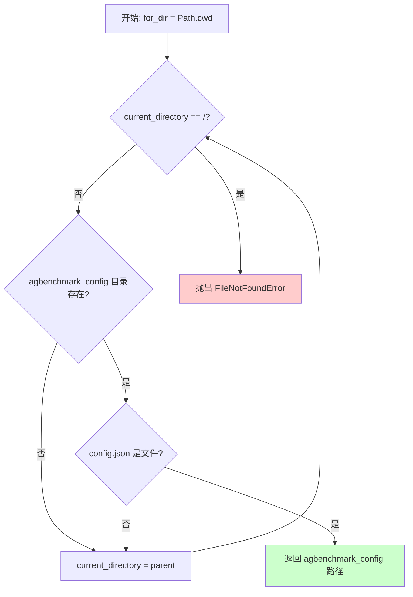

#### 带注释源码

```python
@staticmethod
def find_config_folder(for_dir: Path = Path.cwd()) -> Path:
    """
    Find the closest ancestor folder containing an agbenchmark_config folder,
    and returns the path of that agbenchmark_config folder.
    """
    # 初始化当前搜索目录为传入的起始目录（默认为当前工作目录）
    current_directory = for_dir
    
    # 循环向上遍历目录树，直到到达根目录 "/"
    while current_directory != Path("/"):
        # 构造可能的 agbenchmark_config 目录路径
        if (path := current_directory / "agbenchmark_config").exists():
            # 检查该目录下是否存在 config.json 文件
            if (path / "config.json").is_file():
                # 找到有效的配置目录，返回其路径
                return path
        
        # 未找到则继续向父目录搜索
        current_directory = current_directory.parent
    
    # 遍历到根目录仍未找到，抛出异常
    raise FileNotFoundError(
        "No 'agbenchmark_config' directory found in the path hierarchy."
    )
```


### `AgentBenchmarkConfig.config_file`

该属性返回配置文件的完整路径，通过拼接 `agbenchmark_config_dir` 路径与 "config.json" 文件名得到。

参数： 无

返回值：`Path`，返回 config.json 配置文件的完整路径。

#### 流程图

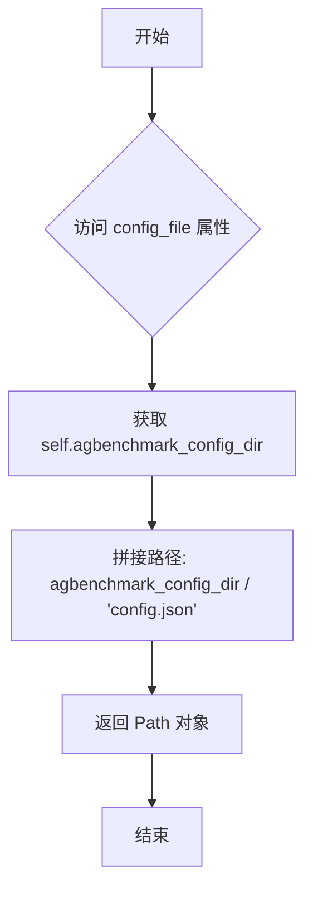

#### 带注释源码

```python
@property
def config_file(self) -> Path:
    """
    返回配置文件的完整路径。
    
    该属性是一个只读属性，通过拼接 agbenchmark_config_dir 路径
    与 'config.json' 文件名来构建配置文件的完整路径。
    """
    return self.agbenchmark_config_dir / "config.json"
```


### `AgentBenchmarkConfig.set_reports_folder`

Pydantic 字段验证器方法，用于在配置加载时验证并设置默认的报告文件夹路径。如果用户未提供 `reports_folder` 值，则自动使用 `{agbenchmark_config_dir}/reports` 作为默认路径；否则返回用户指定的值。

参数：

- `cls`：类本身（Pydantic 验证器隐式传递）
- `value`：`Path`，用户提供的 `reports_folder` 字段值，可能为 `None` 或空值
- `info`：`ValidationInfo`，Pydantic 验证上下文信息，包含 `data` 字典，可访问其他字段值（如 `agbenchmark_config_dir`）

返回值：`Path`，解析后的报告文件夹路径（用户指定的值或默认路径）

#### 流程图

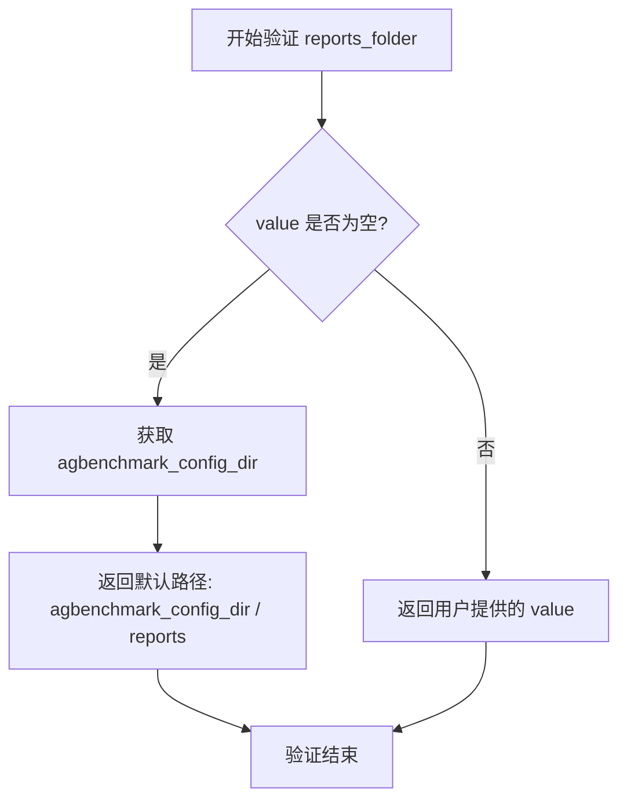

#### 带注释源码

```python
@field_validator("reports_folder", mode="before")
def set_reports_folder(cls, value: Path, info: ValidationInfo):
    """
    字段验证器：在 reports_folder 字段被赋值前执行验证逻辑。
    
    参数:
        cls: 当前类 AgentBenchmarkConfig 的引用
        value: 用户传入的 reports_folder 值，可能为 None 或空 Path
        info: ValidationInfo 对象，包含已验证的字段数据
    
    返回:
        Path: 验证后的 reports_folder 路径
    """
    # 检查 value 是否为空值（None、空字符串、空 Path 等）
    if not value:
        # 使用 info.data 访问其他已验证字段，获取 agbenchmark_config_dir
        # 拼接默认报告目录：{agbenchmark_config_dir}/reports
        return info.data["agbenchmark_config_dir"] / "reports"
    
    # 如果用户提供了有效值，直接返回该值
    return value
```


### `AgentBenchmarkConfig.get_report_dir`

获取带时间戳的测试报告目录，通过调用内部函数 `_calculate_info_test_path` 根据基准测试开始时间、配置的报告文件夹路径以及命令行参数生成并创建唯一的报告目录。

参数：

- `self`：隐含的 `AgentBenchmarkConfig` 实例
- `benchmark_start_time`：`datetime`，基准测试的开始时间，用于生成报告目录名称中的时间戳

返回值：`Path`，返回生成的测试报告目录路径

#### 流程图

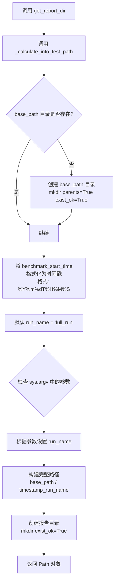

#### 带注释源码

```python
def get_report_dir(self, benchmark_start_time: datetime) -> Path:
    """
    获取带时间戳的测试报告目录。
    
    该方法是一个包装器，调用内部函数 _calculate_info_test_path
    来生成包含时间戳和运行标识的测试报告目录路径。
    
    参数:
        benchmark_start_time: datetime - 基准测试的开始时间
        
    返回:
        Path - 生成的测试报告目录的完整路径
    """
    # 调用内部函数 _calculate_info_test_path，传入配置的报告文件夹路径和测试开始时间
    return _calculate_info_test_path(self.reports_folder, benchmark_start_time)


# 以下是 _calculate_info_test_path 函数的详细逻辑：
def _calculate_info_test_path(base_path: Path, benchmark_start_time: datetime) -> Path:
    """
    计算测试报告保存目录的路径。
    
    逻辑步骤：
    1. 确保基础报告路径存在
    2. 根据开始时间生成时间戳
    3. 解析命令行参数确定运行名称
    4. 组合时间戳和运行名称创建完整路径
    5. 创建并返回该路径
    """
    # 步骤1: 确保 reports 路径存在（如果不存在则创建）
    base_path.mkdir(parents=True, exist_ok=True)

    # 步骤2: 获取当前 UTC 日期时间戳，格式: YYYYMMDDTHHMMSS
    date_stamp = benchmark_start_time.strftime("%Y%m%dT%H%M%S")

    # 步骤3: 默认运行名称
    run_name = "full_run"

    # 步骤4: 命令行参数到标签的映射
    arg_labels = {
        "--test": None,
        "--category": None,
        "--maintain": "maintain",
        "--improve": "improve",
        "--explore": "explore",
    }

    # 步骤5: 识别相关命令行参数并设置 run_name
    for arg, label in arg_labels.items():
        if arg in sys.argv:
            test_arg = sys.argv[sys.argv.index(arg) + 1] if label is None else None
            run_name = arg.strip("--")  # 移除 "--" 前缀
            if test_arg:
                run_name = f"{run_name}_{test_arg}"  # 如: improve_数学
            break

    # 步骤6: 创建完整的目录路径 (时间戳_运行名)
    report_path = base_path / f"{date_stamp}_{run_name}"

    # 步骤7: 确保新目录已创建
    # FIXME: 这是加载配置的一个副作用，不太理想
    report_path.mkdir(exist_ok=True)

    return report_path
```


### `AgentBenchmarkConfig.regression_tests_file`

该属性返回回归测试文件（regression_tests.json）的完整路径，基于配置中的报告文件夹路径。

参数：无（该属性通过 `self` 访问实例状态）

返回值：`Path`，返回回归测试 JSON 文件的完整路径

#### 流程图

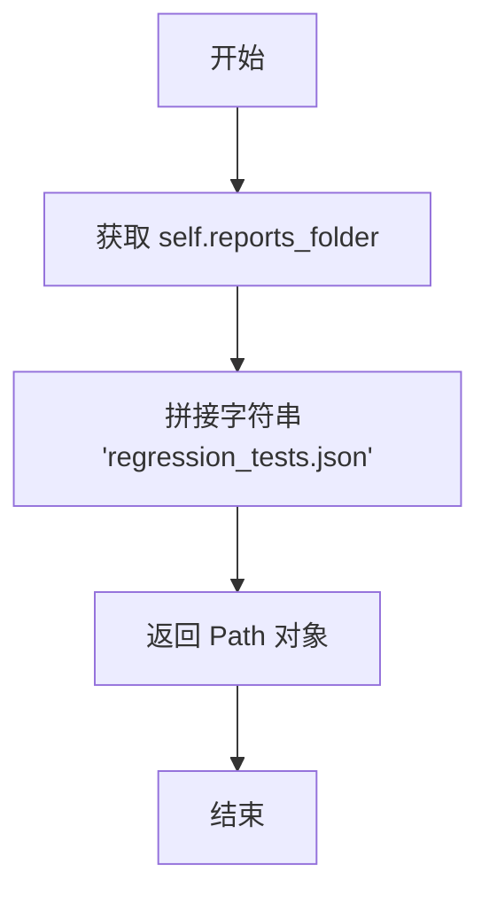

#### 带注释源码

```python
@property
def regression_tests_file(self) -> Path:
    """
    Returns the path to the regression tests file.
    
    The regression tests file is stored in the reports folder
    and is named 'regression_tests.json'.
    """
    # Concatenate the reports folder path with the regression tests filename
    return self.reports_folder / "regression_tests.json"
```


### `AgentBenchmarkConfig.success_rate_file`

该属性是 `AgentBenchmarkConfig` 类的只读属性，用于返回存储成功率报告的 JSON 文件路径。它通过组合 `reports_folder` 路径与 `"success_rate.json"` 文件名来构造完整的文件路径，为基准测试结果的成功率数据提供统一的存储位置。

#### 参数

此属性为只读属性，无需参数。

#### 返回值

- **`Path`**：返回指向成功率报告文件的完整路径对象（`{reports_folder}/success_rate.json`）

#### 流程图

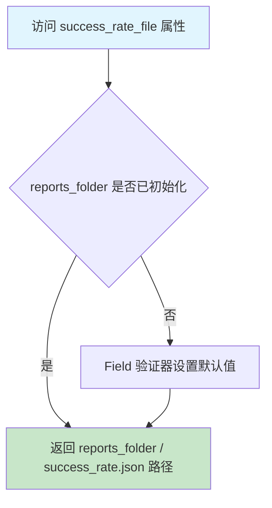

#### 带注释源码

```python
@property
def success_rate_file(self) -> Path:
    """
    返回存储成功率报告的 JSON 文件路径。
    
    该属性为只读属性，通过组合 reports_folder 路径
    与固定文件名 'success_rate.json' 来构造完整路径。
    
    Returns:
        Path: 指向 success_rate.json 文件的完整路径对象
    """
    return self.reports_folder / "success_rate.json"
```


---

## 完整类设计文档

### 一段话描述

`AgentBenchmarkConfig` 是一个基于 Pydantic 的配置管理类，用于加载和管理 AG Benchmark 基准测试的配置信息，包括被测代理应用的 API 主机地址、测试类别、报告存储路径等核心参数，并提供配置文件查找、报告目录生成等辅助功能。

### 文件的整体运行流程

1. **配置加载阶段**：通过 `load()` 类方法加载 `agbenchmark_config/config.json` 配置文件
2. **配置验证阶段**：Pydantic 验证器对各字段进行校验，`reports_folder` 字段在验证器中被设置为默认值（`{agbenchmark_config_dir}/reports`）
3. **配置使用阶段**：通过各属性方法获取回归测试、成功率报告等文件路径
4. **报告生成阶段**：调用 `get_report_dir()` 方法结合命令行参数创建带时间戳的测试报告目录

### 类的详细信息

#### 类字段

| 字段名称 | 类型 | 描述 |
|---------|------|------|
| `agbenchmark_config_dir` | `Path` | 指向 subject agent 应用的 agbenchmark_config 文件夹路径（排除在配置序列化外） |
| `categories` | `list[str] \| None` | 要基准测试的代理类别，默认为 None（所有类别） |
| `host` | `str` | 被测代理应用暴露 Agent Protocol 兼容 API 的主机地址（scheme://address:port） |
| `reports_folder` | `Path` | 存储新报告的文件夹路径，默认为 `{agbenchmark_config_dir}/reports` |

#### 类方法

| 方法名称 | 功能描述 |
|---------|---------|
| `load(config_dir)` | 类方法，从指定目录加载配置 JSON 文件并返回配置实例 |
| `find_config_folder(for_dir)` | 静态方法，在目录层级中向上查找包含 agbenchmark_config 文件夹的路径 |
| `config_file` 属性 | 返回 config.json 文件的完整路径 |
| `set_reports_folder` 验证器 | 字段验证器，为空的 reports_folder 设置默认值 |
| `get_report_dir(benchmark_start_time)` | 根据开始时间生成带时间戳的报告目录路径 |
| `regression_tests_file` 属性 | 返回回归测试文件路径 |
| `success_rate_file` 属性 | 返回成功率报告文件路径 |
| `challenges_already_beaten_file` 属性 | 返回已击败挑战记录文件路径 |
| `temp_folder` 属性 | 返回临时文件夹路径 |

#### 全局函数

| 函数名称 | 描述 |
|---------|------|
| `_calculate_info_test_path` | 计算测试报告保存目录路径，根据命令行参数确定运行名称并创建带时间戳的目录 |

### 关键组件信息

| 组件名称 | 描述 |
|---------|------|
| `AgentBenchmarkConfig` | 核心配置模型类，继承自 BaseSettings，支持额外字段 |
| `reports_folder` | 报告存储根目录，所有基准测试结果文件的默认父目录 |
| `success_rate_file` | 成功率数据输出文件，记录测试通过率统计信息 |

### 潜在的技术债务或优化空间

1. **副作用问题**：`_calculate_info_test_path` 函数在加载配置时创建目录（`report_path.mkdir(exist_ok=True)`），这违反了配置加载的纯函数原则，建议将目录创建延迟到实际需要时
2. **命令行参数解析**：使用 `sys.argv` 直接索引方式解析参数存在越界风险，应使用 `argparse` 模块进行更安全的参数处理
3. **硬编码文件路径**：`success_rate_file`、`regression_tests_file` 等属性中文件名硬编码，建议提取为类常量或配置项
4. **缺乏类型提示精度**：`categories` 字段使用 `list[str]` 而非具体字面量类型，可以考虑使用 Literal 或 Enum 定义具体类别

### 其它项目

#### 设计目标与约束

- **目标**：为 AG Benchmark 提供统一、可扩展的配置管理框架
- **约束**：必须包含 `host` 字段作为必需配置项，支持通过 `config.json` 文件配置

#### 错误处理与异常设计

- `find_config_folder()` 在未找到配置目录时抛出 `FileNotFoundError`
- `load()` 方法假设 config.json 文件存在且可读，未处理文件不存在或 JSON 解析错误

#### 数据流与状态机

配置对象在实例化后处于只读状态，通过属性方法提供只读访问。`reports_folder` 在首次访问时由验证器初始化默认值，后续保持不变。

#### 外部依赖与接口契约

- **Pydantic**：用于配置模型定义和验证
- **pydantic_settings**：提供 BaseSettings 基类支持环境变量加载
- **JSON 配置文件**：通过 `config.json` 约定格式输入配置


### `AgentBenchmarkConfig.challenges_already_beaten_file`

该属性返回挑战记录文件的路径，用于记录已经被攻克的挑战信息。

参数：

- `self`：实例本身，无需显式传递

返回值：`Path`，返回挑战记录文件（challenges_already_beaten.json）的完整路径，路径基于 `agbenchmark_config_dir` 目录。

#### 流程图

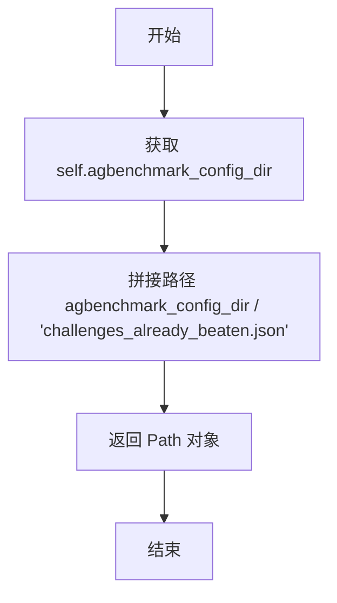

#### 带注释源码

```python
@property
def challenges_already_beaten_file(self) -> Path:
    """
    返回挑战记录文件的路径。
    
    该属性用于定位 'challenges_already_beaten.json' 文件，
    该文件存储了已被成功攻克的挑战记录信息。
    """
    # 使用 Path 拼接操作，将配置目录路径与文件名组合
    # self.agbenchmark_config_dir 是配置目录路径（agbenchmark_config 文件夹）
    # "challenges_already_beaten.json" 是挑战记录文件名
    return self.agbenchmark_config_dir / "challenges_already_beaten.json"
```


### `AgentBenchmarkConfig.temp_folder`

返回临时文件夹的路径，基于代理基准测试配置目录构建。

参数：无显式参数（`self` 为隐式参数）

返回值：`Path`，临时文件夹的路径对象

#### 流程图

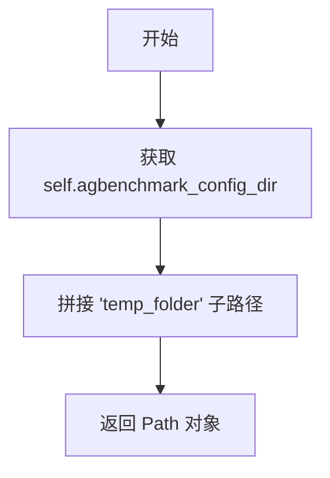

#### 带注释源码

```python
@property
def temp_folder(self) -> Path:
    """
    返回临时文件夹的路径。
    
    该属性通过组合配置目录路径和 'temp_folder' 字符串
    来构造临时文件夹的标准路径，供基准测试过程中存储
    临时文件使用。
    """
    # 使用 Path 对象的 / 运算符拼接子目录
    return self.agbenchmark_config_dir / "temp_folder"
```

## 关键组件


### AgentBenchmarkConfig 类

核心配置模型和加载器，用于管理AGBenchmark的配置文件。继承自pydantic_settings.BaseSettings，支持从JSON文件加载配置、自动查找配置目录、管理报告文件夹路径等功能。

### _calculate_info_test_path 函数

根据基准测试开始时间和命令行参数计算并创建测试报告保存目录的路径。包含创建目录、处理命令行参数映射、生成带时间戳的目录名称等逻辑。

### 配置字段组件

包括agbenchmark_config_dir（配置目录路径）、categories（测试类别列表）、host（目标应用主机地址）、reports_folder（报告存储文件夹）等核心配置项。

### 配置查找组件

find_config_folder静态方法实现从当前目录向上查找最近的agbenchmark_config目录的逻辑，支持层级遍历和配置文件验证。

### 报告路径管理组件

get_report_dir方法结合时间戳和命令行参数生成报告目录，以及regression_tests_file、success_rate_file、challenges_already_beaten_file、temp_folder等属性方法用于管理各类报告和临时文件的路径。

### 配置验证组件

set_reports_folder字段验证器，在reports_folder为空时自动设置为默认的reports子目录。


## 问题及建议


### 已知问题

-   **直接访问 `sys.argv` 全局状态**：函数 `_calculate_info_test_path` 直接读取 `sys.argv` 进行命令行参数解析，导致该函数成为不纯函数（Impure Function），难以进行单元测试，且与配置加载逻辑产生不必要的耦合。
-   **FIXME 标注的副作用问题**：代码中的 FIX ME 注释明确指出 `report_path.mkdir(exist_ok=True)` 的目录创建操作是配置加载的不理想副作用，违反单一职责原则。
-   **命令行参数解析缺乏健壮性**：使用 `sys.argv.index(arg) + 1` 获取参数值时未检查索引越界风险，若参数在命令行末尾则会导致 `IndexError`。
-   **硬编码的参数映射表**：`arg_labels` 字典硬编码在函数内部，扩展性差，新增参数需修改函数源码。
-   **配置文件读取缺乏异常处理**：`load` 方法直接打开 `config.json` 文件，未捕获 `FileNotFoundError` 或 `JSONDecodeError`，配置缺失或格式错误时程序直接崩溃。
-   **路径遍历的 Unix 中心主义**：`while current_directory != Path("/")` 仅适用于 Unix 系统，Windows 上根路径判断逻辑不同。
-   **日期时间缺少时区信息**：`benchmark_start_time.strftime("%Y%m%dT%H%M%S")` 生成的时间戳不包含时区信息，在跨时区场景中可能导致报告目录命名冲突或时间混淆。
-   **属性返回值类型不一致**：`temp_folder` 属性返回 `Path` 类型，但未在类型注解中明确声明（虽然实现中返回 Path 对象）。

### 优化建议

-   **引入参数注入机制**：将 `sys.argv` 作为参数传入 `_calculate_info_test_path` 函数，或创建独立的参数解析类，使函数变为纯函数，便于单元测试。
-   **消除副作用**：将目录创建操作从路径计算函数中移除，改为在调用方显式创建，或使用懒加载模式延迟创建目录。
-   **参数解析安全增强**：在访问 `sys.argv[index + 1]` 前添加边界检查，确保参数列表长度足够。
-   **配置化参数映射**：将 `arg_labels` 配置化，可通过配置文件或环境变量管理，降低代码耦合度。
-   **增强异常处理**：在 `load` 方法中添加 `try-except` 块，捕获文件读取和 JSON 解析异常，提供友好的错误信息。
-   **统一跨平台路径遍历**：使用 `pathlib` 的更健壮方式遍历父目录，或使用 `os.path.lexists()` 等跨平台方法。
-   **时区感知的时间戳**：使用 `datetime.now(timezone.utc)` 或 `datetime.astimezone(timezone.utc)` 确保时间戳包含时区信息，格式化为 ISO 8601 标准（如 `%Y%m%dT%H%M%SZ`）。
-   **显式类型注解**：为所有属性和方法添加完整的类型注解，提高代码可读性和 IDE 支持。

## 其它


### 设计目标与约束

本模块的设计目标是为AG Benchmark提供一个灵活的配置管理框架，支持从JSON配置文件加载基准测试参数，并自动生成带有时间戳的测试报告目录。约束条件包括：配置文件必须位于agbenchmark_config目录下的config.json文件中；host字段为必需配置项；reports_folder字段可自定义，默认为agbenchmark_config_dir/reports；使用pydantic的extra="allow"允许扩展配置字段。

### 错误处理与异常设计

**异常类型**：FileNotFoundError - 当在目录层级中找不到agbenchmark_config目录时抛出，错误消息为"No 'agbenchmark_config' directory found in the path hierarchy."；JSONDecodeError - 配置文件格式错误时由json.load抛出；OSError - 文件系统操作失败时抛出（如mkdir、open等）。

**验证器设计**：使用@field_validator装饰器在reports_folder字段赋值前进行验证，如果未提供值则自动设置为默认路径。

### 数据流与状态机

**配置加载状态机**：初始状态（find_config_folder）→ 读取config.json → 验证并创建AgentBenchmarkConfig实例 → 可选：调用get_report_dir生成报告目录。

**报告目录生成流程**：接收基准测试开始时间 → 生成时间戳（YYYYMMDDTHHMMSS格式）→ 解析命令行参数确定运行类型（test/category/maintain/improve/explore）→ 拼接目录名 → 创建目录并返回路径。

### 外部依赖与接口契约

**外部依赖**：pydantic>=2.0 - 用于配置模型定义和验证；pydantic-settings - 用于BaseSettings基类；json - 标准库，用于解析配置文件；pathlib.Path - 标准库，用于路径操作；datetime - 标准库，用于时间处理；sys - 标准库，用于命令行参数解析。

**接口契约**：AgentBenchmarkConfig.load(config_dir?: Path) -> AgentBenchmarkConfig：类方法，从指定目录加载配置；AgentBenchmarkConfig.find_config_folder(for_dir?: Path) -> Path：静态方法，在目录层级中查找配置文件夹；AgentBenchmarkConfig.get_report_dir(benchmark_start_time: datetime) -> Path：实例方法，生成报告存储目录。

### 性能考量

**目录创建优化**：_calculate_info_test_path函数中使用mkdir(parents=True, exist_ok=True)确保目录存在但不抛出异常；find_config_folder方法从当前目录向上遍历直到根目录，最坏情况时间复杂度为O(h)，其中h为目录深度。

### 安全性考虑

**路径遍历防护**：使用pathlib.Path进行路径操作，避免字符串拼接可能带来的路径遍历攻击；config_dir参数有默认值（Path.cwd()），确保始终在可控范围内操作。

### 可扩展性设计

**配置扩展**：通过extra="allow"允许在config.json中添加额外配置项而不会触发验证错误；AgentBenchmarkConfig类继承BaseSettings，支持环境变量覆盖配置。

### 配置示例

```json
{
    "host": "http://localhost:8000",
    "categories": ["python", "javascript"],
    "reports_folder": "./custom_reports"
}
```

最小配置（仅必需字段）：
```json
{
    "host": "http://localhost:8000"
}
```

    