# `.\AutoGPT\classic\benchmark\agbenchmark\conftest.py` 详细设计文档

这是一个pytest测试框架的配置文件，用于agbenchmark（AI代理基准测试）项目。它管理测试的收集、执行、报告生成和超时控制，支持多种测试模式（如mock模式、回归测试、维护模式、探索模式），并通过命令行参数灵活控制测试行为。

## 整体流程

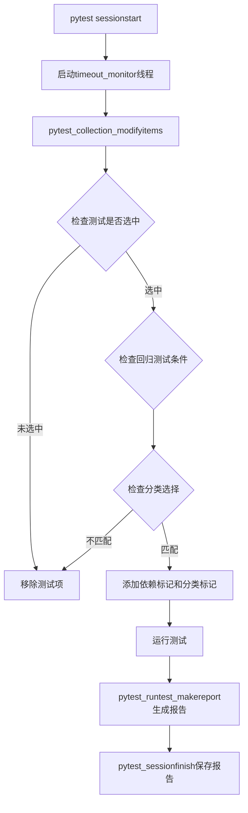

## 类结构

```
conftest.py (pytest配置文件，无自定义类)
```

## 全局变量及字段


### `GLOBAL_TIMEOUT`
    
全局超时时间（1500秒），测试将在25分钟后停止以便发送报告

类型：`int`
    


### `agbenchmark_config`
    
基准测试配置对象，通过load()方法加载配置

类型：`AgentBenchmarkConfig`
    


### `test_reports`
    
存储测试报告的字典，以challenge_id为键，Test对象为值

类型：`dict[str, Test]`
    


    

## 全局函数及方法


### `pytest_addoption`

该函数是 pytest 的一个钩子函数，用于向 pytest 命令行添加特定的命令行选项。这些选项用于控制 agbenchmark 测试框架的行为，包括运行模式、测试筛选、缓存控制等。

参数：

- `parser`：`pytest.Parser`，pytest CLI 解析器，用于添加命令行选项。

返回值：`None`，无返回值。

#### 流程图

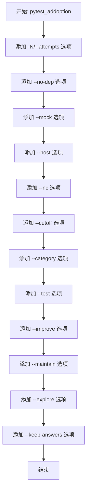

#### 带注释源码

```python
def pytest_addoption(parser: pytest.Parser) -> None:
    """
    Pytest hook that adds command-line options to the `pytest` command.
    The added options are specific to agbenchmark and control its behavior:
    * `--mock` is used to run the tests in mock mode.
    * `--host` is used to specify the host for the tests.
    * `--category` is used to run only tests of a specific category.
    * `--nc` is used to run the tests without caching.
    * `--cutoff` is used to specify a cutoff time for the tests.
    * `--improve` is used to run only the tests that are marked for improvement.
    * `--maintain` is used to run only the tests that are marked for maintenance.
    * `--explore` is used to run the tests in exploration mode.
    * `--test` is used to run a specific test.
    * `--no-dep` is used to run the tests without dependencies.
    * `--keep-answers` is used to keep the answers of the tests.

    Args:
        parser: The Pytest CLI parser to which the command-line options are added.
    """
    # 添加重试次数选项，允许用户指定测试运行次数
    parser.addoption("-N", "--attempts", action="store")
    # 添加无依赖选项，运行时忽略测试依赖关系
    parser.addoption("--no-dep", action="store_true")
    # 添加模拟模式选项，用于在模拟模式下运行测试
    parser.addoption("--mock", action="store_true")
    # 添加主机选项，用于指定测试的主机地址
    parser.addoption("--host", default=None)
    # 添加无缓存选项，运行时不使用缓存
    parser.addoption("--nc", action="store_true")
    # 添加截止时间选项，用于指定测试的截止时间
    parser.addoption("--cutoff", action="store")
    # 添加类别选项，可多次使用以指定多个类别
    parser.addoption("--category", action="append")
    # 添加测试选项，可多次使用以指定多个测试
    parser.addoption("--test", action="append")
    # 添加改进模式选项，只运行标记为改进的测试
    parser.addoption("--improve", action="store_true")
    # 添加维护模式选项，只运行标记为维护的测试
    parser.addoption("--maintain", action="store_true")
    # 添加探索模式选项，以探索模式运行测试
    parser.addoption("--explore", action="store_true")
    # 添加保留答案选项，保留测试的答案
    parser.addoption("--keep-answers", action="store_true")
```


### `pytest_configure`

该函数是 Pytest 的配置钩子，用于在测试会话开始前注册所有自定义的类别标记，以防止出现"unknown marker"警告。

参数：

-  `config`：`pytest.Config`，Pytest 的配置对象，包含当前的配置信息和插件系统

返回值：`None`，该函数不返回任何值，仅执行标记注册操作

#### 流程图

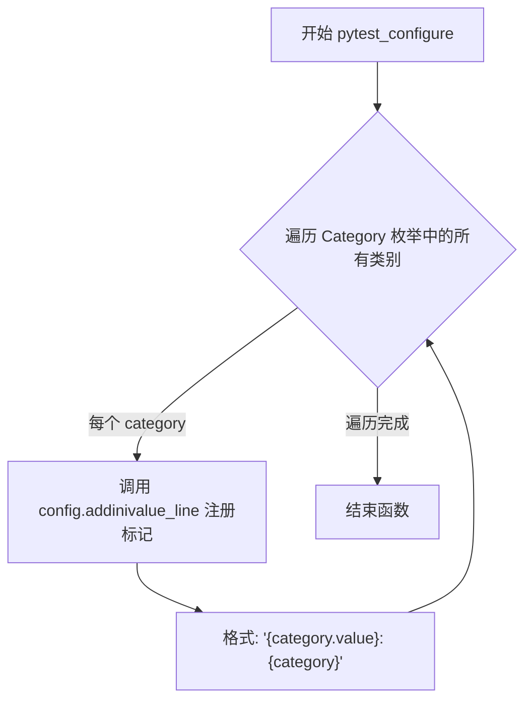

#### 带注释源码

```python
def pytest_configure(config: pytest.Config) -> None:
    """
    Pytest hook that is called after command line options have been parsed
    and all plugins and initial conftest files have been loaded.
    
    This function registers custom markers for each category in the Category
    enum to prevent 'unknown marker' warnings during test execution.
    
    Args:
        config: The pytest Config object that provides access to configuration
                options and the marker registration API.
    """
    # Register category markers to prevent "unknown marker" warnings
    # Iterates through all Category enum values and adds each as a valid pytest marker
    for category in Category:
        # Each marker is added with format: "category_value: CategoryEnumClass"
        # This allows tests to be marked with @pytest.mark.category_name syntax
        config.addinivalue_line("markers", f"{category.value}: {category}")
```


### `pytest_generate_tests`

该函数是pytest的钩子函数，用于根据命令行参数`-N`（attempts）动态生成测试参数化。它读取用户指定的尝试次数，并使用`metafunc.parametrize`为测试函数添加参数`i_attempt`，从而允许测试用例以不同的尝试次数参数运行。

参数：

-  `metafunc`：`pytest.Metafunc`，pytest的元函数对象，包含测试配置信息，用于调用`parametrize`方法进行参数化

返回值：`None`，无返回值，该函数通过副作用修改测试参数化

#### 流程图

```mermaid
flowchart TD
    A[开始 pytest_generate_tests] --> B[获取命令行选项 -N 的值]
    B --> C{检查 n 的类型是否为 str}
    C -->|是| D[将 n 转换为 int 类型]
    D --> E[生成 range&#40;n&#41; 参数列表]
    C -->|否| F[使用列表 [0] 作为参数列表]
    E --> G[调用 metafunc.parametrize 进行参数化]
    F --> G
    G --> H[结束]
```

#### 带注释源码

```python
def pytest_generate_tests(metafunc: pytest.Metafunc):
    """
    Pytest钩子函数，用于生成测试参数化。
    
    该函数在测试收集阶段被调用，根据命令行参数 -N（attempts）
    动态生成测试参数，使得测试可以重复运行指定次数。
    
    Args:
        metafunc: pytest.Metafunc对象，包含测试的元信息，
                  通过它可以调用parametrize方法来参数化测试。
    """
    # 从pytest配置中获取命令行选项 -N（--attempts）的值
    # 这个选项定义了测试应该尝试运行的次数
    n = metafunc.config.getoption("-N")
    
    # 判断 n 的类型：
    # - 如果是字符串类型（用户提供了--attempts参数），则转换为整数并生成范围
    # - 如果是None或其他类型（用户未提供参数），则默认只运行一次（参数为0）
    # 
    # metafunc.parametrize 参数：
    #   - "i_attempt": 参数名称，会作为测试函数的参数传入
    #   - range(int(n)) 或 [0]: 参数值列表，决定测试运行的次数
    #
    # 示例：
    #   --attempts 3 -> i_attempt 参数值为 [0, 1, 2]，测试运行3次
    #   未指定 --attempts -> i_attempt 参数值为 [0]，测试运行1次
    metafunc.parametrize("i_attempt", range(int(n)) if type(n) is str else [0])
```


### `pytest_collection_modifyitems`

Pytest hook that is called after initial test collection has been performed. It modifies the collected test items based on the agent benchmark configuration, filtering tests based on command-line options (--test, --category, --maintain, --improve, --explore), handling dependencies, and adding appropriate markers for categories and dependencies.

参数：

- `items`：`list[pytest.Function]`，收集到的待修改的测试项列表
- `config`：`pytest.Config`，活跃的 pytest 配置对象

返回值：`None`，该函数直接修改 items 列表，不返回任何值

#### 流程图

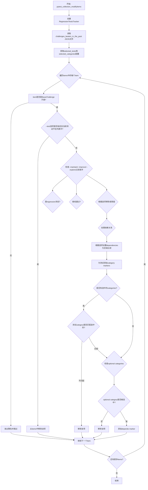

#### 带注释源码

```python
def pytest_collection_modifyitems(
    items: list[pytest.Function], config: pytest.Config
) -> None:
    """
    Pytest hook that is called after initial test collection has been performed.
    Modifies the collected test items based on the agent benchmark configuration,
    adding the dependency marker and category markers.

    Args:
        items: The collected test items to be modified.
        config: The active pytest configuration.
    """
    # 创建回归测试追踪器，用于检查哪些测试是回归测试
    rt_tracker = RegressionTestsTracker(agbenchmark_config.regression_tests_file)

    # 尝试读取过去挑战的JSON文件
    try:
        challenges_beaten_in_the_past = json.loads(
            agbenchmark_config.challenges_already_beaten_file.read_bytes()
        )
    except FileNotFoundError:
        # 文件不存在时使用空字典
        challenges_beaten_in_the_past = {}

    # 从命令行选项获取选中的测试和类别
    selected_tests: tuple[str] = config.getoption("--test")  # type: ignore
    selected_categories: tuple[str] = config.getoption("--category")  # type: ignore

    # 不能使用for循环原地删除，使用while循环
    i = 0
    while i < len(items):
        item = items[i]
        # 断言确保测试类存在且是BaseChallenge的子类
        assert item.cls and issubclass(item.cls, BaseChallenge)
        challenge = item.cls
        challenge_name = challenge.info.name

        # 检查收集到的项是否是BaseChallenge的子类
        if not issubclass(challenge, BaseChallenge):
            item.warn(
                pytest.PytestCollectionWarning(
                    f"Non-challenge item collected: {challenge}"
                )
            )
            i += 1
            continue

        # --test: 如果指定了测试但当前测试不在列表中，则移除
        if selected_tests and challenge.info.name not in selected_tests:
            items.remove(item)
            continue

        # 为--maintain, --improve, and --explore过滤挑战:
        # --maintain -> 只运行预期的回归测试
        # --improve -> 只运行尚未通过的测试
        # --explore -> 只运行从未通过的测试
        is_regression_test = rt_tracker.has_regression_test(challenge.info.name)
        has_been_passed = challenges_beaten_in_the_past.get(challenge.info.name, False)
        
        # 根据选项过滤测试
        if (
            (config.getoption("--maintain") and not is_regression_test)
            or (config.getoption("--improve") and is_regression_test)
            or (config.getoption("--explore") and has_been_passed)
        ):
            items.remove(item)
            continue

        # 获取测试的依赖项
        dependencies = challenge.info.dependencies
        
        # 根据选项忽略依赖关系
        if (
            config.getoption("--test")
            or config.getoption("--no-dep")
            or config.getoption("--maintain")
        ):
            # --test -> 用户选择了特定测试，不关心依赖
            # --no-dep -> 忽略依赖关系
            # --maintain -> 所有回归测试必须通过
            dependencies = []
        elif config.getoption("--improve"):
            # 过滤依赖项，只保留非回归测试的依赖
            dependencies = [
                d for d in dependencies if not rt_tracker.has_regression_test(d)
            ]

        # 设置category markers
        challenge_categories = set(c.value for c in challenge.info.category)
        for category in challenge_categories:
            item.add_marker(category)

        # 强制执行类别选择
        if selected_categories:
            if not challenge_categories.intersection(set(selected_categories)):
                items.remove(item)
                continue

        # 跳过未选中类别的可选类别测试
        challenge_optional_categories = challenge_categories & set(OPTIONAL_CATEGORIES)
        if challenge_optional_categories and not (
            agbenchmark_config.categories
            and challenge_optional_categories.issubset(
                set(agbenchmark_config.categories)
            )
        ):
            logger.debug(
                f"Skipping {challenge_name}: "
                f"category {' and '.join(challenge_optional_categories)} is optional, "
                "and not explicitly selected in the benchmark config."
            )
            items.remove(item)
            continue

        # 为DependencyManager添加marker
        item.add_marker(pytest.mark.depends(on=dependencies, name=challenge_name))

        i += 1
```


### `pytest_runtest_makereport`

Pytest钩子函数，在生成测试报告时被调用，用于为每个测试生成和最终确定报告。

参数：

- `item`：`pytest.Item`，生成报告的测试项
- `call`：`pytest.CallInfo`，用于获取测试结果的调用对象

返回值：`None`，该函数不返回任何值，仅修改测试报告字典

#### 流程图

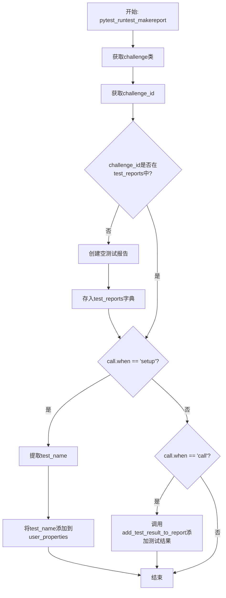

#### 带注释源码

```python
def pytest_runtest_makereport(item: pytest.Item, call: pytest.CallInfo) -> None:
    """
    Pytest hook that is called when a test report is being generated.
    It is used to generate and finalize reports for each test.

    Args:
        item: The test item for which the report is being generated.
        call: The call object from which the test result is retrieved.
    """
    # 从测试项中获取challenge类（BaseChallenge的子类）
    challenge: type[BaseChallenge] = item.cls  # type: ignore
    
    # 获取challenge的唯一标识ID
    challenge_id = challenge.info.eval_id

    # 如果该challenge的报告尚不存在，则创建空报告并存储
    if challenge_id not in test_reports:
        test_reports[challenge_id] = make_empty_test_report(challenge.info)

    # 在测试setup阶段，设置测试名称到user_properties供后续使用
    if call.when == "setup":
        # 从nodeid中提取测试函数名（格式：module::class::function）
        test_name = item.nodeid.split("::")[1]
        # 将测试名作为用户属性保存，供其他插件或钩子使用
        item.user_properties.append(("test_name", test_name))

    # 在测试call阶段（实际执行测试），将测试结果添加到报告中
    if call.when == "call":
        add_test_result_to_report(
            test_reports[challenge_id], item, call, agbenchmark_config
        )
```


### `pytest_sessionstart`

Pytest 会话启动钩子，在测试会话开始时创建一个守护线程来监控全局超时。

参数：

- `session`：`pytest.Session`，pytest 会话对象，包含了测试会话的全局信息

返回值：`None`，无返回值

#### 流程图

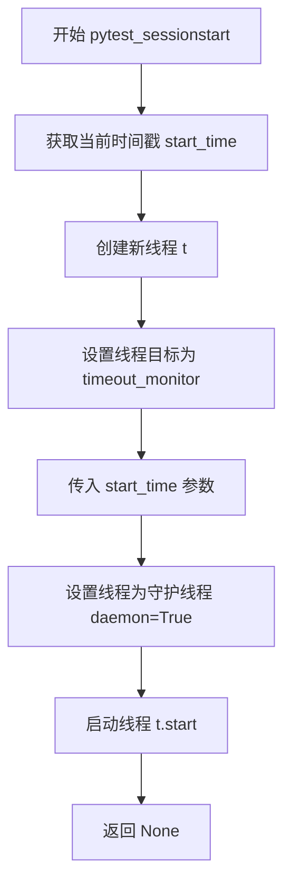

#### 带注释源码

```python
def pytest_sessionstart(session: pytest.Session) -> None:
    """
    Pytest hook that is called at the start of a test session.

    Sets up and runs a `timeout_monitor` in a separate thread.
    
    参数:
        session: pytest 会话对象，包含了测试会话的全局信息
    
    返回值:
        None
    """
    # 记录测试会话的开始时间，用于超时监控
    start_time = time.time()
    
    # 创建一个新线程，目标函数为 timeout_monitor
    # timeout_monitor 函数会监控测试运行时间是否超过全局超时限制
    t = threading.Thread(target=timeout_monitor, args=(start_time,))
    
    # 将线程设置为守护线程
    # 守护线程会在主程序结束时被强制终止，不会阻止程序退出
    # 这样可以确保在测试超时后能够安全地退出程序
    t.daemon = True  # Daemon threads are abruptly stopped at shutdown
    
    # 启动监控线程
    t.start()
```


### `pytest_sessionfinish`

这是 pytest 的会话结束钩子函数，在整个测试会话结束时被调用，用于最终化并保存测试报告。

参数：

- `session`：`pytest.Session`，pytest 的会话对象，包含了整个测试会话的信息

返回值：`None`，无返回值

#### 流程图

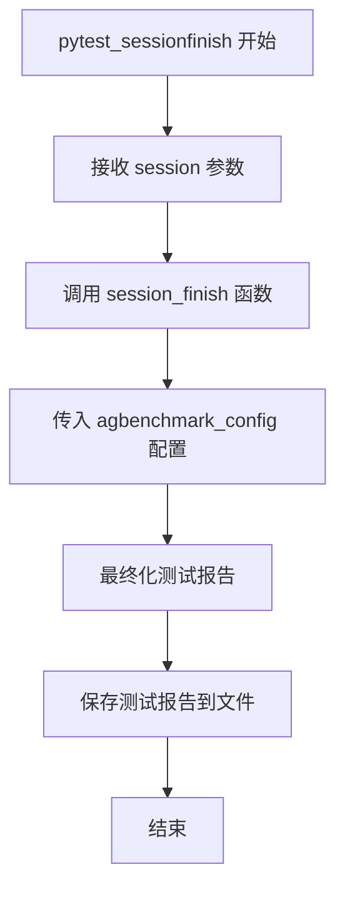

#### 带注释源码

```python
def pytest_sessionfinish(session: pytest.Session) -> None:
    """
    Pytest hook that is called at the end of a test session.

    Finalizes and saves the test reports.
    
    Args:
        session: pytest Session object containing information about the test session.
            This parameter is provided by pytest automatically when the hook is called.
    
    Returns:
        None: This function does not return any value.
    """
    # 调用 session_finish 函数，传入基准测试配置
    # 该函数负责完成测试报告的生成并保存到指定位置
    session_finish(agbenchmark_config)
```


### `timeout_monitor`

该函数用于限制测试套件的总执行时间。它在一个单独的线程中运行，持续检查测试运行时间是否超过全局超时限制（1500秒/25分钟），如果超时则调用 `pytest.exit` 终止测试套件。

参数：

- `start_time`：`int`，测试套件的开始时间（Unix 时间戳）

返回值：`None`，无返回值（通过调用 `pytest.exit` 终止测试套件）

#### 流程图

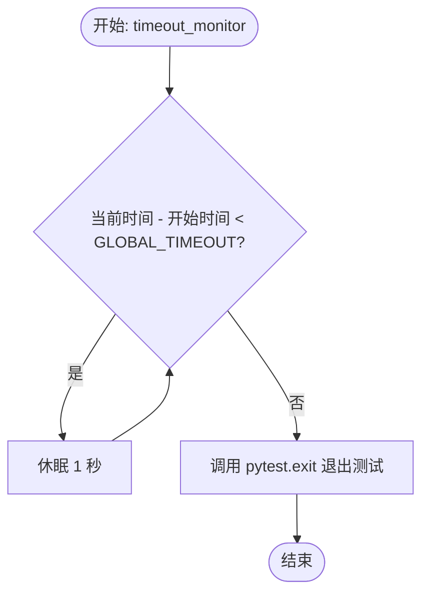

#### 带注释源码

```python
def timeout_monitor(start_time: int) -> None:
    """
    Function that limits the total execution time of the test suite.
    This function is supposed to be run in a separate thread and calls `pytest.exit`
    if the total execution time has exceeded the global timeout.

    Args:
        start_time (int): The start time of the test suite.
    """
    # 持续检查是否超过全局超时时间
    # GLOBAL_TIMEOUT 为 1500 秒（25 分钟）
    while time.time() - start_time < GLOBAL_TIMEOUT:
        time.sleep(1)  # check every second

    # 当超时条件满足时，调用 pytest.exit 强制退出测试套件
    # returncode=1 表示测试因超时而失败
    pytest.exit("Test suite exceeded the global timeout", returncode=1)
```


### `config`

这是一个 pytest fixture，用于在测试模块级别提供 `AgentBenchmarkConfig` 配置对象。它通过返回预先加载的全局配置实例，使得整个测试模块可以共享同一套配置设置。

参数： 无

返回值：`AgentBenchmarkConfig`，返回全局的 AgentBenchmarkConfig 实例，该实例包含基准测试的完整配置信息。

#### 流程图

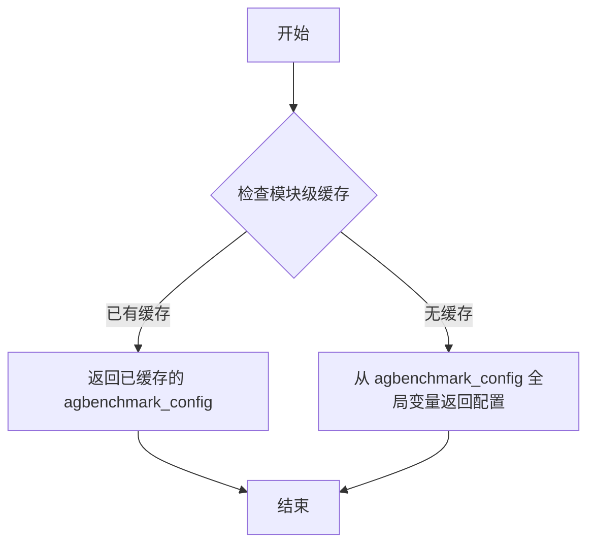

#### 带注释源码

```python
@pytest.fixture(scope="module")
def config() -> AgentBenchmarkConfig:
    """
    Pytest fixture that provides the AgentBenchmarkConfig instance for the test module.
    
    Scope: module - This fixture is created once per test module and shared across
    all tests in that module for efficiency.
    
    Returns:
        AgentBenchmarkConfig: The benchmark configuration object loaded at module initialization.
    """
    return agbenchmark_config
```


### `temp_folder`

这是一个 pytest fixture，用于在每个测试执行前后自动创建和清理临时文件夹。通过 `autouse=True` 参数，使得该 fixture 自动应用于所有测试，无需手动引入。

参数：

- 无显式参数，但依赖 `agbenchmark_config` 全局配置对象

返回值：`Generator[Path, None, None]`，返回临时文件夹的路径对象，支持迭代器协议用于 fixture 的 setup 和 teardown 阶段

#### 流程图

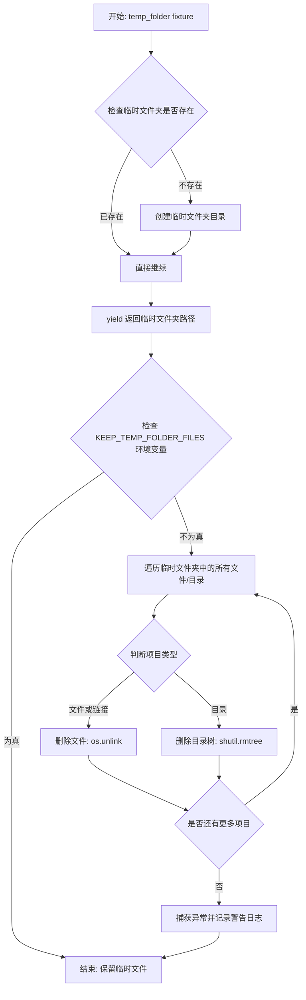

#### 带注释源码

```python
@pytest.fixture(autouse=True)
def temp_folder() -> Generator[Path, None, None]:
    """
    Pytest fixture that sets up and tears down the temporary folder for each test.
    It is automatically used in every test due to the 'autouse=True' parameter.
    """
    # === Setup 阶段 (yield 之前) ===
    # 检查配置中的临时文件夹路径是否存在
    if not os.path.exists(agbenchmark_config.temp_folder):
        # 如果不存在，则创建目录（包含父目录）
        os.makedirs(agbenchmark_config.temp_folder, exist_ok=True)

    # === Teardown 阶段 (yield 之后) ===
    # 将临时文件夹路径 yield 出去供测试使用
    yield agbenchmark_config.temp_folder
    
    # 测试完成后，检查是否需要保留临时文件
    # 如果未设置 KEEP_TEMP_FOLDER_FILES 环境变量，则清理临时文件夹
    if not os.getenv("KEEP_TEMP_FOLDER_FILES"):
        # 遍历临时文件夹中的所有文件
        for filename in os.listdir(agbenchmark_config.temp_folder):
            # 拼接完整的文件路径
            file_path = os.path.join(agbenchmark_config.temp_folder, filename)
            try:
                # 判断是文件/链接还是目录
                if os.path.isfile(file_path) or os.path.islink(file_path):
                    # 删除文件或符号链接
                    os.unlink(file_path)
                elif os.path.isdir(file_path):
                    # 递归删除目录及其内容
                    shutil.rmtree(file_path)
            except Exception as e:
                # 捕获删除失败异常并记录警告日志
                logger.warning(f"Failed to delete {file_path}. Reason: {e}")
```


### `check_regression`

Fixture 检查每个测试是否应被视为回归测试，并根据该条件决定是否跳过该测试。它从 `request` 对象中检索测试名称，并从基准配置中指定的路径加载回归报告。

参数：

-  `request`：`pytest.FixtureRequest`，pytest 请求对象，用于获取测试名称和基准配置信息

返回值：`None`，无返回值（fixture 用于执行测试前的检查和跳过逻辑）

#### 流程图

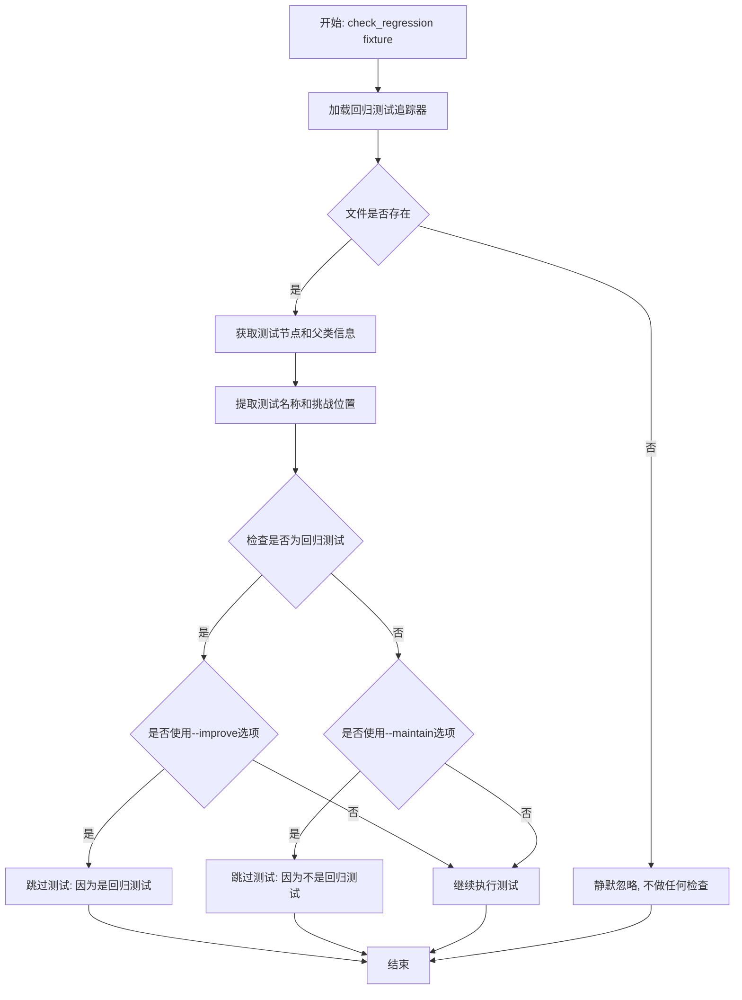

#### 带注释源码

```python
@pytest.fixture(autouse=True)
def check_regression(request: pytest.FixtureRequest) -> None:
    """
    Fixture that checks for every test if it should be treated as a regression test,
    and whether to skip it based on that.

    The test name is retrieved from the `request` object. Regression reports are loaded
    from the path specified in the benchmark configuration.

    Effect:
    * If the `--improve` option is used and the current test is considered a regression
      test, it is skipped.
    * If the `--maintain` option is used and the current test  is not considered a
      regression test, it is also skipped.

    Args:
        request: The request object from which the test name and the benchmark
            configuration are retrieved.
    """
    # 使用 suppress 静默处理文件不存在的情况
    with contextlib.suppress(FileNotFoundError):
        # 创建回归测试追踪器,加载回归测试文件
        rt_tracker = RegressionTestsTracker(agbenchmark_config.regression_tests_file)

        # 验证请求节点的类型
        assert isinstance(request.node, pytest.Function)
        assert isinstance(request.node.parent, pytest.Class)
        
        # 从测试请求中提取测试名称
        test_name = request.node.parent.name
        # 获取挑战位置属性
        challenge_location = getattr(request.node.cls, "CHALLENGE_LOCATION", "")
        # 构建跳过消息字符串
        skip_string = f"Skipping {test_name} at {challenge_location}"

        # 检查测试名称是否存在于回归测试中
        is_regression_test = rt_tracker.has_regression_test(test_name)
        
        # 根据命令行选项决定是否跳过测试
        if request.config.getoption("--improve") and is_regression_test:
            # 如果使用--improve且测试是回归测试,则跳过
            pytest.skip(f"{skip_string} because it's a regression test")
        elif request.config.getoption("--maintain") and not is_regression_test:
            # 如果使用--maintain且测试不是回归测试,则跳过
            pytest.skip(f"{skip_string} because it's not a regression test")
```


### `mock`

该 fixture 用于从命令行获取 `--mock` 选项的值，以便在测试会话期间确定是否以模拟模式运行测试。

参数：

- `request`：`pytest.FixtureRequest`，用于从中获取 `--mock` 选项值的 Pytest FixtureRequest 对象

返回值：`bool`，返回本次会话是否设置了 `--mock` 选项

#### 流程图

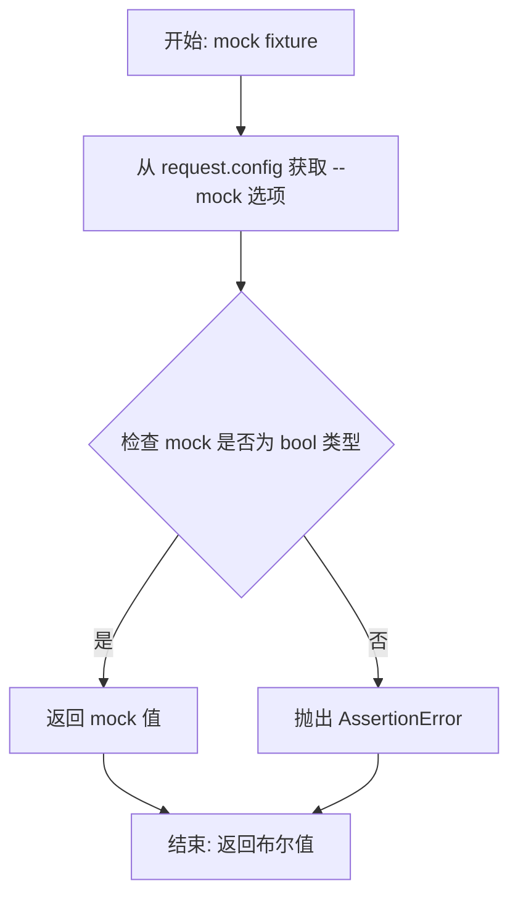

#### 带注释源码

```python
@pytest.fixture(autouse=True, scope="session")
def mock(request: pytest.FixtureRequest) -> bool:
    """
    Pytest fixture that retrieves the value of the `--mock` command-line option.
    The `--mock` option is used to run the tests in mock mode.

    Args:
        request: The `pytest.FixtureRequest` from which the `--mock` option value
            is retrieved.

    Returns:
        bool: Whether `--mock` is set for this session.
    """
    # 从 pytest 配置中获取 --mock 命令行选项的值
    mock = request.config.getoption("--mock")
    # 断言确保获取到的 mock 值是布尔类型，增强代码健壮性
    assert isinstance(mock, bool)
    # 返回 mock 选项的布尔值，供测试使用
    return mock
```

## 关键组件


### 回归测试跟踪器 (RegressionTestsTracker)

用于加载和管理回归测试列表，判断特定测试是否为回归测试，以便在 `--improve` 和 `--maintain` 模式下进行过滤。

### 测试报告管理器 (Test Report Management)

负责为每个挑战生成空报告，在测试执行过程中添加测试结果，并在会话结束时 finalize 和保存报告。

### 超时监控器 (Timeout Monitor)

在独立线程中运行，监控测试套件的总执行时间，当超过 GLOBAL_TIMEOUT (25分钟) 时主动退出 pytest，防止测试无限运行。

### 临时文件夹管理 (Temp Folder Management)

Pytest fixture 自动创建和清理临时文件夹，用于存放测试过程中的临时文件，支持通过 KEEP_TEMP_FOLDER_FILES 环境变量保留文件。

### 命令行选项解析器 (Pytest Options)

通过 `pytest_addoption` 添加 agbenchmark 特定的命令行选项，包括 --mock, --host, --category, --test, --improve, --maintain, --explore 等，用于控制测试行为。

### 测试收集与过滤引擎 (Test Collection & Filtering)

`pytest_collection_modifyitems` 钩子负责根据挑战信息、回归测试状态、历史通过情况、依赖关系和分类对测试进行过滤和标记。

### 会话生命周期管理 (Session Lifecycle)

通过 `pytest_sessionstart` 和 `pytest_sessionfinish` 钩子管理测试会话的启动和结束，包括初始化超时监控线程和保存最终报告。

### 配置加载器 (AgentBenchmarkConfig)

全局配置对象 `agbenchmark_config` 存储基准测试的各种配置，包括临时文件夹路径、回归测试文件路径等。

### 依赖标记管理器 (Dependency Marker)

根据挑战的依赖关系自动添加 pytest 依赖标记，确保测试按依赖顺序执行，支持忽略依赖的场景。

### 分类标记系统 (Category Marker System)

根据挑战所属分类自动添加标记，支持可选分类的过滤，并注册 Category 枚举中的所有分类以防止警告。


## 问题及建议


### 已知问题

-   **类型注解不准确**: `selected_tests: tuple[str]` 和 `selected_categories: tuple[str]` 实际返回类型可能是 `list` 或 `None`，导致类型检查失效
-   **类型比较使用 `is` 而非 `isinstance`**: `type(n) is str` 应改为 `isinstance(n, str)`，`type(n) is str` 在某些边界情况下不可靠
-   **空值处理缺失**: `metafunc.config.getoption("-N")` 返回可能为 `None`，当 `n` 为 `None` 时 `int(n)` 会抛出异常
- **循环中修改列表**: `while i < len(items)` 循环内使用 `items.remove(item)`，这不是高效的做法且容易出错
- **重复实例化对象**: `pytest_collection_modifyitems` 每次都创建新的 `RegressionTestsTracker` 实例，应考虑缓存或重用
- **重复调用配置方法**: 循环中多次调用 `config.getoption()` 而不缓存结果，造成不必要的开销
- **全局可变状态**: `test_reports: dict[str, Test] = {}` 作为全局变量存在线程安全隐患，多个测试并行执行时可能产生竞态条件
- **过度使用异常抑制**: `check_regression` 中使用 `contextlib.suppress(FileNotFoundError)` 吞掉所有异常，可能隐藏潜在问题
- **日志级别不一致**: 某些地方使用 `logger.warning`，某些地方使用 `logger.debug`，缺乏统一的日志策略

### 优化建议

-   **修复类型注解**: 使用 `Optional[List[str]]` 替代 `tuple[str]`，并添加适当的类型转换逻辑
-   **改进空值处理**: 为 `getoption` 调用添加默认值处理，如 `n = metafunc.config.getoption("-N", default=1)`
-   **优化列表修改逻辑**: 考虑使用列表推导式生成新的列表，或使用 `enumerate` 配合 `pop` 操作
-   **提取配置缓存**: 在函数开始时缓存 `config.getoption()` 的结果，避免重复调用
-   **考虑线程安全**: 使用 `threading.Lock` 保护 `test_reports` 全局字典，或使用 pytest 的 `setup` 阶段
-   **拆分大型函数**: `pytest_collection_modifyitems` 函数过长（约150行），应拆分为多个辅助函数
-   **统一日志级别**: 制定日志规范，确保相同类型的消息使用一致的日志级别
-   **改进错误处理**: 区分不同类型的异常，进行有针对性的处理而非一概忽略
-   **提取魔法数字**: 将 `GLOBAL_TIMEOUT` 之外的其他常量（如 `1500`）提取为命名常量，提高代码可读性
-   **添加更多类型注解**: 部分变量如 `challenge`、`challenge_name` 等缺乏类型注解，应补充完整


## 其它


### 设计目标与约束

本代码是agbenchmark测试框架的核心配置文件（conftest.py），主要设计目标包括：1）通过pytest框架实现自动化基准测试；2）支持测试分类、依赖管理、回归测试追踪；3）提供灵活的命令行选项控制测试行为；4）实现测试超时控制和报告生成。约束条件包括：测试必须在25分钟内完成（ GLOBAL_TIMEOUT=1500秒），依赖pytest框架，必须继承BaseChallenge类才能被识别为有效测试。

### 错误处理与异常设计

代码中的错误处理采用多种策略：**FileNotFoundError处理**：在加载JSON文件和挑战数据时使用try-except捕获FileNotFoundError，设置空字典为默认值（challenges_beaten_in_the_past）；**临时文件清理异常**：在teardown阶段捕获删除文件的异常并记录warning日志；**contextlib.suppress**：使用suppress静默处理回归测试文件不存在的情况；**断言验证**：对request.node类型、mock选项类型进行断言检查。

### 数据流与状态机

测试执行流程分为以下阶段：**Collection阶段**（pytest_collection_modifyitems）：收集测试项，根据命令行选项过滤测试，处理依赖关系和分类标记；**Setup阶段**（temp_folder fixture）：创建临时目录；**Call阶段**（pytest_runtest_makereport）：执行测试并记录结果；**Session阶段**（pytest_sessionstart/finish）：启动超时监控线程，生成最终报告。状态转换通过pytest的内置机制（setup→call→teardown）管理。

### 外部依赖与接口契约

本模块依赖以下外部组件：**agbenchmark.challenges.BaseChallenge**：测试必须继承的基类；**agbenchmark.config.AgentBenchmarkConfig**：配置管理类；**agbenchmark.reports.ReportManager.RegressionTestsTracker**：回归测试追踪器；**agbenchmark.reports.reports**：报告生成相关函数；**agbenchmark.utils.data_types.Category**：测试分类枚举；**pytest框架**：核心测试框架。接口契约要求：挑战类必须提供info属性包含eval_id、name、category、dependencies等字段。

### 配置管理

配置通过AgentBenchmarkConfig.load()单例模式加载，主要配置项包括：temp_folder（临时文件夹路径）、regression_tests_file（回归测试文件路径）、challenges_already_beaten_file（历史通过挑战记录）、categories（可选分类列表）。命令行选项通过pytest_addoption注册，包括--mock、--host、--category、--test、--improve、--maintain、--explore、--no-dep、--cutoff、--nc、--attempts、--keep-answers等。

### 测试隔离机制

测试隔离通过以下机制实现：**临时文件夹隔离**：每个测试模块使用temp_folder fixture，在测试前后创建/清理临时目录；**环境变量控制**：KEEP_TEMP_FOLDER_FILES环境变量可保留临时文件用于调试；**依赖标记**：使用pytest.mark.depends标记测试依赖关系；**回归测试追踪**：通过RegressionTestsTracker隔离回归测试和改进测试的执行。

### 并发与同步

代码中存在以下并发机制：**超时监控线程**：timeout_monitor函数在独立线程中运行，每秒检查一次是否超过全局超时（25分钟），超时后调用pytest.exit终止测试；**Daemon线程**：监控线程设置为daemon=True，确保程序退出时自动终止；**线程参数传递**：通过threading.Thread传递start_time参数。

### 性能优化空间

当前实现的性能考量包括：**即时检查循环**：timeout_monitor每秒检查一次，可考虑使用更精确的睡眠策略；**JSON加载优化**：challenges_beaten_in_the_past在每次collection时重新读取，可考虑缓存；**回归测试追踪器**：每个钩子函数都创建新实例，可考虑复用。

### 安全性考虑

安全相关设计：**文件操作安全**：删除临时文件时检查文件类型（文件/链接/目录）；**环境变量处理**：使用os.getenv获取环境变量而非直接访问；**路径安全**：使用pathlib.Path进行路径操作。

### 扩展性设计

框架提供以下扩展点：**pytest标记系统**：支持自定义marker（如category marker、depends marker）；**fixture系统**：可添加自定义fixture扩展测试行为；**钩子函数**：提供多个pytest钩子点（pytest_runtest_makereport、pytest_collection_modifyitems等）用于定制；**配置驱动**：通过配置文件和命令行选项灵活控制行为。

### 测试报告机制

报告生成流程：**空报告创建**：make_empty_test_report创建初始报告结构；**结果填充**：add_test_result_to_report在测试调用阶段填充实际结果；**会话结束**：pytest_sessionfinish调用session_finish完成最终报告生成和保存。报告数据存储在test_reports字典中，以challenge_id为键。

### 依赖管理策略

依赖管理通过以下逻辑实现：**依赖标记**：使用pytest.mark.depends(on=dependencies)标记测试依赖；**过滤策略**：根据--test、--no-dep、--maintain、--improve选项决定是否处理依赖；**可选依赖**：通过OPTIONAL_CATEGORIES支持可选分类的挑战。


    