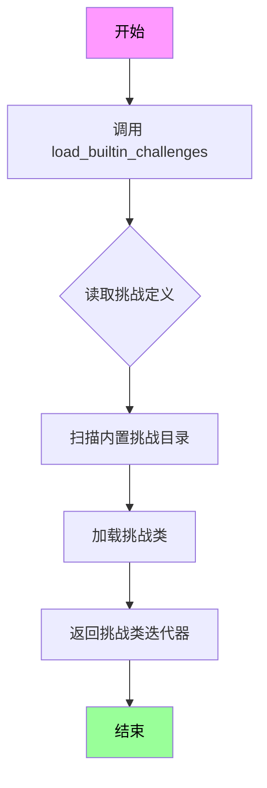
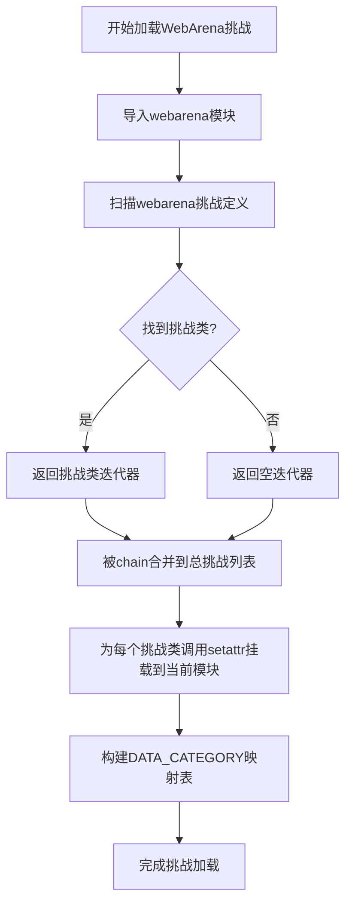

# `.\AutoGPT\classic\benchmark\agbenchmark\generate_test.py` 详细设计文档

AGBenchmark的pytest测试发现端点模块，通过动态加载builtin和webarena两类的挑战测试类，并将其附加到当前模块以供pytest发现和收集符合Test*命名模式的测试类，同时构建挑战名称到主要类别的映射字典。

## 整体流程

```mermaid
graph TD
    A[开始] --> B[导入依赖模块]
    B --> C[调用load_builtin_challenges加载内置挑战]
    C --> D[调用load_webarena_challenges加载WebArena挑战]
    D --> E[使用chain合并两个挑战迭代器]
    E --> F{遍历每个challenge}
    F --> G[动态导入当前模块]
    G --> H[使用setattr将challenge类附加到模块]
    H --> I[构建DATA_CATEGORY映射: challenge.info.name -> category[0].value]
    I --> J{还有更多challenge?}
    J -- 是 --> F
    J -- 否 --> K[结束]
```

## 类结构

```
无类定义 (纯模块级代码)
```

## 全局变量及字段


### `logger`
    
模块级日志记录器，用于记录该模块的运行日志

类型：`logging.Logger`
    


### `DATA_CATEGORY`
    
全局字典，存储挑战名称到主要类别的映射，用于组织和分类测试挑战

类型：`dict`
    


    

## 全局函数及方法


### `load_builtin_challenges`

加载内置挑战函数，从 agbenchmark.challenges.builtin 模块中获取所有内置的挑战测试类，用于 pytest 测试发现。

参数：

- 该函数无参数

返回值：`Iterator[Type[TestChallenge]]` 或 `List[Type[TestChallenge]]`，返回一个可迭代的挑战类集合，每个类都符合 `Test*` 命名模式，可被 pytest 发现和执行

#### 流程图



#### 带注释源码

```python
# 该函数定义在 agbenchmark.challenges.builtin 模块中
# 当前代码片段仅展示其导入和使用方式

from agbenchmark.challenges.builtin import load_builtin_challenges
# 导入内置挑战加载函数

# 在模块级别被调用，用于 pytest 测试发现
for challenge in chain(load_builtin_challenges(), load_webarena_challenges()):
    # 遍历所有内置和网络竞技场挑战
    module = importlib.import_module(__name__)
    # 动态导入当前模块
    
    setattr(module, challenge.__name__, challenge)
    # 将挑战类以 challenge.__name__ 为名设置到当前模块属性
    # 使 pytest 能够通过模块属性发现测试类
    
    DATA_CATEGORY[challenge.info.name] = challenge.info.category[0].value
    # 构建挑战名称到主要类别的映射字典
    # challenge.info.name 包含挑战的显示名称
    # challenge.info.category[0].value 是第一个分类的值
```

> **注意**：由于提供的代码片段仅包含 `load_builtin_challenges` 函数的导入和使用方式，未包含其实际函数体定义，因此无法提供完整的函数实现源码。该函数的具体实现需要查看 `agbenchmark/challenges/builtin.py` 模块文件。根据使用方式推断，该函数应返回一个可迭代的挑战类列表，每个类包含 `info` 属性用于存储元数据。


### `load_webarena_challenges`

该函数是AGBenchmark测试发现机制的核心组成部分，用于动态加载WebArena挑战类，并将这些挑战类附加到当前模块，以便Pytest能够自动发现和执行符合`Test*`模式的测试类。

参数：

- 无参数

返回值：`Iterator[Type[Test]]` 或 `List[Type[Test]]`，返回WebArena挑战类的迭代器，每个类都符合Pytest测试发现规范，可被自动收集执行

#### 流程图



#### 带注释源码

```python
# 注意：这是基于代码上下文推断的函数签名和功能
# 实际源码需要查看 agbenchmark/challenges/webarena 模块

def load_webarena_challenges():
    """
    加载WebArena挑战类集合
    
    该函数负责扫描webarena目录下的所有挑战定义，
    返回符合Test*命名规范的挑战类，供Pytest发现和执行。
    
    Returns:
        迭代器或列表：包含所有WebArena挑战类的可迭代对象
    """
    # 典型实现可能包含：
    # 1. 扫描webarena目录下的模块
    # 2. 查找继承自基础Challenge类的子类
    # 3. 过滤出符合命名规范的类
    # 4. 返回类对象而非实例
    pass
```

---

### 补充信息

#### 关键组件信息

| 组件名称 | 描述 |
|---------|------|
| `DATA_CATEGORY` | 全局字典，映射挑战名称到其主类别，用于测试组织和报告 |
| `chain()` | itertools工具函数，用于合并多个迭代器，实现Builtin和WebArena挑战的统一加载 |
| `importlib.import_module()` | 动态导入当前模块，用于将挑战类挂载到模块属性 |
| `setattr()` | 动态设置模块属性，使挑战类可被Pytest发现 |

#### 设计目标与约束

- **目标**：实现挑战类的自动化发现和加载，支持Pytest的测试收集机制
- **约束**：挑战类必须符合`Test*`命名模式才能被Pytest自动发现

#### 潜在技术债务与优化空间

1. **硬编码依赖**：直接导入`load_webarena_challenges`，缺乏插件化的挑战加载机制
2. **错误处理缺失**：未处理挑战类加载失败的情况，可能导致整个测试套件启动失败
3. **类别映射局限性**：`challenge.info.category[0].value`假设类别列表非空，未做防御性编程
4. **模块级别副作用**：在模块导入时直接执行挑战加载逻辑，不利于测试隔离

#### 外部依赖与接口契约

- **依赖模块**：`agbenchmark.challenges.builtin`、`agbenchmark.challenges.webarena`
- **接口契约**：返回对象必须是可迭代的Challenge类，且类名需匹配`Test*`模式

## 关键组件


### 挑战加载与发现模块

该模块是AGBenchmark的pytest测试发现端点，负责加载内置挑战和WebArena挑战，并通过动态模块属性将其附加到当前模块供pytest自动发现，同时构建挑战名称到主要类别的映射字典。

### 内置挑战加载器

通过`load_builtin_challenges()`函数加载AGBenchmark内置的挑战类集合。

### WebArena挑战加载器

通过`load_webarena_challenges()`函数加载WebArena相关的挑战类集合。

### 挑战类别映射

DATA_CATEGORY全局字典，键为挑战名称，值为该挑战的主要类别值。

### 动态模块属性设置

使用`importlib.import_module`和`setattr`将挑战类动态附加到当前模块，使pytest能够自动发现并收集符合`Test*`模式的挑战类。


## 问题及建议


### 已知问题

-   **全局变量重复初始化风险**：DATA_CATEGORY 在模块级别定义为空字典，每次模块被导入时都会被重置，可能导致状态不一致或测试环境中的意外行为
-   **缺少异常处理**：load_builtin_challenges() 和 load_webarena_challenges() 调用缺乏 try-except 保护，任意一个失败都会导致整个模块导入失败
-   **索引越界风险**：challenge.info.category[0] 假设 category 列表非空，如果为空会抛出 IndexError
-   **属性访问未验证**：直接访问 challenge.__name__、challenge.info.name、challenge.info.category，未验证这些属性是否存在
-   **循环内重复导入模块**：module = importlib.import_module(__name__) 在循环内部重复调用，虽然 Python 模块缓存机制使其不会重复加载，但代码结构不合理
-   **日志资源未使用**：导入了 logger 但从未使用，错失了记录挑战加载过程的机会

### 优化建议

-   **添加属性存在性检查**：在访问 challenge 属性前使用 hasattr() 或 try-except 验证必要属性是否存在
-   **为 category 访问添加默认值**：使用 challenge.info.category[0].value if challenge.info.category else "unknown" 或类似的防御性代码
-   **提取模块引用到循环外**：将 importlib.import_module(__name__) 移到循环外部，减少冗余操作
-   **添加日志记录**：使用 logger.info() 记录成功加载的挑战数量，logger.warning() 记录跳过或失败的挑战
-   **考虑异常隔离**：如果某个挑战加载失败不影响其他挑战，使用 try-except 包裹单个挑战的加载逻辑
-   **重构全局状态**：考虑将 DATA_CATEGORY 封装为函数返回值或使用类来管理，避免全局可变状态带来的副作用

## 其它


### 设计目标与约束

本模块的核心目标是为Pytest提供自动发现测试用例的功能。通过Pytest的`\*_test.py`文件匹配模式，该模块被自动加载，并将所有符合`Test*`模式的挑战类收集到测试框架中。约束条件包括：1) 模块必须在Pytest启动时被自动发现；2) 挑战类必须遵循`Test*`命名规范；3) 必须支持内置挑战和WebArena挑战两类来源。

### 错误处理与异常设计

代码中未包含显式的错误处理机制。在加载挑战类时，如果`load_builtin_challenges()`或`load_webarena_challenges()`抛出异常，将导致整个模块加载失败。可能的异常场景包括：导入模块不存在、挑战类格式不符合预期、`challenge.info`属性缺失等。建议添加try-except块捕获ImportError、AttributeError等异常，并记录警告日志而非完全失败，使部分挑战仍可被加载。

### 数据流与状态机

数据流较为简单直接：首先调用`load_builtin_challenges()`和`load_webarena_challenges()`获取两组挑战类迭代器，通过`chain()`合并；然后遍历每个挑战类，使用`importlib.import_module(__name__)`获取当前模块引用；接着通过`setattr()`将挑战类动态添加到模块属性中，使其可被Pytest发现；最后从`challenge.info`中提取名称和类别，构建`DATA_CATEGORY`字典供外部查询。无复杂状态机设计，仅有加载完成后的静态状态。

### 外部依赖与接口契约

主要依赖包括：1) `importlib`标准库用于动态导入模块；2) `logging`标准库用于日志记录；3) `itertools.chain`用于合并迭代器；4) `agbenchmark.challenges.builtin.load_builtin_challenges`返回挑战类迭代器；5) `agbenchmark.challenges.webarena.load_webarena_challenges`返回挑战类迭代器。接口契约要求：挑战类必须具有`info`属性，`info`包含`name`(字符串)和`category`(枚举列表)字段，`category[0]`具有`value`属性。

### 性能考虑

模块在导入时同步加载所有挑战类，可能导致启动延迟。挑战类通过`setattr`动态添加到模块属性，可能影响内存占用。建议：1) 考虑惰性加载机制，仅在Pytest请求时加载；2) 缓存已加载的挑战类避免重复处理；3) 使用`__all__`明确导出列表以优化导入。

### 并发与线程安全

代码修改全局变量`DATA_CATEGORY`和模块属性，存在线程安全隐患。若多线程同时导入该模块，可能出现竞态条件导致数据不一致。建议使用线程锁保护全局状态的修改操作，或在文档中明确说明该模块应在单线程环境下被Pytest加载。

### 安全考量

代码通过`setattr`动态设置模块属性，理论上存在属性注入风险。若挑战类名称被恶意构造，可能覆盖模块原有属性。建议验证挑战类名称是否符合预期命名规范，避免覆盖关键模块属性。

### 配置与扩展性

当前配置通过代码硬编码，扩展性受限。若需添加新的挑战来源，需修改源码导入新的加载函数。建议：1) 将挑战来源配置化，支持插件式加载；2) 提供配置接口允许外部注册自定义挑战加载器；3) 支持通过环境变量或配置文件控制是否加载特定来源的挑战。

### 测试策略

建议为该模块编写单元测试，验证：1) 模块成功导入不抛出异常；2) `DATA_CATEGORY`字典正确构建；3) 挑战类正确绑定到模块属性；4) 空挑战列表场景下的行为；5) 模拟挑战类缺失必要属性时的容错能力。可使用`unittest.mock`模拟挑战加载函数。


    