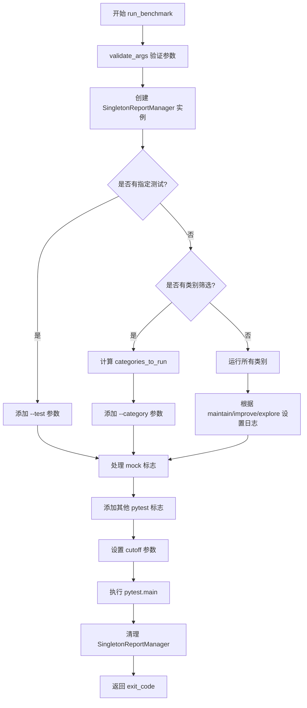
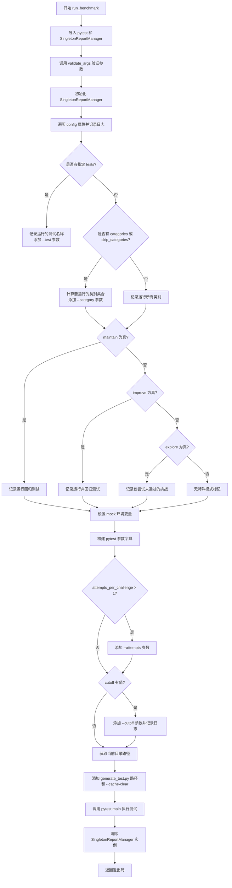
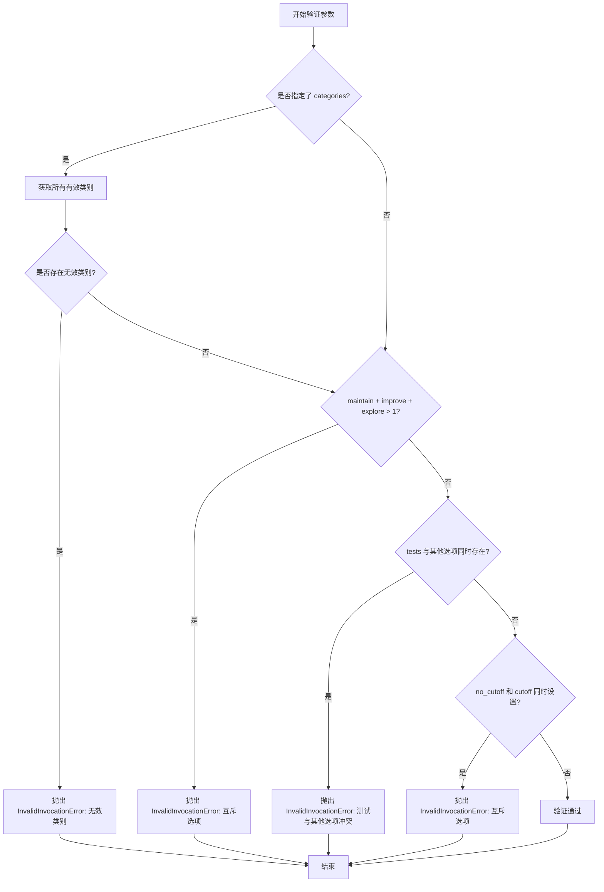

# `.\AutoGPT\classic\benchmark\agbenchmark\main.py` 详细设计文档

这是一个AI Agent基准测试运行器，通过pytest框架执行各类测试挑战，支持按类别筛选、回归测试、非回归测试、探索模式等多种运行策略，并提供参数验证和报告管理功能。

## 整体流程



## 类结构

```
InvalidInvocationError (自定义异常类)
└── ValueError (内置异常基类)
```

## 全局变量及字段


### `logger`
    
A module-level logger instance used for logging debug and info messages throughout this module.

类型：`logging.Logger`
    


    

## 全局函数及方法


### `run_benchmark`

该函数是基准测试的入口点，负责解析命令行参数、验证输入、配置pytest运行环境，并执行指定的测试任务。它支持按类别筛选测试、运行特定测试、处理回归/非回归测试场景，并返回pytest的执行退出码。

参数：

- `config`：`AgentBenchmarkConfig`，基准测试配置对象，包含代理基准测试所需的全部配置信息
- `maintain`：`bool`，是否仅运行回归测试（维护模式），默认为False
- `improve`：`bool`，是否仅运行非回归测试（改进模式），默认为False
- `explore`：`bool`，是否仅尝试从未通过过的挑战，默认为False
- `tests`：`tuple[str, ...]`，要运行的特定测试名称元组，默认为空元组
- `categories`：`tuple[str, ...]`，要运行的类别元组，默认为空元组
- `skip_categories`：`tuple[str, ...]`，要跳过的类别元组，默认为空元组
- `attempts_per_challenge`：`int`，每个挑战的最大尝试次数，默认为1
- `mock`：`bool`，是否使用模拟模式运行测试，默认为False
- `no_dep`：`bool`，是否跳过依赖检查，默认为False
- `no_cutoff`：`bool`，是否禁用时间限制，默认为False
- `cutoff`：`Optional[int]`，自定义时间限制（秒），默认为None
- `keep_answers`：`bool`，是否保留测试答案文件，默认为False
- `server`：`bool`，是否以服务器模式运行，默认为False

返回值：`int`，pytest执行进程的退出码，0表示成功，非0表示有测试失败或发生错误

#### 流程图



#### 带注释源码

```python
def run_benchmark(
    config: AgentBenchmarkConfig,
    maintain: bool = False,
    improve: bool = False,
    explore: bool = False,
    tests: tuple[str, ...] = tuple(),
    categories: tuple[str, ...] = tuple(),
    skip_categories: tuple[str, ...] = tuple(),
    attempts_per_challenge: int = 1,
    mock: bool = False,
    no_dep: bool = False,
    no_cutoff: bool = False,
    cutoff: Optional[int] = None,
    keep_answers: bool = False,
    server: bool = False,
) -> int:
    """
    Starts the benchmark. If a category flag is provided, only challenges with the
    corresponding mark will be run.
    """
    import pytest  # 延迟导入 pytest，避免模块级别依赖

    from agbenchmark.reports.ReportManager import SingletonReportManager

    # 验证命令行参数的合法性
    validate_args(
        maintain=maintain,
        improve=improve,
        explore=explore,
        tests=tests,
        categories=categories,
        skip_categories=skip_categories,
        no_cutoff=no_cutoff,
        cutoff=cutoff,
    )

    # 初始化报告管理器单例
    SingletonReportManager()

    # 调试模式下输出配置的所有属性
    for key, value in vars(config).items():
        logger.debug(f"config.{key} = {repr(value)}")

    pytest_args = ["-vs"]  # pytest 基础参数：详细输出 + 捕获标准输出

    if tests:
        # 如果指定了具体测试，直接运行这些测试
        logger.info(f"Running specific test(s): {' '.join(tests)}")
        pytest_args += [f"--test={t}" for t in tests]
    else:
        # 获取所有可用的测试类别
        all_categories = get_unique_categories()

        if categories or skip_categories:
            # 处理类别过滤逻辑
            categories_to_run = set(categories) or all_categories
            if skip_categories:
                # 从要运行的类别中排除跳过的类别
                categories_to_run = categories_to_run.difference(set(skip_categories))
            assert categories_to_run, "Error: You can't skip all categories"
            pytest_args += [f"--category={c}" for c in categories_to_run]
            logger.info(f"Running tests of category: {categories_to_run}")
        else:
            logger.info("Running all categories")

        # 处理测试模式：维护/改进/探索只能选其一
        if maintain:
            logger.info("Running only regression tests")
        elif improve:
            logger.info("Running only non-regression tests")
        elif explore:
            logger.info("Only attempt challenges that have never been beaten")

    if mock:
        # TODO: unhack
        # 设置环境变量以启用模拟模式（临时解决方案）
        os.environ["IS_MOCK"] = "True"

    # 将命令行标志传递给 pytest
    for flag, active in {
        "--maintain": maintain,
        "--improve": improve,
        "--explore": explore,
        "--no-dep": no_dep,
        "--mock": mock,
        "--nc": no_cutoff,
        "--keep-answers": keep_answers,
    }.items():
        if active:
            pytest_args.append(flag)

    # 如果指定了每个挑战的尝试次数，添加到参数中
    if attempts_per_challenge > 1:
        pytest_args.append(f"--attempts={attempts_per_challenge}")

    # 如果指定了自定义超时时间
    if cutoff:
        pytest_args.append(f"--cutoff={cutoff}")
        logger.debug(f"Setting cuttoff override to {cutoff} seconds.")

    # 构建测试文件路径并添加到 pytest 参数
    current_dir = Path(__file__).resolve().parent
    pytest_args.append(str(current_dir / "generate_test.py"))

    pytest_args.append("--cache-clear")  # 清除缓存确保全新运行
    logger.debug(f"Running Pytest with args: {pytest_args}")
    
    # 执行 pytest 并获取退出码
    exit_code = pytest.main(pytest_args)

    # 清理报告管理器实例
    SingletonReportManager.clear_instance()
    return exit_code
```


### `validate_args`

该函数用于验证运行基准测试时传入的命令行参数组合是否合法。它检查无效的类别、互斥的标志组合（如 --maintain、--improve、--explore 不能同时使用），以及测试与其他过滤选项的冲突。

参数：

- `maintain`：`bool`，表示是否只运行回归测试
- `improve`：`bool`，表示是否只运行非回归测试
- `explore`：`bool`，表示是否只尝试从未被攻克过的挑战
- `tests`：`Sequence[str]`，指定要运行的特定测试
- `categories`：`Sequence[str]`，指定要运行的类别
- `skip_categories`：`Sequence[str]`，指定要跳过的类别
- `no_cutoff`：`bool`，表示是否禁用超时限制
- `cutoff`：`Optional[int]`，设置超时时间（秒）

返回值：`None`，该函数不返回任何值，仅通过抛出 `InvalidInvocationError` 来指示参数错误。

#### 流程图



#### 带注释源码

```python
def validate_args(
    maintain: bool,
    improve: bool,
    explore: bool,
    tests: Sequence[str],
    categories: Sequence[str],
    skip_categories: Sequence[str],
    no_cutoff: bool,
    cutoff: Optional[int],
) -> None:
    """
    验证 benchmark 运行参数的合法性。
    
    参数:
        maintain: 是否只运行回归测试
        improve: 是否只运行非回归测试
        explore: 是否只尝试从未被攻克过的挑战
        tests: 指定要运行的测试列表
        categories: 指定要运行的类别列表
        skip_categories: 指定要跳过的类别列表
        no_cutoff: 是否禁用超时限制
        cutoff: 手动设置的超时时间（秒）
    
    异常:
        InvalidInvocationError: 当参数组合非法时抛出
    """
    # 检查类别有效性：如果指定了 categories，验证是否都是有效类别
    if categories:
        all_categories = get_unique_categories()  # 获取所有有效类别
        invalid_categories = set(categories) - all_categories  # 计算无效类别集合
        if invalid_categories:
            raise InvalidInvocationError(
                "One or more invalid categories were specified: "
                f"{', '.join(invalid_categories)}.\n"
                f"Valid categories are: {', '.join(all_categories)}."
            )

    # 检查互斥选项：maintain、improve、explore 只能同时使用一个
    if (maintain + improve + explore) > 1:
        raise InvalidInvocationError(
            "You can't use --maintain, --improve or --explore at the same time. "
            "Please choose one."
        )

    # 检查测试与其他过滤选项的冲突：指定具体测试时不能使用其他过滤条件
    if tests and (categories or skip_categories or maintain or improve or explore):
        raise InvalidInvocationError(
            "If you're running a specific test make sure no other options are "
            "selected. Please just pass the --test."
        )

    # 检查超时选项互斥：no_cutoff 和 cutoff 不能同时使用
    if no_cutoff and cutoff:
        raise InvalidInvocationError(
            "You can't use both --nc and --cutoff at the same time. "
            "Please choose one."
        )
```


```json
{
  "reasoning": "用户要求我从给定代码中提取 `load_dotenv` 函数的信息。查看代码后，我发现 `load_dotenv` 不是在这个文件中定义的，而是从外部库 `dotenv` 导入的。代码中只是使用了 `from dotenv import load_dotenv` 导入，然后在模块级别调用了 `load_dotenv()`。\n\n我需要基于 dotenv 库的标准实现来提供这个函数的信息。在 Python 的 dotenv 库中，`load_dotenv` 是一个用于加载 .env 文件的函数。\n\n让我整理一下需要的信息：\n- 函数名：load_dotenv\n- 参数：dotenv 库的 load_dotenv 函数有多个可选参数\n- 返回值：bool 类型\n- 流程图：展示加载 .env 文件并设置环境变量的过程\n- 源码：展示代码中如何使用这个函数",
  "content": "### `load_dotenv`\n\n`load_dotenv` 是从外部库 `dotenv` 导入的函数，用于从 `.env` 文件加载环境变量到 `os.environ` 中。在这个代码中，它在模块加载时执行，用于预先配置应用程序所需的环境变量。\n\n参数：\n- `dotenv_path`：`Union[str, Path, None]`，可选，`.env` 文件的路径，默认为当前目录或祖先目录中的 `.env` 文件\n- `stream`：`IO[str | None]`，可选，用于读取环境变量的文件流\n- `verbose`：`bool`，可选，如果为 `True`，则打印加载的环境变量，默认为 `False`\n- `override`：`bool`，可选，如果为 `True`，则覆盖已存在的环境变量，默认为 `False`\n- `encoding`：`str | None]`，可选，`.env` 文件的编码，默认为 `'utf-8'`\n\n返回值：`bool`，如果成功加载了 `.env` 文件则返回 `True`，否则返回 `False`\n\n#### 流程图\n\n```mermaid\nflowchart TD\n    A[开始] --> B{检查 .env 文件是否存在}\n    B -->|存在| C[打开 .env 文件]\n    B -->|不存在| D[返回 False]\n    C --> E{逐行读取文件}\n    E -->|有效行| F[解析 KEY=VALUE 格式]\n    E -->|无效行| G[跳过该行]\n    F --> H{检查 override 标志}\n    H -->|override=True| I[覆盖现有环境变量]\n    H -->|override=False| J{环境变量是否已存在}\n    J -->|已存在| K[保留现有值]\n    J -->|不存在| L[设置新值]\n    I --> M[将变量添加到 os.environ]\n    L --> M\n    K --> E\n    G --> E\n    M --> E\n    E -->|文件结束| N[返回 True]\n```\n\n#### 带注释源码\n\n```python\n# 从 dotenv 库导入 load_dotenv 函数\n# dotenv 库用于从 .env 文件加载环境变量\nfrom dotenv import load_dotenv\n\n# 在模块加载时立即调用 load_dotenv()\n# 这会查找并加载项目根目录下的 .env 文件\n# 将 .env 文件中的键值对设置为环境变量\n# 这样后续代码可以通过 os.environ 访问这些配置\nload_dotenv()\n\n# 其他代码...\n```\n\n#### 在当前代码中的使用上下文\n\n```python\nimport logging\nimport os\nfrom pathlib import Path\nfrom typing import Optional, Sequence\n\n# 导入 dotenv 库的 load_dotenv 函数\nfrom dotenv import load_dotenv\n\n# 导入项目内部模块\nfrom agbenchmark.challenges import get_unique_categories\nfrom agbenchmark.config import AgentBenchmarkConfig\n\n# 模块初始化时加载 .env 文件中的环境变量\n# 这是 Python 项目的常见做法，用于管理配置\nload_dotenv()\n\nlogger = logging.getLogger(__name__)\n\n# ... 其余代码 ...\n```\n\n#### 技术说明\n\n`load_dotenv()` 函数调用是此模块的初始化步骤，它确保在运行任何基准测试之前，所有配置都已从 `.env` 文件加载到环境变量中。这是配置管理的一种常见模式，允许敏感信息（如 API 密钥、数据库凭证等）存储在 `.env` 文件中，而不需要硬编码在源代码中。\n\n这种设计允许：\n1. **配置与代码分离**：敏感配置存储在版本控制系统之外的 `.env` 文件中\n2. **环境一致性**：不同开发者可以使用不同的配置而不影响代码库\n3. **部署灵活性**：轻松切换生产、开发和测试环境"
}
```

## 关键组件


### run_benchmark 函数

基准测试的主入口函数，负责初始化配置、构建pytest参数、验证输入并执行测试套件。

### validate_args 函数

参数验证逻辑，用于校验命令行参数的合法性，包括类别有效性、互斥标志检查和 cutoff 参数冲突检测。

### InvalidInvocationError 异常类

自定义异常类型，用于处理无效的函数调用参数，提供清晰的错误信息。

### 命令行参数解析与标志传递系统

解析 maintain、improve、explore、tests、categories、skip_categories 等参数，并将其转换为 pytest 命令行参数的系统。

### pytest 集成模块

与 pytest 框架的集成点，包括构建 pytest_args、调用 pytest.main() 执行测试、管理测试缓存等。

### 配置与日志输出系统

通过 logging 模块记录配置信息、测试进度和调试日志的系统，包括遍历 config 属性并输出的调试功能。

### 测试类别筛选系统

根据 categories 和 skip_categories 参数从 get_unique_categories() 获取所有类别，并执行集合运算来确定实际运行测试的系统。

### 单例报告管理器

使用 SingletonReportManager 模式管理测试报告的模块，用于生成和清理测试报告。

### 环境变量与标志注入系统

通过 os.environ 设置 IS_MOCK 等环境变量，以及通过字典迭代传递活动标志（--maintain、--improve 等）的系统。


## 问题及建议


### 已知问题

- **环境变量滥用**：`os.environ["IS_MOCK"] = "True"` 直接修改环境变量，代码中标注了"TODO: unhack"，这是一种丑陋的hack方式，应该通过参数传递或配置文件处理
- **魔法字符串和硬编码**：大量硬编码的字符串如 `"IS_MOCK"`、`"-vs"`、`"--test="`、`"--category="` 等散布在代码中，难以维护和扩展
- **pytest参数构建方式复杂**：通过字典和循环构建pytest参数列表，逻辑不够直观，可读性较差
- **日志信息不够详细**：`"Running all categories"` 只打印消息但没有实际列出所有类别，不利于调试
- **模块级副作用**：`load_dotenv()` 在模块导入时执行，可能导致意外的副作用，且无法控制加载时机
- **缺乏错误处理**：`pytest.main(pytest_args)` 的调用没有try-except包装，如果pytest本身出错，异常会直接传播
- **类型提示不完整**：`tests`、`categories` 等参数使用 `Sequence[str]` 但实际传入的是 `tuple[str, ...]`，类型一致性可以改进
- **Singleton使用不够清晰**：`SingletonReportManager` 的实例化与清理分散在代码中，clear_instance 的调用位置和时机需要明确
- **validate_args函数位置**：`validate_args` 定义为全局函数但只被 `run_benchmark` 使用，考虑是否应该作为内部函数或独立模块

### 优化建议

- **重构环境变量设置**：将mock模式通过参数传递到ReportManager或其他组件，避免全局环境变量污染
- **常量提取**：将所有硬编码的字符串提取为常量或配置类，提高可维护性
- **简化参数构建**：使用更直观的列表推导式或直接的字符串格式化构建pytest参数
- **增强日志**：在"Running all categories"时实际打印出所有类别名称，便于用户了解运行范围
- **延迟加载dotenv**：将 `load_dotenv()` 移到需要时才执行，或提供配置选项控制加载时机
- **添加错误处理**：用try-except包装 `pytest.main` 调用，提供更友好的错误信息
- **改进类型提示**：统一使用 `tuple[str, ...]` 替代 `Sequence[str]`，提高类型精确度
- **代码组织优化**：考虑将 `validate_args` 作为 `run_benchmark` 的内部函数或私有函数，减少全局命名空间污染

## 其它


### 设计目标与约束

本模块的设计目标是提供一个灵活的基准测试运行框架，支持按类别筛选测试、多次重试运行、配置测试超时时间等功能。核心约束包括：测试执行依赖于pytest框架，仅支持Python 3.x环境，必须通过AgentBenchmarkConfig配置对象传入配置参数，测试发现依赖agbenchmark.challenges模块的get_unique_categories函数获取可用类别。

### 错误处理与异常设计

错误处理采用自定义异常类InvalidInvocationError（继承自ValueError），用于参数校验失败时的错误报告。主要校验逻辑包括：验证categories参数是否为有效类别、确保maintain/improve/explore三个互斥标志最多同时指定一个、验证tests参数与其他筛选条件不共存、检查no_cutoff与cutoff参数不同时使用。所有校验失败时抛出InvalidInvocationError并携带明确的错误信息，指导用户正确调用API。

### 数据流与状态机

数据流从run_benchmark函数入口开始，首先加载环境变量，然后进行参数校验，初始化SingletonReportManager记录测试报告，根据传入的tests或categories参数构建pytest命令行参数集，最后调用pytest.main执行实际测试。状态机包含三个主要状态：初始化状态（参数验证）、准备状态（构建pytest参数）、执行状态（调用pytest执行测试），执行完成后返回退出码并清理SingletonReportManager实例。

### 外部依赖与接口契约

主要外部依赖包括：pytest框架用于执行测试、dotenv库用于加载.env环境变量、logging模块用于记录日志、pathlib.Path用于处理文件路径、typing模块用于类型注解。接口契约方面，run_benchmark函数接受AgentBenchmarkConfig对象和多个可选参数，返回int类型的pytest退出码；validate_args函数接受所有筛选参数，进行参数校验，校验失败抛出InvalidInvocationError异常。

### 配置管理

配置通过AgentBenchmarkConfig对象传入，使用vars(config).items()将配置对象转换为字典并逐条记录日志。环境变量通过load_dotenv()自动加载，mock模式通过修改os.environ["IS_MOCK"]环境变量传递。测试超时时间支持两种设置方式：通过no_cutoff禁用超时检测，或通过cutoff参数显式指定超时秒数。

### 测试执行策略

测试执行策略支持多种模式：当指定tests参数时运行特定测试；当指定categories或skip_categories时按类别筛选测试；否则运行所有类别。在类别筛选中，maintain标志表示仅运行回归测试，improve标志表示仅运行非回归测试，explore标志表示仅尝试从未成功过的挑战。attempts_per_challenge参数支持对单个挑战进行多次重试以验证稳定性。

### 日志与报告机制

日志记录使用Python标准logging模块，logger对象通过logging.getLogger(__name__)创建。日志级别包括debug级别记录配置参数和pytest参数，info级别记录测试运行模式选择，debug级别记录pytest实际执行的参数。SingletonReportManager用于管理测试报告的单例实例，在测试开始前初始化，在测试完成后调用clear_instance清理。

### 安全性考虑

安全性方面存在一个TODO标记的技术债务：使用os.environ["IS_MOCK"] = "True"这种直接修改环境变量的方式被认为是不优雅的hack，在从API调用时需要改进为更安全的方式。参数校验通过set集合运算检查无效类别，防止注入任意字符串到pytest参数中。

### 性能优化空间

性能优化考虑包括：pytest_args列表构建可以通过列表推导式优化，current_dir的Path对象在每次调用时重新计算可以考虑缓存，多次调用get_unique_categories()的结果可以缓存以避免重复查询。


    