# `.\AutoGPT\classic\benchmark\agbenchmark\reports\ReportManager.py` 详细设计文档

这是一个基准测试报告管理系统，通过单例模式管理会话报告、回归测试跟踪和成功率跟踪三个管理器，负责加载、保存和更新测试结果数据，并支持生成雷达图表和整体报告的最终化处理。

## 整体流程

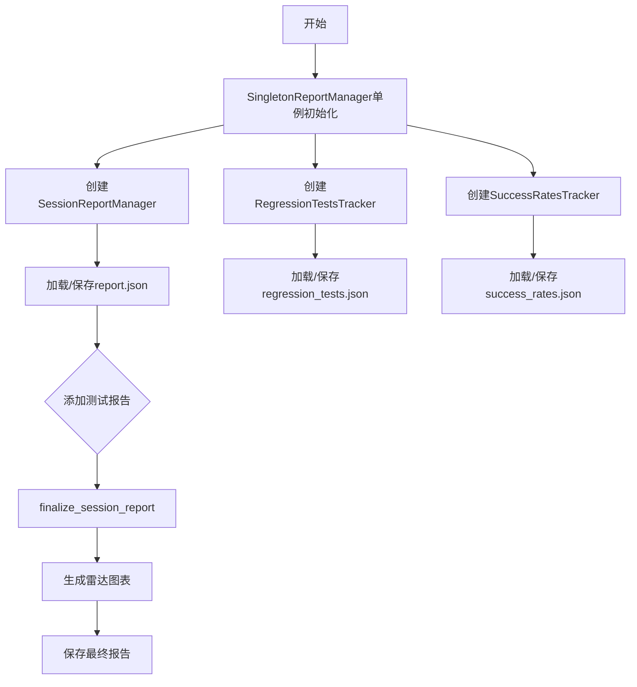

## 类结构

```
BaseReportManager (抽象基类)
├── SessionReportManager (会话报告管理器)
├── RegressionTestsTracker (回归测试跟踪器)
└── SuccessRatesTracker (成功率跟踪器)
SingletonReportManager (单例管理器)
```

## 全局变量及字段


### `logger`
    
用于记录日志的日志记录器实例

类型：`logging.Logger`
    


### `agent_benchmark_config`
    
代理基准测试配置对象，包含基准测试的相关配置信息

类型：`AgentBenchmarkConfig`
    


### `benchmark_start_time_dt`
    
基准测试的开始时间，存储为UTC时区的datetime对象

类型：`datetime`
    


### `command`
    
命令行参数，存储当前执行的命令字符串

类型：`str`
    


### `total_cost`
    
所有测试的总成本，计算所有测试结果的成本之和

类型：`float | int | None`
    


### `all_costs_none`
    
标记是否所有测试成本都为None的布尔标志

类型：`bool`
    


### `agent_categories`
    
按类别存储代理最高达成难度的字典，用于生成雷达图

类型：`dict`
    


### `SingletonReportManager.instance`
    
单例模式实例，存储SingletonReportManager的唯一实例

类型：`SingletonReportManager | None`
    


### `SingletonReportManager.INFO_MANAGER`
    
会话报告管理器，负责管理当前基准测试的会话报告

类型：`SessionReportManager`
    


### `SingletonReportManager.REGRESSION_MANAGER`
    
回归测试追踪器，负责追踪和管理回归测试

类型：`RegressionTestsTracker`
    


### `SingletonReportManager.SUCCESS_RATE_TRACKER`
    
成功率追踪器，负责追踪测试的成功率历史

类型：`SuccessRatesTracker`
    


### `BaseReportManager.tests`
    
测试数据字典，存储测试名称到测试详情的映射

类型：`dict[str, Any]`
    


### `BaseReportManager.report_file`
    
报告文件路径，指向存储测试报告的JSON文件路径

类型：`Path`
    


### `SessionReportManager.tests`
    
测试字典，存储测试名称到Test对象的映射

类型：`dict[str, Test]`
    


### `SessionReportManager.report`
    
会话报告对象，当会话报告最终化后存储完整的Report对象

类型：`Report | None`
    


### `SessionReportManager.start_time`
    
开始时间戳，记录会话开始的Unix时间戳用于计算运行时长

类型：`float`
    


### `SessionReportManager.benchmark_start_time`
    
基准测试开始时间，记录基准测试开始的datetime对象

类型：`datetime`
    


### `RegressionTestsTracker.tests`
    
回归测试数据字典，存储回归测试名称到测试详情的映射

类型：`dict[str, dict]`
    


### `SuccessRatesTracker.tests`
    
成功率历史字典，存储测试名称到成功/失败历史记录的映射

类型：`dict[str, list[bool | None]]`
    
    

## 全局函数及方法


### `get_highest_achieved_difficulty_per_category`

该函数用于从测试报告（Report）中提取每个测试类别的最高达成难度，并将结果返回以便生成雷达图可视化。

参数：

-  `report`：`Report`，测试报告对象，包含所有测试的运行结果和元数据

返回值：`dict[str, int]`，返回以类别名称为键、最高达成难度为值的字典，用于后续生成雷达图

#### 流程图

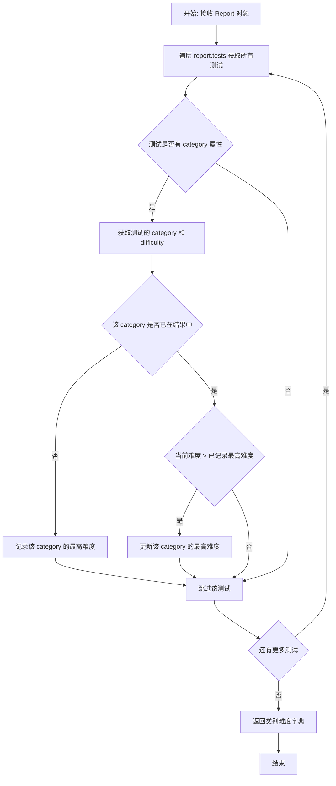

#### 带注释源码

```python
# 该函数定义在 agbenchmark.reports.processing.process_report 模块中
# 由于源代码未直接提供，以下为基于调用的推断实现

def get_highest_achieved_difficulty_per_category(report: Report) -> dict[str, int]:
    """
    从测试报告中获取每个类别达成的最高难度
    
    参数:
        report: 包含所有测试结果的Report对象
        
    返回:
        字典，键为类别名称，值为该类别中最高达成的难度等级
    """
    # 初始化结果字典
    agent_categories: dict[str, int] = {}
    
    # 遍历报告中的所有测试
    for test_name, test_data in report.tests.items():
        # 获取测试的类别信息
        # 假设 test_data 包含 category 和 difficulty 属性
        category = test_data.category
        difficulty = test_data.difficulty
        
        # 如果类别不在结果中，或者当前难度更高，则更新
        if category not in agent_categories or difficulty > agent_categories[category]:
            agent_categories[category] = difficulty
    
    return agent_categories
```

#### 使用示例

```python
# 在 SessionReportManager.finalize_session_report 方法中的调用
agent_categories = get_highest_achieved_difficulty_per_category(self.report)
if len(agent_categories) > 1:
    save_single_radar_chart(
        agent_categories,
        config.get_report_dir(self.benchmark_start_time) / "radar_chart.png",
    )
```

#### 关键组件信息

| 组件名称 | 一句话描述 |
|---------|-----------|
| `Report` | 测试报告数据模型，包含测试结果、元数据和配置信息 |
| `Test` | 单个测试的数据模型，包含测试名称、结果、类别和难度等信息 |
| `save_single_radar_chart` | 用于生成并保存单类别雷达图的函数 |

#### 潜在技术债务

1. **函数实现不可见**：该函数的实际实现代码未在当前代码文件中给出，建议补充完整实现以便于维护和理解
2. **类型推断**：由于源码缺失，无法确认返回的字典类型是否为 `dict[str, int]`，可能需要进一步确认
3. **错误处理**：未看到该函数对无效输入（如 None 值、缺失字段等）的异常处理逻辑


# 分析结果

### `save_single_radar_chart`

从提供的代码中，我无法找到 `save_single_radar_chart` 函数的实际实现。该函数是从 `agbenchmark.reports.processing.graphs` 模块导入的，在代码中仅有**调用**而非定义。

以下是基于调用上下文的分析：

参数：

-  `agent_categories`：`Any`（类型需查看 graphs 模块），表示按类别分类的最高成就难度数据
-  `output_path`：`Path`，雷达图表的输出保存路径（通过 `config.get_report_dir() / "radar_chart.png"` 构造）

返回值：`None` 或 `Path`，通常图表保存函数返回保存的文件路径或无返回值

#### 流程图

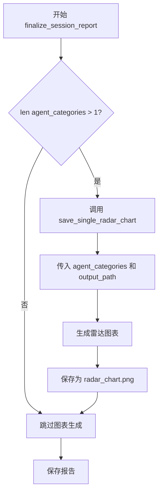

#### 带注释源码

```python
# 在 SessionReportManager.finalize_session_report 方法中的调用：
# 获取每个类别的最高难度
agent_categories = get_highest_achieved_difficulty_per_category(self.report)

# 仅当存在多个类别时生成雷达图
if len(agent_categories) > 1:
    save_single_radar_chart(
        agent_categories,  # 类别数据字典
        config.get_report_dir(self.benchmark_start_time) / "radar_chart.png",  # 输出路径
    )
```

---

**注意**：提供的代码片段仅包含 `save_single_radar_chart` 函数的**导入语句**和**调用点**，实际的函数定义位于 `agbenchmark/reports/processing/graphs.py` 模块中，未在当前代码片段中体现。如需完整的函数实现，请提供该模块的源代码。


### `get_highest_success_difficulty`

该函数用于从测试结果字典中获取最高成功难度的指标。它遍历所有测试结果，查找成功完成的测试，并返回其中难度最高的那个值。

参数：

-  `tests`：`dict[str, Test] | dict[str, Any]`，包含测试名称和测试对象的字典

返回值：`str` 或其他类型，返回最高成功难度值

#### 流程图

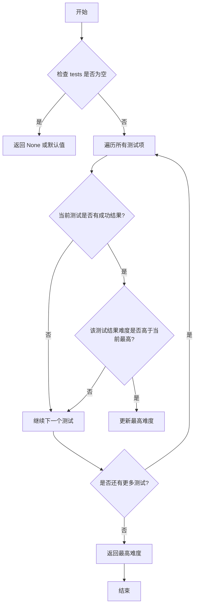

#### 带注释源码

```python
# 注意: 此函数定义在 agbenchmark.utils.utils 模块中, 当前代码中为导入使用
# 以下为基于使用场景的推断实现

def get_highest_success_difficulty(tests: dict[str, Any]) -> str | None:
    """
    从测试字典中获取最高成功难度
    
    参数:
        tests: 测试名称到测试对象的映射字典
               测试对象应包含 results 列表, 每个结果包含 success 和 difficulty 字段
    
    返回:
        成功完成的测试中的最高难度值, 如果没有成功则返回 None
    """
    highest_difficulty = None
    
    # 遍历所有测试
    for test_name, test_data in tests.items():
        # 获取测试结果列表
        results = test_data.results if hasattr(test_data, 'results') else test_data.get('results', [])
        
        # 遍历每个测试的所有运行结果
        for result in results:
            # 检查测试是否成功
            if result.success:  # 或 result.get('success')
                difficulty = result.difficulty  # 或 result.get('difficulty')
                
                # 比较难度值, 更新最高难度
                if highest_difficulty is None or difficulty > highest_difficulty:
                    highest_difficulty = difficulty
    
    return highest_difficulty
```

#### 使用示例

```python
# 在 SessionReportManager.finalize_session_report 方法中的调用
self.report = Report(
    ...
    metrics=MetricsOverall(
        ...
        highest_difficulty=get_highest_success_difficulty(self.tests),  # 传入测试字典
        ...
    ),
    ...
)
```

> **注意**: 该函数的具体实现位于 `agbenchmark.utils.utils` 模块中，当前提供的代码片段仅包含导入和使用该函数的上下文。若需查看完整实现，需要查阅源文件 `agbenchmark/utils/utils.py`。


### `SingletonReportManager.__new__`

实现单例模式，确保 `SingletonReportManager` 类只创建一个实例，并在首次实例化时初始化 `SessionReportManager`、`RegressionTestsTracker` 和 `SuccessRatesTracker` 三个管理器。

参数：

- `cls`：`type`，代表调用 `__new__` 方法的类对象本身，用于访问类属性和方法

返回值：`SingletonReportManager`，返回单例实例对象，如果实例已存在则返回现有实例，否则创建新实例

#### 流程图

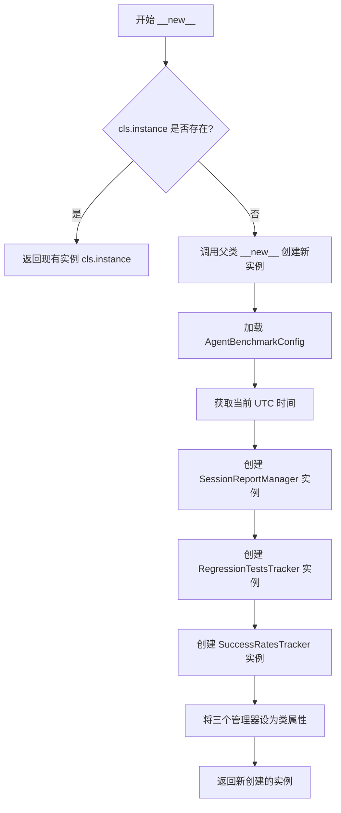

#### 带注释源码

```python
def __new__(cls):
    # 检查类属性 instance 是否为空（是否已存在实例）
    if not cls.instance:
        # 调用父类的 __new__ 方法创建新实例
        cls.instance = super(SingletonReportManager, cls).__new__(cls)

        # 加载代理基准测试配置
        agent_benchmark_config = AgentBenchmarkConfig.load()
        
        # 获取当前 UTC 时间作为基准测试开始时间
        benchmark_start_time_dt = datetime.now(
            timezone.utc
        )  # or any logic to fetch the datetime

        # 将三个管理器类实例化为类属性
        # INFO_MANAGER: 管理会话报告
        cls.INFO_MANAGER = SessionReportManager(
            agent_benchmark_config.get_report_dir(benchmark_start_time_dt)
            / "report.json",
            benchmark_start_time_dt,
        )
        # REGRESSION_MANAGER: 跟踪回归测试
        cls.REGRESSION_MANAGER = RegressionTestsTracker(
            agent_benchmark_config.regression_tests_file
        )
        # SUCCESS_RATE_TRACKER: 跟踪成功率
        cls.SUCCESS_RATE_TRACKER = SuccessRatesTracker(
            agent_benchmark_config.success_rate_file
        )

    # 返回单例实例（无论是新创建的还是已存在的）
    return cls.instance
```


### `SingletonReportManager.clear_instance`

该方法是一个类方法，用于重置单例 ReportManager 实例，将其类属性 `instance` 设为 `None`，并删除用于管理报告、会话和成功率的三个管理器实例，以实现单例的清除和重新初始化。

参数：无（除隐式参数 `cls`）

返回值：`None`，无返回值

#### 流程图

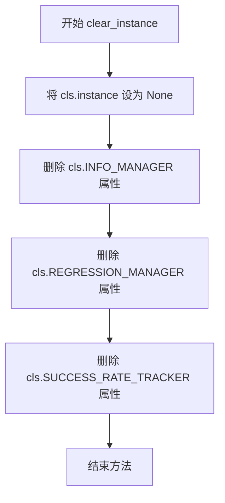

#### 带注释源码

```python
@classmethod
def clear_instance(cls):
    """
    清除单例实例，重置类属性
    
    该方法用于重置 SingletonReportManager 的单例状态，
    将实例引用置空并删除所有管理器属性，以便下次调用时重新创建。
    """
    # 将单例实例引用置为 None，下次调用 __new__ 时会创建新实例
    cls.instance = None
    
    # 删除会话报告管理器，释放相关资源
    del cls.INFO_MANAGER
    
    # 删除回归测试追踪器，释放相关资源
    del cls.REGRESSION_MANAGER
    
    # 删除成功率追踪器，释放相关资源
    del cls.SUCCESS_RATE_TRACKER
```


### `BaseReportManager.__init__`

初始化 `BaseReportManager` 实例，设置报告文件路径并调用 `load()` 方法加载数据。

参数：

- `report_file`：`Path`，报告文件的路径

返回值：`None`，无返回值（构造函数）

#### 流程图

```mermaid
flowchart TD
    A[开始 __init__] --> B[接收 report_file 参数]
    B --> C[self.report_file = report_file]
    C --> D[调用 self.load 方法]
    D --> E[结束]
    
    subgraph load 方法
    D --> F{report_file 是否存在}
    F -->|是| G[打开文件并读取 JSON 数据]
    F -->|否| H[创建目录]
    H --> I[初始化 self.tests = {}]
    G --> J[解析 JSON 数据到 self.tests]
    J --> K{解析是否成功}
    K -->|成功| L[返回]
    K -->|失败 JSONDecodeError| M[记录警告并初始化空字典]
    M --> L
    I --> L
    end
```

#### 带注释源码

```python
def __init__(self, report_file: Path):
    """
    初始化 BaseReportManager 实例。
    
    参数:
        report_file: Path 类型，报告文件的路径，用于存储和读取测试数据
    """
    # 将传入的 report_file 路径保存为实例属性
    self.report_file = report_file

    # 调用 load 方法加载已存在的报告数据
    # load 方法会尝试读取 JSON 文件并解析为 tests 字典
    # 如果文件不存在或解析失败，会初始化为空字典
    self.load()
```


### `BaseReportManager.load`

该方法负责从指定的报告文件中加载JSON数据，并将其解析为内部的 `tests` 字典。如果文件不存在则创建父目录；如果文件为空或格式错误，则初始化为空字典。

参数：

- `self`：`BaseReportManager`，隐式参数，代表当前报告管理器实例

返回值：`None`，无返回值描述

#### 流程图

```mermaid
flowchart TD
    A[开始 load 方法] --> B{report_file 是否存在}
    B -->|否| C[创建父目录]
    B -->|是| D[打开文件]
    C --> D
    D --> E[尝试解析 JSON]
    E --> F{解析是否成功}
    F -->|是| G[将数据存入 tests 字典并按键排序]
    F -->|否, FileNotFoundError| H[tests = {}]
    F -->|否, JSONDecodeError| I[记录警告日志, tests = {}]
    G --> J[结束]
    H --> J
    I --> J
```

#### 带注释源码

```python
def load(self) -> None:
    """从 JSON 文件加载测试数据到 tests 字典"""
    
    # 确保报告文件的父目录存在，若不存在则创建
    if not self.report_file.exists():
        self.report_file.parent.mkdir(exist_ok=True)

    try:
        # 以只读模式打开文件
        with self.report_file.open("r") as f:
            # 解析 JSON 数据
            data = json.load(f)
            # 将数据按键排序后存入 tests 字典
            self.tests = {k: data[k] for k in sorted(data)}
    except FileNotFoundError:
        # 文件不存在时，初始化为空字典
        self.tests = {}
    except json.decoder.JSONDecodeError as e:
        # JSON 解析错误时记录警告并初始化为空字典
        logger.warning(f"Could not parse {self.report_file}: {e}")
        self.tests = {}
```


### `BaseReportManager.save`

将当前存储的测试数据（`self.tests`）序列化并写入到指定的 JSON 文件中，实现报告数据的持久化存储。

参数：

- 该方法无显式参数（`self` 为隐式实例参数）

返回值：`None`，不返回任何值，仅执行文件写入操作

#### 流程图

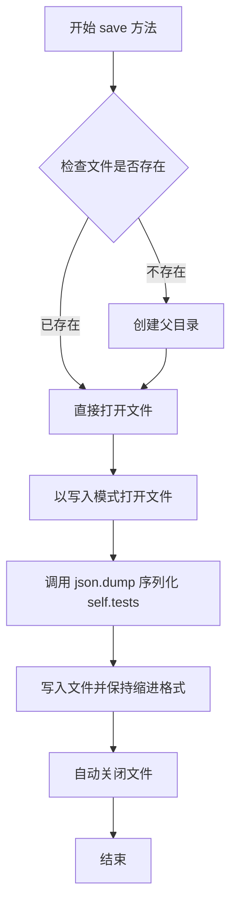

#### 带注释源码

```python
def save(self) -> None:
    """将测试数据保存到 JSON 文件"""
    # 使用写入模式打开文件（如果不存在则创建）
    with self.report_file.open("w") as f:
        # 将 self.tests 字典序列化为 JSON 格式并写入文件
        # indent=4 表示使用 4 个空格缩进，使输出更易读
        json.dump(self.tests, f, indent=4)
```


### `BaseReportManager.remove_test`

该方法用于从测试字典中删除指定的测试记录，并同步保存到文件中。

参数：

- `test_name`：`str`，要删除的测试名称

返回值：`None`，无返回值

#### 流程图

```mermaid
flowchart TD
    A[开始 remove_test] --> B{test_name in self.tests?}
    B -->|是| C[del self.tests[test_name]]
    C --> D[调用 self.save 保存更改]
    D --> E[结束]
    B -->|否| E
```

#### 带注释源码

```python
def remove_test(self, test_name: str) -> None:
    """从测试字典中删除指定的测试记录
    
    Args:
        test_name: 要删除的测试名称
        
    Returns:
        None
    """
    # 检查测试名称是否存在于测试字典中
    if test_name in self.tests:
        # 删除指定的测试记录
        del self.tests[test_name]
        # 保存更新后的测试字典到文件
        self.save()
```


### `BaseReportManager.reset`

该方法用于重置所有测试数据，将测试字典清空并保存到文件中。

参数：
- 该方法无参数（仅包含隐式参数 `self`）

返回值：`None`，无返回值

#### 流程图

```mermaid
flowchart TD
    A[开始 reset] --> B[将 self.tests 设置为空字典 {}]
    B --> C[调用 self.save 方法]
    C --> D[结束]
    
    style A fill:#f9f,stroke:#333
    style D fill:#9f9,stroke:#333
```

#### 带注释源码

```python
def reset(self) -> None:
    """
    重置所有测试数据。
    
    该方法将 tests 字典清空为空字典，然后调用 save 方法
    将空字典持久化到报告中，实现重置测试的功能。
    """
    self.tests = {}  # 将测试字典重置为空字典
    self.save()      # 调用 save 方法将空字典写入文件
```


### `SessionReportManager.__init__`

该方法为会话报告管理器的初始化方法，接收报告文件路径和基准测试开始时间作为参数，调用父类`BaseReportManager`的构造函数加载测试数据，并初始化会话开始时间戳和基准测试开始时间。

参数：

- `report_file`：`Path`，报告文件的路径，指向存储测试报告的JSON文件
- `benchmark_start_time`：`datetime`，基准测试的开始时间，用于记录会话的时间上下文

返回值：`None`，无返回值，该方法仅执行初始化逻辑

#### 流程图

```mermaid
flowchart TD
    A[开始 __init__] --> B[接收 report_file 和 benchmark_start_time 参数]
    B --> C[调用 super().__init__report_file]
    C --> D{report_file 是否存在}
    D -->|是| E[读取并解析 JSON 文件]
    D -->|否| F[初始化空 tests 字典]
    E --> G[按key排序构建 self.tests]
    G --> H[设置 self.start_time = time.time]
    H --> I[设置 self.benchmark_start_time = benchmark_start_time]
    I --> J[结束 __init__]
    F --> H
```

#### 带注释源码

```python
def __init__(self, report_file: Path, benchmark_start_time: datetime):
    """
    初始化会话报告管理器
    
    参数:
        report_file: 报告文件的路径，指向存储测试报告的JSON文件
        benchmark_start_time: 基准测试的开始时间，用于记录会话的时间上下文
    """
    # 调用父类 BaseReportManager 的构造函数
    # 父类构造函数会:
    # 1. 设置 self.report_file = report_file
    # 2. 调用 self.load() 方法加载测试数据
    super().__init__(report_file)

    # 记录会话开始的时间戳，用于后续计算会话总耗时
    self.start_time = time.time()
    
    # 保存基准测试的开始时间，用于报告生成和时间相关计算
    self.benchmark_start_time = benchmark_start_time
```


### `SessionReportManager.save`

该方法负责将当前的会话报告数据持久化到磁盘文件中。它优先检查是否存在已构建的 `Report` 模型对象；如果存在，则将其序列化为格式化的 JSON 字符串写入文件；若尚未构建 `Report` 对象，则将包含测试结果的字典转换为 JSON 格式进行保存。

参数：

-  `self`：`SessionReportManager`，类的实例本身（隐式参数，无需显式传入）

返回值：`None`，该方法不返回任何值，仅执行文件写入操作。

#### 流程图

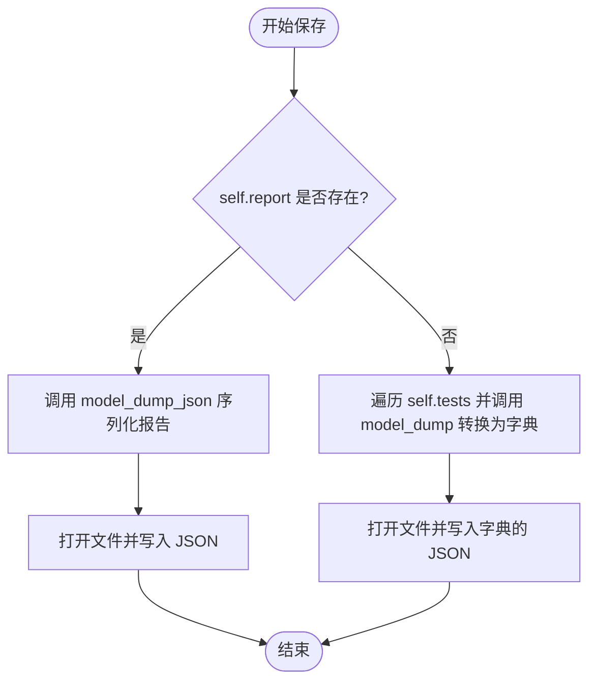

#### 带注释源码

```python
def save(self) -> None:
    # 使用上下文管理器打开文件，'w' 模式表示写入
    with self.report_file.open("w") as f:
        # 判断是否已经生成了完整的 Report 对象
        if self.report:
            # 如果存在 Report 对象，直接写入其 JSON 格式（带缩进）
            f.write(self.report.model_dump_json(indent=4))
        else:
            # 如果没有 Report 对象，则将内部的 tests 字典（值为 Pydantic 模型）转换为普通字典
            # 然后使用 json.dump 写入文件
            json.dump(
                {k: v.model_dump() for k, v in self.tests.items()}, f, indent=4
            )
```


### `SessionReportManager.load`

该方法负责从 JSON 文件加载会话报告数据，调用父类的加载逻辑后，根据加载的数据结构判断是完整的报告（Report）还是单个测试（Test）字典，并相应地初始化 `self.report` 或转换 `self.tests` 中的数据。

参数： 无（继承自父类，通过实例属性 `self.report_file` 访问文件路径）

返回值：`None`，该方法无返回值（返回类型为 `None`）

#### 流程图

```mermaid
flowchart TD
    A[开始 load 方法] --> B[调用 super().load 加载基础数据]
    B --> C{self.tests 中是否存在 'tests' 键?}
    C -->|是| D[使用 Report.model_validate 验证并赋值给 self.report]
    C -->|否| E[遍历 self.tests 中的键值对]
    E --> F[使用 Test.model_validate 验证每个测试数据]
    F --> G[将验证后的 Test 对象存入 self.tests 字典]
    D --> H[结束 load 方法]
    G --> H
```

#### 带注释源码

```python
def load(self) -> None:
    """
    加载会话报告数据
    
    该方法继承自 BaseReportManager，首先调用父类的 load 方法加载 JSON 文件，
    然后根据数据结构判断是完整的 Report 对象还是单独的 Test 对象字典，
    并进行相应的数据验证和转换。
    """
    # 调用父类的 load 方法，从 self.report_file 读取 JSON 数据
    # 父类方法会处理文件不存在和 JSON 解析错误的情况
    # 加载后的原始数据存储在 self.tests 字典中
    super().load()

    # 检查加载的数据是否为完整的 Report 格式
    # Report 格式：{"tests": {...}, "command": "...", ...}
    if "tests" in self.tests:
        # 如果存在 "tests" 键，说明是完整的 Report 对象
        # 使用 Pydantic 的 model_validate 进行数据验证和转换
        self.report = Report.model_validate(self.tests)
    else:
        # 否则认为是旧格式或单个测试的字典格式
        # 遍历所有键值对，将每个值作为 Test 对象进行验证
        # n: 测试名称, d: 测试数据字典
        self.tests = {n: Test.model_validate(d) for n, d in self.tests.items()}
```


### `SessionReportManager.add_test_report`

该方法用于将单个测试报告添加到会话报告管理器中，如果测试名称以"Test"开头会自动去除前缀，并在添加后立即保存报告文件。

参数：

- `test_name`：`str`，测试名称，用于标识测试的唯一标识符
- `test_report`：`Test`，测试报告对象，包含测试的详细结果数据

返回值：`None`，该方法无返回值，执行完成后会自动保存报告

#### 流程图

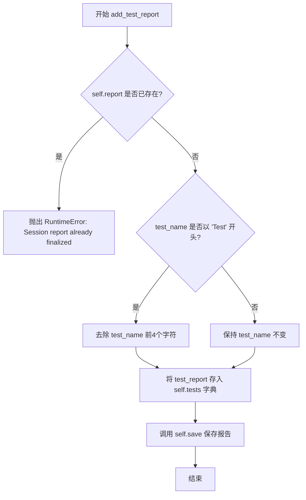

#### 带注释源码

```python
def add_test_report(self, test_name: str, test_report: Test) -> None:
    """添加测试报告到会话管理器
    
    参数:
        test_name: 测试名称字符串
        test_report: Test类型的测试报告对象
    
    返回:
        None
    """
    # 检查会话报告是否已经最终化，如果是则抛出异常
    if self.report:
        raise RuntimeError("Session report already finalized")

    # 如果测试名称以"Test"开头，则去除前四个字符
    # 这是为了保持命名一致性
    if test_name.startswith("Test"):
        test_name = test_name[4:]
    
    # 将测试报告存储到tests字典中，使用测试名称作为键
    self.tests[test_name] = test_report

    # 立即保存报告到文件，确保数据不丢失
    self.save()
```


### `SessionReportManager.finalize_session_report`

该方法用于最终化会话报告，将所有测试数据整合成一个完整的 Report 对象，包括命令信息、提交 SHA、时间戳、运行指标和配置信息，并在满足条件时生成雷达图，最后将报告保存到文件。

参数：

- `config`：`AgentBenchmarkConfig`，基准测试配置对象，用于获取报告目录等配置信息

返回值：`None`，该方法不返回任何值，只是将整合后的报告保存到 JSON 文件

#### 流程图

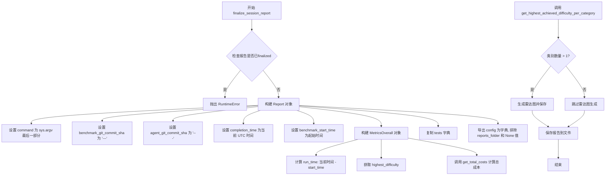

#### 带注释源码

```python
def finalize_session_report(self, config: AgentBenchmarkConfig) -> None:
    """最终化会话报告，将所有测试数据整合成完整的 Report 对象并保存"""
    
    # 获取命令行参数，拼接成字符串
    command = " ".join(sys.argv)

    # 检查报告是否已经finalized，如果是则抛出异常
    if self.report:
        raise RuntimeError("Session report already finalized")

    # 创建 Report 对象，包含会话的完整信息
    self.report = Report(
        # 从完整命令中提取最后一个部分（通常是脚本名）
        command=command.split(os.sep)[-1],
        # Git 提交 SHA 占位符
        benchmark_git_commit_sha="---",
        agent_git_commit_sha="---",
        # 完成时间，格式化为 ISO 8601 格式
        completion_time=datetime.now(timezone.utc).strftime(
            "%Y-%m-%dT%H:%M:%S+00:00"
        ),
        # 基准测试开始时间
        benchmark_start_time=self.benchmark_start_time.strftime(
            "%Y-%m-%dT%H:%M:%S+00:00"
        ),
        # 构建总体指标对象
        metrics=MetricsOverall(
            # 计算运行时长，保留两位小数
            run_time=str(round(time.time() - self.start_time, 2)) + " seconds",
            # 获取最高成功难度
            highest_difficulty=get_highest_success_difficulty(self.tests),
            # 计算总成本
            total_cost=self.get_total_costs(),
        ),
        # 复制测试数据字典
        tests=copy.copy(self.tests),
        # 导出配置，排除 reports_folder 字段和 None 值
        config=config.model_dump(exclude={"reports_folder"}, exclude_none=True),
    )

    # 获取每个类别的最高达成难度
    agent_categories = get_highest_achieved_difficulty_per_category(self.report)
    # 如果有多个类别，则生成雷达图
    if len(agent_categories) > 1:
        save_single_radar_chart(
            agent_categories,
            config.get_report_dir(self.benchmark_start_time) / "radar_chart.png",
        )

    # 保存报告到文件
    self.save()
```


### `SessionReportManager.get_total_costs`

该方法用于计算所有测试的总成本，遍历所有测试结果中的成本字段并求和，如果所有测试的成本均为 None 则返回 None。

参数：

- 无参数

返回值：`int | None`，返回所有测试的总成本，如果所有测试的成本均为 None 则返回 None

#### 流程图

```mermaid
flowchart TD
    A[开始 get_total_costs] --> B{self.report 是否存在}
    B -->|是| C[使用 self.report.tests]
    B -->|否| D[使用 self.tests]
    C --> E[初始化 total_cost = 0, all_costs_none = True]
    D --> E
    E --> F[遍历 tests 中的每个 test_data]
    F --> G[计算单个测试的成本: cost = sum(r.cost or 0 for r in test_data.results)]
    G --> H{cost is not None}
    H -->|是| I[设置 all_costs_none = False, total_cost += cost]
    H -->|否| J[不更新 total_cost]
    I --> K[继续遍历下一个测试]
    J --> K
    K --> L{还有更多测试}
    L -->|是| F
    L -->|否| M{all_costs_none 为 True}
    M -->|是| N[返回 None]
    M -->|否| O[返回 total_cost]
    N --> P[结束]
    O --> P
```

#### 带注释源码

```python
def get_total_costs(self):
    # 判断是否存在已完成的报告
    if self.report:
        # 如果存在报告，使用报告中的测试数据
        tests = self.report.tests
    else:
        # 否则使用当前会话的测试数据
        tests = self.tests

    # 初始化总成本为0
    total_cost = 0
    # 标记是否所有成本都为None
    all_costs_none = True
    
    # 遍历所有测试数据
    for test_data in tests.values():
        # 计算单个测试的成本：对所有结果的成本求和，如果cost为None则视为0
        cost = sum(r.cost or 0 for r in test_data.results)

        # 检查成本是否为None
        if cost is not None:
            # 如果成本不是None，设置标记为False
            all_costs_none = False
            # 将成本累加到总成本中
            total_cost += cost
    
    # 如果所有成本都为None
    if all_costs_none:
        # 返回None
        total_cost = None
    
    # 返回总成本
    return total_cost
```


### `RegressionTestsTracker.add_test`

该方法用于向回归测试跟踪器中添加一个新的回归测试，将测试名称和测试详情存储到内存字典中，并持久化保存到回归测试文件中。

参数：

- `test_name`：`str`，要添加的回归测试名称，如果名称以 "Test" 开头会被自动去除
- `test_details`：`dict`，包含回归测试详情的字典数据

返回值：`None`，该方法不返回任何值，仅执行存储和保存操作

#### 流程图

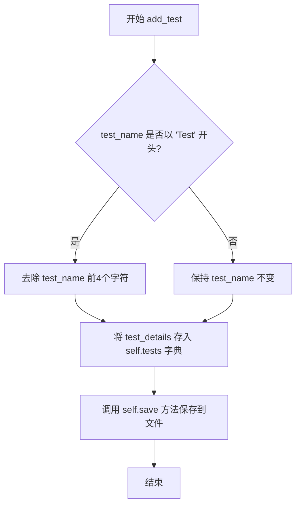

#### 带注释源码

```python
def add_test(self, test_name: str, test_details: dict) -> None:
    """
    向回归测试跟踪器添加一个测试
    
    参数:
        test_name: str - 测试名称，如果以 'Test' 开头会被去除前缀
        test_details: dict - 测试详情字典，包含测试的详细信息
    """
    
    # 如果测试名称以 "Test" 开头，去除前4个字符以保持一致性
    # 例如 "TestMyTest" 会变成 "MyTest"
    if test_name.startswith("Test"):
        test_name = test_name[4:]

    # 将测试详情存储到内存字典中，键为测试名称
    self.tests[test_name] = test_details
    
    # 调用父类的 save 方法将数据持久化到 JSON 文件
    self.save()
```


### `RegressionTestsTracker.has_regression_test`

检查是否存在回归测试

参数：

- `test_name`：`str`，要检查的测试名称

返回值：`bool`，如果存在该测试返回 True，否则返回 False

#### 流程图

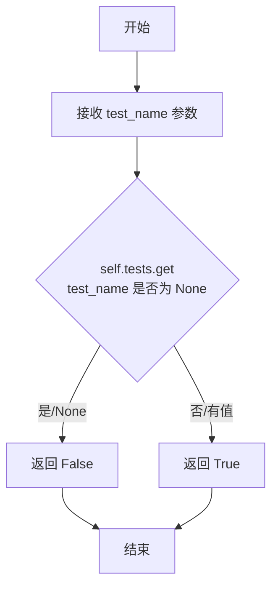

#### 带注释源码

```python
def has_regression_test(self, test_name: str) -> bool:
    """
    检查是否存在指定的回归测试
    
    Args:
        test_name: 要检查的测试名称
        
    Returns:
        bool: 如果字典中存在该测试名称返回 True，否则返回 False
    """
    # 使用字典的 get 方法获取测试，如果键不存在返回 None
    # 然后检查返回值是否为 None 来确定测试是否存在
    return self.tests.get(test_name) is not None
```


### `SuccessRatesTracker.update`

更新指定测试的成功率历史记录。该方法接收测试名称和成功历史列表，将测试名称标准化（移除可能的 "Test" 前缀），然后将历史记录存储到内部字典中并持久化到文件。

参数：

- `test_name`：`str`，需要更新的测试名称
- `success_history`：`list[bool | None]`，包含布尔值或 None 的成功历史记录列表

返回值：`None`，该方法不返回任何值

#### 流程图

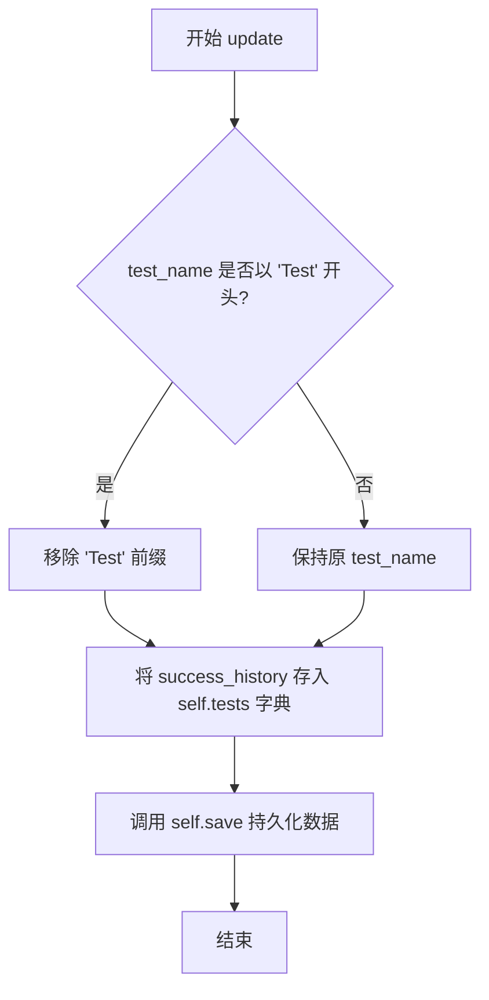

#### 带注释源码

```python
def update(self, test_name: str, success_history: list[bool | None]) -> None:
    """
    更新指定测试的成功率历史记录
    
    参数:
        test_name: str, 测试名称
        success_history: list[bool | None], 成功历史列表
    
    返回:
        None
    """
    # 如果测试名称以 "Test" 开头，则移除该前缀以保持一致性
    if test_name.startswith("Test"):
        test_name = test_name[4:]

    # 将成功历史记录存储到内部字典中
    self.tests[test_name] = success_history
    
    # 持久化保存到文件
    self.save()
```

## 关键组件


### SingletonReportManager

单例模式的报告管理器协调器，负责统一管理会话报告、回归测试和成功率跟踪三个核心管理器，提供全局唯一的访问入口并支持配置加载和时间戳管理。

### BaseReportManager

抽象基类，封装了报告文件的通用I/O操作逻辑，包括JSON格式的加载、保存、测试移除和重置功能，提供文件系统存在性检查和异常处理机制。

### SessionReportManager

会话级别的报告管理器，继承自BaseReportManager，负责管理单个基准测试会话的生命周期，包括报告的添加、最终化、指标计算（运行时间、最高难度、总成本），并支持报告的序列化和反序列化。

### RegressionTestsTracker

回归测试跟踪器，继承自BaseReportManager，专门用于记录和查询回归测试的详细信息，支持添加新回归测试和检查特定测试是否存在于回归测试集合中。

### SuccessRatesTracker

成功率跟踪器，继承自BaseReportManager，用于维护测试的成功历史记录，支持按测试名称更新成功/失败状态列表并持久化到文件。

### 报告序列化和反序列化模块

基于JSON的持久化层，集成Pydantic模型验证（Report、Test模型），支持从JSON文件加载测试数据和将内存中的报告对象序列化为JSON格式，包含JSON解析异常处理。

### 配置和依赖注入模块

通过AgentBenchmarkConfig集中管理基准测试配置，包括报告目录路径、回归测试文件路径和成功率文件路径的获取，实现依赖的统一注入和管理。

### 指标计算模块

包含get_highest_success_difficulty和get_highest_achieved_difficulty_per_category等函数，用于计算测试套件的最高成功难度和按类别分组的最高成就难度，支持雷达图生成。

### 图表生成模块

集成save_single_radar_chart函数，根据分类的最高成就难度生成雷达图表，用于可视化展示代理在不同测试类别中的表现。

### 潜在技术债务和优化空间

1. **硬编码的Git提交SHA**：finalize_session_report方法中使用硬编码的"---"作为git提交SHA，应从实际版本控制系统获取
2. **异常处理不完整**：BaseReportManager的load方法捕获JSONDecodeError但未记录完整堆栈信息，诊断能力有限
3. **类型提示不精确**：部分方法参数使用Any类型（如test_details: dict），可细化具体结构类型
4. **文件操作无锁机制**：多进程并发写入同一报告文件时存在竞争条件风险
5. **缺少事务性保存**：save操作非原子性，异常情况下可能导致文件损坏
6. **时间处理分散**：benchmark_start_time同时存储datetime对象和字符串格式，存在冗余

### 设计目标与约束

- **设计目标**：提供统一的基准测试报告管理框架，支持会话级报告生成、回归测试跟踪和历史成功率分析
- **约束条件**：依赖JSON文件作为持久化存储，报告文件格式与Pydantic模型绑定

### 错误处理与异常设计

- FileNotFoundError：静默初始化空测试字典
- JSONDecodeError：记录警告并初始化空字典
- RuntimeError：防止重复finalize报告或重复添加测试

### 数据流与状态机

SessionReportManager经历初始化 → 添加测试报告 → 最终化报告 三个状态转换，最终化后不允许再添加新测试

### 外部依赖与接口契约

- AgentBenchmarkConfig：配置注入接口
- Report、Test、MetricsOverall：Pydantic数据模型
- save_single_radar_chart：图表生成外部接口
- get_highest_success_difficulty、get_highest_achieved_difficulty_per_category：指标计算外部函数


## 问题及建议


### 已知问题

1.  **单例实现不完整**：`clear_instance` 方法删除了类属性但未将 `cls.instance` 置为 `None`，导致再次实例化时可能引用已删除对象
2.  **异常处理不完善**：`save()` 方法缺少异常处理，文件写入失败时可能导致数据丢失且无日志记录
3.  **代码重复**：`test_name.startswith("Test")` 的字符串处理逻辑在 `add_test_report`、`add_test` 和 `update` 方法中重复出现
4.  **类型注解不一致**：`BaseReportManager` 使用 `dict[str, Any]`，子类使用具体类型 `dict[str, Test]`、`dict[str, dict]` 等，类型安全不足
5.  **硬编码问题**：git commit sha 被硬编码为 `"---"`，应从配置或版本控制系统获取
6.  **频繁 I/O 操作**：每次添加测试都调用 `save()`，在大量测试场景下性能低下且增加磁盘 I/O
7.  **排序效率问题**：`load()` 方法中每次加载都对所有键排序 `{k: data[k] for k in sorted(data)}`，大文件时性能受影响
8.  **逻辑可读性差**：`get_total_costs` 方法中 `all_costs_none` 变量命名与实际逻辑（判断是否存在有效 cost）不够直观，且变量 `cost` 被重复用于循环内和累加
9.  **配置暴露风险**：`SessionReportManager.finalize_session_report` 中 `config.model_dump(exclude={"reports_folder"}, exclude_none=True)` 仅排除 `reports_folder`，可能泄露敏感配置信息

### 优化建议

1.  **完善单例清理**：在 `clear_instance` 方法末尾添加 `cls.instance = None`
2.  **添加事务性保存**：实现带异常处理的保存机制，如先写入临时文件再重命名，避免数据损坏
3.  **提取公共方法**：创建 `_normalize_test_name` 私有方法统一处理 `test_name` 前缀
4.  **强化类型注解**：使用泛型或 Protocol 统一 `tests` 字典的类型定义
5.  **获取真实版本信息**：集成 `git` 库或配置读取真实 `git_commit_sha`
6.  **实现批量保存**：添加 `batch_mode` 参数或定期自动保存，减少 I/O 频率
7.  **延迟排序或按需排序**：仅在需要时（如导出报告）排序，内存中保持插入顺序
8.  **重构费用计算逻辑**：简化 `get_total_costs` 方法，使用更清晰的变量命名（如 `has_valid_cost`）
9.  **敏感信息过滤**：审查并扩展 `exclude` 参数范围，确保敏感配置不被写入报告


## 其它


### 设计目标与约束

本代码的设计目标是建立一个集中化的基准测试报告管理系统，支持会话报告管理、回归测试跟踪和成功率统计三大核心功能。采用单例模式确保全局唯一实例，避免多实例导致的数据不一致问题。设计约束包括：依赖JSON文件进行持久化存储、支持Pydantic模型验证与序列化、需要与AgentBenchmarkConfig配置系统集成。

### 错误处理与异常设计

代码中的错误处理主要体现在以下几个方面：
1. 文件操作异常捕获：BaseReportManager.load()方法捕获FileNotFoundError和json.decoder.JSONDecodeError，记录warning日志并初始化空tests字典
2. 运行时状态检查：SessionReportManager在add_test_report和finalize_session_report方法中检查report是否已finalized，防止重复操作
3. JSON解析容错：load方法中使用try-except捕获JSON解析错误，确保程序不会因文件损坏而崩溃
4. 潜在问题：当前错误处理较为简单，缺少重试机制和详细的错误分类，建议增加自定义异常类区分不同错误类型

### 数据流与状态机

**数据加载流程：**
初始化时从JSON文件加载历史数据 → 解析为Python对象（Report或Test字典） → 存储在内存tests字典中

**数据保存流程：**
调用save()方法 → 将内存对象序列化为JSON → 写入文件（覆盖式写入）

**状态转换：**
- SessionReportManager状态：未finalized（可添加测试）→ finalized（生成完整Report对象）
- BaseReportManager状态：空数据 → 已加载数据 → 已修改 → 已保存

### 外部依赖与接口契约

**外部依赖：**
1. AgentBenchmarkConfig：配置类，提供get_report_dir()、regression_tests_file、success_rate_file等配置项
2. Pydantic模型：Report、Test、MetricsOverall用于数据验证和序列化
3. graph模块：save_single_radar_chart用于生成雷达图
4. process_report模块：get_highest_achieved_difficulty_per_category、get_highest_success_difficulty用于指标计算
5. 标准库：json、logging、pathlib、datetime、time、copy、sys、os

**接口契约：**
- BaseReportManager必须实现load()和save()方法供子类调用
- SessionReportManager.add_test_report()要求传入有效的Test对象且report未finalized
- RegressionTestsTracker.add_test()接受test_name和test_details字典
- SuccessRatesTracker.update()接受test_name和bool/None类型的列表

### 性能考虑与资源管理

**性能瓶颈：**
1. 每次add_test_report都触发完整文件写入（save方法），大测试集下I/O频繁
2. get_total_costs()遍历所有测试结果计算成本，可考虑缓存
3. json.dump在Python中对大对象序列化效率较低

**优化建议：**
1. 引入增量保存机制或批量写入缓冲
2. 使用__slots__减少类内存开销
3. 考虑使用orjson替代json库提升序列化性能

### 安全性考虑

**当前安全措施：**
1. 使用pathlib.Path进行文件路径操作，避免命令注入
2. 日志记录而非直接暴露敏感信息

**潜在风险：**
1. 报告文件路径由配置动态生成，需确保目录权限正确
2. JSON文件无加密，敏感测试数据（如cost）以明文存储
3. 缺少输入验证，test_name和test_details内容未做清理

### 并发与线程安全性

**现状分析：**
代码未实现任何线程同步机制。在多线程环境下：
- SingletonReportManager的类属性在__new__中初始化，可能存在竞态条件
- BaseReportManager的tests字典读写操作非原子性
- 文件读写无锁保护，多进程并发写入可能导致数据损坏

**建议：** 如需支持并发使用，应引入threading.Lock或文件锁机制

### 版本兼容性设计

代码使用Python 3.10+的联合类型语法（Report | None），需要Python 3.10以上版本。Pydantic v2的model_dump_json和model_validate方法与v1不兼容，当前使用v2接口。配置exclude参数为Pydantic v2特性。

### 配置与扩展性

**可扩展点：**
1. 可通过继承BaseReportManager添加新的报告管理器类型
2. save()方法支持不同序列化格式（当前JSON，可扩展为YAML/MessagePack）
3. SingletonReportManager可扩展支持更多Manager类

**配置依赖硬编码：** benchmark_git_commit_sha和agent_git_commit_sha固定为"---"，应从环境或配置获取

    