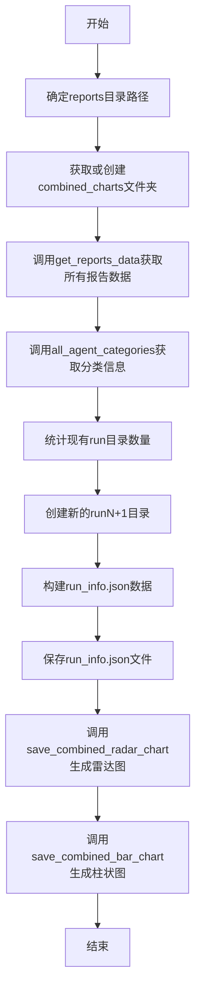
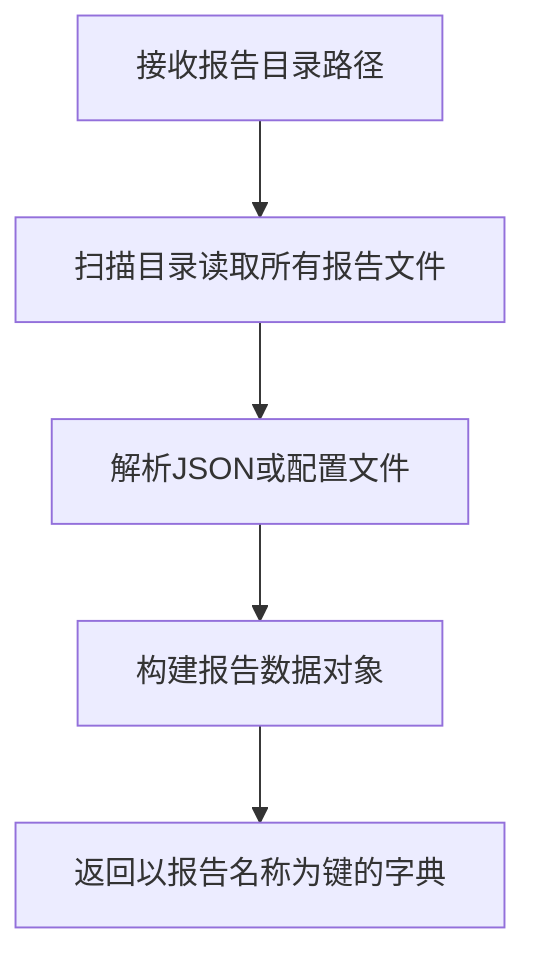
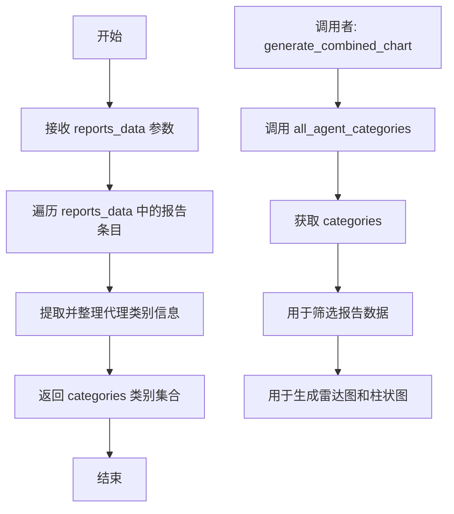
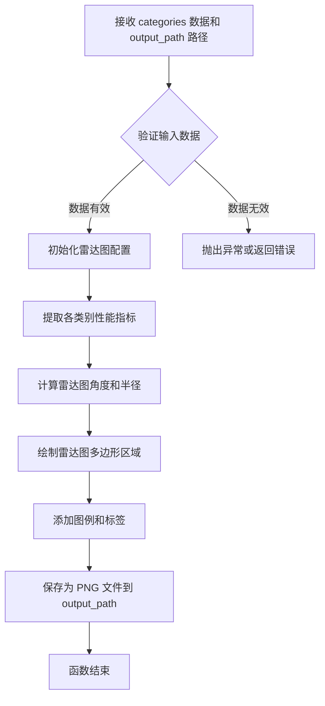
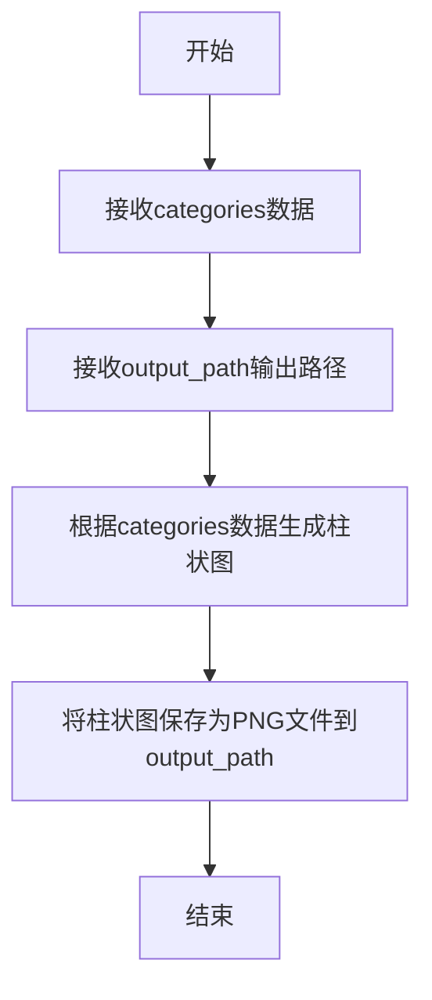

# `.\AutoGPT\classic\benchmark\agbenchmark\reports\processing\gen_combined_chart.py` 详细设计文档

该代码是一个自动化基准测试报告生成脚本，通过读取agbenchmark项目的reports目录下的报告数据，按类别汇总后生成综合的雷达图和柱状图，并保存到combined_charts文件夹中，同时记录每次运行的基准测试开始时间。

## 整体流程



## 类结构

```
该文件为脚本文件，不包含类定义
主要采用函数式编程模式
依赖外部模块: agbenchmark.reports.processing.graphs
依赖外部模块: agbenchmark.reports.processing.process_report
```

## 全局变量及字段


### `all_agents_path`
    
reports目录的路径对象

类型：`Path`
    


### `combined_charts_folder`
    
combined_charts文件夹路径

类型：`Path`
    


### `reports_data`
    
报告数据字典，由get_reports_data返回

类型：`字典`
    


### `categories`
    
代理类别列表，由all_agent_categories返回

类型：`列表`
    


### `num_dirs`
    
现有run目录的数量

类型：`int`
    


### `run_charts_folder`
    
本次运行的图表文件夹路径

类型：`Path`
    


### `info_data`
    
包含报告名和基准开始时间的字典

类型：`字典`
    


    

## 全局函数及方法


### `generate_combined_chart`

该函数是生成综合图表的核心逻辑，负责准备报告数据、创建运行目录结构、保存运行元信息，并调用绘图函数生成雷达图和柱状图。

参数：

- 该函数无参数

返回值：`None`，无返回值，仅执行副作用操作（创建文件目录和保存图表文件）

#### 流程图

```mermaid
flowchart TD
    A[开始] --> B[定义路径: all_agents_path 和 combined_charts_folder]
    B --> C[调用 get_reports_data 获取报告数据]
    C --> D[调用 all_agent_categories 获取分类信息]
    D --> E[计算 combined_charts_folder 中已有目录数量]
    E --> F[构建本次运行文件夹路径: run{num_dirs + 1}]
    F --> G{检查运行文件夹是否存在}
    G -->|不存在| H[使用 os.makedirs 创建目录]
    G -->|存在| I[跳过创建]
    H --> J
    I --> J[准备 info_data: 报告名称到 benchmark_start_time 的映射]
    J --> K[将 info_data 写入 run_info.json]
    K --> L[调用 save_combined_radar_chart 生成雷达图]
    L --> M[调用 save_combined_bar_chart 生成柱状图]
    M --> N[结束]
```

#### 带注释源码

```python
def generate_combined_chart() -> None:
    """
    生成综合图表（雷达图和柱状图）的主函数。
    该函数执行以下操作：
    1. 确定报告目录路径
    2. 获取报告数据并提取分类信息
    3. 创建新的运行文件夹
    4. 保存运行元信息到 JSON 文件
    5. 生成雷达图和柱状图
    """
    # 确定报告目录的父路径（向上查找4层目录）
    all_agents_path = Path(__file__).parent.parent.parent.parent / "reports"

    # 定义综合图表的存储文件夹路径
    combined_charts_folder = all_agents_path / "combined_charts"

    # 从指定路径获取所有报告数据（包含各报告的详细信息）
    reports_data = get_reports_data(str(all_agents_path))

    # 根据报告数据获取所有代理类别的分类信息
    categories = all_agent_categories(reports_data)

    # 统计 combined_charts_folder 中已存在的子目录数量
    # 用于生成唯一的运行编号（run1, run2, ...）
    num_dirs = len([f for f in combined_charts_folder.iterdir() if f.is_dir()])

    # 构建本次运行的文件夹路径，编号从已有数量+1开始
    run_charts_folder = combined_charts_folder / f"run{num_dirs + 1}"

    # 如果运行文件夹不存在，则创建完整的目录结构
    if not os.path.exists(run_charts_folder):
        os.makedirs(run_charts_folder)

    # 准备运行信息数据：提取每个报告名称及其对应的 benchmark_start_time
    # 仅保留存在于 categories 中的报告
    info_data = {
        report_name: data.benchmark_start_time
        for report_name, data in reports_data.items()
        if report_name in categories
    }

    # 将运行信息写入 run_info.json 文件
    with open(Path(run_charts_folder) / "run_info.json", "w") as f:
        json.dump(info_data, f)

    # 调用绘图函数生成雷达图并保存为 PNG 文件
    save_combined_radar_chart(categories, Path(run_charts_folder) / "radar_chart.png")

    # 调用绘图函数生成柱状图并保存为 PNG 文件
    save_combined_bar_chart(categories, Path(run_charts_folder) / "bar_chart.png")
```


### `get_reports_data`

该函数为外部导入函数，负责从指定的报告目录路径读取并解析所有报告数据，返回一个以报告名称为键、报告数据对象为值的字典，供后续图表生成和数据处理使用。

参数：

- `path`：`str`，要扫描的报告目录路径

返回值：`Dict[str, ReportData]`，返回字典，键为报告名称，键为报告数据对象（包含 `benchmark_start_time` 属性）

#### 流程图



#### 带注释源码

```python
# 注：以下为该函数在被调用处的使用方式推断
# 原始导入来源：from agbenchmark.reports.processing.process_report import get_reports_data

# 调用方式：
reports_data = get_reports_data(str(all_agents_path))

# 返 回 值 用 于 ：
# 1. 获取所有代理类别
categories = all_agent_categories(reports_data)

# 2. 遍历报告数据，获取每个报告的开始时间
info_data = {
    report_name: data.benchmark_start_time
    for report_name, data in reports_data.items()
    if report_name in categories
}

# 3. 传递给图表保存函数
save_combined_radar_chart(categories, Path(run_charts_folder) / "radar_chart.png")
save_combined_bar_chart(categories, Path(run_charts_folder) / "bar_chart.png")
```


### `all_agent_categories`

该函数为外部导入函数，从 `agbenchmark.reports.processing.process_report` 模块引入，用于从报告数据中提取和获取所有代理类别的信息，并返回一个包含类别名称的数据结构（字典或集合），供后续图表生成和数据筛选使用。

参数：

- `reports_data`：由 `get_reports_data(str(all_agents_path))` 返回的报告数据，类型为字典（Dict），包含报告名称到报告数据对象的映射关系

返回值：`categories`，类型根据代码推断为字典（Dict[str, ...]）或集合（Set[str]），包含所有代理类别的名称，用于图表生成和报告数据筛选

#### 流程图



#### 带注释源码

```python
# 该函数为外部导入函数，源码位于 agbenchmark/reports/processing/process_report.py 模块中
# 此处仅展示在当前文件中的调用方式

# 从外部模块导入 all_agent_categories 函数
from agbenchmark.reports.processing.process_report import (
    all_agent_categories,
    get_reports_data,
)

# 调用 all_agent_categories 函数
# 参数: reports_data - 包含所有报告数据的字典，由 get_reports_data 函数返回
# 返回值: categories - 包含所有代理类别的字典或集合，用于后续图表生成和数据筛选
categories = all_agent_categories(reports_data)

# categories 的使用方式1: 筛选报告数据
# 过滤出存在于 categories 中的报告，并提取其 benchmark_start_time
info_data = {
    report_name: data.benchmark_start_time
    for report_name, data in reports_data.items()
    if report_name in categories  # 判断报告名称是否在类别中
}

# categories 的使用方式2: 生成图表
# 将 categories 作为参数传递给图表生成函数
save_combined_radar_chart(categories, Path(run_charts_folder) / "radar_chart.png")
save_combined_bar_chart(categories, Path(run_charts_folder) / "bar_chart.png")
```


### `save_combined_radar_chart`

外部导入的函数，用于生成并保存组合雷达图。该函数接受分类数据和输出路径作为参数，将多个代理（agent）的性能指标以雷达图的形式可视化并保存为 PNG 图像文件。

参数：

- `categories`：`Dict[str, Any]` 或 `List[str]`，包含代理类别的性能数据，用于绘制雷达图的各个维度
- `output_path`：`Path`，雷达图输出文件的保存路径

返回值：`None`，该函数直接写入文件，不返回任何值

#### 流程图



#### 带注释源码

```python
# save_combined_radar_chart 函数源码
# （该函数为外部导入，源码位于 agbenchmark/reports/processing/graphs 模块）

def save_combined_radar_chart(categories: Dict[str, Any], output_path: Path) -> None:
    """
    保存组合雷达图到指定路径
    
    参数:
        categories: 包含各类别性能数据的字典，键为类别名称，值为性能指标
        output_path: 输出文件的路径对象
    
    返回:
        None: 直接将图像写入文件，不返回任何内容
    """
    # 1. 接收分类数据（categories）和输出路径（output_path）
    # 2. 验证数据有效性和路径合法性
    # 3. 使用 matplotlib 或类似库绘制雷达图
    # 4. 将图表保存为 PNG 格式到 output_path 指定的路径
```


### `save_combined_bar_chart`

这是一个外部导入的图表保存函数，用于将分类数据生成为柱状图并保存为PNG图像文件。

参数：

- `categories`：类型根据调用上下文推断为字典或列表，包含了需要展示在柱状图上的分类数据（如各个agent类别的性能指标）
- `output_path`：类型为 `Path`，表示柱状图保存的目标文件路径

返回值：`None`，该函数直接将图表写入文件，不返回任何值

#### 流程图



#### 带注释源码

```python
# 从agbenchmark.reports.processing.graphs模块导入的外部函数
# 此函数用于生成并保存组合柱状图

# 调用示例（来自generate_combined_chart函数）:
# categories: 包含所有agent类别的数据字典/列表
# Path(run_charts_folder) / "bar_chart.png": 输出文件路径，类型为Path对象

save_combined_bar_chart(categories, Path(run_charts_folder) / "bar_chart.png")

# 参数说明：
# - 第一个参数categories: 包含需要可视化的分类数据
# - 第二个参数: 目标输出路径，指定bar_chart.png文件的保存位置
```

#### 上下文使用环境

```python
# 在generate_combined_chart()函数中的完整调用上下文
def generate_combined_chart() -> None:
    # ... 前置代码省略 ...
    
    # 调用save_combined_bar_chart保存柱状图
    # categories: 来自all_agent_categories(reports_data)的分类数据
    # output_path: 动态生成的run文件夹下的bar_chart.png路径
    save_combined_bar_chart(categories, Path(run_charts_folder) / "bar_chart.png")
```

#### 关键组件信息

| 组件名称 | 一句话描述 |
|---------|-----------|
| `agbenchmark.reports.processing.graphs` | 图表处理模块，提供各种图表生成和保存功能 |
| `save_combined_bar_chart` | 柱状图保存函数，将分类数据可视化并输出为PNG文件 |
| `categories` | 分类数据，包含各agent类别的性能指标信息 |
| `Path(run_charts_folder) / "bar_chart.png"` | 动态构建的输出文件路径 |

#### 潜在的技术债务或优化空间

1. **缺少函数定义文档**：作为外部导入函数，其具体实现细节不可见，难以进行精确的参数类型定义和错误处理
2. **硬编码输出格式**：目前固定输出PNG格式，缺乏灵活性（如支持SVG、PDF等格式）
3. **错误处理缺失**：调用处未对可能出现的异常（如磁盘空间不足、权限问题）进行处理
4. **路径构建方式**：使用 `Path(run_charts_folder) / "bar_chart.png"` 拼接路径，可考虑封装为工具函数提高复用性

#### 其它项目

- **设计目标**：将agent性能数据通过柱状图形式可视化，便于分析和比较
- **约束条件**：依赖外部库 `agbenchmark.reports.processing.graphs` 的实现
- **数据流**：`reports_data` → `all_agent_categories()` → `categories` → `save_combined_bar_chart()` → PNG文件
- **外部依赖**：`agbenchmark.reports.processing.graphs` 模块中的图表绘制库（推测为matplotlib或类似库）


## 关键组件


### 报告数据获取组件

负责从指定目录读取所有报告数据，将原始报告文件解析为结构化数据字典，供后续图表生成使用。

### 类别聚合组件

对报告数据进行分类聚合，将报告按照代理类别进行分组统计，形成可用于图表渲染的类别数据。

### 雷达图生成组件

根据聚合的类别数据生成雷达图，展示不同代理类别在多个维度上的综合表现。

### 柱状图生成组件

根据聚合的类别数据生成柱状图，展示不同代理类别在各个指标上的对比情况。

### 运行目录管理组件

负责创建和管理带有序号标记的运行目录（run1、run2等），确保每次生成的图表保存到独立的目录中。

### 运行信息序列化组件

将每份报告的基准开始时间提取并保存为JSON文件，用于记录和追踪每次运行的元数据。

### 路径解析组件

通过Path对象动态计算项目根目录和报告目录的绝对路径，确保代码在不同工作目录下都能正确运行。


## 问题及建议


### 已知问题

-   **路径处理不一致**：代码混用了 `pathlib.Path` 和 `os` 模块（导入了 `os` 但主要使用 `Path`，创建目录时使用 `os.makedirs`），应统一使用 `pathlib.Path` 以保持代码一致性
-   **缺少错误处理**：未对关键函数返回值进行空值检查，如 `get_reports_data()` 返回 `None` 或空字典、`all_agent_categories()` 异常等情况会导致后续代码失败
-   **目录计数逻辑存在竞态条件**：使用 `len([f for f in combined_charts_folder.iterdir() if f.is_dir()])` 方式计数，多进程或并发执行时可能产生目录名冲突；且未处理 `combined_charts_folder` 初始不存在的情况
-   **路径拼接可读性差**：使用多层级的 `parent.parent.parent.parent` 进行路径回溯，难以理解目录层级关系，可提取为配置常量或使用更清晰的路径构造方式
-   **缺少类型注解**：函数参数和部分变量缺少类型提示，降低了代码可维护性和 IDE 支持
-   **数据筛选逻辑可能存在缺陷**：`report_name in categories` 的语义不清晰，若 `categories` 是字典则检查的是键，可能与业务意图不符
-   **资源管理不规范**：JSON 写入使用上下文管理器，但图片保存函数（`save_combined_radar_chart` 和 `save_combined_bar_chart`）的异常未被捕获

### 优化建议

-   统一使用 `pathlib.Path` 的 `mkdir(parents=True, exist_ok=True)` 替代 `os.makedirs`，并移除未使用的 `os` 导入
-   添加 Try-except 块捕获文件读写异常，并对关键函数的返回值进行空值校验和日志记录
-   改用生成器表达式或 `sum(1 for f in ...)` 进行目录计数，避免创建中间列表；同时在目录不存在时提前创建或给出明确提示
-   将路径回溯层级数提取为常量或通过配置文件管理，提高可读性和可维护性
-   为函数参数和返回值添加完整的类型注解
-   明确 `categories` 的数据结构，若为字典应考虑使用 `keys()` 或重构为集合进行成员检查
-   引入 `logging` 模块替换部分硬编码的调试信息，便于生产环境问题追踪
-   考虑添加幂等性机制（如使用时间戳 UUID 命名目录）避免并发冲突

## 其它


### 设计目标与约束

本模块旨在自动化生成综合性能图表，通过聚合多个报告数据，生成雷达图和柱状图，用于可视化展示不同代理（agent）在各类别下的性能表现。设计约束包括：需要reports目录结构符合预期格式，依赖外部图表生成模块，且生成的run目录名称基于现有目录数量自动递增。

### 错误处理与异常设计

代码中的错误处理包括：
1. **文件路径异常**：使用Path对象安全处理路径，若combined_charts_folder不存在，os.makedirs会创建目录
2. **数据缺失处理**：通过字典推导式和if条件过滤，只处理存在于categories中的报告数据
3. **文件写入异常**：open()函数若父目录不存在会抛出FileNotFoundError，由os.makedirs预防
4. **隐式异常**：reports_data可能为空或get_reports_data返回异常数据，categories可能为空导致图表生成异常

### 数据流与状态机

数据流过程：
1. **输入阶段**：从reports目录读取报告JSON数据
2. **处理阶段**：通过get_reports_data解析报告，通过all_agent_categories提取类别
3. **目录创建阶段**：计算run目录序号，创建新的runX目录
4. **元数据保存阶段**：将benchmark_start_time写入run_info.json
5. **图表生成阶段**：调用图表生成模块生成radar_chart.png和bar_chart.png

状态机：
- 初始态 → 读取数据态 → 创建目录态 → 生成图表态 → 结束态

### 外部依赖与接口契约

**直接依赖模块**：
- `json`：Python标准库，用于序列化JSON数据
- `os`：Python标准库，用于目录操作
- `pathlib.Path`：Python标准库，用于路径操作

**内部依赖模块**：
- `agbenchmark.reports.processing.graphs`：提供save_combined_bar_chart和save_combined_radar_chart函数
- `agbenchmark.reports.processing.process_report`：提供all_agent_categories和get_reports_data函数

**接口契约**：
- get_reports_data(str) → dict：接收reports路径字符串，返回报告数据字典
- all_agent_categories(reports_data) → categories：接收报告数据，返回类别列表
- save_combined_radar_chart(categories, Path) → None：保存雷达图
- save_combined_bar_chart(categories, Path) → None：保存柱状图

### 性能考虑与资源使用

性能考虑：
1. **目录遍历**：使用list comprehension遍历目录，O(n)复杂度
2. **字典操作**：字典推导式遍历reports_data，O(n)复杂度
3. **文件IO**：顺序写入两个图表文件和一个JSON文件
4. **图表生成性能**：取决于外部模块实现

资源使用：
- 内存：reports_data可能占用较大内存，取决于报告数据量
- 磁盘：生成图表文件，文件大小取决于图表复杂度

### 安全考虑

1. **路径遍历风险**：Path对象处理路径，防止目录遍历攻击
2. **文件写入安全**：写入run_info.json和图表文件，文件路径可控
3. **目录创建安全**：os.makedirs创建目录

### 配置与参数说明

无显式配置参数，配置隐式包含在路径结构中：
- all_agents_path：通过__file__相对定位，相对固定
- combined_charts_folder：相对于reports的子目录，名称固定
- run目录命名规则：run{num_dirs + 1}，基于现有数量递增

    