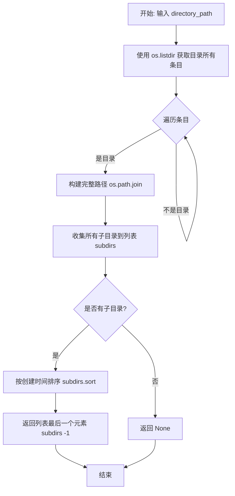
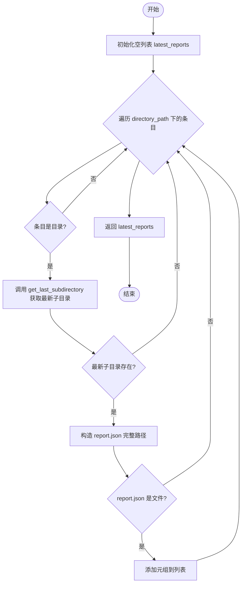
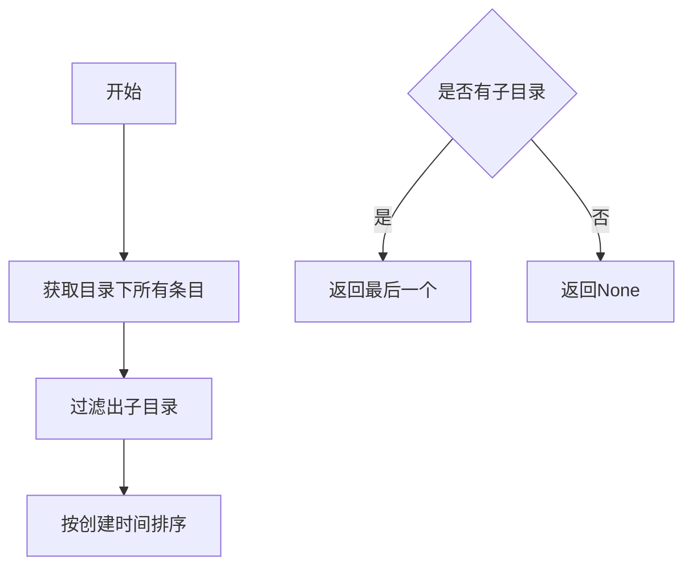
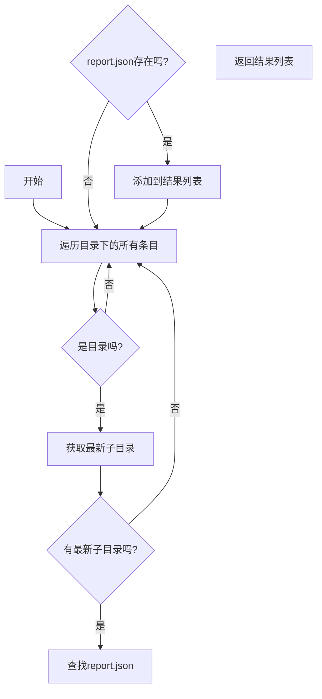

# `.\AutoGPT\classic\benchmark\agbenchmark\reports\processing\get_files.py` 详细设计文档

该代码是一个报告文件查找工具，通过扫描指定目录下的所有agent子目录，找出每个agent目录中最近创建的子目录，并在其中查找report.json文件，最终返回所有找到的报告文件路径列表。

## 整体流程

```mermaid
graph TD
    A[开始] --> B[调用get_latest_report_from_agent_directories]
B --> C{遍历directory_path下的所有条目}
C --> D{是目录吗?}
D -- 否 --> C
D -- 是 --> E[调用get_last_subdirectory获取最近子目录]
E --> F{最近子目录存在?}
F -- 否 --> C
F -- 是 --> G[构建report.json路径]
G --> H{report.json文件存在?}
H -- 否 --> C
H -- 是 --> I[将(subdir, report_file)添加到结果列表]
I --> C
C --> J[返回latest_reports列表]
J --> K[结束]
```

## 类结构

```
无类层次结构（纯函数模块）
└── get_last_subdirectory (全局函数)
└── get_latest_report_from_agent_directories (全局函数)
```

## 全局变量及字段


### `subdirs`
    
存储目录中所有子目录路径的列表

类型：`list[str]`
    


### `directory_path`
    
要扫描的目录路径

类型：`str`
    


### `latest_reports`
    
存储找到的报告文件元组列表

类型：`list[tuple[os.DirEntry[str], str]]`
    


### `subdir`
    
os.Scandir迭代出的目录条目

类型：`os.DirEntry[str]`
    


### `latest_subdir`
    
最近创建的子目录路径

类型：`str | None`
    


### `report_file`
    
报告文件的完整路径

类型：`str`
    


    

## 全局函数及方法


### `get_last_subdirectory`

获取指定目录下最近创建的子目录，如果目录为空或不存在子目录则返回 `None`。

参数：

- `directory_path`：`str`，要检查的目录路径

返回值：`str | None`，最近创建的子目录的完整路径，如果没有子目录则返回 `None`

#### 流程图



#### 带注释源码

```python
import os


def get_last_subdirectory(directory_path: str) -> str | None:
    """
    获取指定目录下最近创建的子目录。
    
    Args:
        directory_path: 要检查的目录路径
        
    Returns:
        最近创建的子目录的完整路径，如果没有子目录则返回 None
    """
    # 获取目录中所有的子目录（排除文件）
    subdirs = [
        os.path.join(directory_path, name)
        for name in os.listdir(directory_path)
        if os.path.isdir(os.path.join(directory_path, name))
    ]

    # 按创建时间排序子目录（升序）
    subdirs.sort(key=os.path.getctime)

    # 返回最后创建的子目录，如果列表为空则返回 None
    return subdirs[-1] if subdirs else None
```


### `get_latest_report_from_agent_directories`

该函数接收一个顶层代理目录路径，遍历其中的所有子目录（代理目录），对每个代理目录查找其最新创建的子目录，并在该最新子目录中查找 `report.json` 文件。最终返回一个列表，其中每个元素是一个元组，包含代理目录的 `DirEntry` 对象和对应报告文件的路径。

参数：
- `directory_path`：`str`，顶层代理目录的路径

返回值：`list[tuple[os.DirEntry[str], str]]`，返回由代理目录条目（`os.DirEntry` 对象）和对应的最新 `report.json` 文件路径组成的元组列表。如果没有找到任何报告文件，则返回空列表。

#### 流程图



#### 带注释源码

```python
def get_latest_report_from_agent_directories(
    directory_path: str,
) -> list[tuple[os.DirEntry[str], str]]:
    # 初始化结果列表，用于存储找到的报告文件信息
    latest_reports = []

    # 使用 os.scandir 遍历顶层目录下的所有条目
    for subdir in os.scandir(directory_path):
        # 判断当前条目是否为一个目录（即代理目录）
        if subdir.is_dir():
            # 调用辅助函数获取该代理目录下最新创建的子目录
            latest_subdir = get_last_subdirectory(subdir.path)
            
            # 如果成功获取到最新子目录
            if latest_subdir is not None:
                # 构造 report.json 文件的完整路径
                report_file = os.path.join(latest_subdir, "report.json")
                
                # 检查该路径是否指向一个实际的文件
                if os.path.isfile(report_file):
                    # 将目录条目和文件路径作为元组添加到结果列表中
                    latest_reports.append((subdir, report_file))

    # 返回包含所有找到的报告文件信息的列表
    return latest_reports
```


## 关键组件


### 目录遍历与子目录时间排序

该组件负责获取指定目录下的所有子目录，并按照创建时间进行排序，返回最新创建的子目录。它通过`os.listdir`遍历目录，使用`os.path.getctime`获取创建时间，并利用Python的列表排序功能实现时间顺序排列。

### 多级目录层级查找

该组件实现了在agent目录结构中逐层查找的能力。首先扫描顶层代理目录，然后递归进入每个代理目录查找其下的最新子目录，形成两层目录结构（agent目录 -> 时间子目录）的遍历和定位逻辑。

### 报告文件定位

该组件专注于在特定目录结构中定位报告文件。它在最新创建的子目录中查找名为"report.json"的文件，并返回包含目录条目和文件路径的元组列表，用于后续的报告处理流程。

### 目录扫描与条目封装

该组件使用`os.scandir`高效地扫描目录，能够同时获取目录项的名称和路径信息，返回`os.DirEntry`对象用于后续的文件系统操作和属性检查。


## 问题及建议


### 已知问题

-   `get_last_subdirectory` 函数使用 `os.listdir` 遍历目录，效率低于 `os.scandir`
-   获取最新子目录时使用全量排序 `subdirs.sort(key=os.path.getctime)`，时间复杂度 O(n log n)，而实际上只需遍历一次找到最大值即可，时间复杂度可降至 O(n)
-   `os.path.getctime` 在不同操作系统上行为不一致：Windows 返回创建时间，Unix/Linux 返回元数据修改时间
-   缺少异常处理：未处理 `FileNotFoundError`、`PermissionError`、`OSError` 等可能的 I/O 异常
-   `get_latest_report_from_agent_directories` 返回值命名与实际功能不完全匹配（返回列表但名称暗示单个报告）
-   函数参数和返回值缺少文档字符串（docstring）
-   未对空目录或不存在路径的情况进行提前校验，可能导致运行时错误

### 优化建议

-   使用 `os.scandir` 替代 `os.listdir` 以提高遍历效率
-   使用 `max()` 函数配合生成器表达式替代全量排序，获取最新创建时间的子目录
-   添加异常处理机制，使用 try-except 捕获可能的 I/O 错误，或在函数文档中明确说明异常传播
-   考虑使用 `pathlib.Path` 替代 `os.path` 以获得更现代、更面向对象的 API
-   为函数添加详细的文档字符串，说明参数、返回值和可能抛出的异常
-   若只需获取单个最新报告，可考虑添加参数控制是否获取所有报告，提高函数灵活性
-   对跨平台时间戳行为进行说明或统一处理，如需一致行为可考虑使用修改时间 `os.path.getmtime` 或显式记录创建时间


## 其它


### 一段话描述

该代码是一个目录扫描和报告查找工具，通过遍历指定目录下的所有子目录（代表不同的agent），找到每个agent目录下最新创建的子目录，并在其中查找`report.json`文件，最终返回所有找到的最新报告文件路径列表。

### 文件的整体运行流程

程序入口为`get_latest_report_from_agent_directories`函数，其流程如下：
1. 接收一个目录路径作为输入
2. 使用`os.scandir`遍历该目录下的所有条目
3. 对每个子目录（代表一个agent），调用`get_last_subdirectory`获取其下最新创建的子目录
4. 在最新子目录中查找名为`report.json`的文件
5. 如果找到则将（DirEntry, 文件路径）的元组添加到结果列表
6. 返回所有找到的最新报告文件列表

### 全局变量和全局函数信息

#### 全局函数：get_last_subdirectory

- **函数名称**: get_last_subdirectory
- **参数名称**: directory_path
- **参数类型**: str
- **参数描述**: 要查找子目录的父目录路径
- **返回值类型**: str | None
- **返回值描述**: 返回最新创建的子目录的完整路径，如果没有子目录则返回None

**mermaid流程图**:


**带注释源码**:
```python
def get_last_subdirectory(directory_path: str) -> str | None:
    # Get all subdirectories in the directory
    # 列出目录下所有条目，并过滤出子目录
    subdirs = [
        os.path.join(directory_path, name)
        for name in os.listdir(directory_path)
        if os.path.isdir(os.path.join(directory_path, name))
    ]

    # Sort the subdirectories by creation time
    # 按创建时间升序排序
    subdirs.sort(key=os.path.getctime)

    # Return the last subdirectory in the list
    # 返回最后创建的子目录（最新）
    return subdirs[-1] if subdirs else None
```

#### 全局函数：get_latest_report_from_agent_directories

- **函数名称**: get_latest_report_from_agent_directories
- **参数名称**: directory_path
- **参数类型**: str
- **参数描述**: 包含多个agent目录的父目录路径
- **返回值类型**: list[tuple[os.DirEntry[str], str]]
- **返回值描述**: 返回元组列表，每个元组包含DirEntry对象和对应report.json文件的路径

**mermaid流程图**:


**带注释源码**:
```python
def get_latest_report_from_agent_directories(
    directory_path: str,
) -> list[tuple[os.DirEntry[str], str]]:
    # 存储找到的最新报告
    latest_reports = []

    # 遍历目录下的所有条目
    for subdir in os.scandir(directory_path):
        # 只处理目录类型（每个目录代表一个agent）
        if subdir.is_dir():
            # Get the most recently created subdirectory within this agent's directory
            # 获取该agent目录下最新创建的子目录
            latest_subdir = get_last_subdirectory(subdir.path)
            if latest_subdir is not None:
                # Look for 'report.json' in the subdirectory
                # 在最新子目录中查找report.json文件
                report_file = os.path.join(latest_subdir, "report.json")
                if os.path.isfile(report_file):
                    # 找到则添加到结果列表
                    latest_reports.append((subdir, report_file))

    return latest_reports
```

### 关键组件信息

- **组件名称**: get_last_subdirectory
  - **一句话描述**: 按创建时间排序获取目录下最新创建的子目录

- **组件名称**: get_latest_report_from_agent_directories
  - **一句话描述**: 扫描agent目录并收集每个agent最新报告文件的主函数

- **组件名称**: os.scandir
  - **一句话描述**: 高效遍历目录的迭代器，返回DirEntry对象

- **组件名称**: os.path.getctime
  - **一句话描述**: 获取文件创建时间的函数，用于子目录排序

### 潜在的技术债务或优化空间

1. **错误处理不足**: 函数没有处理目录不存在、权限不足等异常情况
2. **性能考虑**: 每次调用都会遍历所有子目录并排序，对于大量子目录的场景性能较差，可以考虑使用max替代全量排序
3. **类型注解**: 使用了Python 3.10+的联合类型语法`str | None`，需要确保运行时环境支持
4. **硬编码文件名**: report.json文件名硬编码，如果需要支持其他文件名需要修改函数
5. **日志缺失**: 没有任何日志记录，无法追踪执行过程和问题排查
6. **并发支持**: 当前是串行处理，可以考虑使用多进程/多线程提升性能

### 设计目标与约束

- **设计目标**: 提供一个能够从多个agent目录中自动发现并收集最新报告文件的工具
- **设计约束**:
  - 依赖Python标准库os模块，无外部依赖
  - 使用`os.path.getctime`获取创建时间，在不同操作系统上行为可能不同（Unix系统可能返回最后修改时间）
  - 假设每个agent目录下有且仅有一个report.json文件
  - 输入目录必须存在且可读

### 错误处理与异常设计

1. **目录不存在**: 当`directory_path`不存在时，`os.listdir`、`os.scandir`会抛出`FileNotFoundError`，需要捕获处理
2. **权限不足**: 当没有读取目录权限时，会抛出`PermissionError`
3. **空目录处理**: `get_last_subdirectory`已处理空目录情况，返回None
4. **建议改进**:
   - 添加try-except捕获FileNotFoundError和PermissionError
   - 可以添加自定义异常类如`ReportScannerError`
   - 考虑添加错误回调机制或错误日志记录

### 数据流与状态机

**数据流**:
```
输入: directory_path (str)
    ↓
扫描目录 → 获取DirEntry列表
    ↓
过滤子目录 → 对每个子目录执行
    ↓
获取最新子目录 → 按创建时间排序
    ↓
查找report.json → 文件存在性检查
    ↓
构建结果 → (DirEntry, 路径)元组列表
    ↓
输出: latest_reports (list)
```

**状态机**:
- 初始状态: READY
- 遍历状态: SCANNING
- 处理状态: PROCESSING
- 完成状态: COMPLETED
- 错误状态: ERROR

### 外部依赖与接口契约

- **依赖模块**: os (Python标准库)
- **接口契约**:
  - 输入: 有效的目录路径字符串
  - 输出: 元组列表，每个元组第一个元素是`os.DirEntry`对象，第二个元素是report.json的完整路径字符串
  - 前置条件: 目录必须存在且可读
  - 后置条件: 返回列表可能为空（未找到任何报告）

### 性能考虑与优化建议

1. **排序优化**: 当前使用`sort`对所有子目录全量排序，时间复杂度O(n log n)，可以使用单次遍历找最大值优化到O(n)
2. **文件系统优化**: 考虑缓存目录扫描结果，避免重复扫描
3. **懒加载**: 对于大型目录，考虑使用生成器替代列表返回
4. **并发优化**: 使用`concurrent.futures`实现并行扫描多个agent目录
</think>
    