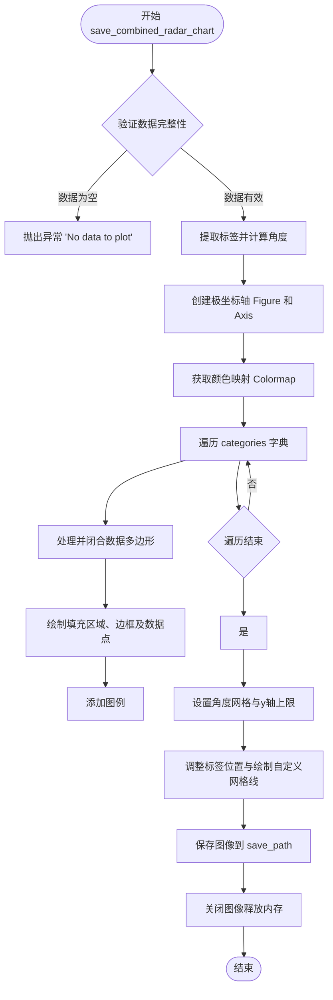
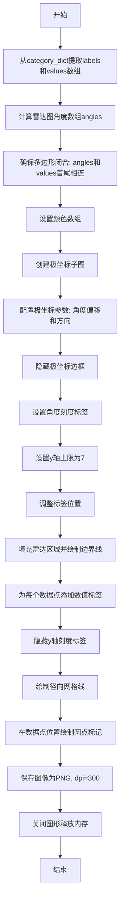
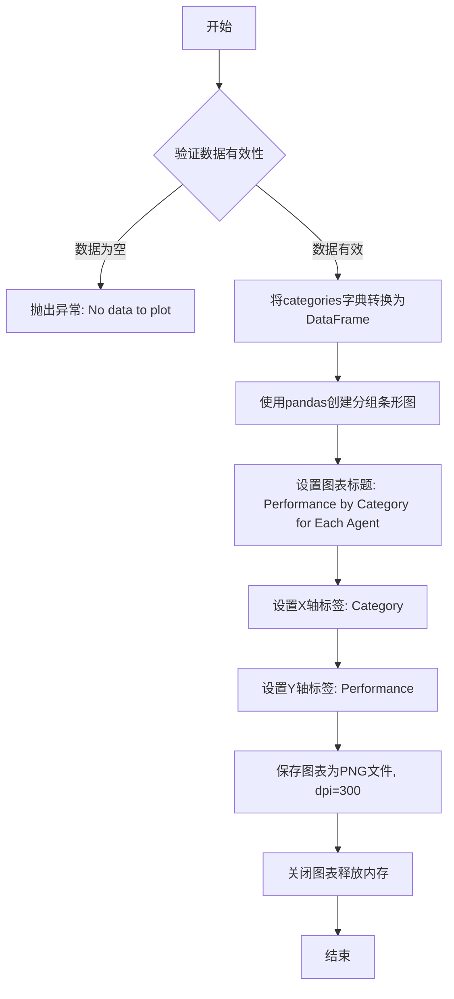

# `.\AutoGPT\classic\benchmark\agbenchmark\reports\processing\graphs.py` 详细设计文档

该模块主要提供基于 Matplotlib 和 Pandas 的数据可视化功能，用于生成并保存单类别/多类别雷达图以及分组柱状图。

## 整体流程

```mermaid
graph TD
    Start([调用绘图函数]) --> Validate{数据校验}
    Validate -- 空值或无效 --> Error[raise Exception]
    Validate -- 有效 --> Init[初始化图表参数与颜色映射]
    Init --> CreateAxes[创建极坐标/笛卡尔坐标轴]
    CreateAxes --> Loop{遍历数据系列}
    Loop -- 有数据 --> Draw[绘制填充、线条及标注点]
    Draw --> Style[调整坐标轴范围、网格线与图例]
    Style --> Save[保存图像至文件 (PNG)]
    Save --> Cleanup[关闭图形释放内存]
    Cleanup --> End([返回])
```

## 类结构

```
Module: chart_renderer
└── Functions (No Class Hierarchy)
```

## 全局变量及字段


### `categories`
    
包含多个类别数据的字典，用于组合雷达图或柱状图

类型：`dict[str, Any]`
    


### `save_path`
    
文件保存路径，支持字符串或Path对象

类型：`str | Path`
    


### `labels`
    
雷达图的标签数组，从字典键提取

类型：`np.ndarray`
    


### `num_vars`
    
雷达图的变量数量，即标签的数量

类型：`int`
    


### `angles`
    
雷达图的角度列表，用于绘制多边形

类型：`list[float]`
    


### `fig`
    
matplotlib创建的图形对象

类型：`matplotlib.figure.Figure`
    


### `ax`
    
matplotlib的坐标轴对象，用于绘图

类型：`matplotlib.axes.Axes`
    


### `cmap`
    
颜色映射对象，用于生成多个类别颜色

类型：`matplotlib.colors.Colormap`
    


### `colors`
    
颜色列表，为每个类别分配颜色

类型：`list`
    


### `i`
    
循环索引，用于遍历类别

类型：`int`
    


### `cat_name`
    
类别名称，字典的键

类型：`str`
    


### `cat_values`
    
类别对应的值字典

类型：`dict`
    


### `values`
    
数值数组，用于绘制雷达图或多边形

类型：`np.ndarray`
    


### `lines`
    
角度网格线

类型：`list`
    


### `label`
    
角度标签文本对象

类型：`matplotlib.text.Text`
    


### `highest_score`
    
雷达图Y轴上限，固定为7

类型：`int`
    


### `y`
    
网格线或标签的Y坐标

类型：`int | float`
    


### `angle`
    
单个角度值

类型：`float`
    


### `value`
    
单个数据值

类型：`int | float`
    


### `ha`
    
水平对齐方式，用于文本定位

类型：`str`
    


### `category_dict`
    
单个类别的标签到整数的映射

类型：`dict[str, int]`
    


### `df`
    
pandas数据框，用于存储类别数据

类型：`pd.DataFrame`
    


    

## 全局函数及方法


### `save_combined_radar_chart`

该函数用于生成并保存一个多系列的雷达图（Spider Chart），它能够将多个类别（例如不同 Agent）的多项指标数据进行可视化对比。函数首先过滤无效数据，计算雷达图的闭合角度，设置极坐标轴，遍历绘制每个类别的多边形区域及数据点，添加图例和自定义网格，最后将生成的图表保存为高分辨率的 PNG 图像。

参数：

- `categories`：`dict[str, Any]`，字典结构，用于存储多个系列的数据。键（Key）为系列名称（如 "Agent A"），值（Value）为一个内部字典，映射指标名称（如 "Speed", "Accuracy"）到对应的分数（整数或浮点数）。
- `save_path`：`str | Path`，字符串或 Path 对象，指定保存生成的雷达图图像文件的路径。

返回值：`None`，该函数无返回值，主要通过副作用（写入文件）完成功能。

#### 流程图



#### 带注释源码

```python
from pathlib import Path
from typing import Any

import matplotlib.patches as mpatches
import matplotlib.pyplot as plt
import numpy as np
import pandas as pd


def save_combined_radar_chart(
    categories: dict[str, Any], save_path: str | Path
) -> None:
    # 过滤掉值为空（Falsy）的类别
    categories = {k: v for k, v in categories.items() if v}
    # 如果过滤后所有类别都为空，则抛出异常
    if not all(categories.values()):
        raise Exception("No data to plot")
    
    # 从第一个类别的键中提取雷达图的标签（例如：['Speed', 'Reliability', ...]）
    labels = np.array(
        list(next(iter(categories.values())).keys())
    )  
    num_vars = len(labels)
    
    # 计算雷达图的角度列表（0 到 2*PI）
    angles = np.linspace(0, 2 * np.pi, num_vars, endpoint=False).tolist()
    # 将第一个角度添加到列表末尾以闭合多边形
    angles += angles[:1]

    # 创建雷达图画布
    fig, ax = plt.subplots(figsize=(6, 6), subplot_kw=dict(polar=True))
    # 设置极坐标的偏移和方向
    ax.set_theta_offset(np.pi / 2)  # type: ignore
    ax.set_theta_direction(-1)  # type: ignore
    # 隐藏极坐标的边框
    ax.spines["polar"].set_visible(False)  # Remove border

    # 获取颜色映射 'nipy_spectral'，颜色数量取决于类别数量
    cmap = plt.cm.get_cmap("nipy_spectral", len(categories))  # type: ignore

    # 生成对应的颜色列表
    colors = [cmap(i) for i in range(len(categories))]

    # 遍历每个类别进行绘图
    for i, (cat_name, cat_values) in enumerate(
        categories.items()
    ):  # Iterating through each category (series)
        # 提取该类别下的所有值
        values = np.array(list(cat_values.values()))
        # 确保多边形闭合：将第一个值添加到末尾
        values = np.concatenate((values, values[:1]))  # Ensure the polygon is closed

        # 绘制填充区域
        ax.fill(angles, values, color=colors[i], alpha=0.25)  # Draw the filled polygon
        # 绘制多边形边框线
        ax.plot(angles, values, color=colors[i], linewidth=2)  # Draw polygon
        # 绘制数据点（白色圆点带边框）
        ax.plot(
            angles,
            values,
            "o",
            color="white",
            markersize=7,
            markeredgecolor=colors[i],
            markeredgewidth=2,
        )  # Draw points

        # 绘制图例
        # 注意：此代码在循环内部，意味着每次迭代都会重新添加图例，
        # 这可能导致图例重复叠加或性能稍低，通常图例应放在循环外统一添加。
        ax.legend(
            handles=[
                mpatches.Patch(color=color, label=cat_name, alpha=0.25)
                for cat_name, color in zip(categories.keys(), colors)
            ],
            loc="upper left",
            bbox_to_anchor=(0.7, 1.3),
        )

        # 调整布局以容纳图例
        plt.tight_layout()

    # 设置角度网格标签（角度刻度）
    lines, labels = plt.thetagrids(
        np.degrees(angles[:-1]), (list(next(iter(categories.values())).keys()))
    )  # We use the first category to get the keys

    # 定义雷达图的最大分数（Y轴上限）
    highest_score = 7

    # 设置 y 轴上限
    ax.set_ylim(top=highest_score)

    # 调整角度标签的位置，使其偏离图表中心
    for label in labels:
        label.set_position(
            (label.get_position()[0], label.get_position()[1] + -0.05)
        )  # adjust 0.1 as needed

    # 设置径向标签的位置
    ax.set_rlabel_position(180)  # type: ignore

    # 隐藏默认的 y 轴刻度
    ax.set_yticks([])  # Remove default yticks

    # 手动创建网格线（径向）
    for y in np.arange(0, highest_score + 1, 1):
        if y != highest_score:
            ax.plot(
                angles, [y] * len(angles), color="gray", linewidth=0.5, linestyle=":"
            )
        # 为手动创建的网格线添加标签
        ax.text(
            angles[0],
            y + 0.2,
            str(int(y)),
            color="black",
            size=9,
            horizontalalignment="center",
            verticalalignment="center",
        )

    # 保存图像为 PNG，dpi 设为 300 以保证高清质量
    plt.savefig(save_path, dpi=300)  # Save the figure as a PNG file
    # 关闭图像以释放内存
    plt.close()  # Close the figure to free up memory
```


### `save_single_radar_chart`

该函数用于绘制单个类别的雷达图，接收类别名称到数值的字典和保存路径，使用 matplotlib 绘制雷达图并保存为高分辨率 PNG 图像文件。

参数：

- `category_dict`：`dict[str, int]`，类别名称到分数数值的字典，例如 {"A": 5, "B": 6, "C": 4}
- `save_path`：`str | Path`，雷达图保存的文件路径

返回值：`None`，该函数不返回任何值，仅保存图像文件

#### 流程图



#### 带注释源码

```python
def save_single_radar_chart(
    category_dict: dict[str, int], save_path: str | Path
) -> None:
    """
    绘制单个类别的雷达图并保存为PNG文件
    
    Args:
        category_dict: 类别名称到数值的字典，如 {"沟通能力": 5, "技术能力": 6}
        save_path: 保存图片的路径
    
    Returns:
        None
    """
    # 从字典中提取键作为标签（雷达图的各个维度）
    labels = np.array(list(category_dict.keys()))
    # 从字典中提取值作为数据点
    values = np.array(list(category_dict.values()))

    # 获取维度数量
    num_vars = len(labels)

    # 生成角度数组：从0到2*pi，均匀分布
    angles = np.linspace(0, 2 * np.pi, num_vars, endpoint=False).tolist()

    # 将第一个角度添加到末尾，确保多边形闭合
    angles += angles[:1]
    # 将第一个值添加到末尾，确保数据多边形闭合
    values = np.concatenate((values, values[:1]))

    # 设置雷达图的颜色（蓝色）
    colors = ["#1f77b4"]

    # 创建极坐标子图，设置图形大小为6x6英寸
    fig, ax = plt.subplots(figsize=(6, 6), subplot_kw=dict(polar=True))
    # 设置角度偏移，使0度角指向正上方（90度）
    ax.set_theta_offset(np.pi / 2)  # type: ignore
    # 设置角度方向为逆时针
    ax.set_theta_direction(-1)  # type: ignore

    # 隐藏极坐标边框（雷达图外圈）
    ax.spines["polar"].set_visible(False)

    # 设置角度刻度标签（雷达图各维度名称）
    lines, labels = plt.thetagrids(
        np.degrees(angles[:-1]), (list(category_dict.keys()))
    )

    # 设置最高分数为7，用于y轴上限
    highest_score = 7

    # 设置y轴上限为7，确保雷达图不会超出预期范围
    ax.set_ylim(top=highest_score)

    # 调整角度标签的位置，使其稍微远离中心
    for label in labels:
        label.set_position((label.get_position()[0], label.get_position()[1] + -0.05))

    # 填充雷达区域，alpha设置透明度为0.25
    ax.fill(angles, values, color=colors[0], alpha=0.25)
    # 绘制雷达图的边界线，设置线宽为2
    ax.plot(angles, values, color=colors[0], linewidth=2)

    # 为每个数据点添加数值标签
    for i, (angle, value) in enumerate(zip(angles, values)):
        # 根据角度确定水平对齐方式
        ha = "left"
        if angle in {0, np.pi}:
            ha = "center"
        elif np.pi < angle < 2 * np.pi:
            ha = "right"
        # 在数据点附近添加数值文本
        ax.text(
            angle,
            value - 0.5,  # 位于数据点下方
            f"{value}",
            size=10,
            horizontalalignment=ha,
            verticalalignment="center",
            color="black",
        )

    # 隐藏y轴刻度标签
    ax.set_yticklabels([])

    # 隐藏y轴刻度
    ax.set_yticks([])

    # 检查是否有数据，如果没有则直接返回
    if values.size == 0:
        return

    # 绘制径向网格线（从中心向外辐射的虚线）
    for y in np.arange(0, highest_score, 1):
        ax.plot(angles, [y] * len(angles), color="gray", linewidth=0.5, linestyle=":")

    # 在每个数据点位置绘制白色圆点标记
    for angle, value in zip(angles, values):
        ax.plot(
            angle,
            value,
            "o",
            color="white",
            markersize=7,
            markeredgecolor=colors[0],
            markeredgewidth=2,
        )

    # 保存图形为PNG文件，设置分辨率为300 DPI
    plt.savefig(save_path, dpi=300)  # Save the figure as a PNG file
    # 关闭图形以释放内存
    plt.close()  # Close the figure to free up memory
```


### `save_combined_bar_chart`

该函数用于生成分组条形图，展示不同智能体在各个性能类别上的对比数据，并将图表保存为PNG图像文件。

参数：

- `categories`：`dict[str, Any]`，字典类型，键为类别名称，值为对应的性能数据（字典或类似结构）
- `save_path`：`str | Path`，文件保存路径，支持字符串或Path对象

返回值：`None`，无返回值，该函数直接保存图表文件

#### 流程图



#### 带注释源码

```python
def save_combined_bar_chart(categories: dict[str, Any], save_path: str | Path) -> None:
    # 检查所有类别是否有有效数据值，如果存在空值则抛出异常
    if not all(categories.values()):
        raise Exception("No data to plot")

    # 将输入的字典结构转换为pandas DataFrame，以便于绘图
    # DataFrame的列将对应categories的键（类别），行对应各个数据系列
    df = pd.DataFrame(categories)

    # 使用pandas的plot方法创建分组条形图
    # kind="bar"指定为条形图，figsize设置图表大小为10x7英寸
    df.plot(kind="bar", figsize=(10, 7))

    # 设置图表标题，描述图表展示的内容
    plt.title("Performance by Category for Each Agent")
    
    # 设置X轴标签
    plt.xlabel("Category")
    
    # 设置Y轴标签
    plt.ylabel("Performance")

    # 将图表保存为PNG文件，dpi=300设置高分辨率
    plt.savefig(save_path, dpi=300)  # Save the figure as a PNG file
    
    # 关闭图表对象以释放内存资源，避免内存泄漏
    plt.close()  # Close the figure to free up memory
```

## 关键组件


### 雷达图角度计算组件

负责计算雷达图的角度数组，包括角度生成和闭合多边形。通过 `np.linspace` 生成均匀分布的角度，并使用 `angles += angles[:1]` 确保多边形闭合。

### 雷达图多系列绘制组件

处理组合雷达图的多类别数据绘制，包括数据遍历、颜色映射、填充多边形、边框绘制和数据点标记。支持同时展示多个类别的性能数据。

### 颜色映射管理组件

使用 matplotlib 的 colormap（'nipy_spectral'）为不同类别分配颜色，提供视觉区分。单个雷达图使用固定颜色 "#1f77b4"。

### 图表布局调整组件

负责调整雷达图的布局，包括设置 theta 偏移和方向、隐藏极坐标边框、移动标签位置、设置径向标签位置等，以优化图表视觉效果。

### 自定义网格系统组件

手动创建雷达图的网格线和刻度标签，包括放射状网格线的绘制和数值标签的放置，提供更精细的视觉控制。

### 数据验证组件

验证输入数据的有效性，检查字典是否为空或包含空值，确保有有效数据可供绘图，否则抛出异常。

### 图表保存组件

负责将绘制的图表保存为 PNG 格式文件，设置 300 DPI 分辨率，并在保存后关闭图表以释放内存资源。

### 条形图数据转换组件

将字典格式的分类数据转换为 pandas DataFrame，以便使用 pandas 的绘图功能创建分组条形图。

### 雷达图数据点标注组件

在单个雷达图上为每个数据点添加数值标签，根据角度位置动态调整水平对齐方式，确保标签的可读性。


## 问题及建议


### 已知问题

-   **代码重复（DRY原则违反）**：save_combined_radar_chart 和 save_single_radar_chart 存在大量重复的雷达图绘制逻辑（角度计算、极坐标配置、样式设置等），应该提取公共逻辑到私有函数
-   **魔法数字和硬编码值**：highest_score=7、alpha=0.25、linewidth=2、markersize=7、figsize=(6,6)、dpi=300 等样式参数散落在代码各处，缺乏常量统一管理
-   **错误处理不完善**：只做了简单的空值检查，没有处理文件写入失败、颜色映射表不存在、matplotlib 依赖缺失等异常情况
-   **类型提示过于宽泛**：categories: dict[str, Any] 使用 Any 损失了类型安全性和IDE智能提示能力
-   **plt.tight_layout() 位置错误**：在 save_combined_radar_chart 的 for 循环内部调用，每次迭代都会执行，应该移到循环外部
-   **图例重复创建**：ax.legend() 在 for 循环内每次迭代都重新创建，导致重复渲染
-   **缺少输入验证**：没有对空字典、非法数据类型、save_path 无效路径等进行提前验证
-   **API 兼容性风险**：依赖 matplotlib 内部 API 如 ax.spines["polar"]，可能在版本升级时失效
-   **可测试性差**：核心绘图逻辑与 matplotlib 强耦合，没有提取可独立测试的业务逻辑，难以进行单元测试
-   **文档缺失**：所有函数都缺少 docstring，参数和返回值没有说明

### 优化建议

-   **提取公共函数**：将雷达图的公共逻辑（如角度计算、图形初始化、样式配置）抽取为私有函数，避免代码重复
-   **使用配置类或常量**：创建配置类或常量模块统一管理样式参数（颜色、透明度、线宽等）
-   **增强错误处理**：添加 try-except 捕获文件写入异常、依赖缺失等，使用自定义异常类提供更清晰的错误信息
-   **改进类型提示**：为 categories 使用更精确的类型定义，如 TypedDict 或泛型约束
-   **修复布局逻辑**：将 plt.tight_layout() 移到 for 循环外部，图例创建移到循环外部只执行一次
-   **添加输入验证**：在函数开头添加参数校验，提前返回或抛出有意义的错误信息
-   **添加文档注释**：为所有函数添加详细的 docstring，说明功能、参数、返回值和可能抛出的异常
-   **解耦绘图逻辑**：将数据处理逻辑与 matplotlib 调用分离，便于单元测试
-   **考虑使用类封装**：将相关函数封装为ChartGenerator类，共享配置和资源


## 其它


### 设计目标与约束

该模块的核心设计目标是为性能评估系统提供标准化的数据可视化能力，将多维评分数据以雷达图和条形图的形式直观展示。设计约束包括：1）雷达图固定支持7分制评分体系，最高分数硬编码为7；2）输出图像分辨率固定为300 DPI的PNG格式；3）颜色方案依赖matplotlib内置的nipy_spectral色谱；4）仅支持Path或str类型的文件保存路径。

### 错误处理与异常设计

代码中包含两处异常抛出逻辑：1）在`save_combined_radar_chart`和`save_combined_bar_chart`中，当输入字典的value为空或全为False时抛出Exception("No data to plot")；2）在`save_single_radar_chart`中对空值数组进行提前返回处理。异常设计存在的问题是：异常类型过于宽泛（通用Exception），缺乏具体的错误码和错误分类；缺少对输入数据类型、字典结构合法性的校验；plt.savefig和plt.close的异常未被捕获，可能导致资源泄漏。

### 数据流与状态机

数据流从输入的字典对象开始，经历三个阶段：数据预处理阶段（字典键值提取、numpy数组转换、角度计算）、图形渲染阶段（matplotlib子图创建、极坐标转换、多边形绘制）、文件输出阶段（savefig保存、close释放资源）。状态机方面，雷达图绘制存在"初始化→数据映射→填充绘制→点标记→网格线→标签调整→保存关闭"的固定流程，但缺乏中间状态的管理和回滚机制。

### 外部依赖与接口契约

核心依赖包括：numpy（数值计算）、pandas（DataFrame转换）、matplotlib（图形渲染）。接口契约方面：输入参数categories为dict[str, Any]或dict[str, int]，key为类别名称（字符串），value为对应评分字典或整数；save_path接受str或Path类型；返回值均为None。存在接口缺陷：未使用typing中的Literal或TypeAlias进行精确类型标注；Any类型过于宽松，无法约束value的具体结构。

### 性能考虑与优化空间

当前实现存在以下性能问题：1）每个函数都创建新的figure和axes，频繁调用plt.subplots带来开销；2）plt.tight_layout()在循环内多次调用（save_combined_radar_chart中），应在循环外执行；3）legend创建使用了列表推导式但未去重（当categories有重复键时）；4）np.arange生成的网格线存在重复绘制（y=highest_score时跳过但后续仍有绘制）。优化方向包括：提取公共的图表初始化逻辑、使用面向对象封装减少重复代码、引入缓存机制复用figure对象。

### 安全性考虑

代码未对用户输入进行充分验证，存在以下安全隐患：1）save_path未验证路径可写性，plt.savefig失败时未清理资源；2）matplotlib的rcParams未进行安全配置，可能继承全局样式导致渲染不一致；3）dpi参数可被外部控制，高值可能导致内存耗尽。建议添加路径存在性检查、权限验证、参数边界限制。

### 可测试性设计

当前代码的可测试性较差，原因包括：1）函数直接依赖matplotlib的全局状态，单元测试难以mock；2）缺乏抽象接口，直接调用plt函数导致难以隔离；3）没有返回值，仅通过文件副作用验证功能。改进建议：引入依赖注入模式，将matplotlib绘图逻辑抽象为接口；添加返回值或回调机制便于验证；将硬编码的配置（如highest_score=7、dpi=300）提取为可选参数。

### 边界条件处理

代码对以下边界情况有部分处理：空值字典（通过if not all(categories.values())检查）、空数组（save_single_radar_chart中的提前返回）。但仍存在未处理的边界情况：1）单类别雷达图时角度计算可能异常；2）字典value为0时的处理逻辑不明确；3）labels数量与values数量不匹配时未校验；4）save_path为只读路径或磁盘空间不足时无保护。

### 配置与参数管理

当前所有配置参数（highest_score=7、dpi=300、figsize=(6,6)、颜色映射等）均硬编码在函数内部，缺乏灵活的配置机制。建议将可视化参数抽取为配置类或dataclass，支持通过参数注入或配置文件方式自定义，同时保持向后兼容的默认值。

### 关键组件信息

1. **categories字典结构**：输入数据的标准格式，外层key为类别/系列名称，内层为label-value映射字典；2. **角度计算逻辑**：np.linspace生成闭合多边形的角度数组，首尾相接确保多边形封闭；3. **极坐标轴配置**：theta_offset和theta_direction的设置决定雷达图起始角度和旋转方向；4. **网格线渲染**：手动绘制的虚线网格替代默认刻度，实现7分制的视觉分级。

    