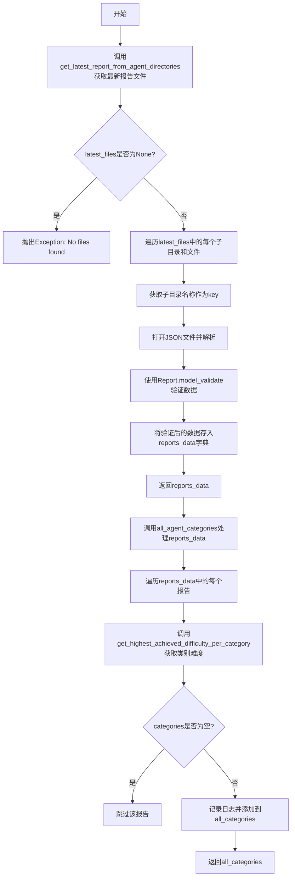

# `.\AutoGPT\classic\benchmark\agbenchmark\reports\processing\process_report.py` 详细设计文档

该代码是一个基准测试报告处理模块，主要功能是从多个代理目录中读取最新的JSON格式测试报告，使用Pydantic模型验证数据结构，然后按类别计算每个代理所达成的最高难度等级，并聚合所有代理的类别难度信息用于后续分析和可视化。

## 整体流程



## 类结构

```
ReportsProcessing (报告处理模块)
├── get_reports_data (获取报告数据函数)
├── get_highest_achieved_difficulty_per_category (计算最高难度函数)
└── all_agent_categories (聚合所有代理类别函数)
```

## 全局变量及字段


### `logger`
    
用于记录日志的模块级变量

类型：`logging.Logger`
    


    

## 全局函数及方法


### `get_reports_data`

该函数是报告数据获取与验证的核心入口点，接收报告目录路径作为输入，调用 `get_latest_report_from_agent_directories` 获取各代理子目录中的最新报告文件，遍历读取并使用 Pydantic 模型验证 JSON 数据，最后返回以子目录名称为键、验证后的 Report 对象为值的字典。

#### 参数

- `report_path`：`str`，报告目录的路径，用于定位包含报告文件的根目录

#### 返回值

`dict[str, Any]`，返回一个字典，其中键为子目录名称（字符串），值为验证后的 `Report` 对象

#### 流程图

```mermaid
flowchart TD
    A[开始] --> B[调用 get_latest_report_from_agent_directories]
    B --> C{latest_files 是否为空?}
    C -->|是| D[抛出 Exception: No files found in the reports directory]
    C -->|否| E[遍历 latest_files]
    E --> F[获取子目录名称 subdir_name]
    F --> G[打开 JSON 文件]
    G --> H[json.load 读取数据]
    H --> I[Report.model_validate 验证数据]
    I --> J[reports_data[subdir_name] = converted_data]
    J --> K{是否还有更多文件?}
    K -->|是| E
    K -->|否| L[返回 reports_data 字典]
```

#### 带注释源码

```python
def get_reports_data(report_path: str) -> dict[str, Any]:
    """
    获取并验证报告数据
    
    Args:
        report_path: 报告目录的路径
        
    Returns:
        包含各代理报告数据的字典，键为子目录名称，值为 Report 对象
        
    Raises:
        Exception: 当报告目录中没有找到任何文件时
    """
    # 调用函数获取各代理子目录中的最新报告文件列表
    latest_files = get_latest_report_from_agent_directories(report_path)

    # 初始化用于存储报告数据的字典
    reports_data = {}

    # 检查是否获取到任何报告文件
    if latest_files is None:
        # 如果没有找到文件，抛出异常
        raise Exception("No files found in the reports directory")

    # 遍历每个子目录及其对应的最新文件
    for subdir, file in latest_files:
        # 获取子目录的名称（路径的最后一个目录名）
        subdir_name = os.path.basename(os.path.normpath(subdir))
        
        # 打开并读取 JSON 文件内容
        with open(Path(subdir) / file, "r") as f:
            # 从文件中加载 JSON 数据
            json_data = json.load(f)
            
            # 使用 Pydantic 模型验证 JSON 数据，转换为 Report 对象
            converted_data = Report.model_validate(json_data)
            
            # 以子目录名称为键，将验证后的数据存入字典
            reports_data[subdir_name] = converted_data

    # 返回包含所有报告数据的字典
    return reports_data
```


### `get_highest_achieved_difficulty_per_category`

该函数接收一个测试报告对象，遍历其中的测试数据，针对每个测试的类别计算该类别下成功完成的最高难度值，并返回一个以类别为键、最高难度数值为键的字典。

参数：

- `report`：`Report`，包含测试数据的报告对象

返回值：`dict[str, Any]`，类别名称到最高难度数值的映射字典

#### 流程图

```mermaid
flowchart TD
    A[开始] --> B[初始化空字典 categories]
    B --> C[遍历 report.tests 中的每个 test_data]
    C --> D{还有更多测试?}
    D -->|是| E[遍历当前测试的 category 列表]
    E --> F{category 在 ['interface', 'iterate', 'product_advisor'] 中?}
    F -->|是| C
    F -->|否| G[使用 setdefault 将 category 初始化为 0]
    G --> H{测试有结果 且 全部成功 且 有难度值?}
    H -->|否| C
    H -->|是| I[将难度字符串转换为数值 num_dif]
    I --> J{num_dif > categories[category]?}
    J -->|是| K[更新 categories[category] = num_dif]
    J -->|否| C
    K --> C
    D -->|否| L[返回 categories 字典]
```

#### 带注释源码

```python
def get_highest_achieved_difficulty_per_category(report: Report) -> dict[str, Any]:
    """
    计算单个报告在每个类别下达到的最高难度
    
    参数:
        report: 包含测试结果的报告对象
        
    返回:
        字典，键为类别名称，值为该类别下成功完成的最高难度数值
    """
    # 用于存储每个类别的最高难度值
    categories: dict[str, Any] = {}

    # 遍历报告中的所有测试数据
    for _, test_data in report.tests.items():
        # 遍历当前测试的所有类别
        for category in test_data.category:
            # 跳过特殊类别，这些类别不参与难度计算
            if category in ("interface", "iterate", "product_advisor"):
                continue
            
            # 如果类别不存在，则初始化为 0
            categories.setdefault(category, 0)
            
            # 检查测试是否成功完成：
            # 1. test_data.results 存在且非空
            # 2. 所有结果都是成功的 (all(r.success for r in test_data.results))
            # 3. 测试有难度值
            if (
                test_data.results
                and all(r.success for r in test_data.results)
                and test_data.difficulty
            ):
                # 将难度字符串转换为数值
                num_dif = STRING_DIFFICULTY_MAP[test_data.difficulty]
                
                # 如果当前难度高于该类别记录的最高难度，则更新
                if num_dif > categories[category]:
                    categories[category] = num_dif

    # 返回每个类别的最高难度
    return categories
```


### `all_agent_categories`

该函数用于聚合所有代理的类别难度。它接收包含多个代理报告数据的字典，遍历每个报告，通过调用 `get_highest_achieved_difficulty_per_category` 函数获取该报告在各个类别下所达到的最高难度值，最后将这些信息整合成一个以代理名称为键、类别难度字典为值的汇总结果返回。

参数：

- `reports_data`：`dict[str, Any]`，包含所有代理报告数据的字典，键为代理名称，值为 `Report` 对象

返回值：`dict[str, Any]`，聚合后的结果字典，键为代理名称，值为该代理在各测试类别下所达到的最高难度值（数值形式）组成的字典

#### 流程图

```mermaid
flowchart TD
    A[开始: all_agent_categories] --> B[初始化空字典 all_categories]
    B --> C{遍历 reports_data 中的每一项}
    C -->|每次迭代: name, report|D[调用 get_highest_achieved_difficulty_per_category]
    D --> E{返回的 categories 是否非空}
    E -->|是| F[记录调试日志: 添加 {name}: {categories}]
    E -->|否| G[跳过当前类别, 继续下一轮]
    F --> H[将 categories 添加到 all_categories[name]]
    H --> C
    G --> C
    C -->|遍历结束| I[返回 all_categories 字典]
    I --> J[结束]
```

#### 带注释源码

```python
def all_agent_categories(reports_data: dict[str, Any]) -> dict[str, Any]:
    """
    聚合所有代理的类别难度
    
    Args:
        reports_data: 包含所有代理报告数据的字典，键为代理名称，值为 Report 对象
        
    Returns:
        聚合后的结果字典，键为代理名称，值为该代理在各测试类别下所达到的最高难度值
    """
    # 初始化用于存储所有代理类别难度的空字典
    all_categories: dict[str, Any] = {}

    # 遍历每个代理的报告数据
    for name, report in reports_data.items():
        # 调用函数获取该报告在各类别下的最高难度
        categories = get_highest_achieved_difficulty_per_category(report)
        
        # 仅当 categories 非空时才添加到结果中
        if categories:  # only add to all_categories if categories is not empty
            # 记录调试日志，便于追踪数据聚合过程
            logger.debug(f"Adding {name}: {categories}")
            # 将该代理的类别难度信息存入结果字典
            all_categories[name] = categories

    # 返回聚合后的所有代理类别难度数据
    return all_categories
```

---

### 补充信息

#### 关键依赖函数

| 函数名 | 描述 |
|--------|------|
| `get_highest_achieved_difficulty_per_category` | 获取单个报告在各测试类别下所达到的最高难度值 |

#### 潜在技术债务与优化空间

1. **硬编码过滤类别**：在 `get_highest_achieved_difficulty_per_category` 函数中硬编码跳过了 `"interface"`、`"iterate"`、`"product_advisor"` 三个类别，这种魔法字符串应提取为配置常量
2. **空类别处理**：当前函数在 `categories` 为空时会跳过该代理，但未区分是因为无测试数据还是所有测试都失败的情况，可能导致日志信息不足
3. **类型精度**：返回值类型使用 `dict[str, Any]` 略显宽泛，可考虑定义专用数据类以提升类型安全和代码可读性
4. **日志级别**：使用 `logger.debug` 记录聚合过程，在生产环境可能需要更高级别的日志以便问题追踪

#### 外部依赖

- `agbenchmark.reports.processing.report_types.Report`：报告数据模型类
- `agbenchmark.utils.data_types.STRING_DIFFICULTY_MAP`：难度字符串到数值的映射字典

## 关键组件


### 报告数据获取与解析模块

负责从指定目录读取最新的测试报告文件，解析JSON数据并使用Pydantic模型验证，生成结构化的报告数据字典。

### 难度级别映射机制

将字符串形式的难度级别（如"easy", "medium", "hard"）映射为数值，便于进行数值比较和排序计算。

### 类别过滤与最高难度计算

遍历报告中的测试数据，根据预定义规则过滤特定类别（interface, iterate, product_advisor），筛选成功通过的测试并计算每个类别达到的最高难度级别。

### 多代理报告聚合

汇总多个代理的报告数据，为每个代理计算其各类别的最高达成难度，形成完整的能力评估视图。


## 问题及建议


### 已知问题

-   **错误处理不足**：`get_reports_data`函数中，文件读取和JSON解析缺少异常捕获，`json.load(f)`可能抛出`JSONDecodeError`，`Report.model_validate`可能抛出验证异常但未处理，会导致程序直接崩溃
-   **类型注解不精确**：`reports_data`变量声明为`dict[str, Any]`，但实际存储的是`dict[str, Report]`，类型注解与实际使用不符，降低了代码的可读性和类型安全检查的有效性
-   **魔法字符串硬编码**：`get_highest_achieved_difficulty_per_category`函数中过滤类别时直接硬编码`"interface"`, `"iterate"`, `"product_advisor"`，这些值散落在代码中，未来修改维护困难
-   **重复路径处理**：`get_reports_data`中对`subdir`进行了`os.path.normpath`和`os.path.basename`的组合操作，代码略显冗余，可提取为工具函数
-   **空值风险未处理**：遍历`report.tests.items()`时未检查`test_data.category`是否为`None`，如果为`None`会导致迭代失败
-   **日志记录过于简单**：仅在`all_agent_categories`中有`logger.debug`调用，缺少关键操作（如文件读取、异常发生）的日志记录，不利于问题排查

### 优化建议

-   为文件读取和JSON解析添加`try-except`异常处理，捕获`JSONDecodeError`、`ValidationError`等可能的异常，并记录详细错误日志后继续处理或抛出有意义的业务异常
-   修正类型注解，将`reports_data`声明为`dict[str, Report]`，保持类型一致性
-   将硬编码的过滤类别提取为模块级常量或配置，例如`EXCLUDED_CATEGORIES = frozenset(["interface", "iterate", "product_advisor"])`
-   在访问`test_data.category`前添加空值检查，使用`test_data.category or []`确保安全迭代
-   增加关键路径的日志记录，例如在文件打开成功、JSON解析成功、数据验证成功等节点添加`logger.info`或`logger.debug`
-   考虑将路径处理逻辑封装为独立的辅助函数`get_subdir_name(path: str) -> str`

## 其它


### 设计目标与约束

本模块旨在从报告目录中读取最新的agent测试报告，解析JSON数据并计算每个agent在各个测试类别中达到的最高难度级别，为后续的报表生成和数据分析提供基础数据结构支持。核心约束包括：输入路径必须为有效的目录路径，报告文件必须为JSON格式且符合Report模型定义，category字段必须为预定义值。

### 错误处理与异常设计

代码中包含两处异常处理：1) 当latest_files为None时抛出Exception("No files found in the reports directory")；2) JSON解析和模型验证可能抛出json.JSONDecodeError和pydantic.ValidationError。建议增加更具体的异常类型划分，如定义ReportNotFoundException、InvalidReportFormatException等自定义异常类，并提供友好的错误信息给上层调用者。

### 数据流与状态机

数据流如下：report_path → get_latest_report_from_agent_directories() → 遍历子目录读取JSON文件 → Report.model_validate()验证 → reports_data字典 → get_highest_achieved_difficulty_per_category()遍历每个测试 → 汇总至all_categories。无复杂状态机，仅为线性数据处理流程。

### 外部依赖与接口契约

本模块依赖以下外部模块：1) agbenchmark.reports.processing.get_files.get_latest_report_from_agent_directories - 输入报告路径，返回最新报告文件列表；2) agbenchmark.reports.processing.report_types.Report - Pydantic数据模型，定义报告数据结构；3) agbenchmark.utils.data_types.STRING_DIFFICULTY_MAP - 难度字符串到数值的映射字典。接口契约：get_reports_data输入字符串路径返回字典，get_highest_achieved_difficulty_per_category输入Report返回字典，all_agent_categories输入字典返回字典。

### 性能考虑

当前实现采用同步文件读取，在报告文件数量较多时可能存在性能瓶颈。建议：1) 使用asyncio进行异步文件IO；2) 对于大报告文件考虑流式JSON解析；3) 添加缓存机制避免重复解析。STRING_DIFFICULTY_MAP查询操作时间复杂度为O(1)。

### 安全性考虑

代码直接使用os.path.basename和Path拼接文件路径，存在路径遍历风险。建议：1) 对subdir进行规范化并验证其位于预期目录内；2) 使用pathlib的resolve()方法进行绝对路径校验；3) 对file参数进行文件名安全检查，防止../等路径穿越。

### 可维护性与扩展性

当前hardcode了需要跳过的category列表("interface", "iterate", "product_advisor")，建议抽取为配置常量或配置文件。Report.model_validate()使用Pydantic v2语法，需注意版本兼容性。get_highest_achieved_difficulty_per_category函数逻辑可考虑迁移至Report类作为方法。

### 测试策略建议

建议添加单元测试覆盖：1) get_reports_data处理空目录、无效JSON、非法Report格式等边界情况；2) get_highest_achieved_difficulty_per_category测试各类别组合、难度比较逻辑；3) all_agent_categories测试空reports_data、单agent、多agent场景。使用pytest框架配合mock进行文件IO的模拟。

### 配置管理

STRING_DIFFICULTY_MAP从agbenchmark.utils.data_types导入，应确保该映射表的完整性和准确性。跳过category列表应考虑抽离为常量或环境变量配置。

### 日志与监控

现有logger.debug记录添加category的调试信息，建议增加：1) 关键操作INFO级别日志如开始解析、解析完成；2) 异常情况ERROR级别日志；3) 性能监控记录文件处理耗时；4) 结构化日志便于后续分析。

    