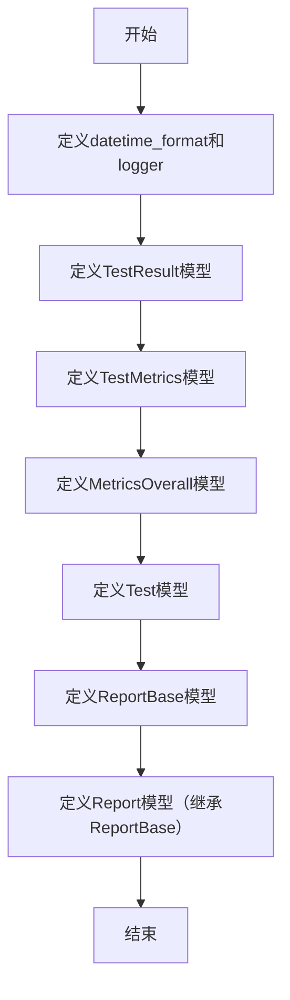
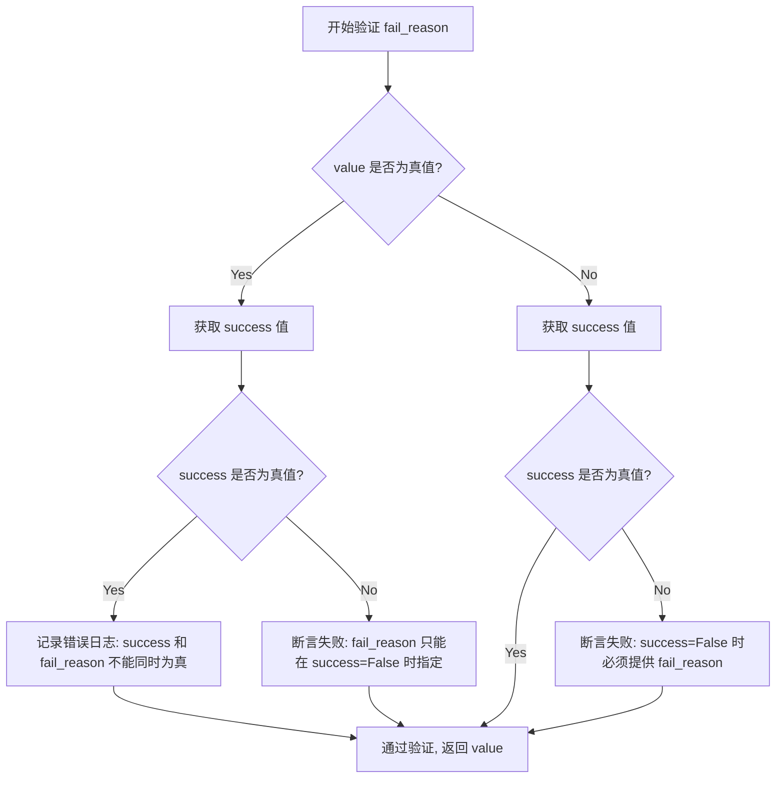

# `.\AutoGPT\classic\benchmark\agbenchmark\reports\processing\report_types.py` 详细设计文档

该文件定义了一套用于内部测试和命令行运行时生成的报告的Pydantic数据模型，包括TestResult（单次测试运行结果）、TestMetrics（测试指标）、Test（测试模型）、MetricsOverall（全局指标）、ReportBase和Report（报告模型），用于结构化存储和管理基准测试会话的结果数据。

## 整体流程



## 类结构

```
BaseModel (Pydantic基类)
├── TestResult
├── TestMetrics
├── MetricsOverall
├── Test
├── ReportBase
└── Report (继承ReportBase)
```

## 全局变量及字段


### `datetime_format`
    
正则表达式字符串，用于验证ISO 8601格式的日期时间（YYYY-MM-DDTHH:MM:SS+00:00）

类型：`str`
    


### `logger`
    
模块级别的日志记录器，用于记录验证错误和其他日志信息

类型：`logging.Logger`
    


### `TestResult.success`
    
运行是否成功

类型：`bool | None`
    


### `TestResult.run_time`
    
运行的格式化持续时间

类型：`str | None`
    


### `TestResult.fail_reason`
    
运行不成功的原因（如果有）

类型：`str | None`
    


### `TestResult.reached_cutoff`
    
是否因达到超时而停止运行

类型：`bool | None`
    


### `TestResult.n_steps`
    
agent执行的步骤数

类型：`int | None`
    


### `TestResult.steps`
    
agent生成的步骤列表

类型：`list[Step]`
    


### `TestResult.cost`
    
运行产生的已知成本（例如使用付费LLM API）

类型：`float | None`
    


### `TestMetrics.attempted`
    
挑战是否在本会话中被尝试

类型：`bool`
    


### `TestMetrics.is_regression`
    
挑战是否被视为回归测试

类型：`bool`
    


### `TestMetrics.success_percentage`
    
会话中此挑战的成功率（0-100）

类型：`float | None`
    


### `MetricsOverall.run_time`
    
会话从开始到结束的持续时间

类型：`str`
    


### `MetricsOverall.highest_difficulty`
    
本会话中至少成功一次的最困难挑战的难度级别

类型：`str`
    


### `MetricsOverall.total_cost`
    
会话的已知总成本

类型：`float | None`
    


### `Test.category`
    
挑战所属的类别列表

类型：`List[str]`
    


### `Test.difficulty`
    
挑战的难度级别

类型：`str | None`
    


### `Test.data_path`
    
数据文件路径

类型：`str`
    


### `Test.description`
    
挑战的描述信息

类型：`str`
    


### `Test.task`
    
任务说明

类型：`str`
    


### `Test.answer`
    
正确答案

类型：`str`
    


### `Test.metrics`
    
测试的指标信息

类型：`TestMetrics`
    


### `Test.results`
    
测试运行结果列表

类型：`list[TestResult]`
    


### `Test.metadata`
    
附加的元数据信息

类型：`dict[str, Any] | None`
    


### `ReportBase.command`
    
执行的命令

类型：`str`
    


### `ReportBase.completion_time`
    
完成时间

类型：`str | None`
    


### `ReportBase.benchmark_start_time`
    
基准测试开始时间，需符合ISO 8601格式

类型：`Annotated[str, StringConstraints]`
    


### `ReportBase.metrics`
    
会话的整体指标

类型：`MetricsOverall`
    


### `ReportBase.config`
    
配置字典

类型：`Dict[str, str | dict[str, str]]`
    


### `ReportBase.agent_git_commit_sha`
    
agent的Git提交SHA值

类型：`str | None`
    


### `ReportBase.benchmark_git_commit_sha`
    
benchmark的Git提交SHA值

类型：`str | None`
    


### `ReportBase.repo_url`
    
仓库的URL地址

类型：`str | None`
    


### `Report.tests`
    
包含所有测试的字典

类型：`Dict[str, Test]`
    
    

## 全局函数及方法


### `TestResult.success_xor_fail_reason`

这是一个 Pydantic `field_validator` 装饰器方法，用于验证 `fail_reason` 字段。它确保 `success` 和 `fail_reason` 字段是互斥的：即如果 `success` 为 `True`，则 `fail_reason` 必须为空（或 `None`）；如果 `success` 为 `False`，则必须提供 `fail_reason`。这种逻辑类似于异或（XOR）操作，确保数据的一致性。

参数：

- `value`：`Any`，被验证的 `fail_reason` 字段的值
- `info`：`ValidationInfo`，Pydantic 验证上下文信息，包含模型的其他字段数据（如 `success`）

返回值：`Any`，返回验证后的 `fail_reason` 值

#### 流程图



#### 带注释源码

```python
@field_validator("fail_reason")
def success_xor_fail_reason(cls, value, info: ValidationInfo):
    """
    验证 fail_reason 字段，确保与 success 字段互斥。
    
    逻辑:
    - 如果提供了 fail_reason，则 success 必须为 False
    - 如果未提供 fail_reason，则 success 必须为 True
    这确保了 success 和 fail_reason 不会同时为真（类似 XOR 逻辑）
    """
    # 检查 value 和 info.data["success"] 的布尔值是否相同
    # 如果相同，说明违反了 XOR 约束，记录错误日志
    if bool(value) == bool(info.data["success"]):
        logger.error(
            "Error validating `success ^ fail_reason` on TestResult: "
            f"success = {repr(info.data['success'])}; "
            f"fail_reason = {repr(value)}"
        )
    
    # 如果提供了 fail_reason
    if value:
        # 获取 success 值进行断言验证
        success = info.data["success"]
        # 确保 success 为 False，如果为 True 则抛出 AssertionError
        assert not success, "fail_reason must only be specified if success=False"
    else:
        # 如果未提供 fail_reason，则要求 success 必须为 True
        assert info.data["success"], "fail_reason is required if success=False"
    
    # 返回验证后的 value（可能为原始值或经过处理的 fail_reason）
    return value
```

## 关键组件


### TestResult 类

单次测试运行的详细结果模型，包含成功状态、运行时间、失败原因、步数、成本等字段，并包含验证 success 和 fail_reason 互斥的验证器。

### TestMetrics 类

聚合测试指标模型，用于表示一组测试运行的结果指标，包含是否尝试、是否回归测试和成功率字段。

### MetricsOverall 类

全局基准测试会话指标模型，记录会话运行时间、最高难度和总成本。

### Test 类

测试挑战的完整数据模型，包含类别、难度、数据路径、描述、任务、答案、指标、结果和元数据。

### ReportBase 类

报告的基础模型，定义报告的核心结构，包含命令、完成时间、基准开始时间、配置和Git提交信息。

### Report 类

完整的报告模型，继承自ReportBase，包含所有测试的字典。

### datetime_format 全局变量

正则表达式字符串常量，定义ISO 8601格式的日期时间模式（UTC时区）。

### field_validator 验证器

success_xor_fail_reason 验证器方法，确保 success 和 fail_reason 字段互斥，即有失败原因时必须失败，失败时必须提供失败原因。


## 问题及建议


### 已知问题

-   **TestResult验证器使用assert而非异常**：field_validator中使用了assert语句来验证互斥逻辑，这会在Python以-O优化模式运行时被跳过，且不会返回有意义的验证错误信息，而是直接抛出AssertionError
-   **可变默认参数问题**：Test类中的`results: list[TestResult] = []`使用了可变默认参数，这是Python中的常见陷阱，当列表被修改时会影响到所有实例，应使用`Field(default_factory=list)`
-   **success_percentage别名不一致**：使用了`alias="success_%"`（下划线），但字段名是`success_percentage`（驼峰），这在JSON序列化/反序列化时可能造成混淆，且与Python命名规范不统一
-   **DateTime验证不够严格**：使用正则表达式`^\d{4}-\d{2}-\d{2}T\d{2}:\d{2}:\d{2}\+00:00$`验证时间字符串，但仅验证格式不验证合法性（如2月30日），且强制要求+00:00时区
-   **TestResult验证器逻辑缺陷**：在`if value:`分支中访问`info.data["success"]`时未检查其是否存在，且验证器在错误情况下仍会返回value而非阻止无效数据
-   **类型注解不够精确**：TestResult中`steps`字段类型为`list[Step]`依赖外部导入的Step类型，但无验证逻辑；ReportBase的config字段类型`Dict[str, str | dict[str, str]]`过于宽泛

### 优化建议

-   将assert改为显式的Pydantic验证错误抛出，使用`raise ValueError()`或`raise PydanticCustomError()`
-   修改`results`字段为`Field(default_factory=list)`以避免可变默认参数问题
-   统一命名风格：要么使用纯下划线命名`success_percentage`配合`alias="success%"`，要么使用纯驼峰但避免使用alias
-   考虑使用专门的日期时间类型如`datetime`配合`field_serializer`，或使用` pendulum`、`pydantic-extra-types`等库进行更严格的日期时间验证
-   在验证器中添加对`success`字段存在性的检查，并确保在验证失败时抛出适当的ValidationError而非仅记录日志
-   为config字段定义更具体的Pydantic模型以提高类型安全和可读性

## 其它


### 设计目标与约束

本模块的设计目标是为基准测试（benchmarking）系统提供统一的数据模型定义，用于记录和报告测试/挑战的运行结果。核心约束包括：1）使用Pydantic进行数据验证，确保数据完整性和类型安全；2）模型需支持JSON序列化以便存储和传输；3）遵循命令行运行的报告生成需求，支持包含成功状态、耗时、步骤、成本等关键指标；4）TestResult模型中的fail_reason与success字段存在互斥验证逻辑，需确保状态一致性。

### 错误处理与异常设计

主要通过Pydantic的field_validator实现验证逻辑。TestResult类中的success_xor_fail_reason验证器确保：当success=False时必须提供fail_reason，当success=True时不能提供fail_reason。验证失败时通过logger.error记录错误日志，并使用assert抛出AssertionError。ReportBase中的benchmark_start_time字段通过StringConstraints强制匹配ISO 8601格式（\d{4}-\d{2}-\d{2}T\d{2}:\d{2}:\d{2}\+00:00），格式不匹配时Pydantic将抛出ValidationError。其他字段均采用Pydantic内置的类型验证机制。

### 外部依赖与接口契约

本模块依赖以下外部包：1）pydantic>=2.0，提供BaseModel、Field、field_validator、StringConstraints等数据建模和验证功能；2）agent_protocol_client，提供Step类型定义用于记录代理执行的步骤；3）Python标准库logging用于记录验证错误，typing提供类型注解支持。接口契约方面：TestResult.steps字段接收list[Step]类型对象；Report.tests字典的键为测试标识符（str类型），值为Test对象；所有模型均支持dict转换和模型实例化时的关键字参数构造。

### 安全与合规考虑

本模块为纯数据模型定义，不涉及敏感数据处理或业务逻辑。安全考虑点：1）TestResult中的cost字段为float|None类型，记录API调用成本，需注意成本数据在日志输出时的脱敏处理；2）metadata字段为dict[str, Any]类型，允许存储任意数据，需确保下游消费方对输入进行适当过滤以防止注入风险；3）logger.error中直接输出repr()格式的字段值，可能包含敏感信息，生产环境建议配置日志脱敏过滤器。

### 性能与可扩展性考虑

性能方面：Pydantic v2采用Rust核心实现，验证性能较v1显著提升；TestResult.steps字段使用list[Step]存储完整步骤序列，大规模长时间运行的测试可能产生大量Step对象，需评估序列化开销。可扩展性方面：1）Test.metrics字段为TestMetrics类型，可通过扩展TestMetrics类添加新指标；2）ReportBase.config字段为Dict[str, str | dict[str, str]]类型，支持嵌套配置存储；3）Test.metadata使用dict[str, Any]允许灵活扩展元数据；4）可通过继承ReportBase创建定制化报告类。


    