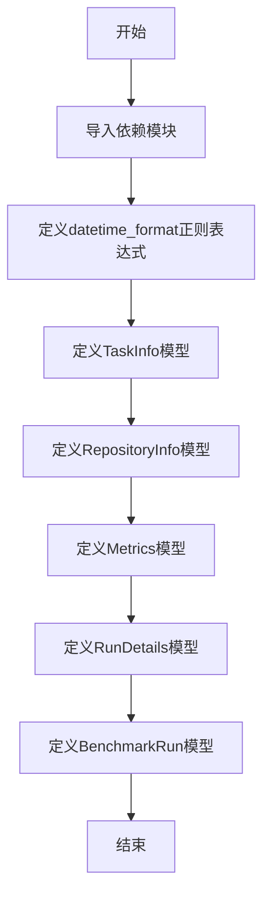

# `.\AutoGPT\classic\benchmark\agbenchmark\reports\processing\report_types_v2.py` 详细设计文档

该文件定义了一组Pydantic模型类，用于描述机器学习基准测试的数据结构，包括任务信息、仓库信息、运行指标、运行详情和基准测试运行等核心实体，所有模型均继承自pydantic的BaseModel以支持数据验证和序列化。

## 整体流程



## 类结构

```
BaseModel (Pydantic 抽象基类)
├── TaskInfo
├── RepositoryInfo
├── Metrics
├── RunDetails
└── BenchmarkRun
```

## 全局变量及字段


### `datetime_format`
    
Regular expression pattern for validating ISO 8601 datetime format with UTC timezone

类型：`str`
    


### `TaskInfo.data_path`
    
Path to the data file or directory for the task

类型：`str`
    


### `TaskInfo.is_regression`
    
Flag indicating whether this is a regression task

类型：`bool | None`
    


### `TaskInfo.answer`
    
Expected answer or solution for the task

类型：`str`
    


### `TaskInfo.description`
    
Human-readable description of the task

类型：`str`
    


### `TaskInfo.category`
    
List of categories the task belongs to

类型：`list[str]`
    


### `TaskInfo.task`
    
Task identifier or name

类型：`str`
    


### `RepositoryInfo.repo_url`
    
URL of the repository being benchmarked

类型：`str | None`
    


### `RepositoryInfo.team_name`
    
Name of the team that owns the repository

类型：`str | None`
    


### `RepositoryInfo.agent_git_commit_sha`
    
Git commit SHA of the agent version used

类型：`str | None`
    


### `RepositoryInfo.benchmark_git_commit_sha`
    
Git commit SHA of the benchmark version used

类型：`str | None`
    


### `Metrics.cost`
    
Cost associated with the benchmark run

类型：`float | None`
    


### `Metrics.success`
    
Flag indicating whether the benchmark run was successful

类型：`bool`
    


### `Metrics.attempted`
    
Flag indicating whether an attempt was made to run the benchmark

类型：`bool`
    


### `Metrics.difficulty`
    
Difficulty level of the benchmark task

类型：`str | None`
    


### `Metrics.run_time`
    
Execution time of the benchmark run

类型：`str | None`
    


### `Metrics.fail_reason`
    
Reason for failure if the benchmark run failed

类型：`str | None`
    


### `Metrics.success_percentage`
    
Percentage of successful runs or attempts

类型：`float | None`
    


### `RunDetails.test_name`
    
Name of the test being run

类型：`str`
    


### `RunDetails.run_id`
    
Unique identifier for this specific run

类型：`str | None`
    


### `RunDetails.command`
    
Command executed for the benchmark

类型：`str`
    


### `RunDetails.completion_time`
    
Timestamp when the benchmark completed

类型：`str | None`
    


### `RunDetails.benchmark_start_time`
    
Timestamp when the benchmark started (validated against datetime_format pattern)

类型：`Annotated[str, StringConstraints]`
    


### `BenchmarkRun.repository_info`
    
Repository information including URL and commit SHAs

类型：`RepositoryInfo`
    


### `BenchmarkRun.run_details`
    
Details about the benchmark run execution

类型：`RunDetails`
    


### `BenchmarkRun.task_info`
    
Information about the task being benchmarked

类型：`TaskInfo`
    


### `BenchmarkRun.metrics`
    
Performance and outcome metrics of the benchmark

类型：`Metrics`
    


### `BenchmarkRun.reached_cutoff`
    
Flag indicating whether the benchmark reached a cutoff limit

类型：`bool | None`
    


### `BenchmarkRun.config`
    
Configuration dictionary for the benchmark run

类型：`dict[str, str | dict[str, str]]`
    
    

## 全局函数及方法


## 关键组件


### Pydantic模型定义

使用Pydantic BaseModel进行数据验证和序列化，确保API输入输出的类型安全和数据有效性。

### datetime_format正则表达式

定义ISO 8601格式的日期时间正则表达式，用于验证基准测试开始时间字段的格式。

### TaskInfo类

任务信息数据模型，包含任务路径、回归标识、答案、描述、类别和任务类型等字段。

### RepositoryInfo类

仓库信息数据模型，包含仓库URL、团队名称、Agent Git提交SHA和基准测试Git提交SHA等可选字段。

### Metrics类

指标数据模型，包含成本、成功状态、尝试状态、难度、运行时间、失败原因和成功百分比等字段。

### RunDetails类

运行详情数据模型，包含测试名称、运行ID、命令、完成时间和基准测试开始时间等字段，其中开始时间使用正则表达式约束。

### BenchmarkRun类

基准测试运行主数据模型，整合仓库信息、运行详情、任务信息和指标信息，并包含是否达到截止条件的标识和配置字典。

### 类型注解系统

使用Python类型注解和Union类型（|）定义可选字段，支持None值的明确声明。

### StringConstraints约束

使用Pydantic的StringConstraints对字符串字段进行模式匹配验证，确保数据格式符合预期。

### 配置字典字段

BenchmarkRun中的config字段使用dict[str, str | dict[str, str]]类型，支持嵌套的配置结构。


## 问题及建议


### 已知问题

-   **时区限制过严**：datetime_format 正则表达式 `^\d{4}-\d{2}-\d{2}T\d{2}:\d{2}:\d{2}\+00:00$` 仅支持 UTC 时区 (+00:00)，不支持其他时区格式如 `-05:00` 或 `Z`
-   **Python 版本兼容性**：使用 Python 3.10+ 的联合类型语法 `bool | None`，若项目需兼容 Python 3.9 及更早版本会导致兼容性问题
-   **Config 字段类型过于宽泛**：`config: dict[str, str | dict[str, str]]` 类型定义过于模糊，缺乏具体结构约束
-   **缺少业务规则验证**：缺少对数值范围的有效性校验，如 `success_percentage` 应限制在 0-100，`cost` 应为非负数
-   **字段命名风格不统一**：某些字段使用 snake_case（如 `repo_url`），但 API 响应可能需要 camelCase 风格
-   **缺乏字段描述文档**：所有 Pydantic 模型均未配置 `Field` 描述信息，无法为 API 文档自动生成有意义的说明

### 优化建议

-   **增强日期时间验证**：使用 `datetime` 类型或更灵活的正则表达式支持多时区，或引入 `zoneinfo` 模块处理时区
-   **显式声明模型配置**：为每个模型添加 `model_config = ConfigDict(...)` 以支持 JSON schema 生成和别名转换
-   **添加字段级验证器**：使用 `@field_validator` 装饰器验证数值范围、字符串格式等业务规则
-   **统一版本兼容写法**：若需兼容旧版 Python，使用 `Optional[bool]` 替代 `bool | None` 语法
-   **重构 config 字段**：定义具体的 ConfigModel 类或使用 TypedDict 增强类型安全
-   **补充字段描述**：通过 `Field(description="...")` 为每个字段添加描述，便于生成 OpenAPI 文档

## 其它


### 一段话描述

该代码定义了一套用于API的Pydantic数据模型，主要用于描述机器学习基准测试的运行信息，包括任务信息、仓库信息、运行详情和评估指标等数据结构。

### 文件的整体运行流程

该文件为数据模型定义文件，不涉及运行时流程。模型在被导入后，可用于API请求/响应的数据校验和序列化。当API接收到JSON数据时，Pydantic会自动进行类型校验、数据转换和验证。

### 全局变量

### datetime_format

- 类型：`str`
- 描述：正则表达式模式，用于验证ISO 8601格式的日期时间字符串（UTC时区）

### 类详细信息

### TaskInfo

- 描述：任务信息模型，包含任务的基本属性

#### 类字段

| 字段名称 | 类型 | 描述 |
|---------|------|------|
| data_path | str | 数据集路径 |
| is_regression | bool \| None | 是否为回归任务 |
| answer | str | 任务答案 |
| description | str | 任务描述 |
| category | list[str] | 任务类别列表 |
| task | str | 任务名称 |

### RepositoryInfo

- 描述：仓库信息模型，包含代码仓库的相关信息

#### 类字段

| 字段名称 | 类型 | 描述 |
|---------|------|------|
| repo_url | str \| None | 仓库URL地址 |
| team_name | str \| None | 团队名称 |
| agent_git_commit_sha | str \| None | Agent代码的Git提交SHA |
| benchmark_git_commit_sha | str \| None | 基准测试代码的Git提交SHA |

### Metrics

- 描述：评估指标模型，包含任务执行的评估结果

#### 类字段

| 字段名称 | 类型 | 描述 |
|---------|------|------|
| cost | float \| None | 执行成本 |
| success | bool | 是否成功 |
| attempted | bool | 是否已尝试 |
| difficulty | str \| None | 难度等级 |
| run_time | str \| None | 运行时间 |
| fail_reason | str \| None | 失败原因 |
| success_percentage | float \| None | 成功率百分比 |

### RunDetails

- 描述：运行详情模型，包含测试执行的具体信息

#### 类字段

| 字段名称 | 类型 | 描述 |
|---------|------|------|
| test_name | str | 测试名称 |
| run_id | str \| None | 运行ID |
| command | str | 执行命令 |
| completion_time | str \| None | 完成时间 |
| benchmark_start_time | Annotated[str, StringConstraints(pattern=datetime_format)] | 基准测试开始时间（带格式验证） |

### BenchmarkRun

- 描述：基准测试运行模型顶层模型，整合所有子模型构成完整的数据结构

#### 类字段

| 字段名称 | 类型 | 描述 |
|---------|------|------|
| repository_info | RepositoryInfo | 仓库信息 |
| run_details | RunDetails | 运行详情 |
| task_info | TaskInfo | 任务信息 |
| metrics | Metrics | 评估指标 |
| reached_cutoff | bool \| None | 是否达到截断条件 |
| config | dict[str, str \| dict[str, str]] | 配置字典 |

### 关键组件信息

| 组件名称 | 描述 |
|---------|------|
| Pydantic BaseModel | 用于定义数据模型的基类，提供自动验证和序列化功能 |
| StringConstraints | 字符串约束条件，用于定义字符串字段的验证规则 |
| Annotated | 类型注解，用于添加元数据和约束条件 |
| datetime_format | 全局正则表达式常量，用于验证日期时间格式 |

### 潜在的技术债务或优化空间

1. **类型注解不够精确**：部分字段使用dict[str, str | dict[str, str]]，类型过于宽泛，建议定义具体的配置模型类
2. **缺乏默认值校验**：answer和command等关键字段缺少默认值校验逻辑
3. **重复的模式定义**：datetime_format为字符串正则，可考虑提取为可复用的验证器
4. **文档缺失**：缺少模块级和类级的文档字符串（docstring）
5. **硬编码格式**：日期时间格式硬编码，可考虑提取为配置常量或支持多时区

### 设计目标与约束

- **设计目标**：提供一套类型安全的数据模型，用于API前后端数据交互和校验
- **约束条件**：
  - 依赖Pydantic v2+版本
  - 需要Python 3.9+以支持联合类型语法（bool | None）
  - 日期时间格式仅支持UTC时区

### 错误处理与异常设计

- Pydantic自动处理数据验证错误，抛出ValidationError异常
- 不符合datetime_format正则格式的benchmark_start_time将导致验证失败
- 缺少必填字段（data_path、answer、description、task、success、attempted、test_name、command）时将抛出异常

### 数据流与状态机

- **数据流向**：API请求 → JSON解析 → Pydantic模型验证 → 数据对象
- **状态说明**：该模型为静态数据结构，不涉及状态机设计
- **数据完整性**：BenchmarkRun为顶层模型，包含完整的基准测试执行信息

### 外部依赖与接口契约

- **依赖库**：pydantic（提供数据模型验证功能）
- **依赖版本**：pydantic 2.0+
- **接口契约**：
  - 输入：符合模型结构的JSON对象
  - 输出：验证后的Pydantic模型实例
  - 序列化：支持model_dump()和model_dump_json()方法

### 其它项目

- **配置管理**：config字段设计为灵活字典，可存储各类配置信息
- **扩展性**：可通过继承BaseModel添加新的业务逻辑方法
- **兼容性**：不支持Python 3.8及以下版本（因使用bool | None联合语法）


    