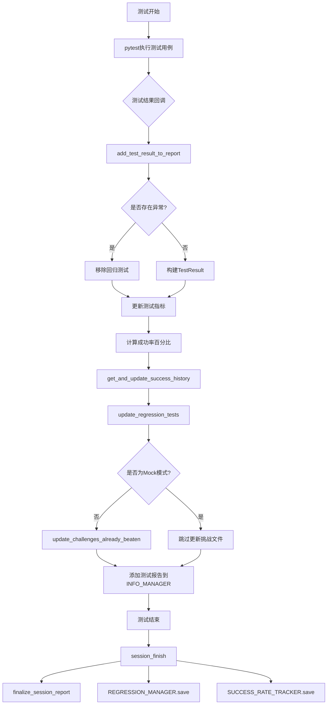
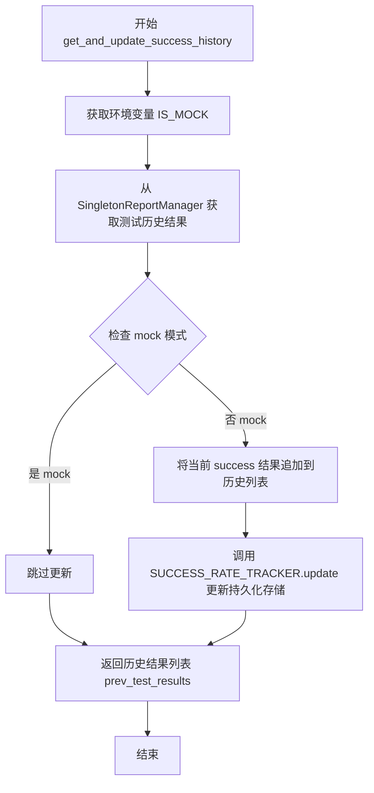
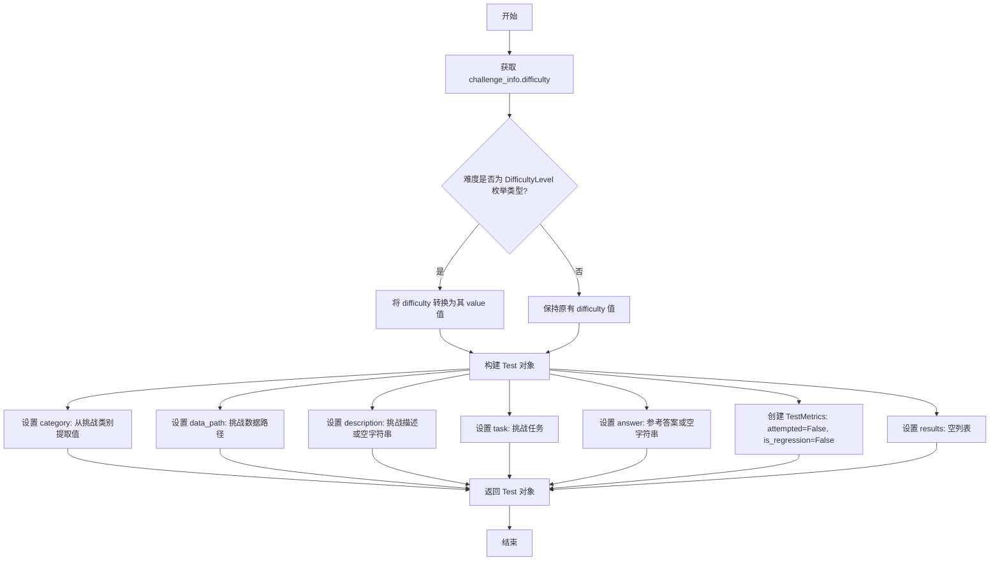
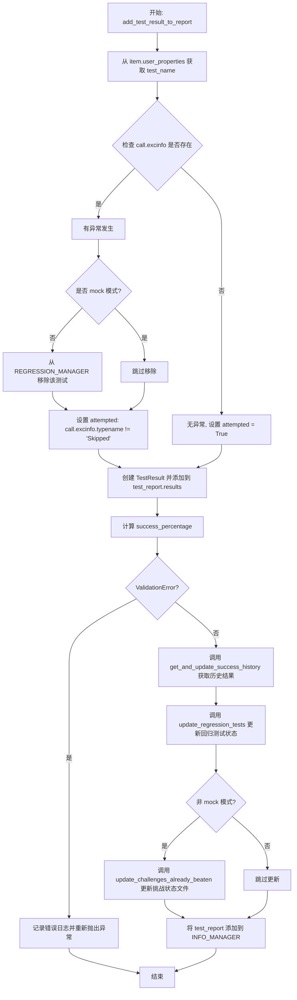
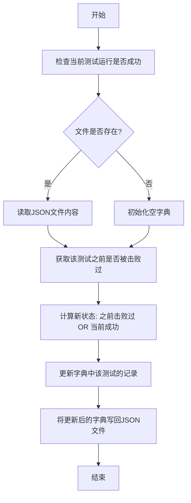
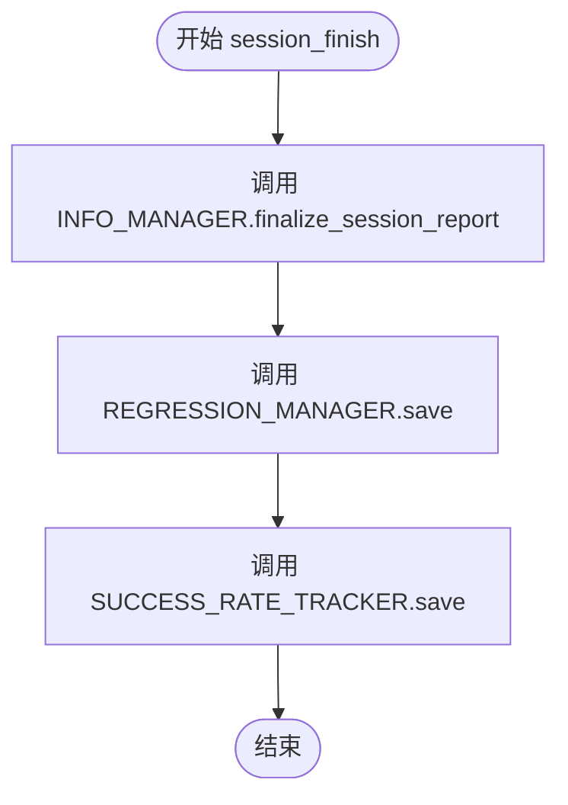

# `.\AutoGPT\classic\benchmark\agbenchmark\reports\reports.py` 详细设计文档

该模块是Agent Benchmark的测试报告处理核心模块，负责跟踪测试历史成功率、管理回归测试、生成测试报告、以及记录挑战的完成状态，支持Mock模式下的测试运行和最终会话报告的生成。

## 整体流程



## 类结构

```
测试报告处理模块 (reports.py)
├── 全局函数
│   ├── get_and_update_success_history
│   ├── update_regression_tests
│   ├── make_empty_test_report
│   ├── add_test_result_to_report
│   ├── update_challenges_already_beaten
│   └── session_finish
└── 外部依赖模块
    ├── agbenchmark.challenges.ChallengeInfo
    ├── agbenchmark.config.AgentBenchmarkConfig
    ├── agbenchmark.reports.ReportManager.SingletonReportManager
    ├── agbenchmark.reports.processing.report_types
    └── agbenchmark.utils.data_types.DifficultyLevel
```

## 全局变量及字段


### `logger`
    
模块级日志记录器

类型：`logging.Logger`
    


    

## 全局函数及方法


### `get_and_update_success_history`

获取并更新测试成功历史记录。该函数从报告管理器中检索指定测试的历史执行结果，在非模拟模式下将新的执行结果追加到历史记录中，并返回更新后的历史结果列表。

参数：

- `test_name`：`str`，测试的唯一标识名称，用于在 SUCCESS_RATE_TRACKER 中查找对应的历史记录
- `success`：`bool | None`，表示当前测试执行是否成功的布尔值或 None（可能表示测试未执行）

返回值：`list[bool | None]`，返回指定测试的历史成功结果列表，列表中的每个元素表示对应历史执行的成功状态

#### 流程图



#### 带注释源码

```python
def get_and_update_success_history(
    test_name: str, success: bool | None
) -> list[bool | None]:
    """
    获取并更新测试成功历史记录。
    
    参数:
        test_name: 测试的唯一标识名称
        success: 当前测试执行的成功状态 (True/False/None)
    
    返回:
        该测试的历史成功结果列表
    """
    # 检查是否处于模拟模式（通过环境变量 IS_MOCK）
    # 模拟模式下不进行实际的持久化更新，仅返回历史数据
    mock = os.getenv("IS_MOCK")
    
    # 从 SingletonReportManager 的 SUCCESS_RATE_TRACKER 中获取指定测试的历史结果
    # 如果不存在该测试的历史记录，则返回空列表
    prev_test_results = SingletonReportManager().SUCCESS_RATE_TRACKER.tests.get(
        test_name, []
    )
    
    # 仅在实际测试（非模拟）时更新历史记录
    if not mock:
        # 将当前测试的成功状态追加到历史结果列表
        prev_test_results.append(success)
        
        # 调用 SUCCESS_RATE_TRACKER 的 update 方法将更新后的结果持久化
        SingletonReportManager().SUCCESS_RATE_TRACKER.update(
            test_name, prev_test_results
        )
    
    # 返回更新后的历史结果列表（模拟模式下返回原始历史，非模拟模式下返回包含最新结果的历史）
    return prev_test_results
```


### `update_regression_tests`

该函数用于检查测试的历史成功记录，当检测到某测试最近连续3次执行成功时，将其标记为回归测试并添加到回归测试管理器中。

参数：

- `prev_test_results`：`list[bool | None]`，测试的历史结果列表，包含布尔值或 None，表示之前测试的成功/失败状态
- `test_report`：`Test`，测试报告对象，包含测试的指标和结果信息
- `test_name`：`str`，测试的唯一标识名称

返回值：`None`，该函数没有返回值，通过修改 `test_report.metrics.is_regression` 属性来标记回归测试

#### 流程图

```mermaid
flowchart TD
    A[开始 update_regression_tests] --> B{len(prev_test_results) >= 3?}
    B -->|否| C[结束 - 不进行回归测试标记]
    B -->|是| D{prev_test_results[-3:] == [True, True, True]?}
    D -->|否| C
    D -->|是| E[设置 test_report.metrics.is_regression = True]
    E --> F[调用 SingletonReportManager().REGRESSION_MANAGER.add_test]
    F --> G[传入 test_name 和测试配置信息]
    G --> C
```

#### 带注释源码

```python
def update_regression_tests(
    prev_test_results: list[bool | None],
    test_report: Test,
    test_name: str,
) -> None:
    """
    检查测试历史并在满足条件时将其标记为回归测试
    
    参数:
        prev_test_results: 测试的历史成功/失败记录列表
        test_report: 测试报告对象，用于存储测试指标
        test_name: 测试的唯一标识名称
    """
    
    # 检查历史记录数量是否足够（至少3条）
    if len(prev_test_results) >= 3 and prev_test_results[-3:] == [True, True, True]:
        # 如果最近3次测试都成功了，标记为回归测试
        test_report.metrics.is_regression = True
        
        # 将测试添加到回归测试管理器
        # 只保存 difficulty 和 data_path 两个字段
        SingletonReportManager().REGRESSION_MANAGER.add_test(
            test_name, test_report.model_dump(include={"difficulty", "data_path"})
        )
```


### `make_empty_test_report`

该函数用于根据提供的挑战信息创建一个空的测试报告对象，初始化报告的基本属性并将度量指标设置为未尝试和无回归状态。

参数：

- `challenge_info`：`ChallengeInfo`，包含挑战的难度、类别、描述、任务等信息的对象

返回值：`Test`，返回一个初始化好的空测试报告对象

#### 流程图



#### 带注释源码

```python
def make_empty_test_report(
    challenge_info: ChallengeInfo,  # 包含挑战相关信息的对象
) -> Test:  # 返回创建的空测试报告对象
    # 从挑战信息中获取难度级别
    difficulty = challenge_info.difficulty
    
    # 如果难度是 DifficultyLevel 枚举类型，则转换为对应的值
    if isinstance(difficulty, DifficultyLevel):
        difficulty = difficulty.value

    # 创建并返回一个 Test 对象，包含以下字段：
    # - category: 挑战的类别列表，将每个类别转换为其 value 值
    # - difficulty: 挑战的难度级别
    # - data_path: 挑战数据源的 URI 路径
    # - description: 挑战的描述，如果没有则为空字符串
    # - task: 挑战的任务描述
    # - answer: 参考答案，如果没有则为空字符串
    # - metrics: 测试度量指标对象，初始状态为未尝试且无回归
    # - results: 测试结果列表，初始为空列表
    return Test(
        category=[c.value for c in challenge_info.category],
        difficulty=difficulty,
        data_path=challenge_info.source_uri,
        description=challenge_info.description or "",
        task=challenge_info.task,
        answer=challenge_info.reference_answer or "",
        metrics=TestMetrics(attempted=False, is_regression=False),
        results=[],
    )
```


### `add_test_result_to_report`

该函数是 pytest 的回调钩子，负责在每个测试执行完成后收集测试结果数据，包括成功状态、运行时间、失败原因、步骤信息等，并将这些信息整合到测试报告中，同时更新回归测试状态和成功率追踪记录。

参数：

- `test_report`：`Test`，测试报告对象，用于存储单个测试的详细信息和结果
- `item`：`pytest.Item`，pytest 测试项，包含测试的元数据和用户属性
- `call`：`pytest.CallInfo`，包含测试调用后的信息，如异常对象、执行时长等
- `config`：`AgentBenchmarkConfig`，代理基准测试的全局配置对象，包含挑战状态文件路径等

返回值：`None`，该函数无返回值，通过修改传入的 `test_report` 对象和全局 `SingletonReportManager` 的状态来输出结果

#### 流程图



#### 带注释源码

```python
def add_test_result_to_report(
    test_report: Test,
    item: pytest.Item,
    call: pytest.CallInfo,
    config: AgentBenchmarkConfig,
) -> None:
    """将测试结果添加到报告中的核心函数
    
    Args:
        test_report: 测试报告对象，用于存储单个测试的详细信息
        item: pytest测试项，包含测试的元数据和用户属性
        call: 包含测试调用后的信息（异常、执行时间等）
        config: 代理基准测试的全局配置
    """
    # 从pytest测试项的用户属性中提取测试名称
    user_properties: dict = dict(item.user_properties)
    test_name: str = user_properties.get("test_name", "")

    # 检查是否为mock模式（用于测试或CI环境）
    mock = os.getenv("IS_MOCK")

    # 处理测试异常情况
    if call.excinfo:
        # 如果不是mock模式，从回归测试中移除该测试
        if not mock:
            SingletonReportManager().REGRESSION_MANAGER.remove_test(test_name)

        # 设置attempted标记：跳过不算作未尝试
        test_report.metrics.attempted = call.excinfo.typename != "Skipped"
    else:
        # 测试正常执行完成（无论成功或失败），标记为已尝试
        test_report.metrics.attempted = True

    try:
        # 创建TestResult对象，包含测试执行的所有细节
        test_report.results.append(
            TestResult(
                # 成功标志：无异常即为成功
                success=call.excinfo is None,
                # 运行时间，保留3位小数
                run_time=f"{str(round(call.duration, 3))} seconds",
                # 失败原因，仅在有异常时填充
                fail_reason=(
                    str(call.excinfo.value) if call.excinfo is not None else None
                ),
                # 是否达到超时限制
                reached_cutoff=user_properties.get("timed_out", False),
                # 执行的步数
                n_steps=user_properties.get("n_steps"),
                # 具体步骤详情
                steps=user_properties.get("steps", []),
                # Agent任务成本
                cost=user_properties.get("agent_task_cost"),
            )
        )
        # 计算成功率百分比
        test_report.metrics.success_percentage = (
            sum(r.success or False for r in test_report.results)
            / len(test_report.results)
            * 100
        )
    except ValidationError:
        # 处理TestResult数据验证失败的情况
        if call.excinfo:
            logger.error(
                "Validation failed on TestResult; "
                f"call.excinfo = {repr(call.excinfo)};\n{call.excinfo.getrepr()})"
            )
        raise

    # 获取并更新该测试的历史成功记录
    prev_test_results: list[bool | None] = get_and_update_success_history(
        test_name, test_report.results[-1].success
    )

    # 根据历史记录判断是否为回归测试
    update_regression_tests(prev_test_results, test_report, test_name)

    # 更新挑战状态并注册报告
    if test_report and test_name:
        # 如果不是mock模式，更新已战胜的挑战记录
        if not mock:
            update_challenges_already_beaten(
                config.challenges_already_beaten_file, test_report, test_name
            )

        # 将完整的测试报告添加到信息管理器
        SingletonReportManager().INFO_MANAGER.add_test_report(test_name, test_report)
```


### `update_challenges_already_beaten`

更新已击败挑战记录函数，用于将测试结果持久化到JSON文件中，记录每个测试是否曾经成功过。

参数：

- `challenges_already_beaten_file`：`Path`，存储已击败挑战记录的JSON文件路径
- `test_report`：`Test`，包含测试结果的报告对象
- `test_name`：`str`，测试名称

返回值：`None`，无返回值

#### 流程图



#### 带注释源码

```python
def update_challenges_already_beaten(
    challenges_already_beaten_file: Path, test_report: Test, test_name: str
) -> None:
    """
    更新已击败挑战记录，将测试结果持久化到JSON文件中
    
    参数:
        challenges_already_beaten_file: 存储已击败挑战记录的JSON文件路径
        test_report: 包含测试结果的报告对象
        test_name: 测试名称
    返回:
        None
    """
    # 判断当前测试运行是否成功（只要有一个结果成功就算成功）
    current_run_successful = any(r.success for r in test_report.results)
    
    # 尝试读取已存在的挑战记录文件
    try:
        with open(challenges_already_beaten_file, "r") as f:
            # 从JSON文件加载之前击败过的挑战记录
            challenges_beaten_before = json.load(f)
    except FileNotFoundError:
        # 如果文件不存在，初始化为空字典
        challenges_beaten_before = {}

    # 获取该测试之前是否曾经被击败过
    has_ever_been_beaten = challenges_beaten_before.get(test_name)
    # 更新记录：只要之前击败过或当前运行成功，就算击败过
    challenges_beaten_before[test_name] = has_ever_been_beaten or current_run_successful

    # 将更新后的记录写回JSON文件
    with open(challenges_already_beaten_file, "w") as f:
        json.dump(challenges_beaten_before, f, indent=4)
```


### `session_finish`

该函数是测试会话结束时的处理函数，负责调用三个报告管理器（INFO_MANAGER、REGRESSION_MANAGER、SUCCESS_RATE_TRACKER）的保存和最终化方法，将本次测试会话的结果持久化到存储中。

参数：

- `agbenchmark_config`：`AgentBenchmarkConfig`，包含代理基准测试的配置信息，用于最终会话报告的生成

返回值：`None`，该函数不返回任何值，仅执行副作用操作（文件写入等）

#### 流程图



#### 带注释源码

```python
def session_finish(agbenchmark_config: AgentBenchmarkConfig) -> None:
    """
    会话结束处理函数
    
    当测试会话结束时调用，负责完成以下操作：
    1. 最终化并保存会话报告
    2. 保存回归测试的跟踪数据
    3. 保存成功率跟踪数据
    
    参数:
        agbenchmark_config: AgentBenchmarkConfig类型
            包含代理基准测试的配置信息，用于生成最终会话报告
    
    返回值:
        None: 无返回值，仅执行保存操作
    """
    
    # 最终化会话报告
    # 将本次测试会话的完整信息写入报告
    SingletonReportManager().INFO_MANAGER.finalize_session_report(agbenchmark_config)
    
    # 保存回归测试管理器状态
    # 将回归测试相关数据持久化到磁盘
    SingletonReportManager().REGRESSION_MANAGER.save()
    
    # 保存成功率跟踪器状态
    # 将历史测试成功率数据持久化到磁盘
    SingletonReportManager().SUCCESS_RATE_TRACKER.save()
```

## 关键组件


### 成功历史追踪 (Success Rate Tracker)

负责记录和管理测试的成功历史，通过 `get_and_update_success_history` 函数获取历史结果并追加新的测试结果，用于后续的回归分析和统计

### 回归测试管理 (Regression Manager)

检测连续3次成功的测试并将其标记为回归测试，通过 `update_regression_tests` 函数实现，用于识别长期稳定通过的测试用例

### 测试报告生成 (Test Report Generation)

从 `ChallengeInfo` 创建空测试报告，包含类别、难度、数据路径、描述、任务、答案等字段，通过 `make_empty_test_report` 函数实现

### 测试结果收集 (Test Result Collection)

将 pytest 的测试执行结果转换为标准化的 `TestResult` 对象，包含成功状态、运行时间、失败原因、超时标记、步数和成本等信息，通过 `add_test_result_to_report` 函数实现

### 挑战完成状态追踪 (Challenge Completion Tracking)

维护挑战是否曾经被成功完成的状态，通过 `update_challenges_already_beaten` 函数更新 JSON 文件，记录每个测试的历史成功情况

### 会话报告完成 (Session Report Finalization)

在测试会话结束时汇总所有报告数据，保存回归测试和成功率追踪器的状态，通过 `session_finish` 函数调用各个管理器的保存方法

### 单例报告管理器 (Singleton Report Manager)

统一管理信息管理器、回归管理器和成功率追踪器的单例类，提供集中式的报告数据访问和更新接口


## 问题及建议


### 已知问题

-   **环境变量重复获取**：`os.getenv("IS_MOCK")` 在 `get_and_update_success_history` 和 `add_test_result_to_report` 中重复获取，应该在模块级别定义常量
-   **魔法数字**：`len(prev_test_results) >= 3` 和 `prev_test_results[-3:] == [True, True, True]` 中的数值3硬编码，缺乏配置化
-   **文件操作缺乏错误处理**：`update_challenges_already_beaten` 函数中文件写入（`json.dump`）没有异常处理，可能导致数据丢失
-   **单例模式过度使用**：`SingletonReportManager()` 在多个函数中重复调用，每次调用都会获取实例，增加开销且影响可测试性
-   **日志记录不足**：关键操作如文件读写、回归测试标记等缺乏日志记录，难以追踪问题
-   **类型注解不精确**：使用 `dict` 代替具体类型注解（如 `user_properties`），降低代码可读性和类型安全性
-   **函数职责过重**：`add_test_result_to_report` 函数过长，混合了结果构建、指标计算、历史更新、回归检测等多重职责
-   **注释代码未清理**：Helicone 相关代码被注释但未删除，留下技术债务
-   **可选类型处理不一致**：`success: bool | None` 和列表中混合 `bool | None` 的处理逻辑复杂，容易产生边界问题
-   **性能隐患**：每次测试都读写 `challenges_already_beaten_file`，没有缓存或批量写入机制，频繁I/O影响性能

### 优化建议

-   将 `IS_MOCK` 环境变量提取为模块级常量，避免重复读取
-   将回归测试的阈值（3和成功次数）提取为配置参数或常量
-   为文件读写操作添加 try-except 异常处理，确保异常时记录日志并合理降级
-   考虑使用依赖注入替代全局单例访问，提高代码可测试性
-   增加关键操作的日志记录，特别是状态变更和数据持久化操作
-   使用具体的类型注解（如 `dict[str, Any]`）替代泛型 `dict`
-   重构 `add_test_result_to_report`，将不同职责拆分为独立函数
-   清理注释掉的代码，决定是否实现或删除
-   引入缓存机制或批量写入策略，减少文件I/O频率
-   考虑使用 dataclass 或 Pydantic 模型替代部分字典操作，提高类型安全性


## 其它


### 设计目标与约束

设计目标：该模块作为pytest插件，用于收集测试结果、管理回归测试、追踪测试成功率，并将结果持久化到文件中。约束包括依赖pytest框架、使用pydantic进行数据验证、采用Singleton模式管理报告管理器。

### 错误处理与异常设计

代码中的错误处理包括：1) ValidationError捕获，当TestResult验证失败时记录错误并重新抛出；2) FileNotFoundError处理，当挑战文件不存在时初始化为空字典；3) 通过call.excinfo判断测试是否异常，包括跳过测试的识别。所有异常均通过logger记录关键信息。

### 数据流与状态机

数据流：pytest测试执行后触发add_test_result_to_report，收集测试结果构建TestResult对象，验证后追加到test_report.results，计算成功率。调用get_and_update_success_history获取历史结果，调用update_regression_tests判断是否回归，最后更新SingletonReportManager。session_finish在测试会话结束时触发最终报告生成和持久化。

### 外部依赖与接口契约

主要依赖：pytest(Item, CallInfo, report对象的回调参数)、pydantic(ValidationError, 数据模型验证)、agbenchmark.challenges.ChallengeInfo、agbenchmark.config.AgentBenchmarkConfig、agbenchmark.reports.ReportManager.SingletonReportManager、agbenchmark.reports.processing.report_types(Test, TestMetrics, TestResult)、agbenchmark.utils.data_types.DifficultyLevel。环境变量IS_MOCK控制是否记录真实测试数据。

### 性能考虑

每次测试完成后都进行文件读写操作(update_challenges_already_beaten、SingletonReportManager的save)，在高频率测试场景下可能产生IO瓶颈。建议考虑批量写入或内存缓存后批量持久化的策略。

### 安全考虑

代码使用os.getenv读取IS_MOCK环境变量，存在环境变量注入风险。文件操作使用直接路径写入，需要确保challenges_already_beaten_file路径的可信度。JSON文件读写需要考虑并发写入的场景。

### 并发与线程安全

SingletonReportManager使用单例模式，但在多线程测试环境中，SUCCESS_RATE_TRACKER和REGRESSION_MANAGER的并发读写可能存在竞态条件。save()方法在session_finish时调用，需要确保线程安全。

    