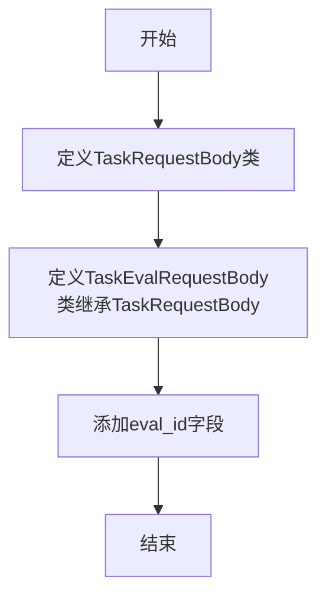
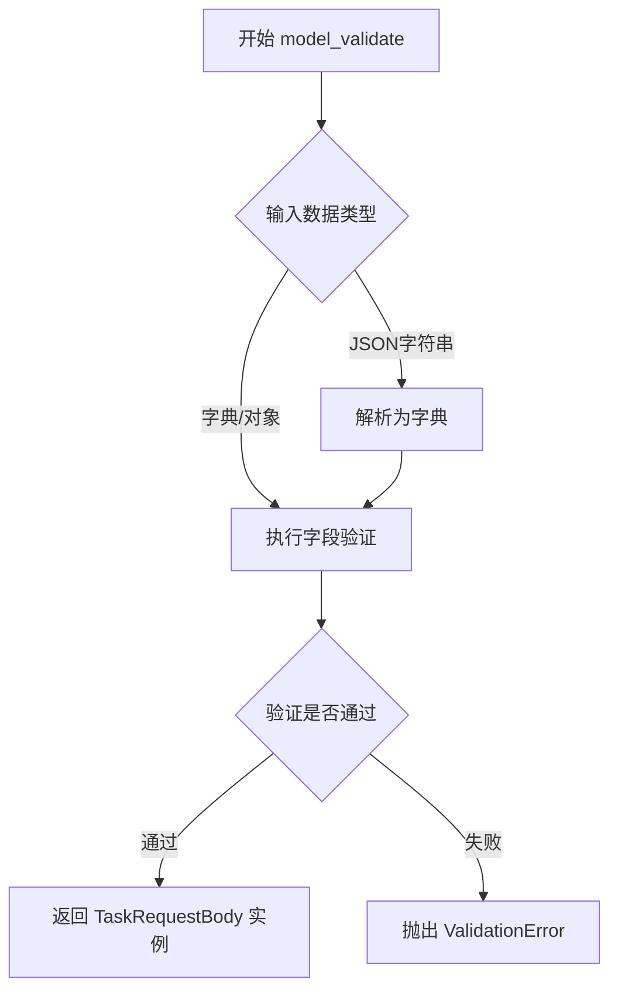
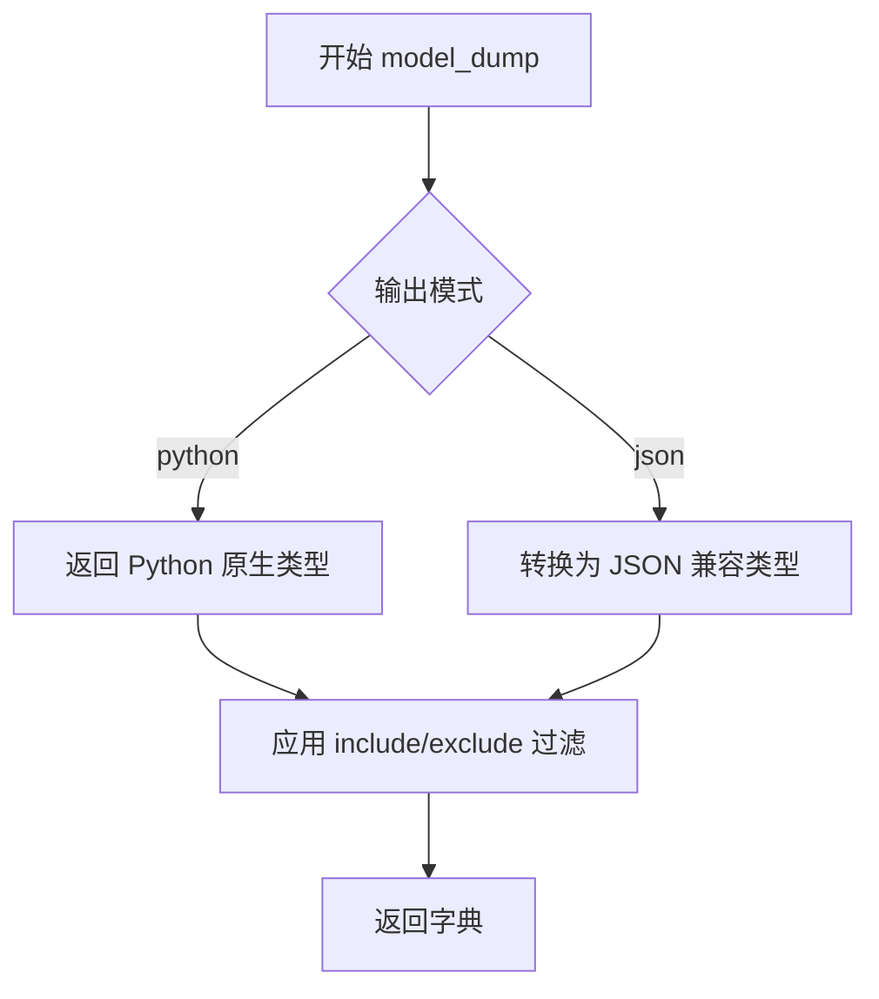
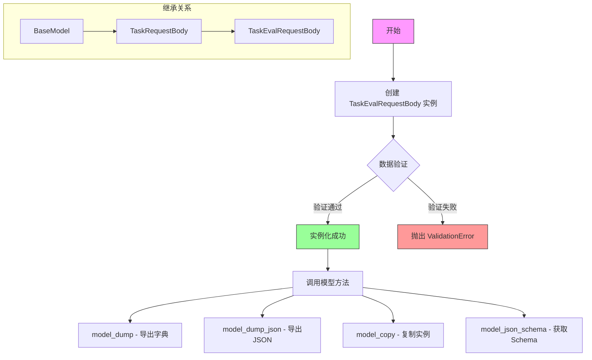

# `.\AutoGPT\classic\benchmark\agbenchmark\schema.py` 详细设计文档

定义了两个Pydantic数据模型类，用于封装任务请求的输入参数。TaskRequestBody是基础请求模型，包含输入文本和附加参数；TaskEvalRequestBody继承自前者，额外增加了评估ID字段，用于区分不同的评估任务。

## 整体流程



## 类结构

```
TaskRequestBody (BaseModel)
└── TaskEvalRequestBody (TaskRequestBody)
```

## 全局变量及字段


### `TaskRequestBody.input`
    
输入提示文本，最小长度为1

类型：`str`
    


### `TaskRequestBody.additional_input`
    
额外的输入参数字典，默认为空字典

类型：`Optional[dict[str, Any]]`
    


### `TaskEvalRequestBody.eval_id`
    
评估任务ID，用于标识不同的评估任务

类型：`str`
    
    

## 全局函数及方法


# TaskRequestBody 类详细设计文档

## 概述

TaskRequestBody 是一个 Pydantic 数据模型类，用于定义任务请求的数据结构，包含必填的输入提示字段和可选的额外参数字段，提供完整的数据验证、序列化和反序列化功能。

---

## 1. 类字段详细信息

### TaskRequestBody 类

| 字段名称 | 类型 | 描述 |
|---------|------|------|
| `input` | `str` | 任务输入提示字符串，最小长度为1，不能为空 |
| `additional_input` | `Optional[dict[str, Any]]` | 额外的输入参数字典，默认为空字典 |

---

## 2. 继承自 BaseModel 的方法

由于 TaskRequestBody 继承自 Pydantic 的 BaseModel，因此自动获得了以下核心方法。以下是这些方法的详细说明：

### BaseModel.model_validate

**描述**：验证输入数据（字典或对象）并创建模型实例，如果验证失败会抛出 ValidationError。

**参数**：

- `obj`: `Any`，要验证的输入数据，可以是字典或其他可映射对象
- `strict`: `Optional[bool]`，是否启用严格模式，默认为 None
- `from_typing_defaults`: `Optional[bool]`，是否从类型默认值填充，默认为 False
- `context`: `Optional[Dict[str, Any]]`，验证上下文字典

**返回值**：`TaskRequestBody`，验证通过后返回的模型实例

**流程图**：



**带注释源码**：

```python
# 继承自 BaseModel 的类方法
# 功能：验证并创建模型实例
@classmethod
def model_validate(cls, obj: Any, *, strict: Optional[bool] = None, from_typing_defaults: bool = False, context: Optional[Dict[str, Any]] = None) -> TaskRequestBody:
    """
    验证输入数据并创建 TaskRequestBody 实例
    
    参数:
        obj: 输入数据（字典、对象或 JSON 字符串）
        strict: 是否启用严格验证模式
        from_typing_defaults: 是否使用类型注解中的默认值
        context: 验证上下文信息
    
    返回:
        验证通过的 TaskRequestBody 实例
    
    异常:
        ValidationError: 当输入数据不符合模型定义时抛出
    """
    # Pydantic 内部实现会：
    # 1. 解析输入数据
    # 2. 根据字段定义进行验证（min_length=1 等）
    # 3. 构建并返回实例
    pass
```

---

### BaseModel.model_dump

**描述**：将模型实例导出为字典格式。

**参数**：

- `mode`: `Literal['python', 'json', '兼容']`，输出模式，默认为 'python'
- `include`: `Optional[Union[Set[str], Mapping[str, Any]]]`，需要包含的字段
- `exclude`: `Optional[Union[Set[str], Mapping[str, Any]]]`，需要排除的字段
- `context`: `Optional[Dict[str, Any]]`，序列化上下文

**返回值**：`Dict[str, Any]`，包含所有字段值的字典

**流程图**：



**带注释源码**：

```python
# 继承自 BaseModel 的实例方法
# 功能：将模型实例序列化为字典
def model_dump(self, *, mode: str = 'python', include: Optional[Any] = None, exclude: Optional[Any] = None, context: Optional[Dict[str, Any]] = None) -> Dict[str, Any]:
    """
    将模型实例导出为字典
    
    参数:
        mode: 'python' 返回 Python 类型, 'json' 返回 JSON 兼容类型
        include: 只包含指定的字段
        exclude: 排除指定的字段
        context: 序列化上下文
    
    返回:
        包含模型数据的字典
    """
    pass
```

---

### BaseModel.model_json_schema

**描述**：生成符合 JSON Schema 规范的模型定义文档。

**参数**：

- `mode`: `Optional[Literal['validation', 'serialization', 'both']]`，生成模式
- `title`: `Optional[str]`，Schema 标题
- `__pydantic_context`: `Optional[Any]`，内部上下文参数

**返回值**：`Dict[str, Any]`，符合 JSON Schema 标准的字典

**带注释源码**：

```python
# 继承自 BaseModel 的类方法
# 功能：生成 JSON Schema
@classmethod
def model_json_schema(cls, mode: str = 'validation', title: Optional[str] = None, __pydantic_context: Optional[Any] = None) -> Dict[str, Any]:
    """
    生成模型的 JSON Schema 表示
    
    参数:
        mode: 'validation' 用于验证, 'serialization' 用于序列化, 'both' 兼顾两者
        title: Schema 的标题
    
    返回:
        JSON Schema 字典
    """
    pass
```

---

### BaseModel.model_validate_json

**描述**：直接从 JSON 字符串验证并创建模型实例。

**参数**：

- `json_data`: `Union[str, bytes]`，JSON 格式的字符串或字节
- `strict`: `Optional[bool]`，是否启用严格模式
- `context`: `Optional[Dict[str, Any]]`，验证上下文

**返回值**：`TaskRequestBody`，验证通过后返回的模型实例

**带注释源码**：

```python
# 继承自 BaseModel 的类方法
# 功能：从 JSON 字符串直接验证创建实例
@classmethod
def model_validate_json(cls, json_data: Union[str, bytes], *, strict: Optional[bool] = None, context: Optional[Dict[str, Any]] = None) -> TaskRequestBody:
    """
    从 JSON 字符串验证并创建模型实例
    
    参数:
        json_data: JSON 格式的字符串或字节数据
        strict: 是否启用严格验证模式
        context: 验证上下文
    
    返回:
        验证通过的 TaskRequestBody 实例
    """
    pass
```

---

### BaseModel.model_copy

**描述**：创建模型的副本，可选择性地更新部分字段。

**参数**：

- `update`: `Optional[Dict[str, Any]]`，要更新的字段值
- `deep`: `bool`，是否进行深拷贝，默认为 False

**返回值**：`TaskRequestBody`，模型副本实例

**带注释源码**：

```python
# 继承自 BaseModel 的实例方法
# 功能：创建模型的浅拷贝或深拷贝
def model_copy(self, *, update: Optional[Dict[str, Any]] = None, deep: bool = False) -> TaskRequestBody:
    """
    创建模型的副本
    
    参数:
        update: 要更新的字段字典
        deep: 是否进行深拷贝
    
    返回:
        新的模型实例
    """
    pass
```

---

### BaseModel.model_dump_json

**描述**：将模型实例导出为 JSON 字符串格式。

**参数**：

- `indent`: `Optional[int]`，JSON 缩进空格数
- `include`: `Optional[Union[Set[str], Mapping[str, Any]]]`，包含的字段
- `exclude`: `Optional[Union[Set[str], Mapping[str, Any]]]`，排除的字段
- `context`: `Optional[Dict[str, Any]]`，序列化上下文

**返回值**：`str`，JSON 格式的字符串

**带注释源码**：

```python
# 继承自 BaseModel 的实例方法
# 功能：将模型序列化为 JSON 字符串
def model_dump_json(self, *, indent: Optional[int] = None, include: Optional[Any] = None, exclude: Optional[Any] = None, context: Optional[Dict[str, Any]] = None) -> str:
    """
    将模型导出为 JSON 字符串
    
    参数:
        indent: 缩进空格数，用于美化输出
        include: 只包含指定的字段
        exclude: 排除指定的字段
        context: 序列化上下文
    
    返回:
        JSON 字符串
    """
    pass
```

---

## 3. 关键组件信息

| 组件名称 | 描述 |
|---------|------|
| `TaskRequestBody` | 任务请求数据模型，定义输入提示和额外参数的验证规则 |
| `TaskEvalRequestBody` | 继承自 TaskRequestBody 的子类，新增 eval_id 字段用于评估 |
| `Field` | Pydantic 字段装饰器，用于定义字段的验证规则和元数据 |
| `BaseModel` | Pydantic 基类，提供数据验证、序列化、反序列化等核心功能 |

---

## 4. 潜在的技术债务与优化空间

1. **缺少默认值验证**：虽然 `input` 字段设置了 `min_length=1`，但未设置 `max_length` 限制，可能导致过长的输入影响系统性能。

2. **additional_input 类型过于宽泛**：`dict[str, Any]` 类型允许任意内容，缺乏对额外参数的结构化定义，建议使用 Pydantic 模型进行嵌套验证。

3. **缺少自定义验证器**：没有实现 `model_validator` 或 `field_validator` 来添加业务逻辑验证。

4. **文档示例单一**：仅提供一个示例，对于复杂业务场景可能需要更多示例来说明用法。

---

## 5. 其他设计说明

### 设计目标与约束

- **设计目标**：提供类型安全的任务请求数据模型，确保输入数据的有效性和一致性。
- **约束**：
  - `input` 字段必须为非空字符串（长度 >= 1）
  - `additional_input` 字段可选，默认为空字典

### 错误处理与异常设计

- **ValidationError**：当输入数据不符合模型定义时，Pydantic 会自动抛出 `ValidationError` 异常，包含详细的错误信息。
- **错误示例**：若 `input` 字段为空字符串，会触发 `min_length` 验证失败。

### 数据流与状态机

```
JSON/字典输入 
    ↓
model_validate() 或 model_validate_json()
    ↓
字段验证 (input: min_length=1, additional_input: 可选)
    ↓
验证通过 → 返回 TaskRequestBody 实例
验证失败 → 抛出 ValidationError
    ↓
model_dump() / model_dump_json() → 序列化输出
```

### 外部依赖与接口契约

- **依赖库**：`pydantic >= 2.0`（代码中使用 `Field` 和 `BaseModel`）
- **接口契约**：
  - 输入：接受字典、对象或 JSON 字符串
  - 输出：返回模型实例、字典或 JSON 字符串
  - JSON Schema：可通过 `model_json_schema()` 获取 OpenAPI/Swagger 兼容的 Schema


### `TaskEvalRequestBody`

`TaskEvalRequestBody` 是一个 Pydantic 数据模型类，继承自 `TaskRequestBody`，用于封装任务评估请求的请求体数据。该类添加了 `eval_id` 字段用于标识评估任务，并继承了父类的输入提示和附加输入字段，同时自动获得 Pydantic BaseModel 提供的所有数据验证、序列化和模型操作方法。

#### 参数

继承自 `TaskRequestBody` 的参数：

- `input`：`str`，必填，输入任务的提示文本，最小长度为1
- `additional_input`：`Optional[dict[str, Any]]`，可选，附加输入参数字典，默认为空字典

`TaskEvalRequestBody` 新增参数：

- `eval_id`：`str`，必填，评估任务的唯一标识符

#### 返回值

由于 `TaskEvalRequestBody` 继承自 Pydantic 的 `BaseModel`，它自动获得了以下常用方法：

- `model_dump()`：`dict`，将模型实例转换为字典格式
- `model_dump_json()`：`str`，将模型实例转换为 JSON 字符串
- `model_validate()`：`TaskEvalRequestBody`，从字典或 JSON 数据验证并创建模型实例
- `model_validate_json()`：`TaskEvalRequestBody`，从 JSON 字符串验证并创建模型实例
- `model_copy()`：`TaskEvalRequestBody`，创建模型的副本（浅拷贝或深拷贝）
- `model_json_schema()`：`dict`，生成模型的 JSON Schema

#### 流程图



#### 带注释源码

```python
from __future__ import annotations

from typing import Any, Optional

from pydantic import BaseModel, Field


class TaskRequestBody(BaseModel):
    """
    任务请求体基类
    
    包含任务执行所需的基本输入参数，
    被 TaskEvalRequestBody 等子类继承使用。
    """
    
    # 输入提示字符串，必填字段，最小长度为1
    input: str = Field(
        min_length=1,  # 最小长度验证
        description="Input prompt for the task.",  # 字段描述
        examples=["Write the words you receive to the file 'output.txt'."],  # 示例值
    )
    
    # 附加输入参数字典，可选字段，默认为空字典
    # 使用 default_factory 避免可变默认值陷阱
    additional_input: Optional[dict[str, Any]] = Field(default_factory=dict)


class TaskEvalRequestBody(TaskRequestBody):
    """
    任务评估请求体
    
    继承自 TaskRequestBody，用于任务评估场景。
    新增 eval_id 字段用于标识具体的评估任务。
    
    继承关系:
        TaskEvalRequestBody -> TaskRequestBody -> BaseModel
    
    使用示例:
        body = TaskEvalRequestBody(
            input="评估这个回答的质量",
            additional_input={"criteria": "accuracy"},
            eval_id="eval_001"
        )
        # 导出为字典
        data = body.model_dump()
        # 导出为JSON
        json_str = body.model_dump_json()
    """
    
    # 评估任务ID，必填字段，用于标识具体的评估任务
    eval_id: str
```

#### 关键组件信息

| 组件名称 | 描述 |
|---------|------|
| `BaseModel` | Pydantic 基类，提供数据验证、序列化、反序列化等功能 |
| `TaskRequestBody` | 任务请求体基类，定义通用的输入字段 |
| `Field` | Pydantic 字段定义器，用于配置字段元数据（验证规则、描述、示例等） |
| `TaskEvalRequestBody` | 任务评估请求体，具体业务场景的数据模型 |

#### 技术债务与优化空间

1. **缺少字段验证规则**：`eval_id` 字段目前没有添加任何验证规则（如最小长度、格式正则表达式、UUID 格式等），建议根据业务需求添加相应的验证约束。

2. **缺乏业务逻辑注释**：`TaskEvalRequestBody` 缺少对 `eval_id` 用途和业务含义的详细说明文档。

3. **类型注解使用旧语法**：虽然使用了 `from __future__ import annotations`，但在某些场景下可以考虑使用 Python 3.10+ 的联合类型语法（`dict[str, Any]` 而非 `Dict[str, Any]`）。

4. **缺少默认值说明**：未在 `eval_id` 字段上添加 `Field` 配置说明其是否可选及默认值策略。

5. **缺乏嵌套模型支持**：如果业务复杂，可能需要将 `additional_input` 定义为具体的 Pydantic 模型以获得更好的类型检查和验证。

#### 其他项目

**设计目标与约束：**

- 目标：提供一种结构化的方式来定义任务评估请求的数据格式
- 约束：必须继承自 `TaskRequestBody`，保持与现有任务请求体的兼容性
- 使用 Pydantic v2 版本（通过 `model_dump`、`model_validate` 等方法名可判断）

**错误处理与异常设计：**

- Pydantic 自动在数据验证失败时抛出 `ValidationError`
- `input` 字段为空时触发 `min_length` 验证错误
- 类型不匹配时触发类型验证错误

**数据流与状态机：**

- 数据流向：JSON/Dict 输入 → `model_validate()` 验证 → `TaskEvalRequestBody` 实例
- 状态：实例化（Validating）→ Validated → Serialized（导出为 dict/JSON）

**外部依赖与接口契约：**

- 依赖：`pydantic >= 2.0`
- 接口契约：遵守 Pydantic BaseModel 的标准接口，包括数据验证、序列化、反序列化方法
- JSON Schema 兼容：可通过 `model_json_schema()` 生成 OpenAPI 规范中使用的 JSON Schema


## 关键组件


### 概述

该代码定义了两个Pydantic数据模型类，用于验证和处理任务请求的输入数据。`TaskRequestBody`是基础请求体，包含输入提示和可选的额外参数；`TaskEvalRequestBody`继承自基础类并添加了评估ID字段，用于支持带评估功能的请求场景。

### 文件运行流程

该模块作为数据验证层被导入使用。当接收到HTTP请求时，Pydantic会自动将请求体JSON数据解析为对应的模型实例，并在解析过程中执行字段验证（如字符串非空检查、类型检查等）。验证通过后，模型实例被传递给业务逻辑层处理。

### 类详细信息

#### TaskRequestBody 类

**字段：**

| 字段名 | 类型 | 描述 |
|--------|------|------|
| input | str | 输入提示字符串，最小长度为1 |
| additional_input | Optional[dict[str, Any]] | 额外的输入参数字典，默认为空字典 |

**方法：**

无自定义方法，继承自BaseModel的全部方法。

```python
class TaskRequestBody(BaseModel):
    """基础任务请求模型，验证任务输入数据"""
    
    input: str = Field(
        min_length=1,
        description="Input prompt for the task.",
        examples=["Write the words you receive to the file 'output.txt'."],
    )
    additional_input: Optional[dict[str, Any]] = Field(default_factory=dict)
```

#### TaskEvalRequestBody 类

**字段：**

| 字段名 | 类型 | 描述 |
|--------|------|------|
| eval_id | str | 评估ID，用于关联评估任务 |

**方法：**

无自定义方法，继承自BaseModel的全部方法。

```python
class TaskEvalRequestBody(TaskRequestBody):
    """继承自TaskRequestBody的评估请求模型，增加了eval_id字段"""
    
    eval_id: str
```

### 关键组件信息

### TaskRequestBody 基础请求模型

用于封装和验证任务请求的核心输入数据，提供了输入提示的最小长度验证和额外的灵活参数支持。

### TaskEvalRequestBody 评估请求模型

继承基础请求模型，扩展支持评估任务的标识符，用于区分和追踪不同的评估任务。

### Pydantic BaseModel 基础模型

提供自动数据验证、序列化和反序列化功能，是所有请求模型的基础。

### 潜在技术债务或优化空间

1. **缺少字段验证器**：`additional_input`字典缺乏结构约束，任何键值对都能通过，建议定义具体的schema或使用Nested Model进行约束。

2. **eval_id无验证规则**：`TaskEvalRequestBody`中的`eval_id`字段未设置任何验证（如格式、长度、正则表达式），可能导致无效ID进入系统。

3. **缺少业务逻辑**：当前仅定义数据模型，缺少请求处理、响应格式化等业务逻辑，可能需要进一步分层设计。

4. **文档示例不足**：`eval_id`字段缺少`examples`示例，影响API文档的可读性和使用体验。

### 其它项目

#### 设计目标与约束

- 使用Pydantic v2+语法（`from __future__ import annotations`）
- 确保输入字符串非空
- 保持模型简洁，支持扩展

#### 错误处理与异常设计

- Pydantic自动抛出`ValidationError`当数据不符合模型定义时
- 建议在调用处捕获并转换为友好的HTTP错误响应

#### 数据流与状态机

- 数据流向：HTTP请求 → Pydantic解析 → 模型验证 → 业务逻辑处理 → 响应返回
- 无状态设计，每个请求独立处理

#### 外部依赖与接口契约

- 依赖：`pydantic`库
- 接口：作为请求体模型被FastAPI或其他框架的路由处理器使用


## 问题及建议


### 已知问题

-   **类型安全不足**：`additional_input` 使用 `dict[str, Any]` 类型，过于宽松，缺乏类型约束，可能导致运行时错误且难以调试
-   **缺少输入上限**：`input` 字段仅设置 `min_length=1`，无 `max_length` 限制，可能接受过大输入导致内存或处理问题
-   **继承设计不合理**：`TaskEvalRequestBody` 继承 `TaskRequestBody` 后添加 `eval_id`，这种 IS-A 关系语义不清晰，eval 场景与普通任务请求的字段集合差异较大，应使用组合而非继承
-   **字段验证缺失**：`eval_id` 字段无任何格式验证（如 UUID 格式），无法保证数据有效性
-   **文档不完整**：类缺少文档字符串（docstring），无法快速了解类的用途和使用场景
-   **可扩展性差**：`additional_input` 字典结构不明确，后续维护困难，无法追踪有效字段列表

### 优化建议

-   为 `input` 字段添加 `max_length` 约束，如 `Field(..., min_length=1, max_length=10000)`
-   使用 `TypedDict` 或具体 `BaseModel` 替代 `dict[str, Any]` 定义 `additional_input` 结构
-   为 `eval_id` 添加正则验证：`Field(..., pattern=r'^[a-zA-Z0-9_-]+$')` 或使用 Pydantic 的 `UUID` 类型
-   考虑使用组合而非继承：将 `TaskRequestBody` 作为 `TaskEvalRequestBody` 的字段，或拆分为独立的请求模型
-   为两个类添加类级别文档字符串，说明业务场景和使用方式
-   考虑将 `eval_id` 移除出请求体，改为通过路径参数或查询参数传递，职责分离更清晰

## 其它


### 设计目标与约束

本代码的设计目标是定义任务请求体的数据模型，用于API请求的参数验证和结构化。约束包括：使用Pydantic v2+、Python 3.9+（因使用dict[str, Any]类型注解）、input字段最小长度为1、additional_input为可选字段。

### 错误处理与异常设计

Pydantic会自动验证字段类型和约束条件，验证失败时抛出ValidationError。input字段为空或长度小于1时抛出验证错误。additional_input为None时自动转为空字典。

### 数据流与状态机

数据流为：外部请求 → JSON解析 → Pydantic模型验证 → 实例化TaskRequestBody或TaskEvalRequestBody对象。状态机为：初始态（未验证） → 验证态（验证通过） → 可用态（对象创建成功）。

### 外部依赖与接口契约

外部依赖包括：pydantic库（版本2.x）、Python标准库typing。接口契约：TaskRequestBody接受input(str)和additional_input(Optional[dict])参数；TaskEvalRequestBody额外接受eval_id(str)参数。返回类型为Pydantic BaseModel实例。

### 性能考虑

Pydantic v2使用Rust核心，性能较好。Field的default_factory在每次实例化时调用，对于大量请求需注意。dict[str, Any]注解在Python 3.9+中可用，但需确保解释器版本兼容。

### 安全性考虑

input字段未做内容过滤或转义，需在上层业务逻辑中处理XSS等安全问题。additional_input接受任意字典，需对传入内容进行安全审查，避免注入攻击。

### 可测试性

类结构简单，易于单元测试。可通过构造输入验证Pydantic的验证逻辑。示例：test_input_min_length验证min_length约束、test_additional_input_default验证默认值、test_eval_id_inheritance验证继承关系。

### 配置管理

当前代码无外部配置依赖，所有约束通过Field定义。如需动态调整约束（如min_length值），可考虑将约束值参数化或使用环境变量。

### 日志与监控

当前代码无日志记录。Pydantic的ValidationError可被捕获并记录，用于监控请求验证失败率。

### 版本兼容性

代码使用from __future__ import annotations实现前瞻类型注解。dict[str, Any]语法需要Python 3.9+。Pydantic版本需2.x以支持dict[str, Any]类型别名。

### 部署注意事项

无需特殊部署配置。需确保生产环境Python版本>=3.9且安装了pydantic库。建议使用pip安装pydantic>=2.0以确保功能正常。


    