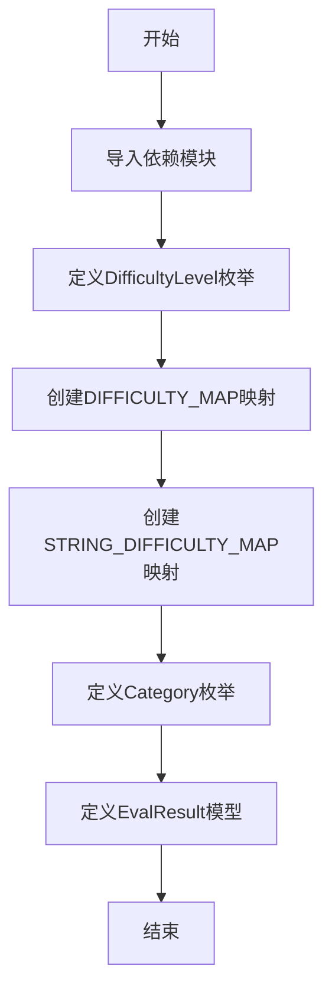

# `.\AutoGPT\classic\benchmark\agbenchmark\utils\data_types.py` 详细设计文档

该代码定义了一套用于评估任务的数据模型，包括难度等级枚举、任务类别枚举以及评估结果的结构化模型，用于支持不同难度和类别的任务评估。

## 整体流程



## 类结构

```
DifficultyLevel (枚举类)
├── interface
├── basic
├── novice
├── intermediate
├── advanced
├── expert
└── human

Category (枚举类)
├── GENERALIST
├── DATA
├── CODING
├── SCRAPE_SYNTHESIZE
├── WEB
├── GAIA_1
├── GAIA_2
└── GAIA_3

EvalResult (Pydantic模型)
└── 继承自BaseModel
```

## 全局变量及字段


### `DIFFICULTY_MAP`
    
将难度级别枚举映射到对应的数字等级（1-7）

类型：`dict[DifficultyLevel, int]`
    


### `STRING_DIFFICULTY_MAP`
    
将难度级别的字符串值映射到对应的数字等级

类型：`dict[str, int]`
    


### `DifficultyLevel.interface`
    
难度等级：接口级别（最低）

类型：`DifficultyLevel`
    


### `DifficultyLevel.basic`
    
难度等级：基础级别

类型：`DifficultyLevel`
    


### `DifficultyLevel.novice`
    
难度等级：新手级别

类型：`DifficultyLevel`
    


### `DifficultyLevel.intermediate`
    
难度等级：中级级别

类型：`DifficultyLevel`
    


### `DifficultyLevel.advanced`
    
难度等级：高级级别

类型：`DifficultyLevel`
    


### `DifficultyLevel.expert`
    
难度等级：专家级别

类型：`DifficultyLevel`
    


### `DifficultyLevel.human`
    
难度等级：人类级别（最高）

类型：`DifficultyLevel`
    


### `Category.GENERALIST`
    
类别：通用类别

类型：`Category`
    


### `Category.DATA`
    
类别：数据类别

类型：`Category`
    


### `Category.CODING`
    
类别：编程类别

类型：`Category`
    


### `Category.SCRAPE_SYNTHESIZE`
    
类别：抓取合成类别

类型：`Category`
    


### `Category.WEB`
    
类别：Web类别

类型：`Category`
    


### `Category.GAIA_1`
    
类别：GAIA测试集级别1

类型：`Category`
    


### `Category.GAIA_2`
    
类别：GAIA测试集级别2

类型：`Category`
    


### `Category.GAIA_3`
    
类别：GAIA测试集级别3

类型：`Category`
    


### `EvalResult.result`
    
评估结果的内容

类型：`str`
    


### `EvalResult.result_source`
    
评估结果的来源标识

类型：`Literal['step_output'] | str`
    


### `EvalResult.score`
    
评估得分

类型：`float`
    


### `EvalResult.passed`
    
是否通过评估

类型：`bool`
    
    

## 全局函数及方法


## 关键组件


### DifficultyLevel 枚举类

定义系统支持的难度等级枚举，包含 interface、basic、novice、intermediate、advanced、expert、human 七个等级，用于标准化任务难度的分类。

### DIFFICULTY_MAP 全局字典

将 DifficultyLevel 枚举成员映射到对应的数值（1-7），用于量化难度等级进行比较和排序操作。

### STRING_DIFFICULTY_MAP 全局字典

将难度等级的字符串值映射到对应的数值，提供从字符串到数值的快速转换能力。

### Category 枚举类

定义任务类别枚举，包含 GENERALIST、DATA、CODING、SCRAPE_SYNTHESIZE、WEB、GAIA_1、GAIA_2、GAIA_3 七个类别，用于任务分类管理。

### EvalResult 数据模型

Pydantic 基类模型，定义评估结果的数据结构，包含 result（结果内容）、result_source（结果来源）、score（得分）、passed（是否通过）四个字段，用于标准化评估任务的输出格式。


## 问题及建议


### 已知问题

- **枚举成员命名不一致**：DifficultyLevel中的"interface"、"basic"、"novice"等命名抽象且不直观，与"human"、"expert"等具体词汇混用，容易造成理解困惑
- **映射关系存在冗余**：STRING_DIFFICULTY_MAP通过{e.value: DIFFICULTY_MAP[e] for e in DifficultyLevel}实现，每次调用都会遍历枚举创建新字典，可考虑预计算或使用cached_property
- **类型定义冗余**：EvalResult.result_source使用Literal["step_output"] | str，但"step_output"作为字面量与其他字符串类型混用，语义不清晰
- **数值硬编码风险**：难度等级的数字映射（1-7）硬编码在DIFFICULTY_MAP中，缺乏配置化机制，后续调整成本高
- **缺乏文档说明**：整个代码模块没有任何docstring或注释，新成员接手时理解成本高
- **枚举设计过度复杂**：Category中"GAIA_1/2/3"与其他通用类别混在一起，层级不清晰

### 优化建议

- 将DifficultyLevel的值改为更直观的命名（如"beginner"代替"basic"），或添加value_description属性
- 使用functools.lru_cache或预计算方式缓存STRING_DIFFICULTY_MAP
- 考虑使用StrictStr或定义result_source为独立类型别名
- 将难度数值映射外部配置化，使用配置文件或环境变量管理
- 为模块、类、枚举添加docstring说明用途和业务背景
- 将Category拆分为通用类别和比赛类别两个枚举，或使用层次化结构
- 考虑为EvalResult添加validator检查score范围（0-1）和result非空


## 其它


### 项目概述

该模块定义了评估系统的难度级别和类别枚举，以及评估结果的数据模型，用于支持不同难度等级的测试场景和结果评估。

### 文件的整体运行流程

本模块为数据定义模块，加载时按顺序完成以下初始化：
1. 导入Python标准库enum、typing和第三方库pydantic
2. 定义DifficultyLevel枚举类的7个成员
3. 创建DIFFICULTY_MAP字典，将枚举成员映射为数值
4. 创建STRING_DIFFICULTY_MAP字典，将枚举值字符串映射为数值
5. 定义Category枚举类的7个成员
6. 定义EvalResult Pydantic模型类

模块本身无执行入口，供其他模块导入使用。

### 类详细信息

### 类名：DifficultyLevel

**类说明：** 难度级别枚举类，定义了从接口级别到人类级别的七个难度梯度

**类的属性：**

| 属性名 | 类型 | 描述 |
|--------|------|------|
| interface | DifficultyLevel | 接口级别难度，数值映射为1 |
| basic | DifficultyLevel | 基础级别难度，数值映射为2 |
| novice | DifficultyLevel | 初学者级别难度，数值映射为3 |
| intermediate | DifficultyLevel | 中级级别难度，数值映射为4 |
| advanced | DifficultyLevel | 高级级别难度，数值映射为5 |
| expert | DifficultyLevel | 专家级别难度，数值映射为6 |
| human | DifficultyLevel | 人类级别难度，数值映射为7 |

**类的方法：** 无自定义方法，继承自Enum基类

### 类名：Category

**类说明：** 评估类别枚举类，定义了多种测试类别用于评估场景的分类

**类的属性：**

| 属性名 | 类型 | 描述 |
|--------|------|------|
| GENERALIST | Category | 通才类别，值为"general" |
| DATA | Category | 数据类别，值为"data" |
| CODING | Category | 编程类别，值为"coding" |
| SCRAPE_SYNTHESIZE | Category | 爬取合成类别，值为"scrape_synthesize" |
| WEB | Category | Web类别，值为"web" |
| GAIA_1 | Category | GAIA_1类别，值为"GAIA_1" |
| GAIA_2 | Category | GAIA_2类别，值为"GAIA_2" |
| GAIA_3 | Category | GAIA_3类别，值为"GAIA_3" |

**类的方法：** 无自定义方法，继承自Enum基类

### 类名：EvalResult

**类说明：** 评估结果数据模型，使用Pydantic BaseModel定义，用于存储单个测试用例的评估结果

**类的属性：**

| 字段名 | 类型 | 描述 |
|--------|------|------|
| result | str | 评估结果内容，存储具体的执行输出或答案 |
| result_source | Literal["step_output"] \| str | 结果来源，标识结果来自步骤输出或其他来源 |
| score | float | 得分，浮点数表示的评分 |
| passed | bool | 是否通过，布尔值标识测试是否通过 |

**类的方法：** 继承自BaseModel的自动生成方法（model_validate、model_dump等）

### 全局变量详细信息

### 全局变量：DIFFICULTY_MAP

**变量名：** DIFFICULTY_MAP

**类型：** dict[DifficultyLevel, int]

**描述：** 难度级别枚举到数值的映射字典，将DifficultyLevel枚举成员映射为对应的整数值

### 全局变量：STRING_DIFFICULTY_MAP

**变量名：** STRING_DIFFICULTY_MAP

**类型：** dict[str, int]

**描述：** 难度级别字符串到数值的映射字典，将DifficultyLevel枚举的value字符串映射为对应的整数值

### 关键组件信息

### 组件名称：DifficultyLevel 枚举

**一句话描述：** 定义七个难度等级的核心枚举类，用于测试场景的难度分级

### 组件名称：Category 枚举

**一句话描述：** 定义八个评估类别的枚举类，用于测试用例的分类管理

### 组件名称：EvalResult 模型

**一句话描述：** Pydantic数据模型，用于结构化存储评估结果、得分和通过状态

### 组件名称：DIFFICULTY_MAP

**一句话描述：** 难度级别到数值的转换映射，提供枚举成员到整数的快速查找

### 组件名称：STRING_DIFFICULTY_MAP

**一句话描述：** 字符串到难度数值的转换映射，支持从字符串类型进行难度值查询

### 潜在的技术债务或优化空间

1. **枚举扩展性不足：** DifficultyLevel和Category枚举为静态定义，新增难度或类别需要修改代码，建议考虑配置化或数据库存储
2. **映射字典冗余：** DIFFICULTY_MAP和STRING_DIFFICULTY_MAP存在数据冗余，后者可通过DIFFICULTY_MAP反向映射动态生成
3. **缺少验证逻辑：** EvalResult模型未对score范围、result_source有效值等进行校验，建议添加field_validator
4. **文档注释缺失：** 枚举成员缺少docstring注释，API文档生成不完整

### 其它项目

#### 设计目标与约束

- **目标：** 提供统一的难度级别和类别定义，支持评估系统的标准化
- **约束：** 依赖Pydantic库，需保持Python 3.8+兼容性，枚举值必须为字符串类型以支持序列化

#### 错误处理与异常设计

- **Pydantic验证错误：** EvalResult模型在数据校验失败时抛出ValidationError，由调用方捕获处理
- **枚举值错误：** 访问不存在的枚举成员会抛出ValueError
- **映射键错误：** 查询DIFFICULTY_MAP不存在的键会抛出KeyError

#### 数据流与状态机

- **数据流向：** 配置文件/数据库 → DifficultyLevel/Category枚举 → DIFFICULTY_MAP映射 → 数值计算 → EvalResult存储
- **状态转换：** 无状态机设计，仅为静态数据定义模块

#### 外部依赖与接口契约

- **依赖库：** pydantic（数据验证）、typing（类型提示）、enum（枚举基类）
- **接口契约：** 导出DifficultyLevel、Category、EvalResult、DIFFICULTY_MAP、STRING_DIFFICULTY_MAP共5个公开接口
- **版本要求：** Python 3.8+、pydantic 2.x

#### 扩展性设计

- **枚举扩展：** Category枚举可扩展增加新类别，如增加"GAIA_4"等
- **数值调整：** DIFFICULTY_MAP的数值映射可根据实际需求调整，支持非连续数值
- **模型扩展：** EvalResult可通过继承添加额外字段，如timestamp、metadata等

    