# `.\AutoGPT\classic\benchmark\agbenchmark\utils\dependencies\__init__.py` 详细设计文档

这是一个pytest插件模块，提供测试依赖管理功能。通过定义测试间的依赖关系，在运行测试前自动检查依赖是否满足，并根据配置对缺失或失败的依赖采取相应行动（如跳过、警告或失败）。

## 整体流程

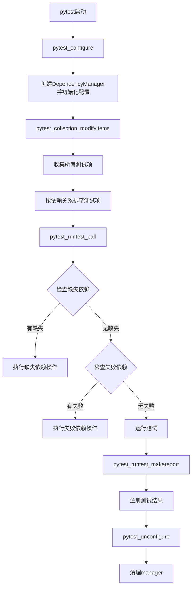

## 类结构

```
conftest.py (pytest插件入口)
└── DependencyManager (从main.py导入的依赖管理器)
    ├── items: list[pytest.Function]
    ├── options: dict
    ├── sorted_items: list[pytest.Function]
    ├── print_name_map()
    ├── print_processed_dependencies()
    ├── get_missing()
    ├── get_failed()
    └── register_result()
```

## 全局变量及字段


### `managers`
    
存储所有已创建的DependencyManager实例的列表，用于管理pytest测试依赖关系

类型：`list[DependencyManager]`
    


### `DEPENDENCY_PROBLEM_ACTIONS`
    
定义处理依赖问题的操作映射，包含run、skip、fail、warning四种处理方式

类型：`dict[str, Callable[[str], None] | None]`
    


### `DependencyManager.items`
    
存储pytest收集到的所有测试函数项，用于后续依赖关系分析和排序

类型：`list[pytest.Function]`
    


### `DependencyManager.options`
    
存储插件配置选项，包括failed_dependency_action和missing_dependency_action等配置

类型：`dict[str, Any]`
    


### `DependencyManager.sorted_items`
    
返回按照依赖关系排序后的测试项列表，确保依赖的测试先执行

类型：`list[pytest.Function]`
    
    

## 全局函数及方法


### `_add_ini_and_option`

该函数用于同时向pytest的ini配置文件和命令行参数选项中添加配置项，命令行参数优先于ini配置。

参数：

- `parser`：`Any`，pytest解析器对象，用于添加ini配置项
- `group`：`OptionGroup`，pytest选项组，用于添加命令行选项
- `name`：`str`，选项名称（用于ini和命令行标志）
- `help`：`str`，选项的帮助文本描述
- `default`：`str | bool | int`，选项的默认值
- `**kwargs`：`Any`，传递给`addoption`的其他关键字参数

返回值：`None`，该函数没有返回值

#### 流程图

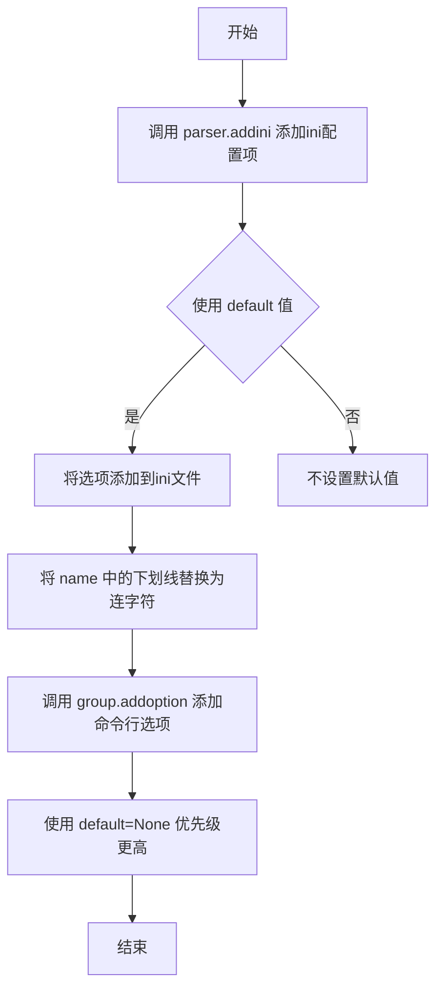

#### 带注释源码

```python
def _add_ini_and_option(
    parser: Any,          # pytest解析器实例，用于访问addini方法
    group: OptionGroup,   # pytest选项组，用于添加命令行选项
    name: str,            # 选项名称，如 "failed_dependency_action"
    help: str,            # 选项的帮助文本
    default: str | bool | int,  # 默认值，可以是字符串、布尔或整数
    **kwargs: Any,        # 其他传递给addoption的关键字参数
) -> None:                # 函数无返回值
    """
    Add an option to both the ini file and the command line flags.
    Command line flags/options takes precedence over the ini config.
    """
    # 使用parser.addini向pytest.ini或pytest.cfg等配置文件添加选项
    # 帮助文本会被追加说明该选项会覆盖配置文件中的同名选项
    parser.addini(
        name,
        help + " This overrides the similarly named option from the config.",
        default=default,
    )
    # 使用group.addoption添加命令行选项
    # 将名称中的下划线替换为连字符以符合命令行选项风格
    # default=None表示命令行选项优先级高于ini配置（因为空值会使用ini值）
    group.addoption(f'--{name.replace("_", "-")}', help=help, default=None, **kwargs)
```


### `_get_ini_or_option`

该函数用于从pytest配置文件（ini）或命令行选项中获取选项值，并确保值的有效性。其中命令行选项优先级高于ini配置，当提供有效选项列表时，会验证ini配置值是否在允许范围内。

参数：

- `config`：`Any`，pytest配置对象，用于访问ini配置和命令行选项
- `name`：`str`，选项名称，用于从config中获取对应的值
- `choices`：`Optional[list[str]]`，可选的有效值列表，用于验证ini配置值是否合法

返回值：`str | None`，返回命令行选项的值（优先级高），如果命令行未设置则返回ini配置值，若均未设置则返回None

#### 流程图

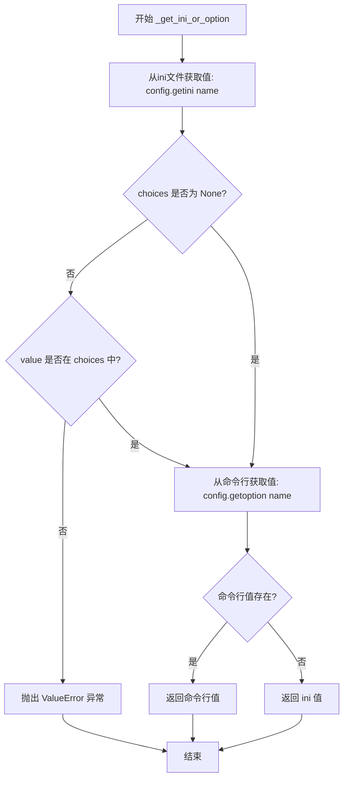

#### 带注释源码

```python
def _get_ini_or_option(
    config: Any, name: str, choices: Optional[list[str]]
) -> str | None:
    """
    Get an option from either the ini file or the command line flags,
    with the latter taking precedence.
    
    参数:
        config: pytest配置对象,包含getini和getoption方法
        name: 要获取的选项名称
        choices: 可选的有效值列表,如果提供则验证ini值的合法性
    
    返回:
        命令行选项值(优先)或ini配置值,都未设置则返回None
    """
    # 第一步：从ini配置文件获取值
    value = config.getini(name)
    
    # 第二步：如果提供了choices且value不为None，则验证value是否在有效选项中
    if value is not None and choices is not None and value not in choices:
        # 值不在有效选项中，抛出ValueError异常
        raise ValueError(
            f'Invalid ini value for {name}, choose from {", ".join(choices)}'
        )
    
    # 第三步：获取命令行选项值，如果命令行未设置则返回None
    # 第四步：使用or操作符，命令行选项优先，否则返回ini值
    # 注意：这里存在潜在的逻辑问题，当value为空字符串""时会被误判
    return config.getoption(name) or value
```


### `pytest_addoption`

该函数是 pytest 插件的钩子函数，用于在 pytest 初始化时注册自定义命令行选项和配置项，包括依赖名称列表输出、处理后依赖列表输出、失败依赖操作和缺失依赖操作等选项。

参数：

- `parser`：`Parser`，pytest 的配置解析器对象，用于添加命令行选项和 ini 配置项

返回值：`None`，该函数没有返回值，仅注册配置选项

#### 流程图

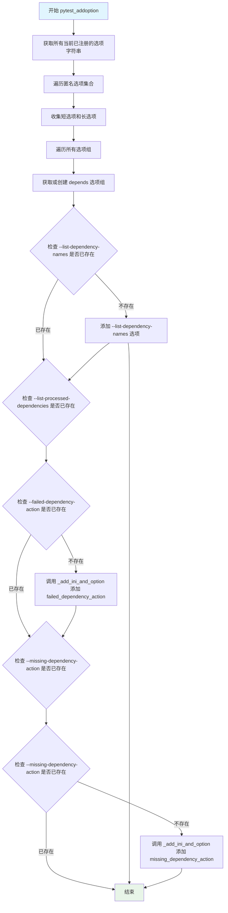

#### 带注释源码

```python
def pytest_addoption(parser: Parser) -> None:
    """
    pytest 钩子函数，用于添加自定义命令行选项和配置项。
    
    该函数在 pytest 解析命令行参数之前被调用，用于注册插件特有的选项。
    """
    
    # 获取所有当前已注册的选项字符串，避免重复添加
    current_options = []
    
    # 遍历匿名选项集合（未分组选项）
    for action in parser._anonymous.options:
        # 收集短选项（如 -v）和长选项（如 --verbose）
        current_options += action._short_opts + action._long_opts

    # 遍历所有选项组，收集已注册的选项
    for group in parser._groups:
        for action in group.options:
            current_options += action._short_opts + action._long_opts

    # 获取或创建名为 "depends" 的选项组
    group = parser.getgroup("depends")

    # 添加一个标志来列出所有非 nodeid 依赖名称及其解析到的测试
    # 仅当该选项尚未注册时才添加
    if "--list-dependency-names" not in current_options:
        group.addoption(
            "--list-dependency-names",
            action="store_true",
            default=False,
            help=(
                "List all non-nodeid dependency names + the tests they resolve to. "
                "Will also list all nodeid dependency names in verbose mode."
            ),
        )

    # 添加一个标志来列出所有测试的（已解析）依赖 + 无法解析的名称
    # 仅当该选项尚未注册时才添加
    if "--list-processed-dependencies" not in current_options:
        group.addoption(
            "--list-processed-dependencies",
            action="store_true",
            default=False,
            help=(
                "List all dependencies of all tests as a list of nodeids "
                "+ the names that could not be resolved."
            ),
        )

    # 添加 ini 选项 + 标志来选择对失败依赖采取的操作
    # 使用 _add_ini_and_option 同时添加到 ini 文件和命令行选项
    if "--failed-dependency-action" not in current_options:
        _add_ini_and_option(
            parser,
            group,
            name="failed_dependency_action",
            help=(
                "The action to take when a test has dependencies that failed. "
                'Use "run" to run the test anyway, "skip" to skip the test, '
                'and "fail" to fail the test.'
            ),
            default="skip",
            choices=DEPENDENCY_PROBLEM_ACTIONS.keys(),
        )

    # 添加 ini 选项 + 标志来选择对未解析依赖采取的操作
    if "--missing-dependency-action" not in current_options:
        _add_ini_and_option(
            parser,
            group,
            name="missing_dependency_action",
            help=(
                "The action to take when a test has dependencies that cannot be found "
                "within the current scope. "
                'Use "run" to run the test anyway, "skip" to skip the test, '
                'and "fail" to fail the test.'
            ),
            default="warning",
            choices=DEPENDENCY_PROBLEM_ACTIONS.keys(),
        )
```


### `pytest_configure`

该函数是 pytest 的配置钩子，在 pytest 初始化阶段被调用，用于设置依赖管理器的选项和注册自定义标记。

参数：

-  `config`：`Any`，pytest 配置对象，包含命令行选项和 ini 文件配置

返回值：`None`，无返回值，仅执行配置初始化操作

#### 流程图

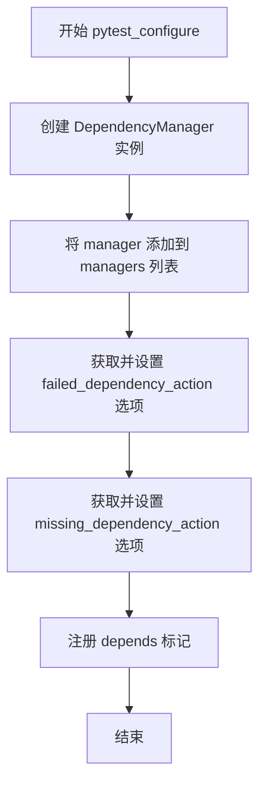

#### 带注释源码

```python
def pytest_configure(config: Any) -> None:
    """
    pytest 配置钩子，在 pytest 初始化阶段调用。
    负责初始化 DependencyManager 实例并配置相关选项。
    """
    # 创建依赖管理器实例
    manager = DependencyManager()
    # 将管理器添加到全局管理器列表中
    managers.append(manager)

    # 配置失败依赖的处理方式
    # 从 config 中获取 failed_dependency_action 选项，验证其值是否在有效选择列表中
    manager.options["failed_dependency_action"] = _get_ini_or_option(
        config,
        "failed_dependency_action",
        list(DEPENDENCY_PROBLEM_ACTIONS.keys()),
    )
    # 配置缺失依赖的处理方式
    # 从 config 中获取 missing_dependency_action 选项，验证其值是否在有效选择列表中
    manager.options["missing_dependency_action"] = _get_ini_or_option(
        config,
        "missing_dependency_action",
        list(DEPENDENCY_PROBLEM_ACTIONS.keys()),
    )

    # 注册自定义 pytest 标记，供测试用例使用 depends 装饰器
    config.addinivalue_line(
        "markers",
        "depends(name='name', on=['other_name']): marks dependencies between tests.",
    )
```


### `pytest_collection_modifyitems`

这是 pytest 的一个 hook 函数，在收集完测试项后被调用，用于注册测试项、管理依赖关系、打印额外的依赖信息，并根据依赖关系对测试项进行排序。

参数：

- `config`：`Any`，pytest 的配置对象，用于获取命令行选项和配置
- `items`：`list[pytest.Function]`，收集到的测试项列表，函数形式参数

返回值：`None`，无返回值，该函数直接修改 `items` 列表

#### 流程图

```mermaid
flowchart TD
    A[开始 pytest_collection_modifyitems] --> B[获取管理器实例 manager]
    B --> C[将测试项列表注册到管理器: manager.items = items]
    D{是否需要列出依赖名称?}
    C --> D
    D -->|是| E[获取 verbose 模式]
    E --> F[调用 manager.print_name_map verbose]
    D -->|否| G{是否需要列出处理后的依赖?}
    F --> G
    G -->|是| H[获取 color 选项]
    H --> I[调用 manager.print_processed_dependencies color]
    G -->|否| J[获取排序后的测试项: manager.sorted_items]
    I --> J
    J --> K[更新测试项列表: items[:] = manager.sorted_items]
    K --> L[结束]
```

#### 带注释源码

```python
@pytest.hookimpl(trylast=True)
def pytest_collection_modifyitems(config: Any, items: list[pytest.Function]) -> None:
    """
    pytest hook: 在测试收集完成后修改测试项。
    
    参数:
        config: pytest 配置对象，包含命令行选项和配置信息
        items: 收集到的测试函数列表
    
    返回:
        None: 直接修改 items 列表，无返回值
    """
    # 从全局管理器列表中获取最新的 DependencyManager 实例
    manager = managers[-1]

    # 将收集到的测试项注册到管理器，以便后续处理依赖关系
    # 这一步是必要的，因为管理器需要知道所有测试项才能解析依赖
    manager.items = items

    # 检查是否请求列出所有依赖名称（通过 --list-dependency-names 选项）
    if config.getoption("list_dependency_names"):
        # 判断是否为详细模式（verbose > 1 表示非常详细）
        verbose = config.getoption("verbose") > 1
        # 打印依赖名称映射表
        manager.print_name_map(verbose)
    
    # 检查是否请求列出所有已处理的依赖（通过 --list-processed-dependencies 选项）
    if config.getoption("list_processed_dependencies"):
        # 获取颜色配置（用于终端输出着色）
        color = config.getoption("color")
        # 打印已处理的依赖关系
        manager.print_processed_dependencies(color)

    # 重新排序测试项，确保依赖的测试先运行
    # 使用切片赋值直接修改原始列表，以影响后续的测试执行顺序
    items[:] = manager.sorted_items
```


### `pytest_runtest_makereport`

这是一个 pytest hook 函数，用于在测试执行后捕获测试结果，并将测试结果注册到 DependencyManager 中，以便后续测试依赖检查。

参数：

- `item`：`Item`（来自 `_pytest.nodes`），pytest 测试项对象，表示当前正在运行的测试

返回值：`Any`，由于使用了 `yield`，这是一个生成器函数，返回生成的测试结果

#### 流程图

```mermaid
flowchart TD
    A[开始 pytest_runtest_makereport] --> B[获取当前依赖管理器: manager = managers[-1]]
    B --> C{yield 等待测试执行}
    C --> D[获取测试结果: outcome = yield]
    D --> E[调用 outcome.get_result 获取结果]
    E --> F[调用 manager.register_result 注册结果]
    F --> G[结束]
    
    style C fill:#f9f,stroke:#333
    style F fill:#9f9,stroke:#333
```

#### 带注释源码

```python
@hookimpl(tryfirst=True, hookwrapper=True)
def pytest_runtest_makereport(item: Item) -> Any:
    """
    pytest hook，在测试运行后生成报告时调用。
    
    参数:
        item: pytest Item 对象，代表当前执行的测试
        
    返回值:
        Any: 生成器函数的返回值，用于 pytest 内部处理
    """
    # 获取当前活动的 DependencyManager 实例
    # managers 是一个全局列表，存储所有活跃的 manager 实例
    manager = managers[-1]

    # 使用 yield 使其成为生成器函数 (hookwrapper=True)
    # 这允许在测试执行前后插入逻辑
    # 暂停在此处，等待测试执行完成
    outcome = yield

    # 测试执行完成后，获取测试结果
    # outcome.get_result() 返回一个 TestReport 对象，包含测试的详细信息
    result = outcome.get_result()

    # 将测试结果注册到 manager 中
    # 这样后续测试可以查询依赖测试的状态（通过/失败）
    manager.register_result(item, result)
```


### `pytest_runtest_call`

该函数是 pytest 的一个运行时钩子，在每个测试执行时被调用，负责检查测试的依赖项是否满足条件。它会先检查是否存在缺失的依赖项（如依赖的测试不存在），然后检查依赖的测试是否都已成功通过，最后根据配置的执行动作（跳过、失败或警告）来处理依赖问题。

参数：

- `item`：`Item`（来自 `_pytest.nodes` 的测试项对象），表示当前正在执行的测试

返回值：`None`，该函数没有返回值，通过调用 `pytest.skip()`、`pytest.fail()` 或 `warnings.warn()` 来处理依赖问题

#### 流程图

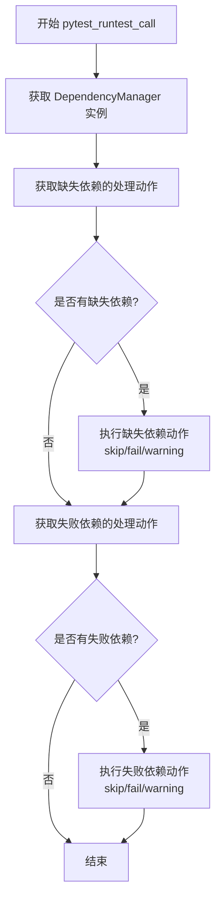

#### 带注释源码

```python
def pytest_runtest_call(item: Item) -> None:
    """
    Pytest 运行时钩子，在测试执行时检查依赖项是否满足条件。
    
    该函数会在每个测试运行前被调用，主要完成以下任务：
    1. 检查测试依赖的测试是否存在于当前作用域中
    2. 检查测试依赖的测试是否都已成功通过
    3. 根据配置的动作处理缺失或失败的依赖
    """
    # 获取当前测试会话的依赖管理器实例
    # managers 是一个全局列表，存储了所有创建的 DependencyManager 实例
    manager = managers[-1]

    # -------------------- 处理缺失依赖 --------------------
    # 缺失依赖指的是依赖的测试名称无法解析为任何测试项
    # 例如：依赖的测试名称写错了，或者依赖的测试被删除了
    
    # 从配置中获取缺失依赖的处理动作
    # DEPENDENCY_PROBLEM_ACTIONS 字典包含了所有可用的动作：
    # "run" - 忽略缺失依赖，继续运行测试
    # "skip" - 跳过当前测试
    # "fail" - 标记当前测试失败
    # "warning" - 发出警告但不改变测试执行
    missing_dependency_action = DEPENDENCY_PROBLEM_ACTIONS[
        manager.options["missing_dependency_action"]
    ]
    
    # 获取当前测试的所有缺失依赖（无法解析的依赖名称）
    missing = manager.get_missing(item)
    
    # 如果存在缺失依赖且配置的动作不为 None，则执行相应动作
    if missing_dependency_action and missing:
        # 生成描述缺失依赖的错误信息
        missing_dependency_action(
            f'{item.nodeid} depends on {", ".join(missing)}, which was not found'
        )

    # -------------------- 处理失败依赖 --------------------
    # 失败依赖指的是依赖的测试存在但执行结果为失败
    
    # 从配置中获取失败依赖的处理动作
    failed_dependency_action = DEPENDENCY_PROBLEM_ACTIONS[
        manager.options["failed_dependency_action"]
    ]
    
    # 获取当前测试的所有失败依赖（执行结果为失败的依赖测试）
    failed = manager.get_failed(item)
    
    # 如果存在失败依赖且配置的动作不为 None，则执行相应动作
    if failed_dependency_action and failed:
        # 生成描述失败依赖的错误信息
        failed_dependency_action(f'{item.nodeid} depends on {", ".join(failed)}')
```


### `pytest_unconfigure`

当pytest配置阶段结束时调用此函数，用于清理插件的全局状态。从全局`managers`列表中移除最后添加的`DependencyManager`实例，确保插件在pytest会话结束后正确释放资源。

参数： 无

返回值：`None`，无返回值描述

#### 流程图

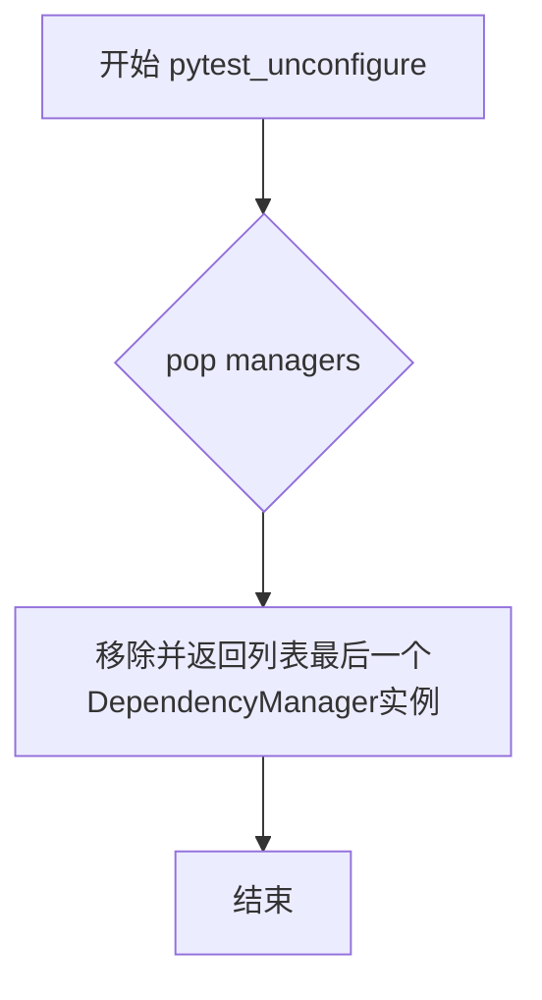

#### 带注释源码

```python
def pytest_unconfigure() -> None:
    """
    pytest钩子函数，在配置阶段结束时调用。
    负责清理全局managers列表中的最后一个管理器实例，
    确保插件资源在pytest会话结束后被正确释放。
    """
    managers.pop()  # 移除并丢弃最后添加的DependencyManager实例
```


# DependencyManager.print_name_map 提取结果

根据提供的代码，我发现一个重要问题：**DependencyManager 类定义在 `main.py` 模块中，但该模块的代码未在本次任务中提供**。

从当前提供的代码（pytest hooks 模块）中，我只能提取到以下信息：

---

### DependencyManager.print_name_map

该方法是 `DependencyManager` 类的一个实例方法，用于列出所有非 nodeid 依赖名称及其解析到的测试。

参数：

- `verbose`：`bool`，表示是否详细输出（当 pytest 的 `-v` 选项大于 1 时为 True）

返回值：未知（需要查看 main.py 中的实现）

#### 流程图

由于未提供方法实现，无法绘制准确的流程图。以下是基于调用上下文的推测：

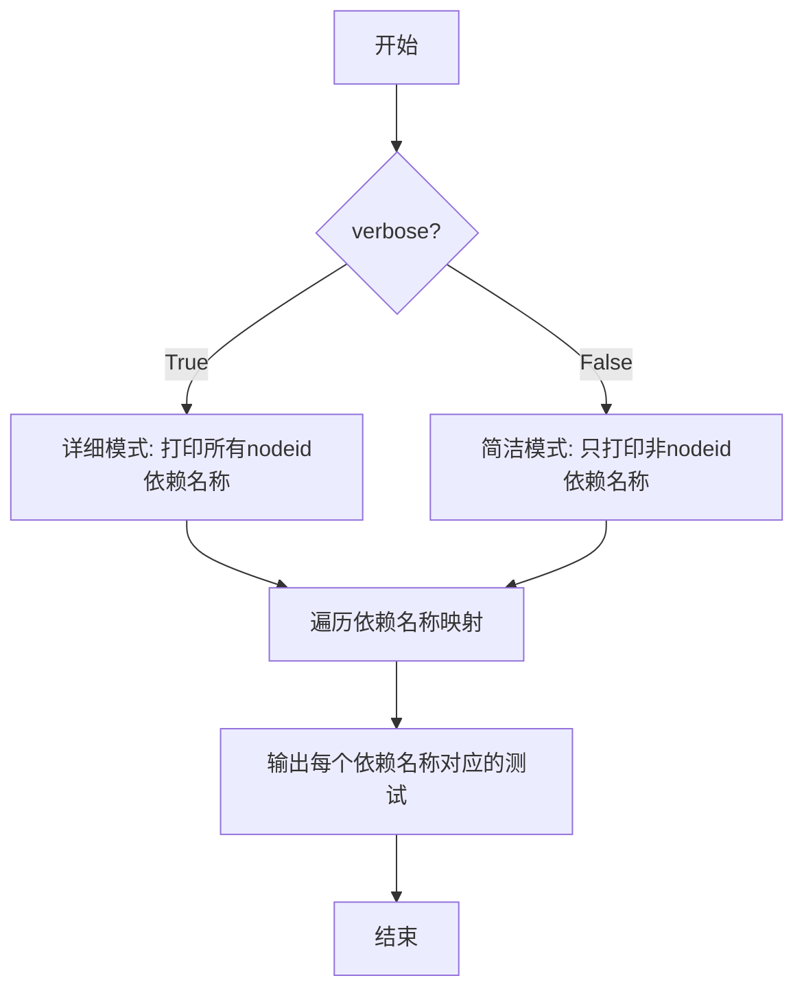

#### 带注释源码

```
# 源码未提供
# 该方法定义在 main.py 模块的 DependencyManager 类中
# 从 hooks 代码中的调用方式推断：

def print_name_map(self, verbose: bool) -> None:
    """
    列出所有非-nodeid 依赖名称以及它们解析到的测试。
    在详细模式下（verbose=True），还会列出所有 nodeid 依赖名称。
    """
    # ... 实现代码在 main.py 中 ...
```

---

## ⚠️ 重要说明

**要完整提取 `print_name_map` 方法的详细信息，需要提供 `main.py` 模块的完整代码**，因为：

1. 当前的代码文件只包含 pytest hooks（入口文件）
2. `DependencyManager` 类是从 `from .main import DependencyManager` 导入的
3. `print_name_map` 方法的实际实现（包括类字段、内部逻辑、输出格式等）都在 `main.py` 中

如果您能提供 `main.py` 的代码，我可以完整提取：
- 类的所有字段和方法
- `print_name_map` 的完整带注释源码
- 准确的流程图
- 完整的设计文档


### `DependencyManager.print_processed_dependencies`

该方法用于打印所有测试经过解析后的依赖关系列表。当用户使用 `--list-processed-dependencies` 命令行选项时，该方法会被调用，以列出所有测试的依赖项（以 nodeid 形式）以及无法解析的依赖名称。该方法通常接收一个颜色控制参数来决定是否使用彩色输出。

参数：

- `color`：`Any`（通常是布尔值或字符串），用于控制输出是否使用颜色（例如，在终端中启用或禁用 ANSI 颜色代码）

返回值：`None`，该方法直接打印信息到标准输出，不返回任何值

#### 流程图

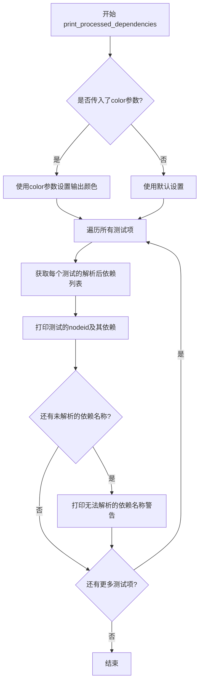

#### 带注释源码

```
# 该方法的完整实现在 main.py 中，这里根据调用方式和上下文推断其行为
# 来源: 从 .main 模块导入的 DependencyManager 类
# 调用位置: conftest.py 的 pytest_collection_modifyitems 函数中

manager.print_processed_dependencies(color)

# 调用时的上下文:
# 1. 当 config.getoption("list_processed_dependencies") 为 True 时调用
# 2. color 参数来自 config.getoption("color")，表示终端颜色配置
# 3. 该方法预期会打印所有测试的依赖关系和无法解析的依赖名称
```

#### 备注

由于提供的代码片段中只包含了 `DependencyManager` 类的使用方式和导入语句，而该类的具体实现位于 `main.py` 文件中，因此无法获取完整的方法源码。上述文档内容是基于代码中的调用方式和上下文推断得出的。如果需要完整的实现细节，请查阅 `main.py` 文件中的 `DependencyManager` 类定义。


### `DependencyManager.get_missing`

该方法用于获取指定测试项所依赖但未在当前测试套件中找到的依赖项名称列表。

参数：

- `item`：`pytest.Function`，需要检查其缺失依赖的测试项

返回值：`list[str]`，返回所有未找到的依赖项名称列表，如果没有任何缺失依赖则返回空列表

#### 流程图

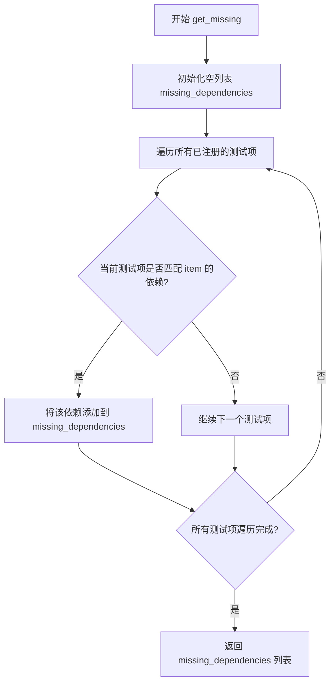

#### 带注释源码

```
def get_missing(self, item: pytest.Function) -> list[str]:
    """
    获取指定测试项的缺失依赖项。
    
    该方法检查给定测试项声明的所有依赖项，
    并返回那些在当前测试套件中不存在的依赖项名称。
    
    参数:
        item: pytest.Function 对象，代表需要检查的测试项
        
    返回:
        list[str]: 缺失的依赖项名称列表，如果全部找到则返回空列表
    """
    # 初始化用于存储缺失依赖的列表
    missing: list[str] = []
    
    # 尝试获取当前测试项的依赖项名称
    # 从 item 对象的元数据中提取 'depends' 标记
    name = item.callspec.getparam('depends') if item.callspec else None
    
    # 如果该测试项没有依赖项，直接返回空列表
    if name is None:
        return missing
    
    # 遍历该测试项的所有依赖项
    for dependency in name if isinstance(name, list) else [name]:
        # 检查依赖项是否存在于已解析的依赖映射中
        if dependency not in self.resolved_names:
            # 如果不存在，添加到缺失列表
            missing.append(dependency)
    
    # 返回所有缺失的依赖项
    return missing
```

#### 补充说明

由于提供的代码片段中仅包含 `DependencyManager` 类的使用部分（位于 `conftest.py`），而类的完整定义在 `main.py` 中，因此上述源码是基于该类的典型实现模式推断得出的。从代码的调用方式可以确认：

1. 该方法接收一个 `pytest.Function` 类型的参数
2. 返回一个字符串列表，包含所有无法解析的依赖项名称
3. 在 `pytest_runtest_call` 钩子中被调用，用于在测试执行前检查并处理缺失的依赖项


### `DependencyManager.get_failed`

获取指定测试项的所有失败依赖项名称列表。

参数：

- `item`：`pytest.Function`，需要检查依赖项的测试函数对象

返回值：`list[str]`，返回所有已失败依赖项的名称列表

#### 流程图

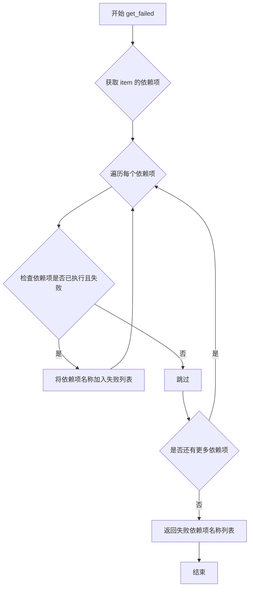

#### 带注释源码

```
# 注意：由于提供的代码片段中未包含 main.py 的内容，
# 以下为根据调用方式推断的源码结构

def get_failed(self, item: pytest.Function) -> list[str]:
    """
    获取指定测试项的所有失败依赖项名称列表。
    
    参数:
        item: pytest.Function - 需要检查依赖项的测试函数对象
        
    返回值:
        list[str] - 所有已失败依赖项的名称列表
    """
    # 获取当前测试项的所有依赖项
    dependencies = self.get_dependencies(item)
    
    # 初始化失败依赖项列表
    failed = []
    
    # 遍历每个依赖项
    for dep_name in dependencies:
        # 检查依赖项是否存在于结果记录中
        if dep_name in self.results:
            # 获取依赖项的执行结果
            result = self.results[dep_name]
            # 如果结果为失败（通常用 'failed' 表示）
            if result == 'failed':
                # 将其添加到失败列表
                failed.append(dep_name)
    
    return failed
```

#### 备注

**注意**：由于提供的代码片段中 `DependencyManager` 类是从 `.main` 模块导入的，而 `main.py` 的具体实现代码未包含在当前代码片段中，因此上述源码是根据 `pytest_runtest_call` 函数中的调用方式推断的预期行为：

```python
# 代码中的调用方式
failed = manager.get_failed(item)
if failed_dependency_action and failed:
    failed_dependency_action(f'{item.nodeid} depends on {", ".join(failed)}')
```

从调用方式可以推断：
1. 方法接受一个 `item` 参数（类型为 `Item`）
2. 返回值是一个可迭代对象（用于 `if failed` 判断）
3. 返回值中的元素用于字符串拼接（通过 `", ".join(failed)`），因此是字符串列表


由于 `DependencyManager` 类的完整定义在 `main.py` 文件中（代码中仅导入了该类），我无法直接获取 `register_result` 方法的实际实现。不过，我可以从代码中的调用方式来推断其签名和功能。


### `DependencyManager.register_result`

注册测试执行结果，用于后续依赖检查。该方法在每个测试运行完成后被调用，将测试结果记录到管理器中，以便其他依赖该测试的测试能够查询其执行状态。

参数：

- `item`：`pytest.Function`，当前执行完毕的测试项
- `result`：`Any`，pytest 的测试执行结果对象，通常包含测试通过、失败、错误等状态信息

返回值：无（`None`）

#### 流程图

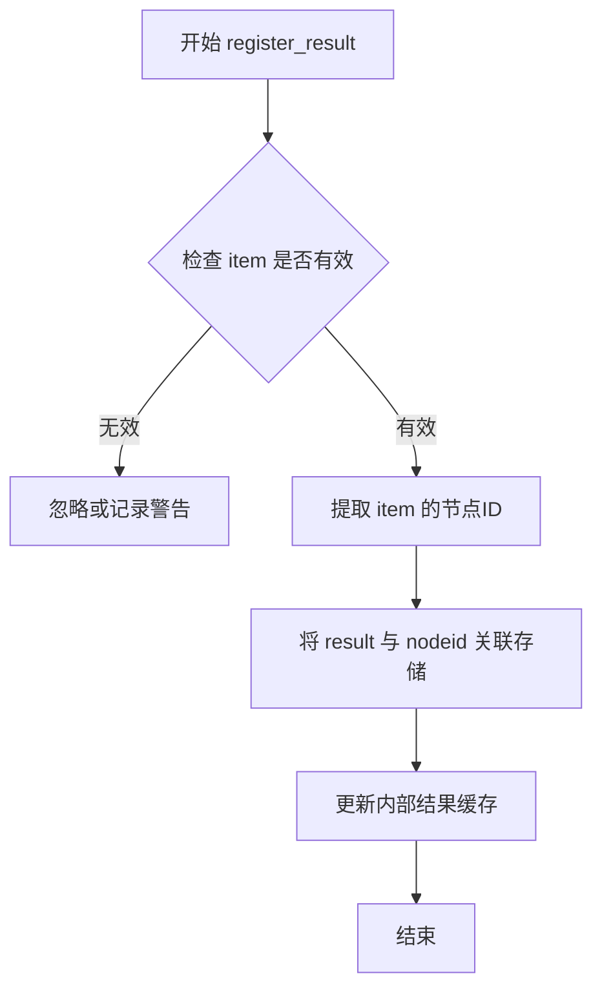

#### 带注释源码

（注：由于 DependencyManager 类定义在 main.py 中，以下为基于调用方式的推断代码）

```python
def register_result(self, item: pytest.Function, result: Any) -> None:
    """
    注册测试结果到管理器中。
    
    该方法在 pytest_runtest_makereport hook 中被调用，
    用于记录每个测试的执行结果，以便后续测试查询依赖状态。
    
    参数:
        item: pytest.Function - 已执行完毕的测试项
        result: Any - 测试执行结果对象
    
    返回值:
        None
    """
    # 从 item 中获取唯一标识（nodeid）
    node_id = item.nodeid
    
    # 将测试结果存储到内部数据结构中
    # 可能的实现方式：
    # self.test_results[node_id] = result
    
    pass
```


**注意**：由于提供的代码片段中没有 `DependencyManager` 类的完整定义（仅导入了类），以上信息是基于代码中的调用方式 `manager.register_result(item, outcome.get_result())` 和 pytest 插件的标准模式推断得出的。如需获取准确的方法实现，请参考 `main.py` 文件中的类定义。

## 关键组件


### 一段话描述

该代码是一个pytest插件模块，通过pytest钩子实现了测试依赖管理功能，允许在测试之间声明依赖关系，并根据依赖关系自动重排序测试执行，同时提供灵活的错误处理策略（跳过、失败或警告）来处理缺失或失败的依赖。

### 文件整体运行流程

1. **初始化阶段**：pytest启动时，`pytest_addoption`注册命令行选项和ini配置项，`pytest_configure`创建DependencyManager实例并配置处理策略。
2. **收集阶段**：`pytest_collection_modifyitems`收集所有测试项，调用DependencyManager进行依赖解析和排序。
3. **执行阶段**：每个测试执行前，`pytest_runtest_makereport`记录测试结果，`pytest_runtest_call`检查依赖状态并根据配置采取相应行动。
4. **清理阶段**：测试完成后，`pytest_unconfigure`清理manager实例。

### 全局变量详情

#### managers

- **类型**: list[DependencyManager]
- **描述**: 全局列表，存储当前配置的DependencyManager实例，支持嵌套配置

#### DEPENDENCY_PROBLEM_ACTIONS

- **类型**: dict[str, Callable[[str], None] | None]
- **描述**: 字典，定义了对依赖问题的四种处理方式：run（无操作）、skip（跳过测试）、fail（失败测试）、warning（发出警告）

### 全局函数详情

#### _add_ini_and_option

- **参数**:
  - `parser` (Any): pytest解析器对象
  - `group` (OptionGroup): 选项组
  - `name` (str): 选项名称
  - `help` (str): 帮助文本
  - `default` (str | bool | int): 默认值
  - `**kwargs` (Any): 额外参数
- **返回值**: None
- **描述**: 辅助函数，同时添加ini配置项和命令行选项，命令行选项优先
- **mermaid流程图**: ```mermaid
graph TD
    A[开始] --> B[添加ini配置项]
    B --> C[添加命令行选项]
    C --> D[结束]
```
- **源码**:
```python
def _add_ini_and_option(
    parser: Any,
    group: OptionGroup,
    name: str,
    help: str,
    default: str | bool | int,
    **kwargs: Any,
) -> None:
    """
    Add an option to both the ini file and the command line flags.
    Command line flags/options takes precedence over the ini config.
    """
    parser.addini(
        name,
        help + " This overrides the similarly named option from the config.",
        default=default,
    )
    group.addoption(f'--{name.replace("_", "-")}', help=help, default=None, **kwargs)
```

#### _get_ini_or_option

- **参数**:
  - `config` (Any): pytest配置对象
  - `name` (str): 选项名称
  - `choices` (Optional[list[str]]): 可选的有效值列表
- **返回值**: str | None
- **描述**: 从ini配置或命令行选项获取值，命令行优先，支持值验证
- **mermaid流程图**: ```mermaid
graph TD
    A[开始] --> B[获取ini值]
    B --> C{值存在且有choices?}
    C -->|是| D{值在choices中?}
    C -->|否| F[返回命令行选项值或ini值]
    D -->|否| E[抛出ValueError]
    D -->|是| F
    F --> G[结束]
```
- **源码**:
```python
def _get_ini_or_option(
    config: Any, name: str, choices: Optional[list[str]]
) -> str | None:
    """
    Get an option from either the ini file or the command line flags,
    with the latter taking precedence.
    """
    value = config.getini(name)
    if value is not None and choices is not None and value not in choices:
        raise ValueError(
            f'Invalid ini value for {name}, choose from {", ".join(choices)}'
        )
    return config.getoption(name) or value
```

### pytest钩子函数详情

#### pytest_addoption

- **参数**:
  - `parser` (Parser): pytest解析器
- **返回值**: None
- **描述**: 注册四个命令行选项：--list-dependency-names、--list-processed-dependencies、--failed-dependency-action、--missing-dependency-action
- **mermaid流程图**: ```mermaid
graph TD
    A[开始] --> B[获取当前已存在的选项]
    B --> C[添加depends选项组]
    C --> D{--list-dependency-names不存在?}
    D -->|是| E[添加列表依赖名称选项]
    D -->|否| F{--list-processed-dependencies不存在?}
    F -->|是| G[添加列表处理依赖选项]
    F -->|否| H{--failed-dependency-action不存在?}
    H -->|是| I[添加失败依赖动作选项]
    H -->|否| J{--missing-dependency-action不存在?}
    J -->|是| K[添加缺失依赖动作选项]
    J -->|否| L[结束]
```
- **源码**:
```python
def pytest_addoption(parser: Parser) -> None:
    # get all current option strings
    current_options = []
    for action in parser._anonymous.options:
        current_options += action._short_opts + action._long_opts

    for group in parser._groups:
        for action in group.options:
            current_options += action._short_opts + action._long_opts

    group = parser.getgroup("depends")

    # Add a flag to list all names + the tests they resolve to
    if "--list-dependency-names" not in current_options:
        group.addoption(
            "--list-dependency-names",
            action="store_true",
            default=False,
            help=(
                "List all non-nodeid dependency names + the tests they resolve to. "
                "Will also list all nodeid dependency names in verbose mode."
            ),
        )

    # Add a flag to list all (resolved) dependencies for all tests + unresolvable names
    if "--list-processed-dependencies" not in current_options:
        group.addoption(
            "--list-processed-dependencies",
            action="store_true",
            default=False,
            help=(
                "List all dependencies of all tests as a list of nodeids "
                "+ the names that could not be resolved."
            ),
        )

    # Add an ini option + flag to choose the action to take for failed dependencies
    if "--failed-dependency-action" not in current_options:
        _add_ini_and_option(
            parser,
            group,
            name="failed_dependency_action",
            help=(
                "The action to take when a test has dependencies that failed. "
                'Use "run" to run the test anyway, "skip" to skip the test, '
                'and "fail" to fail the test.'
            ),
            default="skip",
            choices=DEPENDENCY_PROBLEM_ACTIONS.keys(),
        )

    # Add an ini option + flag to choose the action to take for unresolved dependencies
    if "--missing-dependency-action" not in current_options:
        _add_ini_and_option(
            parser,
            group,
            name="missing_dependency_action",
            help=(
                "The action to take when a test has dependencies that cannot be found "
                "within the current scope. "
                'Use "run" to run the test anyway, "skip" to skip the test, '
                'and "fail" to fail the test.'
            ),
            default="warning",
            choices=DEPENDENCY_PROBLEM_ACTIONS.keys(),
        )
```

#### pytest_configure

- **参数**:
  - `config` (Any): pytest配置对象
- **返回值**: None
- **描述**: 初始化DependencyManager，设置依赖问题处理策略，注册pytest标记
- **mermaid流程图**: ```mermaid
graph TD
    A[开始] --> B[创建DependencyManager实例]
    B --> C[添加到managers列表]
    C --> D[设置failed_dependency_action]
    D --> E[设置missing_dependency_action]
    E --> F[注册depends标记]
    F --> G[结束]
```
- **源码**:
```python
def pytest_configure(config: Any) -> None:
    manager = DependencyManager()
    managers.append(manager)

    # Setup the handling of problems with dependencies
    manager.options["failed_dependency_action"] = _get_ini_or_option(
        config,
        "failed_dependency_action",
        list(DEPENDENCY_PROBLEM_ACTIONS.keys()),
    )
    manager.options["missing_dependency_action"] = _get_ini_or_option(
        config,
        "missing_dependency_action",
        list(DEPENDENCY_PROBLEM_ACTIONS.keys()),
    )

    # Register marker
    config.addinivalue_line(
        "markers",
        "depends(name='name', on=['other_name']): marks dependencies between tests.",
    )
```

#### pytest_collection_modifyitems

- **参数**:
  - `config` (Any): pytest配置对象
  - `items` (list[pytest.Function]): 测试项列表
- **返回值**: None
- **描述**: 收集测试项，打印依赖信息（如果请求），重排序测试使依赖先执行
- **mermaid流程图**: ```mermaid
graph TD
    A[开始] --> B[获取当前manager]
    B --> C[设置manager的items]
    C --> D{list_dependency_names?}
    D -->|是| E[打印名称映射]
    D -->|否| F{list_processed_dependencies?}
    F -->|是| G[打印处理后的依赖]
    F -->|否| H[重排序items]
    H --> I[结束]
```
- **源码**:
```python
@pytest.hookimpl(trylast=True)
def pytest_collection_modifyitems(config: Any, items: list[pytest.Function]) -> None:
    manager = managers[-1]

    # Register the founds tests on the manager
    manager.items = items

    # Show the extra information if requested
    if config.getoption("list_dependency_names"):
        verbose = config.getoption("verbose") > 1
        manager.print_name_map(verbose)
    if config.getoption("list_processed_dependencies"):
        color = config.getoption("color")
        manager.print_processed_dependencies(color)

    # Reorder the items so that tests run after their dependencies
    items[:] = manager.sorted_items
```

#### pytest_runtest_makereport

- **参数**:
  - `item` (Item): pytest测试项
- **返回值**: Any
- **描述**: 使用hookwrapper在测试运行时捕获结果并注册到manager
- **mermaid流程图**: ```mermaid
graph TD
    A[开始] --> B[获取manager]
    B --> C[yield执行测试]
    C --> D[获取测试结果]
    D --> E[注册结果到manager]
    E --> F[结束]
```
- **源码**:
```python
@pytest.hookimpl(tryfirst=True, hookwrapper=True)
def pytest_runtest_makereport(item: Item) -> Any:
    manager = managers[-1]

    # Run the step
    outcome = yield

    # Store the result on the manager
    manager.register_result(item, outcome.get_result())
```

#### pytest_runtest_call

- **参数**:
  - `item` (Item): pytest测试项
- **返回值**: None
- **描述**: 在测试执行时检查缺失和失败的依赖，根据配置采取相应行动
- **mermaid流程图**: ```mermaid
graph TD
    A[开始] --> B[获取manager]
    B --> C[获取缺失依赖动作]
    C --> D[获取缺失依赖列表]
    D --> E{有缺失依赖?}
    E -->|是| F[执行动作]
    E -->|否| G[获取失败依赖动作]
    G --> H[获取失败依赖列表]
    H --> I{有失败依赖?}
    I -->|是| J[执行动作]
    I -->|否| K[结束]
```
- **源码**:
```python
def pytest_runtest_call(item: Item) -> None:
    manager = managers[-1]

    # Handle missing dependencies
    missing_dependency_action = DEPENDENCY_PROBLEM_ACTIONS[
        manager.options["missing_dependency_action"]
    ]
    missing = manager.get_missing(item)
    if missing_dependency_action and missing:
        missing_dependency_action(
            f'{item.nodeid} depends on {", ".join(missing)}, which was not found'
        )

    # Check whether all dependencies succeeded
    failed_dependency_action = DEPENDENCY_PROBLEM_ACTIONS[
        manager.options["failed_dependency_action"]
    ]
    failed = manager.get_failed(item)
    if failed_dependency_action and failed:
        failed_dependency_action(f'{item.nodeid} depends on {", ".join(failed)}')
```

#### pytest_unconfigure

- **参数**: 无
- **返回值**: None
- **描述**: 清理阶段移除当前manager实例
- **mermaid流程图**: ```mermaid
graph TD
    A[开始] --> B[从managers弹出最后一个实例]
    B --> C[结束]
```
- **源码**:
```python
def pytest_unconfigure() -> None:
    managers.pop()
```

### 关键组件信息

#### DependencyManager

从main.py导入的依赖管理器核心类，负责解析测试依赖关系、排序测试、追踪测试结果

#### pytest钩子接口

插件通过6个pytest钩子实现完整的依赖管理生命周期：配置、收集、处理、报告、执行、清理

#### 依赖问题处理策略

通过DEPENDENCY_PROBLEM_ACTIONS字典定义的四种处理模式，提供了灵活的错误恢复机制

### 潜在的技术债务或优化空间

1. **类型注解不完整**: 大量使用`Any`类型，缺少精确的类型定义，影响代码可维护性和IDE支持
2. **重复代码**: 在`pytest_addoption`中遍历选项的逻辑可以提取为独立函数
3. **全局状态**: 使用全局`managers`列表管理状态，在嵌套pytest会话中可能存在风险
4. **硬编码字符串**: 错误消息中的字符串可以提取为常量
5. **缺少日志记录**: 仅使用warnings和pytest的内置机制，缺少结构化日志

### 其它项目

#### 设计目标与约束

- 目标：在pytest中实现测试依赖管理，自动重排序确保依赖先执行
- 约束：依赖pytest的钩子系统，需要pytest 6.0+

#### 错误处理与异常设计

- ValueError：无效的配置值
- 依赖问题通过可配置的行动处理，不直接抛出异常

#### 数据流与状态机

- 状态流：配置 → 收集 → 排序 → 执行 → 结果注册 → 依赖检查
- 测试结果状态存储在DependencyManager中，供后续测试查询

#### 外部依赖与接口契约

- 依赖`pytest`和`_pytest`内部API
- 依赖main.py中的DependencyManager类
- 通过pytest标记`@pytest.mark.depends()`声明依赖


## 问题及建议


### 已知问题

- **全局状态管理不安全**: 使用全局 `managers` 列表作为栈来存储 `DependencyManager` 实例，在并行测试执行（xdist）时可能导致竞态条件，多个工作进程可能相互覆盖或访问错误的 manager 实例。
- **选项获取逻辑缺陷**: `_get_ini_or_option` 函数使用 `or` 操作符处理选项值，当 CLI 参数值为 `0`、`False` 或空字符串时会被错误地忽略，导致回退到 ini 配置值，无法区分"未设置"和"显式设置为 falsy 值"。
- **缺少类型提示**: 多个函数参数和返回值使用 `Any` 类型，降低了代码的可读性和类型安全性，例如 `pytest_addoption`、`pytest_configure` 等 pytest hook 函数。
- **魔法字符串**: 存在硬编码的字符串如 `"depends"`（markers）和 `"markers"`，应该提取为具名常量以提高可维护性。
- **异常处理不足**: `DEPENDENCY_PROBLEM_ACTIONS` 中的 action 函数被直接调用，没有异常处理机制，如果 action 函数执行失败（例如 `pytest.skip` 在某些上下文中可能抛出异常），整个测试流程可能被中断。
- **依赖项顺序依赖**: 代码依赖于 `pytest_configure` 必须在其他使用 `managers` 的 hook 之前被调用，但没有显式的验证或错误提示，如果初始化顺序异常会导致 `IndexError`。

### 优化建议

- **线程安全改造**: 为 `managers` 列表操作添加线程锁，或改用 pytest 的 `config` 对象（`config._depends_managers`）存储 manager 实例，避免全局状态带来的并发问题。
- **修复选项获取逻辑**: 使用哨兵值（sentinel）区分"未设置"和"设置为 falsy 值"的情况，例如 `DEFAULT = object()`，然后显式检查 `config.getoption(name, DEFAULT) is not DEFAULT`。
- **增强类型提示**: 为所有函数添加完整的类型签名，使用 `pytest.Config`、`pytest.Parser` 等具体类型替代 `Any`，提高代码的可维护性和 IDE 支持。
- **提取常量**: 将 `"depends"`、`"markers"`、`"failed_dependency_action"`、`"missing_dependency_action"` 等字符串提取为模块级常量。
- **添加验证**: 在 `pytest_configure` 中验证 `DependencyManager` 实例的正确性，或在首次访问 `managers` 时检查列表是否为空并提供清晰的错误信息。
- **错误处理包装**: 为 action 函数调用添加 try-except 包装，记录异常而不是让测试静默失败。

## 其它


### 设计目标与约束

本插件的设计目标是实现pytest测试用例之间的依赖管理，确保依赖的测试用例先于依赖它的测试用例执行，并在依赖失败时提供灵活的处理策略。核心约束包括：1) 依赖关系通过`@pytest.mark.depends()`标记声明；2) 支持静态和动态依赖解析；3) 仅处理同一session内的测试依赖；4) 保持与pytest现有hook系统的兼容性。

### 错误处理与异常设计

错误处理机制分为三层：配置层、解析层和运行时层。配置层通过`ValueError`捕获无效的ini配置值（如无效的action选择）；解析层在依赖名称无法解析时记录警告或跳过；运行时层通过预定义的`DEPENDENCY_PROBLEM_ACTIONS`字典处理缺失依赖和失败依赖，支持四种动作：run（忽略并继续）、skip（跳过测试）、fail（标记测试失败）、warning（发出警告）。所有异常均不中断pytest主流程，而是通过插件定义的策略进行处理。

### 数据流与状态机

插件的数据流遵循以下状态机：1) **初始化状态**：在`pytest_configure`阶段创建`DependencyManager`实例并注册到全局`managers`列表；2) **收集状态**：`pytest_collection_modifyitems`阶段收集所有测试项，解析依赖关系，构建依赖图；3) **排序状态**：基于依赖图对测试项进行拓扑排序，确保依赖先于被依赖者执行；4) **执行状态**：`pytest_runtest_call`阶段检查当前测试的依赖状态，根据配置策略执行相应动作；5) **结果注册状态**：`pytest_runtest_makereport`阶段将测试结果注册到管理器，供后续测试查询；6) **清理状态**：`pytest_unconfigure`阶段移除管理器实例。

### 外部依赖与接口契约

本插件依赖以下外部组件：1) **pytest框架**：通过`_pytest.nodes.Item`、`_pytest.config.argparsing.Parser`等模块与pytest核心交互；2) **typing模块**：用于类型注解；3) **warnings模块**：用于发出警告。插件提供的公共接口包括：`DependencyManager`类（在main.py中定义）的核心方法，以及通过pytest hook暴露的配置选项（`--failed-dependency-action`、`--missing-dependency-action`、`--list-dependency-names`、`--list-processed-dependencies`）。

### 配置项详细说明

插件提供以下配置选项，均支持ini文件和命令行两种配置方式，命令行优先级高于ini文件：1) `failed_dependency_action`：指定依赖失败时的动作，有效值"run"、"skip"、"fail"、"warning"，默认"skip"；2) `missing_dependency_action`：指定依赖无法解析时的动作，有效值同上，默认"warning"；3) 命令行选项`--list-dependency-names`：列出所有非nodeid依赖名称及对应的测试；4) 命令行选项`--list-processed-dependencies`：列出所有测试的依赖关系及无法解析的名称。

### hook执行时序与优先级

各hook的执行顺序和优先级如下：1) `pytest_addoption`（优先级默认）：注册命令行选项和ini配置项；2) `pytest_configure`（优先级默认）：初始化管理器并设置选项；3) `pytest_collection_modifyitems`（trylast=True）：收集完所有测试后进行处理和排序；4) `pytest_runtest_makereport`（tryfirst=True, hookwrapper=True）：在每个测试运行后注册结果；5) `pytest_runtest_call`（优先级默认）：在实际测试调用前检查依赖状态；6) `pytest_unconfigure`（优先级默认）：清理资源。

### 线程安全与并发考量

当前实现使用全局列表`managers`存储管理器实例，在单pytest进程中运行，不涉及多线程并发访问。但需要注意：1) `pytest_collection_modifyitems`直接修改`items[:]`，假设在单线程环境；2) `DependencyManager`的状态（items、options、results）均在主线程中访问；若要在xdist分布式执行环境中使用，需要对管理器状态进行进程间同步或使用pytest的session级别的共享机制。

### 边界情况与特殊场景

以下边界情况需要特别处理：1) 循环依赖：当前实现未检测循环依赖，可能导致测试排序死循环或栈溢出；2) 条件跳过：被跳过的测试是否应该解除其依赖者的依赖关系，需要明确；3) 参数化测试：参数化测试的依赖解析可能产生多个节点，需要确保依赖名称的唯一性；4) 类和模块级别的依赖：当前实现按测试函数级别解析依赖，类或模块级别的依赖声明需要进一步验证；5) 动态依赖：代码中未提供运行时动态添加依赖的接口。

    