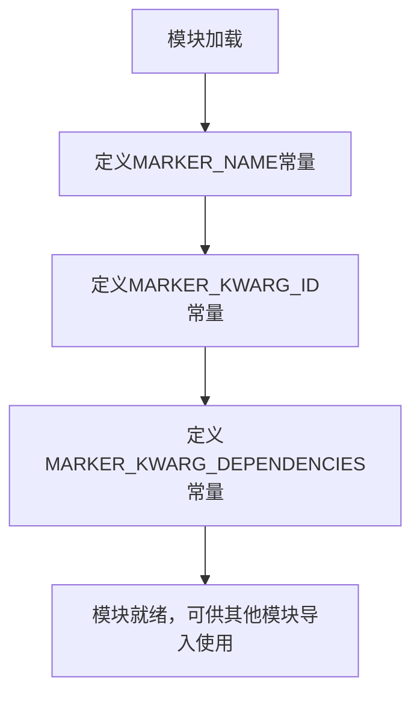

# `.\AutoGPT\classic\benchmark\agbenchmark\utils\dependencies\constants.py` 详细设计文档

该模块定义了pytest标记（marker）的常量，用于指定测试之间的依赖关系，包含标记名称和相关的关键字参数名称。

## 整体流程



## 类结构

```
无类层次结构（纯常量模块）
```

## 全局变量及字段


### `MARKER_NAME`
    
用于标识depends标记的常量值，定义了该标记的名称

类型：`str`
    


### `MARKER_KWARG_ID`
    
depends标记中用于指定自定义测试名称的关键字参数名

类型：`str`
    


### `MARKER_KWARG_DEPENDENCIES`
    
depends标记中用于指定所依赖测试的关键字参数名

类型：`str`
    


    

## 全局函数及方法


## 关键组件


### MARKER_NAME

用于标识pytest中"depends"标记的常量，定义测试依赖系统的标记名称为"depends"

### MARKER_KWARG_ID

用于指定测试自定义名称的关键词参数常量，标记为"name"，允许为依赖测试指定自定义标识符

### MARKER_KWARG_DEPENDENCIES

用于指定被依赖测试的关键词参数常量，标记为"on"，用于声明当前测试所依赖的其他测试


## 问题及建议


### 已知问题

-   **缺少类型注解**：常量没有类型声明（通常为 `str` 类型），不利于静态分析和IDE自动补全
-   **文档信息不足**：模块级文档字符串仅有一句话，未说明这些常量的具体用途、使用场景和重要性
-   **缺乏枚举封装**：使用简单的字符串常量而非枚举类，无法获得类型检查和代码补全优势
-   **硬编码字符串无验证**：常量值直接硬编码，若存在拼写错误可能导致运行时难以追踪的问题
-   **无版本控制说明**：作为公共API的常量，缺乏版本稳定性标注和使用约束说明

### 优化建议

-   **添加类型注解**：为常量添加显式类型声明，如 `MARKER_NAME: str = "depends"`
-   **增强文档**：扩展模块docstring，说明这些常量在pytest标记系统中的作用和关联关系
-   **使用枚举类**：考虑使用 `Enum` 或 `StrEnum`（Python 3.11+）封装这些标记名称，提供更好的类型安全和代码提示
-   **集中常量管理**：可考虑将这些常量移入专门的配置类或常量模块，统一管理所有标记相关配置
-   **添加常量验证**：考虑添加简单的运行时验证，确保常量值符合预期的命名规范或格式要求

## 其它


### 设计目标与约束

本模块定义了pytest测试框架中依赖标记（depends marker）所需的核心常量，用于支持测试用例间的依赖关系管理。设计目标包括：1）提供清晰的常量命名规范，便于其他模块引用；2）保持常量定义的独立性和可维护性；3）确保常量名称与pytest插件接口规范一致。约束条件包括：仅定义字符串常量，不包含任何业务逻辑；常量值必须与pytest marker系统兼容；模块不应引入任何外部依赖。

### 模块接口与导出

本模块采用显式导出方式，通过公开的常量接口供外部模块使用。主要导出的接口包括：MARKER_NAME（标记名称）、MARKER_KWARG_ID（自定义名称参数）、MARKER_KWARG_DEPENDENCIES（依赖项参数）。所有常量均为字符串类型，可直接在其他模块中导入使用，导入语句为：`from module_name import MARKER_NAME, MARKER_KWARG_ID, MARKER_KWARG_DEPENDENCIES`。

### 外部依赖与接口契约

本模块无外部依赖，仅使用Python内置类型（字符串）。接口契约如下：MARKER_NAME必须为有效的pytest marker名称字符串；MARKER_KWARG_ID和MARKER_KWARG_DEPENDS必须为符合Python标识符规则的字符串，用于kwargs键名；所有常量值一旦定义不应随意更改，以保证向后兼容性。

### 使用示例与典型场景

典型使用场景是在pytest配置中定义depends marker，示例代码如下：`pytest.mark.depends(name="test_A", on=["test_base"])`。其中name参数对应MARKER_KWARG_ID的值"name"，on参数对应MARKER_KWARG_DEPENDENCIES的值"on"，marker名称为MARKER_NAME的值"depends"。开发者在定义或解析这类marker时应引用本模块定义的常量，避免硬编码字符串。

### 配置信息与扩展性

本模块采用集中式常量管理，便于未来扩展。例如，若需要支持更多marker参数，只需在本模块中添加新的常量定义。建议通过配置文件或环境变量动态调整常量值，以适应不同测试环境的需求。扩展时应保持常量命名的一致性，并更新相关文档。

### 版本兼容性说明

本模块适用于Python 3.6及以上版本，与pytest 7.0及以上版本兼容。由于仅使用标准Python语法和类型，无版本特定实现，因此具有较好的跨版本兼容性。后续版本升级时应验证常量值与pytest新版本的兼容性。


    