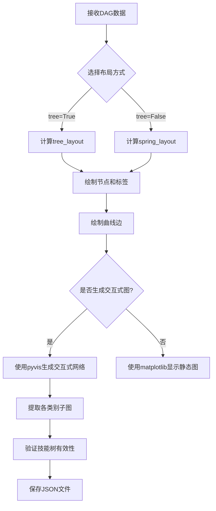
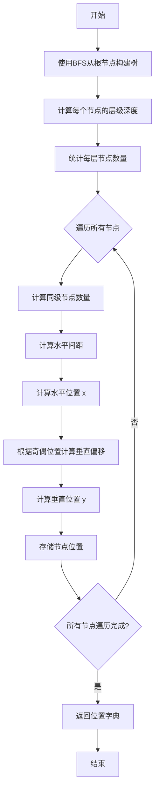
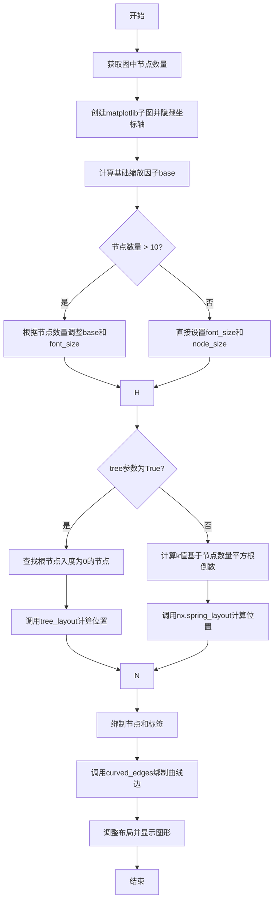
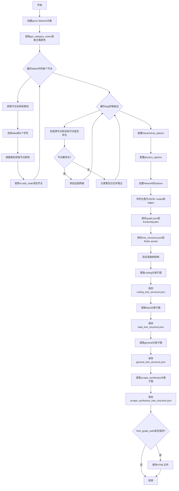
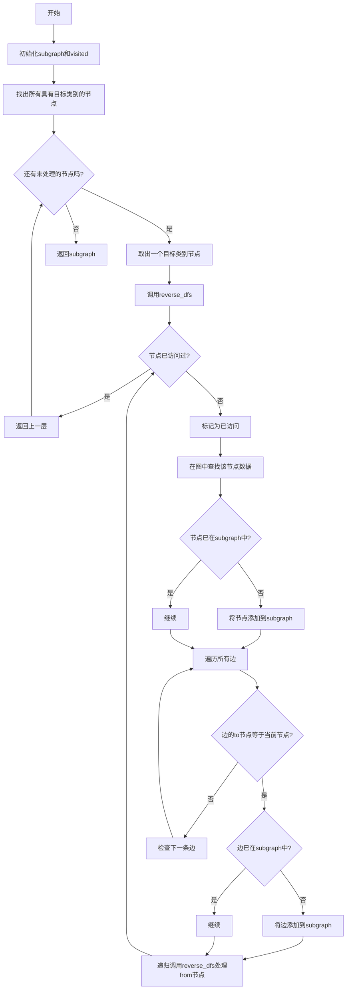
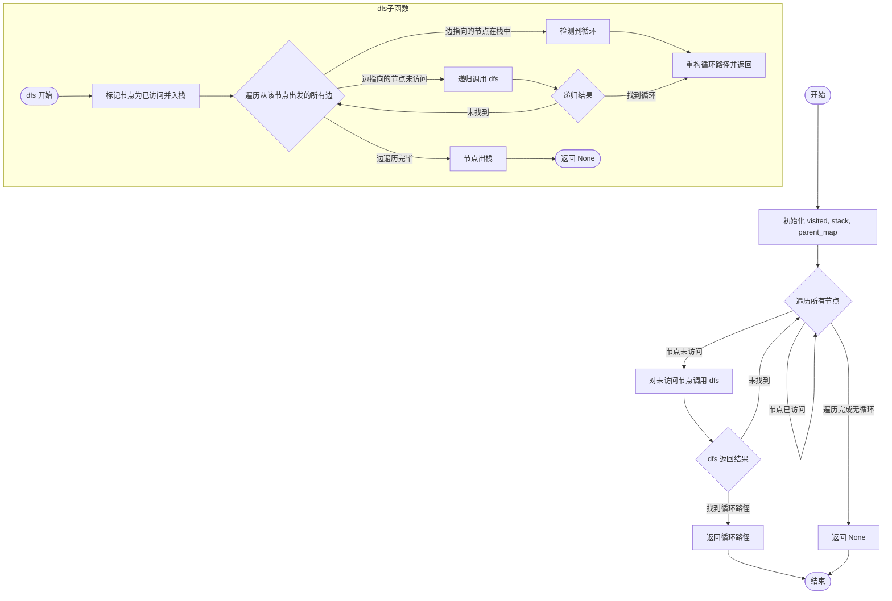
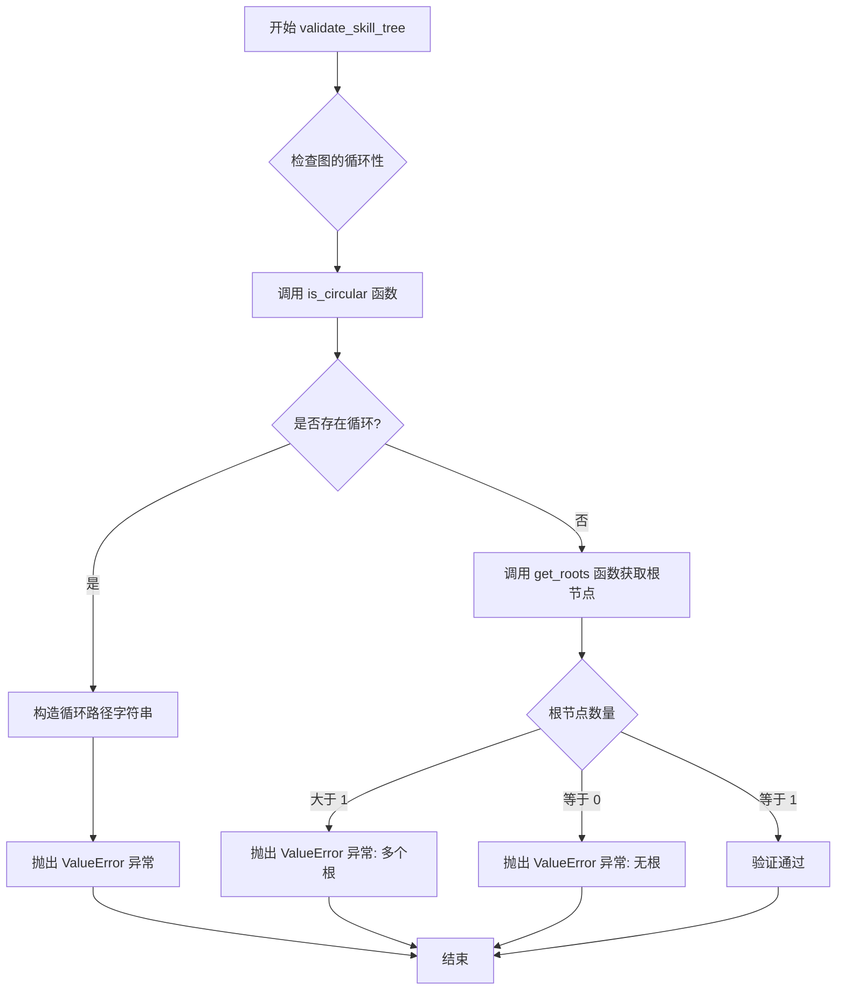
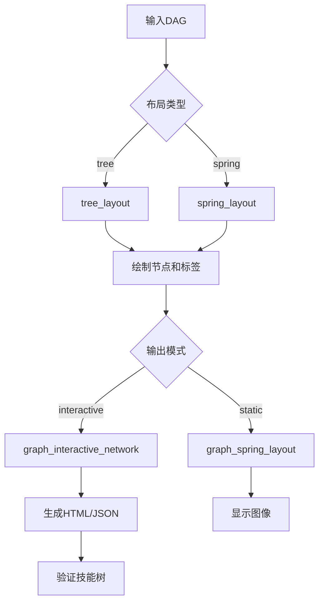

# `.\AutoGPT\classic\benchmark\agbenchmark\utils\dependencies\graphs.py` 详细设计文档

该代码是一个技能树可视化工具，主要功能是将有向无环图（DAG）渲染为树形结构的可视化图形，支持静态图像和交互式HTML网络图，并提供按类别提取子图、验证技能树有效性（检测循环和根节点）的功能。

## 整体流程



## 类结构

```
无类定义
所有函数均为模块级函数
全局变量: logger, DATA_CATEGORY
```

## 全局变量及字段


### `logger`
    
A logger instance for the current module, used for logging debug and warning messages throughout the graph visualization and validation functions.

类型：`logging.Logger`
    


### `DATA_CATEGORY`
    
A dictionary containing category data for test generation, used to categorize nodes by skills (e.g., coding, data, general) in the skill tree visualization.

类型：`Dict`
    


    

## 全局函数及方法


### `bezier_curve`

生成二次贝塞尔曲线（Quadratic Bézier Curve）上的点序列，用于绘制节点之间的曲线连接。

参数：

- `src`：`np.ndarray`，源点坐标
- `ctrl`：`List[float]`，控制点坐标，用于确定曲线的弯曲程度
- `dst`：`np.ndarray`，目标点坐标

返回值：`List[np.ndarray]`，包含曲线上100个等间距点的坐标列表

#### 流程图

```mermaid
flowchart TD
    A[开始] --> B[初始化空列表 curve]
    B --> C[设置参数 t 从 0 到 1 均匀分布的100个点]
    C --> D{遍历每个 t 值}
    D -->|当前 t| E[计算曲线点:<br/>curve_point = (1-t)²×src + 2(1-t)t×ctrl + t²×dst]
    E --> F[将计算结果添加到 curve 列表]
    F --> D
    D --> G[返回 curve 列表]
    G --> H[结束]
```

#### 带注释源码

```python
def bezier_curve(
    src: np.ndarray, ctrl: List[float], dst: np.ndarray
) -> List[np.ndarray]:
    """
    Generate Bézier curve points.
    生成二次贝塞尔曲线的点序列

    Args:
    - src (np.ndarray): The source point.
      源点坐标
    - ctrl (List[float]): The control point.
      控制点坐标，用于控制曲线弯曲程度
    - dst (np.ndarray): The destination point.
      目标点坐标

    Returns:
    - List[np.ndarray]: The Bézier curve points.
      贝塞尔曲线上的点序列
    """
    # 初始化存储曲线点的空列表
    curve = []
    
    # 使用 numpy 的 linspace 生成从 0 到 1 的 100 个等间距参数 t
    for t in np.linspace(0, 1, num=100):
        # 二次贝塞尔曲线公式: B(t) = (1-t)²P₀ + 2(1-t)tP₁ + t²P₂
        # 其中 P₀=src, P₁=ctrl, P₂=dst
        curve_point = (
            # (1-t)² * src 项
            np.outer((1 - t) ** 2, src)
            # 2(1-t)t * ctrl 项
            + 2 * np.outer((1 - t) * t, ctrl)
            # t² * dst 项
            + np.outer(t**2, dst)
        )
        # 只取第一行（因为外积结果可能包含多余维度）
        curve.append(curve_point[0])
    
    # 返回包含100个曲线点的列表
    return curve
```


### `curved_edges`

该函数用于在图可视化中绘制边的曲线或直线，具体根据节点是否在同一层级来决定：若节点在同一层级（y坐标差小于0.01），则使用贝塞尔曲线绘制弧形边；否则使用直线箭头连接。

参数：

- `G`：`nx.Graph`，图对象，包含要绘制的边
- `pos`：`Dict[Any, Tuple[float, float]]`，字典，键为节点，值为节点的(x, y)坐标位置
- `dist`：`float`，可选，曲率距离，默认值为0.2，用于控制贝塞尔曲线的弯曲程度

返回值：`None`，该函数直接在matplotlib轴上绘制图形，不返回任何值

#### 流程图

```mermaid
flowchart TD
    A[开始] --> B[获取当前Axes: ax = plt.gca]
    B --> C[遍历图G的所有边: for u, v, data in G.edges]
    C --> D[获取边的端点坐标: _src = pos[u], _dst = pos[v]]
    D --> E[转换为numpy数组: src = np.array(_src), dst = np.array(_dst)]
    E --> F{判断是否同层级: abs(src[1] - dst[1]) < 0.01}
    F -->|是| G[计算控制点: control = [(src[0]+dst[0])/2, src[1]+dist]]
    G --> H[调用bezier_curve生成曲线点]
    H --> I[创建FancyArrowPatch箭头对象]
    I --> J[将箭头添加到轴: ax.add_patch]
    J --> C
    F -->|否| K[使用annotate绘制直线箭头]
    K --> C
    C -->|遍历完成| L[结束]
```

#### 带注释源码

```
def curved_edges(
    G: nx.Graph, pos: Dict[Any, Tuple[float, float]], dist: float = 0.2
) -> None:
    """
    Draw curved edges for nodes on the same level.

    Args:
    - G (Any): The graph object.
    - pos (Dict[Any, Tuple[float, float]]): Dictionary with node positions.
    - dist (float, optional): Distance for curvature. Defaults to 0.2.

    Returns:
    - None
    """
    # 获取当前matplotlib的Axes对象，后续的图形元素将添加到这个axes上
    ax = plt.gca()
    
    # 遍历图中的所有边，u为源节点，v为目标节点，data为边的属性数据
    for u, v, data in G.edges(data=True):
        # 从位置字典中获取源节点和目标节点的坐标
        _src = pos[u]
        _dst = pos[v]
        
        # 将坐标转换为numpy数组以便进行数值计算
        src = np.array(_src)
        dst = np.array(_dst)

        # 判断源节点和目标节点是否在同一层级（y坐标差小于0.01视为同一层级）
        same_level = abs(src[1] - dst[1]) < 0.01

        # 根据节点是否在同一层级采用不同的绘制方式
        if same_level:
            # 同一层级：使用贝塞尔曲线绘制弯曲的边
            # 计算控制点，x坐标为两端点中点，y坐标加上dist作为向上弯曲的偏移
            control = [(src[0] + dst[0]) / 2, src[1] + dist]
            
            # 调用bezier_curve函数生成贝塞尔曲线的所有点
            curve = bezier_curve(src, control, dst)
            
            # 创建 FancyArrowPatch 对象来绘制曲线箭头
            arrow = patches.FancyArrowPatch(
                posA=curve[0],  # 曲线的起点
                posB=curve[-1],  # 曲线的终点
                connectionstyle="arc3,rad=0.2",  # 弧形连接样式，rad控制曲率
                color="gray",  # 箭头颜色为灰色
                arrowstyle="-|>",  # 箭头样式：带线条的箭头
                mutation_scale=15.0,  # 箭头突变比例
                lw=1,  # 线宽
                shrinkA=10,  # 起点收缩距离
                shrinkB=10,  # 终点收缩距离
            )
            # 将箭头图形添加到axes中
            ax.add_patch(arrow)
        else:
            # 不同层级：使用annotate绘制直线箭头
            ax.annotate(
                "",
                xy=_dst,  # 箭头指向目标节点
                xytext=_src,  # 箭头起点
                arrowprops=dict(
                    arrowstyle="-|>",  # 箭头样式
                    color="gray",  # 颜色
                    lw=1,  # 线宽
                    shrinkA=10,  # 起点收缩
                    shrinkB=10,  # 终点收缩
                ),
            )
```


### `tree_layout`

该函数用于计算有向无环图（DAG）的树形布局，以根节点为中心，通过广度优先搜索（BFS）确定节点层级，并根据层级内节点的奇偶位置进行交替垂直偏移，从而实现美观的树形可视化布局。

参数：

- `graph`：`nx.DiGraph`，输入的有向无环图（DAG）
- `root_node`：`Any`，树的根节点

返回值：`Dict[Any, Tuple[float, float]]`，返回节点ID到坐标(x, y)的映射字典，其中x为水平位置，y为垂直位置

#### 流程图



#### 带注释源码

```python
def tree_layout(graph: nx.DiGraph, root_node: Any) -> Dict[Any, Tuple[float, float]]:
    """Compute positions as a tree layout centered on the root
    with alternating vertical shifts."""
    
    # 第一步：使用NetworkX的bfs_tree函数从根节点构建广度优先生成树
    bfs_tree = nx.bfs_tree(graph, source=root_node)
    
    # 第二步：计算每个节点到根节点的深度（层级）
    # single_source_shortest_path_length返回节点到源节点的最短路径长度
    levels = {
        node: depth
        for node, depth in nx.single_source_shortest_path_length(
            bfs_tree, root_node
        ).items()
    }

    # 初始化位置字典和层级计数器
    pos = {}
    max_depth = max(levels.values())
    # 创建层级位置计数器，用于追踪当前层级已放置的节点数
    level_positions = {i: 0 for i in range(max_depth + 1)}  # type: ignore

    # 第三步：统计每层节点数量，用于计算水平间距
    level_count: Any = {}
    for node, level in levels.items():
        level_count[level] = level_count.get(level, 0) + 1

    # 垂直偏移量，用于在同一层级内交替上下偏移节点
    vertical_offset = (
        0.07  # The amount of vertical shift per node within the same level
    )

    # 第四步：为每个节点分配位置
    # 按层级排序，确保从根节点开始依次处理
    for node, level in sorted(levels.items(), key=lambda x: x[1]):
        # 获取当前层级的总节点数
        total_nodes_in_level = level_count[level]
        # 计算水平间距：1.0除以(节点数+1)确保节点分布在0到1之间
        horizontal_spacing = 1.0 / (total_nodes_in_level + 1)
        
        # 计算水平位置x：
        # 0.5是中心点，(total_nodes_in_level - 1) * horizontal_spacing / 2 
        # 用于将节点居中分布
        # level_positions[level] * horizontal_spacing 
        # 是当前节点在当前层级中的偏移
        pos_x = (
            0.5
            - (total_nodes_in_level - 1) * horizontal_spacing / 2
            + level_positions[level] * horizontal_spacing
        )

        # 计算垂直位置y：
        # -level：层级越深，y值越负（向下排列）
        # 后面两项实现交替上下偏移：
        # - 偶数位置节点向上偏移
        # - 奇数位置节点向下偏移
        # 交替偏移可以减少同级节点之间的重叠
        pos_y = (
            -level
            + (level_positions[level] % 2) * vertical_offset
            - ((level_positions[level] + 1) % 2) * vertical_offset
        )
        
        # 存储节点位置
        pos[node] = (pos_x, pos_y)

        # 当前层级节点计数加1
        level_positions[level] += 1

    # 返回完整的位置映射字典
    return pos
```


### `graph_spring_layout`

该函数用于将有向无环图（DAG）可视化，通过树形布局或弹簧布局算法计算节点位置，并使用matplotlib绑制节点、标签和曲线边，最终展示图形。

参数：

- `dag`：`nx.DiGraph`，输入的有向无环图，需要可视化的图结构
- `labels`：`Dict[Any, str]`字典，节点标签映射，键为节点ID，值为显示的标签文本
- `tree`：`bool`，可选参数，默认为True，控制布局算法选择，True使用树形布局，False使用弹簧布局

返回值：`None`，该函数直接在屏幕上显示图形，无返回值

#### 流程图



#### 带注释源码

```python
def graph_spring_layout(
    dag: nx.DiGraph, labels: Dict[Any, str], tree: bool = True
) -> None:
    """
    可视化有向无环图，支持树形或弹簧布局
    
    Args:
        dag: 有向无环图对象
        labels: 节点ID到标签文本的映射字典
        tree: 是否使用树形布局，默认为True
    
    Returns:
        None
    """
    # 获取图中节点的数量
    num_nodes = len(list(dag.nodes()))
    
    # Setting up the figure and axis
    # 创建matplotlib子图和坐标轴
    fig, ax = plt.subplots()
    ax.axis("off")  # Turn off the axis 隐藏坐标轴显示
    
    # 设置基础缩放因子
    base = 3.0

    # 如果节点数量超过10个，根据节点数量调整参数
    if num_nodes > 10:
        base /= 1 + math.log(num_nodes)
        font_size = base * 10

    # 计算字体大小和节点大小，确保最小值为10和300
    font_size = max(10, base * 10)
    node_size = max(300, base * 1000)

    # 根据tree参数选择布局算法
    if tree:
        # 树形布局：找到入度为0的根节点
        root_node = [node for node, degree in dag.in_degree() if degree == 0][0]
        # 使用tree_layout计算节点位置
        pos = tree_layout(dag, root_node)
    else:
        # Adjust k for the spring layout based on node count
        # 弹簧布局：根据节点数量调整k值，使布局更均匀
        k_value = 3 / math.sqrt(num_nodes)
        
        # 使用NetworkX的弹簧布局算法
        pos = nx.spring_layout(dag, k=k_value, iterations=50)

    # Draw nodes and labels
    # 绘制所有节点，天蓝色，指定大小
    nx.draw_networkx_nodes(dag, pos, node_color="skyblue", node_size=int(node_size))
    # 绘制节点标签，指定字体大小
    nx.draw_networkx_labels(dag, pos, labels=labels, font_size=int(font_size))

    # Draw curved edges
    # 绘制曲线边，处理同层级节点的弧线显示
    curved_edges(dag, pos)  # type: ignore

    # 调整子图布局以适应内容
    plt.tight_layout()
    # 显示图形
    plt.show()
```


### `rgb_to_hex`

该函数用于将 RGB 颜色值（浮点数元组，范围 0-1）转换为十六进制颜色字符串格式（如 "#ff0000"），常用于数据可视化中为图表节点分配颜色。

参数：

- `rgb`：`Tuple[float, float, float]`，RGB 颜色值，每个分量为 0 到 1 之间的浮点数

返回值：`str`，十六进制颜色字符串，格式为 "#RRGGBB"

#### 流程图

```mermaid
flowchart TD
    A[开始] --> B[接收 rgb 元组]
    B --> C[将 rgb[0] 乘以 255 并转为整数]
    C --> D[将 rgb[1] 乘以 255 并转为整数]
    D --> E[将 rgb[2] 乘以 255 并转为整数]
    E --> F[格式化为十六进制字符串]
    F --> G[返回结果]
    G --> H[结束]
```

#### 带注释源码

```python
def rgb_to_hex(rgb: Tuple[float, float, float]) -> str:
    """
    将 RGB 颜色值转换为十六进制颜色字符串。
    
    Args:
        rgb: RGB 颜色元组，每个分量是 0 到 1 之间的浮点数
        
    Returns:
        十六进制颜色字符串，格式为 "#RRGGBB"
    """
    # 使用 format 方法将每个颜色分量转换为两位十六进制数
    # 将浮点数 (0-1 范围) 转换为整数 (0-255 范围)
    # {:02x} 格式 specifier 确保输出两位十六进制，不足则补零
    return "#{:02x}{:02x}{:02x}".format(
        int(rgb[0] * 255),  # 红色分量: 0-255
        int(rgb[1] * 255),  # 绿色分量: 0-255
        int(rgb[2] * 255)   # 蓝色分量: 0-255
    )
```


### `get_category_colors`

该函数接收一个类别字典，将所有唯一的类别值映射到对应的十六进制颜色代码，利用 matplotlib 的 tab10 调色板生成颜色。

参数：

- `categories`：`Dict[Any, str]`，键为任意类型、值为类别名称的字典，用于提取唯一类别

返回值：`Dict[str, str]`，类别名称到十六进制颜色代码的映射字典

#### 流程图

```mermaid
flowchart TD
    A[开始: 传入 categories 字典] --> B[提取唯一类别: set(categories.values())]
    B --> C[获取 tab10 调色板: plt.cm.get_cmap]
    C --> D[初始化空结果字典]
    D --> E{遍历唯一类别}
    E -->|对于每个类别 i| F[从调色板获取 RGB 颜色: colormap(i)]
    F --> G[取前3个值作为 RGB: [:3]]
    G --> H[转换为十六进制: rgb_to_hex]
    H --> I[添加到结果字典]
    I --> E
    E --> J[返回结果字典]
```

#### 带注释源码

```python
def get_category_colors(categories: Dict[Any, str]) -> Dict[str, str]:
    """
    根据类别生成对应的颜色映射。

    Args:
        categories (Dict[Any, str]): 包含类别信息的字典，值为类别名称

    Returns:
        Dict[str, str]: 类别名称到十六进制颜色代码的映射字典
    """
    # 从传入的字典中提取所有唯一的类别值
    unique_categories = set(categories.values())
    
    # 使用 matplotlib 的 tab10 调色板，根据唯一类别数量创建颜色映射
    colormap = plt.cm.get_cmap("tab10", len(unique_categories))  # type: ignore
    
    # 遍历唯一类别，为每个类别分配一个颜色
    return {
        category: rgb_to_hex(colormap(i)[:3])  # 将 RGB 转换为十六进制
        for i, category in enumerate(unique_categories)
    }
```


### `graph_interactive_network`

该函数创建交互式的有向无环图（DAG）可视化，使用pyvis库生成HTML格式的网络图形，并将图形数据保存为多个JSON文件，分别用于前端Flutter应用的不同技能树分类展示。

参数：

- `dag`：`nx.DiGraph`，输入的有向无环图，包含节点和边关系
- `labels`：`Dict[Any, Dict[str, Any]]`，节点的标签数据字典，每个节点包含名称、类别等信息
- `html_graph_path`：`str`，可选参数，指定HTML输出文件的路径，默认为空字符串

返回值：`None`，该函数不返回任何值，仅执行副作用操作（文件写入和图形显示）

#### 流程图



#### 带注释源码

```python
def graph_interactive_network(
    dag: nx.DiGraph,
    labels: Dict[Any, Dict[str, Any]],
    html_graph_path: str = "",
) -> None:
    """
    创建交互式网络可视化并保存为多种格式。
    
    Args:
        dag: NetworkX的有向无环图对象
        labels: 节点标签字典，键为节点对象，值为包含name和category等信息的字典
        html_graph_path: 可选的HTML输出路径
    
    Returns:
        None
    """
    # 初始化pyvis网络对象，notebook=True启用Jupyter notebook支持
    nt = Network(notebook=True, width="100%", height="800px", directed=True)

    # 获取分类颜色映射表
    category_colors = get_category_colors(DATA_CATEGORY)

    # 遍历所有节点，添加节点和属性到pyvis网络
    for node, json_data in labels.items():
        # 从json_data中获取节点名称
        label = json_data.get("name", "")
        # 移除label的前4个字符（可能是'test'前缀）
        label_without_test = label[4:]
        # 获取节点的唯一标识符字符串
        node_id_str = node.nodeid

        # 根据label获取节点所属分类，默认未知分类
        category = DATA_CATEGORY.get(
            label, "unknown"
        )

        # 根据分类获取对应的颜色
        color = category_colors.get(category, "grey")

        # 添加节点到pyvis网络，包含id、label、颜色和完整数据
        nt.add_node(
            node_id_str,
            label=label_without_test,
            color=color,
            data=json_data,
        )

    # 遍历DAG中的所有边，添加边到pyvis网络
    for edge in dag.edges():
        # 获取源节点和目标节点的ID字符串
        source_id_str = edge[0].nodeid
        target_id_str = edge[1].nodeid
        # 构建唯一的边ID
        edge_id_str = (
            f"{source_id_str}_to_{target_id_str}"
        )
        # 检查源节点和目标节点是否都存在于网络中
        if not (source_id_str in nt.get_nodes() and target_id_str in nt.get_nodes()):
            # 记录警告日志并跳过该边
            logger.warning(
                f"Skipping edge {source_id_str} -> {target_id_str} due to missing nodes"
            )
            continue
        # 添加边到网络
        nt.add_edge(source_id_str, target_id_str, id=edge_id_str)

    # 配置层级布局选项
    hierarchical_options = {
        "enabled": True,
        "levelSeparation": 200,  # 增加层级间的垂直间距
        "nodeSpacing": 250,      # 增加同一层级节点的间距
        "treeSpacing": 250,      # 增加不同树的间距
        "blockShifting": True,
        "edgeMinimization": True,
        "parentCentralization": True,
        "direction": "UD",        # 方向：从上到下
        "sortMethod": "directed",
    }

    # 配置物理引擎选项
    physics_options = {
        "stabilization": {
            "enabled": True,
            "iterations": 1000,
        },
        "hierarchicalRepulsion": {
            "centralGravity": 0.0,
            "springLength": 200,   # 增加边的长度
            "springConstant": 0.01,
            "nodeDistance": 250,   # 增加节点间最小距离
            "damping": 0.09,
        },
        "solver": "hierarchicalRepulsion",
        "timestep": 0.5,
    }

    # 设置网络节点的全局选项
    nt.options = {
        "nodes": {
            "font": {
                "size": 20,        # 增加字体大小
                "color": "black",
            },
            "shapeProperties": {"useBorderWithImage": True},
        },
        "edges": {
            "length": 250,        # 增加边的长度
        },
        "physics": physics_options,
        "layout": {"hierarchical": hierarchical_options},
    }

    # 将图形序列化为JSON格式
    graph_data = {"nodes": nt.nodes, "edges": nt.edges}
    logger.debug(f"Generated graph data:\n{json.dumps(graph_data, indent=4)}")

    # 获取当前工作目录作为基准路径
    home_path = Path.cwd()
    # 保存完整图形数据到frontend/public/graph.json
    write_pretty_json(graph_data, home_path / "frontend" / "public" / "graph.json")

    # 获取Flutter应用的assets目录路径
    flutter_app_path = home_path.parent / "frontend" / "assets"

    # 保存完整树结构到Flutter assets目录
    write_pretty_json(graph_data, flutter_app_path / "tree_structure.json")
    # 验证技能树的有效性
    validate_skill_tree(graph_data, "")

    # 提取并保存coding分类的子图
    coding_tree = extract_subgraph_based_on_category(graph_data.copy(), "coding")
    validate_skill_tree(coding_tree, "coding")
    write_pretty_json(
        coding_tree,
        flutter_app_path / "coding_tree_structure.json",
    )

    # 提取并保存data分类的子图
    data_tree = extract_subgraph_based_on_category(graph_data.copy(), "data")
    # validate_skill_tree(data_tree, "data")  # 已注释，不验证
    write_pretty_json(
        data_tree,
        flutter_app_path / "data_tree_structure.json",
    )

    # 提取并保存general分类的子图
    general_tree = extract_subgraph_based_on_category(graph_data.copy(), "general")
    validate_skill_tree(general_tree, "general")
    write_pretty_json(
        general_tree,
        flutter_app_path / "general_tree_structure.json",
    )

    # 提取并保存scrape_synthesize分类的子图
    scrape_synthesize_tree = extract_subgraph_based_on_category(
        graph_data.copy(), "scrape_synthesize"
    )
    validate_skill_tree(scrape_synthesize_tree, "scrape_synthesize")
    write_pretty_json(
        scrape_synthesize_tree,
        flutter_app_path / "scrape_synthesize_tree_structure.json",
    )

    # 如果提供了HTML路径，则保存交互式HTML文件
    if html_graph_path:
        file_path = str(Path(html_graph_path).resolve())
        nt.write_html(file_path)
```


### `extract_subgraph_based_on_category`

该函数用于从原始图中提取一个子图，该子图包含所有具有指定类别的节点以及到达这些节点所需的所有节点和边。函数通过反向深度优先搜索（reverse DFS）从目标类别节点出发，逆向遍历图结构，收集所有必要的节点和边来构建子图。

参数：

- `graph`：`Dict`，原始图数据，包含"nodes"和"edges"两个键，其中nodes是节点列表，edges是边列表
- `category`：`str`，目标类别字符串，用于筛选具有该类别的节点

返回值：`Dict`，返回的子图，包含"nodes"和"edges"两个键，分别表示子图中的节点列表和边列表

#### 流程图



#### 带注释源码

```python
def extract_subgraph_based_on_category(graph, category):
    """
    Extracts a subgraph that includes all nodes and edges required to reach all nodes
    with a specified category.

    :param graph: The original graph.
    :param category: The target category.
    :return: Subgraph with nodes and edges required to reach the nodes
        with the given category.
    """

    # 初始化子图结构，包含空列表用于存储节点和边
    subgraph = {"nodes": [], "edges": []}
    # 使用集合记录已访问的节点，避免重复处理
    visited = set()

    def reverse_dfs(node_id):
        """
        递归的深度优先搜索函数，从指定节点反向遍历图
        （即沿着边的from方向遍历，实际上是找入边）
        
        :param node_id: 当前正在处理的节点ID
        """
        # 如果节点已经访问过，直接返回，避免循环
        if node_id in visited:
            return
        
        # 标记节点为已访问
        visited.add(node_id)

        # 在图的节点列表中查找当前节点的数据
        node_data = next(node for node in graph["nodes"] if node["id"] == node_id)

        # Add the node to the subgraph if it's not already present.
        # 如果节点数据不在子图中，则添加进去
        if node_data not in subgraph["nodes"]:
            subgraph["nodes"].append(node_data)

        # 遍历图中的所有边，找出指向当前节点的边（即入边）
        for edge in graph["edges"]:
            if edge["to"] == node_id:
                # 如果这条边不在子图中，则添加
                if edge not in subgraph["edges"]:
                    subgraph["edges"].append(edge)
                # 递归处理边的起始节点（from节点）
                reverse_dfs(edge["from"])

    # Identify nodes with the target category and initiate reverse DFS from them.
    # 从所有节点中筛选出包含目标类别的节点
    nodes_with_target_category = [
        node["id"] for node in graph["nodes"] if category in node["data"]["category"]
    ]

    # 对每个具有目标类别的节点启动反向深度优先搜索
    for node_id in nodes_with_target_category:
        reverse_dfs(node_id)

    # 返回构建完成的子图
    return subgraph
```


### `is_circular`

该函数通过深度优先搜索（DFS）算法检测有向图中是否存在循环（环），如果检测到循环，则返回循环路径；否则返回 None。

参数：

- `graph`：`Dict`，包含 "nodes" 和 "edges" 的图结构字典，其中 nodes 是节点列表，edges 是边列表

返回值：`List[str] | None`，如果存在循环则返回循环路径的节点 ID 列表，否则返回 None

#### 流程图



#### 带注释源码

```python
def is_circular(graph):
    """
    检测有向图中是否存在循环（环）。
    
    使用深度优先搜索（DFS）算法遍历图，检查是否存在从某节点出发又能回到该节点的路径。
    如果检测到循环，返回循环路径；否则返回 None。
    
    Args:
        graph: 包含 "nodes" 和 "edges" 的图结构字典
        
    Returns:
        循环路径的节点 ID 列表，如果无循环则返回 None
    """
    
    def dfs(node, visited, stack, parent_map):
        """
        深度优先搜索辅助函数，用于检测从指定节点开始的循环。
        
        Args:
            node: 当前正在访问的节点
            visited: 已完全访问过的节点集合
            stack: 当前递归调用栈中的节点集合，用于检测后向边
            parent_map: 记录节点的父节点，用于重构循环路径
            
        Returns:
            循环路径列表，如果未找到循环则返回 None
        """
        visited.add(node)       # 标记节点为已访问（正在访问）
        stack.add(node)         # 将节点加入当前调用栈
        
        # 遍历所有从当前节点出发的边
        for edge in graph["edges"]:
            if edge["from"] == node:
                # 如果边指向的节点在当前调用栈中，说明检测到循环
                if edge["to"] in stack:
                    # 检测到循环，重构循环路径
                    cycle_path = []
                    current = node
                    # 从当前节点回溯到循环起点
                    while current != edge["to"]:
                        cycle_path.append(current)
                        current = parent_map.get(current)
                    cycle_path.append(edge["to"])  # 添加循环终点
                    cycle_path.append(node)        # 添加起点形成闭环
                    return cycle_path[::-1]        # 返回反转后的路径
                # 如果边指向的节点未被访问，递归深入搜索
                elif edge["to"] not in visited:
                    parent_map[edge["to"]] = node  # 记录父节点关系
                    cycle_path = dfs(edge["to"], visited, stack, parent_map)
                    if cycle_path:
                        return cycle_path
        
        # 当前节点搜索完毕，从调用栈中移除
        stack.remove(node)
        return None

    # 初始化数据结构和遍历所有连通分量
    visited = set()      # 已访问节点集合
    stack = set()        # 当前 DFS 调用栈
    parent_map = {}      # 父子节点映射
    
    # 遍历图中的所有节点，确保处理非连通图
    for node in graph["nodes"]:
        node_id = node["id"]
        if node_id not in visited:
            cycle_path = dfs(node_id, visited, stack, parent_map)
            if cycle_path:
                return cycle_path  # 找到循环立即返回
    
    return None  # 遍历完所有节点未发现循环
```


### `get_roots`

该函数用于计算并返回有向无环图（DAG）的根节点。根节点被定义为没有任何入边的节点，即在图中作为起始点的节点。

参数：

- `graph`：`Dict`，包含 "nodes" 和 "edges" 键的图数据结构，其中 nodes 是节点列表，每个节点包含 id 信息；edges 是边列表，每条边包含 from 和 to 信息

返回值：`List`，返回图中所有根节点的 ID 列表

#### 流程图

```mermaid
flowchart TD
    A[开始 get_roots] --> B[从 graph['nodes'] 提取所有节点 ID 集合]
    C[从 graph['edges'] 提取所有有入边的节点 ID 集合]
    B --> D[计算差集: all_nodes - nodes_with_incoming_edges]
    C --> D
    D --> E[得到根节点集合]
    E --> F[将根节点集合转换为列表]
    F --> G[返回根节点列表]
```

#### 带注释源码

```python
def get_roots(graph):
    """
    Return the roots of a graph. Roots are nodes with no incoming edges.
    """
    # Create a set of all node IDs
    # 从图的节点列表中提取所有节点的 ID，创建一个集合
    all_nodes = {node["id"] for node in graph["nodes"]}

    # Create a set of nodes with incoming edges
    # 从图的边列表中提取所有有入边的目标节点 ID，创建一个集合
    nodes_with_incoming_edges = {edge["to"] for edge in graph["edges"]}

    # Roots are nodes that have no incoming edges
    # 根节点 = 所有节点 - 有入边的节点（即没有任何边指向它的节点）
    roots = all_nodes - nodes_with_incoming_edges

    # 返回根节点列表
    return list(roots)
```


### `validate_skill_tree`

验证给定的图是否代表有效的技能树，如果无效则抛出适当的异常。

参数：

- `graph`：`Dict`，表示包含 'nodes' 和 'edges' 的图字典
- `skill_tree_name`：`str`，技能树的名称

返回值：`None`，无返回值，通过抛出 ValueError 异常来指示验证失败

#### 流程图



#### 带注释源码

```python
def validate_skill_tree(graph, skill_tree_name):
    """
    Validate if a given graph represents a valid skill tree
    and raise appropriate exceptions if not.

    Args:
        graph: A dictionary representing the graph with 'nodes' and 'edges'.
               期望结构: {"nodes": [...], "edges": [...]}
        skill_tree_name: The name of the skill tree for error messages.

    Raises:
        ValueError: If the graph is not a valid skill tree:
                    - Contains circular dependencies
                    - Has multiple root nodes
                    - Has no root nodes
    """
    # 步骤1: 检查循环性 - 使用 is_circular 函数检测图中是否存在环
    # 技能树不能有循环依赖，否则会导致无限递归
    cycle_path = is_circular(graph)
    if cycle_path:
        # 将循环路径转换为可读字符串
        cycle_str = " -> ".join(cycle_path)
        # 抛出异常说明技能树是循环的，并显示检测到的循环路径
        raise ValueError(
            f"{skill_tree_name} skill tree is circular! "
            f"Detected circular path: {cycle_str}."
        )

    # 步骤2: 检查根节点 - 使用 get_roots 函数获取所有根节点
    # 有效的技能树应该有且仅有一个根节点
    roots = get_roots(graph)
    if len(roots) > 1:
        # 多个根节点表示技能树结构不清晰
        raise ValueError(f"{skill_tree_name} skill tree has multiple roots: {roots}.")
    elif not roots:
        # 没有根节点表示图不完整或为空
        raise ValueError(f"{skill_tree_name} skill tree has no roots.")
```

## 关键组件


### 贝塞尔曲线生成 (bezier_curve)

使用二次贝塞尔曲线公式生成从源点到目标点的平滑曲线路径，支持自定义控制点位置，返回曲线路径点列表。

### 曲线边绘制 (curved_edges)

在同层级的节点之间绘制带箭头的曲线边，异层级节点使用直线箭头连接，支持自定义曲率参数。

### 树形布局计算 (tree_layout)

计算有向无环图的树形布局位置，采用BFS分层策略，水平方向均匀分布节点，垂直方向交替上下偏移避免节点重叠。

### 弹簧布局图形绘制 (graph_spring_layout)

根据节点数量动态调整图形参数，支持树形布局和弹簧布局两种模式，使用matplotlib绑制静态可视图。

### 交互式网络图生成 (graph_interactive_network)

使用pyvis生成支持缩放拖拽的交互式有向图，支持层级布局物理模拟，按技能类别着色节点，导出JSON供前端和Flutter使用，附带子图提取与技能树验证。

### 类别子图提取 (extract_subgraph_based_on_category)

基于指定技能类别反向遍历图，提取到达目标类别节点所需的全部前驱节点和边，构成连通子图。

### 循环检测 (is_circular)

使用深度优先搜索检测有向图中是否存在环，返回循环路径节点列表，否则返回None。

### 根节点获取 (get_roots)

计算图中没有入边的节点集合，作为技能树的根节点返回。

### 技能树验证 (validate_skill_tree)

验证技能树的有效性：检测循环路径、检查根节点数量（必须唯一），不满足条件时抛出ValueError异常。

### 颜色映射 (rgb_to_hex, get_category_colors)

将RGB浮点元组转换为十六进制颜色码，根据唯一类别数量使用tab10配色方案生成类别到颜色的映射。

## 问题及建议


### 已知问题

-   **硬编码路径问题**：代码中多处硬编码了文件路径（如 `home_path / "frontend" / "public" / "graph.json"` 和 `flutter_app_path / "assets"`），代码中已有 FIXME 注释承认"此方法不可靠，仅在从仓库根目录运行时有效"
-   **缺少目录创建逻辑**：写入文件前未检查目标目录是否存在，若父目录不存在会导致 `FileNotFoundError`
-   **异常处理不足**：`extract_subgraph_based_on_category` 中使用 `next(node for node in graph["nodes"] if node["id"] == node_id)` 若找不到节点会抛出 `StopIteration` 异常
-   **无返回值函数**：`validate_skill_tree` 函数执行验证但无返回值，调用后无法获取验证结果
-   **类型注解不完整**：多处使用 `Any` 类型（如 `G: Any`, `level_count: Any`），降低了类型安全性和代码可读性
-   **魔法数字和硬编码值**：存在大量硬编码数值（如 `0.07`, `10`, `250`, `1000`）缺乏常量定义
-   **全局状态依赖**：`graph_interactive_network` 依赖外部导入的全局变量 `DATA_CATEGORY`，未作为参数传入，耦合度高且难以测试
-   **函数副作用**：`curved_edges` 函数通过修改全局 matplotlib 状态绘图而非返回可渲染对象，函数声明返回 `None` 但实际绘图
-   **字符串截取逻辑脆弱**：`label[4:]` 假设标签前4个字符总是需要移除，缺乏对输入格式的校验
-   **重复代码**：`graph_interactive_network` 中多次调用 `extract_subgraph_based_on_category` 和 `write_pretty_json`，存在重复逻辑

### 优化建议

-   将硬编码路径改为配置参数或环境变量，添加目录存在性检查和自动创建逻辑
-   为 `extract_subgraph_based_on_category` 中的节点查找添加异常处理，使用默认值或显式错误提示
-   修改 `validate_skill_tree` 返回布尔值或验证结果对象，便于调用方判断验证状态
-   完善类型注解，定义 `Graph`, `Node`, `Edge` 等自定义类型替代 `Any`
-   将魔法数字提取为模块级常量或配置类，增加可维护性
-   将 `DATA_CATEGORY` 作为参数传入函数，降低模块间耦合
-   考虑重构 `curved_edges` 为纯函数或返回绘图指令，或使用面向对象方式封装绘图逻辑
-   验证输入标签格式，或在移除前缀前添加长度检查防止索引越界
-   抽取重复的子图提取和写入逻辑为通用函数，减少代码重复

## 其它


### 设计目标与约束

本代码的核心设计目标是实现技能树（Skill Tree）的可视化功能，支持静态和交互式两种展示模式。具体约束包括：
1. 仅支持有向无环图（DAG）结构的技能树
2. 依赖外部库：networkx（图结构）、pyvis（交互式可视化）、matplotlib（静态绘图）
3. 输出格式：静态图像（PNG/SVG）和交互式HTML
4. 性能约束：节点数量超过10时调整布局参数以保证可读性
5. 类别支持：从DATA_CATEGORY获取节点分类信息，支持coding、data、general、scrape_synthesize四类

### 错误处理与异常设计

1. **图验证（validate_skill_tree函数）**：
   - 检测循环依赖：使用深度优先搜索算法检测环的存在，若存在则抛出ValueError
   - 多根检测：确保技能树有且仅有一个根节点，否则抛出ValueError
   - 无根检测：至少需要一个根节点

2. **边验证（graph_interactive_network函数）**：
   - 跳过不存在的节点之间的边，使用logger.warning记录警告

3. **异常处理原则**：
   - 运行时异常主要由外部依赖（matplotlib、pyvis）抛出
   - 业务逻辑异常通过ValueError明确描述错误原因
   - 使用Python内置logging模块记录非致命错误

### 数据流与状态机

**数据输入流**：
1. 输入：DAG（有向无环图）、节点标签字典、DATA_CATEGORY映射
2. 处理流程：布局计算 → 节点渲染 → 边渲染 → 输出

**主要状态转换**：
1. **graph_interactive_network函数状态流**：
   - 初始化Network对象 → 获取类别颜色 → 添加节点 → 添加边 → 配置物理引擎 → 导出JSON → 生成HTML
   
2. **extract_subgraph_based_on_category函数状态流**：
   - 接收完整图和目标类别 → 识别目标类别节点 → 逆向DFS遍历 → 构建子图

3. **validate_skill_tree函数状态流**：
   - 检查循环 → 检查根节点数量 → 验证通过/抛出异常

**Mermaid流程图**：


### 外部依赖与接口契约

**外部依赖**：
1. **networkx**：图结构操作，版本≥2.0
2. **pyvis**：交互式网络可视化，版本≥0.1.0
3. **matplotlib**：静态绘图，版本≥3.0
4. **numpy**：数值计算，用于贝塞尔曲线计算
5. **json**：Python标准库，用于序列化图数据
6. **pathlib**：Python标准库，路径操作

**接口契约**：
1. **graph_interactive_network函数**：
   - 输入参数：dag (nx.DiGraph), labels (Dict[Any, Dict[str, Any]]), html_graph_path (str, 可选)
   - 输出：生成graph.json、tree_structure.json及各类别子树JSON文件，可选生成HTML
   - 副作用：写入文件系统（frontend/public和frontend/assets目录）

2. **validate_skill_tree函数**：
   - 输入参数：graph (dict), skill_tree_name (str)
   - 输出：无返回值，验证失败抛出ValueError
   - 不产生副作用

3. **extract_subgraph_based_on_category函数**：
   - 输入参数：graph (dict), category (str)
   - 输出：子图字典，包含nodes和edges列表
   - 不产生副作用

4. **tree_layout函数**：
   - 输入参数：graph (nx.DiGraph), root_node (Any)
   - 输出：节点位置字典Dict[Any, Tuple[float, float]]
   - 不产生副作用

### 性能考虑

1. **布局算法复杂度**：
   - tree_layout：O(V+E)，使用BFS遍历
   - spring_layout：由networkx实现，复杂度O(VE)
   
2. **节点数量优化**：
   - 当节点数>10时，自动调整字体大小和节点大小
   - 字体大小公式：max(10, base * 10)，其中base = 3.0 / (1 + log(n))
   
3. **渲染优化**：
   - 使用np.linspace生成100个曲线点，平衡平滑度和性能
   - 边验证时跳过不存在的节点，减少无效操作

4. **内存考虑**：
   - graph_interactive_network中使用graph.copy()创建副本，避免修改原图
   - 子图提取后立即处理，不保留中间状态

### 安全性与权限控制

1. **文件写入权限**：
   - 代码假设运行在项目根目录
   - 写入路径硬编码为"frontend/public"和"frontend/assets"（见FIXME注释）
   - 缺乏路径存在性验证，可能引发FileNotFoundError
   
2. **路径遍历风险**：
   - html_graph_path参数使用Path.resolve()，防止相对路径攻击
   - 但未验证输出路径是否在允许目录内

3. **日志安全**：
   - 使用logger.warning记录跳过的边，不记录敏感信息
   - debug模式输出图数据JSON，注意避免泄露测试数据

### 可扩展性与模块化设计

1. **模块化优点**：
   - 布局算法（tree_layout、graph_spring_layout）独立于可视化逻辑
   - 颜色映射（get_category_colors、rgb_to_hex）可复用
   - 图验证逻辑（is_circular、get_roots、validate_skill_tree）独立
   
2. **可扩展点**：
   - 新增布局算法：实现类似tree_layout的接口即可
   - 新增节点类别：在DATA_CATEGORY中添加映射
   - 新增输出格式：在graph_interactive_network中添加导出逻辑
   
3. **当前限制**：
   - tree_layout仅支持单一根节点
   - 类别过滤仅支持精确匹配和子串匹配（见extract_subgraph_based_on_category）
   - 物理引擎配置hardcoded在graph_interactive_network中

### 测试策略

1. **单元测试建议**：
   - test_bezier_curve：验证返回点数量和曲线形状
   - test_is_circular：测试循环检测各种场景（有环、无环、自环）
   - test_get_roots：测试单根、多根、无根情况
   - test_validate_skill_tree：测试各种异常场景
   
2. **集成测试建议**：
   - test_tree_layout：验证输出坐标范围合理性
   - test_extract_subgraph_based_on_category：验证子图完整性
   
3. **测试覆盖缺口**：
   - 当前无pytest测试文件
   - 无针对matplotlib渲染的视觉测试
   - 无针对文件写入的模拟测试

### 部署与运维注意事项

1. **环境要求**：
   - Python 3.8+
   - 需要图形后端支持（matplotlib）
   - 需安装所有依赖包
   
2. **运行模式**：
   - 交互式：BUILD_SKILL_TREE=true时触发
   - 手动调用：直接调用graph_interactive_network函数
   
3. **输出文件位置**：
   - 静态图：临时目录或显示窗口
   - JSON文件：frontend/public/graph.json（Web前端使用）
   - JSON文件：frontend/assets/*.json（Flutter应用使用）
   - HTML文件：用户指定路径
   
4. **已知问题**：
   - FIXME注释指出路径依赖问题："This will fail in all cases except if run from the root of our repo"
   - 需要从项目根目录运行，否则文件路径解析失败

### 配置与参数说明

1. **布局参数**：
   - dist (curved_edges)：曲线弯曲距离，默认0.2
   - vertical_offset (tree_layout)：同层节点垂直偏移，默认0.07
   - k_value (spring_layout)：弹簧力常数，基于节点数动态计算
   
2. **渲染参数**：
   - node_size：节点大小，基于base动态计算
   - font_size：字体大小，基于base动态计算
   - arrow_style："-|>"，带箭头
   - edge_length (pyvis)：边长度，默认250
   
3. **物理引擎参数**：
   - stabilization.iterations：1000
   - hierarchicalRepulsion.springConstant：0.01
   - hierarchicalRepulsion.damping：0.09
   - timestep：0.5

### 潜在技术债务与优化空间

1. **高优先级**：
   - 硬编码路径问题（FIXME）：应使用配置或环境变量指定输出目录
   - 缺乏单元测试覆盖
   - validate_skill_tree函数在graph_interactive_network中被调用多次，传入相同参数，可优化为单次调用后复用结果
   
2. **中优先级**：
   - 异常处理不够细粒度：应区分不同类型的验证错误
   - 缺少日志配置说明文档
   - category_colors和DATA_CATEGORY的关联逻辑可封装为独立函数
   
3. **低优先级**：
   - tree_layout的节点位置计算逻辑较复杂，可拆分为更小的函数
   - 魔法数字（如0.01、250）应提取为常量
   - extract_subgraph_based_on_category使用递归实现，存在栈溢出风险，节点数多时应改为迭代实现


    