# `.\AutoGPT\classic\benchmark\agbenchmark\utils\dependencies\main.py` 详细设计文档

该模块实现pytest测试依赖管理功能，通过解析测试标记中的依赖关系，使用有向无环图(DAG)对测试进行拓扑排序，确保依赖的测试先执行，并提供结果跟踪和失败检测机制。

## 整体流程

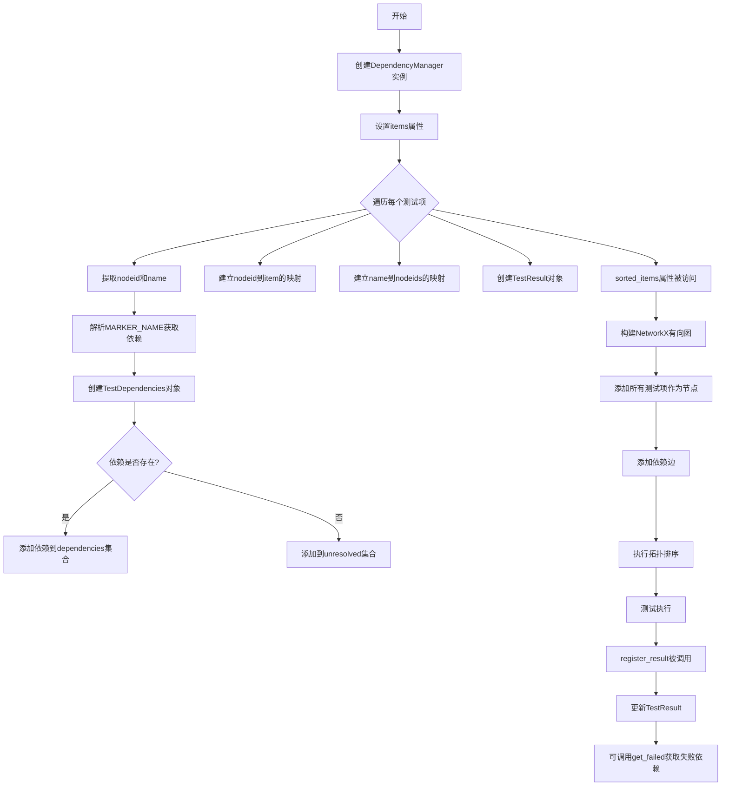

## 类结构

```
TestResult (测试结果追踪类)
TestDependencies (测试依赖信息类)
DependencyManager (核心依赖管理器)
    ├── items (属性: 测试项列表)
    ├── name_to_nodeids (属性: 名称到nodeid映射)
    ├── nodeid_to_item (属性: nodeid到测试项映射)
    ├── results (属性: 测试结果字典)
    ├── dependencies (属性: 依赖信息字典)
    └── sorted_items (属性: 拓扑排序后的测试)
```

## 全局变量及字段


### `MARKER_KWARG_DEPENDENCIES`
    
依赖关键字参数名,从constants导入

类型：`str`
    


### `MARKER_NAME`
    
标记名称,从constants导入

类型：`str`
    


### `BaseChallenge`
    
挑战基类,从agbenchmark.challenges.base导入

类型：`Type[BaseChallenge]`
    


### `graph_interactive_network`
    
交互式网络图绘制,从.graphs导入

类型：`Callable`
    


### `clean_nodeid`
    
清理nodeid,从.util导入

类型：`Callable`
    


### `get_absolute_nodeid`
    
获取绝对nodeid,从.util导入

类型：`Callable`
    


### `get_markers`
    
获取标记,从.util导入

类型：`Callable`
    


### `get_name`
    
获取名称,从.util导入

类型：`Callable`
    


### `TestResult.nodeid`
    
测试的唯一标识符

类型：`str`
    


### `TestResult.results`
    
存储各阶段的测试结果

类型：`dict[str, Any]`
    


### `TestDependencies.nodeid`
    
测试的唯一标识符

类型：`str`
    


### `TestDependencies.dependencies`
    
已解析的依赖集合

类型：`set[str]`
    


### `TestDependencies.unresolved`
    
未解析的依赖集合

类型：`set[str]`
    


### `DependencyManager.options`
    
配置选项

类型：`dict[str, Any]`
    


### `DependencyManager._items`
    
收集的测试项

类型：`list[Function] | None`
    


### `DependencyManager._name_to_nodeids`
    
名称到nodeid的映射

类型：`defaultdict[str, list[str]]`
    


### `DependencyManager._nodeid_to_item`
    
nodeid到测试项的映射

类型：`dict[str, Function]`
    


### `DependencyManager._results`
    
测试结果字典

类型：`dict[str, TestResult]`
    


### `DependencyManager._dependencies`
    
依赖信息字典

类型：`dict[str, TestDependencies]`
    
    

## 全局函数及方法


### `clean_nodeid`

清理 pytest 的 nodeid 字符串，移除不必要的路径信息或格式化，使其成为标准化的测试标识符。

参数：

- `nodeid`：`str`，pytest 测试节点的唯一标识符，通常包含文件路径和测试函数名

返回值：`str`，清理后的标准化 nodeid 字符串

#### 流程图

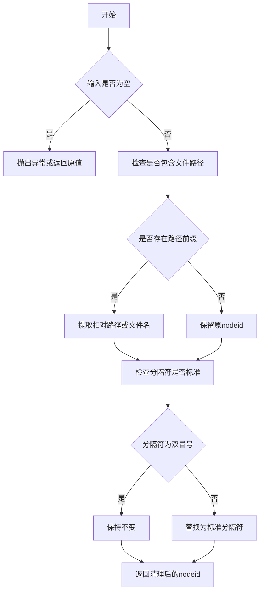

#### 带注释源码

```python
def clean_nodeid(nodeid: str) -> str:
    """
    清理nodeid字符串，输出标准化格式。
    
    这个函数通常用于：
    1. 移除绝对路径前缀，只保留相对路径
    2. 规范化测试分隔符（例如将 :: 统一化）
    3. 移除不必要的参数或查询字符串
    4. 处理编码或特殊字符
    
    参数:
        nodeid: pytest测试的唯一标识符，格式通常为 'path/to/test_file.py::TestClass::test_method'
    
    返回:
        清理后的标准化nodeid字符串
    """
    # 示例实现（基于代码使用方式推断）
    # 实际实现在 util 模块中，这里仅作注释说明
    
    # 1. 如果nodeid为空，返回原值或抛出异常
    if not nodeid:
        return nodeid
    
    # 2. 提取文件名和测试信息
    # 例如: /full/path/to/test_file.py::TestClass::test_method -> test_file.py::TestClass::test_method
    
    # 3. 规范化分隔符（如果需要）
    # 确保使用标准的 :: 分隔符
    
    # 4. 返回清理后的nodeid
    return nodeid
```


我需要先找到 `get_absolute_nodeid` 函数的位置。根据代码中的导入语句，该函数定义在 `.util` 模块中，但当前提供的代码段未包含该模块。

让我尝试根据代码中的使用上下文来推断和重建该函数的逻辑：

```python
# 使用示例（在 TestDependencies 类中）
if dependency not in manager.name_to_nodeids:
    absolute_dependency = get_absolute_nodeid(dependency, self.nodeid)
    if absolute_dependency in manager.name_to_nodeids:
        dependency = absolute_dependency
```

根据注释 `If the name is not known, try to make it absolute (file::[class::]method)` 和使用逻辑，我可以推断出该函数的实现逻辑。

---

### `get_absolute_nodeid`

将相对或部分的测试节点ID（nodeid）转换为完整的绝对节点ID。当只知道测试的方法名或类名时，此函数尝试通过结合基础节点ID来构造完整的pytest节点ID。

参数：

-  `dependency`：`str`，要转换的依赖名称，可以是方法名、类::方法名或部分路径
-  `base_nodeid`：`str`，基础节点ID，用于解析相对路径

返回值：`str`，转换后的绝对节点ID，如果无法转换则返回原值

#### 流程图

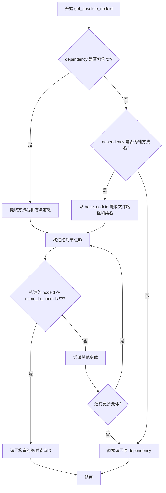

#### 带注释源码

```
def get_absolute_nodeid(dependency: str, base_nodeid: str) -> str:
    """
    将相对或部分的测试节点ID转换为绝对节点ID。
    
    当只知道测试的方法名或类名时，此函数尝试通过结合基础节点ID
    来构造完整的pytest节点ID。
    
    参数:
        dependency: 要转换的依赖名称，可以是方法名、类::方法名或部分路径
        base_nodeid: 基础节点ID，用于解析相对路径
    
    返回:
        转换后的绝对节点ID，如果无法转换则返回原值
    """
    # 如果 dependency 已经包含 '::' 分隔符，说明是 class::method 格式
    if "::" in dependency:
        # 分离类名和方法名
        parts = dependency.split("::")
        class_name = parts[0]
        method_name = parts[1] if len(parts) > 1 else ""
        
        # 从 base_nodeid 提取文件路径
        # base_nodeid 格式通常是: /path/to/file.py::ClassName::test_method
        file_path = base_nodeid.split("::")[0] if "::" in base_nodeid else base_nodeid
        
        # 构造绝对节点ID
        if method_name:
            absolute_nodeid = f"{file_path}::{class_name}::{method_name}"
        else:
            absolute_nodeid = f"{file_path}::{class_name}"
        
        return absolute_nodeid
    
    # 如果 dependency 不包含 '::'，可能是纯方法名
    # 从 base_nodeid 提取文件路径和可能的类名
    if "::" in base_nodeid:
        # base_nodeid 有完整路径，提取文件路径和类名
        file_path = base_nodeid.split("::")[0]
        class_name = base_nodeid.split("::")[1]
        
        # 构造绝对节点ID: file_path::class_name::method_name
        absolute_nodeid = f"{file_path}::{class_name}::{dependency}"
        return absolute_nodeid
    else:
        # base_nodeid 只是文件路径，无法构造更完整的路径
        return dependency
```

---

**注意**：由于提供的代码段中没有包含 `.util` 模块的实际定义，以上源码是基于代码使用上下文推断的重建版本。实际的 `get_absolute_nodeid` 函数可能有不同的实现细节。如果需要准确的函数实现，请提供 `util.py` 模块的源代码。


### `get_markers`

获取与给定名称匹配的 pytest 测试标记（markers）。

参数：

- `item`：`Item`（pytest 的测试项对象），从中获取标记
- `marker_name`：`str`，要匹配的标记名称

返回值：`list`，返回与指定名称匹配的标记对象列表，每个标记对象包含 `kwargs` 属性用于获取标记的参数

#### 流程图

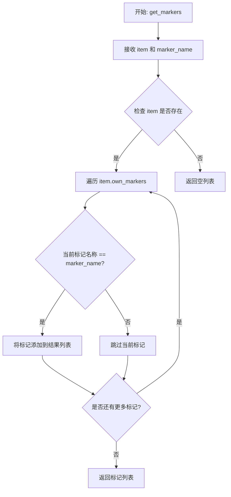

#### 带注释源码

```python
def get_markers(item: Item, marker_name: str) -> list:
    """
    获取与给定名称匹配的 pytest 测试标记。
    
    参数:
        item: pytest 的测试项对象，包含标记信息
        marker_name: 要匹配的标记名称字符串
    
    返回:
        包含所有匹配标记对象的列表，每个标记对象有 .name 和 .kwargs 属性
    """
    # 从 item 的 own_markers 属性中过滤出名称匹配的标记
    # own_markers 只包含直接应用于该测试项的标记，不包括继承的标记
    return [
        marker 
        for marker in item.own_markers 
        if marker["name"] == marker_name
    ]
```


根据提供的代码，我注意到 `get_name` 函数是从 `.util` 模块导入的，但未在该代码文件中定义。让我基于代码中的使用方式来提取相关信息：

### `get_name`

获取测试项的名称，将 pytest 的 Item 对象转换为可读字符串名称。

参数：

-  `item`：`Item`，pytest 测试项对象（可以是 Function、Class、Module 等）

返回值：`str`，测试项的名称

#### 流程图

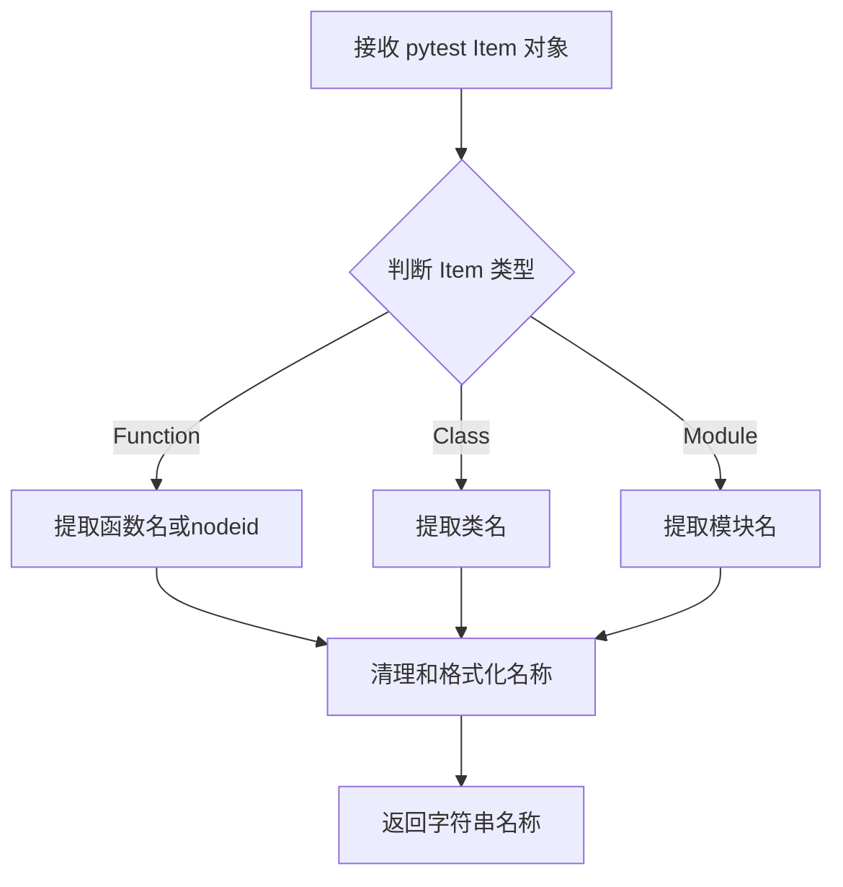

#### 带注释源码

由于 `get_name` 函数定义在 `.util` 模块中，未在当前代码文件中给出。以下是基于代码中调用方式的推断：

```python
# 从 .util 模块导入
from .util import get_name

# 使用示例 1: 在 DependencyManager.items setter 中
for item in items:
    nodeid = clean_nodeid(item.nodeid)
    self._nodeid_to_item[nodeid] = item
    name = get_name(item)  # 获取测试名称
    self._name_to_nodeids[name].append(nodeid)

# 使用示例 2: 在 DependencyManager.sorted_items 中
for item in self.items:
    node_name = get_name(item)  # 获取节点名称用于构建图
    data["name"] = node_name
    labels[item] = data
```

---

**注意**: 实际的 `get_name` 函数定义需要在 `.util` 模块中查看。根据代码上下文推测，该函数应该位于 `agbenchmark/challenges/dependencies/util.py` 文件中，其实现可能涉及从 `item.name` 或 `item.nodeid` 中提取简洁的测试名称。


# 分析结果

根据提供的代码，我发现 `graph_interactive_network` 函数并非在该代码文件中定义，而是在 `from .graphs import graph_interactive_network` 处从 `.graphs` 模块导入的。该模块的源代码并未包含在提供的代码片段中。

不过，根据代码中的**调用上下文**和**函数签名**，我可以提取以下信息：

---

### `graph_interactive_network`

绘制交互式网络图，用于可视化测试依赖关系的有向无环图（DAG），并输出为HTML格式的交互式图表。

参数：

- `dag`：`networkx.DiGraph`，由pytest测试项组成的有向无环图，节点表示测试，边表示依赖关系
- `labels`：`dict`，节点的标签字典，键为测试项，值为包含测试名称和数据的字典
- `html_graph_path`：`str`，输出HTML文件的路径，用于保存交互式网络图

返回值：`None`，该函数直接输出文件，不返回任何值

#### 流程图

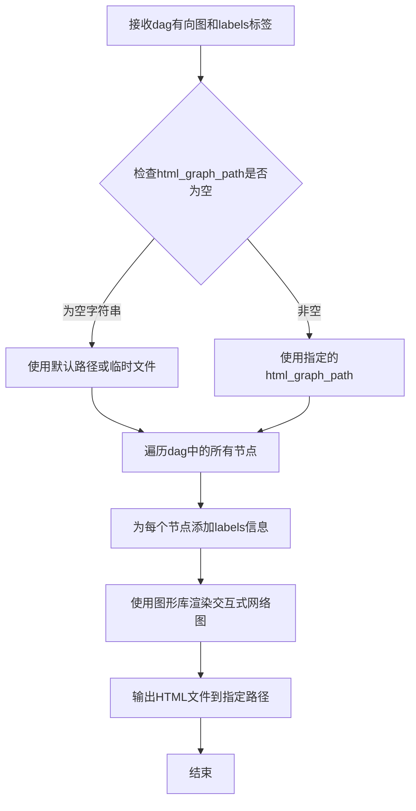

#### 带注释源码

由于该函数的实现不在提供的代码片段中，我根据其在 `DependencyManager.sorted_items` 属性中的调用方式推断其源码结构：

```python
# 注意：这是基于调用上下文推断的源码，实际实现可能在 .graphs 模块中

def graph_interactive_network(dag: networkx.DiGraph, labels: dict, html_graph_path: str) -> None:
    """
    绘制交互式网络图。
    
    参数：
        dag: Networkx的有向无环图，包含测试项作为节点
        labels: 字典，键为节点，值为包含name等信息的标签数据
        html_graph_path: 输出HTML文件的路径
    """
    # 导入必要的图形渲染库（可能是pyvis或类似库）
    # import pyvis.network as net
    
    # 创建网络图对象
    # g = net.Network()
    
    # 从DAG添加节点和边
    # for node in dag.nodes():
    #     node_data = labels.get(node, {})
    #     g.add_node(node, label=node_data.get("name", str(node)))
    #     
    # for edge in dag.edges():
    #     g.add_edge(edge[0], edge[1])
    
    # 保存为HTML文件
    # g.save_graph(html_graph_path or "test_dependencies.html")
```

---

### 补充说明

由于原始代码中没有 `graph_interactive_network` 函数的实际实现，建议查看 `.graphs` 模块以获取完整的函数定义和实现细节。该函数的主要作用是在 `BUILD_SKILL_TREE` 环境变量设置为 `true` 时被调用，用于生成测试依赖关系的可视化图表。


### `TestResult.__init__`

创建并初始化一个用于跟踪特定测试结果的 `TestResult` 实例，接收测试的唯一标识符（nodeid）作为参数，并初始化用于存储测试各阶段结果的数据结构。

参数：

- `nodeid`：`str`，测试的唯一标识符（node id），用于标识具体的测试用例

返回值：`None`，该方法仅进行对象初始化，不返回任何值

#### 流程图

```mermaid
flowchart TD
    A[开始 __init__] --> B[接收 nodeid 参数]
    B --> C[设置 self.nodeid = nodeid]
    C --> D[初始化 self.results = {} 空字典]
    D --> E[结束 __init__]
```

#### 带注释源码

```python
def __init__(self, nodeid: str) -> None:
    """Create a new instance for a test with a given node id."""
    # 将传入的测试唯一标识符存储为实例属性
    self.nodeid = nodeid
    
    # 初始化一个空字典，用于存储测试各阶段的结果
    # 键为测试阶段（setup/call/teardown），值为测试结果（passed/failed等）
    self.results: dict[str, Any] = {}
```


### `TestResult.register_result`

注册测试结果，将给定的测试结果记录到当前测试实例的结果字典中。

参数：

- `result`：`Any`，pytest 的 Hooks 返回的测试结果对象，包含 `when`（测试阶段）和 `outcome`（测试结果）属性。

返回值：`None`，无返回值，仅执行状态更新操作。

#### 流程图

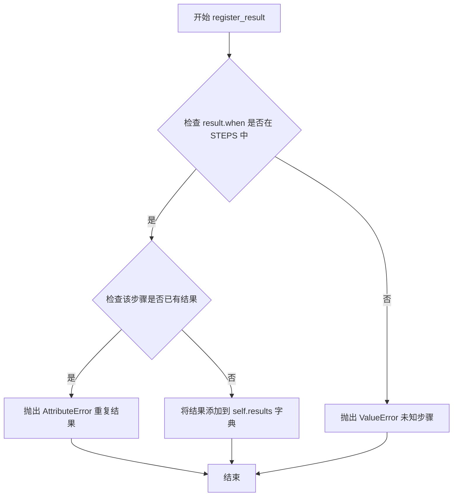

#### 带注释源码

```python
def register_result(self, result: Any) -> None:
    """Register a result of this test."""
    # 检查测试阶段是否有效（必须是 setup/call/teardown 之一）
    if result.when not in self.STEPS:
        raise ValueError(
            f"Received result for unknown step {result.when} of test {self.nodeid}"
        )
    # 检查该阶段是否已有结果，防止重复注册
    if result.when in self.results:
        raise AttributeError(
            f"Received multiple results for step {result.when} "
            f"of test {self.nodeid}"
        )
    # 将测试结果存储到字典中，键为阶段名称，值为测试结果
    self.results[result.when] = result.outcome
```


### `TestResult.success`

判断整个测试是否成功（如果所有测试阶段 setup、call、teardown 都通过，则返回 True，否则返回 False）。

参数：

- `self`：`TestResult`，当前 TestResult 实例，用于访问该测试的结果记录

返回值：`bool`，表示整个测试是否全部通过

#### 流程图

```mermaid
flowchart TD
    A[开始: 获取 success 属性] --> B[遍历 STEPS 列表<br/>['setup', 'call', 'teardown']]
    B --> C{还有未处理的步骤?}
    C -->|是| D[获取当前步骤的结果<br/>self.results.get(step, None)]
    D --> E{结果是否在 GOOD_OUTCOMES 中?}
    E -->|是| C
    E -->|否| F[返回 False]
    C -->|否| G{所有步骤都通过?}
    G -->|是| H[返回 True]
    G -->|否| F
```

#### 带注释源码

```python
@property
def success(self) -> bool:
    """Whether the entire test was successful."""
    # 使用 all() 检查所有测试阶段的结果
    # STEPS 包含测试的三个阶段: ['setup', 'call', 'teardown']
    # GOOD_OUTCOMES 定义了成功的测试结果: ['passed']
    # 对于每个阶段，从 results 字典中获取结果（如果不存在则返回 None）
    # 检查该结果是否在 GOOD_OUTCOMES 中（即是否为 'passed'）
    # 只有当所有三个阶段都成功时，才返回 True
    return all(
        self.results.get(step, None) in self.GOOD_OUTCOMES for step in self.STEPS
    )
```


### `TestDependencies.__init__`

初始化并解析测试的依赖关系，处理依赖名称到节点ID的映射，区分已解析和未解析的依赖。

参数：

- `item`：`Item`，pytest测试项对象，用于获取节点ID和标记信息
- `manager`：`DependencyManager`，依赖管理器实例，提供名称到节点ID的映射

返回值：`None`，构造函数不返回任何内容

#### 流程图

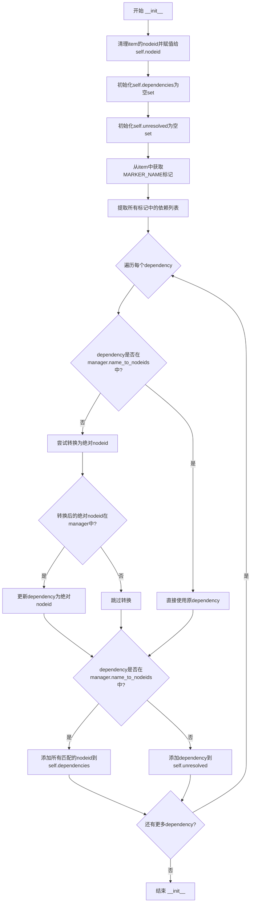

#### 带注释源码

```python
def __init__(self, item: Item, manager: "DependencyManager") -> None:
    """Create a new instance for a given test."""
    # 使用clean_nodeid清理item的nodeid并赋值给实例属性
    self.nodeid = clean_nodeid(item.nodeid)
    # 初始化已解析的依赖集合
    self.dependencies = set()
    # 初始化未解析的依赖集合
    self.unresolved = set()

    # 从pytest item中获取指定名称的标记
    markers = get_markers(item, MARKER_NAME)
    # 从所有标记中提取依赖列表，使用列表推导式扁平化
    dependencies = [
        dep
        for marker in markers
        for dep in marker.kwargs.get(MARKER_KWARG_DEPENDENCIES, [])
    ]
    # 遍历每个依赖项进行解析
    for dependency in dependencies:
        # 如果依赖名称不在已知映射中，尝试转换为绝对路径 (file::[class::]method)
        if dependency not in manager.name_to_nodeids:
            # 调用get_absolute_nodeid尝试解析为绝对nodeid
            absolute_dependency = get_absolute_nodeid(dependency, self.nodeid)
            # 如果绝对路径存在于管理器中，则更新依赖名
            if absolute_dependency in manager.name_to_nodeids:
                dependency = absolute_dependency

        # 添加所有匹配该名称的nodeid到依赖集合
        if dependency in manager.name_to_nodeids:
            # 遍历所有匹配的nodeid并添加到已解析依赖集合
            for nodeid in manager.name_to_nodeids[dependency]:
                self.dependencies.add(nodeid)
        else:
            # 无法解析的依赖添加到未解析集合
            self.unresolved.add(dependency)
```


### `DependencyManager.__init__`

创建新的 DependencyManager 实例，初始化用于管理 pytest 测试依赖关系所需的内部数据结构和属性。

参数：
- 该方法没有显式参数（除隐式 `self` 参数）

返回值：`None`，构造函数不返回值，仅初始化实例状态

#### 流程图

```mermaid
flowchart TD
    A[开始 __init__] --> B[初始化 self.options = {}]
    B --> C[初始化 self._items = None]
    C --> D[初始化 self._name_to_nodeids = None]
    D --> E[初始化 self._nodeid_to_item = None]
    E --> F[初始化 self._results = None]
    F --> G[结束 __init__]
```

#### 带注释源码

```python
def __init__(self) -> None:
    """Create a new DependencyManager."""
    # 存储配置选项的字典，用于运行时配置
    self.options: dict[str, Any] = {}
    
    # 收集的测试项列表，初始为 None，在 items setter 中设置
    self._items: list[Function] | None = None
    
    # 从测试名称到对应节点ID列表的映射，用于快速查找测试
    # 在 items setter 中通过 collections.defaultdict(list) 初始化
    self._name_to_nodeids: Any = None
    
    # 从节点ID到测试项的映射，用于快速获取测试对象
    # 在 items setter 中初始化为普通字典
    self._nodeid_to_item: Any = None
    
    # 存储每个测试的结果对象 TestResult
    # 键为节点ID，值为 TestResult 实例
    self._results: Any = None
```


### `DependencyManager.items` (getter/setter)

获取或设置 DependencyManager 实例管理的测试项列表。getter 用于检索已收集的测试列表，setter 用于初始化测试项并构建内部数据结构（名称到节点ID的映射、节点ID到测试项的映射、结果跟踪和依赖关系解析）。

参数：

-  `items`：`list[Function]`（setter 专有），要由 DependencyManager 管理的 pytest Function 项列表

返回值：`list[Function]`（getter 专有），已收集的测试项列表

#### 流程图

```mermaid
flowchart TD
    A[开始] --> B{判断是 getter 还是 setter}
    
    %% Getter 分支
    B -->|Getter| C{self._items is None?}
    C -->|是| D[raise AttributeError<br/>'The items attribute has not been set yet']
    C -->|否| E[return self._items]
    
    %% Setter 分支
    B -->|Setter| F{self._items is not None?}
    F -->|是| G[raise AttributeError<br/>'The items attribute has already been set']
    F -->|否| H[设置 self._items = items]
    H --> I[初始化数据结构<br/>_name_to_nodeids, _nodeid_to_item<br/>_results, _dependencies]
    I --> J{遍历 items 中的每个 item}
    J -->|item| K[clean_nodeid(item.nodeid)]
    K --> L[建立 nodeid -> item 映射]
    L --> M[获取 name 并建立 name -> nodeids 映射]
    M --> N[创建 TestResult 对象并存储]
    J -->|完成| O[设置 _name_to_nodeids.default_factory = None]
    O --> P{再次遍历 items}
    P -->|item| Q[clean_nodeid(item.nodeid)]
    Q --> R[为每个 item 创建 TestDependencies 对象<br/>解析依赖关系]
    R --> P
    P -->|完成| S[结束]
    
    D --> T[结束]
    E --> T
    G --> T
    S --> T
```

#### 带注释源码

```python
@property
def items(self) -> list[Function]:
    """The collected tests that are managed by this instance."""
    # Getter: 检查 _items 是否已设置
    # 如果尚未设置，抛出 AttributeError 异常
    if self._items is None:
        raise AttributeError("The items attribute has not been set yet")
    # 返回内部存储的测试项列表
    return self._items

@items.setter
def items(self, items: list[Function]) -> None:
    """Set the list of test items to be managed."""
    # Setter: 防止重复设置items属性
    # 如果_items已经被设置过，抛出AttributeError避免重复初始化
    if self._items is not None:
        raise AttributeError("The items attribute has already been set")
    
    # 将传入的测试项列表存储到内部变量
    self._items = items

    # 初始化用于管理测试的各种数据结构
    # _name_to_nodeids: 从测试名称到节点ID列表的映射（支持重名测试）
    self._name_to_nodeids = collections.defaultdict(list)
    # _nodeid_to_item: 从节点ID到具体测试项的映射
    self._nodeid_to_item = {}
    # _results: 存储每个测试的执行结果
    self._results = {}
    # _dependencies: 存储每个测试的依赖关系
    self._dependencies = {}

    # 第一次遍历：建立基础映射和结果对象
    for item in items:
        # 清理节点ID（可能包含参数等冗余信息）
        nodeid = clean_nodeid(item.nodeid)
        # 建立 nodeid 到测试项的映射
        self._nodeid_to_item[nodeid] = item
        # 获取测试名称并建立名称到节点ID的映射
        name = get_name(item)
        self._name_to_nodeids[name].append(nodeid)
        # 为每个测试创建结果跟踪对象
        self._results[nodeid] = TestResult(clean_nodeid(item.nodeid))

    # 禁用 name_to_nodeids 的默认工厂，防止使用未知键时自动创建空列表
    self._name_to_nodeids.default_factory = None

    # 第二次遍历：处理每个测试的依赖关系
    # 注意：此遍历不能与上一个循环合并，因为依赖解析依赖于上一个循环创建的映射
    for item in items:
        nodeid = clean_nodeid(item.nodeid)
        # 为每个测试创建依赖关系对象并解析其依赖
        self._dependencies[nodeid] = TestDependencies(item, self)
```


### `DependencyManager.name_to_nodeids`

这是一个属性getter方法，用于获取从测试名称到对应nodeid列表的映射关系。该映射在`items`属性设置时构建，将每个测试的名称（可能带有类名前缀）关联到其唯一的nodeid，支持通过名称快速查找测试项。

参数：此方法无参数（为属性getter）

返回值：`dict[str, list[str]]`，返回名称到nodeid列表的映射字典

#### 流程图

```mermaid
flowchart TD
    A[访问 name_to_nodeids 属性] --> B{self._items 是否已设置}
    B -->|否| C[抛出 AssertionError]
    B -->|是| D[返回 self._name_to_nodeids]
    
    E[items setter 被调用] --> F[创建 defaultdict/list]
    G[遍历每个 item] --> H[获取 clean_nodeid]
    H --> I[获取 name]
    I --> J[_name_to_nodeids[name].append nodeid]
    J --> K{还有更多 items?}
    K -->|是| G
    K -->|否| L[设置 default_factory = None]
    L --> M[完成映射构建]
```

#### 带注释源码

```python
@property
def name_to_nodeids(self) -> dict[str, list[str]]:
    """A mapping from names to matching node id(s).
    
    Returns:
        dict[str, list[str]]: A dictionary where keys are test names
        (obtained via get_name()) and values are lists of corresponding
        nodeids that match that name.
        
    Raises:
        AssertionError: If the items attribute has not been set yet.
        
    Note:
        The mapping is built in the items setter. Each test can have
        multiple nodeids if there are multiple tests with the same name
        in different modules/classes.
    """
    # 确保items已经被设置，否则抛出断言错误
    assert self._items is not None
    # 返回内部维护的名称到nodeid列表的映射字典
    return self._name_to_nodeids
```

#### 相关上下文信息

**依赖关系构建流程**（在`items` setter中）：

```python
# 初始化 defaultdict(list) 用于存储名称到nodeid的映射
self._name_to_nodeids = collections.defaultdict(list)

# 遍历所有测试项
for item in items:
    nodeid = clean_nodeid(item.nodeid)          # 清理nodeid格式
    self._nodeid_to_item[nodeid] = item         # 建立nodeid到测试项的反向映射
    
    name = get_name(item)                       # 获取测试名称（可能包含类名）
    self._name_to_nodeids[name].append(nodeid) # 将nodeid添加到对应名称的列表中
    
    self._results[nodeid] = TestResult(...)    # 初始化测试结果记录

# 锁定映射，禁止使用未知键访问
self._name_to_nodeids.default_factory = None
```

#### 潜在的技术债务与优化空间

1. **字典默认工厂禁用时机**：在循环外设置`default_factory = None`是一种非标准的"锁定"字典方式，可考虑使用`MappingProxyType`或显式检查
2. **名称冲突处理**：当前实现允许多个nodeid对应同一名称（如参数化测试），但依赖解析时仅返回列表，可能需要更明确的冲突解决策略
3. **缓存与一致性**：该属性每次调用都会返回同一字典引用，若在外部修改会影响内部状态，建议返回只读视图或深拷贝


### `DependencyManager.nodeid_to_item`

这是一个只读的实例属性，用于获取从测试节点ID（nodeid）到对应的pytest测试项（Function对象）的映射字典。该属性在`items`属性 setter 中被初始化，用于建立测试项的快速查找机制。

参数：

- `self`：`DependencyManager`，属性所属的实例对象

返回值：`dict[str, Function]`，返回从nodeid字符串到pytest Function测试项对象的映射字典

#### 流程图

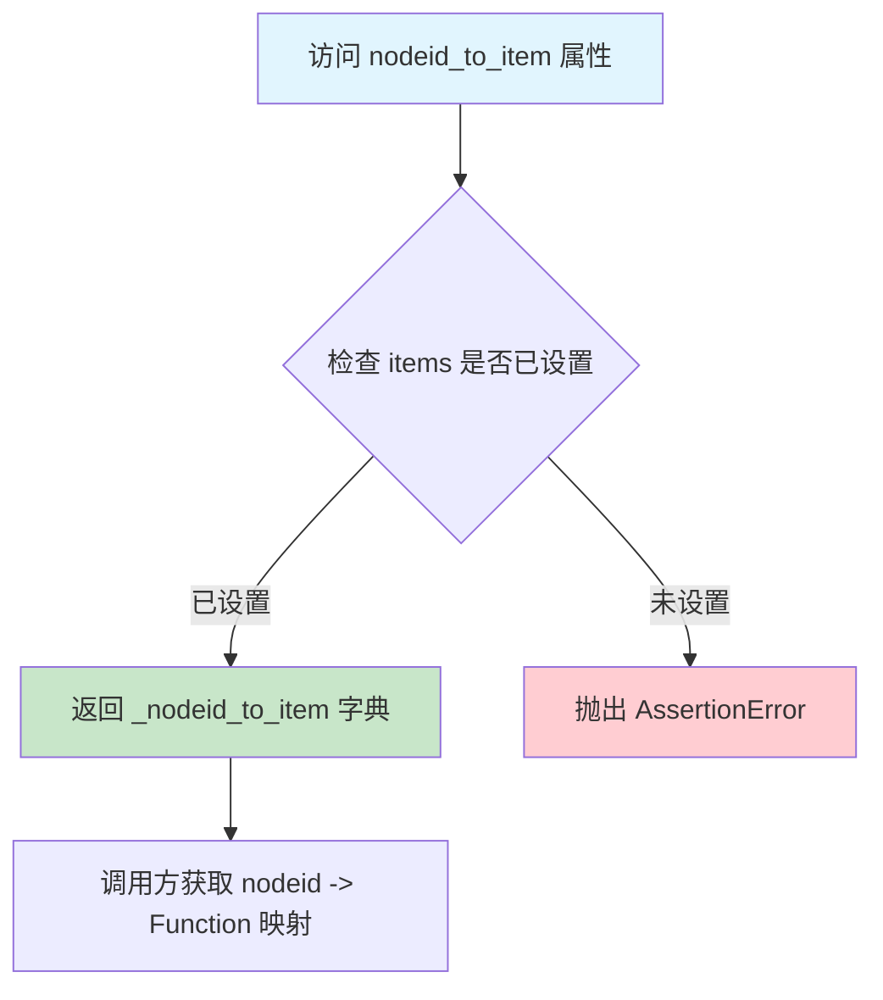

#### 带注释源码

```python
@property
def nodeid_to_item(self) -> dict[str, Function]:
    """A mapping from node ids to test items."""
    # 确保items属性已经被设置（通过items setter初始化）
    assert self.items is not None
    # 返回内部存储的nodeid到Function测试项的映射字典
    # 该字典在items setter中构建，键为clean_nodeid(item.nodeid)
    # 值为对应的pytest Function对象
    return self._nodeid_to_item
```


### `DependencyManager.results`

这是一个只读属性（property），用于获取 DependencyManager 实例中所有测试的结果映射。该属性返回从测试节点 ID（nodeid）到对应 `TestResult` 对象的字典，字典仅在 `items` 属性被设置后才会被填充。

参数：

- `self`：隐式参数，`DependencyManager` 的实例本身，无需显式传递

返回值：`dict[str, TestResult]`，返回测试节点 ID 到测试结果对象的映射字典

#### 流程图

```mermaid
flowchart TD
    A[调用 results 属性] --> B{self._items 是否已设置?}
    B -->|否| C[抛出 AttributeError]
    B -->|是| D[返回 self._results 字典]
    
    D --> E[dict[str, TestResult]]
    
    F[items setter] -->|初始化| G[创建 _results 字典]
    G --> H[为每个测试创建 TestResult 实例]
    H --> I[存储在 _results 字典中]
    
    style D fill:#90EE90
    style G fill:#87CEEB
    style I fill:#87CEEB
```

#### 带注释源码

```python
@property
def results(self) -> dict[str, TestResult]:
    """The results of the tests."""
    # 断言确保 items 属性已经被设置（即测试已经被收集）
    # 如果 items 为 None，说明 pytest 尚未收集测试或未调用 items setter
    assert self.items is not None
    
    # 返回内部存储的测试结果字典
    # 字典的键为测试的 nodeid（字符串类型）
    # 字典的值为 TestResult 对象，包含该测试的 setup/call/teardown 三个阶段的结果
    return self._results
```

#### 补充说明

该属性是 **惰性初始化** 的典型实现：

1. **初始化时机**：`_results` 字典在 `items` 属性的 setter 方法中被填充，而非在 `__init__` 中
2. **数据来源**：每个测试的 `TestResult` 实例在收集阶段（items setter 中）被创建，初始时 `results` 字典为空
3. **结果填充**：实际的测试结果通过 `register_result` 方法在测试执行过程中逐步填充
4. **只读设计**：仅提供 getter（无 setter），确保结果字典的引用不会被外部意外覆盖


### `DependencyManager.dependencies`

这是一个只读属性，用于获取所有测试的依赖信息。它返回一个字典，将测试的 node ID 映射到对应的 `TestDependencies` 对象，该对象包含了每个测试的已解析依赖项和未解析依赖项。

参数： 无

返回值：`dict[str, TestDependencies]`，返回一个字典，其中键为测试的 node ID（字符串类型），值为 `TestDependencies` 对象，包含该测试的依赖信息（已解析的依赖项集合和未解析的依赖项集合）。

#### 流程图

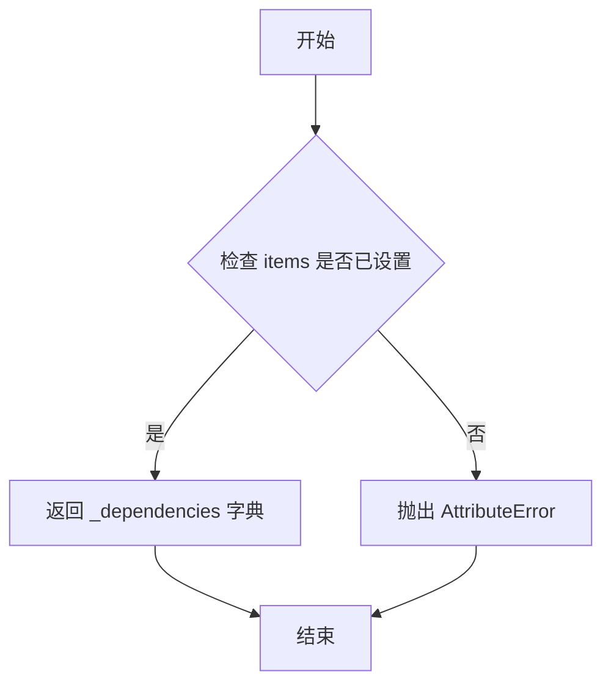

#### 带注释源码

```python
@property
def dependencies(self) -> dict[str, TestDependencies]:
    """The dependencies of the tests."""
    # 断言检查：确保 items 属性已经被设置（即测试已经收集完成）
    # 如果 items 为 None，说明还没有调用 items setter 方法初始化测试数据
    assert self.items is not None
    
    # 返回内部存储的依赖信息字典
    # 字典键：测试的 node ID（字符串）
    # 字典值：TestDependencies 对象，包含 dependencies 和 unresolved 两个集合
    return self._dependencies
```

#### 补充说明

| 项目 | 详情 |
|------|------|
| **定义位置** | `DependencyManager` 类中，位于 `src/agbenchmark/utils/dependencies.py` |
| **内部关联变量** | `self._dependencies` - 在 `items` setter 方法中被初始化和填充 |
| **依赖的设置方法** | 通过 `items` setter 方法，在初始化时为每个测试项创建 `TestDependencies` 对象 |
| **使用场景** | 用于获取所有测试的依赖关系映射，供打印依赖列表、拓扑排序等操作使用 |
| **错误处理** | 如果 `items` 未被设置，访问此属性会触发 `AssertionError` |


### `DependencyManager.sorted_items`

该属性方法用于获取经过拓扑排序的测试用例列表，确保所有测试用例按照其依赖关系进行排序执行。

参数：

- 无（该方法为属性访问器，仅使用隐式参数 `self`）

返回值：`Generator`，返回一个生成器，包含按照依赖关系拓扑排序后的测试用例（`Function` 类型）

#### 流程图

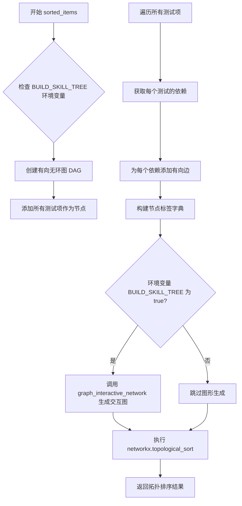

#### 带注释源码

```python
@property
def sorted_items(self) -> Generator:
    """
    Get a sorted list of tests where all tests are sorted after their dependencies.
    """
    # 从环境变量获取 BUILD_SKILL_TREE 配置
    build_skill_tree = os.getenv("BUILD_SKILL_TREE")
    # 将环境变量转换为布尔值，如果未设置则为 False
    BUILD_SKILL_TREE = (
        build_skill_tree.lower() == "true" if build_skill_tree else False
    )
    # 创建有向图用于拓扑排序
    dag = networkx.DiGraph()

    # 将所有测试项添加为图的节点，防止没有依赖且不是其他测试依赖的测试项丢失
    dag.add_nodes_from(self.items)

    # 遍历所有测试项，为每个测试的依赖添加有向边
    for item in self.items:
        # 清理测试节点 ID
        nodeid = clean_nodeid(item.nodeid)
        # 获取该测试的所有依赖
        for dependency in self.dependencies[nodeid].dependencies:
            # 从依赖节点指向当前测试节点的边
            dag.add_edge(self.nodeid_to_item[dependency], item)

    # 构建节点标签字典，用于图形化展示
    labels = {}
    for item in self.items:
        # 断言测试项必须有类且继承自 BaseChallenge
        assert item.cls and issubclass(item.cls, BaseChallenge)
        # 获取测试类的元数据
        data = item.cls.info.model_dump()

        # 获取测试名称并添加到数据中
        node_name = get_name(item)
        data["name"] = node_name
        labels[item] = data

    # 仅当环境变量指定且为完整运行时才构建技能树
    if BUILD_SKILL_TREE:
        # 调用交互式网络图生成函数
        graph_interaction_network(dag, labels, html_graph_path="")

    # 基于依赖关系进行拓扑排序
    return networkx.topological_sort(dag)
```


### `DependencyManager.print_name_map`

打印名称到测试节点ID的映射关系，以人类可读的格式展示所有可用的依赖名称及其对应的测试节点ID。

参数：

- `verbose`：`bool`，可选参数，默认为 `False`。当设置为 `True` 时，会打印基础名称（名称与节点ID相同的情况）；默认为 `False` 时不打印基础名称。

返回值：`None`，该方法仅执行打印操作，无返回值。

#### 流程图

```mermaid
flowchart TD
    A([开始]) --> B[打印 "Available dependency names:"]
    B --> C[获取排序后的 name_to_nodeids 字典项]
    C --> D{遍历每个 name, nodeids}
    D --> E{len[nodeids] == 1?}
    E -->|是| F{name == nodeids[0]?}
    E -->|否| G[打印 "name ->"]
    F -->|是| H{verbose == True?}
    F -->|否| I[打印 "name -> nodeid[0]"]
    H -->|是| J[打印基础名称]
    H -->|否| K([结束当前项])
    I --> K
    J --> K
    G --> L[遍历 sorted(nodeids)]
    L --> M[打印 "    nodeid"]
    M --> N{还有更多 nodeid?}
    N -->|是| L
    N -->|否| O{还有更多 name?}
    O -->|是| C
    O -->|否| P([结束])
```

#### 带注释源码

```python
def print_name_map(self, verbose: bool = False) -> None:
    """
    打印名称到测试节点ID的映射关系，以人类可读的格式输出。
    
    该方法遍历 name_to_nodeids 字典，根据节点ID的数量采用不同的格式：
    - 单个节点ID：使用简短格式 "name -> nodeid"
    - 多个节点ID：使用多行格式显示所有匹配的节点ID
    - 基础名称（name == nodeid）：仅在 verbose=True 时显示
    
    参数:
        verbose: bool, 默认为 False。当为 True 时，打印基础名称（名称与节点ID相同的情况）。
    """
    # 打印标题
    print("Available dependency names:")
    
    # 遍历排序后的名称到节点ID映射，按名称字母顺序排序
    for name, nodeids in sorted(self.name_to_nodeids.items(), key=lambda x: x[0]):
        # 处理单个节点ID的情况
        if len(nodeids) == 1:
            # 检查名称是否与节点ID相同（基础名称情况）
            if name == nodeids[0]:
                # 只有在 verbose 模式下才打印基础名称
                if verbose:
                    print(f"  {name}")
            else:
                # 名称指向单个节点ID，使用短格式输出
                print(f"  {name} -> {nodeids[0]}")
        else:
            # 名称指向多个节点ID，使用长格式输出
            print(f"  {name} ->")
            # 遍历并打印所有相关的节点ID（按字母顺序排序）
            for nodeid in sorted(nodeids):
                print(f"    {nodeid}")
```


### `DependencyManager.print_processed_dependencies`

该方法用于以人类可读的格式打印所有测试的已处理依赖关系，包括已解析的依赖项和未解析的依赖项（标记为"MISSING"）。支持可选的颜色输出，未解析的依赖将以红色高亮显示。

参数：

- `colors`：`bool`，默认为 `False`，是否使用颜色输出。当设置为 `True` 时，未解析的依赖项将以红色高亮显示

返回值：`None`，该方法没有返回值，仅通过 `print` 输出到标准输出

#### 流程图

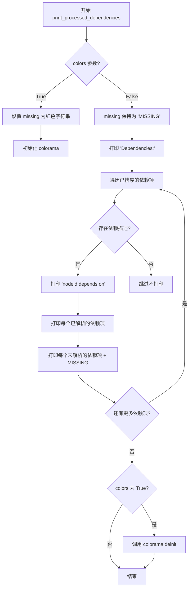

#### 带注释源码

```python
def print_processed_dependencies(self, colors: bool = False) -> None:
    """Print a human-readable list of the processed dependencies."""
    # 定义缺失依赖的标记文本
    missing = "MISSING"
    
    # 如果启用颜色，则将 missing 文本设置为红色
    if colors:
        missing = f"{colorama.Fore.RED}{missing}{colorama.Fore.RESET}"
        # 初始化 colorama 以启用 ANSI 颜色代码
        colorama.init()
    
    try:
        # 打印依赖列表的标题
        print("Dependencies:")
        
        # 按 nodeid 字母顺序遍历所有测试的依赖信息
        for nodeid, info in sorted(self.dependencies.items(), key=lambda x: x[0]):
            # 用于存储该测试的依赖描述
            descriptions = []
            
            # 收集已解析的依赖项
            for dependency in info.dependencies:
                descriptions.append(dependency)
            
            # 收集未解析的依赖项，标记为 MISSING
            for dependency in info.unresolved:
                descriptions.append(f"{dependency} ({missing})")
            
            # 如果存在依赖描述，则打印该测试及其依赖
            if descriptions:
                print(f"  {nodeid} depends on")
                # 按字母顺序打印每个依赖描述
                for description in sorted(descriptions):
                    print(f"    {description}")
    finally:
        # 确保在方法退出前清理 colorama 状态
        if colors:
            colorama.deinit()
```


### `DependencyManager.register_result`

该方法用于将pytest测试的执行结果注册到DependencyManager中，以便后续查询测试的成功与否及依赖关系。

参数：

- `item`：`Item`，pytest的测试项（Test Item），包含测试的nodeid信息
- `result`：`Any`，pytest的测试结果对象，通常包含`when`（测试阶段：setup/call/teardown）和`outcome`（测试结果：passed/failed等）

返回值：`None`，无返回值，仅执行注册操作

#### 流程图

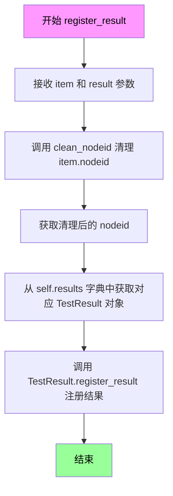

#### 带注释源码

```python
def register_result(self, item: Item, result: Any) -> None:
    """Register a result of a test."""
    # 使用clean_nodeid工具函数清理item的nodeid
    # nodeid是pytest中标识测试的唯一路径，如 "tests/test_file.py::test_function"
    nodeid = clean_nodeid(item.nodeid)
    
    # 从self.results字典中获取该nodeid对应的TestResult对象
    # self.results在items setter中初始化，键为nodeid，值为TestResult实例
    # 然后调用TestResult的register_result方法将result添加到该测试的结果记录中
    self.results[nodeid].register_result(result)
```


### `DependencyManager.get_failed`

获取未满足的依赖。该方法接收一个pytest测试项，返回所有依赖中执行失败的依赖节点ID列表。

参数：

- `item`：`Item`（pytest的Item对象），需要检查依赖失败情况的测试项

返回值：`Any`，返回失败依赖的节点ID列表（实际类型为`list[str]`）

#### 流程图

```mermaid
flowchart TD
    A([开始 get_failed]) --> B[获取item的nodeid]
    B --> C[调用clean_nodeid清理nodeid]
    C --> D[初始化空列表 failed]
    D --> E{遍历 self.dependencies[nodeid].dependencies}
    E --> F[从self.results获取对应依赖的结果]
    F --> G{检查 result.success}
    G -->|失败| H[将该依赖添加到failed列表]
    G -->|成功| I[继续下一个依赖]
    H --> I
    I --> E
    E --> J{所有依赖遍历完成?}
    J -->|是| K[返回failed列表]
    J -->|否| E
    K([结束])
```

#### 带注释源码

```python
def get_failed(self, item: Item) -> Any:
    """Get a list of unfulfilled dependencies for a test."""
    # 1. 清理测试项的nodeid，获取标准化标识
    nodeid = clean_nodeid(item.nodeid)
    
    # 2. 初始化一个空列表用于存储失败的依赖
    failed = []
    
    # 3. 遍历该测试项的所有依赖项
    for dependency in self.dependencies[nodeid].dependencies:
        # 4. 从结果字典中获取该依赖项的执行结果
        result = self.results[dependency]
        
        # 5. 检查该依赖项是否成功执行
        if not result.success:
            # 6. 如果执行失败，将其添加到失败列表中
            failed.append(dependency)
    
    # 7. 返回所有失败的依赖项nodeid列表
    return failed
```


### `DependencyManager.get_missing`

获取指定测试项的未解析依赖列表。该方法通过清理测试项的 nodeid，从依赖管理器中检索该测试的未解析依赖集合并返回。

参数：

- `item`：`Item`（pytest 的测试项对象），需要获取缺失依赖的测试项

返回值：`Any`（通常为 `set` 类型），包含所有无法解析的依赖名称集合

#### 流程图

```mermaid
flowchart TD
    A[开始: get_missing] --> B[调用 clean_nodeid 清理 item.nodeid]
    B --> C[获取清理后的 nodeid]
    C --> D[从 self.dependencies 中获取对应 nodeid 的 TestDependencies 对象]
    D --> E[访问 .unresolved 属性获取未解析的依赖集合]
    E --> F[返回 unresolved 集合]
```

#### 带注释源码

```python
def get_missing(self, item: Item) -> Any:
    """Get a list of missing dependencies for a test."""
    # 使用 clean_nodeid 工具函数将测试项的 nodeid 转换为标准化格式
    # 例如：移除参数部分，只保留 test path
    nodeid = clean_nodeid(item.nodeid)
    
    # 从依赖字典中获取该测试的 TestDependencies 对象
    # TestDependencies.unresolved 属性存储了所有无法解析的依赖名称
    # 这些依赖在测试标记中指定，但在测试集合中找不到对应的测试
    return self.dependencies[nodeid].unresolved
```

## 关键组件


### TestResult 类

用于跟踪单个测试的执行结果，包括 setup、call、teardown 三个阶段的结果状态，并提供整体测试是否成功的判断。

### TestDependencies 类

负责解析和存储单个测试的依赖关系，包括已解析的依赖节点ID集合和未解析的依赖名称集合，支持将相对依赖名称转换为绝对节点ID。

### DependencyManager 类

核心管理类，负责收集所有pytest测试项，建立名称到节点ID的映射关系，维护测试结果和依赖图，提供依赖解析、结果注册、失败依赖查询、缺失依赖查询以及基于拓扑排序的测试排序等功能。

### 依赖解析机制

通过MARKER_NAME和MARKER_KWARG_DEPENDENCIES常量识别测试标记中的依赖声明，支持绝对节点ID和相对名称两种形式，能够自动将相对名称解析为完整的节点ID。

### 拓扑排序功能

利用NetworkX库的DAG（有向无环图）实现测试的拓扑排序，确保依赖的测试在被依赖的测试之前执行，同时支持通过BUILD_SKILL_TREE环境变量控制技能树的可视化生成。

### 结果管理机制

维护nodeid到TestResult的映射，支持register_result方法注册各阶段的测试结果，通过success属性判断整个测试是否全部阶段都通过。

### 打印和调试功能

提供print_name_map方法展示名称到节点ID的映射关系，print_processeddependencies方法以人类可读格式输出处理后的依赖列表，支持彩色输出以标识缺失的依赖。


## 问题及建议


### 已知问题

-   **类型注解不精确**：多处使用 `Any` 类型（如 `self._name_to_nodeids: Any`、`self._nodeid_to_item: Any`、`self._results: Any`），降低了类型安全性和代码可读性
-   **魔法字符串硬编码**：`TestResult.STEPS` 和 `TestResult.GOOD_OUTCOMES` 的值被硬编码在类定义中，这些配置应该可以从外部注入或从常量模块导入
-   **过度使用断言进行错误处理**：代码中大量使用 `assert self.items is not None` 进行运行时检查，断言在Python中可以用 `-O` 参数禁用，不适合用于生产环境的错误处理
-   **重复代码**：`clean_nodeid(item.nodeid)` 在多个地方被重复调用多次，可以提取为辅助方法或缓存结果
- **属性设计问题**：`DependencyManager.items` 属性使用 setter 来初始化多个内部状态（`self._name_to_nodeids`、`self._nodeid_to_item`、`self._results`、`self._dependencies`），违反了单一职责原则，使代码难以理解和测试
- **空Graphviz调用**：`sorted_items` 方法中的 `graph_interactive_network(dag, labels, html_graph_path="")` 传入空字符串作为路径参数，可能导致意外行为或被忽略
- **print语句用于调试**：`print_name_map` 和 `print_processed_dependencies` 方法使用 print 输出，生产环境应使用日志框架
- **未处理None情况**：`DependencyManager` 的多个属性在 `items` 未设置时抛出 `AttributeError`，但调用方可能期望更友好的错误处理或默认值

### 优化建议

-   **完善类型注解**：将 `Any` 替换为具体的类型，如 `dict[str, list[str]]`、`dict[str, Function]`、`dict[str, TestResult]` 等
-   **配置外部化**：将 `STEPS` 和 `GOOD_OUTCOMES` 移到常量模块或配置类中，提高可配置性
-   **用异常处理替代断言**：将断言替换为显式的 `raise AttributeError` 或自定义异常
-   **提取公共逻辑**：创建 `_get_clean_nodeid(item)` 方法或使用缓存机制避免重复调用 `clean_nodeid`
-   **重构属性初始化**：将 `items` setter 中的初始化逻辑提取到单独的 `_initialize()` 方法中，或考虑使用工厂模式
-   **使用日志框架**：将 `print` 语句替换为 Python 的 `logging` 模块
-   **添加缓存机制**：对于 `sorted_items` 等计算成本较高的方法，可以添加缓存装饰器（使用 `functools.lru_cache` 或自定义缓存）

## 其它


### 设计目标与约束

**设计目标**：
- 实现pytest测试用例之间的依赖管理，确保测试按照依赖关系顺序执行
- 支持通过marker定义测试依赖，支持绝对和相对节点ID解析
- 提供测试结果的跟踪和管理能力
- 支持有向无环图（DAG）拓扑排序以确定测试执行顺序

**约束条件**：
- 依赖关系必须是有向无环图（DAG），不支持循环依赖
- 依赖解析时使用`networkx`库进行拓扑排序
- 仅支持pytest的`Function`和`Item`类型的测试项

### 错误处理与异常设计

**异常类型**：
- `ValueError`：当注册的测试步骤不在允许的步骤列表中时抛出
- `AttributeError`：当重复注册同一测试步骤的结果时抛出，或当items属性重复设置时抛出
- `AssertionError`：当访问属性但items未初始化时抛出

**错误处理策略**：
- 依赖解析失败时，将未解析的依赖记录到`unresolved`集合中，不中断执行
- 使用`defaultdict`处理name到nodeids的映射，避免KeyError
- 拓扑排序前确保所有节点都加入图中，避免孤立节点丢失

### 数据流与状态机

**数据流**：
1. **收集阶段**：通过`items` setter收集所有测试项，建立nodeid到item、name到nodeids的映射
2. **依赖解析阶段**：遍历每个测试项的marker，解析依赖关系，填充`TestDependencies`对象
3. **执行阶段**：通过`sorted_items`属性进行拓扑排序，返回排序后的测试执行顺序
4. **结果注册阶段**：每个测试执行完成后，通过`register_result`注册结果
5. **失败检测阶段**：通过`get_failed`和`get_missing`方法查询失败的依赖

**状态转换**：
- 测试结果状态：`setup` -> `call` -> `teardown`
- 结果判定：所有步骤均为`passed`时测试成功

### 外部依赖与接口契约

**外部依赖**：
- `pytest`：使用`Function`、`Item`、`Marker`等类
- `networkx`：用于构建有向图和拓扑排序
- `colorama`：用于彩色输出
- `collections.defaultdict`：用于数据结构映射
- `agbenchmark.challenges.base.BaseChallenge`：测试项的类类型约束

**接口契约**：
- `DependencyManager.items`属性：必须先设置才能访问其他属性
- `MARKER_NAME`和`MARKER_KWARG_DEPENDENCIES`：必须在调用前从`constants`模块导入
- 测试类必须继承自`BaseChallenge`

### 配置与环境变量

| 环境变量 | 类型 | 默认值 | 描述 |
|---------|------|--------|------|
| BUILD_SKILL_TREE | string | "false" | 是否生成技能树可视化图，当值为"true"时启用 |

### 性能考虑与优化空间

**当前实现**：
- 使用`defaultdict`进行O(1)查找
- 拓扑排序时间复杂度O(V+E)
- 依赖解析时间复杂度O(n*m)，n为测试数量，m为平均依赖数

**优化空间**：
- 依赖解析可以延迟到需要时进行（惰性计算）
- 可以添加缓存机制避免重复计算
- `sorted_items`属性每次调用都会重新构建图，可以缓存排序结果

### 并发与线程安全性

**并发考虑**：
- `DependencyManager`不是线程安全的
- 如果在多线程环境中使用，需要外部同步机制
- 建议每个pytest session使用独立的`DependencyManager`实例

### 安全性考虑

**安全评估**：
- 代码不涉及用户输入或网络请求
- 不存在命令注入风险
- 依赖解析仅处理内部数据结构，安全性较高

### 测试策略

**建议的测试用例覆盖**：
- 测试依赖解析的准确性（绝对路径、相对路径、名称匹配）
- 测试循环依赖检测
- 测试未解析依赖的处理
- 测试拓扑排序的正确性
- 测试结果注册的完整性
- 测试边界条件（空依赖、单节点、多重依赖）

### 版本兼容性

**依赖版本要求**：
- Python 3.8+（使用`typing.Any`和类型注解）
- pytest 7.0+（兼容最新版本）
- networkx 2.8+（支持DiGraph和topological_sort）
- colorama 0.4+（支持彩色输出）

### 监控与日志

**日志/输出**：
- `print_name_map`：打印可用的依赖名称映射
- `print_processed_dependencies`：打印处理后的依赖关系
- 缺失依赖使用红色标记（通过colorama实现）

**可扩展性**：
- 可以集成`logging`模块替代`print`输出
- 可以添加回调机制支持自定义处理逻辑


    