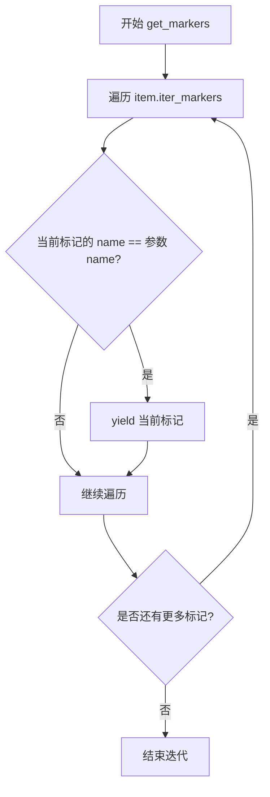

# `.\AutoGPT\classic\benchmark\agbenchmark\utils\dependencies\util.py` 详细设计文档

该模块提供了一组工具函数，用于处理pytest测试框架中的节点标识符（nodeid），包括清理无效的::()::标记、剥离参数、相对路径转绝对路径，以及获取测试的自定义名称和标记信息。

## 整体流程

```mermaid
graph TD
    A[开始] --> B[接收nodeid和scope]
B --> C{parts数量是否为1?}
C -- 是 --> D[使用rsplit获取base_nodeid]
C -- 否 --> E{parts[0]是否包含.?, 'test_name']}
E -- 是 --> F[使用split获取base_nodeid]
E -- 否 --> G[base_nodeid已完整]
D --> H[拼接base_nodeid和nodeid]
F --> H
G --> H
H --> I[调用clean_nodeid清理]
I --> J[返回处理后的nodeid]
```

## 类结构

```
Module (模块级)
├── clean_nodeid (函数)
├── strip_nodeid_parameters (函数)
├── get_absolute_nodeid (函数)
├── get_name (函数)
├── get_markers (函数)
├── REGEX_PARAMETERS (全局变量)
└── 导入常量 (MARKER_KWARG_ID, MARKER_NAME)
```

## 全局变量及字段


### `REGEX_PARAMETERS`
    
用于匹配参数的正则表达式对象

类型：`re.Pattern`
    


    

## 全局函数及方法


### `clean_nodeid`

该函数用于清理测试节点标识符（nodeid），移除其中多余的空参数标记 `::()::`，使节点ID更加简洁规范。在pytest测试框架中，节点ID可能包含空的参数标记，该函数将其标准化。

参数：

- `nodeid`：`str`，测试节点的标识符，格式如 `test_file.py::TestClass::()::test`

返回值：`str`，清理后的节点标识符，去除了 `::()::` 部分

#### 流程图

```mermaid
flowchart TD
    A[开始] --> B[输入 nodeid]
    B --> C{检查是否包含 '::()::'}
    C -->|是| D[使用 replace 替换 '::()::' 为 '::']
    C -->|否| E[保持原值不变]
    D --> F[返回清理后的 nodeid]
    E --> F
```

#### 带注释源码

```python
def clean_nodeid(nodeid: str) -> str:
    """
    Remove any superfluous ::() from a node id.

    >>> clean_nodeid('test_file.py::TestClass::()::test')
    'test_file.py::TestClass::test'
    >>> clean_nodeid('test_file.py::TestClass::test')
    'test_file.py::TestClass::test'
    >>> clean_nodeid('test_file.py::test')
    'test_file.py::test'
    """
    # 使用字符串的 replace 方法，将 '::()::' 替换为 '::'
    # 如果 nodeid 中不包含 '::()::'，则 replace 不会做任何修改，直接返回原字符串
    return nodeid.replace("::()::", "::")
```


### `strip_nodeid_parameters`

移除 node ID 中的参数部分，提取纯测试标识符。

参数：

-  `nodeid`：`str`，pytest 节点 ID，可能包含方括号中的参数，例如 `test_file.py::TestClass::test[foo]`

返回值：`str`，去除参数后的节点 ID

#### 流程图

```mermaid
flowchart TD
    A[开始: 输入 nodeid] --> B{使用 REGEX_PARAMETERS 正则表达式}
    B --> C[匹配 [.+\]$ 模式<br/>即方括号及其内部内容]
    C --> D[sub 函数替换匹配内容<br/>替换为空字符串]
    D --> E[返回处理后的 nodeid]
    
    A --> F[示例: 'test_file.py::TestClass::test[foo]']
    F --> G[匹配 '[foo]']
    G --> H[结果: 'test_file.py::TestClass::test']
    H --> E
```

#### 带注释源码

```python
def strip_nodeid_parameters(nodeid: str) -> str:
    """
    Strip parameters from a node id.

    >>> strip_nodeid_parameters('test_file.py::TestClass::test[foo]')
    'test_file.py::TestClass::test'
    >>> strip_nodeid_parameters('test_file.py::TestClass::test')
    'test_file.py::TestClass::test'
    """
    # 使用预编译的正则表达式 REGEX_PARAMETERS 匹配方括号及其内部内容
    # 正则表达式 r"\.+\]$" 匹配:
    #   \[ - 左方括号
    #   .+ - 一个或多个任意字符（参数内容）
    #   \] - 右方括号
    #   $ - 字符串结尾
    # sub("", nodeid) 将匹配到的内容替换为空字符串
    return REGEX_PARAMETERS.sub("", nodeid)
```

#### 关联全局变量

| 变量名 | 类型 | 描述 |
|--------|------|------|
| `REGEX_PARAMETERS` | `re.Pattern` | 预编译的正则表达式，用于匹配节点 ID 末尾的参数部分（`[...]` 格式） |


### `get_absolute_nodeid`

将可能相对的测试节点ID转换为绝对节点ID，使用提供的作用域作为参考。

参数：

- `nodeid`：`str`，可能相对或绝对的测试节点ID标识符
- `scope`：`str`，当前测试的完整节点ID作用域，用于解析相对路径

返回值：`str`，解析后的绝对节点ID

#### 流程图

```mermaid
flowchart TD
    A[开始] --> B[将nodeid按'::'分割成列表]
    B --> C{parts长度 == 1?}
    C -->|是| D[完全相对测试名<br/>如'test2']
    C -->|否| E{parts[0]包含'.':?}
    D --> F[获取scope的base_nodeid<br/>通过rsplit取最后一部分之前的内容]
    F --> G[拼接: base_nodeid::nodeid]
    E -->|是| H[已是绝对路径<br/>包含文件路径]
    E -->|否| I[相对类名<br/>如'TestClass::test2']
    I --> J[获取scope的base_nodeid<br/>通过split取第一部分文件路径]
    J --> K[拼接: base_nodeid::nodeid]
    H --> L[直接使用原nodeid]
    G --> M[调用clean_nodeid清理::()::]
    K --> M
    L --> M
    M --> N[返回处理后的nodeid]
```

#### 带注释源码

```python
def get_absolute_nodeid(nodeid: str, scope: str) -> str:
    """
    Transform a possibly relative node id to an absolute one
    using the scope in which it is used.

    >>> scope = 'test_file.py::TestClass::test'
    >>> get_absolute_nodeid('test2', scope)
    'test_file.py::TestClass::test2'
    >>> get_absolute_nodeid('TestClass2::test2', scope)
    'test_file.py::TestClass2::test2'
    >>> get_absolute_nodeid('test_file2.py::TestClass2::test2', scope)
    'test_file2.py::TestClass2::test2'
    """
    # 将nodeid按'::'分割成各个部分
    parts = nodeid.split("::")
    
    # 判断场景1: 完全相对（仅测试函数名）
    # 例如: 'test2' -> 需要补充完整的文件路径和类路径
    if len(parts) == 1:
        # 获取scope去掉最后一个'::'之后的基础路径
        # 例如: 'test_file.py::TestClass::test' -> 'test_file.py::TestClass'
        base_nodeid = scope.rsplit("::", 1)[0]
        # 拼接成完整路径: 'test_file.py::TestClass::test2'
        nodeid = f"{base_nodeid}::{nodeid}"
    
    # 判断场景2: 包含部分作用域（如类名），但不含文件路径
    # 例如: 'TestClass2::test2' -> 需要补充文件路径
    elif "." not in parts[0]:
        # 获取scope的第一个部分（文件路径）
        # 例如: 'test_file.py::TestClass::test' -> 'test_file.py'
        base_nodeid = scope.split("::", 1)[0]
        # 拼接: 'test_file.py::TestClass2::test2'
        nodeid = f"{base_nodeid}::{nodeid}"
    
    # 场景3: 已经是绝对路径（包含文件.py），直接使用
    
    # 清理可能存在的'::()::'冗余部分
    return clean_nodeid(nodeid)
```


### `get_name`

获取测试的自定义名称。如果在pytest marker中指定了自定义名称（通过`name`关键字参数），则返回该自定义名称；否则返回空字符串。

参数：

- `item`：`Item`，pytest测试用例对象，用于获取其关联的markers

返回值：`str`，测试的自定义名称，如果没有自定义名称则返回空字符串

#### 流程图

```mermaid
flowchart TD
    A[开始 get_name] --> B[初始化 name = '']
    B --> C[调用 get_markers 获取 MARKER_NAME 的所有 markers]
    C --> D{遍历 markers}
    D -->|存在 marker| E{检查 marker.kwargs 中是否有 MARKER_KWARG_ID}
    E -->|是| F[将 name 设置为 marker.kwargs[MARKER_KWARG_ID]]
    E -->|否| D
    F --> D
    D -->|遍历完毕| G[返回 name]
    G --> H[结束]
```

#### 带注释源码

```python
def get_name(item: Item) -> str:
    """
    Get all names for a test.

    This will use the following methods to determine the name of the test:
        - If given, the custom name(s) passed to the keyword argument name on the marker
    """
    name = ""  # 初始化默认名称为空字符串

    # Custom name: 从 marker 中获取自定义名称
    # 获取所有名为 MARKER_NAME 的 markers
    markers = get_markers(item, MARKER_NAME)
    for marker in markers:  # 遍历每个 marker
        # 检查 marker 的 kwargs 中是否包含 MARKER_KWARG_ID
        if MARKER_KWARG_ID in marker.kwargs:
            # 将自定义名称设置为 marker 中指定的值
            name = marker.kwargs[MARKER_KWARG_ID]

    return name  # 返回获取到的名称（如果未设置则为空字符串）
```

#### 依赖函数信息

`get_markers` 是一个辅助函数，用于迭代获取item上指定名称的所有markers：

- **函数名**: `get_markers`
- **参数**: 
  - `item`: `Item` - pytest测试用例对象
  - `name`: `str` - 要查找的marker名称
- **返回值**: `Iterator[Mark]` - 匹配指定名称的marker迭代器
- **功能**: 从pytest item中筛选出指定名称的所有markers

#### 关键常量

- `MARKER_NAME`: 从 `constants` 模块导入，用于标识自定义名称的marker名称
- `MARKER_KWARG_ID`: 从 `constants` 模块导入，用于标识marker中自定义名称的关键字参数键


### `get_markers`

获取给定测试项中所有具有指定名称的标记（Marker）。

参数：

- `item`：`Item`，来自 `_pytest.nodes` 的测试项对象，用于遍历其上的所有标记
- `name`：`str`，要过滤的标记名称，用于匹配标记的 name 属性

返回值：`Iterator[Mark]`，返回一个迭代器，包含所有名称与给定 `name` 匹配的标记对象

#### 流程图



#### 带注释源码

```python
def get_markers(item: Item, name: str) -> Iterator[Mark]:
    """
    Get all markers with the given name for a given item.
    
    Args:
        item: 测试项对象，包含多个标记
        name: 要筛选的标记名称
    
    Yields:
        名称与参数 name 匹配的标记对象
    """
    # 遍历测试项上的所有标记
    for marker in item.iter_markers():
        # 检查当前标记的名称是否与指定名称匹配
        if marker.name == name:
            # 匹配成功，yield 该标记（生成器模式，按需返回）
            yield marker
```

## 关键组件


## 一段话描述

这是一个pytest测试标识符处理工具模块，提供了一组函数用于清理、转换和提取pytest测试节点ID（nodeid）的相关信息，支持处理参数化测试的参数、相对路径转绝对路径以及获取自定义测试名称等功能。

## 文件的整体运行流程

1. 模块初始化时定义正则表达式REGEX_PARAMETERS用于匹配参数
2. 导入必要的pytest类型和常量
3. 提供clean_nodeid函数清理nodeid中的"::()::"冗余部分
4. 提供strip_nodeid_parameters函数使用正则去除参数部分
5. 提供get_absolute_nodeid函数将相对nodeid转换为绝对nodeid
6. 提供get_name函数从测试标记中获取自定义名称
7. 提供get_markers函数迭代获取特定名称的标记

## 全局变量和全局函数详细信息

### REGEX_PARAMETERS

- **类型**: re.Pattern
- **描述**: 正则表达式对象，用于匹配节点ID中的参数部分（如[foo]）

### clean_nodeid

- **参数名称**: nodeid
- **参数类型**: str
- **参数描述**: pytest测试节点的完整标识符
- **返回值类型**: str
- **返回值描述**: 清理后的nodeid，移除了::()::冗余部分
- **源码**:
```python
def clean_nodeid(nodeid: str) -> str:
    """
    Remove any superfluous ::() from a node id.

    >>> clean_nodeid('test_file.py::TestClass::()::test')
    'test_file.py::TestClass::test'
    >>> clean_nodeid('test_file.py::TestClass::test')
    'test_file.py::TestClass::test'
    >>> clean_nodeid('test_file.py::test')
    'test_file.py::test'
    """
    return nodeid.replace("::()::", "::")
```

### strip_nodeid_parameters

- **参数名称**: nodeid
- **参数类型**: str
- **参数描述**: pytest测试节点的完整标识符，可能包含参数
- **返回值类型**: str
- **返回值描述**: 去除参数后的nodeid
- **源码**:
```python
def strip_nodeid_parameters(nodeid: str) -> str:
    """
    Strip parameters from a node id.

    >>> strip_nodeid_parameters('test_file.py::TestClass::test[foo]')
    'test_file.py::TestClass::test'
    >>> strip_nodeid_parameters('test_file.py::TestClass::test')
    'test_file.py::TestClass::test'
    """
    return REGEX_PARAMETERS.sub("", nodeid)
```

### get_absolute_nodeid

- **参数名称**: nodeid, scope
- **参数类型**: str, str
- **参数描述**: nodeid为待转换的节点ID，scope为当前作用域用于构建绝对路径
- **返回值类型**: str
- **返回值描述**: 绝对路径的nodeid
- **mermaid流程图**:
```mermaid
flowchart TD
    A[开始] --> B{parts数量是否等于1}
    B -->|是| C[完全相对路径]
    B -->|否| D{parts[0]是否包含点号}
    C --> E[取scope的::前部分作为base]
    D -->|否| F[部分相对路径]
    D -->|是| G[已是绝对路径]
    E --> H[拼接base和nodeid]
    F --> I[取scope的::前部分作为base]
    I --> H
    H --> J[调用clean_nodeid清理]
    J --> K[返回结果]
    G --> K
```
- **源码**:
```python
def get_absolute_nodeid(nodeid: str, scope: str) -> str:
    """
    Transform a possibly relative node id to an absolute one
    using the scope in which it is used.

    >>> scope = 'test_file.py::TestClass::test'
    >>> get_absolute_nodeid('test2', scope)
    'test_file.py::TestClass::test2'
    >>> get_absolute_nodeid('TestClass2::test2', scope)
    'test_file.py::TestClass2::test2'
    >>> get_absolute_nodeid('test_file2.py::TestClass2::test2', scope)
    'test_file2.py::TestClass2::test2'
    """
    parts = nodeid.split("::")
    # Completely relative (test_name): add the full current scope (file::class or file)
    if len(parts) == 1:
        base_nodeid = scope.rsplit("::", 1)[0]
        nodeid = f"{base_nodeid}::{nodeid}"
    # Contains some scope already (Class::test_name), so only add the current file scope
    elif "." not in parts[0]:
        base_nodeid = scope.split("::", 1)[0]
        nodeid = f"{base_nodeid}::{nodeid}"
    return clean_nodeid(nodeid)
```

### get_name

- **参数名称**: item
- **参数类型**: Item
- **参数描述**: pytest测试项对象
- **返回值类型**: str
- **返回值描述**: 测试的自定义名称，如果未设置则返回空字符串
- **源码**:
```python
def get_name(item: Item) -> str:
    """
    Get all names for a test.

    This will use the following methods to determine the name of the test:
        - If given, the custom name(s) passed to the keyword argument name on the marker
    """
    name = ""

    # Custom name
    markers = get_markers(item, MARKER_NAME)
    for marker in markers:
        if MARKER_KWARG_ID in marker.kwargs:
            name = marker.kwargs[MARKER_KWARG_ID]

    return name
```

### get_markers

- **参数名称**: item, name
- **参数类型**: Item, str
- **参数描述**: item为pytest测试项，name为要查找的标记名称
- **返回值类型**: Iterator[Mark]
- **返回值描述**: 迭代器，返回所有匹配给定名称的标记
- **源码**:
```python
def get_markers(item: Item, name: str) -> Iterator[Mark]:
    """Get all markers with the given name for a given item."""
    for marker in item.iter_markers():
        if marker.name == name:
            yield marker
```

## 关键组件信息

### 正则参数匹配组件

使用预编译正则表达式REGEX_PARAMETERS = re.compile(r"\[.+\]$")匹配nodeid末尾的参数部分（如[param1,param2]）

### 节点ID清理组件

clean_nodeid函数移除nodeid中的"::()::"冗余部分，处理pytest在参数化测试时产生的空参数标记

### 相对路径转换组件

get_absolute_nodeid函数支持三种情况：完全相对路径（如test_name）、部分相对路径（如Class::test_name）、绝对路径，处理不同作用域下的路径解析

### 标记提取组件

get_markers和get_name函数配合工作，从pytest Item中提取特定名称的标记及其自定义参数

## 潜在的技术债务或优化空间

1. **错误处理缺失**：所有函数均未对输入参数进行有效性验证，未处理None、空字符串等边界情况
2. **正则表达式性能**：虽然REGEX_PARAMETERS已预编译，但get_absolute_nodeid中的split和rsplit操作可考虑缓存结果
3. **类型注解不完整**：get_name函数返回类型应为str，但实际逻辑只返回第一个匹配的值（如果存在多个同名标记），与文档描述的"all names"不符
4. **文档注释不一致**：get_name的docstring提到"Get all names"但实现只返回单个名称
5. **常量依赖**：依赖外部constants模块的MARKER_KWARG_ID和MARKER_NAME，但未在当前模块进行导入验证

## 其它项目

### 设计目标与约束

- 目标：提供pytest测试标识符的清理、转换和名称提取功能
- 约束：依赖于pytest框架的Item和Mark类型，依赖于本地constants模块定义的常量

### 错误处理与异常设计

- 当前无异常处理机制
- 建议：添加参数类型检查、空值处理、以及正则匹配失败时的默认行为

### 数据流与状态机

- 数据流：输入nodeid字符串 → 正则处理/字符串替换 → 输出清理后的字符串
- 状态机：get_absolute_nodeid函数内部有三种状态分支（完全相对、部分相对、绝对路径）

### 外部依赖与接口契约

- 依赖：_pytest.mark.structures.Mark、_pytest.nodes.Item
- 导入：constants模块的MARKER_KWARG_ID和MARKER_NAME常量
- 接口契约：调用方需传入有效的pytest Item对象，scope参数需为合法的nodeid格式


## 问题及建议


### 已知问题

- **边界情况处理不完善**：`get_absolute_nodeid`函数在处理特殊情况时可能产生意外结果，例如当`scope`参数格式不正确或为空字符串时
- **名称覆盖逻辑**：`get_name`函数在存在多个标记时，只保留最后一个标记的自定义名称，可能导致数据丢失
- **输入验证缺失**：所有函数都缺少对输入参数的有效性检查，如空字符串、None值等情况
- **正则表达式局限性**：`REGEX_PARAMETERS`只处理方括号参数，无法处理其他格式的参数化测试ID
- **类型注解不完整**：部分返回值缺少类型注解（如`get_markers`生成器的具体类型）
- **函数职责不单一**：`get_absolute_nodeid`函数混合了路径解析和清理逻辑，降低了可维护性

### 优化建议

- **添加输入验证**：在函数入口处添加参数校验，处理None、空字符串等边界情况，并抛出有意义的异常信息
- **改进标记名称获取逻辑**：考虑返回所有标记名称的列表，或在文档中明确说明只返回最后一个名称的行为
- **重构复杂函数**：将`get_absolute_nodeid`拆分为更小的函数，分别处理路径解析和清理逻辑，提高可读性和可测试性
- **完善类型注解**：为所有函数添加完整的类型注解，包括生成器的泛型类型
- **扩展正则表达式**：考虑使用更灵活的正则表达式来匹配不同格式的参数化测试ID
- **增加单元测试**：为边界情况添加测试用例，确保函数在各种输入下的正确性
- **优化文档字符串**：为复杂逻辑添加更详细的示例和说明，提高代码可维护性


## 其它


### 设计目标与约束

**设计目标**：
- 提供一组用于处理pytest测试标识符（nodeid）的工具函数
- 支持相对路径转绝对路径、参数剥离、自定义名称获取等功能
- 保持轻量级和零外部业务依赖

**约束**：
- 依赖pytest内部API（_pytest.mark.structures、_pytest.nodes），需与pytest版本兼容
- 所有函数纯函数设计，无副作用
- 仅处理字符串和pytest Item对象，不涉及文件I/O

### 错误处理与异常设计

**边界条件处理**：
- `clean_nodeid`：无异常风险，输入任意字符串均返回有效字符串
- `strip_nodeid_parameters`：无异常风险，正则匹配失败返回原字符串
- `get_absolute_nodeid`：假设scope格式合法，若输入非法scope可能导致输出异常
- `get_name`：若item无marker或marker.kwargs中无对应key，返回空字符串
- `get_markers`：若item无iter_markers方法或返回空迭代器，返回空迭代器

**异常场景**：
- 输入为None或非字符串类型时可能抛出AttributeError或TypeError（调用split/rsplit等方法时）
- pytest版本差异导致`_pytest.nodes.Item`接口变化可能引发AttributeError

### 数据流与状态机

**数据流**：
```
输入(nodeid字符串/scope字符串/Item对象)
    ↓
[字符串处理函数链]
    ↓
clean_nodeid → strip_nodeid_parameters → get_absolute_nodeid
    ↓
[marker处理函数链]
    ↓
get_markers → get_name
    ↓
输出(处理后的字符串/迭代器)
```

**状态机**：无状态，所有函数均为纯函数，无内部状态保持

### 外部依赖与接口契约

**外部依赖**：
- `re`：正则表达式处理（标准库）
- `typing.Iterator`：类型提示（标准库）
- `_pytest.mark.structures.Mark`：pytest标记对象，来自pytest内部
- `_pytest.nodes.Item`：pytest测试项对象，来自pytest内部
- `.constants`模块：本地常量定义（MARKER_KWARG_ID、MARKER_NAME）

**接口契约**：
- `clean_nodeid(nodeid: str) -> str`：输入任意nodeid字符串，输出清理后的字符串
- `strip_nodeid_parameters(nodeid: str) -> str`：输入nodeid字符串，输出移除参数后的字符串
- `get_absolute_nodeid(nodeid: str, scope: str) -> str`：输入相对nodeid和当前scope，输出绝对nodeid
- `get_name(item: Item) -> str`：输入pytest Item对象，输出自定义测试名称（无则返回空字符串）
- `get_markers(item: Item, name: str) -> Iterator[Mark]`：输入Item对象和marker名称，输出匹配的marker迭代器

### 版本兼容性考虑

- 代码依赖pytest内部API `_pytest.mark.structures.Mark` 和 `_pytest.nodes.Item`
- pytest版本升级可能导致内部API变化（如iter_markers方法签名、Marker对象结构）
- 建议在pytest主要版本升级时进行兼容性测试
- 可考虑添加版本检测逻辑或抽象层以提高兼容性

    