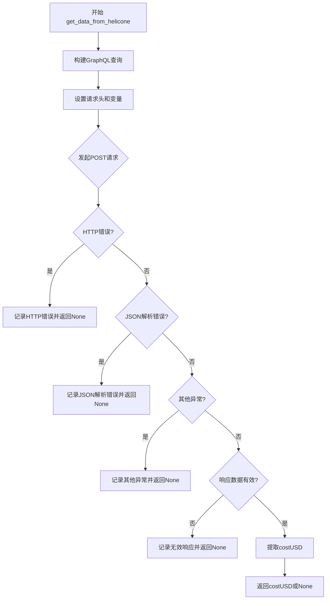
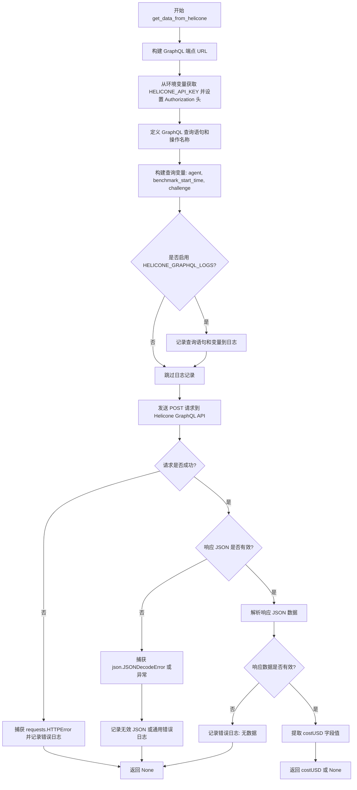

# `.\AutoGPT\classic\benchmark\agbenchmark\utils\get_data_from_helicone.py` 详细设计文档

该代码通过GraphQL查询Helicone API，根据挑战名称、代理名称和基准开始时间获取对应的成本数据(USD)。

## 整体流程



## 类结构

```
无类层次结构 (该文件仅包含全局函数)
```

## 全局变量及字段


### `logger`
    
用于记录日志的模块级变量，用于输出调试和错误信息

类型：`logging.Logger`
    


    

## 全局函数及方法


### `get_data_from_helicone`

该函数通过 GraphQL API 向 Helicone 查询特定挑战（challenge）下的代理（agent）执行成本（costUSD），返回美元计价的成本数据，若查询失败或无数据则返回 None。

参数：

- `challenge`：`str`，用于指定要查询的具体挑战标识符

返回值：`Optional[float]`，返回从 Helicone 获取的美元成本值（costUSD），若请求失败或数据缺失则返回 `None`

#### 流程图



#### 带注释源码

```python
import json
import logging
import os
from typing import Optional

import requests

# 导入基准测试开始时间常量，用于构建查询条件
from agbenchmark.__main__ import BENCHMARK_START_TIME
# 导入 Helicone GraphQL 日志开关常量
from agbenchmark.agent_interface import HELICONE_GRAPHQL_LOGS

# 获取当前模块的日志记录器
logger = logging.getLogger(__name__)


def get_data_from_helicone(challenge: str) -> Optional[float]:
    """
    从 Helicone 获取指定挑战的成本数据
    
    Args:
        challenge: 要查询的挑战标识符
        
    Returns:
        美元成本值，查询失败或无数据时返回 None
    """
    
    # 定义 Helicone GraphQL API 端点
    url = "https://www.helicone.ai/api/graphql"

    # 设置请求头，包含从环境变量获取的授权令牌
    # Helicone 使用 Bearer 认证方式
    headers = {"authorization": f"Bearer {os.environ.get('HELICONE_API_KEY')}"}

    # 定义 GraphQL 查询语句，用于获取聚合的 Helicone 请求成本
    # 查询 aggregatedHeliconeRequest 的 costUSD 字段
    query = """
query ExampleQuery($properties: [PropertyFilter!]){
  aggregatedHeliconeRequest(properties: $properties) {
    costUSD
  }
}
"""

    # 构建查询变量，包含三个过滤属性：
    # 1. agent - 从环境变量 AGENT_NAME 获取的代理名称
    # 2. benchmark_start_time - 基准测试开始时间
    # 3. challenge - 当前要查询的挑战标识符
    variables = {
        "properties": [
            {
                "value": {"equals": os.environ.get("AGENT_NAME")},
                "name": "agent",
            },
            {
                "value": {"equals": BENCHMARK_START_TIME},
                "name": "benchmark_start_time",
            },
            {"value": {"equals": challenge}, "name": "challenge"},
        ]
    }
    
    # 如果启用了 Helicone GraphQL 日志，则记录查询语句和变量
    if HELICONE_GRAPHQL_LOGS:
        logger.debug(f"Executing Helicone query:\n{query.strip()}")
        logger.debug(f"Query variables:\n{json.dumps(variables, indent=4)}")

    # GraphQL 操作名称
    operation_name = "ExampleQuery"

    # 初始化响应数据容器
    data = {}
    response = None

    try:
        # 发送 POST 请求到 Helicone GraphQL API
        # 包含查询语句、变量和操作名称
        response = requests.post(
            url,
            headers=headers,
            json={
                "query": query,
                "variables": variables,
                "operationName": operation_name,
            },
        )

        # 将响应 JSON 解析为 Python 字典
        data = response.json()
        
    # 处理 HTTP 错误（如 4xx、5xx 状态码）
    except requests.HTTPError as http_err:
        logger.error(f"Helicone returned an HTTP error: {http_err}")
        return None
        
    # 处理 JSON 解析错误（响应不是有效的 JSON 格式）
    except json.JSONDecodeError:
        raw_response = response.text  # type: ignore
        logger.error(
            f"Helicone returned an invalid JSON response: '''{raw_response}'''"
        )
        return None
        
    # 处理其他可能的异常
    except Exception as err:
        logger.error(f"Error while trying to get data from Helicone: {err}")
        return None

    # 验证响应数据的有效性
    if data is None or data.get("data") is None:
        logger.error("Invalid response received from Helicone: no data")
        logger.error(f"Offending response: {response}")
        return None
        
    # 从响应数据中提取 costUSD 字段值并返回
    # 数据结构: data -> aggregatedHeliconeRequest -> costUSD
    return (
        data.get("data", {}).get("aggregatedHeliconeRequest", {}).get("costUSD", None)
    )
```

## 关键组件


### GraphQL查询构建器

负责构建 Helicone GraphQL 查询的请求参数，包括查询语句、变量和操作名称。使用 `aggregatedHeliconeRequest` 查询获取指定代理在特定基准测试下的成本数据。

### HTTP请求发送器

通过 `requests.post` 发送 GraphQL 查询到 Helicone API 端点，包含授权头（Bearer token）和 JSON 格式的请求体。处理与 Helicone 服务器的网络通信。

### 错误处理与日志记录模块

捕获多种异常情况：HTTP 错误、JSON 解析错误和通用异常。记录详细的错误日志用于调试，并返回 `None` 表示查询失败。

### 响应解析器

解析 Helicone API 返回的 JSON 响应，通过嵌套的字典访问提取 `costUSD` 字段。验证响应结构的完整性，确保数据存在。

### 环境变量读取器

从操作系统环境变量读取 `HELICONE_API_KEY` 和 `AGENT_NAME`，以及从 `agbenchmark.__main__` 导入的 `BENCHMARK_START_TIME` 时间戳，用于构建查询变量。

### 条件日志模块

根据 `HELICONE_GRAPHQL_LOGS` 标志位决定是否记录详细的查询信息（查询语句和变量），在调试时输出完整的 GraphQL 请求内容。


## 问题及建议


### 已知问题

-   **硬编码的API端点URL** - GraphQL服务器地址直接写在代码中，缺乏配置灵活性
-   **缺少请求超时设置** - `requests.post`未设置timeout参数，可能导致线程无限阻塞
-   **环境变量未验证** - `HELICONE_API_KEY`和`AGENT_NAME`未检查存在性或有效性，缺失时会产生隐式错误
-   **日志可能泄露敏感数据** - 启用`HELICONE_GRAPHQL_LOGS`时会打印完整查询变量，可能包含敏感信息
-   **异常处理粒度过粗** - 最后一个`except Exception`捕获所有异常，掩盖了具体错误类型
-   **缺少重试机制** - 网络不稳定时没有重试逻辑，失败直接返回None
-   **响应体解析链式调用风险** - 多层`.get()`嵌套调用，任意一层结构变化都会导致错误
-   **未处理HTTP状态码** - 只捕获了请求异常，未检查`response.status_code`是否为成功状态
-   **缺少缓存机制** - 相同challenge的重复查询会产生不必要的API调用
-   **可选依赖未做防御性检查** - 依赖`requests`库但未在文档中强调版本要求

### 优化建议

-   将URL配置化，支持通过环境变量或配置文件传入
-   为`requests.post`添加合理的timeout参数（如10秒）
-   在函数入口处验证必要的环境变量，不存在时抛出明确的配置错误
-   敏感日志输出前对变量进行脱敏处理（如只打印challenge前几位）
-   区分不同异常类型，针对网络超时、连接错误等分别处理
-   添加重试装饰器（如`tenacity`库）处理临时性网络故障
-   增加`response.status_code`的非200状态码处理逻辑
-   考虑实现内存缓存或使用`functools.lru_cache`缓存相同challenge的查询结果
-   将响应解析逻辑提取为独立的验证函数，提高可测试性

## 其它


### 设计目标与约束

本模块旨在从Helicone平台获取特定代理在基准测试中的运行成本数据，支持成本监控和预算分析。设计约束包括：仅支持Python 3.x环境，需配置HELICONE_API_KEY和AGENT_NAME环境变量，依赖requests和json标准库，网络请求超时时间未显式设置需依赖requests默认超时。

### 错误处理与异常设计

本函数采用分层异常捕获策略处理三类错误：1) HTTP错误（requests.HTTPError）记录为error级别日志并返回None；2) JSON解析错误（json.JSONDecodeError）捕获响应原文用于调试；3) 通用异常（Exception）作为最后防线捕获未预期错误。响应数据校验分为两层：先检查data字段存在性，再逐级提取嵌套的aggregatedHeliconeRequest.costUSD字段，任何一层缺失均返回None并记录详细错误信息。当前设计存在异常信息泄露风险，建议对敏感环境变量进行脱敏处理。

### 外部依赖与接口契约

外部依赖包括：requests库（HTTP客户端）、json库（响应解析）、os库（环境变量读取）、logging库（日志输出）。外部接口为Helicone GraphQL API（https://www.helicone.ai/api/graphql），接口契约要求：请求方法为POST，请求头需包含Bearer认证令牌，请求体格式为JSON且包含query、variables、operationName三个字段。返回数据遵循GraphQL标准格式，costUSD字段为浮点数类型。

### 配置管理

配置通过环境变量实现：HELICONE_API_KEY（必需，用于API认证）、AGENT_NAME（必需，作为查询条件）、BENCHMARK_START_TIME（从agbenchmark.__main__导入，用于时间范围过滤）。当前实现缺少环境变量缺失时的明确提示，建议添加启动校验逻辑。HELICONE_GRAPHQL_LOGS控制调试日志开关，默认为False以避免生产环境日志泛滥。

### 日志策略

日志采用Python标准logging模块，logger名称为模块名（__name__）。DEBUG级别日志输出GraphQL查询语句和变量JSON，用于问题诊断；ERROR级别日志记录各类异常和无效响应，便于运维监控。当前未设置日志格式和级别，建议在调用处统一配置日志格式和handler。

### 性能考虑

当前实现未设置请求超时，可能导致无限期等待；未实现重试机制，网络抖动时直接失败；未使用连接池复用，每次调用创建新HTTP连接。建议配置requests超时参数（如timeout=10），添加指数退避重试逻辑，考虑使用requests.Session()复用连接。

### 安全性考虑

API密钥通过环境变量传入符合安全实践，但日志中可能输出敏感查询信息（当HELICONE_GRAPHQL_LOGS=True时）。建议在调试日志中过滤authorization头。此外，代码未验证SSL证书有效性，生产环境建议添加verify参数或配置自定义CA证书。

### 测试策略建议

建议补充以下测试用例：1) 环境变量缺失时的异常处理；2) HTTP响应非200状态码的处理；3) 响应JSON结构异常的处理；4) costUSD字段类型错误（如字符串）的处理；5) 网络超时场景；6) 模拟Helicone API返回空数据的边界情况。

### 监控与告警建议

当前实现通过日志输出错误，建议补充：1) 记录函数调用成功率和平均响应时间；2) 对连续失败场景触发告警；3) 监控HELICONE_API_KEY即将过期的预警机制。

### 版本兼容性说明

依赖的requests库需版本>=2.18.0以支持完整的异常类层次。Python版本需>=3.6以支持f-string日志格式。Helicone API版本需与代码中定义的GraphQL查询结构匹配，当前使用固定查询模板，API升级可能导致兼容性问题。


    