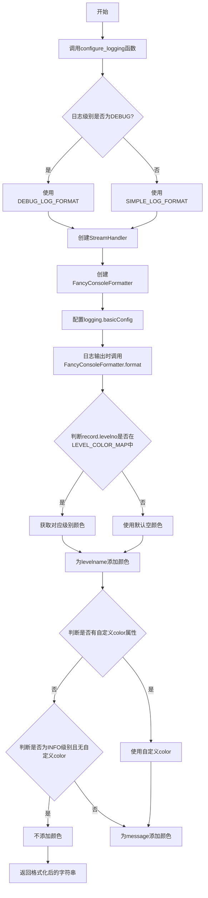
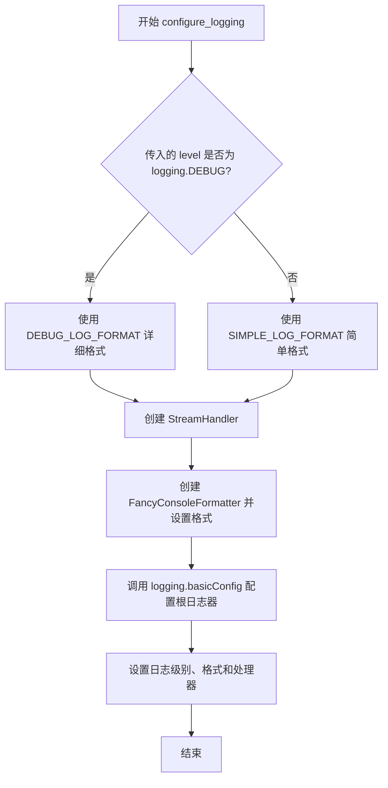
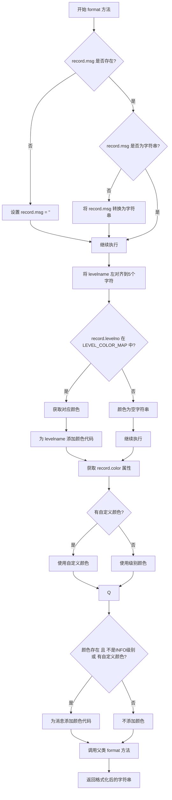

# `.\AutoGPT\classic\benchmark\agbenchmark\utils\logging.py` 详细设计文档

这是一个日志配置模块，提供自定义的彩色控制台日志Formatter，支持根据日志级别为日志消息添加不同颜色的高亮显示，增强控制台输出的可读性。

## 整体流程



## 类结构

```
模块 (logging_config.py)
├── 全局变量
│   ├── SIMPLE_LOG_FORMAT
│   └── DEBUG_LOG_FORMAT
├── 全局函数
│   └── configure_logging
└── 类
    └── FancyConsoleFormatter (继承logging.Formatter)
        ├── 类属性
        │   └── LEVEL_COLOR_MAP
        └── 实例方法
            └── format
```

## 全局变量及字段


### `SIMPLE_LOG_FORMAT`
    
简单日志格式字符串，用于非调试级别的日志输出

类型：`str`
    


### `DEBUG_LOG_FORMAT`
    
调试日志格式字符串，包含文件名和行号信息

类型：`str`
    


### `configure_logging`
    
配置日志模块的全局设置，包括日志级别和格式化器

类型：`function`
    


### `FancyConsoleFormatter.LEVEL_COLOR_MAP`
    
日志级别到颜色的映射字典，用于控制不同级别日志的颜色输出

类型：`dict[int, str]`
    
    

## 全局函数及方法


### `configure_logging`

该函数用于配置 Python 标准库中的 logging 模块，根据传入的日志级别自动选择合适的日志格式，并创建一个带有颜色编码的自定义控制台格式化器（FancyConsoleFormatter），最终将日志输出到控制台。

参数：

- `level`：`int`，日志级别，默认为 `logging.INFO`，用于控制日志输出的详细程度

返回值：`None`，该函数仅配置日志系统，不返回任何值

#### 流程图



#### 带注释源码

```python
def configure_logging(
    level: int = logging.INFO,
) -> None:
    """Configure the native logging module."""

    # Auto-adjust default log format based on log level
    # 根据日志级别自动调整日志格式：如果级别为 DEBUG，则使用详细格式（包含文件名和行号）
    # 否则使用简单格式
    log_format = DEBUG_LOG_FORMAT if level == logging.DEBUG else SIMPLE_LOG_FORMAT

    # 创建一个流处理器，将日志输出到标准输出（控制台）
    console_handler = logging.StreamHandler()
    # 为处理器设置自定义的彩色格式化器
    console_handler.setFormatter(FancyConsoleFormatter(log_format))

    # Configure the root logger
    # 配置根日志记录器，这是 Python 日志系统的核心
    # level: 设置日志级别
    # format: 设置日志格式
    # handlers: 设置日志处理器（这里是带颜色格式化的控制台处理器）
    logging.basicConfig(
        level=level,
        format=log_format,
        handlers=[console_handler],
    )
```


### `FancyConsoleFormatter.format`

该方法负责格式化日志记录，支持根据日志级别对控制台输出进行彩色渲染，包括为日志级别名称和消息内容添加颜色代码，并在日志级别为 INFO 时智能处理自定义颜色。

参数：

- `self`：`FancyConsoleFormatter`，当前 formatter 实例
- `record`：`logging.LogRecord`，日志记录对象，包含日志级别、消息、时间等信息

返回值：`str`，格式化后的日志字符串，包含颜色代码（如果适用）

#### 流程图



#### 带注释源码

```python
def format(self, record: logging.LogRecord) -> str:
    """
    格式化日志记录为字符串，支持彩色输出。
    
    参数:
        record: logging.LogRecord 对象，包含日志记录的所有信息
        
    返回:
        格式化后的日志字符串，包含可选的颜色代码
    """
    
    # 确保 record.msg 是字符串类型，避免后续格式化错误
    if not hasattr(record, "msg"):
        # 如果记录没有 msg 属性，设置为空字符串
        record.msg = ""
    elif not type(record.msg) is str:
        # 如果 msg 不是字符串，转换为字符串（如异常对象等）
        record.msg = str(record.msg)

    # 将日志级别名称左对齐到至少5个字符，保证输出对齐美观
    # 例如 'INFO ' vs 'ERROR'（已满5字符无需填充）
    record.levelname = record.levelname.ljust(5)

    # 根据日志级别确定默认颜色，初始化为空字符串
    level_color = ""
    if record.levelno in self.LEVEL_COLOR_MAP:
        # 如果日志级别在颜色映射表中，获取对应颜色
        level_color = self.LEVEL_COLOR_MAP[record.levelno]
        # 为级别名称添加颜色，使用颜色代码包裹并用 RESET_ALL 重置
        record.levelname = f"{level_color}{record.levelname}{Style.RESET_ALL}"

    # 获取消息的自定义颜色（如果指定了 color 属性）
    # 默认使用级别颜色
    color = getattr(record, "color", level_color)
    # 检查是否明确指定了颜色（区别于默认级别颜色）
    color_is_specified = hasattr(record, "color")

    # INFO 级别默认不显示颜色，除非明确指定了自定义颜色
    # 这是为了保持日志输出的整洁性
    if color and (record.levelno != logging.INFO or color_is_specified):
        # 为消息内容添加颜色代码
        record.msg = f"{color}{record.msg}{Style.RESET_ALL}"

    # 调用父类的 format 方法完成最终格式化
    return super().format(record)
```

---

#### 关键组件信息

| 组件名称 | 描述 |
|---------|------|
| `FancyConsoleFormatter` | 自定义日志格式化器，支持根据日志级别对控制台输出进行彩色渲染 |
| `LEVEL_COLOR_MAP` | 类属性字典，映射日志级别到对应的颜色代码 |
| `SIMPLE_LOG_FORMAT` | 简单日志格式字符串，不包含文件名和行号 |
| `DEBUG_LOG_FORMAT` | 调试日志格式字符串，包含文件名和行号信息 |
| `configure_logging` | 配置日志系统的全局函数，根据日志级别选择格式 |

#### 潜在的技术债务或优化空间

1. **颜色映射硬编码**：级别颜色映射使用硬编码的字典，可以考虑从配置文件或环境变量加载
2. **字符串拼接性能**：大量使用 f-string 拼接颜色代码，在高频日志场景下可能存在性能优化空间
3. **缺少对更多日志级别的支持**：只支持预定义的几个级别，自定义日志级别无法获得颜色支持
4. **颜色重置时机**：使用 `Style.RESET_ALL` 重置颜色，在某些终端下可能影响性能，可以考虑使用 `Style.NORMAL` 或显式颜色码

#### 其它项目

**设计目标与约束**：
- 目标：提供美观、可读性强的彩色控制台日志输出
- 约束：依赖 `colorama` 库实现跨平台颜色支持

**错误处理与异常设计**：
- 对 `record.msg` 进行类型检查和转换，确保始终为字符串类型
- 使用 `getattr` 安全获取属性，避免属性不存在时的异常

**数据流与状态机**：
- 输入：原始 `LogRecord` 对象
- 处理：属性检查 → 字符串转换 → 级别名称格式化 → 颜色确定 → 消息着色
- 输出：包含 ANSI 颜色代码的格式化字符串

**外部依赖与接口契约**：
- 依赖 `colorama` 库的 `Fore` 和 `Style` 常量
- 依赖 Python 标准库 `logging` 模块的 `Formatter` 基类和 `LogRecord` 对象
- 接口符合 `logging.Formatter` 的 `format(record)` 方法签名

## 关键组件


### configure_logging 函数

日志系统配置入口，根据传入的日志级别自动选择合适的日志格式（简单格式或调试格式），并设置自定义的FancyConsoleFormatter彩色格式化器。

### FancyConsoleFormatter 类

自定义日志格式化器，为控制台输出添加颜色编码功能。通过LEVEL_COLOR_MAP将不同日志级别映射到不同颜色，支持通过record.color属性自定义消息颜色，并确保日志级别名称至少5个字符以对齐输出。

### LEVEL_COLOR_MAP 类属性

日志级别到颜色的映射表，定义了DEBUG、INFO、WARNING、ERROR、CRITICAL五个级别分别对应的colorama颜色代码。

### SIMPLE_LOG_FORMAT 常量

标准日志格式字符串，包含时间戳、日志级别和消息内容，用于非调试级别的日志输出。

### DEBUG_LOG_FORMAT 常量

调试日志格式字符串，包含时间戳、日志级别、文件名和行号信息，用于调试级别的详细日志输出。

### FancyConsoleFormatter.format 方法

格式化单条日志记录的核心方法，处理消息类型转换、级别名称对齐、颜色应用等逻辑，返回带颜色装饰的格式化字符串。


## 问题及建议


### 已知问题

-   **日志格式重复配置**：`configure_logging` 函数中 `logging.basicConfig` 的 `format` 参数与 `console_handler.setFormatter` 设置了相同的格式，造成冗余配置
-   **类型检查使用 `is` 比较**：`if not type(record.msg) is str:` 使用 `is` 比较类型而非 `isinstance()`，不够健壮且可能在某些情况下失效
-   **缺少依赖错误处理**：代码依赖 `colorama` 库，但未处理库缺失的情况，会导致 `ImportError`
-   **多次调用导致 handler 重复**：`configure_logging` 可被多次调用，每次调用都会向 root logger 添加新的 handler，可能导致日志重复输出
-   **颜色查找使用 `in` 判断**：`if record.levelno in self.LEVEL_COLOR_MAP:` 每次都进行字典键查找，可考虑使用 `dict.get()` 简化
-   **日志级别设置不完整**：`logging.basicConfig(level=level)` 设置的是 root logger 级别，但 handler 的级别默认继承 root logger，可能需要显式设置
-   **缺少显式返回注释**：函数返回 `None` 类型声明正确，但缺少 `return` 语句（虽然隐式返回 None 是 Python 特性）

### 优化建议

-   使用 `isinstance(record.msg, str)` 替代 `type(record.msg) is str` 进行类型检查，提高健壮性
-   添加 colorama 导入错误处理，如使用 `try-except` 包装或添加依赖说明
-   在 `configure_logging` 开头添加 `logging.getLogger().handlers.clear()` 或检查已有 handler，避免重复添加
-   使用 `self.LEVEL_COLOR_MAP.get(record.levelno, "")` 替代 `in` 判断 + 访问模式，简化代码
-   考虑将 `LEVEL_COLOR_MAP` 设计为可配置的类属性或实例属性，提高灵活性
-   添加类型注解的完整导入：`from typing import Callable` 等（若后续扩展）

## 其它


### 设计目标与约束

该模块的设计目标是提供一个简单易用的日志配置功能，支持彩色控制台输出，提升开发调试体验。约束条件包括：仅支持控制台输出，不支持文件日志；依赖colorama库进行跨平台颜色支持；日志格式根据日志级别自动调整。

### 错误处理与异常设计

模块本身不抛出业务异常，主要依赖Python标准logging模块的异常处理机制。若colorama未安装，颜色功能将失效但不影响日志基本功能。若日志级别非法，默认使用INFO级别。format方法中已处理msg为空和非字符串的情况。

### 数据流与状态机

数据流：调用configure_logging() -> 创建StreamHandler -> 创建FancyConsoleFormatter -> 配置logging.basicConfig() -> 日志输出时调用Formatter.format() -> 颜色渲染 -> 最终输出。状态机主要体现在日志级别的处理，DEBUG级别使用详细格式，其他级别使用简单格式。

### 外部依赖与接口契约

外部依赖：colorama库用于跨平台终端颜色控制；logging模块为Python标准库。接口契约：configure_logging(level)函数接受logging模块的日志级别常量，默认logging.INFO，返回None。FancyConsoleFormatter继承logging.Formatter，需保持与父类format方法的返回值兼容性。

### 配置参数说明

configure_logging的level参数：接受logging.DEBUG、logging.INFO、logging.WARNING、logging.ERROR、logging.CRITICAL五个级别，默认INFO。FancyConsoleFormatter的LEVEL_COLOR_MAP：定义了日志级别到颜色的映射表，支持DEBUG(浅黑)、INFO(蓝)、WARNING(黄)、ERROR(红)、CRITICAL(亮红)。

### 使用示例

```python
# 基础使用
import logging
from logger_config import configure_logging

configure_logging()
logging.info("这是一条信息日志")

# 调试模式
configure_logging(logging.DEBUG)
logging.debug("这是一条调试日志")

# 手动设置颜色
logging.warning("警告信息", extra={"color": Fore.GREEN})
```

### 性能考虑

颜色渲染在每条日志输出时执行，字符串拼接操作可能对高频日志场景造成一定性能影响。建议生产环境使用非彩色格式。LEVEL_COLOR_MAP使用字典查找，时间复杂度为O(1)。

### 安全性考虑

代码不涉及用户输入处理，无明显安全风险。日志内容来自开发者可控的msg参数，但需注意避免在日志中输出敏感信息。颜色控制码使用Style.RESET_ALL正确重置，避免样式泄漏。

### 兼容性考虑

依赖Python 3.7+（因使用from __future__ import annotations）。colorama库需单独安装（pip install colorama）。在Windows系统上需调用colorama.init()才能正确显示颜色，当前代码未显式调用init()，依赖StreamHandler自动初始化。在不支持颜色的终端上，颜色控制码会以转义序列形式显示，但不影响日志可读性。

### 测试策略

建议编写单元测试验证：不同日志级别输出正确颜色；空消息和非字符串消息处理正确；日志格式符合预期；INFO级别默认不着色但手动指定颜色时生效。集成测试可验证在真实终端环境下的显示效果。

### 部署和集成

该模块为独立配置模块，可通过pip安装colorama后直接导入使用。建议在应用入口处调用configure_logging()进行初始化。可通过环境变量或配置文件扩展支持文件日志输出。


    