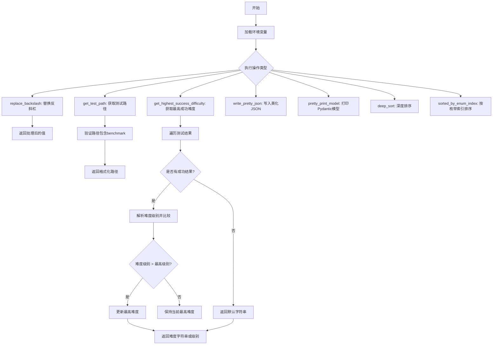
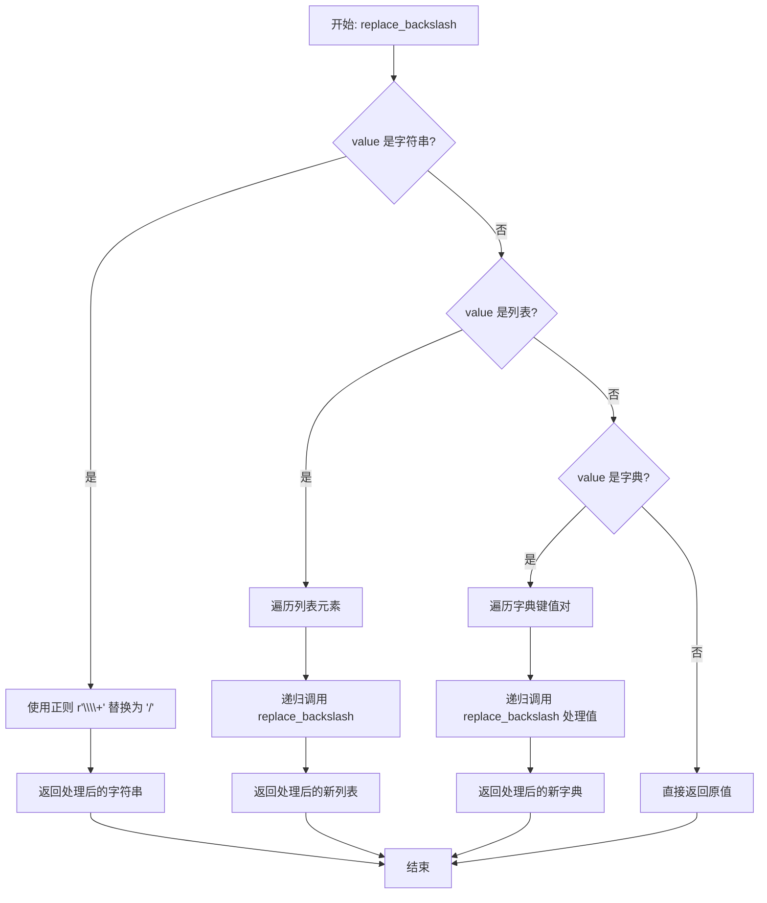
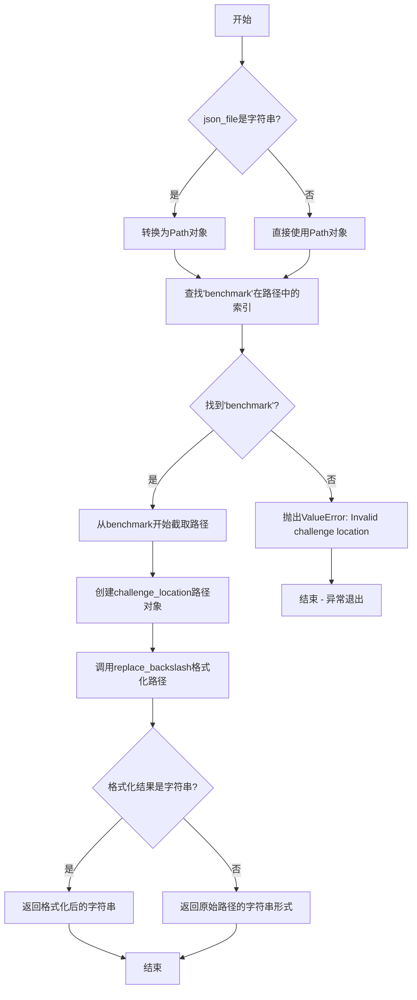
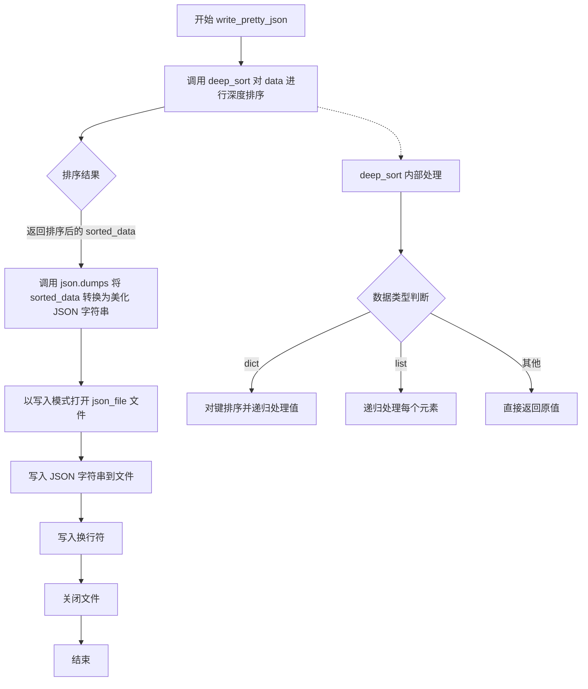
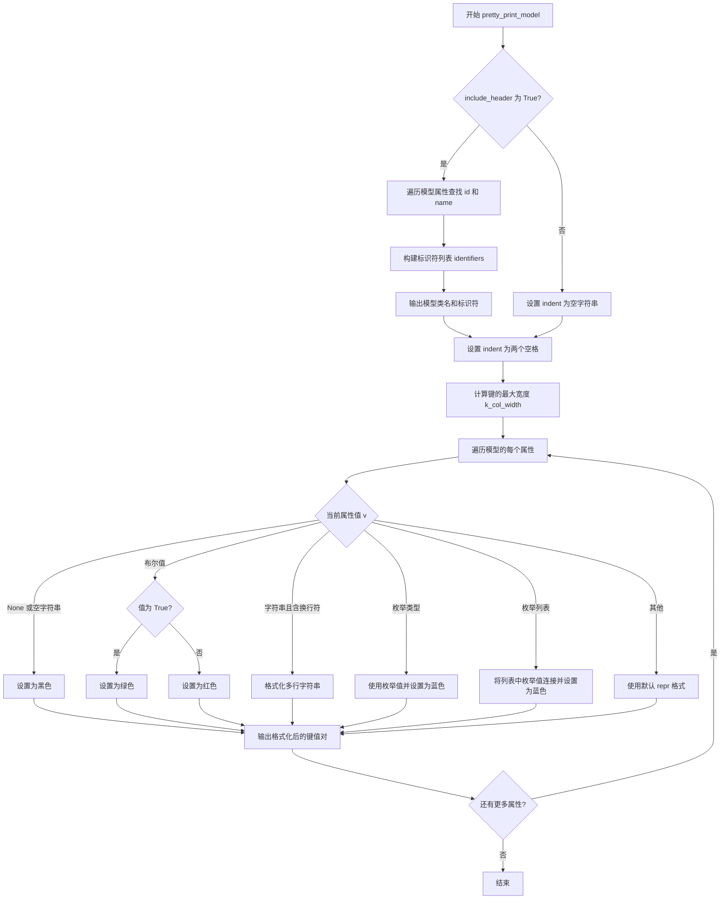
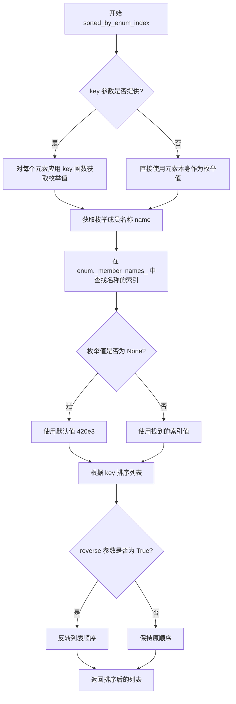

# `.\AutoGPT\classic\benchmark\agbenchmark\utils\utils.py` 详细设计文档

该代码文件是一个测试结果处理和工具函数模块，主要提供JSON数据处理（替换反斜杠、美化输出、深度排序）、测试结果分析（获取最高成功难度）、Pydantic模型格式化打印以及按照枚举索引排序等工具函数，用于支撑AG-Benchmark测试框架的报告生成和数据展示功能。

## 整体流程



## 类结构

```
该文件无类定义，全部为模块级函数和全局变量
所有函数均为模块级函数（Module-level functions）
无继承层次结构（Flat structure with standalone functions）
```

## 全局变量及字段


### `AGENT_NAME`
    
从环境变量读取的代理名称

类型：`Optional[str]`
    


### `logger`
    
模块级日志记录器，用于记录程序运行过程中的日志信息

类型：`logging.Logger`
    


### `T`
    
类型变量（TypeVar），用于泛型函数，支持类型推断

类型：`TypeVar`
    


### `E`
    
类型变量（TypeVar），绑定到Enum，用于枚举类型的泛型约束

类型：`TypeVar`
    


    

## 全局函数及方法


### `replace_backslash`

该函数是一个递归工具函数，用于将字符串、列表和字典中的反斜杠（`\`）替换为正斜杠（`/`），支持嵌套结构的统一处理。

参数：

- `value`：`Any`，需要处理的值，可以是字符串、列表、字典或任意其他类型

返回值：`Any`，处理后的值。字符串中的反斜杠被替换为正斜杠；列表和字典会递归处理其元素；其他类型原样返回。

#### 流程图



#### 带注释源码

```python
def replace_backslash(value: Any) -> Any:
    """
    递归替换字符串、列表、字典中的反斜杠为正斜杠
    
    参数:
        value: Any，需要处理的值
        
    返回:
        Any，处理后的值
    """
    # 如果是字符串，使用正则表达式替换
    # r"\\+" 匹配一个或多个反斜杠
    # 将其替换为单个正斜杠 "/"
    if isinstance(value, str):
        return re.sub(
            r"\\+", "/", value
        )  # replace one or more backslashes with a forward slash
    # 如果是列表，递归处理每个元素并返回新列表
    elif isinstance(value, list):
        return [replace_backslash(i) for i in value]
    # 如果是字典，递归处理每个值并返回新字典
    elif isinstance(value, dict):
        return {k: replace_backslash(v) for k, v in value.items()}
    # 其他类型直接返回原值
    else:
        return value
```


### `get_test_path`

从JSON文件路径中提取并格式化benchmark路径，返回从"benchmark"目录开始的相对路径字符串。

参数：

- `json_file`：`str | Path`，JSON文件的完整路径

返回值：`str`，从"benchmark"目录开始的格式化相对路径

#### 流程图



#### 带注释源码

```python
def get_test_path(json_file: str | Path) -> str:
    """
    从JSON文件路径中提取并格式化benchmark路径
    
    该函数接收一个JSON文件的完整路径，从中提取从'benchmark'目录
    开始的相对路径，并将路径中的反斜杠替换为正斜杠，生成标准化的
    路径格式。
    
    Args:
        json_file: JSON文件的路径，可以是字符串或Path对象
        
    Returns:
        str: 从'benchmark'目录开始的格式化相对路径
        
    Raises:
        ValueError: 当路径中找不到'benchmark'目录时抛出
    """
    # 如果是字符串形式，转换为Path对象以方便处理路径部分
    if isinstance(json_file, str):
        json_file = Path(json_file)

    # 查找路径中"benchmark"部分的索引位置
    try:
        # Path.parts将路径分解为各个目录/文件名组成的元组
        # 例如: Path("/home/user/project/agbenchmark/challenges/test.json").parts
        # 返回: ('/', 'home', 'user', 'project', 'agbenchmark', 'challenges', 'test.json')
        agbenchmark_index = json_file.parts.index("benchmark")
    except ValueError:
        # 如果路径中不包含'benchmark'目录，抛出异常
        raise ValueError("Invalid challenge location.")

    # 从"benchmark"开始截取路径部分，创建新的相对路径
    # 使用切片从agbenchmark_index到末尾
    challenge_location = Path(*json_file.parts[agbenchmark_index:])

    # 调用replace_backslash函数将反斜杠替换为正斜杠
    # 这确保了路径在不同操作系统上的一致性
    formatted_location = replace_backslash(str(challenge_location))
    
    # 确保返回值始终是字符串类型
    if isinstance(formatted_location, str):
        return formatted_location
    else:
        # 理论上formatted_location应该是字符串，但做防御性检查
        return str(challenge_location)
```

#### 辅助函数调用链

```
get_test_path
    └── replace_backslash  (用于标准化路径分隔符)
```


### `get_highest_success_difficulty`

该函数分析测试数据字典，遍历每个测试的结果，筛选出至少有一个成功结果的测试，然后根据预定义的难度映射表（DIFFICULTY_MAP）找出这些成功测试中的最高难度级别，并返回对应的难度等级字符串或带数值的字符串表示。

参数：

- `data`：`dict[str, Test]`，包含测试名称到 Test 对象的映射字典，用于分析哪些测试成功及其对应的难度级别
- `just_string`：`Optional[bool]`，可选参数，当设为 True 时仅返回难度等级名称字符串，否则返回 "等级名称: 数值" 格式

返回值：`str`，返回最高成功难度级别的字符串表示，若无成功测试则返回 "No successful tests"

#### 流程图

```mermaid
flowchart TD
    A[开始] --> B[初始化 highest_difficulty = None<br/>highest_difficulty_level = 0]
    B --> C{遍历 data 中的每个 test_name, test_data}
    C --> D{检查 test_data.results 中<br/>是否有 any success = True}
    D -->|否| C
    D -->|是| E{获取 difficulty_str}
    E --> F{difficulty_str 是否为空}
    F -->|是| C
    F -->|否| G[尝试将 difficulty_str<br/>转换为 DifficultyLevel 枚举]
    G --> H{转换是否成功}
    H -->|否| I[记录警告日志<br/>跳过当前测试]
    H -->|是| J[从 DIFFICULTY_MAP<br/>获取难度数值]
    J --> K{difficulty_level ><br/>highest_difficulty_level}
    K -->|否| C
    K -->|是| L[更新 highest_difficulty = difficulty_enum<br/>highest_difficulty_level = difficulty_level]
    L --> C
    C -->|遍历结束| M{highest_difficulty 不为 None}
    M -->|否| N[返回 'No successful tests']
    M -->|是| O{just_string 为 True<br/>且 highest_difficulty_level 不为 0}
    O -->|是| P[返回 highest_difficulty.name<br/>即难度名称字符串]
    O -->|否| Q[返回 f'{highest_difficulty_str}:<br/>{highest_difficulty_level}']
    
    style N fill:#ffcccc
    style P fill:#ccffcc
    style Q fill:#ccffcc
```

#### 带注释源码

```python
def get_highest_success_difficulty(
    data: dict[str, Test], just_string: Optional[bool] = None
) -> str:
    """分析测试数据，返回最高成功难度级别
    
    Args:
        data: 包含测试名称到 Test 对象映射的字典
        just_string: 可选布尔值，控制在返回字符串中是否包含难度数值
        
    Returns:
        最高成功难度级别的字符串表示，格式为 "LEVEL: number" 或仅 "LEVEL"
    """
    # 初始化最高难度变量，difficulty_level 默认为 0 用于数值比较
    highest_difficulty = None
    highest_difficulty_level = 0

    # 遍历所有测试数据，test_name 为键，test_data 为 Test 对象
    for test_name, test_data in data.items():
        try:
            # 检查该测试是否至少有一个成功的结果
            if any(r.success for r in test_data.results):
                # 获取测试的难度字符串（如 "hard", "medium", "easy"）
                difficulty_str = test_data.difficulty
                if not difficulty_str:
                    # 难度字符串为空则跳过该测试
                    continue

                try:
                    # 将难度字符串转换为 DifficultyLevel 枚举（忽略大小写）
                    difficulty_enum = DifficultyLevel[difficulty_str.lower()]
                    # 从 DIFFICULTY_MAP 获取该难度等级对应的数值
                    difficulty_level = DIFFICULTY_MAP[difficulty_enum]

                    # 如果当前难度数值高于历史最高，则更新记录
                    if difficulty_level > highest_difficulty_level:
                        highest_difficulty = difficulty_enum
                        highest_difficulty_level = difficulty_level
                except KeyError:
                    # 难度字符串不在预定义枚举中，记录警告并跳过
                    logger.warning(
                        f"Unexpected difficulty level '{difficulty_str}' "
                        f"in test '{test_name}'"
                    )
                    continue
        except Exception as e:
            # 捕获分析过程中的意外错误，记录完整上下文供维护人员排查
            logger.warning(
                "An unexpected error [1] occurred while analyzing report [2]."
                "Please notify a maintainer.\n"
                f"Report data [1]: {data}\n"
                f"Error [2]: {e}"
            )
            logger.warning(
                "Make sure you selected the right test, no reports were generated."
            )
            # 遇到错误时跳出循环，避免影响后续处理
            break

    # 将枚举转换为字符串形式（如 DifficultyLevel.hard -> "hard"）
    if highest_difficulty is not None:
        highest_difficulty_str = highest_difficulty.name  # convert enum to string
    else:
        highest_difficulty_str = ""

    # 根据 just_string 参数决定返回格式
    if highest_difficulty_level and not just_string:
        # 返回 "DIFFICULTY: level" 格式，包含数值信息
        return f"{highest_difficulty_str}: {highest_difficulty_level}"
    elif highest_difficulty_str:
        # 仅返回难度名称字符串
        return highest_difficulty_str
    # 无成功测试时返回提示信息
    return "No successful tests"
```


### `write_pretty_json`

将数据通过 `deep_sort` 函数进行深度排序后，使用 `json.dumps` 转换为带缩进的美化格式字符串，然后写入指定的 JSON 文件。

参数：

- `data`：`Any`，需要写入的原始数据（通常为字典或列表等 JSON 兼容对象）
- `json_file`：str 或 Path，目标 JSON 文件路径

返回值：`None`，该函数无返回值，仅执行文件写入操作

#### 流程图



#### 带注释源码

```python
def write_pretty_json(data, json_file):
    """
    将数据深度排序后以美化格式写入JSON文件
    
    Args:
        data: 需要写入的任意JSON兼容数据（dict, list, str, int, float, bool, None等）
        json_file: 目标文件路径，支持str或Path类型
    
    Returns:
        None
    
    Raises:
        IOError: 当文件写入失败时抛出
        TypeError: 当data包含不可JSON序列化的对象时抛出
    """
    # Step 1: 对数据进行深度排序，使输出的JSON键按字母顺序排列
    # 调用 deep_sort 函数递归处理嵌套的字典和列表
    sorted_data = deep_sort(data)
    
    # Step 2: 将排序后的数据转换为带缩进的美化JSON字符串
    # indent=4 表示使用4个空格进行缩进，提高可读性
    json_graph = json.dumps(sorted_data, indent=4)
    
    # Step 3: 打开目标文件并写入JSON内容
    # 使用 'w' 模式会覆盖原有文件内容
    with open(json_file, "w") as f:
        # 写入序列化后的JSON字符串
        f.write(json_graph)
        # 写入换行符，确保文件末尾有换行符（符合POSIX文本文件规范）
        f.write("\n")


def deep_sort(obj):
    """
    递归排序JSON对象中的键
    
    辅助函数，用于对字典的键进行深度排序，
    确保输出的JSON文件具有一致的键顺序，便于版本控制和代码审查。
    
    Args:
        obj: 任意Python对象
    
    Returns:
        排序后的同类型对象
    
    Examples:
        >>> deep_sort({'b': 1, 'a': 2})
        {'a': 2, 'b': 1}
        >>> deep_sort([{'b': 1, 'a': 2}, {'d': 3, 'c': 4}])
        [{'a': 2, 'b': 1}, {'c': 4, 'd': 3}]
    """
    # 如果是字典，对键进行排序并递归处理每个值
    if isinstance(obj, dict):
        return {k: deep_sort(v) for k, v in sorted(obj.items())}
    
    # 如果是列表，递归处理每个元素
    if isinstance(obj, list):
        return [deep_sort(elem) for elem in obj]
    
    # 其他类型（str, int, float, bool, None等）直接返回
    return obj
```


### `pretty_print_model`

该函数用于美化打印Pydantic模型实例，支持彩色输出和格式化的模型属性展示，能够根据属性值的类型（枚举、布尔值、字符串等）自动应用不同的颜色样式，并可选地显示模型头部信息（包含模型类名及标识符）。

参数：

- `model`：`BaseModel`，Pydantic模型实例，要打印的模型对象
- `include_header`：`bool`，可选参数（默认为 `True`），是否在输出中包含模型类名和标识符头部信息

返回值：`None`，该函数直接输出到标准输出，不返回任何值

#### 流程图



#### 带注释源码

```python
def pretty_print_model(model: BaseModel, include_header: bool = True) -> None:
    """
    美化打印 Pydantic 模型，支持彩色输出
    
    参数:
        model: Pydantic BaseModel 实例
        include_header: 是否包含模型类名和标识符头部
    """
    indent = ""  # 缩进字符，初始为空
    
    if include_header:
        # 尝试查找模型的 ID 和/或 name 属性作为标识符
        id, name = None, None
        for attr, value in model.model_dump().items():
            if attr == "id" or attr.endswith("_id"):  # 匹配 id 或 xxx_id 属性
                id = value
            if attr.endswith("name"):  # 匹配 xxx_name 属性
                name = value
            if id and name:  # 找到两者后提前退出
                break
        
        # 过滤出非空的标识符
        identifiers = [v for v in [name, id] if v]
        
        # 输出模型类名，格式如: ModelName['name', 'id']:
        click.echo(
            f"{model.__repr_name__()}{repr(identifiers) if identifiers else ''}:"
        )
        indent = " " * 2  # 设置后续输出的缩进为两个空格

    # 计算所有键的最大宽度，用于对齐
    k_col_width = max(len(k) for k in model.model_dump().keys())
    
    # 遍历模型的所有属性并格式化输出
    for k, v in model.model_dump().items():
        v_fmt = repr(v)  # 默认使用 repr 格式化值
        
        # 根据值类型应用不同的颜色样式
        if v is None or v == "":
            # None 或空字符串显示为黑色
            v_fmt = click.style(v_fmt, fg="black")
        elif type(v) is bool:
            # 布尔值：真为绿色，假为红色
            v_fmt = click.style(v_fmt, fg="green" if v else "red")
        elif type(v) is str and "\n" in v:
            # 包含换行符的字符串进行多行格式化
            v_fmt = f"\n{v}".replace(
                "\n", f"\n{indent} {click.style('|', fg='black')} "
            )
        
        # 枚举类型的特殊处理
        if isinstance(v, Enum):
            # 单个枚举值显示为蓝色
            v_fmt = click.style(v.value, fg="blue")
        elif type(v) is list and len(v) > 0 and isinstance(v[0], Enum):
            # 枚举列表将所有值连接并显示为蓝色
            v_fmt = ", ".join(click.style(lv.value, fg="blue") for lv in v)
        
        # 输出格式化后的键值对
        click.echo(f"{indent}{k: <{k_col_width}}  = {v_fmt}")
```


### `deep_sort`

该函数用于递归地对 JSON 对象（字典或列表）中的键进行排序，返回一个键按字母顺序排列的新对象。

参数：

- `obj`：`Any`，输入的任意 Python 对象，通常是字典、列表或原始数据类型

返回值：`Any`，返回排序后的对象。如果输入是字典，返回键按字母顺序排序的新字典；如果是列表，返回每个元素递归排序后的新列表；其他类型则原样返回。

#### 流程图

```mermaid
flowchart TD
    A[开始 deep_sort] --> B{obj 是 dict?}
    B -->|是| C[获取 sorted(obj.items())]
    C --> D[遍历排序后的键值对]
    D --> E[对每个值递归调用 deep_sort]
    E --> F[构建新字典并返回]
    B -->|否| G{obj 是 list?}
    G -->|是| H[遍历列表元素]
    H --> I[对每个元素递归调用 deep_sort]
    I --> J[构建新列表并返回]
    G -->|否| K[返回原对象]
    
    F --> L[结束]
    J --> L
    K --> L
```

#### 带注释源码

```python
def deep_sort(obj):
    """
    Recursively sort the keys in JSON object
    """
    # 判断对象是否为字典
    if isinstance(obj, dict):
        # 对字典的键进行排序，并递归处理每个值
        # sorted(obj.items()) 按键的字母顺序排列键值对
        return {k: deep_sort(v) for k, v in sorted(obj.items())}
    
    # 判断对象是否为列表
    if isinstance(obj, list):
        # 对列表中的每个元素递归调用 deep_sort
        return [deep_sort(elem) for elem in obj]
    
    # 对于其他类型（字符串、数字、布尔值、None等），直接返回原对象
    return obj
```

---

### 关键组件信息

| 名称 | 描述 |
|------|------|
| `deep_sort` | 递归排序 JSON 对象键的纯函数，无副作用 |

---

### 潜在的技术债务或优化空间

1. **缺少类型注解**：函数参数和返回值应添加 `Any` 类型注解，提高代码可读性和类型安全。
2. **性能考量**：对于超大型 JSON 对象，递归调用可能产生栈溢出风险，可考虑使用迭代方式重写。
3. **不支持集合类型**：当前仅处理 `dict` 和 `list`，未处理 `set`、`tuple` 等其他可迭代类型。

---

### 其它项目

#### 设计目标与约束

- **目标**：确保 JSON 输出的一致性，便于人类阅读和版本对比。
- **约束**：函数应为纯函数，不修改原始输入对象。

#### 错误处理与异常设计

- 当前实现无异常处理，因为仅依赖 Python 内置的 `isinstance` 和 `sorted`，在合法输入下不会抛出错误。

#### 数据流与状态机

- 数据流为**树形遍历**，从根节点向下递归处理每个节点，无状态保持。

#### 外部依赖与接口契约

- 仅依赖 Python 标准库 (`typing.Any`)，无外部依赖。


### `sorted_by_enum_index`

该函数按照枚举成员的索引位置对可迭代对象进行排序，支持两种模式：直接对枚举值排序，或通过 key 函数从元素中提取枚举值进行排序。

参数：

- `sortable`：`Iterable[E]` 或 `Iterable[T]`，需要排序的可迭代对象
- `enum`：`type[E]` 或 `type[Enum]`，用于排序的枚举类型
- `key`：`Optional[Callable[[T], Enum | None]]`，可选的回调函数，用于从元素中提取枚举值（仅在使用泛型 T 时需要）
- `reverse`：`bool`，是否反转排序顺序（默认为 False）

返回值：`list[E]` 或 `list[T]`：排序后的列表

#### 流程图



#### 带注释源码

```python
# 函数重载声明：当 sortable 是枚举类型Iterable[E]时
@overload
def sorted_by_enum_index(
    sortable: Iterable[E],
    enum: type[E],
    *,
    reverse: bool = False,
) -> list[E]:
    ...

# 函数重载声明：当使用 key 函数从元素中提取枚举值时
@overload
def sorted_by_enum_index(
    sortable: Iterable[T],
    enum: type[Enum],
    *,
    key: Callable[[T], Enum | None],
    reverse: bool = False,
) -> list[T]:
    ...

# 实际实现函数
def sorted_by_enum_index(
    sortable: Iterable[T],
    enum: type[Enum],
    *,
    key: Optional[Callable[[T], Enum | None]] = None,
    reverse: bool = False,
) -> list[T]:
    """
    按照枚举成员的索引位置对可迭代对象进行排序
    
    参数:
        sortable: 可迭代对象
        enum: 枚举类型
        key: 可选的回调函数，用于从元素中提取枚举值
        reverse: 是否反转排序顺序
    
    返回:
        排序后的列表
    """
    return sorted(
        sortable,
        # 排序键函数：提取枚举值的索引作为排序依据
        key=lambda x: (
            # 获取枚举成员名称列表中的索引位置
            enum._member_names_.index(e.name)  # type: ignore
            # 如果提供了 key 函数，则应用它；否则直接使用元素 x
            if (e := key(x) if key else x)
            # 如果枚举值为 None，使用一个较大的默认值 420e3 排到最后
            else 420e3
        ),
        reverse=reverse,
    )
```

## 关键组件


### 字符串路径处理与递归替换 (replace_backslash)

该函数递归处理任意嵌套结构（字符串、列表、字典），将反斜杠替换为正斜杠，用于统一文件路径格式。

### 测试路径提取 (get_test_path)

该函数从完整的JSON文件路径中提取"benchmark"目录之后的相对路径，并进行路径格式化处理。

### 最高成功难度分析 (get_highest_success_difficulty)

该函数分析测试报告数据，遍历所有测试结果，筛选成功通过的测试，并返回其中难度等级最高的那一个。

### 深度排序 (deep_sort)

该函数递归遍历JSON对象，对字典的键进行字母排序，对列表元素递归排序，确保输出的一致性和可读性。

### 枚举索引排序 (sorted_by_enum_index)

该函数支持两种重载形式：根据枚举成员顺序排序，或通过key函数映射到枚举后排序，支持反向排序选项。

### Pydantic模型美观打印 (pretty_print_model)

该函数使用click库将pydantic模型以格式化方式输出到终端，支持不同类型（None、布尔、枚举、列表）的差异化着色显示。

### JSON写入 (write_pretty_json)

该函数先将数据通过深度排序整理后，格式化为带缩进的JSON字符串并写入文件。


## 问题及建议


### 已知问题

-   **`get_test_path` 函数硬编码路径查找**：使用硬编码的 `"benchmark"` 字符串查找路径索引，但错误信息提示的是 `"agbenchmark"`，存在信息不一致；如果目录结构变化，函数将失效
-   **`sorted_by_enum_index` 使用私有 API**：通过 `enum._member_names_` 访问 Python 枚举的私有属性，这是非公开 API，存在版本兼容性风险
-   **`sorted_by_enum_index` 包含魔法数字**：使用 `420e3` 作为排序 fallback 值，语义不明确，可读性差
-   **`pretty_print_model` 重复调用方法**：在循环内外多次调用 `model.model_dump()`，影响性能
-   **类型注解不够精确**：使用 `type[Enum]` 而非标准的 `Type[Enum]`，且在 `sorted_by_enum_index` 中使用了 `# type: ignore`
-   **`get_highest_success_difficulty` 过度使用异常处理**：使用宽泛的 `except Exception` 并在捕获后直接 `break`，可能掩盖真实问题，且会导致部分有效数据被忽略
-   **`write_pretty_json` 缺少类型注解**：参数 `data` 和 `json_file` 均无类型提示，且缺少文件操作异常处理
-   **`replace_backslash` 正则表达式潜在问题**：正则 `r"\\+"` 只处理反斜杠，对于混合路径（如 `C:\test\\file`）处理可能不完全
-   **全局变量 `AGENT_NAME` 可能未定义**：从环境变量读取但无默认值，若环境变量未设置会导致后续使用出错

### 优化建议

-   将 `get_test_path` 中的路径查找逻辑参数化，支持自定义根目录名称
-   替换 `enum._member_names_` 为公开 API，如使用 `list(enum.__members__.keys())` 或重构排序逻辑
-   将魔法数字 `420e3` 提取为具名常量，如 `DEFAULT_SORT_ORDER = 420000`
-   在 `pretty_print_model` 开头将 `model.model_dump()` 结果缓存到变量，避免重复调用
-   完善类型注解，使用 `Type[Enum]` 替代 `type[Enum]`，并移除不必要的 `# type: ignore`
-   为 `get_highest_success_difficulty` 添加更细粒度的异常处理，记录具体失败的测试而非直接中断
-   为 `write_pretty_json` 添加类型注解和异常处理，如使用 context manager 明确资源管理
-   为 `AGENT_NAME` 添加默认值或在使用前检查其存在性，避免 `None` 值导致的潜在错误


## 其它


### 设计目标与约束

本模块的核心设计目标是提供一套完整的测试报告处理工具集，用于解析、格式化和分析基准测试结果。主要约束包括：1）依赖pydantic进行数据验证和模型处理；2）需要兼容Python 3.10+的类型注解；3）处理路径时需要适配不同操作系统的文件系统差异。

### 错误处理与异常设计

代码采用分层异常处理策略。在`get_test_path`函数中，通过捕获`ValueError`处理无效的挑战位置；当路径中不包含"benchmark"目录时抛出明确错误。`get_highest_success_difficulty`函数使用try-except捕获KeyError处理未预期的难度级别，并使用通用Exception捕获其他运行时错误，同时记录详细诊断信息。函数返回"No successful tests"作为降级策略。

### 数据流与状态机

数据流主要分为三路：1）JSON文件路径输入→路径格式化→返回标准化的相对路径；2）测试数据字典输入→遍历筛选成功测试→难度级别比较→返回最高难度；3）任意JSON兼容对象→深度递归排序→返回键值有序的新对象。状态机方面，代码主要依赖数据驱动处理，无显式状态转换。

### 外部依赖与接口契约

主要外部依赖包括：click（命令行输出美化）、dotenv（环境变量加载）、pydantic（数据模型验证）、pathlib（路径操作）。内部依赖来自agbenchmark.reports.processing.report_types的Test模型和agbenchmark.utils.data_types的DifficultyLevel枚举及DIFFICULTY_MAP。接口契约要求：get_test_path接受str或Path返回str；get_highest_success_difficulty接受dict和可选bool返回str；sorted_by_enum_index为泛型函数接受可迭代对象和枚举类型。

### 性能考虑与优化空间

`deep_sort`函数在每次递归时都创建新对象，对于大型JSON数据可能导致较高的内存开销。`get_highest_success_difficulty`遍历所有测试结果，复杂度为O(n)，可考虑添加早期退出逻辑。当前使用字符串拼接构建返回值，可优化为使用f-string或StringIO。

### 安全性考虑

代码主要处理测试报告数据，安全性风险较低。主要关注点：1）环境变量AGENT_NAME未做空值检查；2）文件写入操作未验证路径遍历攻击；3）日志记录可能包含敏感测试数据，需要注意日志输出安全。

### 配置管理

通过load_dotenv()自动从.env文件加载环境变量。当前仅配置AGENT_NAME一项。配置值的使用遵循防御性编程原则，未使用默认值但允许缺失。

### 日志规范

使用Python标准logging模块，logger名称为`__name__`（agbenchmark.utils.data_types）。日志级别使用warning记录非致命错误和异常情况。日志消息遵循结构化格式，包含错误上下文信息和测试数据片段。

### 代码风格与约定

遵循PEP 8类型注解规范，使用Python 3.10+的新联合类型语法（str | Path）。函数文档字符串简洁，重要逻辑包含内联注释。导入按标准库、第三方库、本地包的顺序排列。

### 版本兼容性

代码使用Python 3.10+特性（str | Union语法），需要Python 3.10及以上版本。pydantic模型使用v2版本API（model_dump()而非dict()）。

### 测试覆盖建议

当前代码无显式单元测试。建议覆盖：1）replace_backslash的各种输入类型；2）get_test_path的路径解析边界情况；3）get_highest_success_difficulty的空数据、全部失败、部分成功场景；4）sorted_by_enum_index的枚举排序逻辑。


    