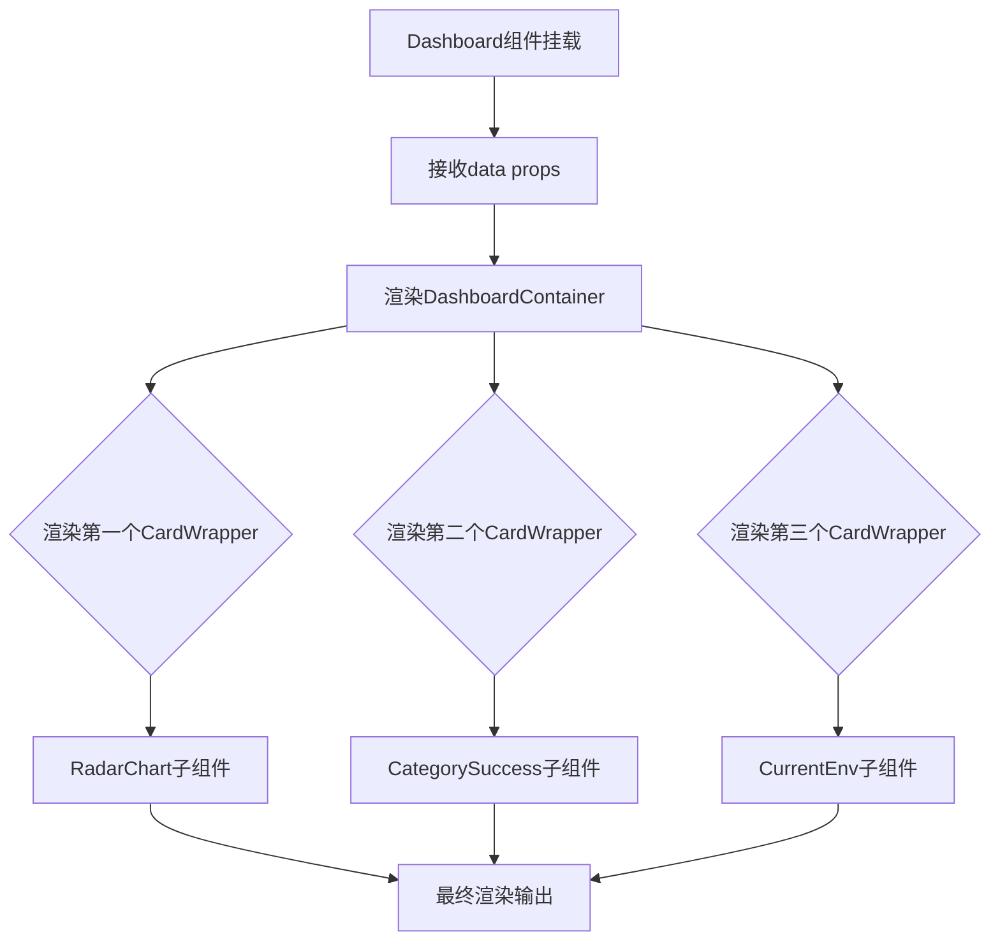
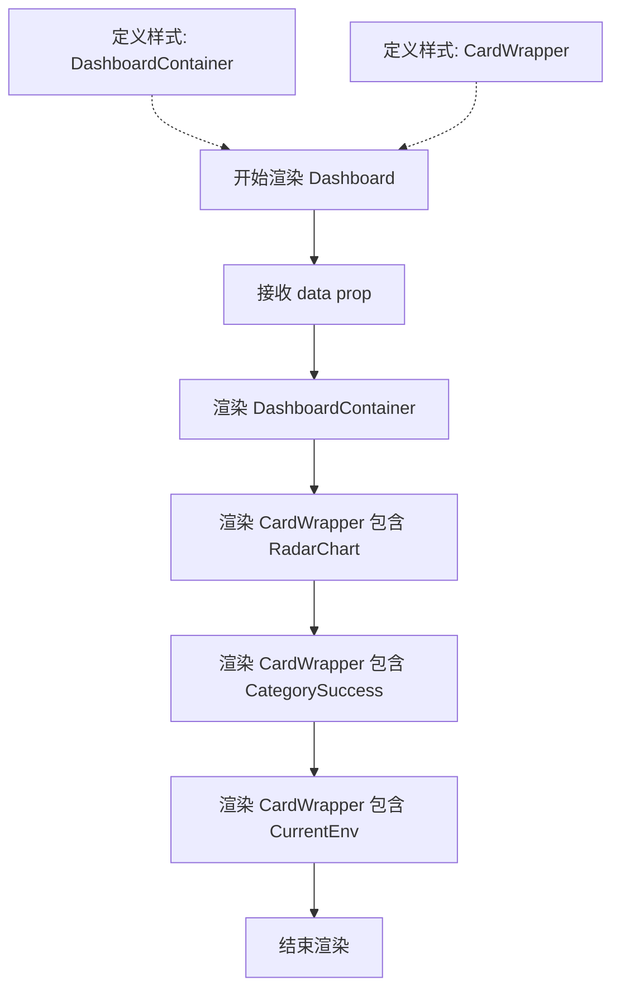
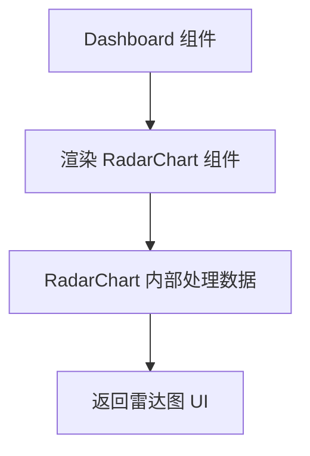
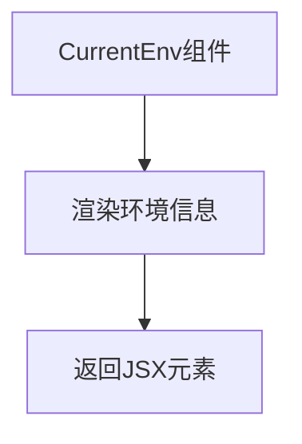
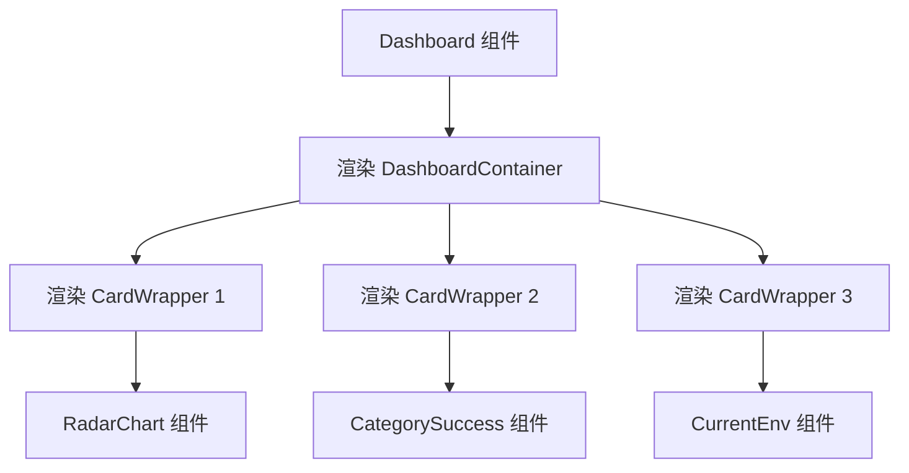

# `.\AutoGPT\classic\benchmark\frontend\src\components\data\Dashboard.tsx` 详细设计文档

这是一个React仪表盘组件，用于展示数据可视化内容，通过整合雷达图、分类成功率模块和环境信息模块，以卡片式布局呈现关键业务指标。

## 整体流程



## 类结构

```
Dashboard (主组件)
├── DashboardProps (接口)
├── DashboardContainer (样式容器)
└── CardWrapper (卡片包装器)
```

## 全局变量及字段


### `DashboardContainer`
    
主仪表板容器组件，使用tailwind-styled-components定义，负责整体布局和样式设置

类型：`StyledComponent<'div', any, {}, never>`
    


### `CardWrapper`
    
卡片包装组件，使用tailwind-styled-components定义，用于包裹各个仪表板卡片并提供统一样式

类型：`StyledComponent<'div', any, {}, never>`
    


### `Dashboard.data`
    
传递给仪表板组件的数据props，用于渲染雷达图、分类成功率和当前环境信息

类型：`any`
    


### `DashboardProps.data`
    
仪表板组件的props接口数据属性，接收外部传入的业务数据

类型：`any`
    
    

## 全局函数及方法


### `Dashboard`

这是一个 React 函数式组件，作为仪表板的主容器，接收数据属性并渲染三个子组件（RadarChart、CategorySuccess、CurrentEnv）在水平-flex 布局中展示。

参数：

-  `data`：`any`，用于传递给子组件的仪表板数据

返回值：`JSX.Element`，返回 Dashboard 组件的 JSX 元素

#### 流程图



#### 带注释源码

```tsx
// 导入 React 和 useState 钩子
import React, { useState } from "react";
// 导入 tailwind-styled-components 用于样式定义
import tw from "tailwind-styled-components";

// 导入三个子组件
import RadarChart from "./dashboard/RadarChart";        // 雷达图组件
import CategorySuccess from "./dashboard/CategorySuccess"; // 分类成功率组件
import CurrentEnv from "./dashboard/CurrentEnv";          // 当前环境组件

// 定义 Dashboard 组件的 Props 接口
interface DashboardProps {
  data: any;  // 任意类型的数据，将传递给子组件
}

// 使用 React.FC 定义 Dashboard 函数式组件，接收 data 作为 props
const Dashboard: React.FC<DashboardProps> = ({ data }) => {
  // 返回 JSX 元素
  return (
    // 主容器：宽度100%、高度96、flex布局、水平排列、垂直居中
    <DashboardContainer>
      {/* 第一个卡片：包含雷达图 */}
      <CardWrapper>
        <RadarChart />
      </CardWrapper>
      
      {/* 第二个卡片：包含分类成功率 */}
      <CardWrapper>
        <CategorySuccess />
      </CardWrapper>
      
      {/* 第三个卡片：包含当前环境信息 */}
      <CardWrapper>
        <CurrentEnv />
      </CardWrapper>
    </DashboardContainer>
  );
};

// 导出 Dashboard 组件作为默认导出
export default Dashboard;

// 定义 DashboardContainer 样式：使用 tailwind 类名
const DashboardContainer = tw.div`
  w-full    // 宽度100%
  h-96      // 高度96
  flex      // flex布局
  justify-between  // 水平方向两端对齐
  items-center     // 垂直方向居中
`;

// 定义 CardWrapper 样式
const CardWrapper = tw.div`
  w-[30%]     // 宽度30%
  h-72        // 高度72
  rounded-xl  // 圆角
  shadow-lg   // 阴影
  border      // 边框
  p-4         // 内边距
`;
```


### RadarChart

RadarChart 是一个用于展示雷达图的 React 组件，在 Dashboard 页面中被引用并渲染，以可视化数据。

参数：
- 该组件在当前代码中未传递任何参数，可能在内部实现中自行获取数据或通过上下文接收。

返回值：JSX.Element，返回一个渲染雷达图的 React 元素。

#### 流程图



#### 带注释源码

```tsx
// 从相对路径导入 RadarChart 组件
import RadarChart from "./dashboard/RadarChart";

// 在 Dashboard 函数组件中使用
const Dashboard: React.FC<DashboardProps> = ({ data }) => {
  return (
    <DashboardContainer>
      <CardWrapper>
        {/* 渲染 RadarChart 组件，当前未传递 props */}
        <RadarChart />
      </CardWrapper>
      {/* 其他组件... */}
    </DashboardContainer>
  );
};
```


### `CategorySuccess`

描述：这是一个从 `./dashboard/CategorySuccess` 导入的 React 组件，用于在仪表板（Dashboard）中展示分类成功率的数据。在 `Dashboard` 组件中，该组件被渲染在 `CardWrapper` 内部。根据代码中的使用方式（`<CategorySuccess />`），该组件当前未接收任何属性（props）。

参数：
- （无）

返回值：`React.ReactNode`，表示该组件渲染的 React 元素节点。

#### 流程图


#### 带注释源码

```javascript
// 1. 从指定路径导入 CategorySuccess 组件
import CategorySuccess from "./dashboard/CategorySuccess";

// 2. 在 Dashboard 组件的 JSX 结构中使用
// 注意：此处 CategorySuccess 作为一个自闭合标签使用，
// 且没有传递任何 props (属性)，例如 data 或 onClick 等。
<CardWrapper>
  <CategorySuccess />
</CardWrapper>
```

#### 潜在的技术债务或优化空间
- **数据未传递**：虽然 `Dashboard` 组件接收了 `data` 属性（`DashboardProps` 中定义），但在渲染 `CategorySuccess` 时并未将 `data` 传递给它。这会导致该组件无法显示实际数据，功能可能缺失。
- **类型宽松**：`DashboardProps` 中 `data` 的类型定义为 `any`，这会导致类型检查形同虚设，缺乏语义化，建议使用具体的接口定义数据结构。
- **Props 接口缺失**：作为被导入的组件，`CategorySuccess` 应当定义明确的 Props 类型（如 `CategorySuccessProps`），以便接收数据。当前代码中完全看不到其接口定义，可能导致维护困难。


### `CurrentEnv`

该组件是一个React无状态函数组件，用于显示当前环境相关的信息，在仪表板布局中作为第三个卡片内容呈现。

参数：

- 无参数

返回值：`JSX.Element`，返回渲染当前环境信息的React元素

#### 流程图



#### 带注释源码

```tsx
// 从当前代码中对CurrentEnv的使用方式推断
import CurrentEnv from "./dashboard/CurrentEnv";

// 在Dashboard组件中使用
<CardWrapper>
  <CurrentEnv />
</CardWrapper>

// CurrentEnv组件定义（基于使用方式推断）
// 该组件为无props的函数组件
// 返回包含环境信息的JSX元素
```

---

### 补充说明

由于`CurrentEnv`组件的源代码不在当前文件中（它是从`./dashboard/CurrentEnv`路径导入的），以上信息基于当前文件中的使用方式推断得出：

1. **组件类型**：无状态函数组件（React.FC或普通函数组件）
2. **参数**：无props传入
3. **返回值**：JSX元素（React.ReactElement）
4. **使用场景**：作为Dashboard中的第三个卡片展示当前环境信息

如需获取`CurrentEnv`组件的完整实现细节，需要查看`./dashboard/CurrentEnv`源文件。


### `Dashboard`

描述：`Dashboard` 是一个 React 函数组件，用于展示仪表板页面，渲染三个子组件（RadarChart、CategorySuccess、CurrentEnv）以呈现雷达图、分类成功率和当前环境信息。

参数：

- `data`：`any`，传递给仪表板的数据，用于渲染各个子组件的内容

返回值：`JSX.Element`，返回 React 元素，包含了仪表板的整体布局和三个子组件的渲染结果

#### 流程图



#### 带注释源码

```tsx
// 导入 React 和 useState 钩子
import React, { useState } from "react";
// 导入 tailwind-styled-components 用于样式管理
import tw from "tailwind-styled-components";

// 导入三个子组件
import RadarChart from "./dashboard/RadarChart";
import CategorySuccess from "./dashboard/CategorySuccess";
import CurrentEnv from "./dashboard/CurrentEnv";

// 定义组件 Props 接口，data 为 any 类型
interface DashboardProps {
  data: any;
}

// Dashboard 函数组件，接收 data 作为 props
const Dashboard: React.FC<DashboardProps> = ({ data }) => {
  // 返回 JSX 结构
  return (
    // 外层容器：宽度100%，高度96，flex布局，水平均匀分布，垂直居中
    <DashboardContainer>
      {/* 第一个卡片：包含雷达图 */}
      <CardWrapper>
        <RadarChart />
      </CardWrapper>
      {/* 第二个卡片：包含分类成功率 */}
      <CardWrapper>
        <CategorySuccess />
      </CardWrapper>
      {/* 第三个卡片：包含当前环境信息 */}
      <CardWrapper>
        <CurrentEnv />
      </CardWrapper>
    </DashboardContainer>
  );
};

// 导出 Dashboard 组件作为默认导出
export default Dashboard;

// 定义 DashboardContainer 样式：使用 tailwind-styled-components
const DashboardContainer = tw.div`
  w-full
  h-96
  flex
  justify-between
  items-center
`;

// 定义 CardWrapper 样式：宽度30%，高度72，圆角，阴影，边框，内边距
const CardWrapper = tw.div`
  w-[30%]
  h-72
  rounded-xl
  shadow-lg
  border
  p-4
`;
```

## 关键组件


### Dashboard

主仪表板容器组件，用于组织和展示多个数据可视化卡片组件，通过tailwind-styled-components定义布局结构。

### RadarChart

雷达图可视化组件，用于展示多维度数据分析和比较，当前代码中为占位导入状态。

### CategorySuccess

分类成功率组件，用于展示不同类别的成功指标或完成情况，帮助用户快速了解各分类的表现。

### CurrentEnv

当前环境信息组件，用于显示系统当前运行状态或环境配置相关的数据指标。

### DashboardContainer

仪表板布局容器，使用tailwind-styled-components定义，负责整体布局结构，包含宽度、高度和Flex布局配置。

### CardWrapper

卡片包装容器样式组件，为每个可视化卡片提供统一的尺寸、圆角、阴影和边框样式。

### data属性

外部传入的仪表板数据props，类型为any，表示可以被任何数据格式填充，当前代码中未被使用但预留了接口。


## 问题及建议


### 已知问题

- **未使用的Props**: `Dashboard`组件接收`data`参数但完全没有使用，造成代码冗余和混淆
- **类型安全缺失**: `data`属性声明为`any`类型，失去TypeScript类型检查的保护作用
- **硬编码样式值**: 固定宽度`w-[30%]`、高度`h-96`、`h-72`等缺乏响应式设计，在不同屏幕尺寸下表现可能不佳
- **缺乏错误处理**: 组件没有处理子组件可能出现的错误，没有错误边界(Error Boundary)
- **缺少Loading状态**: 组件没有展示数据加载中的状态，用户体验不完整

### 优化建议

- 移除未使用的`data`属性，或在子组件中实际使用该数据
- 为`data`定义具体接口类型（如`DashboardData`），提升类型安全
- 采用响应式布局替代固定百分比宽度（如使用`flex-wrap`和响应式断点）
- 为子组件添加错误边界，防止单个组件错误导致整个Dashboard崩溃
- 添加条件渲染展示Loading状态或空数据状态
- 考虑将`CardWrapper`抽象为可复用的通用卡片组件，减少重复代码

## 其它


### 设计目标与约束

设计目标：构建一个展示关键业务指标的可视化仪表板页面，包含雷达图、分类成功率和当前环境信息三个核心模块，采用响应式布局适配不同屏幕尺寸。

设计约束：使用React函数组件、TypeScript进行类型定义、tailwind-styled-components进行样式管理，需与现有dashboard组件库保持风格一致。

### 错误处理与异常设计

由于该组件为展示层组件，错误处理主要依赖于子组件自身的异常捕获。若data数据为空或格式异常，应在父组件层级进行数据校验后再传入，或为每个子组件提供默认空状态展示。当前代码未包含数据校验和错误边界处理。

### 数据流与状态机

数据流向：父组件通过props传递data对象 → Dashboard组件接收data → 分发给各子组件（RadarChart、CategorySuccess、CurrentEnv）。当前代码中data props未实际使用，各子组件可能通过独立接口获取数据或使用context。状态管理采用React本地状态（useState），未使用Redux或Context API进行全局状态管理。

### 外部依赖与接口契约

外部依赖：
- react：^16.8.0+（Hooks支持）
- tailwind-styled-components：样式方案
- ./dashboard/RadarChart：雷达图组件
- ./dashboard/CategorySuccess：分类成功率组件
- ./dashboard/CurrentEnv：当前环境组件

接口契约：DashboardProps接口需包含data字段，类型为any（建议改为具体类型定义以增强类型安全），各子组件应遵循统一的props接口规范。

### 性能考虑

当前代码性能良好，组件结构简单。潜在优化点：
1. 使用React.memo包装子组件避免不必要重渲染
2. data props变化时考虑使用useMemo缓存传递给子组件的数据
3. CardWrapper样式组件可提取到外部避免每次渲染重新创建

### 安全考虑

当前组件无直接安全风险，但data prop类型为any存在类型安全隐患，建议定义具体的数据接口类型。子组件应防止XSS攻击，确保渲染的用户数据经过适当转义。

### 可访问性设计

当前代码未包含aria属性和键盘导航支持。建议：
1. 为DashboardContainer添加role="region"和aria-label="仪表板"
2. CardWrapper添加适当的角色和标签
3. 确保图表组件提供替代文本描述

### 测试策略

建议测试覆盖：
1. Dashboard组件正常渲染
2. 三个子组件正确挂载
3. props传递正确性
4. 样式类名应用正确
5. 空数据或异常数据场景


    