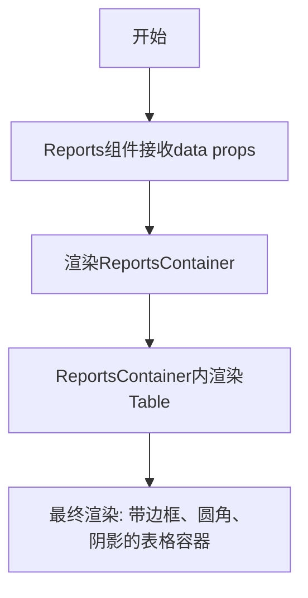

# `.\AutoGPT\classic\benchmark\frontend\src\components\data\Reports.tsx` 详细设计文档

这是一个React报表展示组件，接收数据props并通过tailwind-styled-components渲染一个带有表格样式的基础报表容器结构

## 整体流程



## 类结构

```
Reports (主组件)
├── ReportsContainer (styled div)
└── Table (styled div)
```

## 全局变量及字段


### `ReportsContainer`
    
全屏宽度容器组件，用于包裹报表内容区域

类型：`styled-component (tw.div)`
    


### `Table`
    
表格组件，具有边框、阴影、圆角和固定高度96的样式

类型：`styled-component (tw.div)`
    


### `Reports.data`
    
报表数据 prop，用于接收外部传入的报表数据

类型：`any`
    
    

## 全局函数及方法


## 关键组件


### Reports 组件

React 函数组件，作为报告页面的主入口，接收 data 属性并渲染报告内容，内部包含 ReportsContainer 和 Table 两个子组件。

### ReportsContainer 样式组件

使用 tailwind-styled-components 定义的 div 容器样式组件，配置为全宽度（w-full），用于包裹整个报告内容区域。

### Table 样式组件

使用 tailwind-styled-components 定义的 div 表格样式组件，配置为全宽度、边框、阴影、圆角和固定高度（h-96），用于展示报告数据内容。


## 问题及建议


### 已知问题

-   **使用 `any` 类型**：接口 `ReportsProps` 中 `data` 字段定义为 `any` 类型，失去了 TypeScript 类型安全检查的优势，不利于代码维护和重构
-   **未使用 `data` 属性**：组件接收 `data` prop 但完全没有使用，传入的数据被忽略
-   **未使用的导入**：`useState` 被导入但未使用，增加了不必要的依赖
-   **空 Table 组件**：`<Table></Table>` 为空元素，没有渲染任何实际内容，无法展示报表数据
-   **缺少数据渲染逻辑**：缺乏将 `data` 转换为表格内容的映射逻辑

### 优化建议

-   **定义具体的数据类型**：根据实际业务场景为 `data` 定义具体的接口类型，替代 `any`
-   **实现数据渲染**：在 Table 组件中添加数据映射逻辑，将 `data` 渲染为表格行和列
-   **清理未使用的导入**：移除未使用的 `useState` 导入
-   **添加 Props 验证**：考虑添加 props 验证或默认值处理，增强组件健壮性
-   **拆分组件**：如果表格逻辑复杂，可将 Table 拆分为独立的 TableHeader、TableRow 等子组件，提高可维护性


## 其它


### 设计目标与约束

本组件的主要设计目标是作为一个基础的报表展示容器，支持接收外部传入的data数据并渲染对应的表格结构。设计约束包括：1）组件仅负责展示逻辑，不包含数据获取和处理能力；2）使用tailwind-styled-components进行样式管理，确保样式与组件的紧耦合；3）组件高度固定为h-96（24rem），宽度默认为w-full（100%）；4）表格容器具有圆角（rounded-xl）、阴影（shadow-lg）和边框（border）样式。

### 错误处理与异常设计

当前组件未实现显式的错误处理机制。由于data属性类型声明为any，组件无法对数据格式进行验证。建议的改进方向包括：1）为data属性定义具体的TypeScript接口类型，确保传入数据的结构一致性；2）添加数据为空或undefined时的占位符展示；3）考虑在数据异常时显示错误提示信息；4）可以使用React的error boundary机制捕获渲染过程中的异常。

### 外部依赖与接口契约

组件依赖以下外部包：1）React（核心库，提供FC函数组件类型定义）；2）tailwind-styled-components（样式处理库，提供tw标签函数）。接口契约方面：组件接收ReportsProps接口定义的props对象，其中data属性类型为any（建议优化为具体类型），组件返回JSX.Element类型的React元素。组件通过默认导出的方式供外部使用。

### 性能考虑

当前组件性能开销较小，主要性能优化点包括：1）data属性建议使用useMemo进行缓存，避免父组件频繁重渲染导致的不必要计算；2）如组件位于列表中，应使用React.memo进行包装以防止不必要的重渲染；3）Table和ReportsContainer两个styled-components在组件外部定义，每次渲染时不会重新创建，符合性能最佳实践。

### 可访问性（Accessibility）

当前组件存在可访问性方面的技术债务：1）Table组件使用的是div而非语义化的table元素，屏幕阅读器无法正确识别其为数据表格；2）缺少必要的ARIA属性标注；3）容器缺少role属性说明其用途。建议改进：1）将div.table替换为语义化的table元素；2）为表格添加caption说明；3）考虑添加键盘导航支持。

### 响应式设计考虑

当前组件宽度设置为w-full（100%），具备基本的响应式特性，但存在改进空间：1）表格在小屏幕设备上可能出现横向滚动问题，建议添加overflow-x-auto处理；2）可考虑针对不同屏幕尺寸调整内边距（padding）或字体大小；3）固定高度h-96在移动端可能占用过多屏幕空间，可考虑改为响应式高度如min-h-screen或使用媒体查询调整。

### 状态管理方案

本组件为受控组件（Controlled Component），不管理内部状态，所有数据通过props从父组件传入。这种设计符合单向数据流原则，便于状态集中管理和调试。如需在组件内部添加筛选、排序等交互功能，建议使用React的useState或useReducer在当前组件层级管理，或将状态提升至父组件。

### 测试策略建议

建议为该组件编写以下测试用例：1）快照测试（Snapshot Test）验证渲染输出；2）props测试验证不同data传入时的渲染行为；3）空数据或undefined时的降级渲染测试；4）样式类名测试验证styled-components正确应用。由于组件结构简单，单元测试覆盖率目标建议达到80%以上。


    