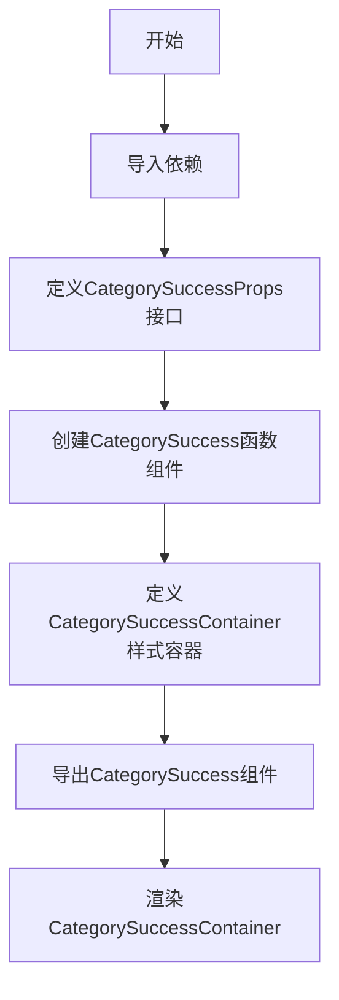
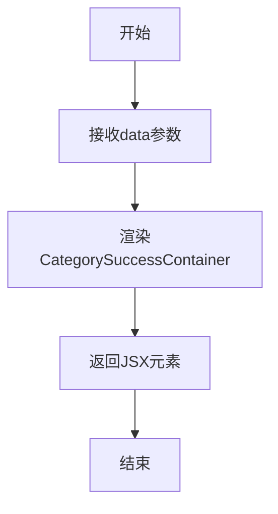
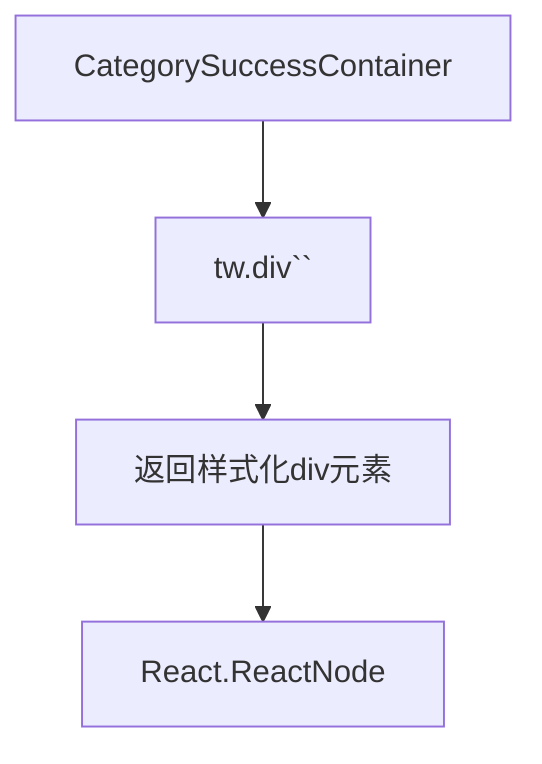

# `.\AutoGPT\classic\benchmark\frontend\src\components\data\dashboard\CategorySuccess.tsx` 详细设计文档

这是一个React函数组件，用于展示分类操作成功后的UI界面，接收data作为props并渲染一个基于Tailwind CSS样式的容器组件

## 整体流程



## 类结构

```
CategorySuccess (React函数组件)
└── CategorySuccessContainer (Tailwind样式化div容器)
```

## 全局变量及字段


### `data`
    
传递给组件的数据参数

类型：`any`
    


### `CategorySuccessProps`
    
定义CategorySuccess组件的props类型接口

类型：`interface`
    


    

## 全局函数及方法


### `CategorySuccess`

这是一个React函数组件，用于展示分类成功的界面状态。它接收一个包含任意类型数据的props，并返回一个基于Tailwind CSS样式化的空容器组件。

参数：

- `data`：`any`，传入的分类数据，用于渲染成功状态的相关信息

返回值：`React.FC<CategorySuccessProps>`，返回React函数组件类型，渲染一个空的分类成功容器

#### 流程图



#### 带注释源码

```tsx
// 引入React和useState钩子
import React, { useState } from "react";
// 引入tailwind-styled-components用于样式化组件
import tw from "tailwind-styled-components";

// 定义组件Props接口，指定data属性的类型
interface CategorySuccessProps {
  // data属性可以是任意类型
  data: any;
}

// 使用React.FC类型定义CategorySuccess函数组件
// 接收CategorySuccessProps作为参数
const CategorySuccess: React.FC<CategorySuccessProps> = ({ data }) => {
  // 返回渲染的JSX元素
  // CategorySuccessContainer是一个样式化的div容器
  return <CategorySuccessContainer></CategorySuccessContainer>;
};

// 导出组件作为默认导出
export default CategorySuccess;

// 使用tailwind-styled-components定义样式化容器
// 目前容器样式为空，仅包含一个div元素
const CategorySuccessContainer = tw.div`
  
`;
```


### `CategorySuccessContainer`

这是一个使用 `tailwind-styled-components` 创建的样式化 `div` 容器组件，用于包裹分类成功相关内容。

**注意**：该组件目前是一个空容器，未定义任何样式类名，也未接收任何属性或参数。

#### 流程图



#### 带注释源码

```tsx
// 使用 tailwind-styled-components 创建的样式化 div 容器
// 使用模板字符串语法，currently 为空样式
const CategorySuccessContainer = tw.div`
  
`;

// 导出以便在 CategorySuccess 组件中使用
// 当前组件内使用 <CategorySuccessContainer></CategorySuccessContainer>
// 但未传递任何 children 或 props 给该容器
```

## 关键组件


### CategorySuccess 组件

React 函数组件，接收 `data` prop 并返回样式化的 `CategorySuccessContainer` 容器。

### CategorySuccessContainer 样式容器

使用 tailwind-styled-components 定义的 div 容器组件，用于承载成功类别的内容展示。

### CategorySuccessProps 接口

TypeScript 接口定义，描述 `CategorySuccess` 组件的 props 类型结构，包含 `data` 字段。

### data 属性

组件接收的外部数据 prop，类型为 any，用于传递类别相关的业务数据。


## 问题及建议


### 已知问题

-   **未使用的 props**: 组件接收 `data` 参数但从未使用，造成代码冗余
-   **类型安全缺失**: 使用 `any` 类型而非具体类型定义，降低了 TypeScript 的类型检查效果
-   **空组件实现**: `CategorySuccessContainer` 内容为空，组件功能完全未实现
-   **空样式定义**: tailwind-styled-components 样式定义为空的，没有实际样式内容

### 优化建议

-   **移除未使用的 props**: 如果暂时不需要 `data`，可先从接口和组件参数中移除，或添加注释说明后续使用计划
-   **强化类型定义**: 将 `data: any` 替换为具体的接口类型定义，如 `data: CategoryData`
-   **实现组件功能**: 根据业务需求填充 `CategorySuccessContainer` 的内容和样式
-   **添加组件文档**: 为组件添加 JSDoc 注释说明其用途和预期行为
-   **考虑错误边界**: 如果数据获取可能失败，添加 loading 和 error 状态处理
-   **添加 Props 校验**: 使用 prop-types 或 TypeScript 严格模式确保组件调用正确传参

## 其它


### 设计目标与约束

本组件的设计目标是作为一个分类成功状态的展示容器，目前为占位符组件，未来用于展示操作成功后的分类相关信息。技术约束方面：依赖React 16.8+以支持函数组件，依赖tailwind-styled-components进行样式管理，需确保Tailwind CSS配置正确。

### 错误处理与异常设计

当前组件为展示层组件，不涉及业务逻辑处理，故暂无错误处理机制。若未来扩展功能，需考虑data属性为空或undefined时的兜底展示方案，以及异常状态下的错误提示UI设计。

### 数据流与状态机

组件采用单向数据流模式，父组件通过props传递data数据。当前data属性声明为any类型，建议明确具体数据类型定义。组件内部使用useState钩子但未实际使用，存在冗余代码。状态机方面，组件目前为静态展示，无状态变更需求。

### 外部依赖与接口契约

核心依赖包括：react（^16.8+）、tailwind-styled-components（^2.0+）。接口契约方面，组件接收CategorySuccessProps接口定义的props对象，其中data字段类型为any，建议明确具体数据结构以增强类型安全。

### 性能考虑

组件目前为empty render，性能开销极低。后续扩展时需注意：避免不必要的重新渲染、合理使用React.memo、对大型数据展示考虑虚拟滚动、styled-components使用需评估CSS类名生成开销。

### 可访问性（Accessibility）

当前组件为空的div容器，缺少语义化结构。建议添加适当的ARIA属性、role定义，以及键盘导航支持。若作为成功提示组件，应提供aria-live="polite"以通知屏幕阅读器内容变化。

### 国际化支持

当前组件无文本内容，未来扩展时需考虑硬编码文本的国际化处理。建议使用i18n框架（如react-intl或i18next）管理显示文本，避免出现国际化盲点。

### 测试策略

建议的测试覆盖包括：组件渲染测试（快照测试）、props传递测试、样式渲染验证、异常情况下的降级表现测试。可使用Jest + React Testing Library进行单元测试。

### 版本兼容性

代码使用React.FC泛型类型，该写法在React 18类型定义中仍被支持。useState导入但未使用，建议移除以保持代码整洁并避免混淆。

### 安全考虑

当前组件无用户输入处理，无XSS风险。但需注意：未来若data包含用户生成内容，需进行XSS过滤；props类型any的使用可能带来安全隐患，建议明确具体类型。


    