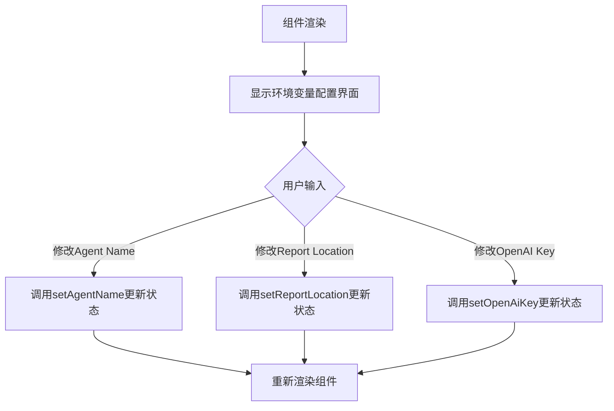
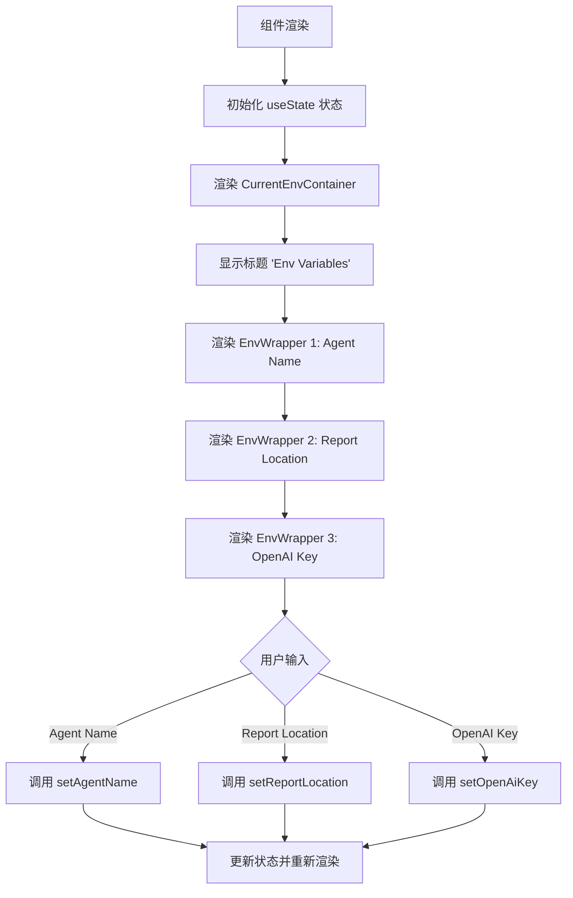
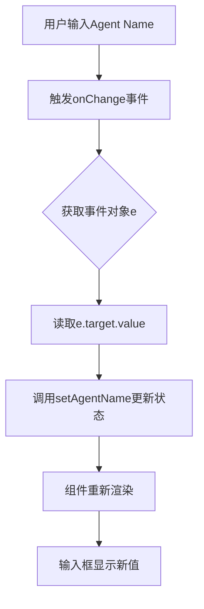
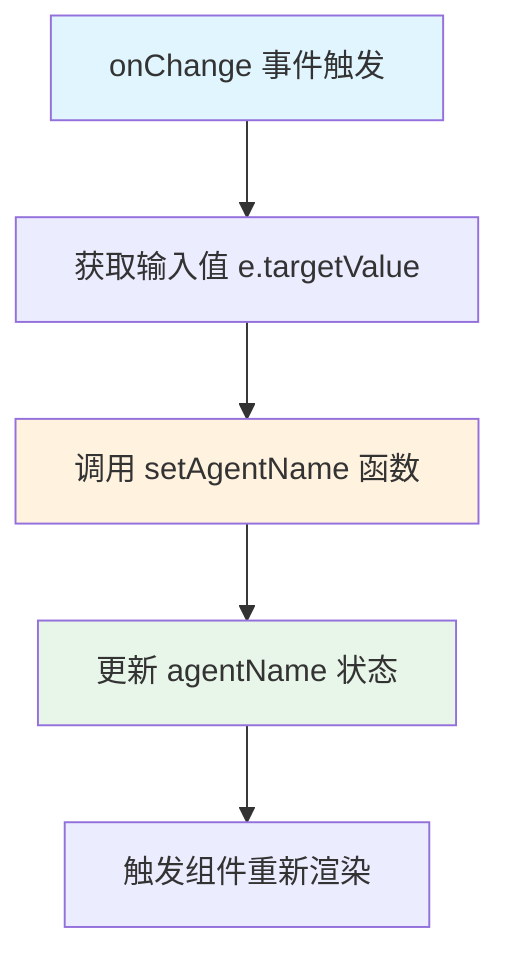
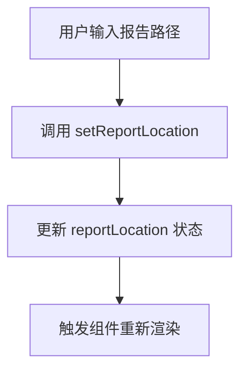
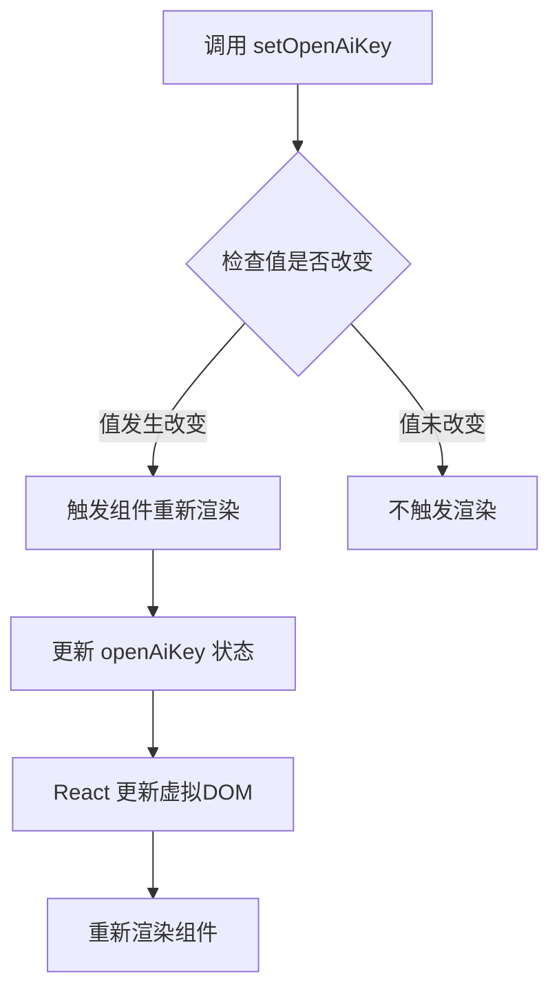

# `.\AutoGPT\classic\benchmark\frontend\src\components\data\dashboard\CurrentEnv.tsx` 详细设计文档

一个 React 组件，用于配置和显示环境变量，包括 Agent Name、Report Location 和 OpenAI Key 三个配置项，用户可以通过输入框修改这些配置值。

## 整体流程



## 类结构

```
CurrentEnv (函数组件)
├── CurrentEnvProps (接口)
├── useState 状态管理
│   ├── agentName
│   ├── reportLocation
│   └── openAiKey
└── 样式组件
    ├── CurrentEnvContainer
    ├── Title
    ├── EnvWrapper
    ├── EnvLabel
    └── EnvInput
```

## 全局变量及字段


### `data`
    
外部传入的配置数据

类型：`any`
    


### `CurrentEnv.agentName`
    
Agent名称状态

类型：`string`
    


### `CurrentEnv.reportLocation`
    
报告存储路径状态

类型：`string`
    


### `CurrentEnv.openAiKey`
    
OpenAI API密钥状态

类型：`string`
    
    

## 全局函数及方法


# CurrentEnv 组件详细设计文档

## 1. 一段话描述

CurrentEnv 是一个 React 函数组件，用于在 Web 界面中展示和配置环境变量，包括 Agent Name、Report Location 和 OpenAI Key 三个可编辑的输入字段，允许用户动态修改这些配置项。

## 2. 文件的整体运行流程

```
┌─────────────────────────────────────────────────────────────────┐
│                        CurrentEnv 组件                          │
├─────────────────────────────────────────────────────────────────┤
│  1. 组件接收 data 属性（props）                                  │
│  2. 初始化三个 useState 状态：                                   │
│     - agentName (默认: "mini-agi")                              │
│     - reportLocation (默认: "../reports/mini-agi")              │
│     - openAIKey (默认: undefined)                               │
│  3. 渲染 UI 结构：                                              │
│     - 标题 "Env Variables"                                      │
│     - Agent Name 输入框                                         │
│     - Report Location 输入框                                    │
│     - OpenAI Key 输入框（密码类型）                              │
│  4. 用户交互时更新对应状态                                       │
└─────────────────────────────────────────────────────────────────┘
```

## 3. 类的详细信息

本文件是一个 React 函数组件，非类组件，因此无类方法。以下为组件相关的状态和函数信息：

### 全局组件类型接口

| 名称 | 类型 | 描述 |
|------|------|------|
| CurrentEnvProps | interface | 定义组件接收的 props 类型 |

### 组件状态 (useState)

| 名称 | 类型 | 默认值 | 描述 |
|------|------|--------|------|
| agentName | string | "mini-agi" | Agent 名称状态 |
| reportLocation | string | "../reports/mini-agi" | 报告存储路径状态 |
| openAiKey | string | undefined | OpenAI API 密钥状态 |

### 组件函数

| 名称 | 参数 | 返回值 | 描述 |
|------|------|--------|------|
| setAgentName | (value: string) => void | void | 更新 agentName 状态 |
| setReportLocation | (value: string) => void | void | 更新 reportLocation 状态 |
| setOpenAiKey | (value: string) => void | void | 更新 openAiKey 状态 |

## 4. 关键组件信息

### CurrentEnv

- **描述**: 主组件函数，用于渲染环境变量配置界面

参数：

- `data`：`any`，从父组件传入的数据对象（当前代码中未使用）

返回值：`JSX.Element`，返回 React 元素用于渲染

#### 流程图



#### 带注释源码

```typescript
// 导入 React 和 useState 钩子
import React, { useState } from "react";
// 导入 tailwind-styled-components 用于样式管理
import tw from "tailwind-styled-components";

// 定义组件 props 接口，data 为外部传入的数据
interface CurrentEnvProps {
  data: any;
}

// 定义 CurrentEnv 组件，接收 props 解构后的 data
const CurrentEnv: React.FC<CurrentEnvProps> = ({ data }) => {
  // 使用 useState 管理 Agent 名称状态，默认值为 "mini-agi"
  const [agentName, setAgentName] = useState<string>("mini-agi");
  
  // 使用 useState 管理报告存储路径状态
  const [reportLocation, setReportLocation] = useState<string>(
    "../reports/mini-agi"
  );
  
  // 使用 useState 管理 OpenAI API 密钥状态
  const [openAiKey, setOpenAiKey] = useState<string>();

  // 返回 JSX 元素，渲染环境变量配置界面
  return (
    // 容器：全宽全高，垂直居中布局
    <CurrentEnvContainer>
      <Title>Env Variables</Title>
      
      {/* Agent Name 输入区域 */}
      <EnvWrapper>
        <EnvLabel>Agent Name</EnvLabel>
        <EnvInput
          onChange={(e) => setAgentName(e.target.value)}
          placeholder="mini-agi"
        />
      </EnvWrapper>
      
      {/* Report Location 输入区域 */}
      <EnvWrapper>
        <EnvLabel>Report Location</EnvLabel>
        <EnvInput placeholder="Location from root" />
      </EnvWrapper>
      
      {/* OpenAI Key 输入区域（密码类型） */}
      <EnvWrapper>
        <EnvLabel>OpenAI Key</EnvLabel>
        <EnvInput type="password" placeholder="sk-" />
      </EnvWrapper>
    </CurrentEnvContainer>
  );
};

// 导出组件作为默认导出
export default CurrentEnv;

// ========== 样式定义区域 ==========

// 主容器样式：全宽全高，flex列布局，垂直居中
const CurrentEnvContainer = tw.div`
  w-full
  h-full
  flex
  flex-col
  justify-center
`;

// 标题样式：加粗，中等字号，居中显示
const Title = tw.h3`
  font-bold
  text-lg
  text-center
`;

// 环境变量行容器：flex布局，顶部边距4，水平两端对齐，垂直居中
const EnvWrapper = tw.div`
  flex
  mt-4
  justify-between
  items-center
`;

// 环境变量标签样式（当前为空）
const EnvLabel = tw.label`

`;

// 输入框样式：边框，圆角，内边距
const EnvInput = tw.input`
  border
  rounded
  px-2
`;
```

## 5. 潜在的技术债务或优化空间

| 问题 | 严重程度 | 描述 |
|------|----------|------|
| Props 未使用 | 中 | `data` props 被定义但从未使用，应移除或实现其功能 |
| 状态未绑定 | 中 | Report Location 输入框未绑定 `onChange` 和 `value`，用户输入无法保存 |
| 类型安全 | 低 | `data` 使用 `any` 类型，缺乏类型安全 |
| 密钥处理 | 低 | OpenAI Key 作为状态存储在内存中，明文传输可能存在安全隐患 |
| 无表单验证 | 低 | 缺少输入验证逻辑 |
| 样式不完整 | 低 | EnvLabel 样式为空，可能需要完善 |

## 6. 其它项目

### 设计目标与约束

- **设计目标**: 提供一个简洁的环境变量配置 UI 界面
- **约束**: 使用 React + Tailwind CSS (styled-components 方式)

### 错误处理与异常设计

- 当前代码无错误处理机制
- 建议添加：输入验证、API 密钥格式检查、状态持久化错误处理

### 数据流与状态机

```
用户输入 → onChange 事件 → setState 更新状态 → React 重新渲染 → UI 更新
```

### 外部依赖与接口契约

| 依赖 | 版本 | 用途 |
|------|------|------|
| react | ^18.x | React 核心库 |
| tailwind-styled-components | latest | Tailwind CSS 样式管理 |

### 组件 Props 接口契约

```typescript
interface CurrentEnvProps {
  data: any;  // 外部传入的数据（当前未使用）
}
```


### `onChange`（输入框变更事件处理）

当用户在Agent Name输入框中输入内容时，触发此事件处理函数，用于实时更新组件内部的agentName状态。

参数：

- `e`：`React.ChangeEvent<HTMLInputElement>`，输入框变更事件对象，包含目标输入框的当前值

返回值：`void`，无返回值，仅通过setAgentName更新状态

#### 流程图



#### 带注释源码

```tsx
// onChange事件处理函数
// 当用户修改Agent Name输入框时触发
onChange={(e) => setAgentName(e.targetValue)}

/*
 * 参数说明：
 * - e: React.ChangeEvent<HTMLInputElement> 类型的事件对象
 *   - 包含target属性，指向触发事件的DOM元素（输入框）
 *   - target.value 包含用户输入的最新值
 * 
 * 执行流程：
 * 1. 从事件对象e中获取target.value（当前输入的值）
 * 2. 调用setAgentName函数将该值更新到React状态
 * 3. React检测到状态变化，触发组件重新渲染
 * 4. 组件重新渲染后，输入框的value会被更新为新值
 * 
 * 注意：此处代码存在一个潜在bug
 * 应该是 e.target.value 而不是 e.targetValue
 * 这会导致功能无法正常工作
 */
```


### `CurrentEnv.setAgentName`

设置 Agent 名称的状态更新函数，用于更新组件中管理的 agentName 状态值。

参数：

-  `value`：`string`，要设置的新的 Agent 名称值

返回值：`void`，无返回值（React useState 的 setter 函数）

#### 流程图



#### 带注释源码

```typescript
// 这是 React useState hook 返回的状态更新函数
// 用于更新 agentName 状态值
// 参数：value - 新的 Agent 名称字符串
// 返回值：void
const [agentName, setAgentName] = useState<string>("mini-agi");

// 在输入框的 onChange 事件中调用 setAgentName
// 当用户输入时，触发状态更新
<EnvInput
  onChange={(e) => setAgentName(e.targetValue)}  // 监听输入变化并更新状态
  placeholder="mini-agi"
/>
```

#### 详细说明

| 属性 | 详情 |
|------|------|
| **函数类型** | React useState setter 函数 |
| **定义位置** | CurrentEnv 组件内部 |
| **状态变量** | agentName (string 类型) |
| **初始值** | "mini-agi" |
| **触发方式** | 用户在 EnvInput 输入框中输入时触发 |
| **副作用** | 更新状态后会导致 CurrentEnv 组件重新渲染 |


### `CurrentEnv.setReportLocation`

设置报告路径的 React 状态更新函数，用于更新 `reportLocation` 状态变量的值。

参数：

- `value`：`string`，要设置的新报告路径值

返回值：`void`，无返回值（React 的 setState 函数不返回任何值）

#### 流程图



#### 带注释源码

```tsx
// 从 useState hook 中解构出 reportLocation 状态及其更新函数 setReportLocation
// 初始值为 "../reports/mini-agi"
const [reportLocation, setReportLocation] = useState<string>(
  "../reports/mini-agi"
);

// 报告位置输入框（当前未绑定任何事件处理函数）
<EnvWrapper>
  <EnvLabel>Report Location</EnvLabel>
  <EnvInput placeholder="Location from root" />
</EnvWrapper>
```


### `CurrentEnv.setOpenAiKey`

该函数是 React 函数组件 `CurrentEnv` 内部通过 `useState` hook 创建的状态更新函数，用于更新组件内部的 OpenAI 密钥状态。

参数：
-  `value`：`string`，要设置的新的 OpenAI 密钥值

返回值：`void`，无返回值

#### 流程图



#### 带注释源码

```typescript
// useState hook 返回的更新函数，用于设置 openAiKey 状态
// 第一个元素是当前状态值 openAiKey
// 第二个元素是更新状态的函数 setOpenAiKey
const [openAiKey, setOpenAiKey] = useState<string>();

/**
 * setOpenAiKey 函数详情：
 * - 名称：setOpenAiKey
 * - 参数：value (string) - 新的 OpenAI API 密钥
 * - 返回值：void
 * - 用途：更新组件内部的 openAiKey 状态值
 * - 注意：此函数在当前代码中未被实际使用，输入框缺少 onChange 事件绑定
 */

// 示例调用方式（在实际使用中）
// setOpenAiKey("sk-xxxxxxxxxxxx");
```

#### 技术债务说明

当前代码存在以下问题：

1. **功能缺失**：`setOpenAiKey` 函数已定义但未被使用，OpenAI Key 输入框缺少 `onChange` 事件处理函数，用户无法输入或更新密钥值。

2. **潜在解决方案**：
   ```typescript
   // 应该添加 onChange 处理函数
   <EnvInput 
     type="password" 
     placeholder="sk-"
     value={openAiKey || ''}
     onChange={(e) => setOpenAiKey(e.target.value)} 
   />
   ```

## 关键组件


### CurrentEnv 主组件

React函数组件，用于渲染环境变量配置界面，提供Agent Name、Report Location和OpenAI Key三个输入字段，支持用户交互和状态管理。

### 状态管理组件

使用React useState Hook管理三个状态变量：agentName（字符串，默认"mini-agi"）、reportLocation（字符串，默认"../reports/mini-agi"）、openAiKey（可选字符串），用于存储用户输入的环境变量值。

### CurrentEnvContainer 样式组件

使用tailwind-styled-components定义的容器样式组件，设置宽度和高度为100%，使用flex布局，垂直居中内容。

### Title 样式组件

标题样式组件，显示"Env Variables"文本，使用粗体字体，文本居中对齐。

### EnvWrapper 样式组件

每个环境变量行的容器样式，使用flex布局，顶部外边距4个单位，水平方向两端对齐，垂直居中。

### EnvLabel 样式组件

标签样式组件，用于显示环境变量名称。

### EnvInput 样式组件

输入框样式组件，包含边框、圆角和水平内边距，支持type属性（如password类型用于OpenAI Key）。

### CurrentEnvProps 接口

TypeScript接口定义组件props结构，包含data属性（类型为any），用于接收外部传入的数据。


## 问题及建议


### 已知问题

-   **未使用的Props**：接口 `CurrentEnvProps` 定义了 `data` 属性，但组件内部完全未使用，造成代码冗余
-   **未使用的State变量**：`reportLocation` 和 `openAiKey` 使用 `useState` 定义了状态，但未在组件中实际使用，也未绑定到对应的输入框
-   **不完整的事件处理**：Report Location 输入框缺少 `onChange` 事件处理函数，无法更新 `reportLocation` 状态
-   **类型安全问题**：使用 `any` 类型定义 `data` prop，违反TypeScript类型安全原则，降低了代码的可维护性
-   **缺失的表单功能**：组件仅包含输入控件，缺少提交按钮和表单提交处理逻辑，无法实现实际的环境变量保存功能
-   **空样式定义**：`EnvLabel` 组件样式定义为空，导致标签样式不可控
-   **硬编码默认值**：Agent Name 的默认值 "mini-agi" 和路径 "../reports/mini-agi" 硬编码在组件内部，缺乏灵活性

### 优化建议

-   移除未使用的 `data` prop 或实现其实际功能
-   为 `reportLocation` 输入框添加 `onChange` 事件处理，绑定 `setReportLocation`
-   为 `openAiKey` 输入框添加 `onChange` 事件处理，绑定 `setOpenAiKey`
-   将 `data` 的 `any` 类型替换为具体的接口定义，如 `interface EnvData { agentName?: string; reportLocation?: string; openAiKey?: string; }`
-   添加提交按钮和表单处理逻辑，使用 `onSubmit` 事件或单独的保存按钮
-   完善 `EnvLabel` 的样式定义，确保标签具有适当的字体、间距等样式
-   将硬编码的默认值提取为常量或从外部配置传入，提高组件的可配置性

## 其它


### 设计目标与约束

设计目标：
1. 提供一个简洁的环境变量配置界面，允许用户配置Agent名称、报告存储路径和OpenAI API密钥
2. 使用Tailwind CSS进行样式管理，确保UI响应式和一致
3. 采用React函数组件和Hooks模式，确保代码可维护性和可测试性

技术约束：
1. 依赖React 16.8+的Hooks API（useState）
2. 依赖tailwind-styled-components进行样式管理
3. 必须作为子组件嵌入到父组件中使用，接收data prop
4. 当前版本未实现表单提交和数据持久化功能

### 错误处理与异常设计

输入验证：
1. Agent名称字段目前无长度限制和格式验证，建议添加正则表达式验证
2. Report Location路径未验证路径格式和目录存在性
3. OpenAI Key未验证key格式（应以"sk-"开头）

异常边界：
1. 未设置错误边界组件，若组件渲染失败可能导致整个应用崩溃
2. data prop未进行类型验证，传入null/undefined可能导致运行时错误

用户反馈机制：
1. 缺少输入错误提示信息展示区域
2. 缺少表单提交成功/失败的反馈提示

### 数据流与状态机

组件状态流：
- 初始状态：agentName="mini-agi", reportLocation="../reports/mini-agi", openAiKey=undefined
- 用户输入触发onChange事件
- 调用setAgentName/setReportLocation/setOpenAiKey更新状态
- 状态更新触发组件重新渲染

数据流动方向：
- 单向数据流：UI事件 → 状态更新 → UI重新渲染
- 父组件通过data prop向下传递数据（当前未使用）
- 子组件状态通过React状态管理（useState）维护，未向上传递

### 外部依赖与接口契约

外部依赖：
1. react：^16.8.0+，核心UI框架
2. tailwind-styled-components：^2.0.0+，样式管理库
3. TypeScript：类型定义支持

组件接口：
- 输入接口：CurrentEnvProps { data: any }
- 输出接口：React.FC渲染元素
- 事件接口：通过onChange回调处理用户输入

### 安全性考虑

敏感信息处理：
1. OpenAI Key输入框已设置type="password"，但值存储在React状态中可能存在内存泄漏风险
2. 建议在生产环境中对敏感信息进行加密存储
3. 避免在控制台日志中输出敏感信息

XSS防护：
1. 用户输入直接绑定到value属性（受控组件），React自动进行转义
2. placeholder文本不来自用户输入，安全

### 可访问性（Accessibility）

当前问题：
1. EnvLabel与EnvInput缺少htmlFor/id关联，屏幕阅读器无法正确识别
2. 缺少ARIA标签描述输入字段用途
3. 缺少键盘导航支持和焦点管理
4. 缺少错误状态的视觉提示

建议改进：
1. 为每个输入框添加aria-label属性
2. 为标签添加正确的htmlFor属性绑定
3. 添加焦点样式（当前使用默认边框）
4. 支持Tab键导航顺序

### 性能考虑

渲染优化：
1. 当前组件简单，memo化收益有限，但可考虑使用React.memo包装
2. 状态更新会触发整个组件重新渲染，可使用useMemo/useCallback优化回调函数

包体积：
1. 依赖tailwind-styled-components可能增加包体积
2. 建议按需引入或使用CSS类名方案替代

### 测试策略

单元测试建议：
1. 渲染测试：验证三个输入框正确渲染
2. 交互测试：模拟用户输入，验证状态更新
3. 默认值测试：验证初始状态值正确

测试工具建议：
1. 使用React Testing Library进行组件测试
2. 使用Jest作为测试运行器
3. 添加Storybook进行组件可视化测试

    