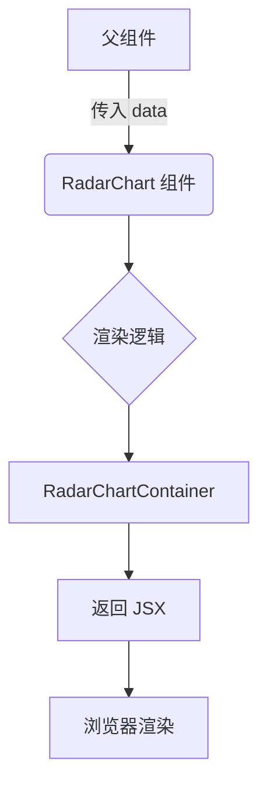
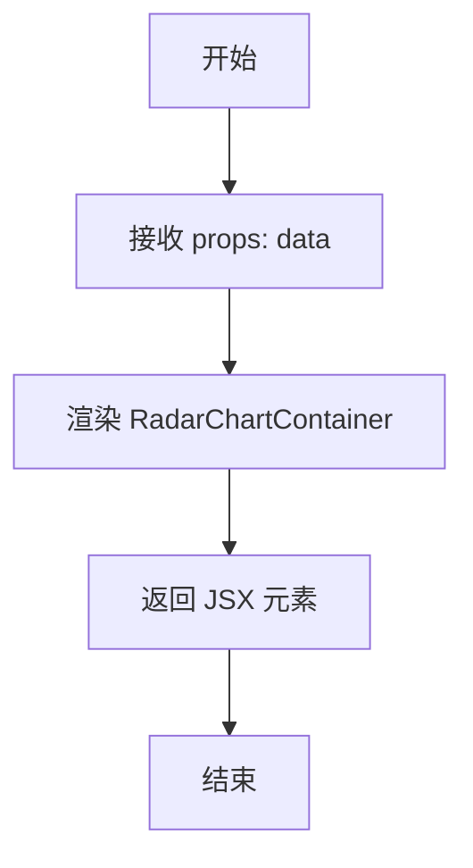
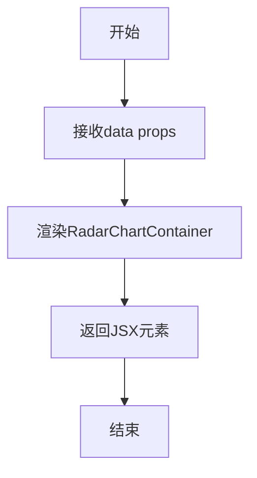

# `.\AutoGPT\classic\benchmark\frontend\src\components\data\dashboard\RadarChart.tsx` 详细设计文档

这是一个基于 React 和 Tailwind CSS 的雷达图组件，接收数据 props 并渲染一个预配置的样式容器，目前主要用于占位展示。

## 整体流程



## 类结构

```
App (根组件)
└── RadarChart (页面组件)
    └── RadarChartContainer (样式组件)
```

## 全局变量及字段


### `React`
    
React核心库，提供组件和Hooks功能

类型：`module`
    


### `useState`
    
React Hook，用于在函数组件中管理本地状态

类型：`function`
    


### `tw`
    
tailwind-styled-components库的对象，用于创建样式化组件

类型：`object`
    


### `RadarChartProps`
    
雷达图组件的属性接口，定义组件接收的数据结构

类型：`interface`
    


### `RadarChart`
    
雷达图React函数组件，用于渲染雷达图表

类型：`React.FC<RadarChartProps>`
    


### `RadarChartContainer`
    
使用tailwind-styled-components定义的雷达图容器样式组件

类型：`styled-component`
    


    

## 全局函数及方法


### RadarChart

这是一个 React 函数组件，用于渲染雷达图（Spider Chart），接收数据并返回雷达图的容器元素。

参数：

- `data`：`any`，雷达图所需的数据源

返回值：`JSX.Element`，React 元素，雷达图的容器

#### 流程图



#### 带注释源码

```
// 导入 React 和 useState 钩子
import React, { useState } from "react";
// 导入 tailwind-styled-components 用于样式化
import tw from "tailwind-styled-components";

// 定义 RadarChart 组件的 props 接口
interface RadarChartProps {
  data: any; // 雷达图数据，类型为任意
}

// 定义 RadarChart 组件，接收 data 作为 props
const RadarChart: React.FC<RadarChartProps> = ({ data }) => {
  // 返回雷达图容器组件
  return <RadarChartContainer></RadarChartContainer>;
};

// 导出 RadarChart 组件作为默认导出
export default RadarChart;

// 使用 tailwind-styled-components 定义雷达图容器样式
const RadarChartContainer = tw.div`

`;
```


### `RadarChart`

这是一个React函数组件，用于渲染雷达图（Radar Chart），接收数据并通过styled-components渲染图表容器。

参数：

- `data`：`any`，图表所需的数据

返回值：`JSX.Element`，返回雷达图的React元素

#### 流程图



#### 带注释源码

```tsx
// 导入React和useState（虽然当前未使用，但按原代码保留）
import React, { useState } from "react";
// 导入tailwind-styled-components用于样式组件
import tw from "tailwind-styled-components";

// 定义组件的props类型接口
interface RadarChartProps {
  data: any; // 图表数据，类型为任意类型
}

// 定义RadarChart函数组件，接收data作为props
const RadarChart: React.FC<RadarChartProps> = ({ data }) => {
  // 返回雷达图容器组件（当前为空容器）
  return <RadarChartContainer></RadarChartContainer>;
};

// 导出默认组件
export default RadarChart;

// 使用tailwind-styled-components定义的容器样式组件
// 注意：此处样式内容为空，只有缩进
const RadarChartContainer = tw.div`
  
`;
```

## 关键组件


### RadarChartProps 接口

TypeScript 接口定义，规定了 RadarChart 组件的 props 类型约束，目前仅包含 data 属性用于接收图表数据

### RadarChart 组件

React 函数组件，作为雷达图的入口组件，接收 data 属性并渲染 RadarChartContainer 容器，目前返回空容器用于后续图表实现

### RadarChartContainer 容器

使用 tailwind-styled-components 定义的样式化 div 容器，作为雷达图的内容包裹层，当前为空实现待扩展


## 问题及建议


### 已知问题

-   `data` 属性使用 `any` 类型，缺乏类型安全性和TypeScript最佳实践
-   未使用的 `useState` 导入，造成不必要的依赖
-   组件为空白实现，没有实际的雷达图渲染逻辑
-   `RadarChartContainer` 样式定义为空的，可能需要后续完善
-   缺少 props 验证和默认值处理
-   未处理边界情况（空数据、undefined、错误数据）
-   缺少错误边界和加载状态处理
-   没有文档注释或JSDoc说明

### 优化建议

-   替换 `any` 类型为具体的接口定义，如定义数据点的结构和类型
-   移除未使用的 `useState` 导入以减少bundle大小
-   集成图表库（如 Recharts、Chart.js 或 visx）实现雷达图渲染逻辑
-   添加 PropTypes 或自定义类型守卫进行运行时验证
-   为可选 props 添加默认值处理
-   添加数据验证逻辑，处理空数据或异常数据情况
-   添加加载状态（loading）和错误状态（error）的UI展示
-   添加组件文档注释，说明 props 的使用方式和数据格式要求


## 其它


### 设计目标与约束

本组件的设计目标是创建一个可复用的雷达图（Radar Chart）React组件，用于可视化多维数据。技术约束包括：必须使用React函数组件架构、使用tailwind-styled-components进行样式管理、组件必须支持TypeScript类型检查、数据接口设计需兼容常见图表数据结构。

### 错误处理与异常设计

组件应处理以下异常情况：data属性为空或undefined时应显示友好的空状态提示；data数据格式不符合预期时应抛出明确的类型错误或显示错误提示；组件渲染过程中发生异常时应捕获并显示降级UI。错误边界建议在父组件层面统一处理，组件内部通过PropTypes或TypeScript接口进行数据验证。

### 数据流与状态机

组件采用单向数据流模式：父组件通过props传递data数据，组件内部不维护复杂的内部状态（除了必要的UI交互状态如hover、click等）。数据转换逻辑应抽离到独立的工具函数中，组件专注于视图渲染。状态管理使用React的useState hook，复杂状态考虑使用useReducer进行集中管理。

### 外部依赖与接口契约

核心依赖包括：react（版本16.8+以支持hooks）、tailwind-styled-components（用于样式管理）。组件暴露的公共接口为RadarChart组件，接收RadarChartProps类型props。data属性期望接收符合雷达图数据结构的数组对象，包含labels标签数组和datasets数据集数组。组件默认导出为RadarChart，命名导出为具名导出。

### 性能考虑

组件应实现React.memo避免不必要重新渲染；对于大数据量场景应考虑虚拟化渲染；图表绘制逻辑应使用useMemo进行缓存；避免在渲染周期中进行复杂的计算操作，必要时使用useCallback优化回调函数。组件包体积应控制在合理范围内，避免引入过大的第三方图表库。

### 可访问性（Accessibility）

组件应支持键盘导航操作；图表数据应提供屏幕阅读器可读的替代文本描述；颜色对比度需符合WCAG 2.1标准（至少4.5:1）；焦点状态应有明显的视觉指示；必要时提供ARIA标签说明图表内容和目的。

### 兼容性要求

组件需兼容React 16.8及以上版本；兼容主流现代浏览器（Chrome、Firefox、Safari、Edge最近两个版本）；TypeScript版本建议3.7+以支持可选链等特性；tailwind-styled-components需确保与项目当前使用版本兼容。

    