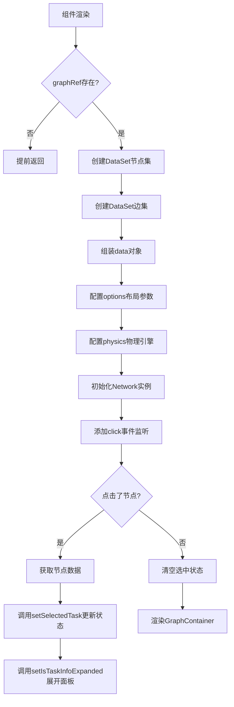
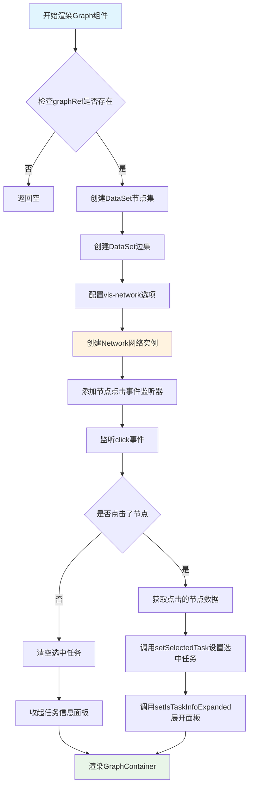
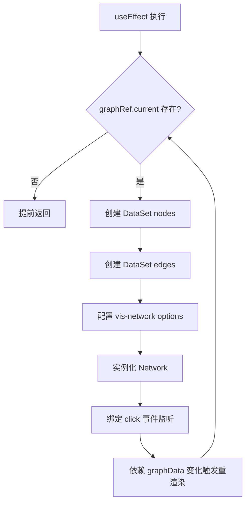
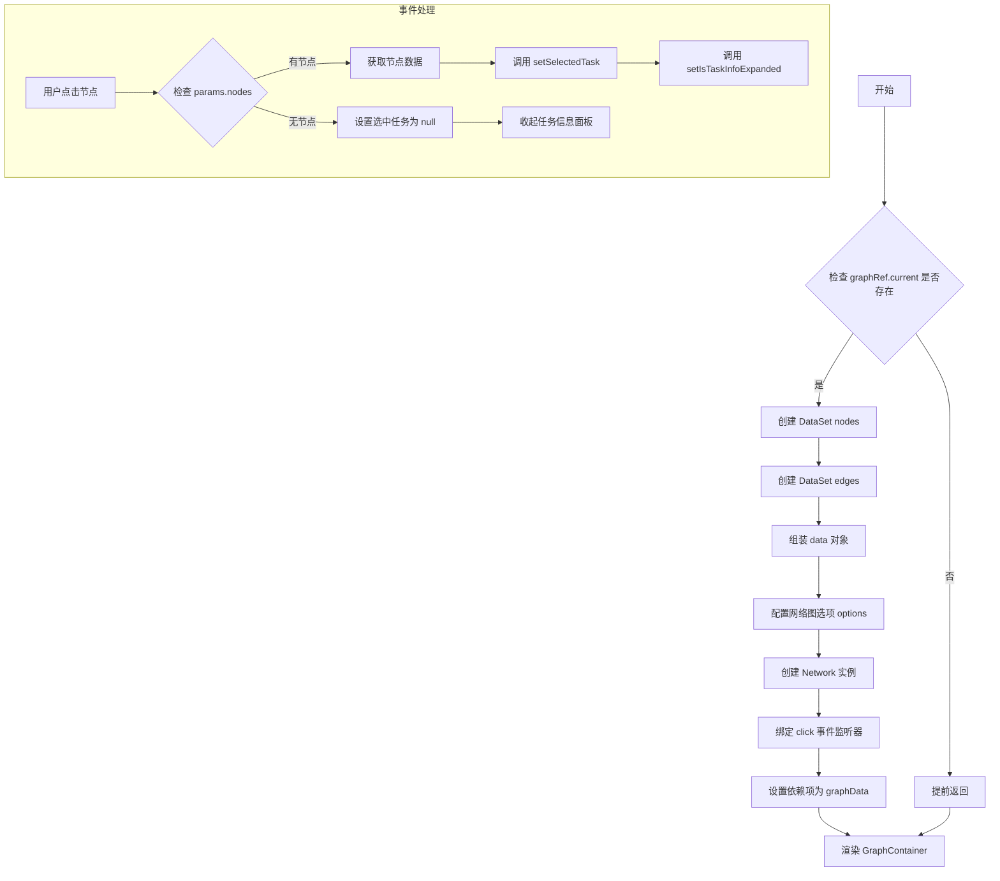

# `.\AutoGPT\classic\benchmark\frontend\src\components\index\Graph.tsx` 详细设计文档

这是一个React组件，用于使用vis-network库渲染交互式的网络拓扑图，支持层级布局和物理引擎模拟，节点可点击以查看任务详情。

## 整体流程



## 类结构

```
React.FC<GraphProps> (函数组件)
├── Graph (主组件)
├── GraphEdge (接口)
├── GraphProps (接口)
└── GraphContainer (styled-component)
```

## 全局变量及字段


### `graphRef`
    
Ref to the container div element for rendering the network graph

类型：`useRef<HTMLDivElement>`
    


### `nodes`
    
Vis-data DataSet containing the graph nodes

类型：`DataSet<GraphNode>`
    


### `edges`
    
Vis-data DataSet containing the graph edges

类型：`DataSet<GraphEdge>`
    


### `data`
    
Combined data object for initializing the vis-network

类型：`{ nodes: DataSet<GraphNode>, edges: DataSet<GraphEdge> }`
    


### `options`
    
Configuration options for the vis-network layout and physics

类型：`object`
    


### `network`
    
The vis-network Network instance for rendering the graph

类型：`Network`
    


### `nodeId`
    
The unique identifier of the clicked node

类型：`string | number`
    


### `clickedNodeArray`
    
Array containing the data of the clicked node from the DataSet

类型：`GraphNode[] | null`
    


### `Graph.graphRef`
    
Ref to the container div element for rendering the network graph

类型：`useRef<HTMLDivElement>`
    


### `Graph.graphData`
    
Graph data containing nodes and edges to be visualized

类型：`{ nodes: GraphNode[], edges: GraphEdge[] }`
    


### `Graph.setSelectedTask`
    
State setter function to update the selected task data

类型：`React.Dispatch<React.SetStateAction<TaskData | null>>`
    


### `Graph.setIsTaskInfoExpanded`
    
State setter function to control the expansion of task info panel

类型：`React.Dispatch<React.SetStateAction<boolean>>`
    
    

## 全局函数及方法


### `Graph`

这是一个React函数组件，用于使用vis-network库渲染交互式层次结构网络图，支持节点点击选择任务并展开详细信息面板。

#### 参数

- `graphData`：对象类型，包含图数据，其中`nodes`是GraphNode类型数组，`edges`是GraphEdge类型数组，用于提供图结构的节点和边数据
- `setSelectedTask`：React.Dispatch<React.SetStateAction<TaskData | null>>类型，用于设置当前选中的任务数据状态
- `setIsTaskInfoExpanded`：React.Dispatch<React.SetStateAction<boolean>>类型，用于控制任务信息面板的展开/收起状态

#### 流程图



#### 带注释源码

```tsx
// 引入React核心Hook和类型
import React, { useEffect, useRef, useState } from "react";

// 引入vis-network库用于图可视化
import { Network } from "vis-network";
// 引入vis-data库用于数据集合管理
import { DataSet } from "vis-data";

// 引入tailwind-styled-components用于样式组件化
import tw from "tailwind-styled-components";

// 引入自定义类型定义
import { GraphNode, TaskData } from "../../lib/types";

// 定义GraphEdge接口，描述边的结构
interface GraphEdge {
  id: string;
  from: string;
  to: string;
  arrows: string;
}

// 定义GraphProps接口，描述组件接收的props
interface GraphProps {
  // 图数据，包含节点和边的数组
  graphData: {
    nodes: GraphNode[];
    edges: GraphEdge[];
  };
  // 设置选中任务的dispatch函数
  setSelectedTask: React.Dispatch<React.SetStateAction<TaskData | null>>;
  // 设置任务信息面板展开状态的dispatch函数
  setIsTaskInfoExpanded: React.Dispatch<React.SetStateAction<boolean>>;
}

// 定义Graph组件，使用React.FC类型约束
const Graph: React.FC<GraphProps> = ({
  graphData,
  setSelectedTask,
  setIsTaskInfoExpanded,
}) => {
  // 使用useRef获取DOM元素引用，用于挂载vis-network
  const graphRef = useRef<HTMLDivElement>(null);

  // 使用useEffect处理副作用：初始化和更新网络图
  useEffect(() => {
    // 防御性检查：确保DOM引用存在
    if (!graphRef.current) {
      return;
    }
    
    // 使用DataSet创建节点数据集合，支持动态添加/删除/更新
    const nodes = new DataSet<GraphNode>(graphData.nodes);
    // 使用DataSet创建边数据集合
    const edges = new DataSet<GraphEdge>(graphData.edges);

    // 准备网络图数据
    const data = {
      nodes: nodes,
      edges: edges,
    };

    // 配置网络图的视觉和行为选项
    const options = {
      // 节点样式配置
      nodes: {
        font: {
          size: 20, // 增加字体大小以提高标签可读性
          color: "black", // 设置清晰的字体颜色
        },
        shapeProperties: {
          useBorderWithImage: true, // 图片节点使用边框
        },
      },
      // 边样式配置
      edges: {
        length: 250, // 增加边的长度以减少视觉拥挤
      },
      // 布局配置：使用层次布局
      layout: {
        hierarchical: {
          enabled: true, // 启用层次布局
          levelSeparation: 300, // 层级间距
          nodeSpacing: 250, // 节点间距
          treeSpacing: 250, // 树间距
          blockShifting: true, // 启用块移动以减少重叠
          edgeMinimization: true, // 启用边最小化
          parentCentralization: true, // 父节点居中
          direction: "UD", // 布局方向：上到下
          sortMethod: "directed", // 排序方法：有向排序
        },
      },
      // 物理引擎配置，控制节点分布
      physics: {
        stabilization: {
          enabled: true, // 启用稳定化过程
          iterations: 1000, // 稳定化迭代次数
        },
        hierarchicalRepulsion: {
          centralGravity: 0.0, // 中心引力为0，保持层次结构
          springLength: 200, // 弹簧长度
          springConstant: 0.01, // 弹簧常数
          nodeDistance: 300, // 节点间距离
          damping: 0.09, // 阻尼系数
        },
        timestep: 0.5, // 时间步长
      },
    };

    // 创建vis-network网络实例，挂载到DOM元素上
    const network = new Network(graphRef.current, data, options);

    // 添加节点点击事件监听器，处理交互逻辑
    network.on("click", (params) => {
      // 检查是否点击了节点
      if (params.nodes.length) {
        // 获取点击的节点ID
        const nodeId = params.nodes[0];
        // 从DataSet中获取节点数据
        const clickedNodeArray = nodes.get(nodeId);
        
        if (clickedNodeArray) {
          // 提取节点数据中的taskData并更新状态
          setSelectedTask((clickedNodeArray as any).data as TaskData);
          // 展开任务信息面板
          setIsTaskInfoExpanded(true);
        }
      } else {
        // 点击空白处时，清空选中任务
        setSelectedTask(null);
        // 收起任务信息面板
        setIsTaskInfoExpanded(false);
      }
    });
  }, [graphData]); // 依赖项：graphData变化时重新初始化网络图

  // 渲染GraphContainer容器组件
  return <GraphContainer ref={graphRef} />;
};

// 导出Graph组件作为默认导出
export default Graph;

// 定义GraphContainer样式组件，使用tailwind-styled-components
const GraphContainer = tw.div`
  w-full
  h-full
`;
```


### `Graph.useEffect`

该 useEffect 钩子用于初始化和更新 vis-network 图谱组件，监听 graphData 变化并创建交互式网络图，同时处理节点点击事件以更新选中的任务信息。

参数：

- `effect callback`：`() => void`，useEffect 的第一个参数，包含初始化网络图和绑定事件监听器的副作用逻辑
- `dependencies`：`[graphData]`，useEffect 的依赖数组，当 graphData 变化时重新执行 effect

返回值：`void`，useEffect 钩子不返回任何值

#### 流程图



#### 带注释源码

```typescript
useEffect(() => {
  // 1. 检查 DOM 引用是否存在，若不存在则提前返回
  if (!graphRef.current) {
    return;
  }
  
  // 2. 使用 graphData 创建 vis-data 的 DataSet 实例
  const nodes = new DataSet<GraphNode>(graphData.nodes);
  const edges = new DataSet<GraphEdge>(graphData.edges);

  // 3. 组装数据对象
  const data = {
    nodes: nodes,
    edges: edges,
  };

  // 4. 配置网络图选项（节点样式、边长度、层级布局、物理引擎）
  const options = {
    nodes: {
      font: {
        size: 20, // 增大标签字体大小
        color: "black", // 设置易读的字体颜色
      },
      shapeProperties: {
        useBorderWithImage: true,
      },
    },
    edges: {
      length: 250, // 增加边的长度
    },
    layout: {
      hierarchical: {
        enabled: true,
        levelSeparation: 300,
        nodeSpacing: 250,
        treeSpacing: 250,
        blockShifting: true,
        edgeMinimization: true,
        parentCentralization: true,
        direction: "UD",
        sortMethod: "directed",
      },
    },
    physics: {
      stabilization: {
        enabled: true,
        iterations: 1000,
      },
      hierarchicalRepulsion: {
        centralGravity: 0.0,
        springLength: 200,
        springConstant: 0.01,
        nodeDistance: 300,
        damping: 0.09,
      },
      timestep: 0.5,
    },
  };

  // 5. 实例化 vis-network 的 Network 对象
  const network = new Network(graphRef.current, data, options);

  // 6. 绑定节点点击事件处理函数
  network.on("click", (params) => {
    // 如果点击了节点
    if (params.nodes.length) {
      const nodeId = params.nodes[0];
      const clickedNodeArray = nodes.get(nodeId);
      if (clickedNodeArray) {
        // 更新选中的任务状态并展开任务信息面板
        setSelectedTask((clickedNodeArray as any).data as TaskData);
        setIsTaskInfoExpanded(true);
      }
    } else {
      // 点击空白处则清除选中状态
      setSelectedTask(null);
      setIsTaskInfoExpanded(false);
    }
  });
}, [graphData]); // 依赖 graphData 变化时重新执行
```


### `network.on`

该方法用于为 vis-network 实例添加事件监听器，监听节点或边的点击事件。当用户点击网络图中的节点时，触发回调函数获取节点数据并更新父组件的状态。

参数：

- `event`：`string`，事件名称，这里为 `"click"`，表示监听点击事件
- `callback`：`function`，事件处理回调函数，参数为 `params` 对象
  - `params`：`Object`，vis-network 传递的事件参数对象
    - `params.nodes`：`Array<string>`，被点击的节点 ID 数组

返回值：`void`，无返回值

#### 流程图

```mermaid
flowchart TD
    A[用户点击网络图] --> B{network.on 监听器触发}
    B --> C{params.nodes.length > 0?}
    C -->|是| D[获取点击的节点ID: params.nodes[0]]
    D --> E[从 DataSet 获取节点数据: nodes.get nodeId]
    E --> F{clickedNodeArray 存在?}
    F -->|是| G[设置选中任务: setSelectedTask nodeData.data]
    G --> H[展开任务信息面板: setIsTaskInfoExpanded true]
    F -->|否| I[不做任何操作]
    C -->|否| J[清除选中任务: setSelectedTask null]
    J --> K[收起任务信息面板: setIsTaskInfoExpanded false]
```

#### 带注释源码

```javascript
// 为 network 实例添加 click 事件监听器
network.on("click", (params) => {
  // 检查是否点击了节点（nodes 数组有元素）
  if (params.nodes.length) {
    // 获取第一个被点击节点的 ID
    const nodeId = params.nodes[0];
    // 从 DataSet 中获取节点数据
    const clickedNodeArray = nodes.get(nodeId);
    // 如果节点数据存在
    if (clickedNodeArray) {
      // 将节点中的 data 字段作为 TaskData 类型传递给父组件
      setSelectedTask((clickedNodeArray as any).data as TaskData);
      // 展开任务信息面板
      setIsTaskInfoExpanded(true);
    }
  } else {
    // 如果点击空白区域，清除选中任务
    setSelectedTask(null);
    // 收起任务信息面板
    setIsTaskInfoExpanded(false);
  }
});
```


### `Graph.useEffect` (初始化网络图)

该函数是 Graph 组件中的一个 useEffect 钩子，用于初始化 vis-network 网络图。它创建节点和边的 DataSet，配置网络图的视觉样式、层级布局和物理引擎，并绑定节点点击事件以更新选中的任务信息。

参数：

- 该 useEffect 无直接参数，但内部依赖 `graphData`（由 React 闭包捕获）和 `graphRef`（useRef）

返回值：`void`，无返回值

#### 流程图



#### 带注释源码

```typescript
// 在 Graph 组件内部
const graphRef = useRef<HTMLDivElement>(null);

// useEffect 钩子：初始化网络图
useEffect(() => {
  // 1. 检查 DOM 容器引用是否存在，若不存在则提前返回
  if (!graphRef.current) {
    return;
  }

  // 2. 使用 vis-data 的 DataSet 创建节点数据集
  const nodes = new DataSet<GraphNode>(graphData.nodes);
  // 3. 使用 vis-data 的 DataSet 创建边数据集
  const edges = new DataSet<GraphEdge>(graphData.edges);

  // 4. 组装网络图数据对象
  const data = {
    nodes: nodes,
    edges: edges,
  };

  // 5. 配置网络图的视觉和交互选项
  const options = {
    // 节点样式配置
    nodes: {
      font: {
        size: 20, // 增大字体以提高可读性
        color: "black", // 设置易读的字体颜色
      },
      shapeProperties: {
        useBorderWithImage: true, // 允许带边框的图片节点
      },
    },
    // 边样式配置
    edges: {
      length: 250, // 增加边的长度以减少视觉拥挤
    },
    // 层级布局配置
    layout: {
      hierarchical: {
        enabled: true, // 启用层级布局
        levelSeparation: 300, // 层级间距
        nodeSpacing: 250, // 节点间距
        treeSpacing: 250, // 树间距
        blockShifting: true, // 启用块移动优化
        edgeMinimization: true, // 启用边最小化
        parentCentralization: true, // 父节点居中
        direction: "UD", // 布局方向：上下
        sortMethod: "directed", // 排序方法：有向
      },
    },
    // 物理引擎配置
    physics: {
      stabilization: {
        enabled: true, // 启用稳定化
        iterations: 1000, // 稳定化迭代次数
      },
      hierarchicalRepulsion: {
        centralGravity: 0.0, // 中心引力
        springLength: 200, // 弹簧长度
        springConstant: 0.01, // 弹簧常数
        nodeDistance: 300, // 节点距离
        damping: 0.09, // 阻尼系数
      },
      timestep: 0.5, // 时间步长
    },
  };

  // 6. 创建 vis-network 的 Network 实例，渲染到 graphRef 容器
  const network = new Network(graphRef.current, data, options);

  // 7. 绑定节点点击事件监听器
  network.on("click", (params) => {
    // 检查是否点击了节点
    if (params.nodes.length) {
      // 获取点击的节点 ID
      const nodeId = params.nodes[0];
      // 从 DataSet 获取节点数据
      const clickedNodeArray = nodes.get(nodeId);
      if (clickedNodeArray) {
        // 提取节点数据并更新选中任务状态
        setSelectedTask((clickedNodeArray as any).data as TaskData);
        // 展开任务信息面板
        setIsTaskInfoExpanded(true);
      }
    } else {
      // 点击空白区域，清除选中任务
      setSelectedTask(null);
      // 收起任务信息面板
      setIsTaskInfoExpanded(false);
    }
  });
  // 8. 设置依赖项：当 graphData 变化时重新执行初始化
}, [graphData]);
```


### `Graph.network.on("click", ...)`

该函数是 vis-network 的点击事件处理回调，当用户点击图中的节点时触发，用于获取被点击节点的数据并更新父组件的状态。

参数：

- `params`：`Object`，vis-network 事件参数对象，包含 `nodes`（被点击的节点 ID 数组）等信息

返回值：`void`，无返回值

#### 流程图

```mermaid
flowchart TD
    A[开始: 接收 params 参数] --> B{params.nodes.length > 0?}
    B -->|是| C[获取 nodeId = params.nodes[0]]
    C --> D[从 DataSet 获取节点数据: nodes.get(nodeId)]
    D --> E{节点数据存在?}
    E -->|是| F[setSelectedTask(节点数据.data as TaskData)]
    F --> G[setIsTaskInfoExpanded(true)]
    E -->|否| H[结束]
    B -->|否| I[setSelectedTask(null)]
    I --> J[setIsTaskInfoExpanded(false)]
    G --> H
    J --> H
```

#### 带注释源码

```typescript
// vis-network 的点击事件处理回调函数
network.on("click", (params) => {
  // 检查是否有节点被点击（params.nodes 数组是否非空）
  if (params.nodes.length) {
    // 获取被点击节点的 ID（取第一个节点）
    const nodeId = params.nodes[0];
    
    // 从 DataSet 中获取节点数据
    const clickedNodeArray = nodes.get(nodeId);
    
    // 检查节点数据是否存在
    if (clickedNodeArray) {
      // 将节点的数据部分转换为 TaskData 类型，并更新父组件状态
      setSelectedTask((clickedNodeArray as any).data as TaskData);
      // 展开任务信息面板
      setIsTaskInfoExpanded(true);
    }
  } else {
    // 如果点击的是空白区域（没有节点），则清空选中状态
    setSelectedTask(null);
    // 收起任务信息面板
    setIsTaskInfoExpanded(false);
  }
});
```

## 关键组件


### Graph 组件

核心渲染组件，使用 vis-network 库渲染层次化任务图，支持节点点击选择和任务信息展开/收起。

### vis-network Network 实例

通过 vis-network 库创建的网络图实例，负责图形的渲染、布局计算和交互响应。

### DataSet 数据管理

使用 vis-data 库的 DataSet 分别管理图节点和边数据，支持动态数据更新和高效查询。

### 节点点击事件处理

监听网络图的 click 事件，实现节点选中状态管理，触发父组件更新选中任务和展开任务信息面板。

### hierarchical 布局配置

配置层次化树状布局，设定节点方向为从上到下(UD)，控制层级分离、节点间距和块偏移等参数。

### physics 物理引擎配置

配置物理模拟参数实现图的稳定渲染，包括层次斥力、中心引力、弹簧常数等，确保布局平滑过渡。

### GraphNode/GraphEdge 类型定义

定义图的节点和边的 TypeScript 接口规范，确保数据结构和类型安全。


## 问题及建议


### 已知问题

-   **内存泄漏风险**：useEffect 中创建了 `Network` 实例，但没有在组件卸载时调用 `network.destroy()` 进行清理，会导致内存泄漏
-   **闭包陷阱**：useEffect 的依赖数组只包含 `graphData`，但回调中使用了 `setSelectedTask` 和 `setIsTaskInfoExpanded`，当这些 setter 函数引用变化时，可能无法获取最新的状态（虽然在此场景下影响较小，但仍是潜在问题）
-   **类型安全缺失**：使用 `(clickedNodeArray as any).data` 进行类型断言，绕过了 TypeScript 类型检查，容易引入运行时错误
-   **配置硬编码**：Network 的 options 配置（字体大小、边长、层级参数等）全部硬编码在组件内部，不利于后期维护和调整
-   **重复创建实例**：每次 `graphData` 变化都会重新创建 `DataSet` 和 `Network` 实例，没有增量更新机制，性能可以优化
-   **缺少错误处理**：网络初始化过程没有 try-catch 包裹，如果 vis-network 初始化失败会导致未捕获的异常

### 优化建议

-   在 useEffect 中返回清理函数，调用 `network.destroy()` 销毁实例
-   将 `setSelectedTask` 和 `setIsTaskInfoExpanded` 加入依赖数组，或使用 useCallback 包装
-   定义明确的类型接口替代 any 断言，或通过 vis-network 的类型定义获取正确的返回类型
-   将 options 配置抽取为独立的常量对象或配置文件，提升可维护性
-   考虑使用 vis-network 的 `setData()` 方法进行增量更新，避免完全重建实例
-   添加错误边界或 try-catch 处理 Network 初始化异常，提升组件健壮性


## 其它


### 设计目标与约束

**设计目标**：使用vis-network库在React组件中渲染层次化任务图，支持节点点击交互以展开任务详情面板，实现任务依赖关系的可视化展示。

**约束条件**：
- 依赖vis-network v7+和vis-data库进行图渲染
- 使用React Hooks (useEffect, useRef)管理组件生命周期和网络实例
- 样式采用tailwind-styled-components进行样式封装
- 图布局采用层级布局(layout: hierarchical)，方向为从上到下(direction: "UD")

### 错误处理与异常设计

**空引用检查**：在useEffect中首先验证graphRef.current是否存在，若不存在则直接返回，避免在null元素上初始化Network实例

**节点数据验证**：点击节点时检查nodes.get()返回值是否为null/undefined，防止访问空对象属性导致运行时错误

**图数据为空处理**：当graphData.nodes或graphData.edges为空时，vis-network会渲染空白画布，不会抛出异常，属于预期行为

**依赖项变更处理**：将graphData放入useEffect依赖数组，当图数据变化时重新创建Network实例，确保视图与数据同步

### 数据流与状态机

**数据输入流**：
- graphData: {nodes: GraphNode[], edges: GraphEdge[]} - 图的节点和边数据
- setSelectedTask: (task: TaskData | null) => void - 父组件状态更新函数，用于设置选中的任务数据
- setIsTaskInfoExpanded: (expanded: boolean) => void - 父组件状态更新函数，用于控制任务详情面板展开状态

**状态转换**：
- 初始状态：无节点被选中，任务详情面板收起
- 节点点击状态：选中节点时，setSelectedTask被调用设置任务数据，setIsTaskInfoExpanded被调用展开面板
- 空白区域点击状态：取消选中，setSelectedTask(null)，setIsTaskInfoExpanded(false)

### 外部依赖与接口契约

**直接依赖**：
- react (^18.0.0) - React核心库
- vis-network (^7.0.0) - 图网络可视化库
- vis-data (^7.0.0) - vis-network数据管理库
- tailwind-styled-components - CSS样式方案

**内部依赖**：
- ../../lib/types - GraphNode和TaskData类型定义

**接口契约**：
- GraphProps接口定义了组件的输入props结构
- graphData.nodes中每个元素必须包含id属性
- graphData.edges中每个元素必须包含id、from、to、arrows属性
- setSelectedTask和setIsTaskInfoExpanded必须是有效的React状态更新函数

### 性能考虑

**渲染优化**：
- 使用useRef存储Network实例引用，避免重新创建（当前实现每次graphData变化都会重新创建）
- 图数据较大时，DataSet相比普通数组有更好的增量更新性能

**配置优化**：
- physics.stabilization.iterations设为1000，确保布局稳定
- physics.timestep设为0.5，平衡动画流畅度和计算开销
- layout.hierarchical相关配置确保层次布局的节点间距和层级分离

**潜在优化点**：
- 考虑使用network.setData()进行增量更新而非完全重创建
- 对于大型图可禁用物理引擎(stabilization.enabled: false)提升初始渲染速度

### 安全性考虑

**数据安全性**：组件本身不存储敏感数据，仅接收props并回调父组件处理

**XSS防护**：vis-network渲染的节点标签使用font.color配置为"black"，避免使用用户可控的颜色值

### 可访问性

**键盘交互**：vis-network原生支持部分键盘操作，但当前未配置自定义键盘事件处理器

**屏幕阅读器**：图内容为canvas绘制，无原生ARIA支持，建议在外部提供图数据的文本描述或替代视图

### 测试策略

**单元测试**：
- 测试组件渲染（Snapshot测试）
- 测试props传递正确性
- 测试useEffect依赖数组正确性

**集成测试**：
- 模拟节点点击事件，验证setSelectedTask和setIsTaskInfoExpanded调用
- 验证graphData变化时Network重新初始化

**测试注意事项**：
- vis-network依赖canvas元素，需在jsdom环境中配置canvas支持
- 考虑使用React Testing Library进行行为驱动测试

### 部署注意事项

**环境要求**：
- 需要安装vis-network和vis-data npm包
- 需要配置tailwind-styled-components

**构建考量**：
- vis-network包含较大的库体积(约500KB)，建议使用code splitting
- 考虑配置Webpack/Vite的tree shaking优化

**运行时要求**：
- 浏览器需要支持canvas元素
- 建议最小支持React 16.8+以支持Hooks


    