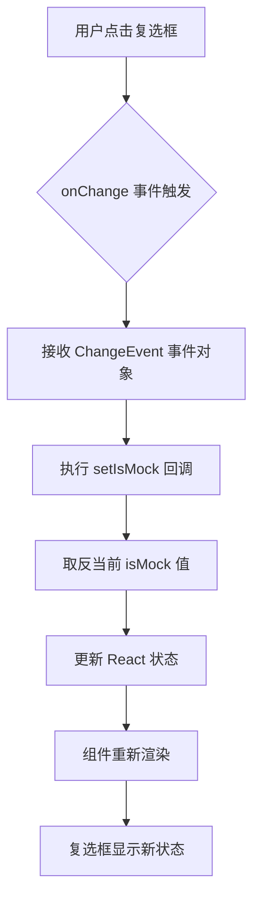

# `.\AutoGPT\classic\benchmark\frontend\src\components\index\MockCheckbox.tsx` 详细设计文档

这是一个基于 React 和 Tailwind CSS 的受控复选框组件，用于通过 UI 交互切换模拟测试的布尔状态，并提供相应的样式展示。

## 整体流程

```mermaid
graph TD
    A[父组件] -->|传入 props| B(MockCheckbox)
    B --> C{渲染视图}
    C --> D[CheckboxWrapper]
    D --> E[MockCheckboxInput]
    D --> F[文本: Run mock test]
    E -- 用户点击 --> G[onChange 事件]
    G --> H[setIsMock(!isMock)]
    H --> I[React 状态更新]
    I --> B
```

## 类结构

```
MockCheckbox (React 函数组件)
├── CheckboxWrapper (Tailwind 样式化容器)
└── MockCheckboxInput (Tailwind 样式化输入框)
```

## 全局变量及字段


### `MockCheckboxInput`
    
使用 tailwind-styled-components 定义的复选框输入框组件

类型：`StyledComponent<React.InputHTMLAttributes<HTMLInputElement>>`
    


### `CheckboxWrapper`
    
使用 tailwind-styled-components 定义的标签容器组件

类型：`StyledComponent<React.LabelHTMLAttributes<HTMLLabelElement>>`
    


### `MockCheckbox.isMock`
    
标识当前是否为模拟测试状态的布尔值

类型：`boolean`
    


### `MockCheckbox.setIsMock`
    
用于更新 isMock 状态的 React setter 函数

类型：`Dispatch<SetStateAction<boolean>>`
    


### `MockCheckbox.onChange`
    
监听复选框变化，切换 setIsMock 的值

类型：`EventHandler<ChangeEvent<HTMLInputElement>>`
    
    

## 全局函数及方法


### `MockCheckbox.onChange`

监听复选框的变化事件，当用户点击复选框时，触发状态更新回调，切换 `isMock` 的布尔值，从而更新父组件的测试模式状态。

参数：

-  `event`：`React.ChangeEvent<HTMLInputElement>`，标准的 React checkbox 变化事件对象，虽然未在函数体中使用，但作为事件处理器必须接收此参数以符合 React 事件处理规范

返回值：`void`，无返回值，该函数仅执行副作用（状态更新）

#### 流程图



#### 带注释源码

```tsx
// onChange 事件处理器：监听复选框状态变化
// 参数 event: React.ChangeEvent<HTMLInputElement> - 标准的变化事件对象
// 返回值: void - 无返回值，仅执行状态更新
onChange={(event) => {
  // event 参数虽然未使用，但必须保留以符合 React 事件处理器签名
  // 调用 setIsMock 函数，传入当前 isMock 的取反值
  setIsMock(!isMock);
}}
```

> **备注**：该方法是一个内联的匿名箭头函数，作为 `MockCheckboxInput` 组件的 `onChange` 属性值。它没有显式声明参数类型，但根据 React 的事件系统，实际上接收 `React.ChangeEvent<HTMLInputElement>` 类型的 event 对象。

## 关键组件


### MockCheckbox

一个React函数组件，用于渲染模拟测试的复选框，通过props控制选中状态并提供状态更新回调。

### MockCheckboxInput

使用tailwind-styled-components定义的美化复选框输入组件，应用了蓝色焦点样式的边框和环效果。

### CheckboxWrapper

使用tailwind-styled-components定义的标签包装器组件，提供flex布局和项目间距样式。


## 问题及建议


### 已知问题

-   **状态更新逻辑不安全**：在`onChange`中直接使用`setIsMock(!isMock)`，由于React状态更新的异步性，可能导致状态更新不符合预期
-   **无障碍性（Accessibility）缺失**：缺少`id`和`htmlFor`属性关联，屏幕阅读器无法正确识别标签与复选框的关系
-   **文本硬编码**：复选框标签文本"Run mock test"直接写在组件内，不利于国际化或多处复用
-   **Props类型定义冗余**：使用`React.Dispatch<React.SetStateAction<boolean>>`这样的复杂类型，可读性较差
-   **组件可复用性差**：文本内容、样式完全写死，无法通过props自定义

### 优化建议

-   **使用函数式setState**：将`onChange={() => setIsMock(!isMock)}`改为`onChange={() => setIsMock(prev => !prev)}`
-   **添加无障碍支持**：为input添加`id`属性，为label添加`htmlFor`属性，或使用`aria-label`属性
-   **提取文本为props**：添加`label`或`children` prop，使组件可自定义显示文本
-   **简化Props类型**：可定义`SetBooleanState`类型别名，或考虑使用`useReducer`
-   **添加组件文档注释**：为组件、props和方法添加JSDoc注释，提高代码可维护性

## 其它


### 设计目标与约束

本组件的设计目标是提供一个可复用的mock测试复选框控件，用于在测试环境中切换是否运行mock测试。设计约束包括：1) 必须与React函数组件和TypeScript配合使用；2) 必须使用tailwind-styled-components进行样式管理；3) 组件必须是受控组件（controlled component），通过props控制状态；4) 遵循React Hooks的命名规范。

### 错误处理与异常设计

由于本组件为纯展示型UI组件，不涉及复杂的业务逻辑和异步操作，因此错误处理相对简单。组件本身不抛出异常，主要通过父组件传递正确的props来保证功能正常。父组件应确保`setIsMock`为合法函数，且`isMock`为布尔值。若props类型不匹配，控制台会输出React的prop-types警告。

### 数据流与状态机

本组件的数据流为单向向下流动模式（Unidirectional Data Flow）。父组件持有状态`isMock`（boolean类型），通过props传递给`MockCheckbox`组件。用户点击复选框时，触发`onChange`事件，调用父组件传入的`setIsMock`回调函数，传递取反后的新值。父组件更新状态后，重新渲染`MockCheckbox`组件并展示新的选中状态。不存在内部状态机，所有状态管理由父组件负责。

### 外部依赖与接口契约

本组件依赖以下外部依赖：1) React（版本16.8+以支持Hooks）；2) tailwind-styled-components（用于样式管理）；3) TypeScript（用于类型安全）。接口契约方面，组件接受`isMock`（boolean，必填）和`setIsMock`（React.Dispatch<React.SetStateAction<boolean>>，必填）两个props。组件返回值类型为`React.FC<MockCheckboxProps>`，渲染结果为一个包含input和span的label元素。

### 性能考虑

当前实现已具备较好的性能，因其为纯展示组件且无复杂计算。在大规模使用时，建议：1) 使用React.memo包装组件以避免不必要的重渲染；2) 如果父组件渲染频繁，可将回调函数用useCallback包裹以避免子组件不必要地更新；3) 当前组件体积较小，打包时不会被tree-shaking移除，因其为具名导出且被标记为默认导出。

### 安全考虑

当前组件不涉及用户敏感数据处理、安全敏感操作或外部数据渲染，安全性风险较低。潜在关注点：1) 如果在生产环境中使用，需确保组件源码不被恶意注入；2) 如未来扩展支持HTML原生的value属性，需防范XSS攻击；3) 建议使用React的默认安全实践，避免使用dangerouslySetInnerHTML。

### 可访问性（Accessibility）

当前组件的可访问性支持包括：1) 使用标准的HTML `<input type="checkbox">`元素，天然支持键盘交互；2) label包裹input和文本，提供点击区域；3) 文本"Run mock test"为屏幕阅读器提供上下文。改进建议：1) 可添加`aria-label`属性提供更明确的语义；2) 可添加`aria-checked`属性反映选中状态；3) 可为组件添加`role="checkbox"`以增强语义；4) 建议添加视觉焦点指示器（当前tailwind已有focus样式）。

### 测试策略

建议的测试策略包括：1) 单元测试：使用React Testing Library测试组件渲染、props传递、事件触发；2) 快照测试：记录组件渲染输出以防止意外变更；3) 交互测试：模拟用户点击验证回调函数被正确调用；4) 类型测试：使用TypeScript确保类型安全。示例测试用例：验证props.isMock为true时input为选中状态；验证点击后setIsMock被调用且参数为!isMock。

### 主题定制能力

当前组件使用tailwind-styled-components进行样式定义，提供了基础的主题定制能力。已有的tailwind类包括：border、rounded、focus:border-blue-400、focus:ring等。改进建议：1) 可通过props接收自定义className覆盖默认样式；2) 可使用CSS变量实现运行时主题切换；3) 可导出样式配置对象供外部自定义；4) 可支持传入color prop改变主题色（当前硬编码为blue-400和blue-200）。

### 版本兼容性

依赖版本要求：1) React 16.8.0+（因使用Hooks语法）；2) TypeScript 2.7+（因使用FC泛型）；3) tailwind-styled-components 1.8+（标准版本）。浏览器兼容性：依赖现代浏览器支持的CSS特性（focus-ring、flex、transform等），IE11可能需要额外polyfill。React版本兼容性：代码使用React.FC类型定义，推荐React 17+以获得更好的JSX转换支持。

### 文档和注释规范

当前代码注释较少，建议补充：1) 文件头部添加组件功能描述和使用说明；2) 为interface添加JSDoc注释说明各字段用途；3) 为组件添加示例代码展示用法；4) 建议使用Storybook或类似工具创建组件文档。推荐注释格式遵循TSDoc规范，便于生成API文档。


    