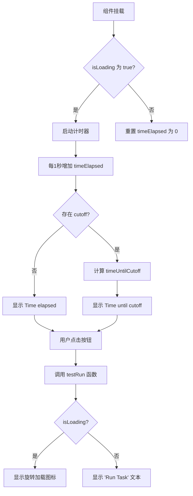
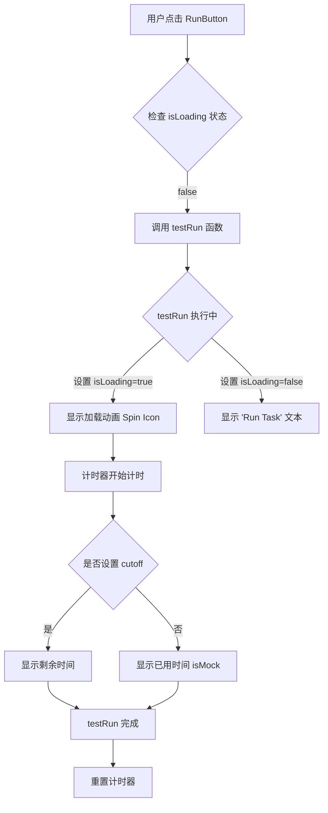
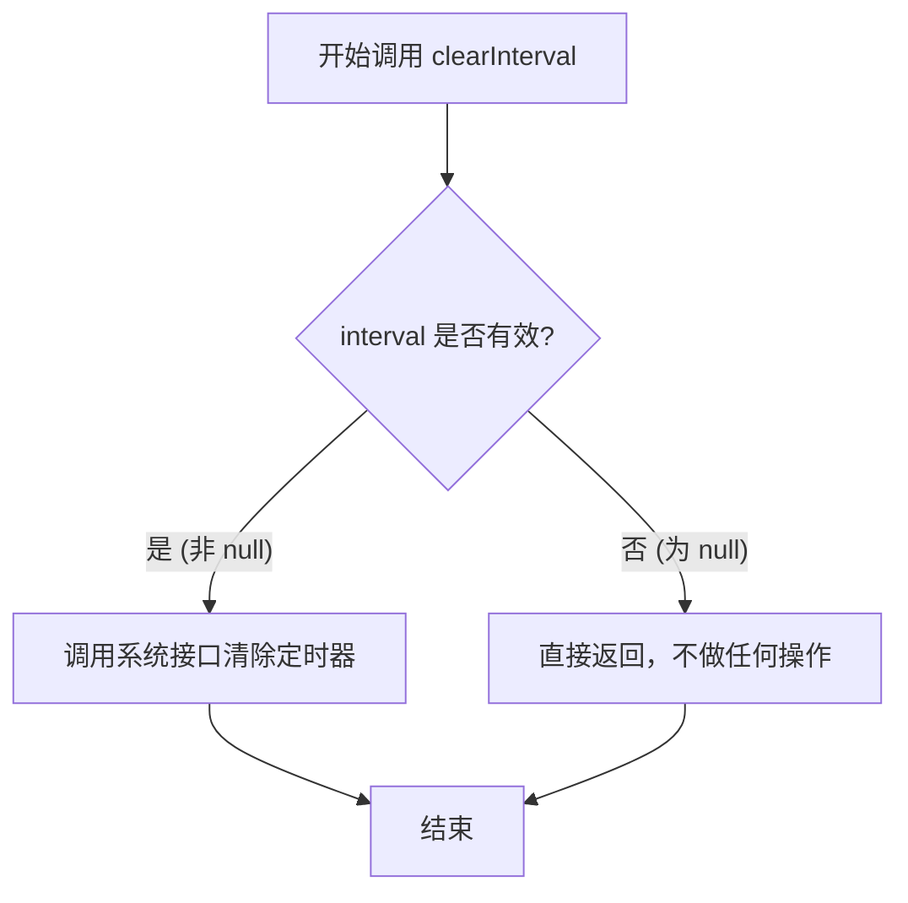
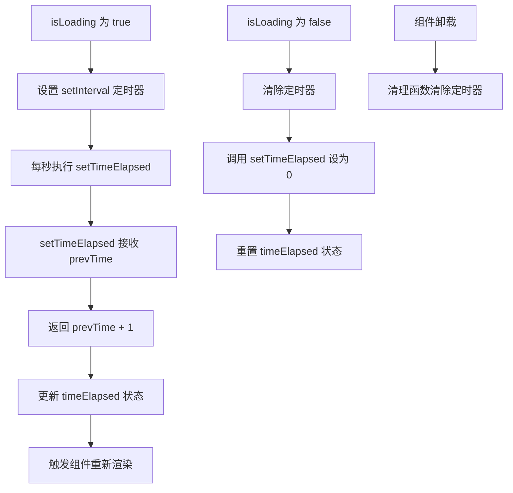
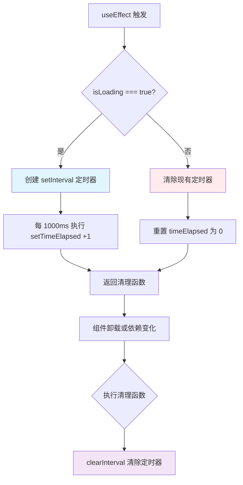
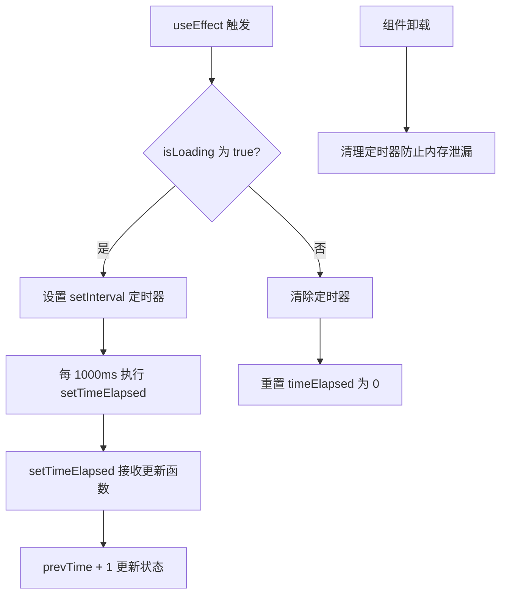
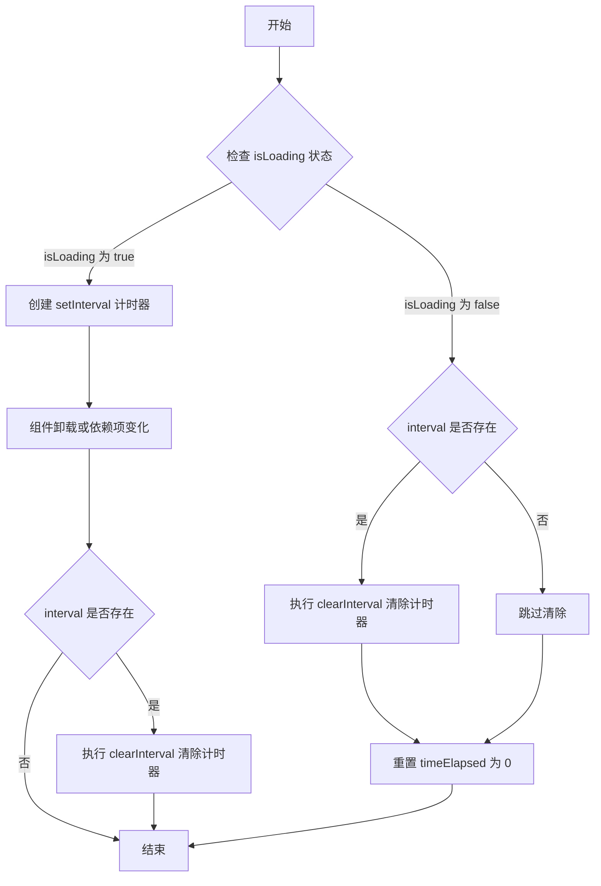
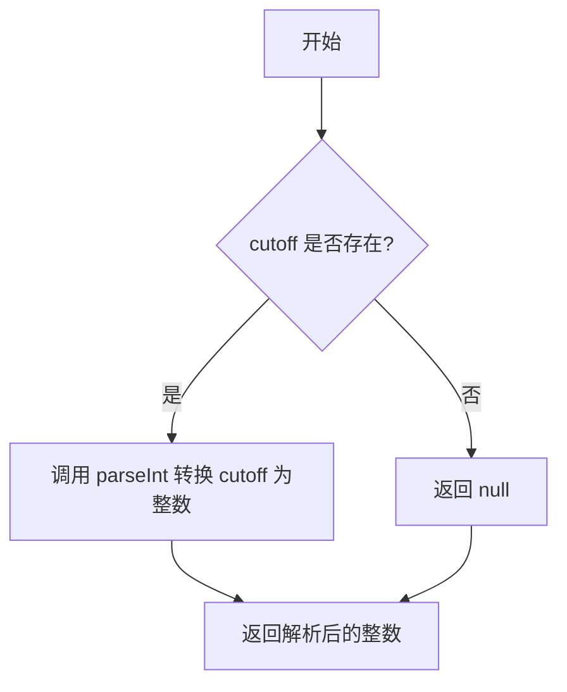

# `.\AutoGPT\classic\benchmark\frontend\src\components\index\RunButton.tsx` 详细设计文档

一个React按钮组件，用于执行任务并显示加载状态，支持可选的截止时间倒计时功能，适用于测试或模拟场景。

## 整体流程



## 类结构

```
RunButton (React FC 组件)
├── Props 接口: RunButtonProps
│   ├── testRun: () => Promise<void>
│   ├── isLoading: boolean
│   ├── cutoff?: string
│   └── isMock: boolean
└── 内部状态
    ├── intCutoff: number | null
    └── timeElapsed: number
```

## 全局变量及字段


### `intCutoff`
    
解析 cutoff 字符串得到的整数，若 cutoff 为空则为空值

类型：`number | null`
    


### `timeElapsed`
    
已用时间计数器，单位为秒，通过 useState 管理

类型：`number`
    


### `interval`
    
setInterval 返回的计时器引用，用于清除计时器

类型：`NodeJS.Timeout | null`
    


### `timeUntilCutoff`
    
距离截止时间的剩余秒数，若无截止时间则为空值

类型：`number | null`
    


### `RunButton.testRun`
    
测试运行函数，点击按钮时触发异步任务

类型：`() => Promise<void>`
    


### `RunButton.isLoading`
    
加载状态标志，true 表示任务正在执行中

类型：`boolean`
    


### `RunButton.cutoff`
    
可选的截止时间字符串，用于限制任务执行时长

类型：`string | undefined`
    


### `RunButton.isMock`
    
模拟模式标志，true 时显示已用时间而非剩余时间

类型：`boolean`
    


### `RunButton.intCutoff`
    
解析后的截止时间数值

类型：`number | null`
    


### `RunButton.timeElapsed`
    
组件内部维护的已用时间状态

类型：`number`
    


### `RunButton.interval`
    
组件内部使用的计时器引用

类型：`NodeJS.Timeout | null`
    
    

## 全局函数及方法


### `testRun`

这是一个异步函数 prop，当用户点击运行按钮时触发。该函数用于执行实际的任务（如运行测试），组件会根据 `isLoading` 状态显示加载动画。

参数：

- 无参数

返回值：`Promise<void>`，表示一个异步操作，完成后无返回值

#### 流程图



#### 带注释源码

```typescript
// 定义 RunButton 组件的 Props 接口
interface RunButtonProps {
  // testRun: 一个异步函数 prop，点击按钮时触发
  // 返回 Promise<void>，表示异步操作完成
  testRun: () => Promise<void>;
  
  // isLoading: 布尔值，控制加载状态
  isLoading: boolean;
  
  // cutoff: 可选的截止时间字符串（秒）
  cutoff?: string;
  
  // isMock: 布尔值，用于区分是否为模拟模式
  isMock: boolean;
}

// 组件实现
const RunButton: React.FC<RunButtonProps> = ({
  testRun,        // 异步函数，点击按钮时调用
  isLoading,      // 控制按钮显示状态
  cutoff,         // 可选的截止时间
  isMock,         // 模拟模式标志
}) => {
  // ... 组件内部逻辑
  
  // 按钮点击处理 - 调用 testRun 函数
  return (
    <RunButtonWrapper onClick={testRun}>
      {/* 根据 isLoading 状态显示不同内容 */}
      {!isLoading ? (
        "Run Task"  // 非加载状态显示文本
      ) : (
        // 加载状态显示旋转加载图标
        <FontAwesomeIcon size="lg" icon={faCircleNotch} spin />
      )}
    </RunButtonWrapper>
  );
};
```

---

**注意**：`testRun` 函数本身并未在此文件中定义，它作为 React 组件的 prop 从父组件传入。上述文档基于其类型签名 `() => Promise<void>` 和在当前组件中的使用方式进行分析。实际实现位于使用 `RunButton` 组件的父级文件中。


### `parseInt`

描述：`parseInt` 是 JavaScript 全局函数，用于将字符串解析为整数。在该代码中，它将 `cutoff` 字符串参数转换为数值类型，以便与 `timeElapsed` 进行比较计算剩余时间。

参数：

- `cutoff`：`string | undefined`，从接口传入的字符串类型的截止时间值
- `radix`：`number`（可选），进制基数，默认为 10

返回值：`number`，返回解析后的整数；如果无法解析则返回 `NaN`

#### 流程图

```mermaid
flowchart TD
    A[开始] --> B{cutoff 是否存在}
    B -->|是| C[调用 parseInt(cutoff)]
    B -->|否| D[返回 null]
    C --> E{parseInt 是否成功解析}
    E -->|成功| F[返回解析后的整数]
    E -->|失败| G[返回 NaN]
```

#### 带注释源码

```javascript
// 使用 JavaScript 全局 parseInt 函数将字符串 cutoff 转换为整数
const intCutoff = cutoff ? parseInt(cutoff) : null;

// parseInt 函数签名: parseInt(string, radix)
// - string: 要解析的字符串
// - radix: 介于 2-36 之间的进制基数，默认为 10

// 在此代码中的具体调用：
// 1. 首先判断 cutoff 是否存在（truthy check）
// 2. 如果存在，调用 parseInt(cutoff) 将字符串转换为整数
// 3. 如果不存在，直接返回 null

// 示例：
// cutoff = "30" -> intCutoff = 30
// cutoff = undefined -> intCutoff = null
// cutoff = "abc" -> intCutoff = NaN
```


### `setInterval` (useEffect 内部)

这是 JavaScript 全局函数，在 React 组件的 `useEffect` 钩子中被调用，用于在 `isLoading` 为 `true` 时创建一个每秒钟触发一次的定时器，以更新已用时间计数器。

参数：

- `callback`：`() => { setTimeElapsed((prevTime) => prevTime + 1); }`，定时器触发时执行的回调函数，用于将计时器增加 1 秒
- `delay`：`number`（值为 1000），定时器触发的时间间隔，单位为毫秒

返回值：`NodeJS.Timeout | null`，返回定时器的唯一标识符，用于后续通过 `clearInterval` 清除该定时器

#### 流程图

```mermaid
flowchart TD
    A[useEffect 触发] --> B{isLoading === true?}
    B -->|是| C[创建 setInterval 定时器]
    C --> D[每 1000ms 执行回调函数]
    D --> E[setTimeElapsed(prevTime => prevTime + 1)]
    E --> F[返回 timeout ID]
    B -->|否| G{interval !== null?}
    G -->|是| H[clearInterval 清除定时器]
    G -->|否| I[setTimeElapsed(0) 重置计时器]
    H --> I
    I --> J[组件卸载时清理]
```

#### 带注释源码

```typescript
useEffect(() => {
  // 定义一个可以持有定时器引用的变量，初始为 null
  let interval: NodeJS.Timeout | null = null;

  // 根据 isLoading 状态决定是启动还是停止定时器
  if (isLoading) {
    // 当 isLoading 为 true 时，创建 setInterval 定时器
    interval = setInterval(
      // 回调函数：每次触发时将 timeElapsed 增加 1
      () => {
        setTimeElapsed((prevTime) => prevTime + 1);
      },
      // 定时器间隔：1000 毫秒（1 秒）
      1000
    );
  } else {
    // 当 isLoading 为 false 时
    if (interval !== null) {
      // 如果存在有效的定时器，则清除它
      clearInterval(interval);
    }
    // 重置计时器为 0
    setTimeElapsed(0); // Reset the timer when not loading
  }

  // 清理函数：在组件卸载或依赖项变化前执行
  return () => {
    if (interval !== null) {
      // 确保定时器被清除，防止内存泄漏
      clearInterval(interval);
    }
  };
  // 依赖数组：仅当 isLoading 变化时重新执行 effect
}, [isLoading]);
```


### `clearInterval`

描述：`clearInterval` 是 JavaScript 的全局函数，用于取消通过 `setInterval` 设置的重复定时器。在 `RunButton` 组件中，该函数被用于两个关键场景：当 `isLoading` 状态变为 `false`（任务停止）时，以及组件即将卸载（`useEffect` 的清理函数）时，用来停止正在运行的计时器并重置状态，防止内存泄漏和逻辑错误。

参数：

- `interval`：`NodeJS.Timeout | null`，由 `setInterval` 返回的定时器 ID（类型在 Node.js 环境下为 `NodeJS.Timeout`，在浏览器环境下为 `number`）。在代码中对应 `useEffect` 内部声明的变量 `interval`。

返回值：`void`，该函数没有返回值。

#### 流程图



#### 带注释源码

```javascript
    // ... 在 useEffect 内部
    
    // 场景一：isLoading 为 false 时，清除定时器
    } else {
      if (interval !== null) {
        // 检查 interval 是否存在（即定时器是否正在运行）
        // 如果存在，则调用 clearInterval 停止计时
        clearInterval(interval); 
      }
      setTimeElapsed(0); // 重置耗时计数器
    }

    // 场景二：组件卸载时的清理函数
    return () => {
      if (interval !== null) {
        // 组件销毁或依赖项变化时，必须清除定时器以避免内存泄漏
        clearInterval(interval);
      }
    };
    // ...
```


### `setTimeElapsed`

`setTimeElapsed` 是 React `useState` 钩子生成的状态更新函数，用于更新 `RunButton` 组件中已用时间（秒）的状态值。该函数在 `useEffect` 中被调用，实现每秒自动递增计时器的功能。

参数：

- `prevTime`： `number` 或 `(prevTime: number) => number`，当使用函数式更新时，参数为之前的时间值（秒）；当直接传入数值时，为要设置的新值。

返回值：`void`，无返回值，用于触发 React 组件重新渲染。

#### 流程图



#### 带注释源码

```typescript
// useState 钩子返回的 setter 函数
// 第一个参数是状态初始值 0（表示已用时间初始为0秒）
const [timeElapsed, setTimeElapsed] = useState<number>(0);

// 在 useEffect 中使用 setTimeElapsed 实现计时器功能
useEffect(() => {
  let interval: NodeJS.Timeout | null = null;

  if (isLoading) {
    // 当加载状态为 true 时，设置每秒执行的定时器
    interval = setInterval(() => {
      // 使用函数式更新：setTimeElapsed 接收一个函数
      // 该函数的参数 prevTime 是当前的时间值
      // 返回 prevTime + 1 表示增加 1 秒
      setTimeElapsed((prevTime) => prevTime + 1);
    }, 1000); // 间隔 1000 毫秒（1秒）
  } else {
    // 当加载状态为 false 时，清除定时器
    if (interval !== null) {
      clearInterval(interval);
    }
    // 重置计时器：将 timeElapsed 设置为 0
    setTimeElapsed(0); // Reset the timer when not loading
  }

  // 清理函数：组件卸载时清除定时器，防止内存泄漏
  return () => {
    if (interval !== null) {
      clearInterval(interval);
    }
  };
}, [isLoading]); // 依赖项为 isLoading，当加载状态变化时重新执行 effect
```

#### 补充说明

- **函数类型**：`setTimeElapsed` 不是独立定义的函数，而是 React `useState` 钩子自动生成的 setter 函数
- **调用方式**：支持两种调用方式——直接赋值（如 `setTimeElapsed(5)`）和函数式更新（如 `setTimeElapsed(prev => prev + 1)`）
- **状态关联**：与 `timeElapsed` 状态变量配合使用，形成一个完整的计时器机制
- **使用场景**：在任务执行（isLoading 为 true）时显示已运行时间，供用户了解任务进度


### `RunButton.useEffect`

这是一个 React 副作用钩子，用于管理运行按钮的计时器功能。当 `isLoading` 为 true 时启动定时器每秒递增计时；当 `isLoading` 为 false 时清除定时器并重置计时器；同时提供清理函数防止组件卸载时的内存泄漏。

**注意**：useEffect 是 React 的内置 Hook，其本身不接受自定义参数。它的行为由依赖数组 `[isLoading]` 决定。

#### 流程图



#### 带注释源码

```javascript
useEffect(() => {
    // 定义一个变量来存储定时器引用，初始为 null
    let interval: NodeJS.Timeout | null = null;

    // 根据 isLoading 状态决定是启动还是停止计时器
    if (isLoading) {
      // 当正在加载时，启动每秒递增的定时器
      interval = setInterval(() => {
        // 使用函数式更新方式获取前一个时间值并加 1
        setTimeElapsed((prevTime) => prevTime + 1);
      }, 1000); // 1000 毫秒 = 1 秒
    } else {
      // 当不加载时，如果存在定时器则清除它
      if (interval !== null) {
        clearInterval(interval);
      }
      // 重置计时器为 0
      setTimeElapsed(0); // Reset the timer when not loading
    }

    // 清理函数：在组件卸载或依赖项变化时执行
    return () => {
      // 确保定时器被正确清除，防止内存泄漏
      if (interval !== null) {
        clearInterval(interval);
      }
    };
  }, [isLoading]); // 依赖数组：仅当 isLoading 变化时重新执行 effect
```


### `RunButton.setTimeElapsed`

描述：在 React 组件中设置已用时间（timeElapsed）的逻辑，通过 useEffect 钩子管理计时器，每秒更新一次 elapsed 时间，用于显示任务运行时的耗时。

参数：

- 无直接参数（通过 React 状态更新机制间接调用）

返回值：`void`，无返回值（React 状态 setter 函数）

#### 流程图



#### 带注释源码

```typescript
// 在 RunButton 组件内
const [timeElapsed, setTimeElapsed] = useState<number>(0);  // 定义时间状态

useEffect(() => {
  let interval: NodeJS.Timeout | null = null;  // 定时器引用

  if (isLoading) {
    // 加载中：启动计时器
    interval = setInterval(() => {
      // setTimeElapsed 更新状态，接收上一个状态值
      setTimeElapsed((prevTime) => prevTime + 1);  // 每秒+1
    }, 1000);  // 1000ms = 1秒间隔
  } else {
    // 非加载状态：清除定时器
    if (interval !== null) {
      clearInterval(interval);
    }
    // 重置计时器为0
    setTimeElapsed(0); // 当不加载时重置计时器
  }

  // 清理函数：组件卸载时清除定时器
  return () => {
    if (interval !== null) {
      clearInterval(interval);  // 防止内存泄漏
    }
  };
}, [isLoading]);  // 依赖 isLoading 变化
```


### `RunButton.setInterval` (启动计时器)

该部分位于`RunButton`组件的`useEffect`内部，负责在`isLoading`为`true`时启动计时器，每秒增加`timeElapsed`的值；当`isLoading`为`false`时清除计时器并重置时间。

#### 参数

由于该计时器逻辑在`useEffect`中实现，参数通过闭包从外部作用域捕获：

- `isLoading`：boolean，标识是否正在执行任务，控制计时器的启动与停止
- `timeElapsed`：number，已用时间（秒），通过`setTimeElapsed`更新

#### 返回值

`NodeJS.Timeout | null`，返回设置的定时器ID，用于后续清除定时器

#### 流程图

```mermaid
flowchart TD
    A[useEffect 触发] --> B{isLoading 为 true?}
    B -->|是| C[创建 setInterval 定时器]
    C --> D[每 1000ms 执行]
    D --> E[setTimeElapsed(prevTime => prevTime + 1)]
    E --> F[返回清理函数]
    B -->|否| G[检查 interval 是否存在]
    G --> H{interval 不为 null?}
    H -->|是| I[clearInterval 清除定时器]
    I --> J[setTimeElapsed(0) 重置时间]
    J --> F
    H -->|否| F
    F --> K[组件卸载时执行清理]
    K --> L[清除定时器]
```

#### 带注释源码

```typescript
useEffect(() => {
  // 定义定时器变量，初始为 null
  let interval: NodeJS.Timeout | null = null;

  // 根据 isLoading 状态决定启动或停止计时器
  if (isLoading) {
    // 启动定时器：每 1000ms（1秒）增加 timeElapsed
    interval = setInterval(() => {
      // 使用函数式更新，确保获取最新的 state 值
      setTimeElapsed((prevTime) => prevTime + 1);
    }, 1000);
  } else {
    // isLoading 为 false 时，清除定时器
    if (interval !== null) {
      clearInterval(interval);
    }
    // 重置计时器为 0
    setTimeElapsed(0); // Reset the timer when not loading
  }

  // 清理函数：在组件卸载或依赖项变化时执行
  return () => {
    // 防止内存泄漏，确保定时器被正确清除
    if (interval !== null) {
      clearInterval(interval);
    }
  };
}, [isLoading]); // 依赖项：isLoading 变化时重新执行 effect
```


### `RunButton.clearInterval (清除计时器)`

在 `RunButton` 组件的 `useEffect` 钩子中，当 `isLoading` 状态变为 `false` 或组件卸载时，调用原生 JavaScript 的 `clearInterval` 函数清除由 `setInterval` 创建的计时器，以停止计时并释放资源。

参数：此方法为 JavaScript 全局函数，无需额外参数（内部使用 `interval` 变量引用需要清除的计时器 ID）。

返回值：`void`（无返回值），直接执行清除操作。

#### 流程图



#### 带注释源码

```typescript
useEffect(() => {
  // 定义一个变量来存储计时器 ID，初始值为 null
  let interval: NodeJS.Timeout | null = null;

  // 根据 isLoading 状态决定是启动还是清除计时器
  if (isLoading) {
    // 如果正在加载，创建每秒更新一次的计时器
    interval = setInterval(() => {
      // 使用函数式更新方式增加已用时间
      setTimeElapsed((prevTime) => prevTime + 1);
    }, 1000);
  } else {
    // 如果不在加载状态
    if (interval !== null) {
      // 清除已有的计时器，停止计时
      clearInterval(interval);
    }
    // 重置计时器为 0
    setTimeElapsed(0); // Reset the timer when not loading
  }

  // 清理函数：在组件卸载或依赖项变化时执行
  return () => {
    // 确保计时器存在后再清除，防止空指针错误
    if (interval !== null) {
      // 清除计时器以防止内存泄漏
      clearInterval(interval);
    }
  };
}, [isLoading]); // 依赖项为 isLoading，当加载状态改变时重新执行
```


### `RunButton.parseInt`

该函数用于将传入的截止时间字符串参数解析为整数类型，如果未提供截止时间则返回 null。

参数：

- `cutoff`：`string | undefined`，需要解析的截止时间字符串，来源于组件 props

返回值：`number | null`，解析后的整数时间戳，如果 cutoff 为空则返回 null

#### 流程图



#### 带注释源码

```typescript
// 解析截止时间字符串为整数
// 如果 cutoff 存在，则使用 parseInt 将其解析为十进制整数
// 如果 cutoff 不存在或为空，则返回 null
const intCutoff = cutoff ? parseInt(cutoff) : null;
```

---

> **注意**：代码中并非定义了一个名为 `RunButton.parseInt` 的类方法，而是使用了 JavaScript 全局内置的 `parseInt()` 函数。该行代码位于 `RunButton` 组件内部，用于将 props 中的 `cutoff` 字符串参数转换为数值类型，以便后续与 `timeElapsed` 进行计算比较。

## 关键组件


### RunButton 组件

React函数组件，作为任务执行按钮，接收testRun回调、加载状态、截止时间cutoff和模拟模式标志，渲染按钮UI并在加载时显示计时信息。

### 时间计时器逻辑

使用useState和useEffect实现计时功能，在isLoading为true时每秒递增timeElapsed，组件卸载或加载结束时重置计时器。

### 倒计时计算逻辑

计算距离cutoff的剩余时间timeUntilCutoff，当存在cutoff且处于加载状态时，根据isMock标志显示已用时间或剩余时间。

### 条件渲染逻辑

根据isLoading状态条件渲染按钮文本或加载图标，根据cutoff和isLoading状态条件渲染时间信息显示区域。

### RunButtonWrapper 样式组件

使用tailwind-styled-components定义的按钮样式容器，包含边框、间距、圆角、flex布局等样式属性。

### Props 接口定义

TypeScript接口定义RunButton组件的props类型，包含testRun异步函数、isLoading布尔值、cutoff可选字符串、isMock布尔值。


## 问题及建议


### 已知问题

- **类型安全隐患**：`NodeJS.Timeout` 类型在浏览器环境中不准确，应使用 `ReturnType<typeof setInterval>` 替代
- **状态逻辑缺陷**：计时器在 `isLoading` 为 false 时直接重置为 0，用户无法查看最后一次任务的执行时间
- **性能重复计算**：`intCutoff` 在每次渲染时都重新计算，即使 `cutoff` prop 未变化
- **缺少防抖处理**：`testRun` 函数未做防抖或禁用处理，快速连续点击可能导致重复执行
- **错误处理缺失**：未捕获 `testRun` 函数可能抛出的错误
- **无禁用状态**：按钮在 `isLoading` 为 true 时仍可点击，缺乏 `disabled` 属性

### 优化建议

- 使用 `useMemo` 缓存 `intCutoff` 的计算结果，避免不必要的重复计算
- 在 `isLoading` 变为 false 时保留 `timeElapsed` 值，仅在新的任务开始时重置
- 为按钮添加 `disabled={isLoading}` 属性，防止重复提交
- 使用 `try-catch` 包装 `testRun` 调用并添加错误边界处理
- 将 `NodeJS.Timeout` 替换为 `ReturnType<typeof setInterval>` 以提高类型兼容性
- 考虑添加 `aria-live` 属性以提升无障碍访问体验

## 其它


### 设计目标与约束

**设计目标**：
- 提供一个可复用的运行任务按钮组件
- 在任务执行过程中显示加载状态和计时信息
- 支持模拟模式和生产模式的时间显示逻辑

**技术约束**：
- 依赖 React 16.8+ 的 Hooks API
- 使用 TypeScript 进行类型安全编程
- 使用 Tailwind CSS 进行样式管理
- 使用 FontAwesomeIcon 作为图标组件

### 错误处理与异常设计

**Props 校验**：
- `testRun` 必须为函数类型，若非函数应在开发环境抛出警告
- `isLoading` 应为布尔类型
- `cutoff` 为可选字符串，若提供应能转换为有效整数
- `isMock` 应为布尔类型

**边界情况处理**：
- `parseInt(cutoff)` 可能返回 NaN，需增加校验逻辑
- `timeUntilCutoff` 可能出现负数（当已超过截止时间），应显示为 0 或给出明确提示
- `setInterval` 返回的 `NodeJS.Timeout` 在组件卸载时必须清理，防止内存泄漏

### 数据流与状态机

**输入数据流（Props）**：
- `testRun`: 外部传入的异步任务执行函数
- `isLoading`: 控制组件当前是否为加载状态
- `cutoff`: 可选的截止时间阈值（秒）
- `isMock`: 标识当前是否为模拟模式

**内部状态**：
- `timeElapsed`: 记录加载状态持续时间（秒）

**状态转换逻辑**：
- `isLoading = true` → 启动定时器，`timeElapsed` 从 0 开始递增
- `isLoading = false` → 清除定时器，`timeElapsed` 重置为 0

### 外部依赖与接口契约

**依赖库**：
- `react`: ^16.8.0+ (React 核心库)
- `tailwind-styled-components`: 样式组件化解决方案
- `@fortawesome/react-fontawesome`: 图标渲染
- `@fortawesome/free-solid-svg-icons`: 图标资源

**接口契约**：
```
RunButtonProps {
  testRun: () => Promise<void>  // 必须返回 Promise 的异步函数
  isLoading: boolean             // 控制加载状态
  cutoff?: string               // 可选的截止时间（秒），需可解析为整数
  isMock: boolean               // 标识模拟模式
}
```

### 组件渲染流程

**渲染决策树**：
1. 是否 `isLoading`？
   - 是：显示旋转加载图标
   - 否：显示 "Run Task" 文本
2. 是否有 `cutoff` 且 `isLoading`？
   - 是：
     - `isMock` 为 true？显示 "Time elapsed: X seconds"
     - `isMock` 为 false？显示 "Time until cutoff: X seconds"
   - 否：不显示时间信息

### 潜在技术债务与优化空间

1. **性能优化**：当前 `useEffect` 依赖项仅为 `isLoading`，但 `intCutoff` 的计算在组件渲染时进行，若 `cutoff` 变化可能产生不一致，建议将 `intCutoff` 纳入 state 或 useMemo

2. **类型安全**：`parseInt` 的结果可能为 NaN，应增加类型守卫或默认值处理

3. **可访问性(A11y)**：按钮缺少 `aria-label` 属性，屏幕阅读器无法正确识别加载状态

4. **时间显示逻辑**：`timeUntilCutoff` 为负数时无明确提示，用户体验不清晰

5. **函数防抖/节流**：若 `testRun` 被频繁触发，应考虑增加防抖机制

6. **样式分离**：当前使用 tailwind-styled-components，可考虑抽离为独立的样式文件便于维护

    