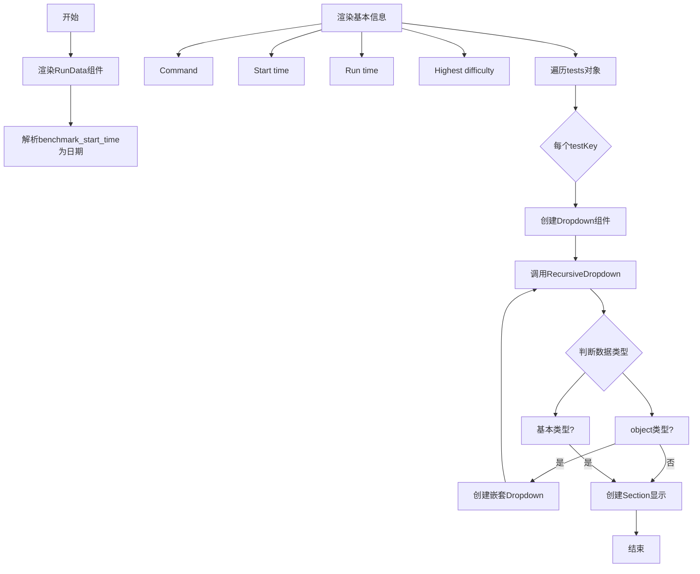
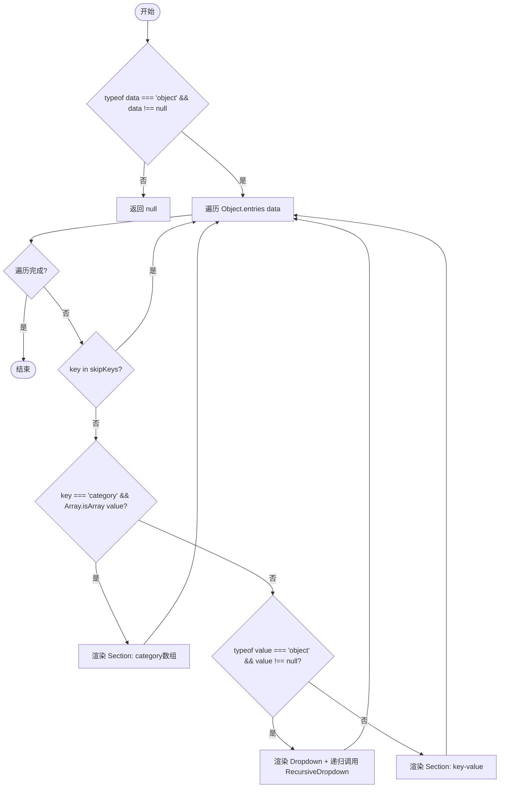
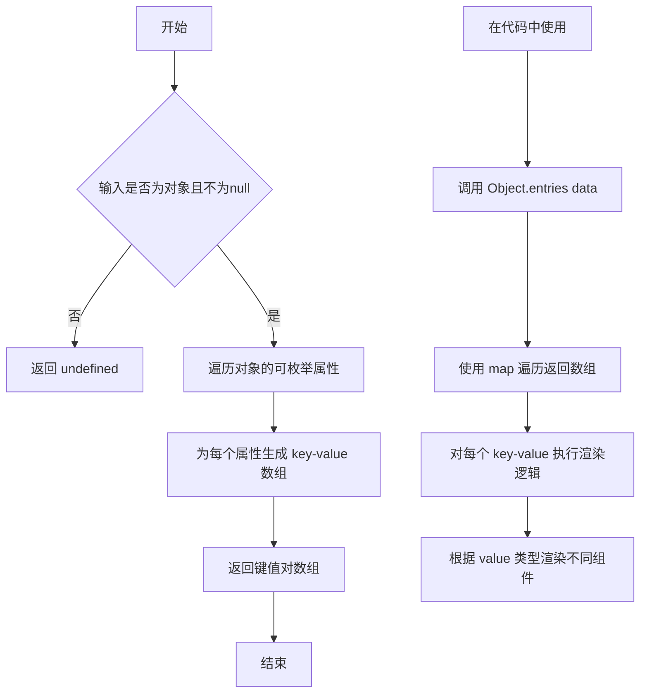
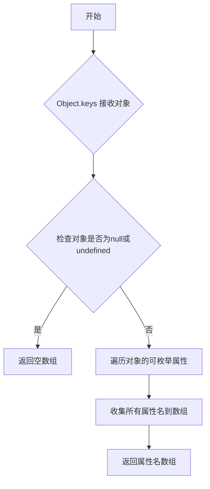
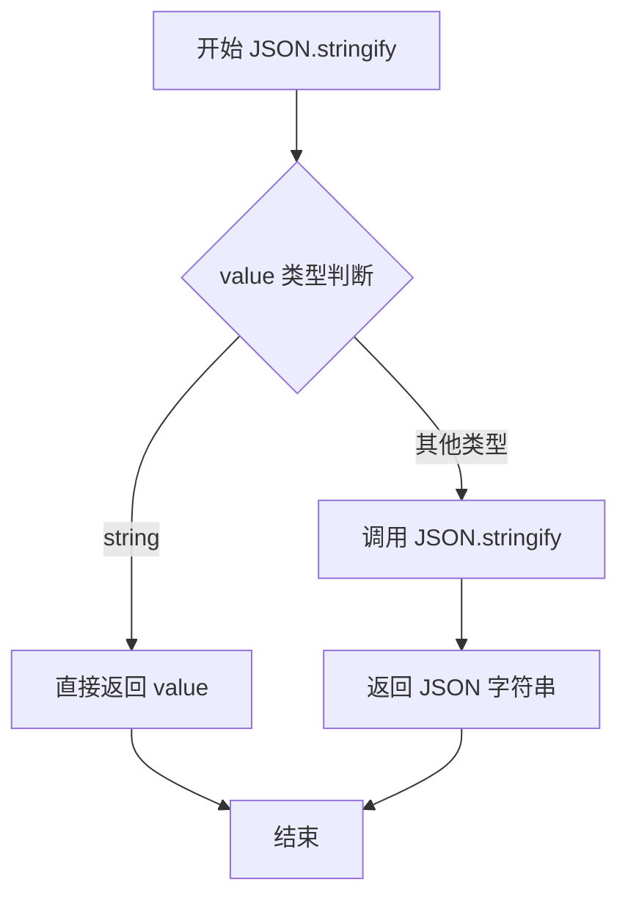

# `.\AutoGPT\classic\benchmark\frontend\src\components\index\RunData.tsx` 详细设计文档

这是一个React组件，用于展示测试运行数据（LatestRun），包含一个递归下拉组件用于展开嵌套的数据结构，并以可读的方式呈现命令、开始时间、运行时长、难度等级以及各个测试用例的详细信息。

## 整体流程



## 类结构

```
RunData (主组件)
├── RecursiveDropdown (递归下拉组件)
└── Styled Components (样式组件)
    ├── Card
    ├── Section
    ├── Label
    ├── Data
    ├── Dropdown
    ├── DropdownSummary
    └── DropdownContent
```

## 全局变量及字段


### `date`
    
A JavaScript Date object created from the benchmark_start_time string in latestRun

类型：`Date`
    


### `testKey`
    
Key representing the test name when iterating over the tests object in latestRun

类型：`string`
    


### `key`
    
Key from Object.entries(data), representing the property name of the current data item

类型：`string`
    


### `value`
    
Value from Object.entries(data), representing the property value of the current data item

类型：`any`
    


### `RecursiveDropdown.data`
    
The data object to be recursively rendered as a dropdown structure

类型：`any`
    


### `RecursiveDropdown.skipKeys`
    
Array of keys to skip during recursive rendering, preventing specified fields from being displayed

类型：`string[]`
    


### `RunData.latestRun`
    
The latest run data containing benchmark information including command, start time, metrics, and test results

类型：`LatestRun`
    
    

## 全局函数及方法


### `RecursiveDropdown`

该函数是一个React函数组件，用于递归渲染嵌套的JSON数据对象为可折叠的下拉菜单（Dropdown）结构，支持跳过指定的键，并对特定类型（如数组）进行特殊处理。

参数：

- `data`：`any`，要递归渲染的数据对象，可以是任何嵌套的JSON结构
- `skipKeys`：`string[]`，一个字符串数组，用于指定在渲染时需要跳过的键名

返回值：`JSX.Element | null`，返回React的JSX元素节点，如果输入数据不是对象或为null则返回null

#### 流程图



#### 带注释源码

```typescript
// 定义RecursiveDropdown组件，接收data和skipKeys两个props
const RecursiveDropdown: React.FC<{ data: any; skipKeys: string[] }> = ({
  data,
  skipKeys,
}) => {
  // 边界情况：如果data不是对象或是null，直接返回null不进行渲染
  if (typeof data !== "object" || data === null) {
    return null;
  }

  // 使用React Fragment包裹所有渲染的子元素
  return (
    <>
      {Object.entries(data).map(([key, value]) => {
        // 如果当前键在skipKeys数组中，则跳过该键的渲染
        if (skipKeys.includes(key)) {
          return null;
        }

        // 特殊处理：对于'category'键且值为数组的情况
        // 将数组元素用逗号连接成字符串显示
        if (key === "category" && Array.isArray(value)) {
          return (
            <Section key={key}>
              <Label>{key}:</Label>
              <Data>{value.join(", ")}</Data>
            </Section>
          );
        }

        // 如果value是对象（非null），则渲染为可折叠的Dropdown
        // 并递归调用RecursiveDropdown渲染嵌套内容
        if (typeof value === "object" && value !== null) {
          return (
            <Dropdown key={key}>
              <DropdownSummary>{key}</DropdownSummary>
              <DropdownContent>
                <RecursiveDropdown data={value} skipKeys={skipKeys} />
              </DropdownContent>
            </Dropdown>
          );
        } else {
          // 对于基本类型，渲染为普通的键值对Section
          // 如果value是字符串直接显示，否则JSON序列化
          return (
            <Section key={key}>
              <Label>{key}:</Label>
              <Data>
                {typeof value === "string" ? value : JSON.stringify(value)}
              </Data>
            </Section>
          );
        }
      })}
    </>
  );
};
```


### RunData

这是一个React函数组件，用于展示最新一次基准测试的运行数据，包括命令、开始时间、运行时间、最高难度以及各测试的详细信息。用户可以展开每个测试项查看其详细数据。

参数：

- `latestRun`：`LatestRun`，最新一次基准测试的运行数据对象，包含命令、时间、指标和测试结果等信息

返回值：`JSX.Element`，返回一个展示运行数据的React组件

#### 流程图

```mermaid
flowchart TD
    A[开始] --> B[接收 latestRun 参数]
    B --> C[解析日期: new Date(latestRun.benchmark_start_time)]
    C --> D[渲染 Card 容器]
    D --> E[渲染命令 Section: latestRun.command]
    E --> F[渲染开始时间 Section: date.toLocaleString()]
    F --> G[渲染运行时间 Section: latestRun.metrics.run_time]
    G --> H[渲染最高难度 Section: 解析 difficulty 字符串]
    H --> I[遍历 Object.keys(latestRun.tests)]
    I -->|每个 testKey| J[创建 Dropdown 组件]
    J --> K[在 DropdownContent 中调用 RecursiveDropdown]
    K --> L[传入测试数据和跳过键: skipKeys]
    L --> I
    I -->|遍历完成| M[返回完整 Card 组件]
```

#### 带注释源码

```tsx
/**
 * RunData 组件
 * 用于展示最新一次基准测试的运行数据
 * @param latestRun - 包含基准测试详细信息的对象
 */
const RunData: React.FC<{ latestRun: LatestRun }> = ({ latestRun }) => {
  // 1. 解析基准测试的开始时间，转换为Date对象
  const date = new Date(latestRun.benchmark_start_time);
  
  // 2. 返回主容器Card，包含所有运行数据展示
  return (
    <Card>
      {/* 3. 渲染命令信息Section */}
      <Section>
        <Label>Command:</Label>
        <Data>{latestRun.command}</Data>
      </Section>
      
      {/* 4. 渲染开始时间Section，使用toLocaleString转换为本地时间格式 */}
      <Section>
        <Label>Start time:</Label>
        <Data>{date.toLocaleString()}</Data>
      </Section>
      
      {/* 5. 渲染运行时间Section，展示metrics中的run_time */}
      <Section>
        <Label>Run time:</Label>
        <Data>{latestRun.metrics.run_time}</Data>
      </Section>
      
      {/* 6. 渲染最高难度Section，解析highest_difficulty字符串提取难度值 */}
      <Section>
        <Label>Highest difficulty:</Label>
        <Data>
          {latestRun.metrics.highest_difficulty.split(":")[1]?.slice(-1)}
        </Data>
      </Section>

      {/* 7. 遍历tests对象，为每个测试项创建可展开的Dropdown */}
      {Object.keys(latestRun.tests).map((testKey) => (
        <Dropdown key={testKey}>
          {/* 8. DropdownSummary显示测试项名称 */}
          <DropdownSummary>{testKey}</DropdownSummary>
          {/* 9. DropdownContent包含该测试项的详细数据 */}
          <DropdownContent>
            {/* 10. 确保测试数据存在后才渲染递归下拉组件 */}
            {latestRun.tests[testKey] && (
              <RecursiveDropdown
                // 传入测试数据对象
                data={latestRun.tests[testKey]}
                // 跳过渲染cost和data_path字段
                skipKeys={["cost", "data_path"]}
              />
            )}
          </DropdownContent>
        </Dropdown>
      ))}
    </Card>
  );
};
```


### `Object.entries`

描述：在代码中用于将传入的 `data` 对象（`LatestRun.tests` 中的测试对象）转换为可遍历的键值对数组，以便递归渲染对象的每个属性。

参数：

- `obj`：`any`，需要转换为键值对数组的对象，可以是任意对象

返回值：`Array<[string, any]>?`，返回对象自身的可枚举字符串键属性组成的键值对数组，每个元素是一个 `[key, value]` 的数组；如果传入的不是对象（如 `null`、原始类型），则返回 `undefined`

#### 流程图



#### 带注释源码

```
// 在 RecursiveDropdown 组件中使用 Object.entries
Object.entries(data).map(([key, value]) => {
  // key: 属性的键名（字符串）
  // value: 属性的值（任意类型）
  
  // 跳过指定的键
  if (skipKeys.includes(key)) {
    return null;
  }

  // 特殊处理 category 键，值为数组时用逗号连接
  if (key === "category" && Array.isArray(value)) {
    return (
      <Section key={key}>
        <Label>{key}:</Label>
        <Data>{value.join(", ")}</Data>
      </Section>
    );
  }

  // 如果值是对象（非null），递归渲染为下拉菜单
  if (typeof value === "object" && value !== null) {
    return (
      <Dropdown key={key}>
        <DropdownSummary>{key}</DropdownSummary>
        <DropdownContent>
          <RecursiveDropdown data={value} skipKeys={skipKeys} />
        </DropdownContent>
      </Dropdown>
    );
  } else {
    // 基础类型直接渲染，字符串直接显示，其他 JSON 序列化
    return (
      <Section key={key}>
        <Label>{key}:</Label>
        <Data>
          {typeof value === "string" ? value : JSON.stringify(value)}
        </Data>
      </Section>
    );
  }
})
```


### `Object.keys`

Object.keys 是 JavaScript 的全局函数，用于返回给定对象自身可枚举属性的名称（字符串）数组。

参数：

- `obj`：`any`，要返回其枚举属性和方法的对象

返回值：`string[]`，返回一个包含对象自身可枚举属性名称的字符串数组

#### 流程图



#### 带注释源码

```javascript
// 在 RunData 组件中使用 Object.keys
// 获取 latestRun.tests 对象的所有键（测试名称）
{Object.keys(latestRun.tests).map((testKey) => (
  <Dropdown key={testKey}>
    <DropdownSummary>{testKey}</DropdownSummary>
    <DropdownContent>
      {latestRun.tests[testKey] && (
        <RecursiveDropdown
          data={latestRun.tests[testKey]}
          skipKeys={["cost", "data_path"]}
        />
      )}
    </DropdownContent>
  </Dropdown>
))}

// 完整源码上下文：
// Object.keys(latestRun.tests)
//   .map((testKey) => { ... })
//   .map(...)
//   .filter(...) 
//   .forEach(...)
```


### `JSON.stringify`

将 JavaScript 值转换为 JSON 字符串，用于在 UI 中显示非字符串类型的值。

参数：

- `value`：`any`，需要被转换为 JSON 字符串的值，可以是任何 JavaScript 数据类型

返回值：`string`，对象的 JSON 字符串表示形式

#### 流程图



#### 带注释源码

```javascript
// 在 RecursiveDropdown 组件中使用 JSON.stringify
// 如果 value 是字符串类型，直接显示；否则将其转换为 JSON 字符串显示
{typeof value === "string" ? value : JSON.stringify(value)}

// 完整上下文：
// 这段代码位于 RecursiveDropdown 组件的渲染逻辑中
// 用于将非字符串类型的值（如数字、布尔值、对象等）转换为可显示的字符串形式
// 当 value 是字符串时，直接使用该字符串；否则调用 JSON.stringify 转换为字符串
```


### `RecursiveDropdown`

这是一个递归渲染的 React 函数组件，用于以可折叠下拉菜单的形式展示嵌套的对象数据结构，支持跳过特定键，并对 'category' 键进行特殊处理。

参数：

- `data`：`any`，要渲染的嵌套数据对象
- `skipKeys`：`string[]`，在渲染时需要跳过的键名数组

返回值：`React.ReactNode`，返回 JSX 元素（包含下拉菜单和文本节点）

#### 流程图

```mermaid
flowchart TD
    A[开始 RecursiveDropdown] --> B{typeof data !== 'object' \|\| data === null}
    B -->|是| C[返回 null]
    B -->|否| D[遍历 Object.entries data]
    D --> E{当前 key 在 skipKeys 中?}
    E -->|是| F[返回 null, 继续下一项]
    E -->|否| G{key === 'category' 且 value 是数组?}
    G -->|是| H[渲染 category 特殊样式: 以逗号分隔显示]
    G -->|否| I{typeof value === 'object' 且 value !== null?}
    I -->|是| J[渲染 Dropdown 包含 RecursiveDropdown 递归]
    I -->|否| K[渲染 Section 显示 key: value]
    H --> L[结束当前项]
    F --> L
    J --> L
    K --> L
    L --> M{还有更多项?}
    M -->|是| D
    M -->|否| N[返回所有渲染的 JSX 元素]
```

#### 带注释源码

```tsx
/**
 * 递归下拉组件 - 用于渲染嵌套的数据结构
 * @param data - 要渲染的嵌套数据对象
 * @param skipKeys - 需要跳过的键名数组
 * @returns React.ReactNode - JSX 元素
 */
const RecursiveDropdown: React.FC<{ data: any; skipKeys: string[] }> = ({
  data,
  skipKeys,
}) => {
  // 基础类型或 null 直接返回 null，不进行渲染
  if (typeof data !== "object" || data === null) {
    return null;
  }

  // 遍历对象的每个键值对
  return (
    <>
      {Object.entries(data).map(([key, value]) => {
        // 如果键在跳过列表中，则不渲染该项
        if (skipKeys.includes(key)) {
          return null;
        }

        // 特殊处理 category 键：如果是数组则以逗号分隔展示
        if (key === "category" && Array.isArray(value)) {
          return (
            <Section key={key}>
              <Label>{key}:</Label>
              <Data>{value.join(", ")}</Data>
            </Section>
          );
        }

        // 如果值是对象（非null），递归渲染为下拉菜单
        if (typeof value === "object" && value !== null) {
          return (
            <Dropdown key={key}>
              <DropdownSummary>{key}</DropdownSummary>
              <DropdownContent>
                {/* 递归调用自身渲染嵌套对象 */}
                <RecursiveDropdown data={value} skipKeys={skipKeys} />
              </DropdownContent>
            </Dropdown>
          );
        } else {
          // 基础类型值，直接渲染为键值对
          // 如果是字符串直接显示，否则 JSON 序列化
          return (
            <Section key={key}>
              <Label>{key}:</Label>
              <Data>
                {typeof value === "string" ? value : JSON.stringify(value)}
              </Data>
            </Section>
          );
        }
      })}
    </>
  );
};
```


### RunData

这是一个 React 函数组件，用于展示基准测试运行数据（LatestRun），包括命令、开始时间、运行时长、最高难度以及各个测试的详细信息，通过递归下拉组件展示嵌套的测试数据。

参数：

- `latestRun`：`LatestRun`，包含基准测试的完整运行信息，包括命令、开始时间、指标和测试结果

返回值：`JSX.Element`，返回渲染基准测试运行数据的 React 元素

#### 流程图

```mermaid
flowchart TD
    A[开始渲染 RunData] --> B[解析 latestRun.benchmark_start_time 为 Date 对象]
    B --> C[渲染基本信息卡片]
    C --> D[渲染 Command 标签和数据]
    D --> E[渲染 Start time 标签和数据]
    E --> F[渲染 Run time 标签和数据]
    F --> G[渲染 Highest difficulty 标签和数据]
    G --> H[遍历 latestRun.tests 对象]
    H --> I{对于每个 testKey}
    I -->|是| J[创建 Dropdown 组件]
    J --> K[在 DropdownContent 中渲染 RecursiveDropdown]
    K --> L[传入 test 数据和跳过键 ['cost', 'data_path']]
    L --> M[递归渲染嵌套数据]
    I -->|否| N[结束渲染]
    
    subgraph RecursiveDropdown 内部逻辑
        O[检查 data 是否为对象且非空] --> P{是对象?}
        P -->|否| Q[返回 null]
        P -->|是| R[遍历对象键值对]
        R --> S{跳过键?}
        S -->|是| T[返回 null]
        S -->|否| U{key === 'category'?}
        U -->|是| V[渲染为逗号分隔的列表]
        U -->|否| W{value 是对象?}
        W -->|是| X[递归创建 Dropdown]
        W -->|否| Y[渲染为键值对 Section]
        X --> Z[递归调用 RecursiveDropdown]
    end
```

#### 带注释源码

```tsx
import React, { useState } from "react";
import { LatestRun } from "../../lib/types";
import tw from "tailwind-styled-components";

/**
 * 递归下拉组件，用于渲染嵌套的测试数据
 * @param data - 要渲染的数据对象
 * @param skipKeys - 需要跳过的键名数组
 */
const RecursiveDropdown: React.FC<{ data: any; skipKeys: string[] }> = ({
  data,
  skipKeys,
}) => {
  // 基本类型或 null 直接返回 null，不渲染
  if (typeof data !== "object" || data === null) {
    return null;
  }

  return (
    <>
      {Object.entries(data).map(([key, value]) => {
        // 跳过指定的键，如 cost 和 data_path
        if (skipKeys.includes(key)) {
          return null;
        }

        // 特殊处理 category 键，渲染为逗号分隔的列表
        if (key === "category" && Array.isArray(value)) {
          return (
            <Section key={key}>
              <Label>{key}:</Label>
              <Data>{value.join(", ")}</Data>
            </Section>
          );
        }

        // 如果值是对象，递归渲染为下拉菜单
        if (typeof value === "object" && value !== null) {
          return (
            <Dropdown key={key}>
              <DropdownSummary>{key}</DropdownSummary>
              <DropdownContent>
                <RecursiveDropdown data={value} skipKeys={skipKeys} />
              </DropdownContent>
            </Dropdown>
          );
        } else {
          // 基本类型值渲染为键值对
          return (
            <Section key={key}>
              <Label>{key}:</Label>
              <Data>
                {/* 字符串直接显示，其他类型 JSON 序列化 */}
                {typeof value === "string" ? value : JSON.stringify(value)}
              </Data>
            </Section>
          );
        }
      })}
    </>
  );
};

/**
 * RunData 组件 - 展示基准测试运行数据的主要组件
 * @param latestRun - 包含完整运行信息的 LatestRun 对象
 * @returns 渲染运行数据卡片的 JSX 元素
 */
const RunData: React.FC<{ latestRun: LatestRun }> = ({ latestRun }) => {
  // 将基准测试开始时间转换为 Date 对象
  const date = new Date(latestRun.benchmark_start_time);
  
  return (
    <Card>
      {/* 渲染命令信息 */}
      <Section>
        <Label>Command:</Label>
        <Data>{latestRun.command}</Data>
      </Section>
      
      {/* 渲染开始时间，格式化为本地字符串 */}
      <Section>
        <Label>Start time:</Label>
        <Data>{date.toLocaleString()}</Data>
      </Section>
      
      {/* 渲染运行时长 */}
      <Section>
        <Label>Run time:</Label>
        <Data>{latestRun.metrics.run_time}</Data>
      </Section>
      
      {/* 渲染最高难度，提取冒号后的最后一个字符 */}
      <Section>
        <Label>Highest difficulty:</Label>
        <Data>
          {latestRun.metrics.highest_difficulty.split(":")[1]?.slice(-1)}
        </Data>
      </Section>

      {/* 遍历所有测试项，渲染为可展开的下拉菜单 */}
      {Object.keys(latestRun.tests).map((testKey) => (
        <Dropdown key={testKey}>
          <DropdownSummary>{testKey}</DropdownSummary>
          <DropdownContent>
            {/* 确保测试数据存在后再渲染递归下拉组件 */}
            {latestRun.tests[testKey] && (
              <RecursiveDropdown
                data={latestRun.tests[testKey]}
                skipKeys={["cost", "data_path"]}
              />
            )}
          </DropdownContent>
        </Dropdown>
      ))}
    </Card>
  );
};

// 导出默认组件
export default RunData;

// ============ 样式化组件定义 ============

// 卡片容器样式
const Card = tw.div`
  bg-white
  p-4
  rounded
  shadow-lg
  w-full
  mt-4
`;

// 区块样式
const Section = tw.div`
  mt-2
`;

// 标签样式
const Label = tw.span`
  font-medium
`;

// 数据样式
const Data = tw.span`
  ml-1
`;

// 下拉菜单样式
const Dropdown = tw.details`
  mt-4
`;

// 下拉菜单标题样式
const DropdownSummary = tw.summary`
  cursor-pointer
  text-blue-500
`;

// 下拉菜单内容样式
const DropdownContent = tw.div`
  pl-4
  mt-2
`;
```

---

## 附加信息

### 关键组件信息

| 组件名称 | 描述 |
|---------|------|
| RunData | 主组件，展示基准测试运行数据卡片 |
| RecursiveDropdown | 递归组件，渲染嵌套的测试数据为可展开的下拉菜单 |
| Card | 卡片容器样式 |
| Section | 区块样式 |
| Label | 标签样式 |
| Data | 数据文本样式 |
| Dropdown | HTML details 元素样式 |
| DropdownSummary | 下拉菜单标题样式 |
| DropdownContent | 下拉菜单内容容器样式 |

### 潜在的技术债务或优化空间

1. **类型安全**：使用 `any` 类型 (`data: any`) 会降低类型安全性，建议定义明确的接口
2. **硬编码跳过键**：将 `["cost", "data_path"]` 硬编码在组件内部，应通过 props 传入或配置化
3. **日期格式处理**：对 `highest_difficulty` 的字符串解析 (`split(":")[1]?.slice(-1)`) 脆弱，易产生 undefined
4. **性能优化**：大对象递归渲染未使用 `React.memo` 优化，可能导致不必要的重渲染
5. **可访问性**：下拉菜单缺少键盘导航支持和 ARIA 属性
6. **错误边界**：组件缺乏错误边界处理，若数据格式异常可能导致白屏

### 其它项目

#### 设计目标与约束
- 使用 Tailwind CSS 进行样式管理
- 支持嵌套对象数据的递归渲染
- 遵循 React 函数组件范式

#### 错误处理与异常设计
- 对非对象数据返回 `null`
- 对 `null` 和基本类型值进行防护检查
- 使用可选链 (`?.`) 防止 undefined 错误

#### 数据流与状态机
- 数据流：父组件传入 `latestRun` 对象 → RunData 解析并展示基本信息 → 遍历 tests 对象 → RecursiveDropdown 递归渲染嵌套数据
- 无内部状态管理，完全受控于 props

#### 外部依赖与接口契约
- 依赖 `LatestRun` 类型定义（来自 `../../lib/types`）
- 依赖 `tailwind-styled-components` 进行样式化
- 依赖 React Hooks (`useState` 导入但未使用)

## 关键组件


### RecursiveDropdown

递归下拉菜单组件，用于遍历嵌套对象数据并以可折叠的方式展示。处理特殊键（如category数组）和递归渲染子对象。

### RunData

主组件，接收LatestRun类型的props，渲染运行数据卡片。显示命令、开始时间、运行时长、最高难度等信息，并遍历tests对象为每个测试创建可展开的下拉菜单。

### Card

卡片容器组件，使用tailwind-styled-components定义，包含白色背景、内边距、圆角、阴影和宽度样式。

### Section

节区容器组件，使用tailwind-styled-components定义，设置上边距样式。

### Label

标签文本组件，使用tailwind-styled-components定义，设置中等字体粗细。

### Data

数据文本组件，使用tailwind-styled-components定义，设置左侧外边距。

### Dropdown

下拉菜单容器，使用HTML details元素实现可折叠功能，设置上边距样式。

### DropdownSummary

下拉菜单标题，使用HTML summary元素实现点击展开/收起功能，设置光标指针和蓝色文本样式。

### DropdownContent

下拉菜单内容容器，使用tailwind-styled-components定义，设置左侧内边距和上边距样式。


## 问题及建议


### 已知问题

- **类型安全问题**：`RecursiveDropdown` 组件的 `data` 参数使用 `any` 类型，缺乏类型安全，应使用泛型或具体接口定义
- **硬编码键名**：`"category"`、`"cost"`、`"data_path"` 等键名在代码中多处硬编码，缺乏统一常量管理
- **脆弱的字符串操作**：`split(":")[1]?.slice(-1)` 的字符串解析逻辑极其脆弱，格式变化会导致运行时错误
- **缺少 Props 验证**：未对 `latestRun` 对象的必需字段进行空值检查和类型校验，可能导致 undefined 访问错误
- **无效日期处理**：`new Date(latestRun.benchmark_start_time)` 未验证输入有效性，Invalid Date 会导致显示异常
- **性能隐患**：递归组件未使用 `React.memo` 优化，在大数据量场景下可能产生不必要的重新渲染
- **可访问性缺陷**：`details`/`summary` 下拉组件缺少 ARIA 属性支持，屏幕阅读器体验不佳
- **魔法值问题**：`slice(-1)` 提取最高难度值的方式缺乏明确业务逻辑说明，后续维护困难
- **重复结构代码**：`Section` 组件结构在 `RunData` 中重复出现，可提取为独立复用组件

### 优化建议

- 引入 TypeScript 接口定义 `LatestRun` 及相关嵌套类型，用泛型替代 `any` 类型
- 提取键名常量和配置对象到独立文件，统一管理和文档化
- 使用正则表达式或专用解析函数封装 `highest_difficulty` 的解析逻辑，提升健壮性
- 为 `RunData` 组件添加 defaultProps 或使用可选链运算符进行防御性编程
- 对日期字符串添加格式验证和 Invalid Date 的回退处理逻辑
- 使用 `React.memo` 包装 `RecursiveDropdown` 组件，并考虑添加 `key` 优化
- 为下拉组件添加 `aria-expanded`、`role="group"` 等 ARIA 属性提升可访问性
- 将 `Section` 抽取为独立 UI 组件，接受 `label` 和 `children` props
- 考虑使用 `useMemo` 缓存 `Object.keys(latestRun.tests)` 的结果
- 添加 PropTypes 或 TypeScript 类型声明进行编译期验证


## 其它


### 设计目标与约束

**设计目标**：
该组件用于以层级式下拉菜单展示基准测试运行数据（LatestRun类型），支持递归展开嵌套的测试结果数据，使测试结果更具可读性和交互性。

**技术约束**：
- 基于React函数组件和TypeScript开发
- 使用tailwind-styled-components进行样式管理
- 数据源类型依赖外部定义的LatestRun接口

### 错误处理与异常设计

- **类型检查**：RecursiveDropdown组件首行对data进行typeof和null检查，防止渲染非对象类型数据
- **数据渲染安全**：对于非字符串类型值，使用JSON.stringify转换为字符串，避免直接渲染导致的XSS风险
- **数组处理**：category字段特殊处理，使用Array.isArray判断并通过join方法拼接
- **缺失数据处理**：测试项渲染前检查latestRun.tests[testKey]是否存在，避免undefined错误

### 数据流与状态机

- **数据流向**：父组件 → RunData组件（props: latestRun） → 递归渲染子数据
- **渲染逻辑**：Map遍历latestRun.tests对象，为每个测试项创建可展开的Dropdown
- **递归终止条件**：当data为非对象类型（typeof !== 'object' || data === null）时返回null，终止递归
- **跳过机制**：通过skipKeys参数过滤不需要展示的字段（如cost、data_path）

### 外部依赖与接口契约

- **LatestRun类型**：来自"../../lib/types"，定义基准测试数据结构，包含command、benchmark_start_time、metrics、tests等字段
- **React**：16.8+版本，需支持Hooks
- **tailwind-styled-components**：样式绑定库
- **Tailwind CSS**：需在项目中配置并启用

### 性能考虑与优化空间

- **潜在问题**：每次渲染都执行Object.entries(data).map，可能对大数据集造成性能瓶颈
- **优化建议**：对大数据集考虑使用React.memo或虚拟滚动
- **日期处理**：每次渲染都创建new Date对象，可考虑useMemo缓存
- **字符串拼接**：highest_difficulty的split和slice操作可提取为格式化函数复用

### 安全考虑

- **XSS防护**：使用JSON.stringify处理未知类型数据，避免直接eval或innerHTML
- **数据过滤**：skipKeys机制可防止敏感字段（如data_path可能包含路径信息）直接暴露在UI

### 可访问性设计

- **Dropdown实现**：使用HTML5原生<details>和<summary>元素，具备默认键盘导航支持
- **语义化标签**：使用Label标记标签，Data标记数据内容
- **缺失项**：建议为DropdownSummary添加aria-expanded属性，为关键信息提供screen reader支持

### 国际化/本地化

- **当前状态**：组件内硬编码英文标签（Command、Start time、Run time等）
- **改进建议**：提取标签文本至i18n配置文件，支持多语言切换

### 测试策略

- **测试重点**：
  - 不同数据结构（空对象、嵌套对象、数组）的渲染行为
  - skipKeys过滤功能是否正常工作
  - category字段数组的特殊渲染逻辑
  - null/undefined边界条件处理
- **建议工具**：Jest + React Testing Library

### 版本兼容性

- **React版本**：依赖React 16.8+的FC类型定义和Hooks
- **TypeScript**：依赖typescript和React类型定义
- **浏览器兼容**：使用标准HTML5元素（details/summary），需现代浏览器支持

### 代码风格与规范

- **组件结构**：单一文件包含多个组件定义（RecursiveDropdown、RunData及样式组件）
- **命名规范**：遵循React组件大写开头、样式组件全大写命名约定
- **类型标注**：使用TypeScript明确标注props类型

### 部署相关配置

- **Tailwind配置**：需在项目中配置tailwind-styled-components插件
- **构建要求**：TypeScript编译支持，CSS处理链路完整

### 监控与日志

- **当前状态**：组件内无日志记录和监控埋点
- **建议**：如需线上监控，可添加渲染性能监测和用户交互埋点


    