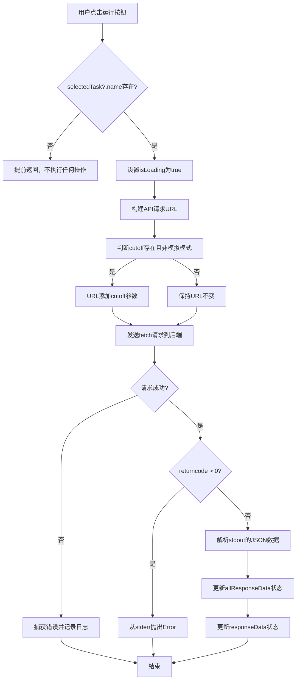

# `.\AutoGPT\classic\benchmark\frontend\src\components\index\SelectedTask.tsx` 详细设计文档

一个React函数组件，用于展示选中的任务详情（包括名称、描述、难度、分类等信息），并提供运行测试的功能，支持模拟模式切换，通过调用后端API执行测试并更新响应数据。

## 整体流程



## 类结构

```
SelectedTask (React函数组件)
├── SelectedTaskProps (接口定义)
├── 样式组件
│   ├── TaskName (h1标题样式)
│   ├── TaskPrompt (段落样式)
│   ├── Detail (详情信息样式)
│   ├── MockCheckboxInput (复选框输入样式)
│   └── CheckboxWrapper (复选框包装器样式)
└── 状态与逻辑
    └── runTest (异步测试执行函数)
```

## 全局变量及字段


### `isLoading`
    
组件是否正在加载测试结果的标志状态

类型：`boolean`
    


### `selectedTask`
    
当前选中的任务数据对象

类型：`TaskData | null`
    


### `isMock`
    
是否使用模拟数据运行测试的标志

类型：`boolean`
    


### `setIsMock`
    
设置是否使用模拟数据的函数

类型：`React.Dispatch<React.SetStateAction<boolean>>`
    


### `cutoff`
    
测试运行的截止时间参数

类型：`number | null`
    


### `setResponseData`
    
设置当前响应数据的函数

类型：`React.Dispatch<React.SetStateAction<any>>`
    


### `allResponseData`
    
所有测试运行的响应数据数组

类型：`any[]`
    


### `setAllResponseData`
    
更新所有响应数据数组的函数

类型：`React.Dispatch<React.SetStateAction<any[]>>`
    


### `testParam`
    
从选中任务名称生成的测试参数

类型：`string`
    


### `url`
    
API请求的完整URL地址

类型：`string`
    


### `response`
    
fetch API返回的响应对象

类型：`Response`
    


### `data`
    
从响应体解析的JSON数据

类型：`any`
    


### `jsonObject`
    
从标准输出解析的JSON对象

类型：`any`
    


### `error`
    
捕获的异常或错误对象

类型：`any`
    


### `SelectedTask.selectedTask`
    
传入的当前选中任务数据props

类型：`TaskData | null`
    


### `SelectedTask.isMock`
    
传入的是否使用模拟数据的props标志

类型：`boolean`
    


### `SelectedTask.setIsMock`
    
传入的设置模拟数据状态的props函数

类型：`React.Dispatch<React.SetStateAction<boolean>>`
    


### `SelectedTask.cutoff`
    
传入的测试截止时间props参数

类型：`number | null`
    


### `SelectedTask.setResponseData`
    
传入的设置响应数据的props函数

类型：`React.Dispatch<React.SetStateAction<any>>`
    


### `SelectedTask.allResponseData`
    
传入的所有响应数据数组props

类型：`any[]`
    


### `SelectedTask.setAllResponseData`
    
传入的更新所有响应数据的props函数

类型：`React.Dispatch<React.SetStateAction<any[]>>`
    
    

## 全局函数及方法


### `SelectedTask.runTest`

该函数是一个异步方法，用于在用户点击运行按钮时，向后端 API 发送请求以执行指定的单个测试，并根据测试结果更新组件的状态和数据。

参数：无显式参数（使用闭包中的 `selectedTask`, `isMock`, `cutoff`, `setResponseData`, `setAllResponseData`, `allResponseData`）

返回值：`Promise<void>`，异步操作完成后 resolved，无返回值

#### 流程图

```mermaid
flowchart TD
    A([开始]) --> B{selectedTask?.name 是否存在?}
    B -- 否 --> C[return 退出]
    B -- 是 --> D[获取 testParam = selectedTask.name]
    D --> E[设置 isLoading = true]
    E --> F[构建 URL: http://localhost:8000/run_single_test?test=${testParam}&mock=${isMock}]
    F --> G{cutoff 存在且 !isMock?}
    G -- 是 --> H[URL += &cutoff=${cutoff}]
    G -- 否 --> I[发起 fetch 请求]
    H --> I
    I --> J[等待响应并解析 JSON]
    J --> K{returncode > 0?}
    K -- 是 --> L[throw new Error(data.stderr)]
    K -- 否 --> M[jsonObject = JSON.parse(data.stdout)]
    M --> N[setAllResponseData([...allResponseData, jsonObject])]
    N --> O[setResponseData(jsonObject)]
    O --> P[设置 isLoading = false]
    P --> Q([结束])
    
    L --> R[catch 捕获错误]
    R --> S[console.error 打印错误]
    S --> P
    
    style C fill:#ffcccc
    style Q fill:#ccffcc
```

#### 带注释源码

```typescript
const runTest = async () => {
  // 如果没有选中的任务名称，则直接退出，不执行任何操作
  if (!selectedTask?.name) return;

  // 从选中任务中获取测试参数
  const testParam = selectedTask.name;
  
  // 设置加载状态为 true，触发 UI 显示加载动画
  setIsLoading(true);
  
  try {
    // 构建 API 请求 URL，包含测试名称和 mock 标志
    let url = `http://localhost:8000/run_single_test?test=${testParam}&mock=${isMock}`;
    
    // 如果存在 cutoff 值且不是 mock 模式，则将 cutoff 参数添加到 URL
    cutoff && !isMock && (url += `&cutoff=${cutoff}`);
    
    // 发起 fetch 请求到后端 API
    const response = await fetch(url);
    
    // 解析响应为 JSON 格式
    const data = await response.json();

    // 检查返回码，如果大于 0 表示测试执行失败
    if (data["returncode"] > 0) {
      // 抛出错误，使用后端返回的错误信息
      throw new Error(data["stderr"]);
    } else {
      // 测试成功，解析标准输出中的 JSON 对象
      const jsonObject = JSON.parse(data["stdout"]);
      
      // 将新的结果添加到所有响应数据列表中
      setAllResponseData([...allResponseData, jsonObject]);
      
      // 更新当前响应数据状态
      setResponseData(jsonObject);
    }
  } catch (error) {
    // 捕获并记录任何发生的错误
    console.error("There was an error fetching the data", error);
  }
  
  // 无论成功或失败，最后都将加载状态设置为 false
  setIsLoading(false);
};
```


### `SelectedTask.runTest`

该方法是一个异步函数，用于执行单个测试任务。它通过构建包含测试名称、模拟标志和截止日期的URL，调用后端API获取测试结果，并根据返回状态更新React组件的状态（加载状态、响应数据）。

参数：

- 该函数没有显式参数，它通过闭包访问以下外部变量：
  - `selectedTask`：`TaskData | null`，当前选中的任务数据
  - `isMock`：`boolean`，是否使用模拟数据
  - `cutoff`：`number | null`，测试截止日期
  - `setIsLoading`：用于设置加载状态
  - `setResponseData`：用于设置响应数据
  - `setAllResponseData`：用于设置所有响应数据列表
  - `allResponseData`：所有响应数据的数组

返回值：`Promise<void>`，该方法不返回任何值，通过副作用（状态更新）处理测试结果

#### 流程图

```mermaid
flowchart TD
    A([开始 runTest]) --> B{selectedTask?.name 存在?}
    B -->|否| C[直接返回]
    B -->|是| D[设置 isLoading = true]
    D --> E[构建 URL: http://localhost:8000/run_single_test?test=${testParam}&mock=${isMock}]
    E --> F{cutoff 存在且非模拟?}
    F -->|是| G[URL += &cutoff=${cutoff}]
    F -->|否| H[发送 fetch 请求]
    G --> H
    H --> I{response.ok?}
    I -->|否| J[抛出错误]
    I -->|是| K[解析 response.json]
    K --> L{returncode > 0?}
    L -->|是| J
    L -->|否| M[解析 stdout 为 JSON 对象]
    M --> N[更新 allResponseData 状态]
    N --> O[更新 responseData 状态]
    J --> P[捕获错误并打印到控制台]
    O --> Q[设置 isLoading = false]
    P --> Q
    Q --> Z([结束])
```

#### 带注释源码

```typescript
/**
 * 执行单个测试任务的异步函数
 * 通过调用后端 API 获取测试结果，并更新组件状态
 */
const runTest = async () => {
  // 如果没有选中的任务或任务名称为空，则直接返回，不执行任何操作
  if (!selectedTask?.name) return;

  // 获取测试参数（任务名称）
  const testParam = selectedTask.name;
  
  // 设置加载状态为 true，显示加载指示器
  setIsLoading(true);
  
  try {
    // 构建请求 URL，包含测试名称和模拟标志参数
    let url = `http://localhost:8000/run_single_test?test=${testParam}&mock=${isMock}`;
    
    // 如果存在 cutoff 参数且不是模拟模式，则将 cutoff 参数添加到 URL
    cutoff && !isMock && (url += `&cutoff=${cutoff}`);
    
    // 发送 fetch 请求到后端
    const response = await fetch(url);
    
    // 解析响应为 JSON 格式
    const data = await response.json();

    // 检查返回码，如果大于 0 表示测试执行失败
    if (data["returncode"] > 0) {
      // 抛出错误，包含标准错误输出信息
      throw new Error(data["stderr"]);
    } else {
      // 测试成功，解析标准输出为 JSON 对象
      const jsonObject = JSON.parse(data["stdout"]);
      
      // 将新的响应数据添加到所有响应数据列表中
      setAllResponseData([...allResponseData, jsonObject]);
      
      // 更新当前响应数据状态
      setResponseData(jsonObject);
    }
  } catch (error) {
    // 捕获并处理任何错误，打印到控制台
    console.error("There was an error fetching the data", error);
  }
  
  // 无论成功或失败，最后都将加载状态设置为 false
  setIsLoading(false);
};
```

## 关键组件


### SelectedTask 组件

核心功能：展示选中的任务详情（名称、提示、截止日期、难度、类别），并提供运行测试的交互能力，支持mock模式和自定义cutoff参数，通过异步fetch调用后端API获取测试结果并更新状态。

### 任务数据展示组件

负责渲染任务的各项详细信息，包括TaskName显示任务名称、TaskPrompt显示任务提示、Detail组件显示截止日期、描述、难度和类别等元数据，采用tailwind-styled-components进行样式定义。

### runTest 函数

异步测试执行函数，负责构建API请求URL（包含test参数、mock模式和可选cutoff参数），调用后端 /run_single_test 接口，根据返回结果判断是否成功，成功则解析stdout JSON并更新响应数据状态，失败则抛出错误并记录日志。

### RunButton 组件

外部引入的按钮组件，接收cutoff、isLoading、testRun和isMock四个props，用于触发测试运行操作，并显示加载状态。

### MockCheckbox 组件

外部引入的复选框组件，接收isMock和setIsMock两个props，用于切换mock模式的状态控制。

### 状态管理

使用React的useState hook管理isLoading加载状态，用于控制测试运行期间的UI反馈。

### API接口契约

与后端服务通信的接口规范：GET请求到 http://localhost:8000/run_single_test，必需参数test（测试名称）和mock（是否mock），可选参数cutoff（截止日期），返回JSON包含returncode（0表示成功）、stdout（成功时的JSON结果）和stderr（失败时的错误信息）。


## 问题及建议


### 已知问题

- **类型安全问题**：使用 `any` 类型（`setResponseData: React.Dispatch<React.SetStateAction<any>>` 和 `allResponseData: any[]`），缺乏类型安全性和可维护性
- **内存泄漏风险**：`setIsLoading(false)` 在 try-catch 块中执行，如果组件在异步请求完成前卸载，会导致内存泄漏
- **硬编码的 API 地址**：`http://localhost:8000` 硬编码在代码中，不利于环境配置和迁移
- **未使用的样式定义**：`MockCheckboxInput` 和 `CheckboxWrapper` 被定义但从未使用，属于冗余代码
- **JSON.parse 缺乏错误处理**：直接对 `data["stdout"]` 进行解析，没有异常捕获机制
- **状态竞态风险**：缺少请求取消机制，用户快速连续点击可能导致多个并发请求，状态更新顺序不可控
- **useEffect 依赖缺失**：`runTest` 函数中使用了 `allResponseData` 但未作为依赖项，可能导致闭包陷阱，使用陈旧值

### 优化建议

- 提取 API 基础 URL 到环境变量或配置文件
- 使用 AbortController 取消正在进行的请求，并在组件卸载时清理
- 为 `TaskData` 和响应数据定义具体类型，替换 `any` 类型
- 使用 `useCallback` 包装 `runTest` 函数，正确管理依赖数组
- 对 JSON.parse 添加 try-catch 错误处理
- 删除未使用的 `MockCheckboxInput` 和 `CheckboxWrapper` 样式定义
- 考虑添加用户友好的错误提示 UI，而非仅在控制台打印错误

## 其它


### 设计目标与约束

本组件的设计目标是提供一个交互式的任务测试界面，允许用户查看任务详情、配置测试参数（mock模式和cutoff）并执行测试。约束条件包括：需要后端API服务运行在localhost:8000，仅支持HTTP协议通信，组件依赖于Tailwind CSS进行样式渲染，且假设selectedTask对象包含name、task、cutoff、info和category等必填字段。

### 错误处理与异常设计

组件在runTest函数中实现了try-catch错误捕获逻辑。当API请求失败、返回码大于0或JSON解析出错时，错误会被捕获并通过console.error输出。存在的问题是错误信息仅输出到控制台，未向用户展示友好的错误提示UI，且没有区分网络错误、服务器错误和业务逻辑错误。此外，selectedTask为null时组件仍会渲染空内容，应增加空状态处理。

### 数据流与状态机

组件内部维护三个状态：isLoading（boolean）控制加载状态，isMock（来自父组件）控制是否使用mock数据，selectedTask（来自父组件）提供任务数据。数据流向：用户点击RunButton触发runTest → 构造API请求URL → 发起fetch请求 → 解析响应数据 → 调用setAllResponseData和setResponseData更新父组件状态。allResponseData数组不断累积历次测试结果，setResponseData则显示最新结果。

### 外部依赖与接口契约

组件依赖以下外部依赖：React（useState、FC类型）、tailwind-styled-components（样式组件）、TaskData类型定义（来自lib/types）、RunButton组件、MockCheckbox组件。API接口契约：GET http://localhost:8000/run_single_test?test={testParam}&mock={isMock}&cutoff={cutoff}，响应格式应为JSON对象，包含returncode（数字，0表示成功）、stdout（字符串，JSON格式）和stderr（字符串，错误信息）。

### 性能考虑

组件在每次runTest调用时都会创建新的URL字符串并发起新的fetch请求。allResponseData使用扩展运算符创建新数组，可能导致不必要的数组复制。建议使用useCallback缓存runTest函数，避免依赖变化时的不必要重渲染。此外，selectedTask?.category.join(", ")在每次渲染时都会执行，可考虑使用useMemo优化。

### 安全性考虑

组件存在以下安全隐患：hardcoded的API地址localhost:8000不应在生产环境使用，应从环境变量配置；未对用户输入（selectedTask.name）进行XSS防护，虽然React默认转义但仍需注意；未实现请求超时机制，长时间等待可能导致用户体验问题；敏感信息未进行加密传输处理。

### 可访问性设计

组件在可访问性方面存在不足：TaskName使用h1标签但缺少id关联；Detail标签未关联对应的内容；RunButton和MockCheckbox虽然有对应的组件但需检查是否包含aria-label；所有交互元素应确保键盘可导航；颜色对比度需符合WCAG标准（当前使用text-gray-900可能不足）。

### 组件Props接口契约

| Prop名称 | 类型 | 必填 | 描述 |
|---------|------|------|------|
| selectedTask | TaskData \| null | 是 | 选中的任务数据对象 |
| isMock | boolean | 是 | 是否使用mock模式 |
| setIsMock | React.Dispatch | 是 | 设置mock模式的函数 |
| cutoff | number \| null | 否 | 测试截止时间戳 |
| setResponseData | React.Dispatch | 是 | 设置响应数据的函数 |
| allResponseData | any[] | 是 | 所有历史响应数据数组 |
| setAllResponseData | React.Dispatch | 是 | 设置历史响应数据的函数 |

### 状态管理说明

组件使用React的useState hook管理本地状态isLoading。isMock和selectedTask等状态由父组件管理，通过props传递。这种设计符合React的单向数据流原则，但也导致了props drilling问题——如果组件层级较深，需要传递多个回调函数。建议在未来重构中考虑使用Context API或状态管理库（如Zustand或Redux）来简化状态管理。


    