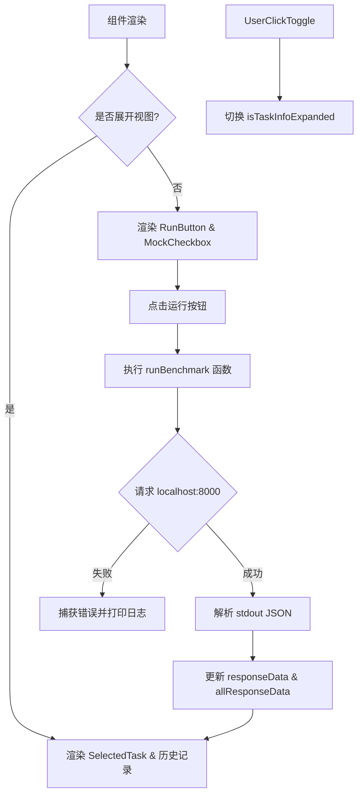
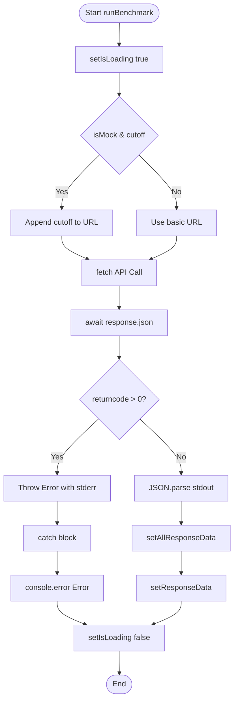
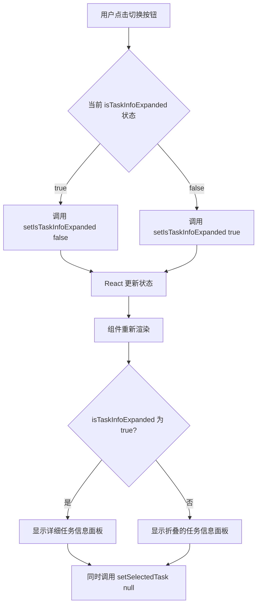
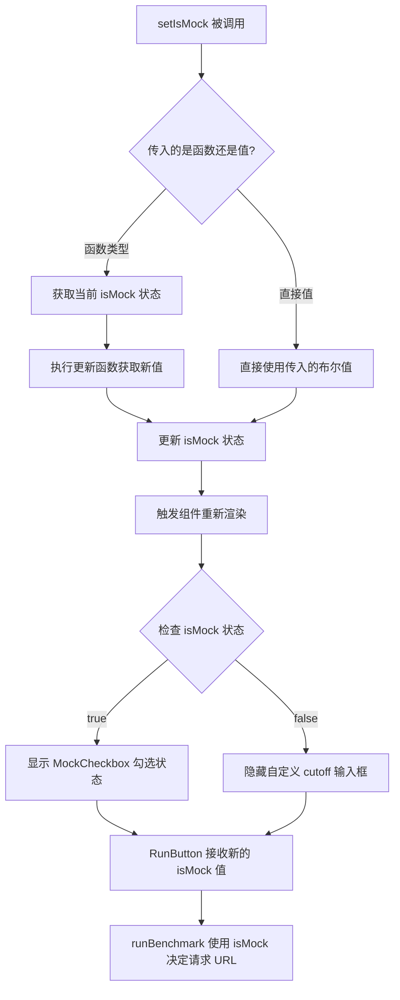
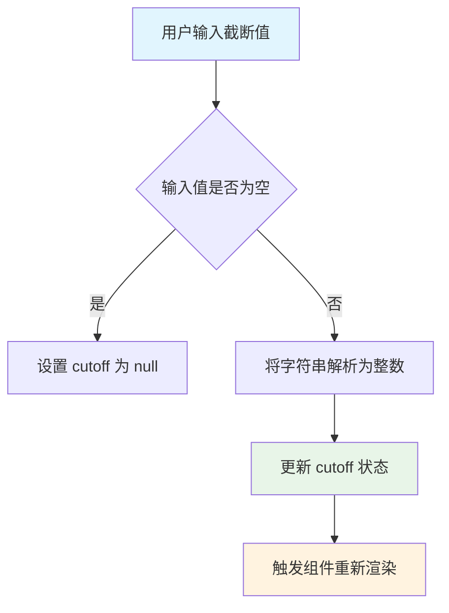
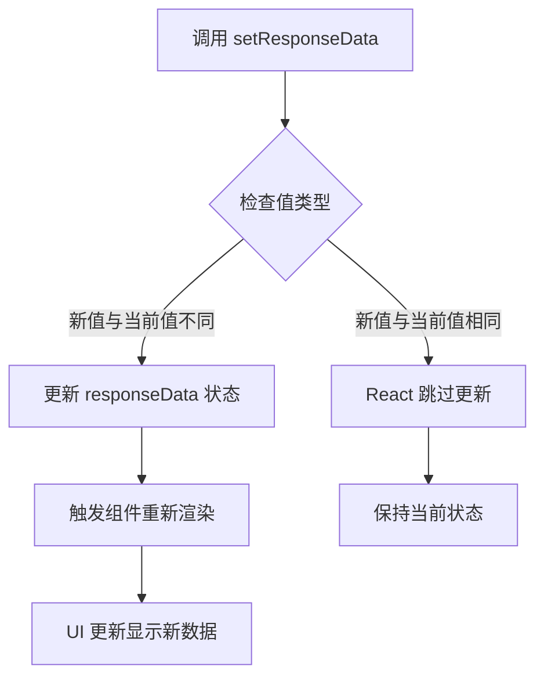

# `.\AutoGPT\classic\benchmark\frontend\src\components\index\TaskInfo.tsx` 详细设计文档

这是一个 React 功能组件，用于管理基准测试任务的执行与展示。它通过内部状态管理模拟模式开关、任务运行状态、结果数据及历史记录，并提供了展开/收起详情面板的交互功能，同时集成了对本地后端 API 的异步调用。

## 整体流程



## 类结构

```
ParentComponent (Layout)
└── TaskInfo (主容器组件)
    ├── RunButton (运行按钮)
    ├── MockCheckbox (模拟开关)
    ├── SelectedTask (任务详情展示)
    ├── RunData (单次结果展示)
    └── UI Elements (Header, ToggleButton, etc.)
```

## 全局变量及字段


### `TaskDetails`
    
容器 styled-component

类型：`styled-component (div)`
    


### `Header`
    
标题 styled-component

类型：`styled-component (h5)`
    


### `ToggleButton`
    
切换按钮 styled-component

类型：`styled-component (button)`
    


### `BenchmarkWrapper`
    
运行区域包装器

类型：`styled-component (div)`
    


### `CutoffInput`
    
输入框 styled-component

类型：`styled-component (input)`
    


### `Detail`
    
描述文本 styled-component

类型：`styled-component (p)`
    


### `CheckboxWrapper`
    
选项卡包装器 styled-component

类型：`styled-component (label)`
    


### `TaskInfo.selectedTask`
    
当前选中的任务数据

类型：`TaskData | null`
    


### `TaskInfo.isTaskInfoExpanded`
    
面板是否展开

类型：`boolean`
    


### `TaskInfo.isMock`
    
是否开启模拟模式

类型：`boolean`
    


### `TaskInfo.isLoading`
    
请求加载状态

类型：`boolean`
    


### `TaskInfo.allResponseData`
    
所有历史运行结果

类型：`any[]`
    


### `TaskInfo.responseData`
    
最近一次运行结果

类型：`any`
    


### `TaskInfo.cutoff`
    
自定义截断值

类型：`number | null`
    


### `TaskInfo.runBenchmark`
    
异步函数，发起 fetch 请求获取后端数据并更新状态

类型：`async function`
    
    

## 全局函数及方法


### `TaskInfo.runBenchmark`

该函数是组件 `TaskInfo` 的核心业务逻辑方法，负责执行基准测试（Benchmark）。它通过 `fetch` API 向本地后端服务（`localhost:8000`）发送异步请求，根据当前组件状态（是否模拟、截止时间等）构建 URL，处理返回的 JSON 数据，并根据返回码判断执行是否成功，最终将结果更新至 React 状态中以驱动 UI 渲染。

参数：
- `{无显式参数}`：该函数不接受显式参数，但它依赖于闭包中的变量 `isMock`、`cutoff`、`allResponseData` 以及状态更新函数。

返回值：`Promise<void>`，该函数没有显式的返回值（return value），主要通过副作用（Side Effect）更新组件状态。

#### 流程图



#### 带注释源码

```typescript
  /**
   * 执行基准测试的核心异步函数。
   * 1. 设置加载状态为 true。
   * 2. 根据 isMock 和 cutoff 构建请求 URL。
   * 3. 发送 fetch 请求。
   * 4. 解析响应，检查后端返回的 returncode。
   * 5. 如果成功，解析 stdout (JSON) 并更新状态。
   * 6. 如果失败，捕获错误并打印。
   * 7. 最后设置加载状态为 false。
   */
  const runBenchmark = async () => {
    // 1. 开始加载，禁用按钮防止重复点击
    setIsLoading(true);
    try {
      // 2. 构建 URL，默认包含 mock 参数
      let url = `http://localhost:8000/run?mock=${isMock}`;
      // 如果存在 cutoff 且不是 Mock 模式，则追加 cutoff 参数
      cutoff && !isMock && (url += `&cutoff=${cutoff}`);
      
      // 3. 发起网络请求
      const response = await fetch(url);
      const data = await response.json();

      // 4. 检查后端处理结果状态码
      if (data["returncode"] > 0) {
        // 5. 如果失败，抛出错误（将进入 catch 块）
        throw new Error(data["stderr"]);
      } else {
        // 6. 如果成功，解析标准输出作为 JSON 对象
        const jsonObject = JSON.parse(data["stdout"]);
        // 追加到所有运行历史记录
        setAllResponseData([...allResponseData, jsonObject]);
        // 更新当前显示的最新运行数据
        setResponseData(jsonObject);
      }
    } catch (error) {
      // 7. 错误处理：打印错误信息到控制台
      console.error("There was an error fetching the data", error);
    }
    // 8. 无论成功或失败，都结束加载状态
    setIsLoading(false);
  };
```


### TaskInfo.setIsTaskInfoExpanded

这是一个 React 状态更新函数，用于控制任务信息面板的展开或收起状态。当用户点击切换按钮时，该函数会切换 `isTaskInfoExpanded` 的布尔值，从而改变面板的宽度和显示内容。

参数：

- `value`: `boolean | ((prevState: boolean) => boolean)`，新的展开状态值或一个基于当前状态计算新状态的函数

返回值：`void`，无返回值

#### 流程图



#### 带注释源码

```typescript
// 在 TaskInfo 组件的 props 解构中获取
const TaskInfo: React.FC<TaskInfoProps> = ({
  selectedTask,
  isTaskInfoExpanded,        // 当前展开状态
  setIsTaskInfoExpanded,     // ← 状态更新函数
  setSelectedTask,
}) => {
  // ... 其他状态和逻辑
  
  return (
    <TaskDetails isExpanded={isTaskInfoExpanded}>
      {isTaskInfoExpanded ? (
        // 当面板展开时，显示切换按钮
        <ToggleButton
          onClick={() => {
            // 切换展开状态：true -> false
            setIsTaskInfoExpanded(!isTaskInfoExpanded);
            // 同时清空选中的任务
            setSelectedTask(null);
          }}
        >
          →
        </ToggleButton>
      ) : (
        // 当面板收起时，显示基准测试运行器
        <BenchmarkWrapper>
          {/* ... 运行按钮和复选框 */}
        </BenchmarkWrapper>
      )}
      
      {/* 根据展开状态显示或隐藏任务详情 */}
      {selectedTask && (
        <SelectedTask {...} />
      )}
      {/* ... 其他内容 */}
    </TaskDetails>
  );
};
```

#### 补充说明

该函数是 React 标准的 `useState` hook 派生的状态更新函数（`setState` function），符合以下特征：

1. **函数类型**: `React.Dispatch<React.SetStateAction<boolean>>`
2. **调用方式**: 可以接收布尔值直接赋值，也可以接收一个函数来基于前一个状态计算新值
3. **状态影响**: 
   - `isTaskInfoExpanded = true`: 面板展开，宽度变为 50% (`w-1/2`)，显示详细任务信息
   - `isTaskInfoExpanded = false`: 面板收起，宽度变为 25% (`w-1/4`)，显示基准测试运行器


### `setSelectedTask`

清空当前选中的任务，将 `selectedTask` 状态设置为 `null`，从而重置任务选择。

参数：
- 无显式参数（调用时传入 `null` 作为参数）

返回值：`void`，不返回任何值，用于更新 React 状态

#### 流程图

```mermaid
flowchart TD
    A[用户点击 ToggleButton] --> B[触发 onClick 回调函数]
    B --> C[执行 setIsTaskInfoExpanded(!isTaskInfoExpanded)]
    C --> D[执行 setSelectedTask(null)]
    D --> E[将 selectedTask 状态更新为 null]
    E --> F[组件重新渲染, SelectedTask 组件卸载]
```

#### 带注释源码

```tsx
// 点击展开/收起按钮时触发
onClick={() => {
  // 切换任务详情面板的展开状态
  setIsTaskInfoExpanded(!isTaskInfoExpanded);
  // 清空选中任务，将 selectedTask 设置为 null
  setSelectedTask(null);
}}
```


### `TaskInfo.setIsMock`

此函数是 React 函数组件 `TaskInfo` 中的状态更新函数，通过 `useState` hook 生成，用于切换 Mock 模式的状态（启用/禁用模拟数据），进而影响基准测试的行为和数据获取逻辑。

参数：

- `value`：`boolean | ((prevState: boolean) => boolean)`，新的 Mock 状态值，可以是直接的布尔值或一个接收前一个状态并返回新状态的函数

返回值：`void`，无返回值

#### 流程图



#### 带注释源码

```tsx
// 在 TaskInfo 组件内部
const [isMock, setIsMock] = useState<boolean>(false);
// useState hook 返回的第二个元素 setIsMock
// 用于更新 isMock 状态变量

// setIsMock 的使用场景 1: 在 runBenchmark 中根据 isMock 决定请求参数
const runBenchmark = async () => {
  setIsLoading(true);
  try {
    // 根据 isMock 状态决定是否使用 mock 模式
    let url = `http://localhost:8000/run?mock=${isMock}`;
    // 只有在非 Mock 模式下才添加 cutoff 参数
    cutoff && !isMock && (url += `&cutoff=${cutoff}`);
    const response = await fetch(url);
    const data = await response.json();
    // ...
  } catch (error) {
    console.error("There was an error fetching the data", error);
  }
  setIsLoading(false);
};

// setIsMock 的使用场景 2: 传递给子组件 MockCheckbox
<MockCheckbox isMock={isMock} setIsMock={setIsMock} />

// setIsMock 的使用场景 3: 传递给子组件 SelectedTask
<SelectedTask
  selectedTask={selectedTask}
  isMock={isMock}
  setIsMock={setIsMock}
  // ...
/>

// setIsMock 的使用场景 4: 根据 isMock 状态条件渲染 UI
{!isMock && (
  <CheckboxWrapper>
    <p>Custom cutoff</p>
    <CutoffInput
      type="number"
      placeholder="Leave blank for default"
      value={cutoff ?? ""}
      onChange={(e) =>
        setCutoff(e.target.value ? parseInt(e.target.value) : null)
      }
    />
  </CheckboxWrapper>
)}
```


### `setCutoff`

`setCutoff` 是 React 函数组件 `TaskInfo` 中的一个状态更新函数，用于更新截断值（cutoff）状态。该函数接收一个值（数字或 null），将其转换为适当的类型后更新组件的 `cutoff` 状态。

参数：

- `value`：`number | null | string`，要设置的截断值。可以是数字、null（当清除输入时），或者从输入框接收的字符串值

返回值：`void`，无返回值（useState 的 setter 函数不返回任何值）

#### 流程图



#### 带注释源码

```typescript
// 在 TaskInfo 组件内部定义的状态
const [cutoff, setCutoff] = useState<number | null>(null);

// CutoffInput 组件的 onChange 事件处理
// 当用户输入截断值时触发
onChange={(e) =>
  // e.target.value 是输入框的字符串值
  // 如果有值，使用 parseInt 转换为数字
  // 如果为空（空字符串），设置 cutoff 为 null
  setCutoff(e.target.value ? parseInt(e.target.value) : null)
}

// 完整的事件处理代码片段：
<CutoffInput
  type="number"
  placeholder="Leave blank for default"
  value={cutoff ?? ""}  // 如果 cutoff 为 null，显示空字符串
  onChange={(e) =>
    setCutoff(e.target.value ? parseInt(e.target.value) : null)
  }
/>
```

#### 使用场景说明

`setCutoff` 在以下场景中被使用：

1. **用户输入截断值**：当用户在输入框中输入数字时，会将字符串转换为数字并更新状态
2. **清除截断值**：当用户清空输入框时，将 cutoff 设置为 null，表示使用默认值
3. **API 请求中使用**：在 `runBenchmark` 函数中，如果 cutoff 不为 null 且不是 mock 模式，会将 cutoff 值附加到 API 请求 URL 中：

```typescript
cutoff && !isMock && (url += `&cutoff=${cutoff}`);
```


### `setResponseData`

`setResponseData` 是 React 函数组件 `TaskInfo` 中通过 `useState` hook 声明的状态更新函数，用于更新存储当前运行结果的响应数据状态。

参数：

- `value`：`any`，要设置的新的响应数据值，可以是任何类型，通常是解析后的 JSON 对象

返回值：`void`，无返回值

#### 流程图



#### 带注释源码

```typescript
// 在 TaskInfo 组件内部声明的状态变量
const [responseData, setResponseData] = useState<any>();

// useState 返回的 setter 函数，用于更新 responseData 状态
// 参数 value: any - 要设置的新值
// 返回值: void
// 源码等价于：
/**
 * setResponseData 函数
 * @param {any} value - 新的响应数据值
 * @returns {void}
 * 
 * 内部实现逻辑：
 * function setResponseData(value) {
 *   // React 会比较新旧值
 *   // 如果值发生变化，触发重新渲染
 *   // 更新 React 内部状态存储
 * }
 */

// 使用示例 1: 在 runBenchmark 中设置新的运行结果
setResponseData(jsonObject);

// 使用示例 2: 通过 props 传递给子组件 SelectedTask
// <SelectedTask
//   setResponseData={setResponseData}  // 允许子组件更新父组件状态
//   ...
// />
```


### `TaskInfo.runBenchmark`

异步函数，发起 HTTP GET 请求从后端获取基准测试运行结果，解析响应数据并更新组件状态。

参数：此函数无显式参数，但依赖以下组件状态：

- `isMock`：布尔值，控制是否使用模拟数据
- `cutoff`：数字 | null，自定义截止时间参数
- `allResponseData`：数组，存储所有历史运行数据

返回值：`void`，无返回值（通过副作用更新状态）

#### 流程图

```mermaid
flowchart TD
    A[开始 runBenchmark] --> B[设置 isLoading = true]
    B --> C{构建请求 URL}
    C --> D[基础 URL: http://localhost:8000/run?mock={isMock}]
    D --> E{cutoff 存在且非 mock 模式?}
    E -->|是| F[追加 &cutoff={cutoff} 参数]
    E -->|否| G[跳过 cutoff 参数]
    F --> H[发起 fetch 请求]
    G --> H
    H --> I[等待响应]
    I --> J[解析响应 JSON]
    J --> K{检查 returncode}
    K -->|returncode > 0| L[抛出错误]
    K -->|returncode = 0| M[解析 stdout 为 JSON 对象]
    L --> N[捕获错误并 console.error]
    M --> O[更新 allResponseData 状态]
    O --> P[更新 responseData 状态]
    N --> Q[设置 isLoading = false]
    P --> Q
    Q --> R[结束]
```

#### 带注释源码

```typescript
const runBenchmark = async () => {
  // 1. 设置加载状态为 true，显示加载指示器
  setIsLoading(true);
  
  try {
    // 2. 构建请求 URL，包含 mock 参数
    let url = `http://localhost:8000/run?mock=${isMock}`;
    
    // 3. 如果存在 cutoff 参数且不是 mock 模式，则追加 cutoff 参数
    cutoff && !isMock && (url += `&cutoff=${cutoff}`);
    
    // 4. 发起异步 fetch 请求获取后端数据
    const response = await fetch(url);
    
    // 5. 解析响应体为 JSON 格式
    const data = await response.json();

    // 6. 检查后端返回的错误码
    if (data["returncode"] > 0) {
      // 7. 如果有错误，抛出异常（包含 stderr 错误信息）
      throw new Error(data["stderr"]);
    } else {
      // 8. 成功时，解析 stdout 字段中的 JSON 对象
      const jsonObject = JSON.parse(data["stdout"]);
      
      // 9. 更新历史运行数据数组（追加新数据）
      setAllResponseData([...allResponseData, jsonObject]);
      
      // 10. 更新当前运行数据状态（用于显示最新结果）
      setResponseData(jsonObject);
    }
  } catch (error) {
    // 11. 捕获并记录任何错误（网络错误、解析错误或后端返回的错误）
    console.error("There was an error fetching the data", error);
  }
  
  // 12. 无论成功或失败，都重置加载状态
  setIsLoading(false);
};
```

## 关键组件


### 状态管理 (State Management)

使用 React useState hooks 管理组件内部状态，包括 isMock（模拟模式开关）、isLoading（加载状态）、allResponseData（所有运行结果）、responseData（最新运行结果）和 cutoff（自定义截止值）

### 基准测试执行 (Benchmark Execution)

runBenchmark 异步函数负责向本地服务器发送请求，根据 isMock 和 cutoff 参数构建 URL，解析返回的 JSON 数据，并更新响应状态

### 任务信息展开/收起 (Task Expansion/Collapse)

通过 isTaskInfoExpanded 状态控制任务详情面板的展开与收起，使用 ToggleButton 切换按钮实现展开/收起功能

### 自定义截止值输入 (Custom Cutoff Input)

提供数字输入框允许用户设置自定义 cutoff 值，仅在非模拟模式下显示，与服务器端基准测试交互

### 历史运行记录展示 (Historical Run Display)

分别展示最新一次运行结果 (Previous Run) 和所有历史运行记录 (All Runs)，通过 RunData 组件渲染

### 模拟模式切换 (Mock Mode Toggle)

使用 MockCheckbox 组件切换 isMock 状态，影响基准测试请求的 URL 参数和自定义截止值输入框的显示


## 问题及建议


### 已知问题

- **类型安全问题**：`allResponseData` 和 `responseData` 使用 `any` 类型，缺乏类型安全，应使用具体的接口定义响应数据结构
- **状态更新风险**：使用 `[...allResponseData, jsonObject]` 展开运算符更新状态，在快速连续调用时可能因闭包问题导致数据丢失
- **JSON解析无错误处理**：`JSON.parse(data["stdout"])` 未包裹在 try-catch 中，若返回数据格式异常会导致未捕获的运行时错误
- **不推荐使用 index 作为 key**：在 map 渲染历史记录时使用 `key={index}`，这对动态列表是反模式
- **错误信息未展示给用户**：仅通过 `console.error` 记录错误，用户无法感知请求失败
- **API调用缺少基础校验**：未检查 HTTP 响应状态码，未设置请求超时，未对 response.ok 进行判断
- **数据无限增长**：`allResponseData` 数组无限制增长，长时间使用会导致内存问题
- **UI 反馈不完善**：加载状态下虽显示 isLoading 但未禁用按钮，用户可重复点击发送请求
- **组件职责过重**：TaskInfo 同时处理任务展示、历史记录、基准测试运行等多种职责
- **输入验证缺失**：cutoff 输入框未做边界值验证，可能传入负数或极大值

### 优化建议

- 定义明确的响应数据接口（如 `RunResponse`），替换所有 `any` 类型
- 使用函数式状态更新 `setAllResponseData(prev => [...prev, jsonObject])` 避免闭包陷阱
- 将 `JSON.parse` 包裹在 try-catch 中并提供优雅的错误处理
- 使用唯一标识符（如 runId）作为 key，而非数组索引
- 增加用户可见的错误提示组件（如 Toast 通知）
- 添加响应状态码检查和请求超时设置（建议 10-15 秒）
- 设置历史记录上限（如保留最近 50 条），或提供清除历史的功能
- 加载状态下禁用 RunButton 组件
- 考虑拆分组件，将基准测试逻辑提取为自定义 Hook（如 useBenchmark）
- 为 cutoff 输入添加 min/max 验证和范围限制
- 提取魔法字符串（如 URL、错误信息）为常量配置
- 考虑添加 PropTypes 或确保 TypeScript 类型完整覆盖

## 其它


### 设计目标与约束

该组件的主要设计目标是提供一个交互式的任务信息展示和基准测试运行面板，支持展开/收起切换、模拟模式切换、自定义cutoff参数设置以及历史运行数据展示。设计约束包括：依赖本地后端服务（localhost:8000）、使用Tailwind CSS进行样式管理、需要父组件传递selectedTask等状态管理props、组件需要展示响应式布局（展开时w-1/2，收起时w-1/4）。

### 错误处理与异常设计

组件实现了三层错误处理机制：第一层是fetch请求的网络错误，通过try-catch捕获并使用console.error输出错误信息；第二层是HTTP响应状态码检查，当returncode大于0时抛出包含stderr的错误；第三层是JSON解析错误，使用JSON.parse处理stdout数据时可能抛出的异常。错误发生时组件不会崩溃，isLoading状态会被重置为false以恢复UI交互能力。

### 数据流与状态机

组件内部维护5个主要状态：isMock（模拟模式开关）、isLoading（加载状态）、allResponseData（所有历史运行数据数组）、responseData（最新运行数据对象）、cutoff（自定义截止值）。状态转换流程为：初始状态 -> 用户点击RunButton -> isLoading=true -> 调用runBenchmark -> 成功则更新responseData和allResponseData -> isLoading=false，或者失败则捕获异常 -> isLoading=false。父组件通过props传递selectedTask和isTaskInfoExpanded控制显示逻辑。

### 外部依赖与接口契约

组件依赖以下外部资源：React hooks（useState）、tailwind-styled-components样式库、TaskData类型定义、以及4个子组件（RunData、SelectedTask、MockCheckbox、RunButton）。外部API接口为GET请求 `http://localhost:8000/run`，支持query参数mock（布尔值）和cutoff（可选数字），响应格式为JSON包含returncode、stdout、stderr字段。

### UI/UX 设计考量

组件采用响应式设计，通过isExpanded属性动态调整宽度（w-1/4或w-1/2）。视觉层次分明：顶部为操作区域（RunButton、MockCheckbox）、中部为任务详情展示（SelectedTask）、底部为历史运行数据列表。使用过渡动画（transition-all duration-500 ease-in-out）提供流畅的展开收起体验。颜色方案依赖Tailwind默认灰色系，聚焦状态使用蓝色边框提示。

### 性能考虑

潜在的性能优化点：allResponseData使用数组展开运算符创建新数组，每次运行都会复制整个数组，大数据量时可能影响性能，建议使用函数式更新或_immutable_库。cutoff输入使用parseInt解析，可能产生不必要的重新渲染。JSON.parse在主线程执行，大型JSON数据可能造成UI卡顿，建议使用Web Worker或流式解析。

### 安全性考虑

组件存在以下安全考量：fetch请求未设置超时时间，可能导致请求挂起；未对用户输入的cutoff值进行范围验证；API响应数据直接使用any类型，未进行严格的类型安全检查；localhost硬编码不适合多环境部署。建议：添加请求超时控制、输入验证、使用具体类型替代any、配置环境变量管理API地址。

### 可访问性考虑

组件的可访问性支持有限：CutoffInput缺少aria-label标签描述；ToggleButton和RunButton缺少aria-pressed或aria-expanded状态指示；错误信息仅输出到console，未向用户展示；所有交互元素缺少键盘导航支持。建议添加适当的ARIA属性、错误提示UI、键盘事件处理。

### 测试策略

建议为该组件编写以下测试用例：render测试验证初始状态显示正确；状态测试验证各useState初始值；交互测试验证点击RunButton触发fetch；mock模式切换测试；cutoff输入变化测试；展开收起切换测试；错误场景测试（网络失败、API返回错误、JSON解析失败）；性能测试验证大数组渲染。

### 部署配置

该组件用于React前端项目，依赖Node.js环境。部署时需确保：后端服务（localhost:8000）可访问或配置正确的API地址环境变量；Tailwind CSS构建配置正确；生产环境移除console.error或配置日志级别；配置适当的CORS策略允许前端访问API。

### 监控与日志

建议添加以下监控点：fetch请求耗时统计；API错误率监控；用户操作行为埋码（点击RunButton次数、mock模式使用频率）；组件渲染性能监控（使用React Profiler）；错误边界捕获未处理的异常。日志策略：开发环境保留console.error，生产环境使用日志服务收集。


    